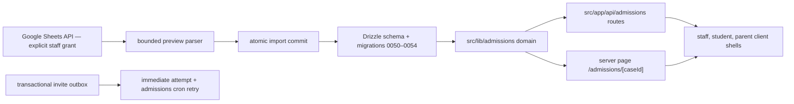

# University Admissions Case Management — Design

> **Status:** Migrations `0053–0054` are applied in production; parity code is not
> deployed. Deployment/family rollout is blocked on `RESEND_API_KEY`,
> `ADMISSIONS_EMAIL_FROM`, `ADMISSIONS_EMAIL_REPLY_TO`, and
> `NEXT_PUBLIC_APP_URL`. Family portals remain closed.
> **PRD:** [Casemanagementsystem_prd.md](Casemanagementsystem_prd.md)

## 1. Architecture

The feature is integrated into the existing Next.js 16 App Router, Auth.js,
Drizzle/Neon, Tailwind/shadcn, Vitest, and Vercel Cron stack. It adds no
application-framework dependency.

| Layer | Location | Responsibility |
|---|---|---|
| schema | `src/lib/db/schema.ts`, `drizzle/0050–0054*.sql` | relational constraints, JSON payload columns, idempotency/outbox ledgers, and safe test-status backfill |
| domain | `src/lib/admissions/*` | access, validation, transactions, audit, projections, import, notifications |
| API | `src/app/api/admissions/**` | auth → parse → Zod → domain response |
| internal cron | `src/app/api/internal/admissions-notifications` | outbox retry, deadline reminders, Sunday digest |
| server routing | `src/app/(app)/admissions` | role branch and fresh per-request access |
| UI | `src/components/admissions` | desktop staff workspace; mobile student/parent shells |

Per-request membership and parent payloads are deliberately uncached. Revocation,
portal closure, lifecycle, and sharing changes must be visible on the next request.

## 2. Authentication and authorization

Ordinary Google OAuth uses `openid email profile`. Sign-in resolution is admin
allowlist → active admissions counselor → teacher contact → active admissions
membership → deny. The JWT stores role and page prefixes for navigation only.
An explicit **Connect Sheets** action asks for Sheets scope; tokens are
persisted only for admins/counselors, never students/parents.

`requireCaseAccess` re-queries the case, membership, counselor registry,
portal, and lifecycle on every case request. Role order is
`parent < student < counselor < admin`.

| State | Family rule |
|---|---|
| portal closed | deny student/parent |
| active/committed + open | normal role-shaped access |
| completed + open | reads allowed; `assertCaseMutationAllowed` denies writes |
| withdrawn/archived | deny all family requests |

Admins may reach every non-deleted case. Counselors need both an active
membership on that case and an active global registry row.

Write ownership:

- Students edit their profile/self-report, activities, awards, essays, test
  sittings, research/interest logs, scholarships (not outcome/amount), and
  student-owned requirement/task state.
- Counselors/admins own academics, college list/rounds, official application
  events/decisions, verification/release, financial aid, access/lifecycle/
  portal, meetings, notes, direct messages, and imports.
- Parents have no mutation surface.
- Admins own cohorts, counselor registry, checklist templates, and audit reads.

## 3. Data design

The domain has **36 snapshot-independent `admissions_*` tables**. Cross-domain
Wise `wise_student_key` and IPEDS `unit_id` are soft references. Complete
columns/indexes: [erd-university-admissions.md](reference/database/erd-university-admissions.md).

### Core groups

| Group | Tables |
|---|---|
| identity/access | `admissions_cohorts`, `admissions_students`, `admissions_cases`, `admissions_case_members`, `admissions_counselors` |
| checklist/casework | `admissions_checklist_templates`, `admissions_template_items`, `admissions_case_tasks`, `admissions_case_meetings` |
| content | `admissions_notes`, `admissions_announcements`, `admissions_resources`, `admissions_self_report_sections` |
| governance | `admissions_audit_log`, `admissions_notification_log`, `admissions_notification_outbox`, `admissions_notification_runs` |

`admissions_cases.family_portal_open` defaults false. Opening metadata records
when/by whom it was opened. A partial unique index permits one
active/committed case per student.

### Student record

| Table | Design |
|---|---|
| `admissions_academic_records` | strict JSON union (`us`, `ib`, `a_level_igcse`), effective date, soft deletion, unique live case/system/date |
| `admissions_activities` | master activity plus Common App/UC blocks and top-ten rank |
| `admissions_awards` | separate awards, top-five rank, UC length checks, staff-only internal notes |
| `admissions_test_sittings` | typed score JSON, subject, state, regular/late deadlines, release flag, accommodations, soft deletion |
| `admissions_essays` | tracking metadata and Docs pointer; `shared_with_family` gates parent link |
| `admissions_self_report_sections` | guided JSON payload/state; family-sharing gates approved About You values |

Typed academic/test payloads live in client-safe shared Zod modules and are
validated again in domain mutations. SAT/ACT/TOEFL/IELTS aggregates are derived.

### College and money

| Table | Design |
|---|---|
| `admissions_college_list_items` | institution, round/deadline/state/category, majors, admissions/portal URLs |
| `admissions_college_research` | one fit/sources/visit/opportunities/questions record per college |
| `admissions_interest_events` | dated typed demonstrated-interest log |
| `admissions_college_requirements` | generic non-canonical requirement with owner/status/verification |
| `admissions_application_events` | append-only submitted/decision/commit chain |
| `admissions_recommenders`, `admissions_recommender_colleges`, `admissions_college_docs` | canonical recommendation/transcript/school-report/score-send completeness |
| `admissions_essay_prompt_catalog` | global institution/program/cycle prompt source |
| `admissions_scholarships` | case scholarship, optionally tied to a college |
| `admissions_financial_aid_offers` | one COA/gift/loan/work-study/net comparison per college |

Generic requirements do not duplicate essays, recommendations, transcript/
school-report, or score-send status. No schema/API field stores a portal password.

### Import ledger

`admissions_import_runs` records source identity/fingerprint/policy/summary;
`admissions_import_issues` stores validation context; and
`admissions_import_mappings` records source-to-target lineage. The unique key
on case + spreadsheet id + source fingerprint makes an unchanged repeat a no-op.

## 4. Transaction and audit model

`withAuditedTransaction` pairs the entity mutation and append-only audit row.
Shared records accept `expectedUpdatedAt` and conflict on stale edits.

Atomic operations include case/member/portal/lifecycle writes; opening portal
plus invite rows; member email replacement plus replacement invite; committed
event plus pointer/status; academic/award/testing/college/money changes;
prompt catalog changes; and complete workbook import targets/ledger/mappings.
Email delivery occurs after commit and cannot roll back the business change.

## 5. Transactional notification outbox

Opening a case queues invites for invited/bounced student and parent members.
Adding/changing/reactivating/resending a family member while open also queues
one. Payload is minimal (student first name); dedupe key is unique.

Delivery claims a row with a 15-minute processing lease, rechecks membership,
sends with the dedupe key as Resend `Idempotency-Key`, and marks sent or failed.
Retry backoff is 1 minute, 5 minutes, 30 minutes, 2 hours, then capped at 12
hours. Obsolete revoked/activated/replaced rows are terminally skipped.

Counselor direct messages use the same durable path. The API requires a
client-generated UUID and derives a unique case-scoped dedupe key. The message
payload, recipient membership, and audit metadata commit atomically before the
first provider attempt. Identical request replays reuse the row; changed
content under the same key conflicts. Every retry rechecks the member email,
active status, case lifecycle, and family-portal state before sending.

## 6. Parent projection

`buildParentDashboard` is the only family case projection. It builds fields
explicitly, never spreads database rows.

Approved: profile/shared About You, academics, progress/checklist/deadlines,
colleges/majors/application state/decisions/completeness/requirements,
recommenders, essay metadata (Docs link only when shared), activities, awards,
released testing, scholarships/aid totals, announcements, and shared notes.

Excluded: staff-only notes, audit, member emails, internal ids, Wise/OAuth,
accommodations, unreleased score values/details, private reflection, internal
award notes, aid notes, and unshared Docs links.

`listLinkedFamilyCases` emits safe href/display fields only for active parent
memberships on open active/committed/completed cases. Destination access is
rechecked.

## 7. One-time workbook import

The counselor/admin explicitly connects read-only Sheets and pastes a copied
student workbook URL. The reader uses bounded A1 ranges for Meetings, Tasks,
About You, Academics, Tests, Activities, Majors & Careers, College Criteria,
Research Notes, Demonstrated Interest, `ApplicationTracker!D33:DD52`, Essay
Prompts, Financial Aid Comparisons, and Scholarship Tracker.

Blank template rows, formula/reference-only data, hidden lookup tabs, and
password cells are ignored. There is no recurring synchronization.

Preview normalizes dates/amounts, maps supported values and application
columns, and computes a stable SHA-256 source fingerprint. It returns metadata,
counts, parsed entities, field changes, and issues without writing.

Commit reloads the source, requires the preview fingerprint, and uses an
explicit `preserve_existing` or `overwrite_existing` policy. One transaction
writes supported targets, import ledger, issues/mappings, and audit. Failure
rolls all of it back; an already committed fingerprint returns `noOp: true`.

## 8. API and role-specific UI

There are **34 admissions route-handler files** plus the protected notification
cron. Method/access inventory:
[reference/api/university-admissions.md](reference/api/university-admissions.md).

The staff workspace has five URL-backed groups:

1. **Overview** — status, progress, deadlines, announcements.
2. **Student** — profile/self-report, academics, testing, activities, awards.
3. **Colleges & Applications** — list, research, interest, requirements,
   recommenders, decisions, essays/prompts.
4. **Money** — scholarships and aid comparisons.
5. **Casework** — checklist, meetings, notes, people/access, lifecycle, audit,
   communications, import.

Students retain mobile bottom navigation and role-owned edit surfaces; This
Week actions deep-link to the target item. Parents have a separate bilingual
read-only shell with sibling switcher, role label, and sign-out.

## 9. Deployment

1. Confirm migrations `0050–0054` are installed; `0053` adds the parity schema
   and `0054` safely restores legacy sitting state.
2. Verify scored live sittings are `score_received`, unscored live past
   sittings are `taken`, and future unscored sittings remain `planned`.
3. Run `npm run check:admissions-production`.
4. Deploy code with all family portals closed.
5. Verify notification cron/outbox, audit, and access matrices.
6. Pilot one fresh and one imported case across all four roles.
7. Open portals individually.

The readiness command validates environment values, migration hashes, latest
notification-run status, failed outbox count, and open portal count. Detailed
operations: [admissions-import-rollout.md](operations/admissions-import-rollout.md).

_Verified against migrations `0053–0054` and the parity implementation on
2026-07-10._
