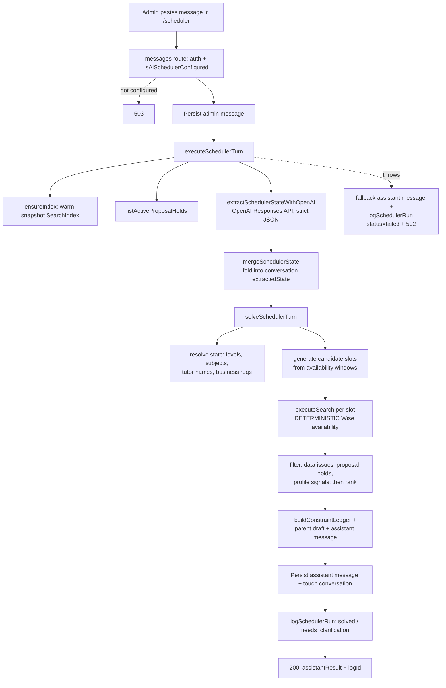

# AI Scheduler

**Status: experimental** — LLM-backed conversational scheduling assistant plus the `/scheduler` workspace and `/scheduler/metrics` readout. Newest, least-settled feature; the evaluation harness is still iterating.

## Purpose

The AI Scheduler turns a pasted parent/admin scheduling chat ("can my Y6 do English writing every Saturday morning?") into a **bounded, Wise-backed tutor search** and a ready-to-send parent reply. An admin pastes (or triages from LINE) the request as a message in a conversation; the assistant extracts structured scheduling state with an LLM, the application — **not** the model — runs the availability search against the warm snapshot index, and the assistant drafts both an internal summary and a parent-facing message with ranked options.

The hard rule that shapes the whole feature: **the LLM never decides availability.** Its job is parsing/extraction only. Every "is this tutor free" decision goes through the deterministic search engine on normalized Wise data, so the fail-closed guarantees of the rest of the platform still hold. This is stated to the model in both prompts ("Never decide tutor availability", `src/lib/ai/scheduler.ts:512`; "You never decide availability", `src/lib/ai/scheduler-conversation.ts:2361`) and enforced structurally — the model output is a JSON state object, and `solveSchedulerTurn` is what calls `executeSearch`.

Primary users are the same non-technical admin staff who use tutor search/compare, plus the morning LINE-review triage: the `/scheduler` page doubles as the worklist for pending LINE scheduler reviews (see [line-integration](line-integration.md)). The whole feature is flag-gated and degrades to "manual search only" when not configured.

## Conceptual data model

Four tables, all defined in the shared Drizzle schema (`src/lib/db/schema.ts`) and owned by this feature. For exact columns, enums, constraints, indexes, and FK delete behaviour see the ERD and database reference: [docs/reference/database/erd-ai-and-proposals.md](../reference/database/erd-ai-and-proposals.md).

- **Scheduler conversation** — one chat session about one customer's scheduling request. Holds the customer context (parent/student/contact), free-text notes, a `status` (active/archived), and an **`extractedState` jsonb** that accumulates the assistant's evolving structured understanding of the request across turns. This jsonb is the load-bearing memory of the conversation: each turn reads it as prior state, merges the new extraction into it, and writes it back.
- **Scheduler message** — one message in a conversation (`role`: admin / parent / assistant / system). Assistant messages carry a `structuredPayload` jsonb (the full solver result) alongside the rendered text, plus `model` and `latencyMs`.
- **Scheduler run** — one audit/observability record per solver invocation. Captures `status` (`solved` / `needs_clarification` / `failed`), a **PII-redacted** input preview, scheduler/prompt versions, a latency breakdown (db/model/search), and the parsed + solver payloads. This is the table the metrics endpoint aggregates. Writes are best-effort: `logSchedulerRun` swallows DB errors and returns `"unlogged"` rather than failing the turn (`src/lib/ai/scheduler-data.ts:529-532`).
- **Scheduler feedback** — one labeled-outcome event per human action on a suggestion (accept / edit / reject / dismiss), with selected/rejected tutor ids, the edited draft, rejection reason + staff correction, and evaluation signals (`classifierConfidence`, `timeToReviewMs`). This is the correction trail the scheduler is evaluated against; it also carries the cross-domain `lineReviewId` link back into the LINE domain.

The conversation is the cascade parent of its messages; runs and feedback hang off conversation/message/run with **set null** on delete, so the audit trail survives soft-deletion. Reads are mostly single-table; the conversation list additionally issues two follow-up `select()` queries against `lineSchedulerReviews` (`src/lib/ai/scheduler-data.ts:219-231`) and `lineContactStudentLinks` (`:237-245`) and folds them together in application code (`:248-271`) — there is no SQL JOIN — to compute the LINE-review rollups shown in the inbox.

On the read path the scheduler also consumes data it does **not** own: the in-memory `SearchIndex` (active snapshot — tutor groups, availability windows, qualifications, and denormalized tutor business profiles), active proposal holds (`src/lib/proposals/data.ts`, see [proposals](proposals.md)), and the filter/tutor facets derived from the index.

## API surface

All endpoints require an authenticated session (`await auth()` → `401`); there is no cron path — this is interactive admin UI. Full request/response contracts, status-code tables, and validation detail live in [docs/reference/api/ai-scheduler.md](../reference/api/ai-scheduler.md).

- `GET /api/ai-scheduler/conversations` — list conversations (with admin facets + LINE-review rollups), filterable by archive/scope/owner/sort/query. (`src/app/api/ai-scheduler/conversations/route.ts`)
- `POST /api/ai-scheduler/conversations` — create a manual conversation. (same file)
- `GET /api/ai-scheduler/conversations/[conversationId]` — fetch one conversation plus its full message history. (`src/app/api/ai-scheduler/conversations/[conversationId]/route.ts`)
- `PATCH /api/ai-scheduler/conversations/[conversationId]` — edit conversation fields, including `status` (archive/unarchive). (same file)
- `DELETE /api/ai-scheduler/conversations/[conversationId]` — **soft delete**: archives, never hard-deletes. (same file)
- `POST /api/ai-scheduler/conversations/[conversationId]/messages` — the core AI turn: append an admin message, extract state via OpenAI, solve against Wise data, persist admin+assistant messages and a run log. (`src/app/api/ai-scheduler/conversations/[conversationId]/messages/route.ts`)
- `POST /api/ai-scheduler/messages/[messageId]/feedback` — record accept/edit/reject feedback on an assistant message. (`src/app/api/ai-scheduler/messages/[messageId]/feedback/route.ts`)
- `GET /api/ai-scheduler/metrics` — aggregated observability: scheduler run metrics + LINE scheduler analytics + correction telemetry. (`src/app/api/ai-scheduler/metrics/route.ts`)

Note: the message route is the only one that touches OpenAI and the only one gated by `isAiSchedulerConfigured()` — it returns `503` when the scheduler is off (`messages/route.ts:59-61`).

## UI

Two pages under `src/app/(app)/scheduler/`, both async Server Components that authenticate, redirect to `/login` when unauthenticated, and render a client shell inside `<Suspense>`. Nav order (`src/components/layout/app-nav.tsx:17-19`): **Scheduler** (`/scheduler`), then **LINE AI Review** (`/line-review`), then **Scheduler Metrics** (`/scheduler/metrics`).

- **`/scheduler` → `SchedulerWorkspace`** (`src/components/scheduler/scheduler-workspace.tsx`, ~2.4k lines). The server page (`scheduler/page.tsx`) fetches the tutor list via `getTutorList()` and passes `aiSchedulerEnabled = isAiSchedulerConfigured()` down as a prop. The workspace is the operational center:
  - **LINE Review Queue** banner — pending LINE scheduler reviews with confidence badges, age, a "needs links" count, and false-negative promotion; selecting a review opens its linked conversation. It drives a set of `/api/line/*` endpoints (scheduler-reviews, contacts/student-links, classification-feedback, message promote).
  - **Conversation list** — sortable inbox (`review_priority` / `latest` / `admin` / `oldest_pending_line`) with admin facets and search.
  - **Chat thread + composer** — sends messages to the AI-turn endpoint. The composer and "send" button are **disabled when `aiSchedulerEnabled` is false** or the conversation is archived (`scheduler-workspace.tsx:2177`, `:2190`); a banner explains the scheduler is off (`:2061`).
  - **Assistant output** — renders the structured payload: ranked suggestions, optional date-range availability summary, the constraint ledger, warnings/questions, and the editable parent-message draft. Feedback (accept/edit/reject) posts to the feedback endpoint (`:837`).
  - **Right panel: Compare / Notes** — a one-click "open in compare" bridge. `buildSchedulerCompareFocusTarget` (`src/components/scheduler/scheduler-compare-focus.ts`) maps a suggestion (recurring weekday or one-time date) to `{ tutorIds, weekStart, activeDay }` and calls `compare.replaceCompare(...)` on the shared `useCompare` hook, embedding the same `ComparePanel` used by tutor-compare so an admin can eyeball the tutors' weeks (`scheduler-workspace.tsx:1754-1761`).
- **`/scheduler/metrics` → `SchedulerMetricsView`** (`src/components/scheduler/metrics-view.tsx`). A read-only correction-telemetry dashboard: it fetches `/api/ai-scheduler/metrics` and renders only the `correction` slice — accept/edit/reject/dismiss rates, avg/p50 time-to-review, and a confidence-band-vs-outcome table. (The endpoint also returns `scheduler` and `line` slices, which this view does not display.)

## Data flow

A single AI turn (`POST .../messages`) moves through the layers like this:

The orchestration seam is `executeSchedulerTurn` (`src/lib/ai/scheduler-service.ts:48-107`): it warms the index, kicks off the proposal-holds fetch, calls the one OpenAI extraction, merges state, then runs the deterministic solver — timing each phase into a `latencyBreakdownMs` (db / model / search) that flows into the run log and metrics. The bulk of the domain logic lives in `src/lib/ai/scheduler-conversation.ts` (the extraction schema, state merge, slot generation, search, ranking, ledger, and message builders).

A note on the code paths. There are **two live runtime entry points** plus a third dead surface inside `src/lib/ai/scheduler.ts`:

1. **Conversational turn (`/api/ai-scheduler/.../messages`)** — the primary path, driven by the **multi-turn extraction** in `scheduler-conversation.ts`. It borrows `scheduler.ts` only for shared helpers (`bangkokTodayIso`, `aiSchedulerModel`, `aiSchedulerReasoningEffort`, `isAiSchedulerConfigured`, `redactAiSchedulerInput`, `extractOutputText`).
2. **Single-shot search assistant (`POST /api/search/assistant`)** — a second, simpler live route that still depends on `scheduler.ts`'s **legacy request schema and response contract**. It imports `aiSchedulerRequestSchema`, `redactAiSchedulerInput`, `aiSchedulerModel`, and the types `AiSchedulerOption`/`AiSchedulerParsedRequest`/`AiSchedulerResponse`/`AiSchedulerSolvedRequest` (`src/app/api/search/assistant/route.ts:4-13`), runs one stateless solver turn via `executeSchedulerTurn({ currentState: {}, ... })` (`route.ts:169-174`), then serialises the solver result back into the legacy `AiSchedulerResponse` shape through `responseFromSchedulerResult` (`route.ts:101-133`). Its live client is the search-page panel `src/components/search/ai-scheduler-panel.tsx`, which imports `AiSchedulerOption`/`AiSchedulerResponse`/`AiSchedulerSolvedRequest` (`ai-scheduler-panel.tsx:8`) and POSTs to that route (`:87`). So `scheduler.ts`'s legacy **types + request schema** are load-bearing production surface, not just a helper module.
3. **Older single-shot parser functions** — `parseSchedulingRequestWithOpenAi` (`scheduler.ts:533`) and `normalizeAiSchedulerModelParse` (`:329`), with their bounded-search validation, are the genuinely superseded part: no non-test caller imports them (the conversational path replaced them, and `/api/search/assistant` uses `executeSchedulerTurn`, not the parser). They survive only for the unit tests in `scheduler.test.ts`. See Open Questions.

## Business rules & edge cases

- **Configuration gate / flag.** `isAiSchedulerConfigured()` requires `ENABLE_AI_SCHEDULER !== "false"` **and** a non-empty `OPENAI_API_KEY` (`src/lib/ai/scheduler.ts:477-480`). These are read **directly from `process.env`**, not through the centralized `src/lib/env.ts` schema (which knows nothing about them) — so the scheduler is opt-in/soft and its absence never breaks startup. Model and reasoning effort are also env-overridable: `OPENAI_SCHEDULER_MODEL` (default `gpt-5.4-mini`), `OPENAI_SCHEDULER_REASONING_EFFORT` (default `low`), and `OPENAI_SCHEDULER_SHADOW_MODEL` (`scheduler.ts:8-9`, `:461-475`).
- **The model never decides availability.** OpenAI is called with `store: false` and a `strict` `json_schema` response format, both for the legacy parse (`scheduler.ts:533-595`) and the live extraction (`scheduler-conversation.ts:2334-2386`). The output is structured state only; `solveSchedulerTurn` → `runSchedulerSearch` → `executeSearch` makes every availability decision deterministically on the snapshot index.
- **Fail-closed inherited from search.** Suggestions only ever contain tutors `executeSearch` proves available; the solver additionally drops any tutor whose group has data issues (`groupHasDataIssue`, `scheduler-conversation.ts:1539-1541`, applied at `:1710`), and any tutor a profile-signal review reason flags (a `doNotUseForNotes` caution matching the request scores `-6` and routes the tutor to review, `tutor-profile-signals.ts:206-210`; review-flagged tutors are excluded at `scheduler-conversation.ts:1724`). `needsReview` tutors are surfaced separately in the date-range summary, never as available.
- **Bare-weekday ambiguity.** A weekday with no "every/weekly/recurring"/explicit date is treated as recurring weekly with an explicit assumption added (`resolveSchedulerState`, `scheduler-conversation.ts:1243-1245`); a `one_time` request that has a weekday but no exact date is downgraded to recurring rather than guessing a date (`:1246-1248`). The legacy parser instead returns `needs_clarification` for a bare weekday (`scheduler.ts:515`).
- **Institutional defaults with disclosure.** Missing duration defaults to **60 minutes** (`DEFAULT_CONVERSATIONAL_DURATION`, `scheduler-conversation.ts:24`) and missing delivery mode defaults to **either** (`:25`); both push an assumption string so the admin sees the inference (`:1256-1262`). Supported durations are only 60/90/120.
- **`parentReady` gating.** A turn is only `parentReady` when there are zero open questions **and** no constraint-ledger item is `needs_clarification` (`scheduler-conversation.ts:2751-2752`). The run is logged `solved` vs `needs_clarification` off this flag (`messages/route.ts:137`). The metrics layer separately counts `solved` runs that still carry a `needs_clarification` ledger item as `parentReadyConstraintFailures` (`scheduler-metrics.ts:108-111`) — a self-check on the gate.
- **Broad-search suppression.** When constraints exist but cannot be safely structured (negative feedback; a time with no day/date; a day/date with no time; or unstructured day+time prose detected by regex), the solver **skips the broad search entirely** and asks a clarifying question instead of guessing (`shouldSuppressBroadSearch`, `scheduler-conversation.ts:2754-2757`; `hasUnstructuredSlotEvidence`, `:2388-2398`). Negative-feedback messages (`'ไม่เริ่ด'`, "not good", "wrong") set `negativeFeedback` and force a "what should I change?" question rather than re-suggesting (`:2402-2404`).
- **Date-range availability mode.** A broad date range with no exact time produces an **availability summary** (per-tutor proven windows across the range) instead of ranked slots (`buildDateRangeAvailabilitySummary`, `:1877`), gated by `shouldBuildAvailabilitySummary` (`:2758-2760`). "First week of July" is interpreted as Jul 1–7 (`inferFirstWeekDateRange`, `:1206-1227`).
- **Stale-state reset across turns.** If the newest message names a different student/subject/day-time, `mergeSchedulerState` treats it as an independent request and replaces (not merges) the saved state (`isIndependentSchedulingRequest`, `scheduler-conversation.ts:893-909`), and stale clarifying questions are pruned once the blocking fact arrives (`pruneStaleQuestions`, `:971-1004`).
- **Deterministic recovery before/around the model.** Subject/level/curriculum strings are mapped to active Wise qualifications by `academic-levels.ts` (e.g. `Y6`→`Y2-8`, `ม.4`→Thai bucket, `11+/13+`/`16+`→exam levels), with English-family and exam-prep intent inferred deterministically from request text (`buildEnglishSubjectIntent`, `applyDeterministicSchedulerIntent`). Unmappable filters become clarifying questions, never silent guesses. Mon–Sun prose time ranges and date-range prose are recovered into structured slots (`recoverAllWeekRequestedSlotsFromText`, `recoverDateRangeRequestedSlotsFromText`).
- **Tutor name resolution.** Requested names resolve against the active tutor list (exact, then substring); ambiguous or unmatched names raise a question and the search proceeds unrestricted rather than excluding everyone (`resolveSchedulerTutorNames`, `:1325-1369`). Thai replacement wording ("แทนครูจูน") is parsed as an **exclusion**, not a request (prompt rule, `:2316`).
- **Tutor profile ranking.** When a tutor business profile fits the request (English-proficiency rank, young-learner age fit, school-keyword/education match, strength/curriculum/teaching-style tags), `scoreTutorProfileSignals` boosts ranking and emits human-readable evidence (`profile:`/`notes:` lines) that surface in suggestion reasons and the parent draft. Hard requirements (`englishProficiency`, `youngLearnerAge`, `schoolKeywords`) **filter** candidates; soft tags only re-rank (`hasHardBusinessRequirements` vs `hasBusinessRequirements`, `:1556-1572`).
- **Proposal-hold awareness.** Candidate slots blocked by an active proposal hold for the same tutor (matched on `tutorCanonicalKey`) are dropped from suggestions (`slotBlockedByProposalHold`, `:1517-1537`), so the assistant won't offer a slot another admin is already holding.
- **PII redaction in the audit trail.** The input preview written to `aiSchedulerRuns` is redacted (`redactAiSchedulerInput`, `scheduler.ts:439-450`): emails → `[email]`, phone-like numbers → `[phone]`, long digit runs → `[number]`, truncated to 600 chars. Per project convention nothing logs raw bodies/secrets.
- **AI failure is isolated, never fatal.** If the OpenAI call (or solve) throws, the admin message is already saved; the route writes a generic recovery assistant message, logs a `failed` run with the error, and returns `502` — the conversation stays usable and the admin falls back to manual search (`messages/route.ts:153-190`).

## Tests

Vitest suites under `src/**/__tests__/` (run with `npm test`):

- **`src/lib/ai/__tests__/scheduler-conversation.test.ts`** (~33 cases) — the heart of the coverage: state extraction normalization/merge, stale-state reset, recurring-vs-one-time inference, slot generation, candidate ranking, the constraint ledger, parent-draft/assistant-message builders, English-family + exam-prep intent, multi-subject requests, business-requirement filtering, proposal-hold blocking, and `parentReady` gating.
- **`src/lib/ai/__tests__/scheduler.test.ts`** — the legacy parser path: `normalizeAiSchedulerModelParse` bounded-search validation, default/mode inference, filter/tutor resolution, and `redactAiSchedulerInput`.
- **`src/lib/ai/__tests__/academic-levels.test.ts`** — the level/subject/curriculum mapping cascade (Year/Grade/Thai/exam/plus), ambiguity, and unknown handling.
- **`src/lib/ai/__tests__/correction-telemetry.test.ts`** — outcome-rate math, time-to-review percentiles, and confidence-band bucketing.
- **`src/components/scheduler/__tests__/scheduler-compare-focus.test.ts`** — the suggestion→compare-target mapping (recurring weekday vs one-time date → `weekStart`/`activeDay`).
- **Route handler tests** — `conversations/__tests__/route.test.ts`, `conversations/[conversationId]/messages/__tests__/route.test.ts`, and `messages/[messageId]/feedback/__tests__/route.test.ts` cover the auth→JSON→Zod→handler contract for the conversation, AI-turn, and feedback endpoints.

Separately, an **offline evaluation harness** lives under `scripts/` (not part of `npm test`): `scripts/evaluate-ai-scheduler.ts` (npm script `ai-scheduler:evaluate`) replays the curated cases in `docs/ai-scheduler-eval-cases.json` through the real extraction + solver against a live snapshot and scores them; `scripts/compare-ai-scheduler-models.ts` (`ai-scheduler:compare-models`) diffs models; `scripts/replay-ai-scheduler-runs.ts` replays recorded production runs. Their committed reports are the eval/audit docs: [ai-scheduler-eval-latest.md](../ai-scheduler-eval-latest.md), [ai-scheduler-model-comparison.md](../ai-scheduler-model-comparison.md), [ai-scheduler-audit-2026-05-20.md](../ai-scheduler-audit-2026-05-20.md), [ai-scheduler-audit-2026-05-21.md](../ai-scheduler-audit-2026-05-21.md), [ai-scheduler-replay-eval-2026-05-20.md](../ai-scheduler-replay-eval-2026-05-20.md), and [ai-scheduler-replay-eval-2026-05-21.md](../ai-scheduler-replay-eval-2026-05-21.md). The latest run scored 223/260 with 3 critical failures — consistent with "experimental, still iterating."

## Open questions

- **Legacy parser functions vs. the legacy response contract.** Two different things live in `scheduler.ts` and should not be conflated. (a) The **parse functions** `parseSchedulingRequestWithOpenAi` (`scheduler.ts:533`) and `normalizeAiSchedulerModelParse` (`:329`) are genuinely superseded by the multi-turn extraction in `scheduler-conversation.ts` and have **no non-test caller** — candidate dead code. (b) The legacy **request schema + response contract** `aiSchedulerRequestSchema` (`scheduler.ts:141`) and the `AiSchedulerResponse` family (`:72`, with `AiSchedulerOption`/`AiSchedulerParsedRequest`/`AiSchedulerSolvedRequest`) are **NOT dead** — they are the live wire format of `POST /api/search/assistant` and its `ai-scheduler-panel.tsx` client. So any cleanup can remove the parse functions but must preserve the schema/types until `/api/search/assistant` (or its panel) is retired or migrated to the conversational shapes. A human who knows the roadmap should confirm the intended end-state for the search-assistant route before touching either.
- **Version constants are date-stamped and hand-maintained.** `AI_SCHEDULER_VERSION = "scheduler-2026-05-22-observability"` and `AI_SCHEDULER_PROMPT_VERSION = "prompt-2026-05-22-state-extraction-v1"` (`scheduler-service.ts:20-21`) are bumped manually and stamped onto every run for metrics grouping. Is there a process to bump these when the prompt/solver changes, or can they silently drift from the actual behaviour?
- **Default model name.** `DEFAULT_AI_SCHEDULER_MODEL = "gpt-5.4-mini"` (and eval reports citing `gpt-5.5`, with `xhigh` reasoning effort as an option) are beyond this assistant's knowledge cutoff — taken verbatim from code and cannot be validated as real/current model identifiers here.
- **Shadow model is read but unused on the live path.** `aiSchedulerShadowModel()` / `OPENAI_SCHEDULER_SHADOW_MODEL` exists (`scheduler.ts:465-467`) but the live turn does not appear to invoke a shadow comparison; is shadow evaluation only exercised by the `scripts/` harness, or is wiring it into production runs still TODO?
- **Metrics surface mismatch.** `GET /api/ai-scheduler/metrics` returns `scheduler` (run KPIs/latency/failures) and `line` analytics, but `/scheduler/metrics` renders only the `correction` slice. Is the omission of the scheduler/line panels intentional (surfaced elsewhere) or an unfinished UI?

_Verified against HEAD `d4fe6d3` on 2026-06-05._
