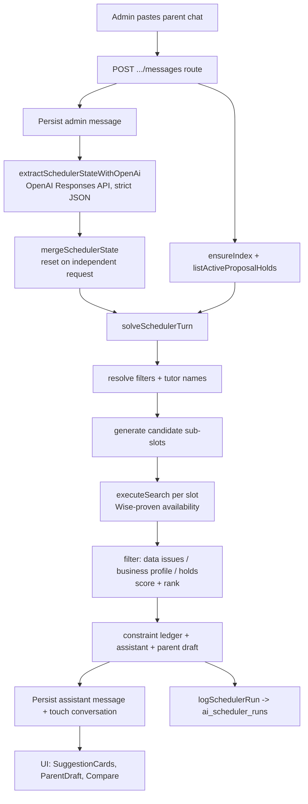

# AI Scheduler

**Status: experimental**

> An LLM-backed scheduling assistant. It reads pasted parent/admin chat, extracts a structured scheduling request, runs the existing Wise-backed availability search deterministically, and drafts a parent-ready reply — never deciding availability itself. This is the newest and least settled feature in the codebase; the evaluation harness and prompt are still being iterated.

## Purpose

BGScheduler's manual workflow makes an admin read a parent message, translate it into search filters (subject / level / day / time / duration / mode), run the search, and hand-write a reply. The AI Scheduler collapses that into a chat: an admin pastes the parent's request and the assistant returns ranked tutor options (or a date-range availability summary) plus an editable parent-message draft.

The hard product rule is that **the model parses, the application decides.** The LLM only extracts intent into strict JSON; all availability is proven against the normalized Wise snapshot through the same `executeSearch` engine the manual search uses (`src/lib/ai/scheduler-conversation.ts:1680`). Unresolved identity / modality / qualification still routes to "Needs Review", and cancelled sessions never block — the AI layer inherits those guarantees rather than re-implementing them.

**Who uses it:** the same non-technical admin staff who use the manual search. They work from the `/scheduler` workspace, which doubles as the triage surface for the LINE AI Review queue (see [Open questions](#open-questions) on the overlap). The `/scheduler/metrics` page is a staff-facing read-only view of how often admins accept, edit, or reject the AI's drafts.

## Conceptual data model

The feature owns four tables (all defined in `src/lib/db/schema.ts`, which is the canonical home for columns, types, indexes, and FK delete behavior — see the ERD reference: [docs/reference/database/erd-ai-and-proposals.md](../reference/database/erd-ai-and-proposals.md)):

- **`ai_scheduler_conversations`** — one row per chat thread. Holds the customer fields (parent / student / contact), free-text notes, the auto-generated title, the owning admin, and a denormalized `extractedState` JSON blob that is the running, merged scheduling state for the thread. Status is `active` / `archived`.
- **`ai_scheduler_messages`** — the turn-by-turn transcript. Roles are `admin`, `parent`, `assistant`, `system`. Assistant rows carry the full solver result in `structuredPayload` (suggestions, availability summary, constraint ledger, parent draft) plus the model name and latency. Cascade-deletes with its conversation.
- **`ai_scheduler_runs`** — an observability log: one row per scheduler turn (solved / needs_clarification / failed), with a **redacted** input preview, model + prompt + scheduler versions, a latency breakdown (db / model / search), and the parsed and solver payloads. It is aggregated by `getAiSchedulerMetrics` (the `scheduler` slice of the metrics endpoint, `src/lib/ai/scheduler-metrics.ts:65-81`), which `SchedulerMetricsView` does **not** currently render (see [Open questions](#open-questions)). The metrics view instead reads `ai_scheduler_feedback` (see below).
- **`ai_scheduler_feedback`** — admin reactions to a draft (`accept` / `edit` / `reject` / `dismiss`), the selected/rejected tutor ids, the edited draft text, rejection reason + staff correction, and optional classifier confidence / time-to-review. Links back to a message, run, and (for LINE-sourced threads) a `line_review_id`. **This is the table the metrics view actually aggregates**: `getCorrectionTelemetry` queries it (`src/lib/ai/correction-telemetry.ts:48-56`) to produce the `correction` slice that `SchedulerMetricsView` renders (`src/components/scheduler/metrics-view.tsx:61,64`).

**Tables it reads but does not own.** The conversation list query joins `line_scheduler_reviews` and `line_contact_student_links` to compute per-thread LINE review state — pending count, oldest-pending timestamp, and whether a contact still needs a verified student link (`src/lib/ai/scheduler-data.ts:218-271`). Conversations whose rows are reached through LINE are flagged `source: "line"`; `parent`-role messages are written by the LINE ingestion service (`src/lib/line/review-service.ts:163`), not by this feature's own endpoints. The solver itself reads the in-memory **search index** (snapshot tutor groups, qualifications, availability windows, business profiles) and the **active proposal holds** rather than querying scheduler tables.

## API surface

All routes live under `src/app/api/ai-scheduler/` and require an authenticated session (`auth()` → `401` when missing); request bodies are validated with Zod `.safeParse()` (`400` on failure). For full request/response contracts see the API reference: [docs/reference/api/ai-scheduler.md](../reference/api/ai-scheduler.md).

- **`GET /api/ai-scheduler/conversations`** — list threads with owner / search / sort filters plus per-admin facet counts. (`src/app/api/ai-scheduler/conversations/route.ts:27`)
- **`POST /api/ai-scheduler/conversations`** — create an empty (manual) conversation owned by the caller. (`src/app/api/ai-scheduler/conversations/route.ts:54`)
- **`GET /api/ai-scheduler/conversations/{conversationId}`** — fetch one conversation with its full message transcript. (`src/app/api/ai-scheduler/conversations/[conversationId]/route.ts:26`)
- **`PATCH /api/ai-scheduler/conversations/{conversationId}`** — update customer fields, notes, title, or status (active/archived). (`src/app/api/ai-scheduler/conversations/[conversationId]/route.ts:44`)
- **`DELETE /api/ai-scheduler/conversations/{conversationId}`** — soft-delete (archive) the conversation. (`src/app/api/ai-scheduler/conversations/[conversationId]/route.ts:77`)
- **`POST /api/ai-scheduler/conversations/{conversationId}/messages`** — the core turn: persists the admin message, runs the LLM extraction + deterministic solve, persists the assistant reply, logs a run. Returns `503` when the scheduler is not configured and `502` (with a persisted apology message) when the turn fails. (`src/app/api/ai-scheduler/conversations/[conversationId]/messages/route.ts:50`)
- **`POST /api/ai-scheduler/messages/{messageId}/feedback`** — record accept / edit / reject feedback against an assistant message and its run. (`src/app/api/ai-scheduler/messages/[messageId]/feedback/route.ts:41`)
- **`GET /api/ai-scheduler/metrics`** — aggregate run metrics, LINE analytics, and correction telemetry for the metrics page. (`src/app/api/ai-scheduler/metrics/route.ts:8`)

## UI

Two pages under `src/app/(app)/scheduler/`, both server components that gate on `auth()` and redirect to `/login` when there is no session; both are linked from the "Scheduling" group in `src/components/layout/app-nav.tsx:17,19`.

- **`/scheduler`** (`src/app/(app)/scheduler/page.tsx`) renders `SchedulerWorkspace`. The page server-loads the tutor list and passes `aiSchedulerEnabled` (derived from `isAiSchedulerConfigured()`) so the UI can disable the composer when no API key is set (`src/app/(app)/scheduler/page.tsx:22`).
- **`/scheduler/metrics`** (`src/app/(app)/scheduler/metrics/page.tsx`) renders `SchedulerMetricsView`.

Key components in `src/components/scheduler/`:

- **`scheduler-workspace.tsx`** (~2,366 lines) — the main client component. A three-column workspace: a left rail with the **LINE Review Queue** band + conversation list, a center chat column (transcript, composer, and per-assistant-message panels), and a right panel that toggles between **Customer Notes** and **Tutor Compare**. The assistant-message render path includes:
  - `SuggestionCard` — a ranked time-slot option with tutors, profile-evidence bullets, reason chips, and a "Compare" button (`src/components/scheduler/scheduler-workspace.tsx:726`).
  - `ParentDraft` — the editable draft with copy-to-clipboard and accept / edit / reject feedback wiring to the feedback endpoint (`:789`).
  - `AvailabilitySummaryPanel`, `AiDecisionChecklist`, and `WhyTheseTutorsPanel` — explainability surfaces driven by the solver payload (`:935`, `:992`, `:1081`).
  - `LineQueueBand`, `MissedMessagesBand`, `LineReviewPanel` — the embedded LINE triage surfaces (these call `/api/line/*`, not the AI-scheduler endpoints).
  - It embeds the shared `ComparePanel` via the `useCompare()` hook so a suggestion can be opened in the in-page tutor-compare view rather than navigating to `/search` (`:28`, `:2253`).
- **`scheduler-compare-focus.ts`** — pure helpers that turn a suggestion into a compare focus target (tutor ids capped at 3, the Monday-of-week for one-time dates, and the active weekday) (`buildSchedulerCompareFocusTarget`, `src/components/scheduler/scheduler-compare-focus.ts:64`).
- **`metrics-view.tsx`** — fetches `/api/ai-scheduler/metrics` and renders **only** the `correction` slice (accept/edit/reject/dismiss rates, time-to-review, and a confidence-band × outcome table). The `scheduler` and `line` slices of the response are not currently rendered here (`src/components/scheduler/metrics-view.tsx:63`).

## Data flow

A turn (`POST …/messages`) moves through these layers (`executeSchedulerTurn`, `src/lib/ai/scheduler-service.ts:48`):

1. **Route** authenticates, validates `{ content }`, loads the conversation + transcript, and persists the admin message.
2. **Index + holds** are loaded: `ensureIndex(db)` warms the in-memory snapshot and `listActiveProposalHolds(db)` is fetched in parallel.
3. **Model extraction** — `extractSchedulerStateWithOpenAi` calls the OpenAI Responses API with `store: false` and a strict `json_schema`, passing the transcript, the saved state, today-in-Bangkok, and the live valid subjects/curriculums/levels/tutors so the model can only emit values that exist (`src/lib/ai/scheduler-conversation.ts:2334`).
4. **Merge** — the new extraction is merged into the saved state; an independent-request heuristic resets stale state when the newest message names a different student/subject/slot (`mergeSchedulerState`, `:911`).
5. **Deterministic solve** — `solveSchedulerTurn` resolves filters (academic-level mapping, subject aliases), resolves tutor include/exclude names, generates candidate sub-slots, runs `executeSearch` per slot, filters by data issues / business profile / proposal holds, scores and ranks tutors, builds the constraint ledger, and composes the assistant + parent-draft text (`:2691`).
6. **Persist + log** — the assistant message (with the full payload), the conversation touch (title/customer fields/merged state), and an `ai_scheduler_runs` row are written; the redacted input preview and latency breakdown are recorded.

## Business rules & edge cases

- **Fail-closed on availability.** A candidate tutor is dropped from suggestions if the group has any data issue (`groupHasDataIssue`, `src/lib/ai/scheduler-conversation.ts:1710`), if it fails hard business requirements (`:1711`), if a profile signal raises a review reason (`:1724`, e.g. a "do not use for" caution that matches the request — scored `-6` in `src/lib/ai/tutor-profile-signals.ts:209`), or if an active proposal hold covers the slot (`:1715`). The same gates apply in the date-range availability path (`:1925-1937`). When nothing survives, a warning is emitted rather than an empty "available" result (`:1801`).
- **The LLM never decides availability.** The extraction prompt states this explicitly and the one-shot prompt repeats it (`src/lib/ai/scheduler-conversation.ts:2361` "You never decide availability."; `src/lib/ai/scheduler.ts:512` "Never decide tutor availability."). All availability comes from `executeSearch`.
- **Bare-weekday ambiguity → recurring, with an assumption.** A weekday with no "every/weekly/recurring" wording and no exact date is treated as recurring weekly and an assumption is recorded (`resolveSchedulerState`, `src/lib/ai/scheduler-conversation.ts:1243-1248`). The one-shot parse path in `scheduler.ts` instead returns `needs_clarification` for a bare weekday (`src/lib/ai/scheduler.ts:515`) — the two entry points handle this differently (see Open questions).
- **Suppress broad search when constraints aren't safely structured.** If the message is negative feedback, or mentions a time with no day/date, or a day with no start time, or has prose slot evidence the parser could not structure, the broad search is skipped with a warning instead of guessing (`shouldSuppressBroadSearch`, `:2754-2757`, `:2770`). `hasUnstructuredSlotEvidence` (`:2388`) detects day+time prose that failed to become structured `requestedSlots`.
- **Defaults are surfaced, not hidden.** Missing duration defaults to 60 min and missing mode defaults to `either`, each adding an assumption (`:1256-1262`; constants `DEFAULT_CONVERSATIONAL_DURATION`/`DEFAULT_CONVERSATIONAL_MODE`, `:24-25`). Supported durations are only 60/90/120.
- **Weekday time floor.** When no explicit time is given, weekday (Mon–Fri) candidate slots are floored to 15:00 to match the institutional tutoring window; weekends start at 00:00 (`dayFloorMinute`, `:1371-1374`).
- **Parent-readiness gate.** A draft is only `parentReady` when there are zero open questions **and** no constraint-ledger item is `needs_clarification` (`:2751`). Otherwise the UI shows the draft as "Needs admin review."
- **Prose recovery.** Deterministic recovery turns "Mon–Sun 10am–6pm" prose into structured recurring slots (`:1074`), date-range prose into one-time slots (`:1102`), "first week of July / Week แรกของ July" into 1–7 July (`:1206`), and a follow-up weekday from raw text when the model left `dayOfWeek` empty (`:1197`). English/Thai are both supported throughout.
- **English-family subject intent.** School-level English / writing requests are expanded deterministically to the active English-family Wise subjects for the level (or `EnglishVR` for exam-prep wording like 11+/13+/16+), only when such subjects are actually active in the snapshot (`buildEnglishSubjectIntent`, `:689`).
- **Multi-subject requests** (e.g. "Math/English/Science") run a search per subject and interleave the top result of each before backfilling (`runSubjectSpecificSchedulerSearch`, `:2632`).
- **PII redaction in the audit log.** Emails, phone numbers, and long digit runs are stripped and the preview is capped at 600 chars before writing to `ai_scheduler_runs.inputPreviewRedacted` (`redactAiSchedulerInput`, `src/lib/ai/scheduler.ts:439`).
- **Feature flag + config.** The scheduler is enabled only when `ENABLE_AI_SCHEDULER !== "false"` **and** `OPENAI_API_KEY` is set (`isAiSchedulerConfigured`, `src/lib/ai/scheduler.ts:477`). Model defaults to `gpt-5.4-mini` overridable via `OPENAI_SCHEDULER_MODEL`; reasoning effort via `OPENAI_SCHEDULER_REASONING_EFFORT` (default `low`). These three are not in the documented "9 required" env set — `OPENAI_API_KEY`, `OPENAI_SCHEDULER_MODEL`, and `ENABLE_AI_SCHEDULER` appear in `.env.example:19-21`; `OPENAI_SCHEDULER_REASONING_EFFORT` and `OPENAI_SCHEDULER_SHADOW_MODEL` are read from `process.env` but are not documented there.
- **Graceful failure.** A failed turn still persists an apology assistant message and a `failed` run row, and returns `502` so the UI can fall back to manual search (`src/app/api/ai-scheduler/conversations/[conversationId]/messages/route.ts:153-189`).

## Tests

Unit tests run under Vitest's `unit` project (`vitest.config.ts`); these `*.test.ts` files are picked up by `npm test`. The standalone evaluation/replay scripts under `scripts/` are **not** part of the test run (they are invoked via `npm run ai-scheduler:evaluate` / `ai-scheduler:compare-models`).

- `src/lib/ai/__tests__/scheduler-conversation.test.ts` (33 cases) — the deepest coverage: default duration/mode + weekday-floor broad search, unmapped-qualification tentativeness, ambiguous tutor names, proposal-hold suppression, multi-slot extraction, requested-slot-only search, academic-level mapping (Y10, Grade 10 ambiguity), verified-English / young-learner / teaching-style profile filtering and ranking, caution-note exclusion, bounded sub-slot generation, broad-search suppression, stale-state reset, tutor exclusions, negative-feedback clarification, first-week-July expansion, Writing-Y6 English-family mapping, Mon–Sun & date-range prose recovery, date-range availability summaries (with leave/session exclusion), stale-question pruning, raw-text weekday recovery, and multi-subject search.
- `src/lib/ai/__tests__/scheduler.test.ts` (6 cases) — the one-shot parse path: valid bounded parse, missing-field clarification, mode-default warning, inactive-filter/ambiguous-tutor clarification, PII redaction, and that the OpenAI call uses the Responses API with `store: false`.
- `src/lib/ai/__tests__/academic-levels.test.ts` (10 cases) — level/subject/curriculum alias resolution and ambiguity.
- `src/lib/ai/__tests__/correction-telemetry.test.ts` (4 cases) — outcome-rate math, confidence-band bucketing, empty table, and timing averaging.
- `src/app/api/ai-scheduler/conversations/__tests__/route.test.ts` (5 cases) — auth gate, list filters + admin facets, `mine` scope, invalid sort, and ownership on create.
- `src/app/api/ai-scheduler/conversations/[conversationId]/messages/__tests__/route.test.ts` (1 case) — persists admin + assistant messages around a solved turn.
- `src/app/api/ai-scheduler/messages/[messageId]/feedback/__tests__/route.test.ts` (3 cases) — unauthenticated `401`, accepted-draft persistence, and required reason/correction for rejections.
- `src/components/scheduler/__tests__/scheduler-compare-focus.test.ts` — the compare-focus helpers plus source-level guardrails asserting the workspace embeds the shared `ComparePanel`/`useCompare`, keeps suggestion-compare in-page, and orders the LINE triage UI.

### Evaluation reports (linked, not maintained here)

Separate offline accuracy/latency work has its own reports in `docs/` (read-only relative to this doc):

- [docs/ai-scheduler-eval-latest.md](../ai-scheduler-eval-latest.md) — latest evaluation run (generated by `scripts/evaluate-ai-scheduler.ts`).
- [docs/ai-scheduler-model-comparison.md](../ai-scheduler-model-comparison.md) — model comparison (generated by `scripts/compare-ai-scheduler-models.ts`).
- [docs/ai-scheduler-audit-2026-05-20.md](../ai-scheduler-audit-2026-05-20.md), [docs/ai-scheduler-audit-2026-05-21.md](../ai-scheduler-audit-2026-05-21.md) — accuracy audits.
- [docs/ai-scheduler-replay-eval-2026-05-20.md](../ai-scheduler-replay-eval-2026-05-20.md), [docs/ai-scheduler-replay-eval-2026-05-21.md](../ai-scheduler-replay-eval-2026-05-21.md) — replay evaluations (`scripts/replay-ai-scheduler-runs.ts`).
- The eval fixture set lives at `docs/ai-scheduler-eval-cases.json`.

## Open questions

- **Scheduler vs. LINE AI Review boundary.** `ai_scheduler_conversations`/`messages` are shared between this feature and the LINE AI Review feature (LINE writes `parent`-role messages and joins through `line_scheduler_reviews`), and `SchedulerWorkspace` renders the LINE triage queue inline. Where the documentation boundary between "AI Scheduler" and "LINE AI Review" should fall is a product/ownership decision, not something the code settles.
- **Two parse paths; the one-shot parser looks orphaned.** `src/lib/ai/scheduler.ts` and `src/lib/ai/scheduler-conversation.ts` overlap heavily and disagree on bare-weekday handling (clarify vs. assume-recurring). `scheduler.ts`'s shared exports are still live — its config helpers (`isAiSchedulerConfigured`, `aiSchedulerModel`, `redactAiSchedulerInput`, `bangkokTodayIso`) are used widely, and its `AiSchedulerResponse` type is consumed by `src/app/api/search/assistant/route.ts` (a second, single-turn assistant endpoint behind `src/components/search/ai-scheduler-panel.tsx` on the `/search` page). **But that route actually calls `executeSchedulerTurn` (the conversational solver), not the one-shot `parseSchedulingRequestWithOpenAi`.** That parse function and `normalizeAiSchedulerModelParse` appear to be referenced only by `scheduler.test.ts`, so the one-shot parser may be dead code kept alive only by its tests. A human should confirm before removing it.
- **Metrics view shows only one of three payload slices.** `GET /api/ai-scheduler/metrics` returns `scheduler`, `line`, and `correction`, but `SchedulerMetricsView` renders only `correction`. Whether the run-level scheduler metrics (latency p50/p95, solved/failed counts, version distribution, recent failures computed in `src/lib/ai/scheduler-metrics.ts`) are meant to be surfaced elsewhere or are intentionally unused is unclear.
- **Shadow model accessor is defined but never called.** `aiSchedulerShadowModel()` (`src/lib/ai/scheduler.ts:465-466`) reads `OPENAI_SCHEDULER_SHADOW_MODEL`, but a repo-wide search finds no caller at all — not in any production route and not in the offline comparison script (`scripts/compare-ai-scheduler-models.ts`, run via `npm run ai-scheduler:compare-models`). Its only other reference is the env-var docs (`docs/reference/env.md:158`). Confirm whether it is intended wiring for shadow runs that is not yet hooked up, or dead code.

_Verified against HEAD + uncommitted WIP on 2026-05-31._
