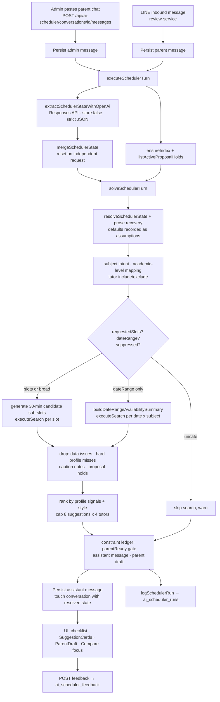

# AI Scheduler

**Status: experimental** — a documentation-side label; no maturity marker exists in code. What the code does show is machinery for a component still being tuned: every run is stamped with a solver version and a prompt version (`AI_SCHEDULER_VERSION = "scheduler-2026-05-22-observability"`, `AI_SCHEDULER_PROMPT_VERSION = "prompt-2026-05-22-state-extraction-v1"`, `src/lib/ai/scheduler-service.ts:20-21`), every OpenAI call is made with `store: false` (`src/lib/ai/scheduler-conversation.ts:2354`), and an offline eval harness re-scores the feature against fixture cases plus regression cases mined from real staff feedback (`scripts/evaluate-ai-scheduler.ts:216-279`). The point-in-time eval and audit reports it produces live at the top of `docs/` and are linked, not restated, in [Evaluation reports](#evaluation-reports-linked-maintained-elsewhere).

> An LLM-backed scheduling assistant. An admin pastes a parent or admin chat into a thread; the model extracts the *scheduling state* as strict JSON, the application proves availability deterministically against the Wise snapshot with the same `executeSearch` engine manual search uses, and the assistant returns ranked slot options (or a date-range availability summary), a constraint ledger, and an editable parent-ready draft. The model never decides availability.

## Purpose

The manual workflow makes an admin read a parent message, translate it into search filters (subject / curriculum / level / day / time / duration / mode), run the search, read the results, and hand-write a reply. The AI Scheduler collapses that into a chat thread at `/scheduler`: paste the parent's message, get back ranked suggestions, an explainability panel, and a draft that can be copied into LINE — and keep iterating in the same thread as the parent answers.

The load-bearing product rule is **the model parses, the application decides**. The extraction call is told so in its system prompt — `"You extract evolving BeGifted scheduling state as strict JSON. You never decide availability."` (`src/lib/ai/scheduler-conversation.ts:2361`) — and every availability claim is produced by `executeSearch` (`:1680`, `:1911`), so the fail-closed rules (unresolved identity / modality / qualification → Needs Review, cancelled sessions non-blocking) are inherited from [Tutor Search](tutor-search.md), not re-implemented here. On top of that inherited floor the scheduler adds its own exclusions — data-issue groups, proposal holds, hard tutor-profile requirements, caution notes — described under [Business rules](#business-rules--edge-cases).

**Who uses it.** Three populations reach the feature:

- **Admin staff** in the browser. `/scheduler` and `/scheduler/metrics` carry no route-specific role check beyond the shared gate: sign-in resolves a role plus a page grant (`resolveUserAccess`, `src/lib/auth-access.ts:56-82`), and `src/middleware.ts` enforces the grant per request — a null `allowed_pages` means full access, a non-null list is matched by `isPathAllowed` (`src/middleware.ts:36-67`). Non-admin roles resolve to single-page grants (`counselor` / `student` / `parent` → `/admissions`, `teacher` → `/progress-tests`, `auth-access.ts:71-82`), so a signed-in non-admin cannot reach the scheduler. Both pages additionally `redirect("/login")` without a session (`src/app/(app)/scheduler/page.tsx:9-12`, `metrics/page.tsx:7-10`).
- **The LINE webhook**, as a machine writer. An inbound parent message classified as a scheduling request *or* change (`scheduling_request` / `scheduling_change`, `src/lib/line/review-service.ts:187-189`) **and** whose operational intent is `new_request` is written into the *same* conversation and message tables as a `parent`-role message and drives its own solver turn (`:302-318`). Every other intent (reschedule, cancel, and so on) takes the deterministic operational-planner branch (`:191-266`) and never calls the model — those are the `deterministic-line-ops` runs described under [Conceptual data model](#conceptual-data-model). That is why `/scheduler` doubles as the day-to-day triage surface for the LINE AI Review queue — see [LINE Integration](line-integration.md) for the classifier, review lifecycle, and send path.
- **Offline scripts** — the eval, model-comparison, and replay harnesses under `scripts/` call the same extraction and solver functions directly (`scripts/evaluate-ai-scheduler.ts:8-21`) against whichever database `DATABASE_URL` resolves to: they load env via `@next/env` (`:3`, `:318`) and then call `getDb()` / `ensureIndex` (`:319`, `:322`), so running them against production is an operational choice by the caller, not something the code fixes.

## Conceptual data model

The feature owns four tables, all declared under the `AI Scheduler Conversations & Audit` block of `src/lib/db/schema.ts` (`:2345-2433`) and none scoped to a Wise snapshot. Column inventories, indexes, and FK delete behaviour are owned by [docs/reference/database/erd-ai-and-proposals.md](../reference/database/erd-ai-and-proposals.md); what each table is *for* is below.

- **`ai_scheduler_conversations`** — one row per chat thread and the customer context it is about (title, parent / student / contact labels, notes, creator). The load-bearing column is `extracted_state`, a JSON blob carrying the thread's running scheduling state that is fed back into the next turn's prompt (`scheduler-conversation.ts:2326`) — this is what makes a thread multi-turn rather than a series of independent parses. Note *which* state is persisted: the route writes `assistantResult.state` (`src/app/api/ai-scheduler/conversations/[conversationId]/messages/route.ts:125`), which is the solver's **resolved** state (`scheduler-conversation.ts:2733-2741`, returned `:2817`), not the raw model extraction. By then defaults have been filled and recorded as assumptions, academic filters have been rewritten to active Wise values, and deterministic guard questions have been folded into `unresolvedQuestions`. So the model's memory of the thread is app-derived. Status is `active` or `archived`; `DELETE` over HTTP only archives (`[conversationId]/route.ts:87`).
- **`ai_scheduler_messages`** — the turn-by-turn transcript. Roles are `admin`, `parent`, `assistant`, `system` (`schema.ts:103-108`); `parent` rows come only from the LINE path. Assistant rows carry the whole solver result in `structured_payload` — resolved state, the raw model extraction (`extractedState`), suggestions, availability summary, constraint ledger, parent draft, warnings, questions (`messages/route.ts:109-121`) — and the UI re-renders every panel straight from that payload (`src/components/scheduler/scheduler-workspace.tsx:2098-2154`), so a transcript is self-describing without re-running the solver.
- **`ai_scheduler_runs`** — the observability log: one row per solver turn, recording how the turn ended, which model and version stamps produced it, how long each stage took, and what the parser and solver returned, so a run can be audited without being re-executed (columns and indexes: [erd-ai-and-proposals.md](../reference/database/erd-ai-and-proposals.md#aischedulerruns--ai_scheduler_runs-23862409)). The inbound text is **PII-redacted and truncated** before storage (`redactAiSchedulerInput`, `src/lib/ai/scheduler.ts:439-450`), and `logSchedulerRun` swallows its own database errors and returns the literal `"unlogged"`, so a logging failure can never break a turn (`src/lib/ai/scheduler-data.ts:508-532`). Runs are also written by two non-chat callers: the one-shot `/api/search/assistant` route with no conversation id (`src/app/api/search/assistant/route.ts:176-186`), and the LINE operational-planner branch, which logs `model: "deterministic-line-ops"` rows that made no model call at all (`src/lib/line/review-service.ts:228-244`).
- **`ai_scheduler_feedback`** — the labelled-outcome corpus: one row per human reaction to an assistant draft — accepted, edited, rejected, or (LINE only) dismissed — tied back to the message it judged and, for LINE-originated reviews, to the review it came from (columns: [erd-ai-and-proposals.md](../reference/database/erd-ai-and-proposals.md#aischedulerfeedback--ai_scheduler_feedback-24102436)). It is what makes quality measurable: the correction telemetry aggregates it and the eval harness mines `edit` / `reject` rows into regression cases (`scripts/evaluate-ai-scheduler.ts:216-272`).

**Read but not owned.** The conversation list joins `line_scheduler_reviews` and `line_contact_student_links` to compute per-thread LINE rollups — pending-review count, oldest pending timestamp, latest review status, and whether the contact still lacks a verified student link — and reports a thread as `source: "line"` when any review row points at it (`scheduler-data.ts:218-271`). The solver itself touches no scheduler tables: it reads the in-memory **search index** (tutor groups, qualifications, availability windows, and the tutor business profiles folded in as `IndexedTutorGroup.businessProfile` — see [Tutor Profiles](tutor-profiles.md)) and the **active proposal holds** (`scheduler-service.ts:60-63`; see [Proposals](proposals.md)).

**Migrations.** `drizzle/0015_ai_scheduler_runs.sql`, `0016_ai_scheduler_conversations.sql` (conversations + messages; the original role enum was `admin` / `assistant` / `system`, `0016:2` — `parent` was added by the LINE-domain migration `drizzle/0017_line_scheduler_reviews.sql:4`, `ALTER TYPE … ADD VALUE 'parent'`), `0021_ai_scheduler_observability.sql` (version stamps + latency breakdown), `0022_ai_scheduler_feedback.sql`, and `0030_scheduler_feedback_telemetry.sql` (LINE review link, classifier confidence, time-to-review).

**Hard deletes.** Nothing on the HTTP surface deletes rows. One ops path does: `deleteLineTestData` removes LINE-linked feedback, runs, and conversations outright (`src/lib/line/test-data-cleanup.ts:232-259`), reachable only via `npm run line:test-data:cleanup` (`package.json:25`) and refusing to run without the `CONFIRM_DELETE_LINE_TEST_DATA` sentinel (`test-data-cleanup.ts:225-227`).

## API surface

All eight endpoints live under `src/app/api/ai-scheduler/` and open with the same `auth()` → `401` gate. Request and response contracts, status codes, query parameters, and per-handler line indexes are documented once in [docs/reference/api/ai-scheduler.md](../reference/api/ai-scheduler.md) and are not repeated here.

| Endpoint | Purpose |
| --- | --- |
| `GET /api/ai-scheduler/conversations` | List the newest 200 threads with owner / free-text / sort filters and LINE rollups, plus per-admin facet counts (`conversations/route.ts:27-52`). |
| `POST /api/ai-scheduler/conversations` | Create an empty manual thread owned by the caller (`conversations/route.ts:54-77`). |
| `GET /api/ai-scheduler/conversations/{conversationId}` | Fetch one thread with its full transcript (`[conversationId]/route.ts:26-42`). |
| `PATCH /api/ai-scheduler/conversations/{conversationId}` | Update title, customer labels, notes, or status (`[conversationId]/route.ts:44-75`). |
| `DELETE /api/ai-scheduler/conversations/{conversationId}` | **Archive** — sets `status = "archived"`, never deletes (`[conversationId]/route.ts:77-93`). |
| `POST /api/ai-scheduler/conversations/{conversationId}/messages` | The core turn: persist the admin message, extract + solve, persist the assistant reply, log a run (`messages/route.ts:50-191`). `503` when unconfigured, `409` on an archived thread. |
| `POST /api/ai-scheduler/messages/{messageId}/feedback` | Record `accept` / `edit` / `reject` feedback against an assistant message (`feedback/route.ts:41-78`). `dismiss` is not accepted here — see [Business rules](#business-rules--edge-cases). |
| `GET /api/ai-scheduler/metrics` | Run metrics (newest 500 runs) + LINE scheduler analytics + correction telemetry (newest 5000 feedback rows) (`metrics/route.ts:8-22`). |

**A ninth caller lives outside the group.** `POST /api/search/assistant` (contract in [docs/reference/api/misc.md](../reference/api/misc.md)) is a single-turn adapter over the same solver: it calls `executeSchedulerTurn` with an empty prior state and one admin message, then reshapes the result into the legacy `AiSchedulerResponse` union — `solved`, `needs_clarification`, or `availability_summary` (`src/app/api/search/assistant/route.ts:101-133`, `:169-175`). It is allowlisted as public in middleware (`src/middleware.ts:14`) but still returns `401` without a session (`route.ts:136-139`). Its only in-repo caller is `src/components/search/ai-scheduler-panel.tsx:87`, and that component has no importer anywhere in `src/` — see [Open questions](#open-questions).

## UI

Two pages under `src/app/(app)/scheduler/`. In both, the exported page component is synchronous and only wraps an async body in `<Suspense fallback={null}>`; the `auth()` gate and `redirect("/login")` live in the async child (`scheduler/page.tsx:8-26` vs `:28-34`; `metrics/page.tsx:6-13` vs `:15-21`). Nav entries: `Scheduler` (section `scheduling-tutors`, `shortcut: true`, `src/lib/navigation/tools.ts:94-101`) and `Scheduler Metrics` (`:155-161`). Both paths opt into the stale-snapshot banner (`src/components/layout/stale-snapshot-banner.tsx:23-24`).

- **`/scheduler`** server-loads the cached tutor list (`getTutorList`, `"use cache"` tagged `snapshot`, `src/lib/data/tutors.ts:80-86`) for the embedded compare panel and passes `aiSchedulerEnabled = isAiSchedulerConfigured()` (`page.tsx:22`) so the composer can be disabled when no key is configured.
- **`/scheduler/metrics`** renders `SchedulerMetricsView` (`metrics/page.tsx:12`).

Key components in `src/components/scheduler/`:

- **`scheduler-workspace.tsx`** (2,366 lines, `"use client"`) — the workspace. Above the fold sit `LineQueueBand` (`:482`, pending LINE reviews with queue metrics; expanded whenever anything is pending, otherwise collapsible with the choice remembered in `localStorage`, `:310`, `:1526-1529`, `:1850-1864`) and `MissedMessagesBand` (`:611`, classifier false-negative candidates with **Promote to review** / **Not scheduling** actions, `:626-657`). Below: a 280 px conversation rail (`:1886`), a centre chat column, and a right panel that toggles **Compare** ⇄ **Notes** (`:2199-2259`).
  - Rail: free-text search, `All` / `Mine` / archived toggles, a sort select (`review_priority`, `oldest_pending_line`, `latest`, `admin`, `:304-309`), and an admin facet select. The owner filter defaults to `mine` and falls back to `all` once if that returns nothing (`:1530`, `:1609-1613`). Each row shows a deterministic per-admin colour accent (`adminAccentFor`, `src/lib/scheduler/admin-colors.ts`), a `LINE` / `Manual` badge, pending-review and needs-link labels (`:1970-2017`).
  - Chat column: an **Active LINE review** block rendering `LineReviewPanel` for every review linked to the selected thread (`:2067-2081`); the transcript; and a composer that sends on the button or Cmd/Ctrl+Enter, disabled when the scheduler is unconfigured or the thread is archived (`:2167-2196`). Sending is optimistic — the admin bubble appears before the response (`:1794-1806`) — and auto-creates a thread when none is selected (`ensureConversation`, `:1771-1784`).
  - Per assistant message: `AiDecisionChecklist` (`:992`, seven pass/fail tiles — student, request type, time, subject/level, tutor fit, availability, draft safety — plus the first open question), up to **four** `SuggestionCard`s (`:2134`; each with rank, day, time, mode, tutors, up to two profile-evidence lines, reason chips, and a **Compare** button, `:726-787`), `WhyTheseTutorsPanel` (`:1081`, up to four tutors with fit evidence and availability), `AvailabilitySummaryPanel` (`:935`, up to six tutors with compacted windows), and `ParentDraft` (`:789`).
  - `ParentDraft` is where feedback is captured: the primary button submits `accept` when the text is untouched and `edit` when it differs (`:880`); the reject form requires both a reason and a staff correction (`:921`); all feedback posts to `/api/ai-scheduler/messages/{id}/feedback` with the tutor ids from every suggestion on the message (`:813-842`).
  - `LineReviewPanel` (`:1124`) is inline LINE triage — student-link verification, classification feedback, draft editing, and the four decisions `approve_send` / `accept_no_send` / `reject` / `dismiss` — and it calls `/api/line/*`, not the AI-scheduler endpoints (`:1157`, `:1175`, `:1194`, `:1215`, `:1454-1504`). Send is blocked until a student link is verified or the "new/unmatched student" override is ticked (`:1232`, `:1366-1370`).
  - Polling and focus: the LINE queue and false-negative list refresh every 60 s (`:1632-1641`); on first load the oldest pending review's thread is auto-selected (`:1643-1649`); after each turn the first suggestion of the newest assistant message auto-focuses the compare panel (`:1763-1769`); detail edits autosave on a 650 ms debounce via `PATCH` (`:1685-1713`).
  - Compare is the shared `ComparePanel` + `useCompare()` embedded in-page (`:28-29`, `:2253-2258`), so **Compare** never navigates to `/search`.
- **`scheduler-compare-focus.ts`** — pure helpers turning a suggestion into a compare target: at most three tutor ids, the Monday of a one-time date's week, and the active weekday (`buildSchedulerCompareFocusTarget`, `:64-81`).
- **`metrics-view.tsx`** — fetches `/api/ai-scheduler/metrics` and renders **only** the `correction` slice: accept / edit / reject / dismiss rates, average and p50 time-to-review, and a confidence-band × outcome table (`:57-64`, `:94-138`). The `scheduler` and `line` slices of the same response are not rendered anywhere.

## Data flow

One turn of `POST …/messages` (`messages/route.ts:50-191`), orchestrated by `executeSchedulerTurn` (`src/lib/ai/scheduler-service.ts:48-107`):

1. **Route** authenticates, returns `503` when unconfigured (`:59-61`), validates the body, loads the thread + transcript, refuses archived threads with `409` (`:84-86`), and persists the admin message **before** calling the model (`:91-96`).
2. **Index + holds** — `ensureIndex(db)` is awaited first (`scheduler-service.ts:60`); only once the index is ready is `listActiveProposalHolds(db)` started (`:61-63`), and it is left running during the model call (`:70`) and awaited afterwards (`:82`) — so the holds query overlaps the OpenAI call, not the index build. Both legs are timed into `latencyBreakdownMs.dbMs` (`:59-64`, `:81-83`). Valid subjects / curriculums / levels and the active tutor list are derived from the index (`filterOptionsFromIndex`, `tutorListFromIndex`, `scheduler-conversation.ts:1289-1316`).
3. **Extraction** — `extractSchedulerStateWithOpenAi` posts to the OpenAI Responses API over bare `fetch` with `store: false`, the configured `reasoning.effort`, and a `strict: true` `json_schema` (`scheduler-conversation.ts:2346-2377`). The prompt carries today-in-Bangkok, the saved state JSON, the newest parent/admin message, the last 12 transcript messages, and the live valid lists (`buildSchedulerExtractionPrompt`, `:2271-2332`). Those lists are prompt grounding, not a schema constraint: `filters.subject` / `curriculum` / `level` are typed as free strings (`:344-353`), and the prompt explicitly asks the model to keep raw level phrases such as `Y10` or `ม.4` rather than invent Wise levels (`:2304-2305`). The reply is validated by Zod and normalised (`normalizeSchedulerExtraction`, `:822-855`).
4. **Merge** — `mergeSchedulerState` folds the extraction into the saved state, or discards the saved state when `isIndependentSchedulingRequest` detects a different student, subject, or slot set (`:893-969`).
5. **Deterministic solve** — `solveSchedulerTurn` (`:2691-2828`) resolves defaults and recovers day / date-range / time facts from prose, applies English-family subject intent, maps academic filters to active Wise values, resolves tutor include / exclude names, generates bounded candidate sub-slots, runs `executeSearch` per slot, drops unsafe tutors, ranks by profile signals, builds the constraint ledger, and composes the assistant message and parent draft.
6. **Persist + log** — the assistant message (full payload, model, latency), the conversation touch (resolved state; an auto-title from the model's `title` or `buildConversationTitle` while the thread is still `"Untitled scheduler chat"`; customer labels from the extracted parent / student / contact, `messages/route.ts:123-132`), and an `ai_scheduler_runs` row with the redacted preview, version stamps, and latency breakdown (`:133-145`).

```mermaid
flowchart TD
  A[Admin pastes parent chat<br/>POST /api/ai-scheduler/conversations/id/messages] --> C[Persist admin message]
  L[LINE inbound message<br/>review-service] --> C2[Persist parent message]
  C --> D[executeSchedulerTurn]
  C2 --> D
  D --> E[ensureIndex + listActiveProposalHolds]
  D --> F[extractSchedulerStateWithOpenAi<br/>Responses API · store:false · strict JSON]
  F --> G[mergeSchedulerState<br/>reset on independent request]
  G --> H[solveSchedulerTurn]
  E --> H
  H --> I[resolveSchedulerState + prose recovery<br/>defaults recorded as assumptions]
  I --> J[subject intent · academic-level mapping<br/>tutor include/exclude]
  J --> K{requestedSlots? dateRange?<br/>suppressed?}
  K -->|slots or broad| M[generate 30-min candidate sub-slots<br/>executeSearch per slot]
  K -->|dateRange only| N[buildDateRangeAvailabilitySummary<br/>executeSearch per date x subject]
  K -->|unsafe| O[skip search, warn]
  M --> P[drop: data issues · hard profile misses<br/>caution notes · proposal holds]
  N --> P
  P --> Q[rank by profile signals + style<br/>cap 8 suggestions x 4 tutors]
  Q --> R[constraint ledger · parentReady gate<br/>assistant message · parent draft]
  O --> R
  R --> S[Persist assistant message<br/>touch conversation with resolved state]
  R --> T[logSchedulerRun → ai_scheduler_runs]
  S --> U[UI: checklist · SuggestionCards · ParentDraft · Compare focus]
  U --> V[POST feedback → ai_scheduler_feedback]
```

## Business rules & edge cases

- **Configuration gate.** The feature is on only when `ENABLE_AI_SCHEDULER !== "false"` **and** `OPENAI_API_KEY` is non-empty (`isAiSchedulerConfigured`, `src/lib/ai/scheduler.ts:477-480`) — enabled by default, disabled only by the literal `false`. Model defaults to `gpt-5.4-mini` via `OPENAI_SCHEDULER_MODEL` (`:8`, `:461-463`); reasoning effort defaults to `low` via `OPENAI_SCHEDULER_REASONING_EFFORT`, with unrecognised values falling back silently (`:9`, `:469-475`). None of these is in the validated `src/lib/env.ts` schema; three appear in `.env.example:19-21`. The full inventory is in [docs/reference/env.md](../reference/env.md). Unconfigured, the messages route returns `503` and the workspace shows an amber banner and disables the composer (`scheduler-workspace.tsx:2061-2065`, `:2177`).
- **Fail-closed tutor selection.** A tutor that `executeSearch` returned as available is still dropped when the request pinned other tutors or excluded this one (`scheduler-conversation.ts:1703-1708`), the indexed group carries any data issue (`groupHasDataIssue`, `:1539-1541`, applied `:1710`), it fails a *hard* business requirement (`:1711-1714`), a profile signal raises a review reason (`:1718-1724`), or an active proposal hold covers the slot for that tutor's canonical key (`slotBlockedByProposalHold`, `:1517-1537`, applied `:1715`). The date-range summary applies the same gates (`:1920-1939`). When nothing survives, the turn emits an explicit warning rather than a silent empty result (`:1800-1805`, `:2011-2018`).
- **Hard vs. soft tutor-profile requirements.** Only English proficiency, young-learner age, and school keywords can *exclude* a tutor (`hasHardBusinessRequirements`, `:1566-1572`), and a tutor with **no** business profile fails them outright — missing context is never a match (`matchesBusinessRequirements`, `:1594-1596`). English proficiency is compared on a rank ladder `unknown < basic < conversational < fluent < near-native < native` (`:1543-1550`); young-learner fit requires `youngLearnerFit === "comfortable"` and a recorded youngest age at or below the request (`:1604-1608`). Teaching-style tags influence ranking only (`teachingStyleScore`, `:1614-1624`).
- **Caution notes can veto.** A tutor's `doNotUseForNotes` that matches any part of the request scores `-6` and is emitted as a `review` signal, which removes the tutor from suggestions; an unrelated caution note scores `-1` and only deprioritises (`src/lib/ai/tutor-profile-signals.ts:187-211`, consumed at `scheduler-conversation.ts:1724`, `:1936`). Positive signals are additive: a matching Wise qualification is worth `3`, structured profile tags `1`–`2`, note-derived mentions `0.5`–`0.8` (`tutor-profile-signals.ts:219-263`).
- **Bare weekday resolves to recurring, with a recorded assumption.** A weekday with no mode becomes `recurring`; a `one_time` claim that carries a weekday but no date is downgraded to recurring; no mode, no date, and no weekday defaults to recurring — each adds an assumption (`resolveSchedulerState`, `:1243-1254`). The downgrade is conditional on a weekday being present (`searchMode === "one_time" && !state.date && typeof dayOfWeek === "number"`, `:1246`): a `one_time` claim with *neither* date nor weekday keeps `searchMode = "one_time"` and records no assumption there; the slot generator then broad-searches all seven weekdays and pushes the *warning* "No exact date was available, so I searched recurring weekly availability instead." (`:1470-1478`). The prompt says the same (`:2296`). The legacy one-shot parser does the opposite and asks for clarification (`src/lib/ai/scheduler.ts:515`) — see [Open questions](#open-questions).
- **Defaults are surfaced, not hidden.** Missing duration → 60 min, missing mode → `either`, each with an assumption (`:1256-1268`, constants `:24-25`); the constraint ledger records these as `evidence: "default"` (`:2514`, `:2522`). Only 60 / 90 / 120 minutes are representable — the JSON schema enumerates them (`:342`).
- **Deterministic prose recovery runs before the search**, so a model that under-structures its output does not silently lose constraints: a weekday recovered from raw text when `dayOfWeek` is empty (`inferWeekdayFromText`, `:1187-1204`); "first week of July" / "Week แรกของ July" → 1–7 July (`inferFirstWeekDateRange`, `:1206-1227` — note the year falls back to `new Date().getFullYear()`, server-local rather than Bangkok, `:1220`); Mon–Sun prose with a time range → seven recurring weekday slots, which also *override* stale one-time slots (`:1074-1100`, `:1136-1141`); date-range prose with a time range → one-time slots per date (`:1102-1124`); a start time plus duration but no end time → end derived, with an assumption (`:1025`, `:1030-1032`). Thai and English weekday and connector patterns are handled throughout (`:1056`, `:1187-1195`).
- **Broad search is suppressed rather than guessed.** Negative feedback, a time with no day / date, a day with no start time *and* no date range, or day + time prose that failed to become structured `requestedSlots` all skip the search with the warning `"Skipped broad scheduler search because explicit constraints were not safely structured."` (`shouldSuppressBroadSearch`, `:2754-2757`, `:2770-2771`; detector `hasUnstructuredSlotEvidence`, `:2388-2398`) and add a guard question (`schedulerGuardQuestions`, `:2400-2415`). A request with a subject but no day or time at all is *not* suppressed — it broad-searches all seven weekdays (`:1470-1474`).
- **Weekday time floor.** With no explicit time, Mon–Fri candidate slots are floored to 15:00 (the after-school window); weekends start at 00:00 (`dayFloorMinute`, `:1371-1374`).
- **Bounded slot enumeration.** Requested windows are walked in 30-minute steps and only sub-slots that fit entirely inside the window are generated (`:1443-1462`); a window shorter than the duration produces a warning instead of a slot (`:1437-1440`). Broad-search windows are stepped the same way from each tutor's availability window (`:1489-1499`) after a modality filter against the requested mode (`:1483`).
- **Ranking and caps.** Without requested slots, slot entries are ordered by summed profile-signal score, then style score, then tutor count, then weekday (Mon first, Sun last), then start time (`:1766-1774`); with requested slots, the requested order is kept. At most **8** suggestions survive (`MAX_SCHEDULER_SUGGESTIONS`, `:26`, `:1777`), each carrying at most **4** tutors (`:1792`), labelled `Best fit` (rank 1) / `Strong fit` (2–3) / `Good fit` (`:1779-1780`). The workspace renders 4 suggestions per message (`scheduler-workspace.tsx:2134`); the parent draft lists 4 suggestions with 3 tutors each (`scheduler-conversation.ts:2194-2195`); `/api/search/assistant` truncates each option to 3 tutors (`assistant/route.ts:56`).
- **Parent-readiness gate.** `parentReady` requires **zero** open questions *and* no constraint-ledger row in `needs_clarification` (`:2751-2752`). When false, the assistant line says so (`:2250`), every suggestion carries `parentReady: false` (`:1795`), and the run is logged as `needs_clarification` rather than `solved` (`messages/route.ts:137`). The parent draft reflects the gate **only when tentative suggestions exist**: with at least one suggestion and no availability summary, `buildSchedulerParentDraft` rewrites the draft as "I need to confirm one detail first" with the first two questions and the tentative windows (`:2203-2211`). A zero-suggestion turn — which is what every suppressed-search path produces (negative feedback, time-without-day, day-without-time, unstructured prose → `emptySearchResult`, `:2770-2771`, `:2582-2592`) — returns the generic "could not find a confirmed matching tutor yet… Could you share another day or time range?" draft with **no** clarifying question embedded (`:2187-2192`), and the date-range summary path has its own two drafts that ignore `parentReady` entirely (`:2161-2185`).
- **Constraint ledger.** Every constraint the turn considered — search mode, slot, date range, duration, delivery mode, academic filter, subject requests, tutor include, tutor exclude, tutor-profile fit, negative feedback — is recorded with the requested value, the normalised value, where it came from (`model` / `deterministic` / `default` / `not_provided`), and whether it is `proven`, `needs_clarification`, or `not_applicable` (`buildConstraintLedger`, `:2448-2580`). Its purpose is auditability: `getAiSchedulerMetrics` counts `parentReadyConstraintFailures` — runs logged `solved` that nonetheless carry a `needs_clarification` ledger row (`src/lib/ai/scheduler-metrics.ts:50-59`, `:108-111`) — and the eval harness treats the same condition as a concern (`scripts/evaluate-ai-scheduler.ts:210`).
- **Date-range mode.** A `dateRange` with no requested slots switches the turn from ranked suggestions to an availability *summary* — per tutor, the matched subjects and every proven window across the range (`:2758-2769`, `buildDateRangeAvailabilitySummary`, `:1877-2039`). The summary embeds search provenance — snapshot id, profile version, active-hold count (`:2028-2032`) — which the no-result parent draft echoes verbatim (`:2166`). Tutors the engine returned as Needs Review are listed separately with their reasons (`:1975-1987`).
- **English-family subject intent.** School-level English / writing requests are expanded deterministically to whichever English-family subjects (`EFL`, `ESL`, `Literature`, `EnglishVR`, `:560`) are actually active for that level in the snapshot, or to `EnglishVR` alone for exam-prep wording — a resolved `11+/13+` or `16+` level, or any of the substrings `englishvr` / `nonvr` / `11+` / `13+` / `16+` / `entrance` / `exam prep`; bare "VR" is **not** a trigger (`mentionsExamEnglish`, `:601-612`); the intent is dropped entirely when no such subject is active (`buildEnglishSubjectIntent`, `:689-739`). Year-bucket levels imply the `International` curriculum when none was given (`:700-702`).
- **Academic-level mapping is snapshot-aware.** Raw phrases are mapped only onto levels present in the active index — `Y10` → `Y9-11`, `Year 5` → `Y2-8`, `11+` → `11+/13+`, `ม.4` → `G10-12`, exam aliases such as `igcse` / `a level` / `ib` — and an unmapped or ambiguous level becomes a clarification question instead of a guess; `Grade 10` is ambiguous between `Y9-11` and `G10-12` until a curriculum is known (`resolveAcademicLevel`, `src/lib/ai/academic-levels.ts:170-235`). Subject and curriculum aliases (`maths`, `economics`, `non-vr`, `int.`, `igcse` → `International`, …) are recovered the same way (`:54-73`, `:237-282`).
- **Multi-subject requests** ("Math / English / Science") run one search per subject and interleave each subject's top option before backfilling the remainder (`runSubjectSpecificSchedulerSearch`, `:2632-2689`); the date-range summary likewise searches each subject filter per date (`:1909-1915`).
- **Tutor names are resolved server-side, never trusted from the model.** Exact display-name match, then substring; a unique hit pins (include) or removes (exclude) that tutor; zero or multiple hits produce a question and a warning and the search proceeds unrestricted (`resolveSchedulerTutorNames`, `:1325-1369`). Thai replacement wording such as "แทนครูจูน" is instructed to mean *exclude* June (`:2316`).
- **Thread memory resets on a new request.** A different student name, a different subject, or a changed set of requested slots discards the saved state (keeping only parent name and contact) so a second child's request is not merged into the first (`isIndependentSchedulingRequest` / `mergeSchedulerState`, `:893-931`). Otherwise fields merge, `one_time` drops `dayOfWeek` and `recurring` drops `date` (`:961-966`), and stale questions ("which weekday or exact date…") are pruned once a later turn supplies a complete slot or a date range (`pruneStaleQuestions`, `:971-1004`).
- **Negative feedback asks, never re-suggests.** A feedback-only message ("ไม่เริ่ด", "not good") sets `negativeFeedback`, adds the question "What should I change…", suppresses the search, and marks the ledger `needs_clarification` (`:2317`, `:2402-2404`, `:2570-2578`).
- **Customer labels follow the model.** Each successful turn overwrites `customerParentName` / `customerStudentName` / `customerContact` on the thread with whatever the resolved state extracted, when non-empty (`messages/route.ts:129-131`, `scheduler-data.ts:448-450`) — so a label typed into the Notes panel can be replaced by the next turn.
- **PII redaction applies to the run log only.** Emails, phone-shaped digit runs (ISO dates exempted, `scheduler.ts:444`), and 8+ digit sequences are replaced and the preview truncated to 600 characters before reaching `ai_scheduler_runs` (`:439-450`). `ai_scheduler_messages.content` and `extracted_state` hold the raw text — including the admin's source message, which the solver appends to `parentRequestSummary` (`stateWithSchedulerSourceText`, `scheduler-conversation.ts:572-584`).
- **Graceful failure.** If the turn throws, the admin message stays persisted, a fallback assistant message is written ("…use the manual search while I recover"), a `failed` run is logged with the error, and the route returns `502` with both messages so the UI renders the thread intact (`messages/route.ts:153-190`). The LINE path does the same and still opens a review with an empty draft (`review-service.ts:376-417`).
- **`dismiss` feedback is LINE-only, by construction.** The AI-scheduler feedback route accepts only `accept` / `edit` / `reject` (`feedback/route.ts:7-30`), yet the metrics page shows a Dismiss rate. Those rows are written by the LINE review service: approve-and-send and accept-without-sending log `accept` or `edit` depending on whether the draft was changed (`review-service.ts:517-528`, `:548-559`), reject logs `reject` (`:592-604`), and dismiss logs `dismiss` (`:627-637`), each carrying the review id, classifier confidence, and time-to-review. "Dismissed" therefore means *a LINE review was closed without sending*, which has no equivalent in a manually-typed thread.
- **LINE-originated threads are owned by a synthetic actor.** They are created with `createdByEmail = "line-webhook@begifted.local"` (`LINE_ACTOR`, `review-service.ts:47-50`, `:110`, `:287`), so they are excluded from the `Mine` filter and bucket under "LINE Webhook" in the admin facets. Their title is auto-set from the extraction while it still starts with `LINE:` (`:338-343`).
- **Staleness flag is path-dependent.** `snapshotMeta.stale` is computed against the engine threshold only when the ranked path actually ran `executeSearch` (`:1689`, engine `src/lib/search/engine.ts:33`); the suppressed, empty, and date-range paths hard-code `stale: false` (`:1672`, `:1891`, `:2588`).
- **Aggregation windows are fixed and unpaginated.** Run metrics cover the newest 500 runs (`scheduler-metrics.ts:81`), correction telemetry the newest 5000 feedback rows (`correction-telemetry.ts:56`) bucketed by `confidenceBand` (`≥0.85` high, `≥0.6` medium, else low, `src/lib/line/confidence.ts:5-10`), and the conversation list the newest 200 threads (`scheduler-data.ts:209`, `:215`).
- **No `maxDuration` is exported** by any AI-scheduler route or by `/api/search/assistant` (a grep of both directories is empty), so a turn runs under whatever function duration the Vercel project applies when a route sets none — a platform setting not recorded in the repo. The only published latency figure is from the offline harness (`docs/ai-scheduler-eval-latest.md:9`, p50 ≈ 4.5 s / p95 ≈ 11.4 s on `gpt-5.5`, not the configured default model). Real-run p50 / p95 is computed over the newest 500 runs (`scheduler-metrics.ts:112-119`) but nothing renders it.

## Tests

Unit tests live in sibling `__tests__/` directories and run under Vitest's `unit` project via `npm test`; the `scripts/` harnesses are **not** part of that run.

- `src/lib/ai/__tests__/scheduler-conversation.test.ts` (33 cases) — the deepest coverage, all against an in-memory fixture index with no OpenAI call: default duration / mode with weekday-floor broad search, unmapped-qualification tentativeness, ambiguous tutor names, proposal-hold suppression, multi-slot extraction and requested-slot-only search (the "Care KT Econ" regression), academic-level mapping (`Y10`; `Grade 10` ambiguity), verified-English / young-learner / teaching-style filtering and ranking, missing-profile non-match, caution-note exclusion, bounded sub-slot generation, broad-search suppression, one-time-weekday repair, stale-state reset for a new student, tutor exclusions ("แทนครูจูน"), negative-feedback clarification, first-week-July expansion, Writing-Y6 → English-family mapping, Mon–Sun and date-range prose recovery, date-range availability summaries (excluding sessions and leaves), stale-question pruning, raw-text weekday recovery, and multi-subject search.
- `src/lib/ai/__tests__/scheduler.test.ts` (6 cases) — the legacy one-shot parser: valid bounded parse, missing-field clarification, delivery-mode default warning, inactive-filter / ambiguous-tutor issues, PII redaction, and that the OpenAI call uses the Responses API with `store: false`. Within this feature's suite it is the only test that stubs `fetch` around an OpenAI call (elsewhere, `src/lib/progress-tests/__tests__/ai-summary.test.ts:49-57`, `:102-111` stubs `fetch` for the progress-test summariser — a different feature); the live `extractSchedulerStateWithOpenAi` path has no unit test.
- `src/lib/ai/__tests__/academic-levels.test.ts` (10 cases) — year / grade / Thai / exam-alias mapping, `Grade 10` ambiguity with and without curriculum, subject and curriculum alias recovery, resolution metadata.
- `src/lib/ai/__tests__/correction-telemetry.test.ts` (4 cases) — outcome rates summing to 1, confidence-band bucketing, empty table, timing averaged only over rows that recorded it.
- `src/app/api/ai-scheduler/conversations/__tests__/route.test.ts` (5 cases) — auth gate, list filters + admin facets, `scope=mine`, invalid sort, ownership on create.
- `src/app/api/ai-scheduler/conversations/[conversationId]/messages/__tests__/route.test.ts` (1 case) — persists admin + assistant messages around a solved turn (service and data layer mocked).
- `src/app/api/ai-scheduler/messages/[messageId]/feedback/__tests__/route.test.ts` (3 cases) — `401`, accepted-draft persistence, required reason + correction on reject.
- `src/components/scheduler/__tests__/scheduler-compare-focus.test.ts` (9 cases) — the pure compare-focus helpers, plus source-level guardrails asserting the workspace embeds the shared `ComparePanel` / `useCompare`, keeps suggestion-compare in-page rather than navigating to `/search`, and orders the LINE triage UI (queue before chat list, reviews outside the scroller, no redundant sidebar card).
- `src/app/api/search/assistant/__tests__/route.test.ts` (4 cases) — the single-turn adapter: `401`, `503` when unconfigured, legacy solved-shape adaptation, clarification when not parent-ready.
- `src/lib/line/__tests__/review-service.test.ts` (11 cases) — LINE review decisions, including the `createSchedulerFeedback` writes described above.

### Evaluation reports (linked, maintained elsewhere)

Offline accuracy and latency work is generated into `docs/` by scripts, which overwrite the two "latest" files in place (`scripts/evaluate-ai-scheduler.ts:406`, `scripts/compare-ai-scheduler-models.ts:170`). Whether anyone also hand-edits them between runs is a team practice the repo cannot attest; their numbers are not re-derived here.

- [docs/ai-scheduler-eval-latest.md](../ai-scheduler-eval-latest.md) — latest eval run, written by `scripts/evaluate-ai-scheduler.ts` (`npm run ai-scheduler:evaluate`, `package.json:23`). Cases come from the static fixture set [docs/ai-scheduler-eval-cases.json](../ai-scheduler-eval-cases.json) plus up to 100 regression cases mined from `edit` / `reject` feedback rows (`loadFeedbackCases`, `:216-272`; merged in `loadCases`, `:274-279`); each case is scored out of 10 and a parent-ready result with an unresolved ledger row or a forbidden tutor is flagged as a concern (`:210-211`).
- [docs/ai-scheduler-model-comparison.md](../ai-scheduler-model-comparison.md) — model / reasoning-effort bake-off, written by `scripts/compare-ai-scheduler-models.ts` (`npm run ai-scheduler:compare-models`, `package.json:24`, output at `:170`).
- [docs/ai-scheduler-audit-2026-05-20.md](../ai-scheduler-audit-2026-05-20.md), [docs/ai-scheduler-audit-2026-05-21.md](../ai-scheduler-audit-2026-05-21.md) — production accuracy audits of real runs against a 10-point rubric (the 05-21 pair is produced by `scripts/evaluate-ai-scheduler-2026-05-21.ts:944-949`).
- [docs/ai-scheduler-replay-eval-2026-05-20.md](../ai-scheduler-replay-eval-2026-05-20.md), [docs/ai-scheduler-replay-eval-2026-05-21.md](../ai-scheduler-replay-eval-2026-05-21.md) — read-only replays of production runs against the current solver (`scripts/replay-ai-scheduler-runs.ts:644-653`).

## Open questions

- **Where does "AI Scheduler" end and "LINE AI Review" begin?** Both share `ai_scheduler_conversations` / `_messages` / `_runs` / `_feedback`; LINE writes `parent`-role messages and runs its own turns through `executeSchedulerTurn` (`src/lib/line/review-service.ts:302-318`), and `SchedulerWorkspace` renders the LINE queue, missed-message band, and per-review triage inline (`/api/line/scheduler-reviews*` calls at `scheduler-workspace.tsx:1175`, `:1553`, `:1571`, `:1666`) while `/line-review` (`LineReviewWorkspace`, `src/app/(app)/line-review/page.tsx:4`, `:12`) actions the same queue through the same endpoints — list, false-negatives, per-review `PATCH`, operational plan (`src/components/line-review/line-review-workspace.tsx:90`, `:103`, `:197`, `:220`). Which surface is canonical for staff, and is the overlap intentional?
- **Is the legacy one-shot parser dead?** `parseSchedulingRequestWithOpenAi`, `normalizeAiSchedulerModelParse`, `buildAiSchedulerPrompt`, `openAiSchedulerJsonSchema`, `resolveAiSchedulerFilters`, and `resolveAiSchedulerTutorNames` in `src/lib/ai/scheduler.ts` have no production caller — a repo-wide search finds the first two and last two only in `src/lib/ai/__tests__/scheduler.test.ts:3-7`, and the prompt / schema only inside `scheduler.ts` itself. `/api/search/assistant` imports only `aiSchedulerRequestSchema`, `isAiSchedulerConfigured`, `redactAiSchedulerInput`, `aiSchedulerModel`, and types (`assistant/route.ts:4-13`) and calls the conversational solver. The two parsers also disagree on bare-weekday handling (clarify vs. assume-recurring). `scheduler.ts` as a whole is **not** dead — the LINE classifier, contact-alias importer, progress-test summariser, and post-class AI all import helpers from it. Confirm intent before deleting.
- **`aiSchedulerShadowModel()` has no caller at all.** It reads `OPENAI_SCHEDULER_SHADOW_MODEL` (`scheduler.ts:465-467`) but nothing in `src/` or `scripts/` invokes it; the model-comparison script spawns full eval runs with env overrides instead. Intended-but-unwired shadow runs, or dead code?
- **Two of three metrics slices are unrendered.** `GET /api/ai-scheduler/metrics` computes `scheduler` (run counts, latency p50 / p95, per-stage averages, version distribution, recent failures) and `line` analytics, but `SchedulerMetricsView` renders only `correction` (`metrics-view.tsx:61`, `:64`). Are the run-level metrics meant to surface somewhere, or is the endpoint over-serving?
- **What is `/api/search/assistant` for now?** Its only in-repo caller, `AiSchedulerPanel`, is unmounted (see [API surface](#api-surface)); the same finding is recorded in [tutor-search.md](tutor-search.md). It is also public at the middleware while the handler still demands a session. Retained for an external caller, pending re-integration, or removable?
- **Page-restricted admins cannot use the API.** `isPathAllowed` derives the API namespace as `/api${page}` (`src/middleware.ts:59-66`), so an `allowed_pages` entry of `/scheduler` grants `/api/scheduler/**` — which does not exist — and not `/api/ai-scheduler/**` or `/api/line/**`. Is any admin actually restricted this way today, and should the mapping be explicit?
- **`ai_scheduler_runs` mixes model runs with deterministic rows.** The LINE operational-planner branch logs runs with `model: "deterministic-line-ops"` and `modelMs: 0` (`review-service.ts:228-244`), and these are counted in the same 500-row window as LLM runs for solved / clarification rates and latency percentiles. Is that the intended denominator?
- **The live extraction call has no unit test.** `extractSchedulerStateWithOpenAi` (`scheduler-conversation.ts:2334-2386`) is untested; the only mocked-`fetch` test covers the legacy parser. Is coverage delegated entirely to the offline eval harness?
- **Customer labels are overwritten by each turn.** A parent / student / contact label typed into the Notes panel is replaced by the next turn's extraction when the model returns a value (`messages/route.ts:129-131`). Is model-wins the intended precedence, or should manual edits stick?
- **Timeout headroom.** No AI-scheduler route exports `maxDuration`, while the published eval p95 is ~11 s on a non-default model. What function duration does the Vercel project actually apply to these routes (a platform setting, not in the repo), and is it acceptable, or should the turn route be sized like the sync routes?
- **Reference-doc drift.** `docs/reference/database/erd-ai-and-proposals.md` and `docs/reference/api/ai-scheduler.md` cite the four tables at `schema.ts:2344` / `2365` / `2383` / `2407`; at this revision they start at `:2347`, `:2368`, `:2386`, `:2410` (and the LINE back-references have moved likewise). `docs/reference/api/index.md:131` still describes `DELETE …/conversations/[conversationId]` as "Delete a conversation" — the handler archives.
- **Generated reports live in `docs/`.** `npm run ai-scheduler:evaluate` and `compare-models` overwrite `docs/ai-scheduler-eval-latest.md` and `docs/ai-scheduler-model-comparison.md` in place (`scripts/evaluate-ai-scheduler.ts:406`, `scripts/compare-ai-scheduler-models.ts:170`). Are those meant to be committed snapshots, or regenerated artifacts that should be gitignored — and are they ever hand-edited between runs? The repo cannot answer either.

_Verified against main@0cd1e81 (clean tree) on 2026-09-02._
