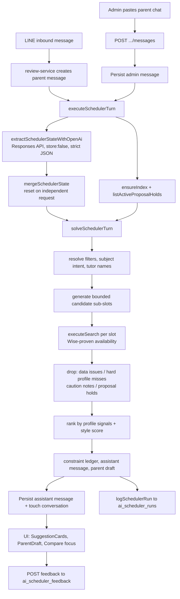

# AI Scheduler

**Status: experimental** — a documentation-side label. No maturity marker exists in code (no `@deprecated`, no feature-status constant); the badge is carried by three prose files: [AGENTS.md](../../AGENTS.md) (`:50`), [docs/README.md](../README.md) (`:139`), and [docs/handbook/overview.md](../handbook/overview.md) (`:33`).

> An LLM-backed scheduling assistant. An admin pastes a parent/admin chat; the model extracts a structured scheduling *request* as strict JSON, the application proves availability deterministically against the Wise snapshot, and the assistant returns ranked options plus an editable parent reply. The model never decides availability. What code does show is machinery built for a component still being tuned: the prompt and the solver are each stamped with their own version on every run (`AI_SCHEDULER_VERSION = "scheduler-2026-05-22-observability"`, `AI_SCHEDULER_PROMPT_VERSION = "prompt-2026-05-22-state-extraction-v1"`, `src/lib/ai/scheduler-service.ts:20-21`), and an offline eval harness re-scores the feature against fixture + mined-regression cases (`scripts/evaluate-ai-scheduler.ts`). Whether the behaviour has settled is a judgement the badge carries, not something the source can assert.

## Purpose

The manual workflow makes an admin read a parent message, translate it into search filters (subject / curriculum / level / day / time / duration / mode), run the search, read the results, and hand-write a reply. The AI Scheduler collapses that into a chat thread: paste the parent's message, get back ranked slot suggestions (or a broad date-range availability summary), an explainability panel, and a parent-ready draft that can be copied into LINE.

The load-bearing product rule is **the model parses, the application decides**. The extraction call is told so explicitly — the system prompt is `"You extract evolving BeGifted scheduling state as strict JSON. You never decide availability."` (`src/lib/ai/scheduler-conversation.ts:2361`) — and every availability claim is produced by the same `executeSearch` engine the manual search uses (`src/lib/ai/scheduler-conversation.ts:1680`). Fail-closed rules (unresolved identity/modality/qualification → Needs Review, cancelled sessions non-blocking) are inherited from that engine, not re-implemented here.

**Who can reach it:** `/scheduler` and `/scheduler/metrics` carry no route-specific role check, so nothing narrows this feature's operator population further than `/search` — but the shared gate they both pass through is more than a sign-in allowlist. Sign-in resolves a role *and* a page grant (`resolveUserAccess`, `src/lib/auth-access.ts:56-85`), and `src/middleware.ts` enforces the grant on every request: a null `admin_users.allowed_pages` means full access (`src/lib/db/schema.ts:581`), while a non-null list is matched by `isPathAllowed` (`src/middleware.ts:30-61`, applied `:78-88`), which answers `403 {"error":"Forbidden"}` on an unmatched `/api/*` path and redirects an unmatched page to `allowedPages[0]`. Non-admin roles resolve to single-page grants — `counselor`, `student`, and `parent` to `["/admissions"]`, `teacher` to `["/progress-tests"]` (`auth-access.ts:70-82`) — so a signed-in non-admin cannot reach the scheduler at all. The pages additionally `redirect("/login")` without a session. The same boundary is stated from the API side in [docs/reference/api/ai-scheduler.md](../reference/api/ai-scheduler.md). The `/scheduler` workspace is also the day-to-day triage surface for the LINE AI Review queue, because LINE-sourced parent messages are written into the *same* conversation/message tables (`src/lib/line/review-service.ts:302-310`). `/scheduler/metrics` is a read-only staff view of how often admins accept, edit, or reject AI drafts.

## Conceptual data model

The feature owns four tables. What each one is *for* is below; the column inventories (types, defaults, indexes, FK delete behaviour) are owned by [docs/reference/database/erd-ai-and-proposals.md](../reference/database/erd-ai-and-proposals.md), and the feedback DTO shape by [docs/reference/api/ai-scheduler.md](../reference/api/ai-scheduler.md).

- **`ai_scheduler_conversations`** — one row per chat thread, holding the customer context the thread is about. The load-bearing column is `extracted_state`: a denormalized JSON blob carrying the running scheduling state for the thread, which is fed back into the next turn's prompt — that is what makes a thread multi-turn rather than a series of independent parses. Note *which* state gets persisted: the route writes `assistantResult.state` (`messages/route.ts:125`), and `solveSchedulerTurn` returns `state: resolvedState` (`scheduler-conversation.ts:2817`, built at `:2733-2741`) — that is the **resolved** state, not the raw merge of the model's extraction. By then `resolveSchedulerState` has filled the 60-minute / `either` defaults and recorded them as assumptions (`:1256-1268`), `resolveSchedulerFilters` has rewritten `filters` through `resolveAcademicFilters` (`:2708`, `:1321-1322`), and the deterministic guard questions have been folded into `unresolvedQuestions` (`:2718-2723`). So what the model sees on the next turn is app-derived, not merely model-derived — the "application decides" rule reaches into the thread's memory, not just its answers.
  - **Deletion.** Nothing on the HTTP surface deletes a thread: `DELETE` archives it (`[conversationId]/route.ts:87`). One wired ops path does hard-delete — `deleteLineTestData` removes LINE-linked `ai_scheduler_feedback`, `ai_scheduler_runs`, and `ai_scheduler_conversations` rows outright (`src/lib/line/test-data-cleanup.ts:232-259`). It is reachable only through `npm run line:test-data:cleanup` (`package.json:25`, `scripts/delete-line-test-data.ts:34-40`) and refuses to run without `CONFIRM_DELETE_LINE_TEST_DATA=delete-line-test-data` (`test-data-cleanup.ts:5`, `:225-227`).
- **`ai_scheduler_messages`** — the turn-by-turn transcript, and the seam with LINE: an inbound LINE message becomes a `parent`-role row in *this* table rather than in a table of its own (`src/lib/line/review-service.ts:302-310`), which is why the two features share a workspace. The role value set is in [erd-ai-and-proposals.md](../reference/database/erd-ai-and-proposals.md). Assistant rows carry the entire solver result in `structured_payload` (suggestions, availability summary, constraint ledger, resolved state, parent draft) — the UI re-renders panels straight from that payload (`src/components/scheduler/scheduler-workspace.tsx:2099-2154`), so the transcript is self-describing without re-running the solver.
- **`ai_scheduler_runs`** — the observability log: one row per turn, capturing what the model was asked, how long each leg took, and whether the turn solved. Two properties matter here: the input preview is **PII-redacted** before it is stored, and `logSchedulerRun` swallows its own DB errors and returns the literal `"unlogged"` so a logging failure can never break a turn (`src/lib/ai/scheduler-data.ts:489-533`).
- **`ai_scheduler_feedback`** — the labeled-outcome corpus: one row per admin reaction to a draft (`accept` / `edit` / `reject` / `dismiss`). It is what makes AI quality measurable — the offline eval harness mines it for regression cases (`loadFeedbackCases`, `scripts/evaluate-ai-scheduler.ts:216-272`) and the correction telemetry aggregates it — and it is the join point back to LINE via `line_review_id`.

**Read but not owned.** The conversation list joins `line_scheduler_reviews` and `line_contact_student_links` to compute per-thread LINE rollups — pending review count, oldest pending timestamp, latest status, and whether the contact still lacks a verified student link (`src/lib/ai/scheduler-data.ts:218-271`); a thread with any review row is reported as `source: "line"`. The solver itself touches no scheduler tables: it reads the in-memory **search index** (snapshot tutor groups, qualifications, availability windows, tutor business profiles) and the **active proposal holds** (`src/lib/ai/scheduler-service.ts:60-63`).

## API surface

All eight endpoints live under `src/app/api/ai-scheduler/` and open with the same `auth()` → `401` gate. The mechanics — which handlers parse a body, what a validation failure returns, which one guards its business logic, the per-handler line index — are documented once in [docs/reference/api/ai-scheduler.md](../reference/api/ai-scheduler.md) and are not repeated here. Two properties are product-level rather than mechanical and do belong here: the group never hard-deletes over HTTP, and a turn that fails still returns a renderable thread rather than an error page (see [Business rules](#business-rules--edge-cases)).

| Endpoint | Purpose |
| --- | --- |
| `GET /api/ai-scheduler/conversations` | List threads with owner / free-text / sort filters plus per-admin facet counts (`conversations/route.ts:27`). |
| `POST /api/ai-scheduler/conversations` | Create an empty manual conversation owned by the caller (`conversations/route.ts:54`). |
| `GET /api/ai-scheduler/conversations/{conversationId}` | Fetch one conversation with its full transcript (`[conversationId]/route.ts:26`). |
| `PATCH /api/ai-scheduler/conversations/{conversationId}` | Update title, customer fields, notes, or status (`[conversationId]/route.ts:44`). |
| `DELETE /api/ai-scheduler/conversations/{conversationId}` | **Archives** (soft delete) — sets `status="archived"`, never deletes the row (`[conversationId]/route.ts:77-93`). |
| `POST /api/ai-scheduler/conversations/{conversationId}/messages` | The core turn: persist the admin message, run extraction + deterministic solve, persist the assistant reply, log a run (`messages/route.ts:50`). |
| `POST /api/ai-scheduler/messages/{messageId}/feedback` | Record accept / edit / reject feedback against an assistant message and its run (`feedback/route.ts:41`). |
| `GET /api/ai-scheduler/metrics` | Aggregate run metrics + LINE analytics + correction telemetry (`metrics/route.ts:8`). |

**A ninth caller lives outside the group.** `POST /api/search/assistant` (documented in [docs/reference/api/misc.md](../reference/api/misc.md)) is a single-turn adapter over the *same* solver: it calls `executeSchedulerTurn` with an empty prior state and reshapes the result into the legacy `AiSchedulerResponse` union (`src/app/api/search/assistant/route.ts:101-133,169-174`). **It has no in-app UI consumer today.** The only code in the repo that calls it is `src/components/search/ai-scheduler-panel.tsx:87`, and that component is unmounted: `AiSchedulerPanel` (`:65`) has zero importers anywhere in `src/` — `/search` renders `SearchWorkspace` (`src/app/(app)/search/page.tsx`), which never imports it. The same dead-component finding is recorded from the search side in [docs/features/tutor-search.md](tutor-search.md).

## UI

Two pages under `src/app/(app)/scheduler/`. In both, the exported page component is **synchronous** and does nothing but wrap a separate async body component in `<Suspense fallback={null}>`; the `auth()` gate and `redirect("/login")` live in that async child, not in the page export (`scheduler/page.tsx:8` vs `:28`; `scheduler/metrics/page.tsx:6` vs `:15`). Nav entries are declared in `src/lib/navigation/tools.ts:93-100` (`Scheduler`, section `scheduling-tutors`, `shortcut: true`) and `:154-160` (`Scheduler Metrics`); both paths also opt into the stale-snapshot banner (`src/components/layout/stale-snapshot-banner.tsx:23-24`).

- **`/scheduler`** (`src/app/(app)/scheduler/page.tsx`) server-loads the tutor list (`:14`) and passes `aiSchedulerEnabled = isAiSchedulerConfigured()` (`:22`) so the composer can be disabled when no key is configured.
- **`/scheduler/metrics`** (`src/app/(app)/scheduler/metrics/page.tsx`) renders `SchedulerMetricsView` (`:12`).

Key components in `src/components/scheduler/`:

- **`scheduler-workspace.tsx`** (2,366 lines, `"use client"`) — the workspace. Above the fold sit `LineQueueBand` (`:482`) and `MissedMessagesBand` (`:611`); below, a 280px conversation rail, a centre chat column, and a right panel that toggles **Notes** ⇄ **Compare** (`:2210-2258`). Per-assistant-message panels:
  - `SuggestionCard` (`:726`) — ranked slot, tutors, profile-evidence bullets, reason chips, and a **Compare** button.
  - `ParentDraft` (`:789`) — editable draft with copy-to-clipboard; the primary button submits `accept` when the text is untouched and `edit` when it differs (`:880`), and the reject form requires both a reason and a staff correction (`:921`).
  - `WhyTheseTutorsPanel` (`:1081`) and `AvailabilitySummaryPanel` (`:935`) — explainability surfaces driven entirely by the stored solver payload. `AiDecisionChecklist` (`:992`) is the exception: it is rendered as `state={payload.state ?? state}` (`:2130`), and that fallback `state` is the *live conversation's* `extractedState` (`:1832`), not the message's. It matters exactly once — the 502 failure path stores `structuredPayload: { error: message }` with no `state` (`messages/route.ts:159`), so a failed turn's checklist describes the thread's newest state rather than anything recorded with that message.
  - `LineReviewPanel` (`:1124`) — inline LINE review triage; it calls `/api/line/*`, not the AI-scheduler endpoints.
  - Behavioural details worth knowing: the LINE queue and false-negative list poll every 60 s (`:1635-1638`); the owner filter defaults to `mine` and falls back to `all` once if that returns nothing (`:1530`, `:1609-1613`); conversation detail edits autosave on a 650 ms debounce (`:1688-1709`); after each turn the first suggestion of the newest assistant message auto-focuses the compare panel (`:1763-1769`).
  - Compare is the shared `ComparePanel` + `useCompare()` hook embedded in-page (`:28-29`, `:2253`), so "Compare" never navigates away to `/search`.
- **`scheduler-compare-focus.ts`** — pure helpers converting a suggestion into a compare focus target: at most three tutor ids, the Monday of a one-time date's week, and the active weekday (`buildSchedulerCompareFocusTarget`, `:64-81`).
- **`metrics-view.tsx`** — fetches `/api/ai-scheduler/metrics` and renders **only** the `correction` slice: accept/edit/reject/dismiss rates, avg + p50 time-to-review, and a confidence-band × outcome table (`:57-64`, `:94-137`). The `scheduler` and `line` slices of the same response are not rendered here.

## Data flow

One turn of `POST …/messages` (`src/app/api/ai-scheduler/conversations/[conversationId]/messages/route.ts:50-191`, orchestrated by `executeSchedulerTurn`, `src/lib/ai/scheduler-service.ts:48-107`):

1. **Route** authenticates, rejects when unconfigured (`503`), Zod-validates the body (exact field constraints in [docs/reference/api/ai-scheduler.md](../reference/api/ai-scheduler.md)), loads the conversation + transcript, refuses archived threads (`409`), and persists the admin message *before* calling the model.
2. **Index + holds** — `ensureIndex(db)` warms the snapshot index; `listActiveProposalHolds(db)` is started in parallel and awaited after the model call. Both legs are timed into `latencyBreakdownMs.dbMs`.
3. **Extraction** — `extractSchedulerStateWithOpenAi` posts to the OpenAI Responses API with `store: false`, `reasoning.effort`, and a `strict: true` `json_schema`, passing the saved state, the last 12 transcript messages, today-in-Bangkok, and the live valid subjects/curriculums/levels/tutor names (`scheduler-conversation.ts:2271-2386`). Those lists are **prompt-text grounding, not a hard constraint**: they are injected as plain `Valid subjects: …` / `Active tutors: …` lines (`:2321-2324`), while the JSON schema types `filters.subject` / `curriculum` / `level` as free-form `{type:"string"} | null` with no `enum` (`:344-353`). The prompt in fact *instructs* the model to emit out-of-list level text — it says to preserve raw level phrases such as `Y10` / `Grade 10` / `ม.4` in `filters.level` and not to invent canonical Wise levels (`:2304-2305`). Snapshot-safe values are produced afterwards, deterministically, by `resolveAcademicFilters` (`src/lib/ai/academic-levels.ts:284`, called at `scheduler-conversation.ts:698`).
4. **Merge** — `mergeSchedulerState` folds the extraction into the saved state, or discards the saved state entirely when `isIndependentSchedulingRequest` detects a different student / subject / slot set (`:893-969`).
5. **Deterministic solve** — `solveSchedulerTurn` (`:2691-2828`) resolves academic filters and subject intent, resolves tutor include/exclude names, generates bounded candidate sub-slots, runs `executeSearch` per slot, filters out unsafe tutors, ranks by profile signals, builds the constraint ledger, and composes the assistant message + parent draft.
6. **Persist + log** — assistant message (full payload, `model`, `latencyMs`), conversation touch (the solver's **resolved** state — see the `extracted_state` note above — plus an auto-title when still `"Untitled scheduler chat"`, and customer fields), and an `ai_scheduler_runs` row with the redacted preview and latency breakdown.

```mermaid
flowchart TD
  A[Admin pastes parent chat] --> B[POST .../messages]
  L[LINE inbound message] --> B2[review-service creates parent message]
  B --> C[Persist admin message]
  B2 --> D
  C --> D[executeSchedulerTurn]
  D --> E[ensureIndex + listActiveProposalHolds]
  D --> F[extractSchedulerStateWithOpenAi<br/>Responses API, store:false, strict JSON]
  F --> G[mergeSchedulerState<br/>reset on independent request]
  G --> H[solveSchedulerTurn]
  E --> H
  H --> I[resolve filters, subject intent, tutor names]
  I --> J[generate bounded candidate sub-slots]
  J --> K[executeSearch per slot<br/>Wise-proven availability]
  K --> M[drop: data issues / hard profile misses<br/>caution notes / proposal holds]
  M --> N[rank by profile signals + style score]
  N --> O[constraint ledger, assistant message, parent draft]
  O --> P[Persist assistant message + touch conversation]
  O --> Q[logSchedulerRun to ai_scheduler_runs]
  P --> R[UI: SuggestionCards, ParentDraft, Compare focus]
  R --> S[POST feedback to ai_scheduler_feedback]
```

## Business rules & edge cases

- **Fail-closed tutor selection.** A tutor that `executeSearch` returned as available is still dropped when: the caller pinned other tutors or excluded this one (`scheduler-conversation.ts:1703-1708`); the indexed group carries any data issue (`groupHasDataIssue`, `:1539-1541`, applied `:1710`); it fails *hard* business requirements (`:1711`); a profile signal raises a review reason (`:1724`); or an active proposal hold covers the slot (`:1715`). The date-range availability path applies the same gates (`:1920-1939`). When nothing survives, the result is an explicit warning, never a silent "available" (`:1800-1805`).
- **"Hard" vs "soft" tutor-profile requirements.** Only English proficiency, young-learner age, and school keywords can *exclude* a tutor (`hasHardBusinessRequirements`, `:1566-1572`); a tutor with **no** business profile fails them outright (`matchesBusinessRequirements`, `:1594-1596`) — missing context is never treated as a match. Teaching-style tags only influence ranking (`teachingStyleScore`, `:1614-1624`).
- **Caution notes can veto.** A `doNotUseForNotes` entry that matches the request scores `-6` and is emitted as a `review` signal, which removes the tutor; an unrelated caution note only scores `-1` and merely deprioritises (`src/lib/ai/tutor-profile-signals.ts:187-211`, consumed at `scheduler-conversation.ts:1724`).
- **Bare-weekday ambiguity resolves to recurring, with a recorded assumption.** A weekday with no exact date becomes `recurring` and an assumption is appended; a `one_time` claim without a date is likewise downgraded to recurring (`resolveSchedulerState`, `:1243-1254`). Note the legacy one-shot parser in `scheduler.ts` does the opposite — it returns `needs_clarification` for a bare weekday (`src/lib/ai/scheduler.ts:515`); see [Open questions](#open-questions).
- **Broad search is suppressed rather than guessed.** Negative feedback, a time with no day/date, a day with no start time, or day+time prose that failed to become structured `requestedSlots` all skip the search with the warning `"Skipped broad scheduler search because explicit constraints were not safely structured."` (`shouldSuppressBroadSearch`, `:2754-2757`, `:2770-2771`; detector `hasUnstructuredSlotEvidence`, `:2388-2398`).
- **Parent-readiness gate.** `parentReady` requires **zero** open questions *and* no constraint-ledger item in `needs_clarification` (`:2751-2752`). When false, the parent draft is rewritten as a "need to confirm one detail first" message with tentative windows (`:2203-2211`) and the UI badges it as needing admin review.
- **Constraint ledger.** Every constraint the turn considered is written down as a row recording the *requested* value against the *normalized* one, where that value came from (the model, deterministic recovery, a default, or nothing at all), and whether it is settled or still needs clarification (`buildConstraintLedger`, `:2448-2580`). Its purpose is auditability rather than display: it is what lets `getAiSchedulerMetrics` count `parentReadyConstraintFailures` — runs the solver marked `solved` that nonetheless carry a `needs_clarification` ledger item, i.e. drafts declared parent-ready on an unsettled constraint (`hasConstraintFailure`, `src/lib/ai/scheduler-metrics.ts:50-59`, applied `:108-111`). The full key list and the evidence/status value sets are in [docs/reference/api/ai-scheduler.md](../reference/api/ai-scheduler.md).
- **Defaults are surfaced, not hidden.** Missing duration → 60 min, missing mode → `either`, each adding an assumption (`:1256-1262`, constants `:24-25`). Only 60/90/120 minutes are representable at all — the JSON schema enumerates them (`:342`).
- **Weekday time floor.** With no explicit time, Mon–Fri candidate slots are floored to 15:00 (the institutional after-school window); weekends start at 00:00 (`dayFloorMinute`, `:1371-1374`).
- **Bounded slot enumeration.** Requested windows are walked in 30-minute steps and only sub-slots that fit entirely inside the requested window are generated (`:1443-1462`); a window shorter than the duration produces a warning instead of a slot (`:1437-1440`). At most 8 suggestions survive (`MAX_SCHEDULER_SUGGESTIONS`, `:26`), each showing at most 4 tutors (`:1792`), ranked `Best fit` / `Strong fit` (ranks 2–3) / `Good fit` (`:1779-1780`).
- **Date-range mode.** A broad `dateRange` with no requested slots switches the turn from "ranked suggestions" to an availability *summary* per tutor across the range (`:2758-2769`, built by `buildDateRangeAvailabilitySummary`, `:1877`). The summary embeds search provenance — snapshot id, profile version, and active-hold count — which is echoed verbatim into the no-result parent draft (`:2028-2032`, `:2166`).
- **Deterministic prose recovery** runs *before* the search, so a model that under-structures its output does not silently lose constraints: Mon–Sun prose → seven recurring weekday slots (`:1074-1100`), date-range prose → one-time slots (`:1102-1124`), "first week of July" / "Week แรกของ July" → 1–7 July (`inferFirstWeekDateRange`, `:1206-1227`), and a weekday recovered from raw text when the model left `dayOfWeek` empty (`inferWeekdayFromText`, `:1197-1204`). Thai and English are handled throughout (weekday patterns at `:1187-1195`).
- **English-family subject intent.** School-level English / writing requests are expanded deterministically to whichever English-family subjects (`EFL`, `ESL`, `Literature`, `EnglishVR`) are actually active for that level in the snapshot, or to `EnglishVR` alone for exam-prep wording (11+/13+/16+, VR, entrance) — and the intent is dropped entirely when no such subject is active (`buildEnglishSubjectIntent`, `:689-739`; `ENGLISH_FAMILY_SUBJECTS`, `:560`).
- **Multi-subject requests** ("Math / English / Science") run one search per subject and interleave each subject's top option before backfilling the remainder (`runSubjectSpecificSchedulerSearch`, `:2632-2689`).
- **Stale-question pruning.** Questions such as "which weekday or exact date" are removed once a later turn supplies a complete slot or a date range, so the thread does not keep asking what it already knows (`pruneStaleQuestions`, `:971-1004`).
- **PII redaction in the audit log.** Emails, phone-shaped digit runs, and long digit sequences are replaced and the preview is truncated to 600 chars before it reaches `ai_scheduler_runs` (`redactAiSchedulerInput`, `src/lib/ai/scheduler.ts:439-450`). ISO dates are deliberately exempted from the phone rule (`:444`).
- **Feature flag + config.** Enabled only when `ENABLE_AI_SCHEDULER !== "false"` **and** `OPENAI_API_KEY` is non-empty (`isAiSchedulerConfigured`, `src/lib/ai/scheduler.ts:477-480`). Model defaults to `gpt-5.4-mini` (`OPENAI_SCHEDULER_MODEL`), reasoning effort defaults to `low` (`OPENAI_SCHEDULER_REASONING_EFFORT`) — none of these are in the validated `src/lib/env.ts` schema; only three appear in `.env.example:19-21`. Versions stamped on every run come from `AI_SCHEDULER_VERSION` / `AI_SCHEDULER_PROMPT_VERSION` (`src/lib/ai/scheduler-service.ts:20-21`).
- **Graceful failure.** If the turn throws, the admin message stays persisted, a fallback assistant message is written ("use the manual search while I recover"), a `failed` run is logged, and the route returns `502` with both messages so the UI can render the thread intact (`messages/route.ts:153-190`).
- **`dismiss` feedback is LINE-only, by construction.** The AI-scheduler feedback route accepts only `accept` / `edit` / `reject` (`feedback/route.ts:7-30`), yet `dismiss` rows exist in `ai_scheduler_feedback` and the metrics UI shows a Dismiss rate. They are written by the LINE path, not this one: `dismissLineSchedulerReview` (`src/lib/line/review-service.ts:617`) calls `createSchedulerFeedback` (`:627`) with `action: "dismiss"` (`:631`), carrying the `lineReviewId`, classifier confidence, and time-to-review with it. It is reached from `PATCH /api/line/scheduler-reviews/{reviewId}` with `action: "dismiss"` (`src/app/api/line/scheduler-reviews/[reviewId]/route.ts:41`), which the workspace's Dismiss button fires (`scheduler-workspace.tsx:1500`). So "dismissed" means *a LINE review was closed without sending*, which has no equivalent in a manually-typed thread.
- **Aggregation windows are fixed.** Run metrics cover the most recent 500 runs (`scheduler-metrics.ts:81`), correction telemetry the most recent 5000 feedback rows (`correction-telemetry.ts:56`), and the conversation list the most recent 200 threads (`scheduler-data.ts:209,215`) — all unpaginated.
- **No `maxDuration` is exported** by any AI-scheduler route (nor by `/api/search/assistant`), unlike the sync/import routes, so a turn runs under the platform default. The repo carries no production latency measurement to size that against. The only published figure comes from the offline eval harness (`docs/ai-scheduler-eval-latest.md:9`: "p50 4459ms · p95 11353ms"), and that run used `gpt-5.5` (`:4`) rather than the configured default `gpt-5.4-mini` (`src/lib/ai/scheduler.ts:8`, `.env.example:20`) — so it indicates the order of magnitude, not a production p95. Real-run p50/p95 *is* computed over the most recent 500 runs (`scheduler-metrics.ts:112-119`), but nothing in the UI renders it (see [Open questions](#open-questions)).

## Tests

Unit tests live in sibling `__tests__/` directories and run under Vitest's `unit` project via `npm test`. The `scripts/` harnesses are **not** part of that run.

- `src/lib/ai/__tests__/scheduler-conversation.test.ts` (33 cases) — by far the deepest coverage: default duration/mode + weekday-floor broad search, unmapped-qualification tentativeness, ambiguous tutor names, proposal-hold suppression, multi-slot extraction, requested-slot-only search, academic-level mapping (Y10; Grade 10 ambiguity), verified-English / young-learner / teaching-style profile filtering and ranking, caution-note exclusion, bounded sub-slot generation, broad-search suppression, stale-state reset for a new student, tutor exclusions ("แทนครูจูน"), negative-feedback clarification, first-week-July expansion, Writing-Y6 → English-family mapping, Mon–Sun and date-range prose recovery, date-range availability summaries (excluding sessions and leaves), stale-question pruning, raw-text weekday recovery, and multi-subject search.
- `src/lib/ai/__tests__/scheduler.test.ts` (6 cases) — the legacy one-shot parse path: valid bounded parse, missing-field clarification, delivery-mode default warning, inactive-filter / ambiguous-tutor clarification, PII redaction, and that the OpenAI call uses the Responses API with `store: false`.
- `src/lib/ai/__tests__/academic-levels.test.ts` (10 cases) — year/grade/Thai/exam level mapping, Grade-10 ambiguity with and without curriculum, and subject/curriculum alias recovery.
- `src/lib/ai/__tests__/correction-telemetry.test.ts` (4 cases) — outcome rates summing to 1, confidence-band bucketing, empty table, and averaging only over rows that recorded timing.
- `src/app/api/ai-scheduler/conversations/__tests__/route.test.ts` (5 cases) — auth gate, list filters + admin facets, `scope=mine`, invalid sort, ownership on create.
- `src/app/api/ai-scheduler/conversations/[conversationId]/messages/__tests__/route.test.ts` (1 case) — persists admin + assistant messages around a solved turn.
- `src/app/api/ai-scheduler/messages/[messageId]/feedback/__tests__/route.test.ts` (3 cases) — `401`, accepted-draft persistence, required reason + correction on reject.
- `src/components/scheduler/__tests__/scheduler-compare-focus.test.ts` — the pure compare-focus helpers plus source-level guardrails asserting the workspace embeds the shared `ComparePanel`/`useCompare`, keeps suggestion-compare in-page rather than navigating to `/search`, and orders the LINE triage UI.
- `src/app/api/search/assistant/__tests__/route.test.ts` (4 cases) — the single-turn adapter over the same solver: `401`, `503` when unconfigured, legacy solved-shape adaptation, and clarification when not parent-ready.

### Evaluation reports (linked, maintained elsewhere)

Offline accuracy/latency work is generated into `docs/` by scripts and is **not** edited by hand from this doc. Each file below was confirmed to exist and to be produced by the script named; their internal numbers are script output and are not re-derived here (the one exception is the latency line quoted above, read verbatim from `docs/ai-scheduler-eval-latest.md:9` — and, per that caveat, measured on a model the app does not default to).

- [docs/ai-scheduler-eval-latest.md](../ai-scheduler-eval-latest.md) — latest eval run; written by `scripts/evaluate-ai-scheduler.ts` (`npm run ai-scheduler:evaluate`), which scores each case out of 10 and sets a non-zero exit code when any critical failure remains (`scripts/evaluate-ai-scheduler.ts:406-410`). Cases come from the static fixture set `docs/ai-scheduler-eval-cases.json` **plus** regression cases mined from real `ai_scheduler_feedback` rows (`loadFeedbackCases`, `:216-272`; merged in `loadCases`, `:274-279`).
- [docs/ai-scheduler-model-comparison.md](../ai-scheduler-model-comparison.md) — model/reasoning-effort bake-off; written by `scripts/compare-ai-scheduler-models.ts` (`npm run ai-scheduler:compare-models`).
- [docs/ai-scheduler-audit-2026-05-20.md](../ai-scheduler-audit-2026-05-20.md), [docs/ai-scheduler-audit-2026-05-21.md](../ai-scheduler-audit-2026-05-21.md) — production accuracy audits against a 10-point rubric.
- [docs/ai-scheduler-replay-eval-2026-05-20.md](../ai-scheduler-replay-eval-2026-05-20.md), [docs/ai-scheduler-replay-eval-2026-05-21.md](../ai-scheduler-replay-eval-2026-05-21.md) — read-only replays of production runs (`scripts/replay-ai-scheduler-runs.ts`).

## Open questions

- **Where does "AI Scheduler" end and "LINE AI Review" begin?** The two features share `ai_scheduler_conversations` / `_messages` / `_runs` / `_feedback`; LINE writes `parent`-role messages and drives its own turns through `executeSchedulerTurn` (`src/lib/line/review-service.ts:302-348`), and `SchedulerWorkspace` renders the LINE queue, missed-message band, and per-review triage inline. This is an ownership/product boundary a human has to draw; the code does not settle it.
- **Is the one-shot parser dead?** `parseSchedulingRequestWithOpenAi`, `normalizeAiSchedulerModelParse`, `resolveAiSchedulerFilters`, and `resolveAiSchedulerTutorNames` in `src/lib/ai/scheduler.ts` have no production caller — a repo-wide search finds them only in `src/lib/ai/__tests__/scheduler.test.ts:3-7`. `buildAiSchedulerPrompt` (`scheduler.ts:501`) and `openAiSchedulerJsonSchema` (`:145`) are not even referenced by that test; their only uses are inside `scheduler.ts` itself (`:563`, `:571`), reached transitively from `parseSchedulingRequestWithOpenAi` — so all six are unreachable from production. Note that `scheduler.ts` as a whole is **not** dead: `/api/search/assistant` imports four *runtime* values from it — `aiSchedulerRequestSchema`, `isAiSchedulerConfigured`, `redactAiSchedulerInput`, `aiSchedulerModel` (`src/app/api/search/assistant/route.ts:4-13`, used at `:148`, `:156`, `:165`, `:166`) — alongside the types, then calls the conversational solver. The two paths also disagree on bare-weekday handling (clarify vs assume-recurring). Confirm before deleting.
- **`aiSchedulerShadowModel()` has no caller at all.** It reads `OPENAI_SCHEDULER_SHADOW_MODEL` (`src/lib/ai/scheduler.ts:465-467`) but nothing in `src/` or `scripts/` invokes it — not even the model-comparison script, which spawns full eval runs with env overrides instead. Intended-but-unwired shadow runs, or dead code?
- **Two of three metrics slices are unrendered.** `GET /api/ai-scheduler/metrics` computes `scheduler` (run counts, latency p50/p95, version distribution, recent failures) and `line` analytics, but `SchedulerMetricsView` renders only `correction`. Are the run-level metrics meant to surface somewhere, or is the endpoint over-serving?
- **What is `/api/search/assistant` for now?** Its only in-repo caller, `AiSchedulerPanel`, is unmounted (see [API surface](#api-surface)), so the endpoint serves no UI. It is also allowlisted as public in `src/middleware.ts:8` while the handler itself returns `401` without a session (`src/app/api/search/assistant/route.ts:136-139`). Retained for an external caller, pending panel re-integration, or removable? The code cannot say; the intent — public NL search vs admin-only vs dead — needs a human decision.
- **API index wording drift.** `docs/reference/api/index.md:131` describes `DELETE /api/ai-scheduler/conversations/[conversationId]` as "Delete a conversation"; the handler archives and never deletes (`[conversationId]/route.ts:87`). The per-group reference page ([ai-scheduler.md](../reference/api/ai-scheduler.md)) is correct — the index summary line is the one to fix.

_Verified against HEAD + uncommitted WIP on 2026-05-31._
