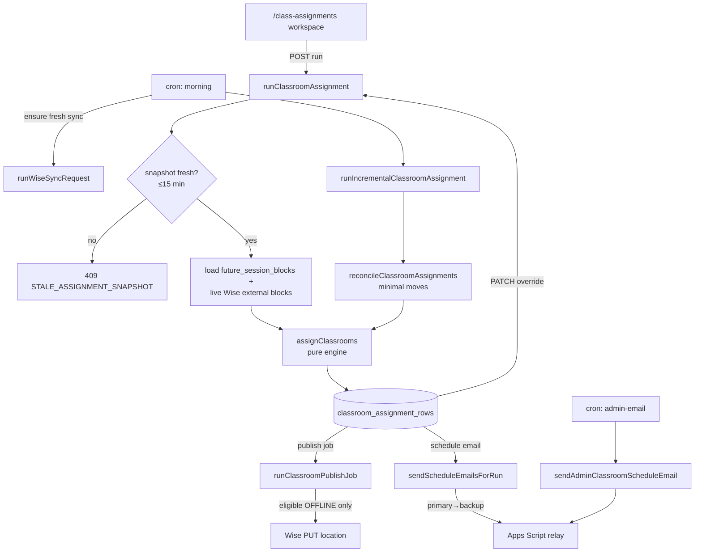

# Classroom Assignments

**Status: stable**

## Purpose

Classroom Assignments turns each day's Wise teaching sessions into a concrete physical-room plan for the BeGifted center, then optionally writes the chosen room back to Wise. For a given Bangkok date it loads the day's blocking sessions, runs a deterministic room-assignment engine that respects capacity, TV, online/onsite modality, per-tutor preferred rooms, and tutor continuity, and produces a reviewable table of `(session → room)` rows. Admin staff can hand-tune any row via overrides, publish eligible OFFLINE rooms to Wise, and email each tutor their personalized room route. A nightly cron automates the whole pipeline (sync → assign → publish → tutor emails) across a 7-day horizon, and a second cron emails admins a daily readiness/blocker summary.

Primary users are non-technical admin staff working the `/class-assignments` page, plus two unattended Vercel cron jobs that run the automation and the admin digest.

## Conceptual data model

All tables live in the shared Drizzle schema (`src/lib/db/schema.ts`). Conceptually the feature spans three groups; for exact columns, enums, and indexes see the database reference and ERD: [docs/reference/database/erd-classrooms.md](../reference/database/erd-classrooms.md).

**Room catalog & assignment state**
- `classroom_rooms` — the native room catalog (name, capacity, TV flag, category, active flag, sort order). Seeded/repaired on read from `DEFAULT_CLASSROOM_ROOMS` (`src/lib/classrooms/data.ts:426`).
- `classroom_assignment_runs` — one run per generation for a date, with status, override policy (`forceReassign`), reconciliation metadata, and rolled-up counts (assigned / needs_review / no_room / remote / published / failed).
- `classroom_assignment_rows` — denormalized per-session rows: the session facts copied from the snapshot, the engine's `assignedRoom` / `status` / `warnings` / `ruleTrace`, the admin `overrideRoom`, reconciliation `changeType` + `assignmentFingerprint`, and publish state (`publishStatus` / `publishError` / `publishedAt`).

**Publish & automation audit**
- `classroom_publish_jobs` — async Wise writeback jobs with progress counters (total / eligible / completed / success / failed / skipped) and lifecycle timestamps.
- `classroom_automation_events` — per-session change log emitted by reconciliation (added / changed / rescheduled / canceled / moved) tied to an automation batch.

**Tutor schedule email & admin digest**
- `tutor_contacts` — canonical per-tutor onsite/online email + phone, seeded from `RAW_TUTOR_CONTACTS` (`src/lib/classrooms/tutor-contacts.ts:24`) collapsed by canonical key.
- `classroom_schedule_email_runs` / `classroom_schedule_email_recipients` — per-run tutor email batches and per-recipient send outcomes (sent / failed / blocked) with primary→backup failover lineage.
- `classroom_admin_email_runs` / `classroom_admin_email_recipients` — the daily admin digest batch and per-recipient delivery records, keyed for idempotency by date.

**Read from other features (not owned here):** the active `snapshots` row and `sync_runs` (freshness gate), `future_session_blocks` (the session source), and `tutor_identity_groups` (display name + canonical key joins). Their shapes live in the same ERD reference.

## API surface

Admin endpoints require an authenticated session; the two `internal` endpoints are CRON_SECRET-protected (`src/lib/internal/cron-auth.ts`). Full request/response contracts are in [docs/reference/api/classrooms-and-assignments.md](../reference/api/classrooms-and-assignments.md).

- `GET /api/class-assignments?date=YYYY-MM-DD` — latest assignment run + rows + room catalog + snapshot freshness for a Bangkok date.
- `POST /api/class-assignments/run` — generate a fresh full assignment run for a date (`forceReassign` toggles keep-vs-recompute of prior overrides). 409 if the snapshot is stale.
- `PATCH /api/class-assignments/runs/{runId}/rows/{rowId}` — set/clear an override room and recompute the whole run in place.
- `POST /api/class-assignments/runs/{runId}/publish` — create a publish job and run it in the background (`after()`); returns 202 + `jobId`.
- `GET /api/class-assignments/runs/{runId}/publish/{jobId}` — poll publish-job progress; includes the refreshed run detail once terminal.
- `GET /api/class-assignments/runs/{runId}/teacher-schedule` — per-tutor schedule blocks for the run.
- `GET /api/class-assignments/runs/{runId}/schedule-email/preview` — per-tutor email preview (HTML/text/room route/map URL) plus blockers.
- `POST /api/class-assignments/runs/{runId}/schedule-email/send` — send tutor schedule emails (`selected` or `failed_only`, `primary`/`backup` sender).
- `GET /api/classrooms/rooms` — the room catalog (seeds defaults on read).
- `GET /api/classrooms/floor-plan-map?rooms=A|B` — public, unauthenticated SVG floor plan with the given rooms numbered (embedded as `` in tutor emails).
- `GET /api/internal/class-assignments/morning` — cron: full sync→assign→publish→today's-tutor-emails over a 7-day horizon.
- `GET /api/internal/class-assignments/admin-email` — cron: idempotent daily admin readiness/blocker digest.

## UI

- **Page**: `src/app/(app)/class-assignments/page.tsx` — thin wrapper rendering `ClassAssignmentsWorkspace`. Reached via the persistent "Class Assignments" nav link (`src/components/layout/app-nav.tsx:23`).
- **Workspace**: `src/components/class-assignments/class-assignments-workspace.tsx` — the entire operational surface: date picker, a "Sync Wise & generate" action, keep/force override policy control, publish-with-confirmation dialog, and tutor schedule-email preview/send dialog. It exposes four tabbed views (`src/components/.../class-assignments-workspace.tsx:776`): **Floor plan** (default), **Room calendar**, **Rows** (the editable assignment table with per-row override dropdowns), and **Tutors** (per-tutor schedule, enabled only when rows exist).
- **Visualization components**: `floor-plan-occupancy.tsx` (SVG center map with a time-scrubber, driven by `src/lib/classrooms/floor-plan.ts` geometry), `room-calendar-view.tsx`, `room-occupancy-heatmap.tsx`, `assignment-timeline-controls.tsx` (playback scrubber), and `assignment-detail-popover.tsx`. Timeline math lives in `src/lib/classrooms/visualization.ts`.
- **Client sync helper**: `src/components/class-assignments/sync-flow.ts` — drives the "Sync Wise before generating" flow, polling `/api/class-assignments` until a fresh snapshot is observed (12-minute client timeout).

## Data flow

A manual generate-and-publish from the UI:

1. The workspace optionally syncs Wise first (`sync-flow.ts`), then `POST /api/class-assignments/run`.
2. `runClassroomAssignment` (`src/lib/classrooms/data.ts:864`) gates on snapshot freshness, loads the date's blocking sessions from `future_session_blocks` joined to `tutor_identity_groups`, fetches **live** Wise sessions to derive external room blocks, then calls the pure engine `assignClassrooms` (`src/lib/classrooms/assignment-engine.ts:293`).
3. The result is persisted as a new run + rows; the response carries any live-Wise room-conflict warnings.
4. Admin edits go through `PATCH .../rows/{rowId}` → `updateClassroomAssignmentOverride` (`data.ts:1097`), which re-runs the engine over the existing rows and resets publish state.
5. Publish creates a job and runs it in the background; `runClassroomPublishJob` (`data.ts:1444`) refreshes current Wise locations, filters eligible rows, resolves verified Wise location names, resolves room-swap dependencies, and PUTs `location` only for eligible OFFLINE sessions.
6. Tutor emails: `getScheduleEmailPreview` / `sendScheduleEmailsForRun` (`src/lib/classrooms/schedule-email.ts`) build per-tutor HTML with a numbered room route + embedded floor-plan SVG and send via an Apps Script relay, with automatic backup failover on quota exhaustion.

## Business rules & edge cases

**Fail-closed snapshot freshness.** A run is refused unless the active snapshot's promoting sync finished within `CLASSROOM_ASSIGNMENT_FRESHNESS_MS` = 15 minutes (`data.ts:129`, gate at `data.ts:567`). The route surfaces this as HTTP 409 with code `STALE_ASSIGNMENT_SNAPSHOT` (`src/app/api/class-assignments/run/route.ts:46`). The morning cron proactively triggers/waits for a fresh sync first (`morning-automation.ts:103`).

**Assignment engine priority cascade** (`assignment-engine.ts:417`–`542`), applied in order per session after sorting by start time then tutor priority: remote-online short-circuit → valid override → Kevin/Mek priority preferred room → online continuity (gap < 60 min reuses prior room) → Gift hard-pinned to `Joy (TV)` → general 15-minute continuity → preferred room → online-only room → priority-scored standard room → any standard room → Joy as fallback (non-Gift) → overflow-only → `NO_ROOM_AVAILABLE`. Override/priority/preferred claims are reserved in pre-passes via a `protectedClaims` map (`assignment-engine.ts:332`–`379`) so a higher-priority tutor isn't crowded out by an earlier overlapping generic session.

**Capacity is fail-closed to "needs review".** Capacity uses Wise `studentCount`; if absent it infers 1:1 from class type/title/student name, otherwise defaults capacity 1 **and** flags `needs_review_missing_capacity` (`assignment-engine.ts:121`). Such rows are not publishable.

**Online vs onsite "center room needed".** Modality is matched only against known tokens — online = `online|scheduled|virtual`, onsite = `offline|onsite|in-person`; anything else is `unknown` (`src/lib/classrooms/session-mode.ts:1`). An online session needs a center room only if it is sandwiched (gap < 60 min) against an onsite session for the same tutor (`assignment-engine.ts:222`); otherwise it becomes `REMOTE_NO_ROOM_NEEDED` and is excluded from publishing.

**Override validation.** An override is honored only if the room exists, is active, passes capacity/TV/type constraints, and is free; otherwise the row keeps a `warnings` entry (`invalid_override_room` / `override_room_unavailable`) and falls through the normal cascade (`assignment-engine.ts:424`).

**Live Wise room blocks.** Before assigning, the system pulls live Wise sessions and treats OFFLINE, blocking, same-date sessions **not** in the local set as occupied intervals (`liveRoomBlocksForDate`, `data.ts:206`/`229`), so the engine never double-books a room already used by a class outside the run.

**Publish eligibility is OFFLINE-only (v1).** `isClassroomPublishEligible` (`data.ts:1194`) requires status `assigned`, a real assigned room, an OFFLINE session type, present Wise class + session ids, and no `needs_review_missing_capacity`. Remote/online rows are intentionally skipped — v1 only writes `location` for OFFLINE sessions.

**Publish is fail-closed against stale/conflicting Wise state.** The publisher refuses when the Wise location catalog can't verify any locations (`data.ts:1395`), when the exact verified Wise location name (including the `" (TV)"` suffix form) is missing (`resolveWisePublishLocation`, `data.ts:324`), when the live Wise session vanished, or when a live external class overlaps the target room. It also resolves room-swap cycles by moving blockers to verified temporary locations rather than overwriting occupied rooms (`data.ts:1401`, `1604`). Stale `running` jobs are auto-failed after 6 minutes (`data.ts:128`, `1316`).

**Timezone.** Everything is Asia/Bangkok. Row times persist as Bangkok minute-of-day, and stored wall-clock timestamps are converted to Wise UTC instants for writeback (`classroomTimestampToWiseIso`, `data.ts:354`). Schedule/teacher rendering uses the minute fields, never re-deriving from serialized timestamps (regression-guarded by `data-timezone.test.ts`).

**Reconciliation = minimal moves.** The incremental run (`reconciliation.ts:256`) carries unchanged sessions forward by fingerprint (preserving publish state), classifies the rest as added/changed/rescheduled, logs canceled sessions, and only unlocks the **smallest** overlapping carried set when a new class can't otherwise fit — never displacing hard-pinned override rows (`reconciliation.ts:322`).

**Tutor email blockers & failover.** A tutor is "blocked" if missing a non-online email or if any of their rows are `needs_review`/`no_room` (`schedule-email.ts:515`). Sending fails closed on missing Apps Script config. On primary quota exhaustion the primary→backup failover auto-triggers for unsent ready tutors and de-dupes against already-sent recipients (`schedule-email.ts:898`, `1141`).

**Admin digest is idempotent and patient.** One terminal admin email per date (unique idempotency key `classroom-admin:{date}`, `admin-schedule-email.ts:295`); while automation is still preparing it returns `pending` and retries until the final-retry minute 07:30 Bangkok (`admin-schedule-email.ts:19`, `369`), then sends a single ACTION-REQUIRED failure summary.

## Tests

All under `src/lib/classrooms/__tests__/`, `src/app/api/.../__tests__/`, and `src/components/class-assignments/__tests__/`:

- **`assignment-engine.test.ts`** — capacity inference, TV requirement, live-block availability, online/SCHEDULED remote handling, the 60-minute online-center rule, Gift/Joy hard-pin, Kevin/Mek priority-room protection, continuity, overrides (valid/invalid/inactive), overflow ordering, and no-room.
- **`reconciliation.test.ts`** — carry-forward with publish state, canceled removal, fitting new sessions against carried blocks, reschedule detection, minimal-displacement unlock, override protection, remote carry.
- **`publish-eligibility.test.ts`** — eligibility rules, Bangkok→UTC timestamp conversion, progress/ETA math, verified Wise location resolution (TV vs plain, fail-closed on missing/empty catalog), live conflict + temporary-location swap helpers, and "no availability preflight" guarantee.
- **`schedule-email.test.ts`** / **`admin-schedule-email.test.ts`** — preview blockers, selected/failed-only sends, primary→backup quota failover (and de-dup), Apps Script relay payloads; admin digest fan-out, teacher-email summary, retry window, and idempotency.
- **`morning-automation.test.ts`** — fresh-sync reuse vs trigger, and today-only tutor emails after publish (with error isolation).
- **`rooms.test.ts`**, **`tutor-contacts.test.ts`**, **`visualization.test.ts`**, **`floor-plan-map.test.ts`**, **`data-timezone.test.ts`** — catalog TV-name canonicalization + repair migration, contact collapsing/aliases, timeline/occupancy math, floor-plan geometry coverage, and Bangkok-minute rendering.
- **Route tests** — `src/app/api/class-assignments/__tests__/route.test.ts` (auth, invalid date, run + override policy, 409 stale, override recompute, publish job start/poll, email preview/send incl. backup failover and validation/conflict cases) and `src/app/api/internal/class-assignments/__tests__/route.test.ts` (cron-secret gating for morning + admin-email).
- **Component tests** — `src/components/class-assignments/__tests__/sync-flow.test.ts` (sync-then-poll, fail-closed, timeout) and `visualization-components.test.tsx` (timeline/heatmap/floor-plan/calendar rendering, reduced-motion).

## Open questions

- `sync-flow.ts` posts to `/api/admin/sync-wise` (`sync-flow.ts:110`) while the rest of the codebase triggers `/api/internal/sync-wise`. Confirm `/api/admin/sync-wise` exists and is the intended UI-facing sync entry point (it was outside the documented code locations and not read here).
- Cron times in `vercel.json` are UTC (`45 23 * * *` morning, `0,10,20,30 0 * * *` admin-email) — i.e. ~06:45 and 07:00–07:30 Bangkok. Confirm these are the intended local run times given the 07:30 final-retry cutoff.
- Modality detection depends on Wise session `type` matching a fixed onsite/online token set; per the project's known-issues note, real Wise data may not always populate these reliably. Worth confirming how often sessions fall through to `unknown` and thus get treated as center-room-required.
- `RAW_TUTOR_CONTACTS` and the room preference/TV tutor maps are large hardcoded lists embedding personal emails/phones. Confirm this is the intended source of truth (vs. a Wise-derived contact import) and acceptable for a checked-in file.

_Verified against HEAD + uncommitted WIP on 2026-05-31._
