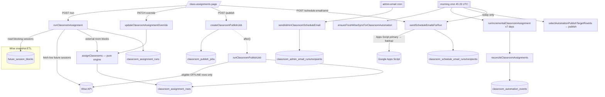

# Classroom Assignments

**Status: stable** (the schedule-email and morning-automation paths are the newest additions; the room-assignment engine and publish writeback are settled.)

## Purpose

Each teaching session in Wise needs a physical (or online) room. Wise does not assign rooms; admin staff used to do it by hand on a whiteboard. This feature computes a per-day room layout deterministically from the warm Wise snapshot, lets an admin review and override placements, and — opt-in, on explicit publish — writes the chosen room back into Wise as the session's `location`. An early-morning cron (`45 23 * * *` UTC, ~06:45 Bangkok) then runs the same pipeline unattended across a 7-day horizon starting that day, auto-publishes the safe changes, and emails each tutor their personalized schedule plus a floor-plan walking route. A second cron emails the admin team a morning summary.

Primary users:
- **Admin staff** drive the interactive `/class-assignments` page: pick a date, generate/regenerate the layout, hand-override individual rooms, publish to Wise, and send tutor schedule emails.
- **Tutors** receive (read-only) a daily schedule email with their classes, rooms, and a numbered floor-plan map.
- **The morning cron** (`cron@classroom-assignments`) runs the whole thing headless before the teaching day.

The assignment engine is pure, deterministic, and unit-tested in isolation from the database and Wise.

## Conceptual data model

Nine tables, all owned by this feature. Full structure (grain, keys, indexes, relationships) is the canonical responsibility of the ERD reference — see **[docs/reference/database/erd-classrooms.md](../reference/database/erd-classrooms.md)**. Column-level types live in [the database index](../reference/database/index.md). Conceptually:

- **`classroom_rooms`** — the room catalog (categorized as standard / overflow / online-only). Seeded from a code default (`DEFAULT_CLASSROOM_ROOMS`) on first read.
- **`classroom_assignment_runs`** — one row per (date, generation) attempt, carrying the source snapshot, a lifecycle status, count rollups, and automation lineage. The status defaults to `completed` and is recomputed to `published` / `partial` after a publish pass (`updateRunPublishStatus`, `data.ts:1307-1333`); the enum also declares `failed`, but no current code path sets that value for a run. The latest run for a date wins.
- **`classroom_assignment_rows`** — one row per session in a run: the session facts copied from the snapshot, the engine's placement and status, the admin override, a fingerprint for change detection, and the per-row publish state. (The persisted `ruleTrace` audit column is written here but never read by the client — the detail popover surfaces only the `warnings` array.)
- **`classroom_publish_jobs`** — an async job tracking a publish-to-Wise pass over a run (or a subset of target rows): total/eligible/success/failed/skipped counters, status, `lastError`, timestamps. Polled by the UI.
- **`classroom_automation_events`** — an audit trail of what the incremental reconciler did per session (`added` / `changed` / `rescheduled` / `canceled` / `moved`), keyed to an automation batch.
- **`classroom_schedule_email_runs`** + **`classroom_schedule_email_recipients`** — one run per send attempt of the tutor schedule emails, with a row per recipient (status, sender used, idempotency).
- **`classroom_admin_email_runs`** + **`classroom_admin_email_recipients`** — same shape for the daily admin summary email.

It also **reads** two core snapshot tables it does not own: `future_session_blocks` (the blocking sessions to place, scoped to the active `snapshotId`) and `tutor_identity_groups` (joined for the tutor display name). Admin email recipients are read live from `admin_users`.

## API surface

Twelve HTTP route handlers. Full request/response shapes, status codes, and side effects are the canonical responsibility of **[docs/reference/api/classrooms-and-assignments.md](../reference/api/classrooms-and-assignments.md)** — this list is purpose-only.

Session-authenticated (Auth.js) endpoints:

| Method + path | Purpose |
|---|---|
| `GET /api/class-assignments` | Load the latest run + live-Wise conflict overlay for one Bangkok date. |
| `POST /api/class-assignments/run` | Generate/regenerate a local run for a date (pure compute; never writes Wise). |
| `PATCH /api/class-assignments/runs/{runId}/rows/{rowId}` | Set/clear one row's room override and re-solve the whole run. |
| `POST /api/class-assignments/runs/{runId}/publish` | Start an async publish-to-Wise job for the run; returns a `jobId`. |
| `GET /api/class-assignments/runs/{runId}/publish/{jobId}` | Poll publish-job progress (and the refreshed detail when terminal). |
| `GET /api/class-assignments/runs/{runId}/teacher-schedule` | Per-tutor schedule view for the run. |
| `GET /api/class-assignments/runs/{runId}/schedule-email/preview` | Build the per-tutor email preview + blockers (no send). |
| `POST /api/class-assignments/runs/{runId}/schedule-email/send` | Send tutor schedule emails (selected or failed-only), with quota failover. |
| `GET /api/classrooms/rooms` | Return the active room catalog. |

Unauthenticated:

| Method + path | Purpose |
|---|---|
| `GET /api/classrooms/floor-plan-map` | Render a floor-plan SVG with the requested rooms highlighted (static image, no auth). |

Cron-authenticated (`CRON_SECRET`):

| Method + path | Purpose |
|---|---|
| `GET /api/internal/class-assignments/morning` | Headless: ensure a fresh sync, run 7 days incrementally, auto-publish, email today's schedules. |
| `GET /api/internal/class-assignments/admin-email` | Headless: email the admin team a daily classroom summary. |

Both crons are registered in [`vercel.json`](../../vercel.json) — morning at `45 23 * * *` (UTC; ~06:45 Bangkok), admin email at `0,10,20,30 0 * * *`. Each wraps its work in `withCronInvocationAudit` (job keys `classroom_morning` / `classroom_admin_email`) and carries an extended `maxDuration` (800s / 300s).

## UI

One page: **`src/app/(app)/class-assignments/page.tsx`**, which renders the single client shell **`src/components/class-assignments/class-assignments-workspace.tsx`** (the bulk of the UI — date picker, run/force-reassign controls, the assignment table with inline override editing, publish drawer with live progress polling, and the schedule-email drawer with per-recipient selection and send results).

Supporting components under `src/components/class-assignments/`:
- `assignment-timeline-controls.tsx` — playback scrubber (a "current minute" clock that animates room occupancy through the day).
- `floor-plan-occupancy.tsx`, `room-calendar-view.tsx`, `room-occupancy-heatmap.tsx` — the three visualization tabs (floor plan, GCal-style room columns, occupancy heatmap), driven by pure helpers in `src/lib/classrooms/visualization.ts`.
- `assignment-detail-popover.tsx` — per-row inline override editor: tutor, session time, a status badge, student/class details, the load/TV/override summary, the row's `warnings`, and a room-override `<select>` (`assignment-detail-popover.tsx:56-99`). It does **not** render the persisted `ruleTrace`.
- `sync-flow.ts` — client helper that triggers `/api/admin/sync-wise` and polls for a fresh snapshot before assigning (used when the snapshot is stale).
- `types.ts` — client-side mirrors of the server detail shapes.

## Data flow

A manual generate-then-publish, end to end:

1. The page loads `GET /api/class-assignments?date=…` → `getClassroomAssignmentForDate` reads the latest run for that date (or `null`).
2. The admin clicks **Run**. If the snapshot is stale, `sync-flow.ts` first kicks `/api/admin/sync-wise` and waits. Then `POST /api/class-assignments/run` → `runClassroomAssignment`: assert snapshot freshness → load room catalog + previous overrides → load blocking sessions from `future_session_blocks` → fetch live Wise future sessions to derive *external* room blocks (sessions already placed in Wise by someone else) → `assignClassrooms(...)` (the pure engine) → persist a new run + rows.
3. The admin optionally overrides a room (`PATCH …/rows/{rowId}`), which re-runs the engine over the saved rows with the new override map and resets publish state.
4. The admin clicks **Publish**. `POST …/publish` creates a `classroom_publish_jobs` row and schedules `runClassroomPublishJob` in the background (`after()`), returning `202` + `jobId`. The UI polls `GET …/publish/{jobId}` until terminal.
5. The publish job re-fetches live Wise sessions, refreshes each row's current Wise location, filters to eligible OFFLINE rows, resolves each assigned room to a *verified* Wise location name, detects conflicts, performs temporary-room swaps to break room-swap cycles, then writes `location` back to Wise per session and records the outcome.
6. The admin clicks **Send schedule emails**, which previews and dispatches per-tutor emails via a Google Apps Script web app, with automatic failover to a backup sender on quota exhaustion.

## Business rules & edge cases

**The assignment engine (`assignment-engine.ts`) is the core.** It is a multi-pass greedy solver. Notable, non-obvious rules:

- **Layered claim reservation, then assignment.** Before the main loop, the engine reserves "protected" room claims in priority tiers — first valid admin overrides, then Kevin/Mek "priority preferred" rooms, then ordinary preferred rooms — so high-priority sessions can't be crowded out by the greedy pass (`assignment-engine.ts:332-379`). The main loop then resolves each session through a fixed waterfall: override → priority preferred → online continuity → Gift's fixed room → ≤15-min continuity → preferred → online-only → priority-scored standard → standard → Joy fallback → overflow → `NO_ROOM_AVAILABLE` (`assignment-engine.ts:417-542`).
- **Tutor-specific rules are hardcoded** in `rooms.ts`: `PREFERRED_BY_TUTOR` (per-tutor preferred room, with `Online` and nickname aliases), `TV_REQUIRED_TUTORS` (tutors whose rooms must have a TV), Gift is pinned to `Joy (TV)`, and Kevin/Mek get a stronger "priority preferred" claim (`rooms.ts:89-159`). Room priority for the generic fallback follows `CORE_TEACHING_ROOM_PRIORITY` (`rooms.ts:15-33`).
- **Online sessions may need no room.** An online session only requires a center room if it is "connected" (gap `< 60` min, `ONLINE_CENTER_CONNECTION_GAP_MINUTES`) to an *onsite* session by the same tutor — i.e. the tutor is physically on-site and teaching online between in-person classes (`assignment-engine.ts:218-270`). Otherwise the session is `REMOTE_NO_ROOM_NEEDED` / status `remote`. Online continuity also lets a connected online session reuse the tutor's last physical room (`assignment-engine.ts:455-464`).
- **Capacity inference is fail-closed.** If `studentCount` is missing and the session can't be proven 1:1 (by class type / title / single-student heuristic), the engine assigns `minCapacity = 1` but tags `needs_review_missing_capacity` → status `needs_review`, and such rows are **never publish-eligible** (`assignment-engine.ts:106-132`; eligibility at `data.ts:1230-1232`).
- **Online-only rooms can't take onsite sessions; standard rooms must meet capacity + TV** (`assignment-engine.ts:186-197`).

**Snapshot freshness gate.** Both manual and incremental generation refuse to run against a snapshot whose latest successful sync is older than 15 minutes (`CLASSROOM_ASSIGNMENT_FRESHNESS_MS`, `data.ts:134`), throwing `StaleClassroomAssignmentSnapshotError` → the `POST /run` route maps it to HTTP `409` with `code`/`latestSyncFinishedAt`/`staleAgeMs` (`run/route.ts:46-56`). Freshness is measured against `sync_runs.finishedAt` for the snapshot that was actually promoted (`data.ts:528-544`).

**Wise writeback is opt-in and OFFLINE-only (V1 policy).** `isClassroomPublishEligible` rejects, in order: remote rows, non-`assigned` status, no room / `NO_ROOM_AVAILABLE`, **non-OFFLINE session type** ("V1 publishes Wise locations for OFFLINE sessions only"), missing Wise class/session id, and missing-capacity warnings (`data.ts:1213-1234`). Publishing only ever updates the session's `location` field (`updateWiseLocationOnly` → `updateSessionLocation`, `data.ts:1357-1370`); it never creates, cancels, or reschedules anything in Wise.

**Publish safety checks (all fail-closed → mark the row `failed`, never silently mis-publish):**
- The Wise location catalog must be non-empty, else publishing is refused entirely (`data.ts:1414-1416`).
- An assigned room is only publishable if its expected Wise location name is **verified to exist** in the live Wise location list; a missing location fails that row with a descriptive reason (`buildWisePublishLocationCatalog` / `resolveWisePublishLocation`, `data.ts:300-349`).
- If the live Wise session for a row is gone, the row fails ("refusing to publish a stale assignment", `data.ts:1573-1582`).
- Live Wise room conflicts (another live class already in the target room overlapping in time) fail the row (`data.ts:1584-1594`).
- When publishing only a subset of target rows, an unchanged local row still holding the target room blocks publish (`data.ts:1596-1609`).
- **Room-swap cycles** (A wants B's room, B wants A's) are resolved by temporarily moving one blocker to a free verified location, then retrying; if no temporary room exists the cycle fails with a blocker-named error (`moveCycleRowToTemporaryLocation` + the `pendingRows` loop, `data.ts:1420-1711`).
- A row already sitting in the desired Wise location is marked `success` without a redundant write (`data.ts:1611-1617`).
- Stale publish jobs (running > 6 min without finishing, `PUBLISH_JOB_STALE_AFTER_MS`) are force-failed on the next progress poll (`data.ts:1335-1353, 1745-1747`).

**Incremental reconciliation (the nightly path).** `reconcileClassroomAssignments` (`reconciliation.ts`) diffs each session against the previous run by `assignmentFingerprint`: unchanged sessions are **carried** verbatim (preserving their room and publish state), and only added/changed/rescheduled sessions are re-solved, treated as fixed blocks around the carried ones — "minimal moves." If a newly added session can't fit (`no_room`) because a carried session holds its room, the reconciler **unlocks** the overlapping non-override carried rows and re-solves them together (`reconciliation.ts:318-344`). A carried row whose room nonetheless changes is reclassified `moved` and its publish state reset; cancellations emit a `canceled` event. Every change is written to `classroom_automation_events`.

**Morning automation horizon + auto-publish selectivity.** The morning cron processes **7 days** starting today (`morning-automation.ts:170-172`). It first ensures a fresh sync — reusing a recent success, waiting on an in-flight run, or triggering one (`ensureFreshWiseSyncForClassroomAutomation`, `morning-automation.ts:105-168`). For each day it runs the incremental assignment, then auto-publishes only rows that actually need it: a carried+already-`success` row is skipped unless its live Wise location drifted from the desired one; the target set is then expanded to include any eligible rows that block the targets (`selectAutomationPublishTargetRowIds` + `expandAutomationPublishTargetRowIds`, `data.ts:1798-1862`). Tutor schedule emails are sent **only for today** and only in `failed_only` mode (`morning-automation.ts:217-233`).

**Schedule-email failover + idempotency.** Emails are sent through a Google Apps Script web app (`createAppsScriptScheduleEmailSender`), configured by `SCHEDULE_EMAIL_APPS_SCRIPT_URL`/`_SECRET` for the primary and `SCHEDULE_EMAIL_BACKUP_*` for the backup (`schedule-email.ts:288-304`, `597-635`). Each send carries an idempotency key derived from run id + recipient + content hash (`schedule-email.ts:648-649`). When the primary sender hits a daily-quota error (`isQuotaExhaustionError`, `schedule-email.ts:652-656`) and auto-failover is enabled (primary sender, `selected`/`failed_only` mode), the remaining recipients are re-sent via the backup Apps Script and a `failover` summary is returned (`schedule-email.ts:1026-1142`). Recipient emails/phones come from a hardcoded `RAW_TUTOR_CONTACTS` table keyed by stable `canonicalKey`, with alias mapping (`tutor-contacts.ts`).

**Admin summary email** retries through the morning until a final cutoff of 07:30 Bangkok (`FINAL_RETRY_MINUTE`, `admin-schedule-email.ts:19`), won't send twice for a date once terminal (`hasTerminalAdminEmailForDate`), waits for publish jobs to finish, and recipients are the live `admin_users` list (`admin-schedule-email.ts:201-207`).

**Floor-plan map endpoint has no auth** — it renders a static SVG and is intentionally public so it can be embedded as an `` in tutor emails (`floor-plan-map/route.ts`; consumed by `floorPlanMapUrl` in `schedule-email.ts`).

## Tests

Unit/integration tests live under `src/lib/classrooms/__tests__/`, `src/components/class-assignments/__tests__/`, and the route `__tests__/` dirs:

- **`assignment-engine.test.ts`** — the solver: capacity, TV-required rooms, online-only rooms, continuity, preferred/priority-preferred claims, Gift/Kevin special-casing, overflow, `no_room`, online center-room connection logic.
- **`publish-eligibility.test.ts`** — the OFFLINE-only / status / capacity / id gates of `isClassroomPublishEligible`.
- **`reconciliation.test.ts`** — carried vs changed/rescheduled/moved classification, the unlock-on-`no_room` re-solve, canceled events, fingerprinting.
- **`data-timezone.test.ts`** — `classroomTimestampToWiseIso` and Bangkok date-range scoping.
- **`schedule-email.test.ts`** — preview building, blockers, HTML/text render, idempotency, primary→backup quota failover, recipient outcome recording.
- **`admin-schedule-email.test.ts`** — admin summary render, retry cutoff, terminal-dedupe, blocker detection.
- **`morning-automation.test.ts`** — fresh-sync orchestration (reuse/wait/trigger), 7-day horizon, auto-publish target selection, today-only schedule email.
- **`rooms.test.ts`** — name normalization, alias expansion, preferred/TV/priority maps.
- **`floor-plan-map.test.ts`** / **`visualization.test.ts`** — SVG render and the timeline/heatmap/occupancy helpers.
- **`tutor-contacts.test.ts`** — contact defaults + alias resolution.
- Route tests: `class-assignments/__tests__/route.test.ts`, `classrooms/__tests__/floor-plan-map-route.test.ts`, `internal/class-assignments/__tests__/route.test.ts`.
- Component tests: `sync-flow.test.ts` (client sync-then-poll), `visualization-components.test.tsx`.

## Open questions

- **OFFLINE-only is labeled "V1."** The eligibility reason string "V1 publishes Wise locations for OFFLINE sessions only" (`data.ts:1226`) implies an intended future expansion. Is that still planned, and what would the writeback target be for online/scheduled sessions (which have no physical room)?
- **No runs-list / history endpoint.** Only the *latest* run per date is reachable (`getClassroomAssignmentForDate`); prior runs and `classroom_automation_events` are persisted but have no read API or UI surface. Is automation-event history meant to be surfaced (e.g., an audit view), or is it write-only telemetry for now?
- **Hardcoded tutor rosters.** Preferred rooms, TV-required tutors, and tutor contact emails/phones live as literal tables in `rooms.ts` / `tutor-contacts.ts` rather than in the database. Intentional (small, rarely-changing roster) or a candidate for a managed table as staff turns over?
- **Morning cron schedule vs. comment.** `vercel.json` runs the morning cron at `45 23 * * *` UTC (≈06:45 Bangkok). Confirm the intended local trigger time hasn't drifted from this UTC value (Bangkok has no DST, but worth a human nod).
- **`failed` run status is declared but unreachable.** `classroomAssignmentRunStatusEnum` includes `failed` (`schema.ts:54-59`), but the only function that recomputes run status (`updateRunPublishStatus`, `data.ts:1307-1333`) only ever sets `completed` / `published` / `partial`; every other `status: "failed"` write targets publish jobs or admin-email runs, not the run itself. Is `failed` reserved for a planned generation-failure path, or dead enum surface to prune?

_Verified against HEAD `d4fe6d3` on 2026-06-05._
