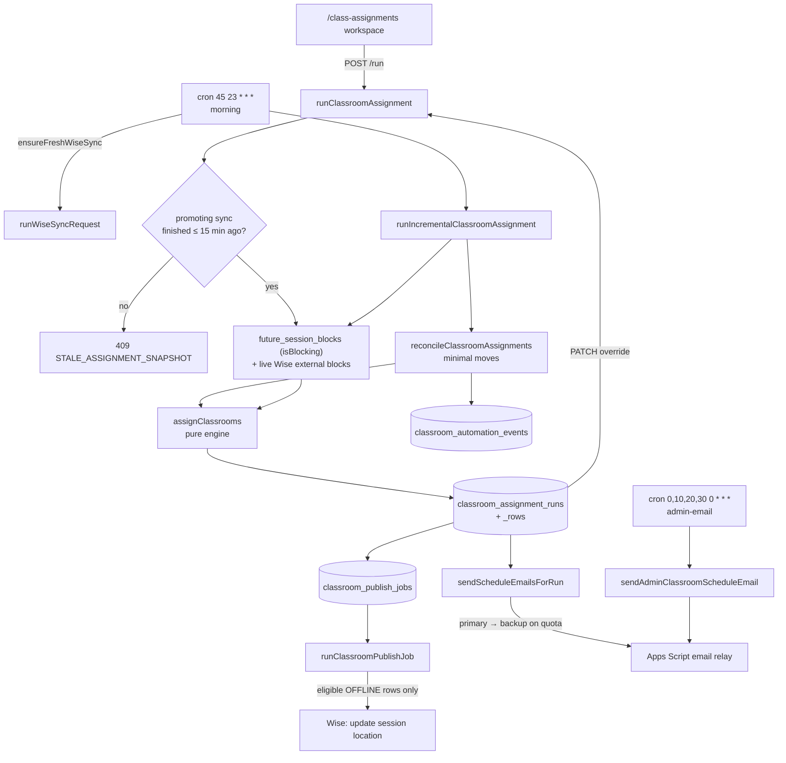

# Classroom Assignments

**Status: stable**

## Purpose

Classroom Assignments turns each Bangkok day's Wise teaching sessions into a concrete physical-room plan for the BeGifted center, and then — only on an explicit opt-in action — writes the chosen room back into Wise as the session's `location`.

For a given date the system loads that day's blocking sessions from the active Wise snapshot, runs a deterministic room-assignment engine that respects room capacity, TV requirements, online/onsite modality, per-tutor preferred rooms and tutor continuity, and produces a reviewable table of `(session → room)` rows. Admin staff can hand-tune any row with an override, publish eligible OFFLINE rooms to Wise, and email each tutor a personalized "room route" with a numbered floor-plan map.

Two unattended crons wrap the same machinery: a daily 06:45 Bangkok **morning automation** (`45 23 * * *` UTC, `vercel.json:43`–`:46`) that syncs Wise, incrementally re-assigns a 7-day horizon, publishes what changed, and emails today's tutor schedules; and an **admin-email** retry ladder that sends the operations team a readiness/blocker digest for the current day.

The feature spans three code areas: the domain library `src/lib/classrooms/`, the admin API under `src/app/api/class-assignments/` + `src/app/api/classrooms/`, and the cron handlers under `src/app/api/internal/class-assignments/`.

There are **three** ways to trigger it in production. The `/class-assignments` admin page is the interactive one, session-gated like every other admin surface; the two cron handlers above are the unattended ones. The third is easy to miss: Data Health's manual job runner. `runDataHealthJob` calls `runClassroomMorningAutomation()` and `sendAdminClassroomScheduleEmail()` directly for job keys `classroom_morning` / `classroom_admin_email` (`src/lib/data-health/run-job.ts:153`, `:163`), reachable from the admin-session route `POST /api/data-health/jobs/[jobKey]/run`. Both keys are registered `dangerous: true` (`src/lib/data-health/cron-registry.ts:264`, `:280`), so that route demands `confirmed: true` in the body before it will fire — but once confirmed it runs the full automation, including the Wise publish and the tutor emails, off a button rather than a cron tick.

Other features also import this one's modules directly, so the blast radius of a change here is wider than the `/class-assignments` page:

- **Room Capacity** reuses the pure engine and the room catalog: `assignClassrooms` (`src/lib/room-capacity/data.ts:4`, called at `:203`) to project room demand, `listClassroomRooms` (`data.ts:5`; also `utilization.ts:4`, `:493`), and the `REMOTE_NO_ROOM_NEEDED` / `NO_ROOM_AVAILABLE` sentinels (`analysis.ts:1`–`:2`).
- **`schedule-email.ts` has become the app's shared email transport.** `createAppsScriptScheduleEmailSender` / `ScheduleEmailSender` are imported by Progress Tests (`admin-digest.ts:25`, `teacher-heads-up.ts:28`, `sync.ts:31`), Leave Requests (`src/lib/leave-requests/sync.ts:9`), Post-Class Feedback (`src/lib/post-class-feedback/notifications.ts:22`), and the cron watchdog (`src/lib/internal/cron-watchdog.ts:25`).
- **Progress Tests** also reads the room catalog (`src/lib/progress-tests/db.ts:11`).

## Conceptual data model

Nine tables are owned by this feature. Column-level detail, enum members, indexes, and the ER diagram are in the canonical reference: [docs/reference/database/erd-classrooms.md](../reference/database/erd-classrooms.md) (enum values in [enums.md](../reference/database/enums.md)). What follows is what each table *means* to the feature.

**Room catalog & assignment state**

- **`classroom_rooms`** — the room catalog, and the one piece of room configuration that lives in the database rather than in code (the per-tutor room rules do not — see Open questions). It is *self-healing*: every read runs `ensureDefaultClassroomRooms`, which inserts missing rooms, repairs drifted attributes, and deactivates legacy non-TV duplicates of rooms that were renamed to the `" (TV)"` form (`src/lib/classrooms/data.ts:431`, `:480`). The seed list lives in code (`src/lib/classrooms/rooms.ts:62`).
- **`classroom_assignment_runs`** — one row per generation for a date. It records which snapshot the run was computed from, whether overrides were deliberately dropped, the reconciliation lineage when the run came from the automation path, and rolled-up status/publish counts. Runs are *append-only per date*: each generation inserts a new run and the latest by `createdAt` wins (`data.ts:588`, `:852`).
- **`classroom_assignment_rows`** — the denormalized per-session row, and the feature's real working surface. Each row copies the session facts out of the snapshot and then carries three independent layers of state that later steps read back: the engine's verdict (room, status, warnings, and a human-readable rule trace), the admin's override, and the Wise publish outcome. Reconciliation adds a content fingerprint and a change type so an incremental run can tell a carried session from a changed one.

**Publish & automation audit**

- **`classroom_publish_jobs`** — one row per Wise writeback attempt for a run: a status lifecycle, progress counters, and an optional subset of target rows for a partial publish. The row is what the UI polls (`getClassroomPublishJobProgress`, `data.ts:1739`–`:1755`). It is explicitly *not* resumable — a job already in a terminal status short-circuits back to its stored progress instead of re-running (`data.ts:1471`–`:1473`), and a `running` job abandoned past the stale timeout is failed on the next poll rather than picked up (`:1335`, `:1745`).
- **`classroom_automation_events`** — the change log emitted by incremental reconciliation (`added` / `changed` / `rescheduled` / `canceled` / `moved`), tied to an `automationBatchId` and to the source/target rows (`data.ts:942`).

**Email delivery records**

- **`classroom_schedule_email_runs`** / **`classroom_schedule_email_recipients`** — per-run tutor email batches and per-recipient outcomes. A primary→backup failover opens a *second* run row, but nothing in the schema marks it as one: the backup calls the same `createScheduleEmailRun` helper with the same shape of input as the primary (`schedule-email.ts:773`–`:794`, backup at `:909`–`:915`), and the `fromEmailRunId` → `toEmailRunId` linkage is assembled only in the HTTP response object (`:1015`–`:1023`). From the tables alone, a failover is inferable only from two runs sharing an `assignmentRunId`, ordered by `createdAt`. Column list in [erd-classrooms.md](../reference/database/erd-classrooms.md).
- **`classroom_admin_email_runs`** / **`classroom_admin_email_recipients`** — the daily admin digest batch and its per-recipient delivery records, uniquely keyed per date for idempotency.

**Read (and one write) from other features**

- `snapshots` + `sync_runs` — the freshness gate reads the active snapshot and the successful sync that promoted it (`data.ts:509`, `:528`).
- `future_session_blocks` joined to `tutor_identity_groups` — the session source; only rows with `isBlocking = true` for the date are assigned (`data.ts:736`).
- `tutor_contacts` — recipient email lookup, keyed by `canonicalKey`. This feature **writes** to it: `ensureDefaultTutorContacts` seeds missing contacts from the hardcoded `RAW_TUTOR_CONTACTS` roster before every preview/send (`src/lib/classrooms/schedule-email.ts:162`; roster at `src/lib/classrooms/tutor-contacts.ts:24`). The table itself is documented with Tutor Profiles: [erd-tutor-profiles.md](../reference/database/erd-tutor-profiles.md).
- `tutor_aliases` — alias overrides applied when collapsing contact names to canonical keys (`schedule-email.ts:154`).
- `admin_users` — the recipient list for the admin digest (`src/lib/classrooms/admin-schedule-email.ts:201`).

Wise itself is a live dependency at run and publish time, not just a snapshot source: both paths call `fetchAllFutureSessions` to learn what rooms are *actually* occupied right now.

## API surface

Twelve endpoints. Admin endpoints require an Auth.js session; the two `internal` handlers use the shared constant-time `CRON_SECRET` check (`src/lib/internal/cron-auth.ts`); the floor-plan map is deliberately public. Full request/response contracts live in [docs/reference/api/classrooms-and-assignments.md](../reference/api/classrooms-and-assignments.md), and cron mechanics in [docs/reference/crons.md](../reference/crons.md) / [docs/reference/api/internal-crons.md](../reference/api/internal-crons.md).

| Endpoint | Purpose |
|---|---|
| `GET /api/class-assignments` | Latest run + rows + room catalog + snapshot freshness for a Bangkok date. |
| `POST /api/class-assignments/run` | Generate a full assignment run for a date; `forceReassign` discards prior overrides. 409 when the snapshot is stale. |
| `PATCH /api/class-assignments/runs/[runId]/rows/[rowId]` | Set or clear one row's override room and recompute the whole run in place. |
| `POST /api/class-assignments/runs/[runId]/publish` | Create a publish job and execute it in the background after responding. |
| `GET /api/class-assignments/runs/[runId]/publish/[jobId]` | Poll publish progress; includes the refreshed run detail once terminal. |
| `GET /api/class-assignments/runs/[runId]/teacher-schedule` | Regroup a run's rows by tutor, for the Tutor Schedule tab. |
| `GET /api/class-assignments/runs/[runId]/schedule-email/preview` | Render each tutor's email exactly as it would be sent, and list what would block the send. |
| `POST /api/class-assignments/runs/[runId]/schedule-email/send` | Send tutor schedule emails for a run, optionally narrowed to a retry set and routed through the backup sender. |
| `GET /api/classrooms/rooms` | The room catalog (seeds/repairs defaults on read). |
| `GET /api/classrooms/floor-plan-map` | **Public** SVG floor plan with the requested rooms highlighted and numbered; embedded as `` in tutor emails. |
| `GET /api/internal/class-assignments/morning` | Cron: sync → incremental assign → selective publish → today's tutor emails, over a 7-day horizon. |
| `GET /api/internal/class-assignments/admin-email` | Cron: idempotent daily admin readiness/blocker digest. |

The floor-plan map route has no `auth()` call at all (`src/app/api/classrooms/floor-plan-map/route.ts:3`) and is explicitly allowlisted in the edge middleware (`src/middleware.ts:9`) — it has to be reachable by an email client fetching the image, so it takes no user data and renders purely from the `rooms` query parameter.

## UI

- **Page** — `src/app/(app)/class-assignments/page.tsx` is a five-line wrapper that renders the client workspace. Nav entry ("Class Assignments", section `scheduling-tutors`, shortcut-eligible) is declared in `src/lib/navigation/tools.ts:125` and rendered by `src/components/layout/app-nav.tsx`.
- **Workspace** — `src/components/class-assignments/class-assignments-workspace.tsx` is the whole operational surface: date input, "Force reassign" checkbox, Refresh, the combined **"Sync Wise, then run"** action, "Publish to Wise", and "Email schedules". Above the tabs it renders a snapshot freshness banner (`:704`), a live-Wise-room-blocker warning banner (`:723`), and a seven-tile run summary (`:743`).
- **Four tabs** (`:776`), defaulting to Floor Plan:
  - **Floor Plan** — `floor-plan-occupancy.tsx`, an SVG center map driven by the hand-authored geometry in `src/lib/classrooms/floor-plan.ts`, paired with `room-occupancy-heatmap.tsx`. Both are scrubbed by a shared timeline: `assignment-timeline-controls.tsx` is purely presentational (play/pause, reset, a range slider, and a speed `<select>` offering 5 / 15 / 30 schedule-minutes per real second — `:23`, `:91`–`:95`), while the `requestAnimationFrame` playback loop and its `playing` / `playbackSpeed` state live in the workspace itself (`class-assignments-workspace.tsx:241`–`:243`, `:286`–`:321`).
  - **Room Calendar** — `room-calendar-view.tsx`, a GCal-style room-column day grid with lane packing for overlaps.
  - **Rows** — the editable assignment table with a per-row override `<select>`.
  - **Tutor Schedule** — per-tutor blocks; disabled until the run has rows.
- **Shared popover** — `assignment-detail-popover.tsx` is the click target on both the floor plan and the calendar; it shows the row's status/warnings and offers the same override control.
- **Client sync helper** — `src/components/class-assignments/sync-flow.ts` drives the sync-first flow: it POSTs `/api/admin/sync-wise`, and if a sync is already running it polls `/api/class-assignments` until a snapshot promoted *after* that sync started appears, with a 12-minute client timeout (`sync-flow.ts:4`, `:58`, `:99`).
- **Visualization math** is deliberately outside React in `src/lib/classrooms/visualization.ts` (`buildTimelineBounds`, `buildRoomOccupancyState`, `buildHeatmapCells`, `buildRoomCalendarEvents`) so it is unit-testable.

## Data flow

Manual path (admin at the keyboard):

1. The workspace syncs Wise first via `syncWiseBeforeAssignment`, then POSTs `/api/class-assignments/run`.
2. `runClassroomAssignment` (`data.ts:877`) gates on snapshot freshness, loads the date's blocking sessions, pulls **live** Wise sessions to derive external room blocks, and calls the pure engine `assignClassrooms` (`src/lib/classrooms/assignment-engine.ts:293`).
3. The engine's rows are persisted as a new run; the response carries live-Wise room-conflict warnings.
4. An override PATCH re-runs the engine over the existing rows and rewrites them in place (`updateClassroomAssignmentOverride`, `data.ts:1116`).
5. Publish creates a job row and runs it after the response — `after(task)` at `src/app/api/class-assignments/runs/[runId]/publish/route.ts:22`, itself wrapped in a try/catch that falls back to a detached `void task()` when `after()` throws (`:24`); the helper is `schedulePublishJob` (`:12`–`:26`), invoked at `:44`. The UI polls the job every 1.5s.
6. Tutor emails are previewed then sent through an Apps Script relay, with automatic backup failover on quota exhaustion.

Automated path (`runClassroomMorningAutomation`, `src/lib/classrooms/morning-automation.ts:174`): ensure a fresh sync → for each of 7 Bangkok dates run an *incremental* reconciliation → publish only the rows that actually need it → email today's tutor schedules in `failed_only` mode.

```mermaid
flowchart TD
  UI["/class-assignments workspace"] -->|POST /run| RUN[runClassroomAssignment]
  CRON1["cron 45 23 * * *<br/>morning"] -->|ensureFreshWiseSync| SYNC[runWiseSyncRequest]
  CRON1 --> RECON[runIncrementalClassroomAssignment]

  RUN --> FRESH{"promoting sync<br/>finished ≤ 15 min ago?"}
  FRESH -- no --> ERR409["409 STALE_ASSIGNMENT_SNAPSHOT"]
  FRESH -- yes --> LOAD["future_session_blocks (isBlocking)<br/>+ live Wise external blocks"]
  RECON --> LOAD
  RECON --> RECMOD[reconcileClassroomAssignments<br/>minimal moves]
  RECMOD --> ENGINE
  LOAD --> ENGINE[assignClassrooms<br/>pure engine]
  ENGINE --> ROWS[("classroom_assignment_runs<br/>+ _rows")]
  RECMOD --> EVENTS[(classroom_automation_events)]

  ROWS -->|PATCH override| RUN
  ROWS --> JOB[(classroom_publish_jobs)]
  JOB --> PUB[runClassroomPublishJob]
  PUB -->|eligible OFFLINE rows only| WISE["Wise: update session location"]
  ROWS --> MAIL[sendScheduleEmailsForRun]
  MAIL -->|primary → backup on quota| RELAY["Apps Script email relay"]
  CRON2["cron 0,10,20,30 0 * * *<br/>admin-email"] --> DIGEST[sendAdminClassroomScheduleEmail]
  DIGEST --> RELAY
```

## Business rules & edge cases

**Fail-closed snapshot freshness.** A run is refused unless the active snapshot's promoting sync finished within `CLASSROOM_ASSIGNMENT_FRESHNESS_MS` = 15 minutes (`data.ts:134`, gate at `data.ts:572`). The route maps the typed error to HTTP 409 with `code: "STALE_ASSIGNMENT_SNAPSHOT"` (`src/app/api/class-assignments/run/route.ts:46`). The morning cron pre-empts this: it reuses a sync that finished within the same window, otherwise waits on an in-flight sync (5s polling up to 90s) or triggers one, and throws rather than assigning from stale data (`morning-automation.ts:105`–`:167`).

**The assignment engine is pure and deterministic.** `assignClassrooms(sessions, rooms, overrides, options)` takes no database and no clock; every persistence concern lives in `data.ts`. Sessions are processed in start-time order, tie-broken by tutor priority: Gift → any preferred-room tutor → TV-required tutor → everyone else (`assignment-engine.ts:199`, `:322`).

**Priority claims are reserved before the main pass.** Three pre-passes stake out `protectedClaims` for valid overrides, then priority-preferred rooms, then ordinary preferred rooms (`assignment-engine.ts:332`–`:379`). Without this, an earlier-starting generic session could take a room that a later high-priority tutor is pinned to. The main loop then only honors a preferred/priority room if that session actually won its claim (`:443`, `:487`). Because priority-preferred claims are staked before ordinary preferred claims, Ras's priority lock on `Never Ever (TV)` beats an overlapping Mandy or Calvin session -- both of whom hold it only as an *ordinary* preferred room -- and Mandy/Calvin fall back to the general room pool for that slot only.

**Room selection cascade** (`assignment-engine.ts:455`–`:591`), first match wins: remote-online short-circuit → valid override → priority preferred room → online continuity (previous room reused when the gap is under 60 min) → Gift hard-pinned to `Joy (TV)` → general continuity (gap ≤ `GENERAL_CONTINUITY_GAP_MINUTES` = 15 min, and never Joy for a non-Gift tutor) → preferred room → same-day sticky room (any gap size, reuses the tutor's most recently held room -- including one seeded from a reconciled run's carried rows -- when it's still free, and never Joy for a non-Gift tutor) → online-only room → priority-scored standard room → any standard room → Joy as last-resort for non-Gift → overflow-only → `NO_ROOM_AVAILABLE`. Room priority scoring ranks the 14 core teaching rooms first (`rooms.ts:15`–`:33`) and pushes the 8-seat `Relax (TV)` to the back of the queue for groups of ≤ 3 — it scores 2 000 against 1 000 for every other non-core room, and `pickBestRoom` sorts *ascending* and takes the first survivor, so a lower score wins (`assignment-engine.ts:179`–`:184`, `:405`–`:415`). The effect is to reserve the biggest room for the groups that actually need it; a group of more than 3 falls back into the normal 1 000 tier and `Relax (TV)` becomes reachable. **The tier boundary itself is untested.** The nearest test (`assignment-engine.test.ts:61`–`:71`) uses `studentCount: 8`, where `Relax (TV)` — capacity 8 (`rooms.ts:75`), every other room in the catalog ≤ 3 (`:63`–`:86`) — is the only room that passes `roomPassesConstraints` at all, so it would pass with or without the 1 000/2 000 tiering. No test exercises a 4-to-8-student group, which is the only range where the demotion changes the outcome.

**Occupancy is physical, not by label.** Room names are normalized by stripping a trailing `" (TV)"` before occupancy checks (`assignment-engine.ts:138`), so `Joy` and `Joy (TV)` cannot be double-booked as if they were two rooms. The catalog repair deactivates the non-TV duplicates so only one label per physical room stays active (`data.ts:480`).

**Capacity is fail-closed to "needs review".** Capacity comes from Wise `studentCount`; failing that, a 1:1 is inferred from class type / title / a present student name; otherwise the row gets capacity 1 **and** the warning `needs_review_missing_capacity` (`assignment-engine.ts:106`–`:132`). Such rows are assigned a room for planning purposes but are never publishable (`data.ts:1230`).

**Modality is a closed token set, and "unknown" means center room.** Online = `online|scheduled|virtual`, onsite = `offline|onsite|in-person`, everything else is `unknown` (`src/lib/classrooms/session-mode.ts:1`). An online session only escapes to `REMOTE_NO_ROOM_NEEDED` when it is *not* adjacent (gap < 60 min, transitively across a chain) to an onsite session for the same tutor — because a tutor who is on-site before or after must have a room to connect from (`assignment-engine.ts:222`–`:270`). Anything unknown falls into the center-room-required branch, i.e. it reserves a room rather than assuming remote.

**Overrides are validated, never trusted.** An override is honored only when the room exists, is active, satisfies capacity/TV/category constraints, and is free. Otherwise the row records `invalid_override_room` or `override_room_unavailable` and falls through the normal cascade (`assignment-engine.ts:424`–`:438`). Overrides also survive re-runs: a non-forced run re-reads the previous run's `overrideRoom` values, while `forceReassign: true` deliberately drops them (`data.ts:711`).

**Live Wise rooms are reserved before assigning.** Both the manual and incremental paths fetch all future Wise sessions and treat same-date, blocking, OFFLINE sessions with a location that are *not* in the local run as occupied intervals (`data.ts:211`, `:234`, `:240`). This is what keeps the engine from planning a room that a class outside the run already holds. Any residual overlap is reported back as `roomConflictWarnings` (`data.ts:259`).

**Publish is opt-in, OFFLINE-only, and touches exactly one field.** `isClassroomPublishEligible` requires status `assigned`, a real room, an onsite session type, both Wise ids, and no missing-capacity warning (`data.ts:1213`–`:1234`); the reason string is explicit that "V1 publishes Wise locations for OFFLINE sessions only" (`:1226`). The writeback itself only ever calls `updateSessionLocation` (`data.ts:1357`) — no time, teacher, or student field is written.

**Publish fails closed on every uncertainty.** It refuses when the Wise location catalog comes back empty (`data.ts:1414`), when no *verified* Wise location name exists for the assigned room (`resolveWisePublishLocation`, `:329` — the expected name reconstructs the `" (TV)"` suffix form, `:294`), when the live Wise session has disappeared since the run was generated (`:1573`, "refusing to publish a stale assignment"), when a live external Wise class overlaps the target room (`:1584`), and — for partial publishes — when an *unchanged* local row still occupies the room (`:1596`).

**Room-swap cycles are resolved with temporary rooms, not overwrites.** When every pending row is blocked by another pending row, the publisher picks the row that blocks the most others, parks it in a verified temporary location, and retries; only if no temporary room can be found does it fail the whole cycle with an explanatory error (`data.ts:1419`–`:1461`, loop at `:1623`–`:1711`). Publishes run 10 rows at a time (`:132`) and `running` jobs abandoned for over 6 minutes are auto-failed on the next poll (`:133`, `:1335`, `:1745`).

**Automation publishes the minimum.** `selectAutomationPublishTargetRowIds` skips rows that were carried forward, already published successfully, and whose live Wise location still matches — then `expandAutomationPublishTargetRowIds` transitively pulls in eligible blockers so a swap can actually complete (`data.ts:1798`, `:1828`).

**Reconciliation optimizes for minimal moves.** The incremental run fingerprints each session over 17 identity/time/content fields (`src/lib/classrooms/reconciliation.ts:66`, `:91`). Identical sessions are *carried* — same room, same publish state — and only the rest are re-assigned against the carried rows treated as fixed blocks (`:268`, `:320`). Carried rows also seed same-day continuity for the dynamic pass via `fixedTutorAssignments`, so a newly placed session can land back in a room the tutor already holds that day. If a new session cannot fit anywhere, the engine unlocks only the carried rows that overlap it and are not override-pinned, then retries (`:337`–`:359`). Rows whose room changed anyway are labeled `moved` and have their publish state reset (`:361`–`:399`); disappeared sessions emit a `canceled` event but nothing is written back to Wise.

**Morning automation is a 7-day horizon but a 1-day email.** It assigns today plus the six following Bangkok dates (`morning-automation.ts:170`), but only the start date triggers tutor schedule emails, in `failed_only` mode so re-runs never double-send (`:217`–`:225`). A schedule-email failure is caught and reported per date rather than aborting the batch (`:230`).

**Tutor email blockers.** A tutor is `blocked` when their `tutor_contacts` row has no non-online (`onsiteEmail`) address, or when any of their rows is `needs_review` / `no_room` (`schedule-email.ts:513`–`:539`). Missing Apps Script config is a *hard* blocker that makes the whole run unsendable (`:460`, `:584`). Each email carries an idempotency key derived from the assignment run, the tutor's canonical key, and a SHA-256 hash of the rendered subject/text/HTML (`:637`–`:650`), passed to the relay in the request body (`:613`–`:622`). Whether the external Apps Script relay actually de-duplicates on that key is outside this repository — no relay source or contract test lives here.

**Quota exhaustion triggers a backup sender.** When the primary Apps Script relay reports an exhausted daily quota, the send stops, finalizes the primary run, and opens a second run against the backup sender for the remaining ready tutors — skipping anyone already recorded as `sent` for that assignment run (`schedule-email.ts:652`, `:898`–`:1024`, trigger at `:1141`). Failover is only automatic for the primary sender (`:1036`).

**Admin digest is idempotent and patient.** At most one terminal admin email per date, enforced both by a pre-check and by a unique `classroom-admin:{date}` key with a `23505` catch (`admin-schedule-email.ts:253`, `:295`, `:310`). While the run is missing or a publish job is still pending/running it returns `pending` and lets the next cron tick retry — until the Bangkok clock passes `FINAL_RETRY_MINUTE` 07:30, at which point it sends an `ACTION REQUIRED` blocker summary instead (`:19`, `:369`–`:387`). Zero configured `admin_users` recipients is recorded as a failed run, not a silent no-op (`:421`).

**Bangkok is the intent, but the day window is not pinned to it.** Rendering *is* Bangkok-correct: it uses the stored Bangkok minute-of-day rather than re-deriving from serialized timestamps (`data.ts:173`, `:1897`–`:1898`), and the admin digest reads the current Bangkok minute through `Intl.DateTimeFormat` (`admin-schedule-email.ts:51`). Session *selection* is not. `assertIsoDate` does parse `${value}T00:00:00+07:00` (`data.ts:158`) — but only as a validity check; the parsed value is discarded and the function returns the original string (`:154`–`:162`). The window that actually chooses the day's sessions is built by `dateRangeForBangkokDate` (`:165`–`:171`) with `new Date(year, month - 1, day)`, which is the **server's** local timezone, and is compared against `future_session_blocks.start_time` — a `timestamptz` (`schema.ts:1623`–`:1624`) — in `loadAssignmentSessions` (`:741`, bounds at `:773`–`:774`). `TZ="Asia/Bangkok"` is set only for tests (`vitest.config.ts:4`), and nothing sets it for the deployed runtime, so on a UTC runtime the "Bangkok date" window is 07:00→07:00 Bangkok: early-morning classes belong to the previous run and the last hours of the evening spill into the next. The Bangkok-correctness tests do not cover this path — `data-timezone.test.ts` has a single case, and it is about minute-of-day rendering in `getTeacherScheduleForRun`, not about the date window.

**Known rough edges in the override path.** `updateClassroomAssignmentOverride` recomputes the run *without* passing live Wise external blocks (`data.ts:1071`), unlike a fresh run — so an override recompute can place a row in a room a live external Wise class holds. It also resets `publishStatus` to `not_published` on **every** row and zeroes the run's published counters (`:1092`, `:1108`), so previously published rows read as unpublished locally while Wise still holds the published location. Relatedly, only one **UI-reachable** code path populates `liveRoomBlocks` / `roomConflictWarnings`: the `POST /run` response (`data.ts:916`–`:917`). `getClassroomAssignmentForDate` returns them empty (`:704`, `:708`), the override PATCH returns them empty (`:1148`), and `getClassroomAssignmentByRunId` — which supplies the publish poll's terminal `detail` (`:1751`–`:1753`) — hard-codes them empty too (`:1864`–`:1877`). (`runIncrementalClassroomAssignment` does populate both, `:1033`–`:1034`, but its detail only ever surfaces in the morning cron's JSON via `MorningAutomationDateResult.detail` — `morning-automation.ts:196`–`:203`, `:244` — never in the workspace.) Because the workspace overwrites its state with whatever `detail` comes back (`class-assignments-workspace.tsx:449`), the live-conflict banner appears only immediately after a run and is *cleared* by the next override or publish poll, not just by a plain refresh.

## Tests

Sixteen test files, 154 test declarations (158 executed cases once the one parameterized block expands):

- **`src/lib/classrooms/__tests__/assignment-engine.test.ts`** (41 declarations → 45 executed cases; one `it.each` covers 5 preferred-room tutors at `:350`–`:380`) — capacity inference and the missing-capacity warning, TV requirement, external live-block availability, online/`SCHEDULED` remote handling, the 60-minute online-center rule, the Gift/Joy hard pin, priority-room protection, continuity, overrides, overflow ordering, and no-room. Override coverage is partial: valid overrides are asserted at `:417`, `:485` and `:520`, and `invalid_override_room` at `:516` (inactive room) and `:592` (unknown room) — but the *occupied*-override branch is not covered anywhere. `override_room_unavailable` (`assignment-engine.ts:432`) appears in exactly one place in the repo, its own `warnings.push`, and is asserted by no test.
- **`reconciliation.test.ts`** (9) — carry-forward with preserved publish state, canceled removal, fitting new sessions against carried blocks, reschedule detection, minimal-displacement unlock, override protection, same-day continuity seeding from a carried row, and remote carried rows seeding nothing.
- **`publish-eligibility.test.ts`** (26) — eligibility rules, Bangkok→UTC timestamp conversion, progress/ETA math, verified Wise location resolution (TV vs plain name, fail-closed on missing or empty catalog), live-conflict and temporary-location swap helpers, and automation target-row expansion.
- **`schedule-email.test.ts`** (17) and **`admin-schedule-email.test.ts`** (5) — preview blockers, selected vs `failed_only` sends, primary→backup quota failover and its de-dup, Apps Script relay payloads; admin fan-out, teacher-email summary, retry window, and per-date idempotency.
- **`morning-automation.test.ts`** (5) — fresh-sync reuse (`:70`) vs trigger (`:88`); start-day-only tutor emails ordered after publish (`:159`); the same captured snapshot reused across the whole 7-date batch (`:188`); and schedule-email error isolation (`:212`). The **wait** mode is *not* tested: both `ensureFreshWiseSyncForClassroomAutomation` cases pass `maxWaitMs: 0` with no running sync, so `mode: "waited"` — both the in-flight-sync poll loop and the `skipped`-response poll loop (`morning-automation.ts:119`–`:156`) — never executes under test.
- **`rooms.test.ts`**, **`tutor-contacts.test.ts`**, **`visualization.test.ts`**, **`floor-plan-map.test.ts`**, **`data-timezone.test.ts`** — catalog TV-name canonicalization and repair, contact collapsing/aliases, timeline & occupancy math, floor-plan geometry/SVG, and Bangkok-minute rendering.
- **Route tests** — `src/app/api/class-assignments/__tests__/route.test.ts` (15: auth, invalid date, run + override policy, 409 stale, override recompute, publish start/poll, email preview/send including validation and conflict cases) and `src/app/api/internal/class-assignments/__tests__/route.test.ts` (4: cron-secret gating for both cron handlers). `src/app/api/classrooms/__tests__/floor-plan-map-route.test.ts` covers the public SVG response.
- **Component tests** — `src/components/class-assignments/__tests__/sync-flow.test.ts` (4: sync-then-poll, fail-closed, timeout) and `visualization-components.test.tsx` (6: floor plan / heatmap / calendar / timeline rendering).

## Open questions

- **The "Bangkok date" window depends on the server's timezone.** `dateRangeForBangkokDate` (`data.ts:165`–`:171`) builds the day bounds with `new Date(year, month - 1, day)` — server-local, not `+07:00` — and `TZ` is set only in `vitest.config.ts:4`. On a UTC runtime every run covers 07:00→07:00 Bangkok rather than the Bangkok calendar day. Is this a live defect (early classes assigned into the wrong run, evening classes into the next), or is the deployment expected to pin `TZ=Asia/Bangkok`? Either way, `data-timezone.test.ts` covers only minute-of-day rendering, so nothing would catch a regression here.
- **Data Health can fire the whole automation from a button.** `classroom_morning` and `classroom_admin_email` are both `dangerous: true` in the cron registry (`cron-registry.ts:264`, `:280`), and `POST /api/data-health/jobs/[jobKey]/run` runs them for any authenticated admin once `confirmed: true` is sent (`run-job.ts:153`, `:163`). That path publishes to Wise and sends tutor emails. Is a single confirmation checkbox the intended gate for a live Wise writeback plus an email fan-out, or should this trigger be narrowed (dry-run, or assignment-only without publish/email)?
- **Three branches are effectively untested.** `override_room_unavailable` (`assignment-engine.ts:432`) and the `mode: "waited"` sync path (`morning-automation.ts:119`–`:156`) are asserted nowhere, and the `Relax (TV)` capacity-tier demotion is only exercised at a student count where the tier cannot change the outcome. Are these deliberate gaps, or worth closing before the next change to the room cascade?
- **Override recompute drops live-Wise awareness and resets publish state run-wide.** `updateClassroomAssignmentOverride` (`data.ts:1071`, `:1092`, `:1108`) omits `externalRoomBlocks` and marks every row `not_published`. Is that intended (a deliberate "re-publish everything after any manual edit" policy), or a gap that should be narrowed to the affected rows and pass live blocks like a fresh run does?
- **Client-side publish eligibility diverges from the server's.** The workspace's `isPublishEligible` matches `sessionType?.toUpperCase() === "OFFLINE"` exactly (`class-assignments-workspace.tsx:199`), while the server accepts `offline` / `onsite` / `in-person` (`session-mode.ts:2`). Sessions typed `onsite`/`in-person` would show as ineligible in the confirmation dialog yet publish successfully. Does Wise ever emit those variants in practice, and should the client just reuse the shared helper?
- **Suspected dead exports.** `classroomTimestampToWiseIso` (`data.ts:359`) has no production caller — only tests — which means nothing in the publish path converts a timestamp; likewise `deleteClassroomRowsForRun` / `deleteClassroomRuns` (`data.ts:1922`, `:1928`) have no caller at all, and `isKevinPriorityTutor` / `PREFERRED_ROOMS` (`rooms.ts:170`, `:150`) are unreferenced. Were these built for a run-pruning or timestamp-writeback feature that was dropped, and can they be removed?
- **Assignment runs accumulate per date with no retention policy.** Every generation inserts a new run + full row set (`data.ts:852`) and only the latest is read. With a daily 7-day-horizon cron this grows quickly. Is there an intended cleanup (perhaps what the unused delete helpers were for), or is unbounded history desired for audit?
- **Hardcoded rosters as source of truth.** `RAW_TUTOR_CONTACTS` (`tutor-contacts.ts:24`, ~140 name entries carrying personal emails and phone numbers, collapsed by canonical key), `TV_REQUIRED_TUTORS` (`rooms.ts:89`), and `PREFERRED_BY_TUTOR` (`:100`) are checked-in code, and named individuals are baked into rule branches (Gift→Joy, Kevin/Mek/Ras priority rooms). Should these move to `classroom_rooms`-style database configuration or an import, both for maintainability and to keep personal contact data out of the repository?
- **Cron scheduling vs the 07:30 cutoff.** `vercel.json` runs the morning automation at `45 23 * * *` UTC (06:45 Bangkok) and the admin digest at `0,10,20,30 0 * * *` UTC (07:00–07:30 Bangkok), while the final-retry gate is exactly 07:30 Bangkok (`admin-schedule-email.ts:19`) — so the last cron tick and the cutoff coincide. Is a ~45-minute automation budget the intended margin, and is it comfortable if a Wise sync has to be triggered and waited on?

_Verified against HEAD + uncommitted WIP on 2026-05-31._
