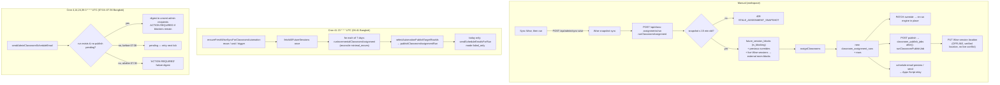

# Classroom Assignments

**Status: stable**

## Purpose

Classroom Assignments turns one Bangkok day's blocking Wise teaching sessions into a concrete room plan for the BeGifted center, lets admin staff review and hand-correct it, and then — only on an explicit publish action — writes each eligible OFFLINE session's room back to Wise as its `location`. The same run also feeds two outbound emails: a personalized "room route" schedule for every tutor teaching that day (with a numbered floor-plan map) and a daily readiness/blocker digest for the admin team.

Who uses it: the scheduling/operations admins on `/class-assignments` (nav label "Class Assignments", pinned shortcut in the Scheduling & Tutors section, `src/lib/navigation/tools.ts:127-133`). Two unattended crons run the same machinery each morning so that, on a normal day, nobody has to touch the page.

The feature spans four code areas:

| Area | Path | Role |
|---|---|---|
| Domain library | `src/lib/classrooms/` | Room catalog and tutor rule tables, the assignment engine, minimal-move reconciliation, run/publish persistence, tutor + admin email builders, floor-plan geometry, visualization helpers |
| Admin API | `src/app/api/class-assignments/`, `src/app/api/classrooms/` | 10 endpoints: 9 session-gated (8 under `/api/class-assignments` + `GET /api/classrooms/rooms`) and 1 public SVG (`GET /api/classrooms/floor-plan-map`, which never calls `auth()` — `floor-plan-map/route.ts:1-16`) |
| Cron API | `src/app/api/internal/class-assignments/` | `morning` automation and `admin-email` digest |
| UI | `src/app/(app)/class-assignments/page.tsx`, `src/components/class-assignments/` | One client workspace with four tabs and two dialogs |

Two things the feature deliberately does **not** do: it never writes to Wise during assignment generation (only the publish job does, and only the `location` field — `src/lib/wise/fetchers.ts:410-420`), and it never sends email through Resend — tutor and admin mail go through a Google Apps Script relay (`src/lib/classrooms/schedule-email.ts:597-635`).

## Conceptual data model

The feature owns the nine `classroom_*` tables in the **classrooms** domain and reads from the core snapshot spine plus two identity tables. Column-level detail lives in [erd-classrooms.md](../reference/database/erd-classrooms.md); this section describes what each table *means*.

**Owned (written here):**

- **Room catalog** — `classroom_rooms`: one row per bookable room with capacity, TV flag, `category` (`standard` / `overflow_only` / `online_only`) and an `active` switch. The catalog is *code-seeded*: every read passes through `ensureDefaultClassroomRooms`, which inserts missing defaults, re-syncs capacity/TV/category/active/sortOrder to match `DEFAULT_CLASSROOM_ROOMS`, and deactivates legacy plain physical names (`Iconic`, `Joy`, …) in favour of their `(TV)`-suffixed canonical names (`src/lib/classrooms/data.ts:431-488`, `src/lib/classrooms/rooms.ts:34-46, 62-87`). 24 rooms ship by default: 22 `standard` and 2 `online_only`; no default room is `overflow_only`.
- **Assignment run** — `classroom_assignment_runs`: one immutable plan for one Bangkok date, pinned to the Wise snapshot it was computed from, with aggregate counts and a status that moves `completed → published | partial` as publish results land. Every generation creates a *new* run row; the UI and crons always read the newest run for a date (`data.ts:588-596`). Automation runs additionally record which earlier run they reconciled against, which cron batch produced them, and a summary of what changed (`data.ts:1004-1017`); columns are in [erd-classrooms.md](../reference/database/erd-classrooms.md).
- **Assignment row** — `classroom_assignment_rows`: one row per Wise session in the run (unique on `run_id + wise_session_id`). Each row carries four groups of facts: the session as the engine saw it (tutor, times, type, student, class), the *decision* (capacity and TV need, preferred/override/assigned room, status, warnings, and a plain-English rule trace), the *reconciliation lineage* that lets an unattended run recognise an unchanged session and carry it forward, and the *publish outcome* against Wise. The column list lives in [erd-classrooms.md](../reference/database/erd-classrooms.md).
- **Publish job** — `classroom_publish_jobs`: one background Wise-writeback attempt against a run, with an optional `target_row_ids` subset (used by automation) and running counters the UI polls.
- **Automation events** — `classroom_automation_events`: the reconciliation trace for one cron batch — `added` / `changed` / `rescheduled` / `moved` / `canceled` per Wise session (`src/lib/classrooms/reconciliation.ts:16-17`).
- **Tutor schedule emails** — `classroom_schedule_email_runs` + `classroom_schedule_email_recipients`: one send attempt per run per sender, with a per-tutor outcome row (`sent` / `failed` / `blocked`) so retries can skip tutors who already received mail.
- **Admin digest emails** — `classroom_admin_email_runs` + `classroom_admin_email_recipients`: one reusable date-keyed run (`idempotency_key = classroom-admin:<date>`). Failed/partial runs retry; recipient attempt rows remain append-only and successful recipients are skipped (`admin-email-claim.ts`).

**Read only:**

- From the core snapshot spine ([erd-core.md](../reference/database/erd-core.md)): `snapshots` (the active snapshot), `sync_runs` (freshness — the newest `success` run that promoted that snapshot), `future_session_blocks` joined to `tutor_identity_groups` (the day's sessions and the tutor display name), and `tutor_aliases` (contact-key aliasing). Sessions are pulled with `is_blocking = true` only (`data.ts:769-776`), so cancelled sessions never occupy a room.
- From the tutor-profiles domain ([erd-tutor-profiles.md](../reference/database/erd-tutor-profiles.md)): `tutor_contacts`, keyed by the identity group's `canonical_key`; only `onsite_email` is used as the schedule-email recipient (`schedule-email.ts:513`). Defaults are seeded from a code-owned list on every preview (`schedule-email.ts:162-191`, `src/lib/classrooms/tutor-contacts.ts:24-164, 192-229`).
- `admin_users` — every row's email is a recipient of the admin digest (`admin-schedule-email.ts:206-211`).

Both `classroom_assignment_runs.snapshot_id` and `classroom_assignment_rows.snapshot_id` FK-reference `snapshots` without `onDelete` (`src/lib/db/schema.ts:1667, 1693`). `pruneOldSnapshots` deletes the tutor-domain snapshot tables and then the `snapshots` rows themselves without ever touching the classroom tables (`src/lib/sync/snapshot-pruning.ts:88-178`), so once a run pins a snapshot the final delete raises a FK violation; the orchestrator catches it, logs it and records the sync as successful with a failed pruning step (`src/lib/sync/orchestrator.ts:532-541`). Tracked as DEF-21 in [OPEN-QUESTIONS.md](../OPEN-QUESTIONS.md).

## API surface

Full request/response contracts, status-code tables and the shared "assignment detail" envelope are in [classrooms-and-assignments.md](../reference/api/classrooms-and-assignments.md). The two cron routes are summarised in [crons.md](../reference/crons.md) (the [internal-crons.md](../reference/api/internal-crons.md) page explicitly defers them to this feature).

All `/api/class-assignments/*` and `/api/classrooms/rooms` handlers require an Auth.js session; the floor-plan SVG is public; the two `/api/internal/*` routes require the constant-time `CRON_SECRET` check and are wrapped in `withCronInvocationAudit` (`src/app/api/internal/class-assignments/morning/route.ts:9-14`).

The table below is purpose-only; request bodies, query options, status codes and timeouts are documented once in the API reference linked above.

| Endpoint | Purpose |
|---|---|
| `GET /api/class-assignments` | Newest run + rows + room catalog + snapshot freshness for a Bangkok date; `run: null` when none exists yet. |
| `POST /api/class-assignments/run` | Generate a fresh full assignment run for a date, optionally discarding prior overrides. Refuses to run from a stale snapshot (see [Freshness](#freshness-and-wise-coupling-srclibclassroomsdatats)). Never writes to Wise. |
| `PATCH /api/class-assignments/runs/[runId]/rows/[rowId]` | Set or clear one row's override room, then recompute every row of the run in place. |
| `POST /api/class-assignments/runs/[runId]/publish` | Create a publish job and run it in the background after the response. This is the only path that writes Wise. |
| `GET /api/class-assignments/runs/[runId]/publish/[jobId]` | Poll job progress; the refreshed run detail is attached once the job is terminal. |
| `GET /api/class-assignments/runs/[runId]/teacher-schedule` | The run regrouped by tutor for the Tutors tab. |
| `GET /api/class-assignments/runs/[runId]/schedule-email/preview` | Render every tutor's email exactly as it would send, plus the blockers that would stop it. |
| `POST /api/class-assignments/runs/[runId]/schedule-email/send` | Send tutor schedule emails — all ready tutors, a chosen subset, only those not yet sent, or via the backup sender. |
| `GET /api/classrooms/rooms` | The room catalog (seeds/repairs defaults on read). |
| `GET /api/classrooms/floor-plan-map` | **Public**, cacheable SVG floor plan with the requested rooms highlighted and numbered; embedded as `` in tutor emails. |
| `GET /api/internal/class-assignments/morning` | Daily 06:41 Bangkok cron: sync → incremental assign over 7 days → selective publish → today's tutor emails. |
| `GET /api/internal/class-assignments/admin-email` | Daily 07:04–07:36 Bangkok retry-window cron: idempotent admin readiness or "ACTION REQUIRED" digest. |

Both cron jobs are also runnable by hand from Data Health through `src/lib/data-health/run-job.ts:165-183`, where they are registered `dangerous: true` with confirmation copy (`src/lib/data-health/cron-registry.ts:274-305`).

## UI

`src/app/(app)/class-assignments/page.tsx` renders a single client component, `ClassAssignmentsWorkspace` (`src/components/class-assignments/class-assignments-workspace.tsx`). Its state is one `AssignmentDetail` for the selected date plus dialog/progress state; there is no server-side data fetch.

**Header controls** (`class-assignments-workspace.tsx:650-700`): a `Date` input (defaults to today Bangkok), a `Force reassign` checkbox, `Refresh`, and three actions —

- **Sync Wise, then run** — first `POST /api/admin/sync-wise`; if a sync is already running it polls `GET /api/class-assignments?date=` every 5 s for up to 12 minutes until `snapshotMeta.fresh` and `latestSyncFinishedAt` is after the running sync's start; then `POST /run` (`src/components/class-assignments/sync-flow.ts:3-4, 58-61, 106-137`). The button label cycles `Syncing Wise → Generating`.
- **Publish to Wise** — opens a confirmation dialog ("This writes location only for eligible OFFLINE rows. Live Wise room conflicts fail closed per row."), then `POST …/publish` and polls progress every 1.5 s until terminal (`:466-474`); a separate 1 s ticker only refreshes the elapsed-time display while a publish or email send is in flight (`:330-335`).
- **Email schedules** — loads the preview, pre-selects every `ready` tutor, and opens the "Email teacher schedules" dialog with per-tutor room route, map image and text preview; `Send selected` posts the chosen `recipientGroupIds` (`:490-555`).

**Tabs** (`:782-1003`, default `floor-plan`):

| Tab | Component | What it shows |
|---|---|---|
| Floor plan | `floor-plan-occupancy.tsx` | Interactive SVG of the center (`src/lib/classrooms/floor-plan.ts` geometry) coloured by live occupancy at the scrubber time; `assignment-timeline-controls.tsx` adds play/pause, reset, a time scrubber and playback speed. Playback snaps to 30-minute steps and defaults the day to 07:00–21:00, expanding if rows fall outside (`src/lib/classrooms/visualization.ts:78-107`). |
| Room calendar | `room-calendar-view.tsx` + `room-occupancy-heatmap.tsx` | Side-by-side room lanes with overlapping events split into sub-lanes, plus a 15-minute-bin heat map; a synthetic "Needs review" lane collects every non-remote row that is not cleanly placed — status other than `assigned`, no real room, a room outside the active catalog or without floor-plan geometry, or *any* warning (so an assigned row carrying `override_room_unavailable` lands here too) (`visualization.ts:145-155`). |
| Rows | inline table | One table row per assignment row: time, tutor, student/class, Wise mode, live Wise location, minimum capacity, TV need, preferred room, an override `<select>` over the catalog rooms, assigned room + status badge, warnings, and publish badge + error (`class-assignments-workspace.tsx:857-869`). The persisted rule trace is **not** shown here or anywhere else in the UI (see [Engine ordering](#engine-ordering-srclibclassroomsassignment-enginets345-703)). |
| Tutors | inline | Tutor checklist (first four pre-selected) and the per-tutor day, with a room-churn summary counting physical-room switches (`visualization.ts:363-407`). |

Remote/online rows never occupy a room lane, heat-map cell or timeline bound (`visualization.ts:157-159`). Clicking a room on the Floor plan tab or an event on the Room calendar tab opens `assignment-detail-popover.tsx` (mounted from `floor-plan-occupancy.tsx:116` and `room-calendar-view.tsx:126`), which shows the tutor, time, an Assigned/Review badge, class label, load/TV/override, warnings and the same override `<select>` (`assignment-detail-popover.tsx:56-99`).

## Data flow

Three flows share the engine. The manual flow is what the workspace drives; the two cron flows are unattended.

```mermaid
flowchart TD
  subgraph Manual["Manual (workspace)"]
    UI["Sync Wise, then run"] -->|POST /api/admin/sync-wise| SYNC[Wise snapshot sync]
    SYNC --> RUN["POST /api/class-assignments/run<br/>runClassroomAssignment"]
    RUN --> FRESH{"snapshot ≤ 15 min old?"}
    FRESH -- no --> S409["409 STALE_ASSIGNMENT_SNAPSHOT"]
    FRESH -- yes --> LOAD["future_session_blocks (is_blocking)<br/>+ previous overrides<br/>+ live Wise sessions → external room blocks"]
    LOAD --> ENGINE["assignClassrooms"]
    ENGINE --> PERSIST["new classroom_assignment_runs + rows"]
    PERSIST --> OVR["PATCH override → re-run engine in place"]
    PERSIST --> PUB["POST publish → classroom_publish_jobs<br/>after(): runClassroomPublishJob"]
    PUB --> WISE["PUT Wise session location<br/>(OFFLINE, verified location, no live conflict)"]
    PERSIST --> MAIL["schedule-email preview / send<br/>→ Apps Script relay"]
  end
  subgraph Cron["Cron 41 23 * * * UTC (06:41 Bangkok)"]
    C1["ensureFreshWiseSyncForClassroomAutomation<br/>reuse / wait / trigger"] --> C2["fetchAllFutureSessions once"]
    C2 --> C3["for each of 7 days:<br/>runIncrementalClassroomAssignment<br/>(reconcile minimal_moves)"]
    C3 --> C4["selectAutomationPublishTargetRowIds<br/>→ publishClassroomAssignmentRun"]
    C4 --> C5["today only: sendScheduleEmailsForRun<br/>mode failed_only"]
  end
  subgraph Digest["Cron 4,14,24,36 0 * * * UTC (07:04–07:36 Bangkok)"]
    D1["sendAdminClassroomScheduleEmail"] --> D2{"run exists & no publish pending?"}
    D2 -- "yes" --> D3["digest to unsent admin recipients<br/>ACTION REQUIRED if blockers remain"]
    D2 -- "no, before 07:36" --> D4["pending — retry next tick"]
    D2 -- "no, at/after 07:36" --> D5["'ACTION REQUIRED' failure digest"]
  end
```

**Manual generation** (`data.ts:877-919`). `runClassroomAssignment` resolves the active snapshot, asserts it is fresh, loads the catalog, loads the previous run's non-null overrides (skipped when `forceReassign`), loads the day's blocking sessions, then fetches *live* Wise future sessions and converts every blocking OFFLINE session with a location on that date into a `LiveRoomBlock` (`data.ts:211-238`). Blocks whose session is already in the local set are dropped; the rest are passed to the engine as `externalRoomBlocks` so a room a non-BGScheduler-managed class is already occupying in Wise cannot be handed out (`data.ts:240-245, 894-899`). The result is persisted as a brand-new run, and `roomConflictWarnings` are computed for the response. Both generation paths populate `liveRoomBlocks`/`roomConflictWarnings` — this one and the cron's `runIncrementalClassroomAssignment` (`data.ts:1028-1037`, surfaced per date in `MorningAutomationDateResult.detail`, `morning-automation.ts:244`); the date read, the override PATCH and the terminal publish detail return them as `[]` (`data.ts:704, 708, 1148, 1877`).

**Override** (`data.ts:1116-1149`). The PATCH rebuilds the override map from the run's rows, replaces the one entry, and calls `assignClassrooms` over the run's own rows *without* live blocks; every row is updated in place and every row's publish state is reset to `not_published`, with run publish counters zeroed (`data.ts:1064-1114`).

**Publish** (`data.ts:1236-1263, 1463-1737`). The route inserts a `pending` job and returns `202`, scheduling `runClassroomPublishJob` via Next's `after()` (falling back to a detached promise if `after` throws — `publish/route.ts:12-26`). The job refreshes each row's `currentWiseLocation` from live Wise, splits rows into skipped (ineligible) and eligible, loads the Wise location catalog, and resolves each eligible row in order: fail if the exact Wise location is missing, fail if the live session no longer exists, fail on an external live-room conflict, fail if a *non-targeted* local row still occupies the room, succeed without writing if Wise already holds the desired location, otherwise queue it. Queued rows are published in dependency order — a row waits while another pending row's `currentWiseLocation` is its target room — with up to 10 concurrent Wise `PUT`s (`data.ts:132`). A swap cycle is broken by first moving the most-blocking row to a free *verified* temporary location (`data.ts:1420-1461, 1642-1670`). Job and run statuses are then finalised (`data.ts:1307-1333, 1713-1729`).

**Morning automation** (`src/lib/classrooms/morning-automation.ts:174-259`). Freshness is ensured once: reuse a sync finished ≤ 15 min ago; else if a sync is `running` poll every 5 s for up to 90 s; else trigger `runWiseSyncRequest()` and, if it reports `skipped`, poll the same window; any path that does not end in a fresh promoted snapshot throws (`:25-26, 105-168`). One live `fetchAllFutureSessions` is shared across the horizon (`:190-192`). For each of the 7 Bangkok dates starting today (`:170-172`), `runIncrementalClassroomAssignment` reconciles against the previous run for that date, persists a new run with `reconciliationMode: "minimal_moves"`, writes the automation events, then `selectAutomationPublishTargetRowIds` picks what to publish and `publishClassroomAssignmentRun` publishes just those rows. Tutor schedule emails are sent only for the first date and only in `failed_only` mode; an email failure is captured as `scheduleEmailError` and never aborts the remaining dates (`:215-233`).

**Admin digest** (`admin-schedule-email.ts:345-492`). Skips immediately when a terminal (`sent`/`partial`/`failed`) digest already exists for the date. Otherwise it loads today's newest run, its publish jobs and its schedule-email summary; if there is no run or a publish job is still `pending`/`running` and the Bangkok clock is before 07:36 it returns `pending` and lets the next cron tick retry; at or after 07:36 it sends whatever it has as a `failure` digest with subject `ACTION REQUIRED: classroom assignments need attention - <date>` (`:24, 374-392`).

## Business rules & edge cases

### Which sessions get a room

- **Modality comes from Wise `type`** (`src/lib/classrooms/session-mode.ts:1-2`): `online` / `scheduled` / `virtual` → online; `offline` / `onsite` / `in-person` → onsite; anything else → `unknown`. An unknown type is treated like onsite for room purposes — it is never marked remote (`assignment-engine.ts:317, 516`) and is only barred from `online_only` rooms when explicitly offline (`:225`). This is the fail-closed choice: when in doubt, reserve a room.
- **Online sessions need a center room only when chained to an onsite one.** For each tutor, the day's sessions are walked as a transitive chain where consecutive gaps are `< 60` minutes (`ONLINE_CENTER_CONNECTION_GAP_MINUTES`, `:19, 248-281`); an online session with an onsite neighbour anywhere in its chain gets a room, otherwise it is assigned the sentinel `REMOTE_NO_ROOM_NEEDED` with status `remote` (`:516-519, 666-668`). Exactly 60 minutes breaks the chain (tested at `assignment-engine.test.ts:191`). Carried rows are folded into this walk as `contextSessions` without being re-assigned (`:94-115, 283-322`).
- **Capacity** is `studentCount` when positive; else 1 when the class is a reliable one-to-one (`classType` containing `ONE`/`1:1`/`PERSONAL`, a `1:1`/`ONE TO ONE` title, or a named student without `GROUP` in the class type); else 1 **plus the `needs_review_missing_capacity` warning** (`:136-162`). That warning alone downgrades the row to `needs_review` (`:671-672`) and makes it publish-ineligible (`data.ts:1230-1232`).

### Tutor rule tables (code-owned, `src/lib/classrooms/rooms.ts`)

- `TV_REQUIRED_TUTORS` (`:89-98`) — these tutors may only take `hasTv` rooms (`assignment-engine.ts:224`).
- `PREFERRED_BY_TUTOR` (`:100-150`) — soft preference, honoured only after continuity.
- `PRIORITY_PREFERRED_ROOM_BY_TUTOR` (`:154-163`) — three hard priorities: Kevin → Think Outside the Box, Mek → Iconic (TV), Ras → Never Ever (TV). These are staked before generic sessions can take the room.
- `isGiftTutor` (`:165-172`) — Gift is pinned to `Joy (TV)`. Non-Gift tutors are barred from Joy in general continuity, preferred, sticky and both standard-room picks (`assignment-engine.ts:573, 588, 602, 621, 631`), leaving it as a last-resort fallback (`:639-642`). The bar is **not** applied in two rules: a valid override accepts any active, constraint-passing room (`:521-535`), and online continuity reuses the tutor's previous room without checking for Joy (`:552-561`) — so a non-Gift tutor who received Joy as a fallback can carry it into an online session starting `< 60` min later. If Gift cannot have Joy the row is `no_room`, never another room (`:652-656`).
- Every table is matched on normalized display names with `Online`-suffix, nickname-in-parentheses and first-name aliases (`rooms.ts:52-60`), so the `… Online` twin of a tutor inherits the same rule.

### Engine ordering (`src/lib/classrooms/assignment-engine.ts:345-703`)

1. Sessions sort by start minute, then priority (Gift 0 → preferred 1 → TV-required 2 → other 3), then name (`:403-408`).
2. Three **claim pre-passes** protect intervals before the cascade: valid overrides, priority preferred rooms, then preferred rooms. Each checks both existing claims *and* occupancy (which already holds live/external blocks) so a claim that can never be honoured is not staked (`:410-468`).
3. Per session, the first rule that yields an available, constraint-passing room wins, in this order (`:521-656`): valid override → priority preferred room → online continuity (same room as the tutor's previous session when the gap is `< 60` min) → Gift's Joy → general continuity (gap `≤ 15` min) → preferred room → sticky room (any non-negative gap, but not a room demoted for this session) → `online_only` room for online sessions → priority-scored `standard` room (core-room rank list `rooms.ts:15-33`; `Relax (TV)` is pushed behind everything for ≤ 3 seats, `:205-214, 490-497`) → any `standard` room → Joy fallback → `overflow_only` → `NO_ROOM_AVAILABLE` with the `no_room_available` warning.
4. Overrides that name an unknown/inactive room or fail capacity/TV/type add `invalid_override_room`; ones that overlap another session add `override_room_unavailable`; the cascade then continues (`:521-535`).
5. Room identity is **physical**: `(TV)` is stripped before occupancy lookups, so `Iconic` and `Iconic (TV)` are the same room (`:168-170`).
6. After a session is assigned, all of its provisional claims are released; only its actual assignment occupies a room. The shared repair pass then considers unresolved sessions. A session that cannot be moved or published retains its actual Wise occupancy, which also protects against conflicting carried assignments.
7. Every decision is appended to `ruleTrace` in plain English (`"assigned by continuity: Do It"`) and persisted with the row (`data.ts:823`), but no client component renders it: the client-side `ClassroomRow` type omits the field (`src/components/class-assignments/types.ts:27-57`) and `grep ruleTrace src/components/class-assignments/` is empty. Today it is a database-only audit trail, readable via SQL or the reconciliation carry-forward (`reconciliation.ts:190-213`).

### Reconciliation for unattended runs (`src/lib/classrooms/reconciliation.ts`)

- A session's **fingerprint** is a 24-hex SHA-256 over stable Wise identities, normalized tutor display name, times, status, type, student and class fields. Snapshot-specific group IDs and room decisions are excluded. Previous fingerprints are recomputed from stored session facts under the current contract, so legacy hashes do not trigger wholesale reassignment.
- Same fingerprint as the previous run → `carried` for successful/remote/review rows; unchanged `no_room` rows are retried. For carried rows, the previous room, status, warnings, trace **and publish state** are copied verbatim (`:190-213`). Otherwise the change is `added`, `changed` (same times) or `rescheduled` (`:177-188`), and the row is re-assigned with publish state reset (`:215-229`). Sessions missing from the snapshot produce a `canceled` event and drop out of the new run (`:329-342`).
- Carried rows are fed to the engine as external room blocks and fixed tutor assignments, so new sessions route around them and continuity is seeded from them (`:255-271, 345-363`). A carried `needs_review` row still holds its room for this purpose (`holdsRoom`, `:110-124`, decision IDs HI-01 / MD-02).
- **Bounded repair** (`assignment-repair.ts`): manual and incremental allocation share deterministic displacement search, capped at four displacement levels and 20,000 expansions per date. Candidates rank by fewer unassigned sessions, fewer existing assignments moved, then room preferences. Continuity/preferences may relax; capacity, TV, modality, overrides, fixed assignments and external occupancy remain constraints. Failed branches never replace the best complete candidate. Warnings distinguish `no_compatible_room`, `room_repair_search_exhausted` and `room_repair_unresolved`; hitting a search limit does not prove infeasibility.
- A re-assigned row that lands in the same room with the same status and warnings keeps its publish state; one that moves rooms becomes `moved` with publish reset and a `moved` event (`:402-427`).

### Freshness and Wise coupling (`src/lib/classrooms/data.ts`)

- **15-minute freshness gate.** A run is only generated from a snapshot whose promoting `sync_runs.finished_at` is ≤ `CLASSROOM_ASSIGNMENT_FRESHNESS_MS` old (`:134, 528-578`); otherwise `StaleClassroomAssignmentSnapshotError` → `409` with `latestSyncFinishedAt` and `staleAgeMs` (`run/route.ts:46-56`). The workspace never calls `/run` without syncing first, and the cron enforces the same gate server-side.
- **Live Wise reads on the request path.** Generation and publish call `fetchAllFutureSessions` synchronously (`data.ts:889, 993, 1496`) — a documented exception to the "reads never hit Wise" spine rule (GOV-17 in [OPEN-QUESTIONS.md](../OPEN-QUESTIONS.md)).
- **Date window.** Sessions are selected by `start_time ∈ [date 00:00, date+1 00:00)` built with the process-local `Date` constructor (`:165-171`); this pairs with `normalizeSessions` storing `toZonedTime(…, "Asia/Bangkok")` wall-clock values (`src/lib/normalization/sessions.ts:67-76`, `src/lib/normalization/timezone.ts:8-11`). Display code uses the `start_minute`/`end_minute` columns rather than reinterpreting the timestamps (`data.ts:1898-1899`; pinned by `data-timezone.test.ts`).

### Publish eligibility and fail-closed writeback

- **Eligibility** (`data.ts:1213-1234`): status must be `assigned`; not `remote`; a real room (not `NO_ROOM_AVAILABLE`); Wise `type` must be onsite ("V1 publishes Wise locations for OFFLINE sessions only"); both `wiseClassId` and `wiseSessionId` present; and no `needs_review_missing_capacity` warning. Everything else is recorded `skipped` with the reason.
- **Location names are verified against Wise before any write.** The catalog maps each active, non-`online_only` room to its expected Wise name — the room name with a `(TV)` suffix when `hasTv` (`:294-298`) — and only names that exactly exist in `fetchInstituteLocations` are publishable; a missing name fails the row with `Verified Wise location … is missing` (`:300-349`). An empty Wise catalog is treated as a catalog load failure: the throw at `:1414-1416` is caught into `catalogError` (`:1533-1540`), every eligible row is marked `failed` with that message (`:1548-1557`), and the job still finishes with a terminal `failed`/`partial` status (`:1715-1729`) — the job does not abort.
- **Plan validation before writes.** Every affected destination is checked against the complete proposed plan before updates begin. Live Wise date, time, blocking status and onsite modality must still match. Existing location-only writes, live occupancy checks and temporary-room swap handling remain in place.
- **No stale writes.** A row whose live Wise session is gone fails (`:1573-1582`); a row whose target room overlaps a live external Wise class fails with the conflicting class named (`:1584-1594`); when a subset is targeted, a room still occupied by an *unchanged* local row fails (`:1596-1609`).
- **Idempotent success.** If Wise already holds the desired location the row is marked `success` without a PUT (`:1611-1617`).
- **The Wise write is `location` only** — `PUT /teacher/classes/{classId}/sessions/{sessionId}?updateType=SINGLE` with `{ location }` (`src/lib/wise/fetchers.ts:410-420`); no availability preflight is used (`publish-eligibility.test.ts:503`). It is not gated by `WISE_SESSION_OPERATIONS_VERIFIED` (that flag governs LINE/operations paths, `src/lib/wise/operations.ts:11`).
- **Stale jobs self-heal.** A job `running` for more than 6 minutes is marked `failed` on the next poll with a retry hint (`:133, 1335-1353`).
- **Automation publishes selectively** (`:1828-1862`): every eligible row that is *not* (`carried` and already `success`), plus carried-success rows whose live Wise location has drifted from the verified name, expanded transitively to include eligible rows that currently block those rooms (`:1798-1826`).
- **Wise credentials.** `createWiseClientFromEnv` throws a plain `Error` when `WISE_USER_ID` / `WISE_API_KEY` are unset (`:1151-1159`). Manual generation hits it before any work (`:889`), so the `/run` request fails loudly. Publish does not: the client is a default parameter of `runClassroomPublishJob` (`:1466`) evaluated inside `after()`, i.e. after the `202` has already been returned (`publish/route.ts:12-26, 44-46`), so a missing credential surfaces as a failed background job rather than a request error. The morning automation uses `createWiseClient()` from `@/lib/wise/client` instead (`morning-automation.ts:8, 190`).

### Tutor schedule emails (`src/lib/classrooms/schedule-email.ts`)

- **Recipient = a valid `tutor_contacts.onsite_email`, then `online_email` fallback**; a tutor without either is recorded as blocked. Runtime previews do not seed contacts. From September 6 Bangkok, the normal Wise sync imports new roster contacts with provenance and audit history; see [automatic onboarding](../operations/wise-teacher-onboarding-2026-09-06.md). Contacts are keyed by the identity group's `canonical_key`, derived from the nickname in parentheses (or the base name) after `tutor_aliases` + `DEFAULT_CONTACT_ALIASES` are applied; `… Online` twins fold into one contact (`tutor-contacts.ts:171-229`).
- A tutor with any `needs_review`, `no_room`, or failed Wise-publish row that day is `blocked` (`unfinalized_rows`, `:515-535`); a run is `sendable` only with no hard blockers (Apps Script env config present, at least one row) and ≥ 1 ready tutor (`:460-497, 584`).
- Each email carries a numbered **room route** (physical rooms in time order, `:247-259`) and a map `` pointing at the public floor-plan SVG with those rooms pipe-joined plus a cache-busting `v=2026-05-18-corridor`; the base URL is `SCHEDULE_EMAIL_PUBLIC_BASE_URL` → `VERCEL_PROJECT_PRODUCTION_URL` → `VERCEL_URL` → `https://bgscheduler.vercel.app` (`:13-14, 261-286`). The SVG route is on the middleware public allowlist (`src/middleware.ts:15`) and cached for an hour (`floor-plan-map/route.ts:13`).
- **Transport is a Google Apps Script relay** (`POST` JSON with a shared secret; `:597-635`), configured by `SCHEDULE_EMAIL_APPS_SCRIPT_URL/_SECRET` with a `SCHEDULE_EMAIL_BACKUP_*` pair (`:288-304`). Sender name defaults to `BeGifted`; reply-to defaults to a hard-coded personal address (`:606-607`). Per-recipient idempotency key: `classroom-schedule:<runId>:<canonicalKey>:<16-hex content hash>` (`:637-650`).
- **Quota failover.** A send error matching "quota … exhaust" stops the primary loop; when the primary sender was used it automatically continues the remaining *unsent ready* tutors through the backup sender in a second email run, skipping anyone who already has a `sent` row (`:652-656, 898-1024, 1141-1168`). An explicit backup send that exhausts quota does not recurse (`:1169-1179`).
- `mode: failed_only` skips tutors with a `sent` record for this run and retains blocked recipients in the delivery ledger. The morning cron therefore records tutors such as Shop even when an unresolved room prevents sending.
- The send route answers `409` when `summary.attempted === 0` (`send/route.ts:78`).

### Admin digest (`src/lib/classrooms/admin-schedule-email.ts`)

- Recipients are **all** `admin_users` rows; zero recipients is recorded as a `failed` run (`:206-211, 426-447`).
- Blockers listed in the mail: no run, publish still pending/running, `no_room` count, `needs_review` count, failed-publish count, and incomplete tutor delivery. Any blocker selects an `ACTION REQUIRED` subject. The mail also summarises tutor schedule email runs for the day.
- The unique date key and atomic conditional UPSERT claim one sending attempt. Only `sent` is terminal. Failed/partial runs retry on the same run; live claims prevent concurrent sends and abandoned claims become recoverable after ten minutes. The claim timestamp fences stale workers; each recipient uses a stable relay idempotency key and existing successful recipient records are skipped. No schema migration is needed (`admin-email-claim.ts`).
- `FINAL_RETRY_MINUTE = 07:36 Bangkok` deliberately equals the cron's last tick (`4,14,24,36 0 * * *`, `vercel.json:52-55`), so the "not ready" summary always goes out on the final attempt (`:19-24`).

### Recovery preview and failure reporting

`morning-automation.ts` returns compact `noRoomCount`, `needsReviewCount`, `failedPublishCount`, `failedEmailCount`, `blockedEmailCount`, `unmanagedWiseSessionCount` and `errorSummary` fields. Incomplete runs return `ok: false`/HTTP 500 while retaining completed assignments, publish results and delivery history. Live sessions missing from the normalized snapshot are persisted by ID/count in run metadata and select an actionable sync/identity-review alert. Partial admin delivery also returns HTTP 500. Routes and cron schedules are unchanged.

Run `npx tsx --tsconfig scripts/tsconfig.json scripts/preview-classroom-recovery.ts --date=YYYY-MM-DD --output=/private/tmp/classroom-recovery` for a read-only recovery preview. It reads Postgres in a read-only transaction and uses live Wise GETs, freezing started classes and sessions absent from the live read. It creates Markdown/JSON reports without student/contact data and exits 2 for unresolved planning issues. Regenerate immediately before applying any location changes; never apply the historical regression fixture. See the [September 5 repair record](../operations/classroom-repair-2026-09-05.md).

### Cron registry and Data Health evidence

Schedules, lateness thresholds and timeouts for `classroom_morning` and `classroom_admin_email` are owned by [crons.md](../reference/crons.md) (rows 12–13 of the registry table and the matching per-cron sections); both are registered `dangerous: true` so the Data Health job runner asks for confirmation (`cron-registry.ts:273-305`), and both schedules are pinned by `src/__tests__/vercel-crons.test.ts:29-30`.

What matters for this feature is *which* rows Data Health reads as evidence. For the morning job it does **not** take the newest `classroom_assignment_runs` row: it loads only runs where `automation_batch_id IS NOT NULL OR created_by LIKE 'cron%'` (`src/lib/data-health/dashboard.ts:780-785`), so a manual run from the workspace never masks a cron that did not fire. The newest of those automation-created runs is the latest run; a run counts as a success when its status is in the shared default set (`success`/`sent`/`completed`/`published`) and as a failure on `failed`/`partial` (`:112-125, 288-295`). The digest job's evidence is `classroom_admin_email_runs`, with `sent` as the only success status and a `running` row surfaced as in-flight (`:297-303`).

### Cross-feature reuse

The classroom library is a shared dependency. The **room catalog** (`listClassroomRooms`, and with it `ensureDefaultClassroomRooms`) is read by Room Capacity (`src/lib/room-capacity/data.ts:5`, `utilization.ts:4`) and by Progress Tests for its future-room-block lookups (`src/lib/progress-tests/db.ts:11`); Room Capacity also runs the **engine** itself for its simulations (`assignClassrooms`, `room-capacity/data.ts:4`) and reads the `NO_ROOM_AVAILABLE` / `REMOTE_NO_ROOM_NEEDED` sentinels (`analysis.ts:1-2`). The **email sender** (`createAppsScriptScheduleEmailSender` / `ScheduleEmailSender`) carries mail for Progress Tests, Leave Requests, Post-Class Feedback and the cron watchdog (`src/lib/progress-tests/admin-digest.ts:25`, `teacher-heads-up.ts:28`, `sync.ts:31`, `src/lib/leave-requests/sync.ts:9`, `src/lib/post-class-feedback/notifications.ts:22`, `src/lib/internal/cron-watchdog.ts:25`), and Data Health's job runner invokes both cron entry points directly (`src/lib/data-health/run-job.ts:3-4`). Changing the sender contract, the engine sentinels or the room catalog therefore has blast radius beyond this feature — a catalog edit changes what Progress Tests treats as a bookable room.

## Tests

Unit suites mock database access. The admin delivery-claim integration suite uses real Postgres to
exercise concurrent retries and stale-worker fencing. The September 5 fixture checks every proposed
placement and all five Shop classes against the existing room constraints.

| Location | Files | Coverage |
|---|---|---|
| `src/lib/classrooms/__tests__/assignment-engine.test.ts` | 1 (1,015 lines) | Capacity inference, TV requirement, live external blocks (incl. plain-TV-name normalization), online/remote chain rules at the 60-minute boundary, Gift/Joy, Mek/Ras/Kevin priority claims vs earlier generic sessions, valid/invalid overrides, continuity (15 min) vs sticky (30/90 min), Relax demotion, overflow fallback, `no_room`, `contextSessions` invariance, and that a priority claim never lands on an externally blocked room. |
| `assignment-repair.test.ts`, `recovery-preview.test.ts` | 2 | Sanitized September 5 replay (all five Shop classes), abandoned claims, snapshot rotation and legacy fingerprints, retrying `no_room`, retained/fresh Wise occupancy, four-level displacement, exhaustion, frozen recovery preview. |
| `admin-email-claim.integration.test.ts` | 1 | Real Postgres concurrent claims, failed/partial retries, successful-recipient preservation, ten-minute abandoned claim recovery and stale-worker fencing. |
| `reconciliation.test.ts` | 1 | Carried rows keep publish state, canceled events, new sessions route around carried blocks, reschedule resets publish, minimal unlock set, override rows never displaced, remote carried rows stay remote, continuity seeded from carried (including `needs_review`) rows, no double-booking of a `needs_review` room, online chain across carried onsite neighbours. |
| `publish-eligibility.test.ts` | 1 | `isClassroomPublishEligible` matrix, progress/ETA maths, Wise location catalog resolution and fail-closed behaviour, live conflict helpers, `findPublishRoomBlockers`, `expandAutomationPublishTargetRowIds`, temporary-location swap selection, `updateWiseLocationOnly` (PUT only, no availability preflight). |
| `schedule-email.test.ts` | 1 | Preview composition (onsite + remote rows per tutor, Bangkok minute formatting), blockers (missing Apps Script config, missing onsite email, unfinalized rows), selected/failed-only sends, automatic backup failover on quota exhaustion (and non-recursion, non-quota errors), Apps Script relay payloads for primary and backup. |
| `admin-schedule-email.test.ts` | 1 | Sends to all admins, includes tutor-email counts, waits inside the retry window, one failure summary at the final retry, no duplicates per date. |
| `morning-automation.test.ts` | 1 | Sync reuse vs trigger, today-only email after publish, one captured snapshot across the batch, email errors captured without aborting. |
| `rooms.test.ts`, `tutor-contacts.test.ts`, `floor-plan-map.test.ts`, `visualization.test.ts`, `data-timezone.test.ts` | 5 | Canonical `(TV)` room names + the `drizzle/0012_adopt_tv_room_names.sql` repair migration; contact canonical-key folding and aliasing; SVG markers/corridor/unknown-room handling; floor-plan geometry covers every active room, timeline bounds/snapping, occupancy, heat-map bins, review lane, calendar lanes, churn summary; teacher-schedule times come from minute columns. |
| `src/app/api/class-assignments/__tests__/route.test.ts` | 1 | Auth, invalid dates, run with override policy, `409` on stale snapshot, override recompute, publish start + progress, email preview/send (creator = signed-in admin, failover metadata, selected recipients, failed-only via backup, `400`s for bad options, `409` when blocked). |
| `src/app/api/classrooms/__tests__/floor-plan-map-route.test.ts` | 1 | Public SVG with selected rooms from the query string. |
| `src/app/api/internal/class-assignments/__tests__/route.test.ts` | 1 | Both cron routes reject without and run with the cron secret. |
| `src/components/class-assignments/__tests__/sync-flow.test.ts`, `visualization-components.test.tsx` | 2 | Client sync-then-run flow (immediate, wait-for-running, fail-closed on no promotion, 12-minute timeout); timeline controls, heat-map accessibility labels, floor-plan/calendar structure, reduced-motion playback, Bangkok minute rendering. |

Outside the feature, `src/__tests__/vercel-crons.test.ts:29-30` pins both cron schedules. The other suites that touch this library do so only at the type/constant level: `room-capacity/__tests__/analysis.test.ts` imports the `NO_ROOM_AVAILABLE` sentinel to build fixture rows (`:2, 104-110`), and the progress-tests and cron-watchdog suites import only the `ScheduleEmailSender` *type* to construct fake senders (`progress-tests/__tests__/admin-digest.test.ts:4, 113`, `teacher-heads-up.test.ts:4, 106`, `internal/__tests__/cron-watchdog.test.ts:7, 193`). None of them executes the assignment engine or the Apps Script sender.

## Open questions

- **The API reference page is behind the code on the cron schedule.** `docs/reference/api/classrooms-and-assignments.md:371, 404, 411` still cite `45 23 * * *` / `0,10,20,30 0 * * *` and a 07:30 final retry, whereas `vercel.json:48-55`, `cron-registry.ts:278, 294` and `admin-schedule-email.ts:24` say `41 23` / `4,14,24,36` / 07:36. `docs/reference/crons.md` already matches code (`:38-39, 433, 476, 485`). Only those specific citations were checked — the rest of the API page was not audited here; this page follows code.
- **Is a 55-minute automation budget intended?** Morning automation starts 06:41 Bangkok and the digest's final retry is 07:36. If a Wise sync must be triggered and waited on (90 s poll window, then the sync itself) plus seven reconciliations and publishes, is that margin comfortable, and should the digest's blocker list distinguish "still running" from "never ran"?
- **Code-owned business tables.** `TV_REQUIRED_TUTORS`, `PREFERRED_BY_TUTOR`, `PRIORITY_PREFERRED_ROOM_BY_TUTOR` (`rooms.ts:89-163`) and `RAW_TUTOR_CONTACTS` (`tutor-contacts.ts:24-164`) are hard-coded and re-seeded on every read. Is it intentional that a tutor change requires a deploy, and that a DB edit to a default room's capacity/TV flag is overwritten by `ensureDefaultClassroomRooms` (`data.ts:456-478`)?
- **`overflow_only` has no rooms.** The category exists in the enum, the engine and the cascade (`assignment-engine.ts:644-650`), but no default room carries it (`rooms.ts:62-87`). Dormant configuration, or a gap in the catalog?
- **Wise `type = "scheduled"` is treated as online** (`session-mode.ts:1`; test "treats Wise SCHEDULED sessions as online"). Is that Wise's actual semantics for this tenant, or a workaround that should be revisited?
- **Override PATCH resets every row's publish state** and returns no live blocks (`data.ts:1064-1114, 1148`): after one manual override, previously published rows show `not_published` until the next publish, and the publish job then counts them as "already current" successes. Intended, or should only the affected rows reset? Related: DEF-11 (terminal publish detail erases the live-conflict banner) in [OPEN-QUESTIONS.md](../OPEN-QUESTIONS.md).
- **Admin digest fan-out.** `loadAdminEmails` selects every `admin_users` row (`admin-schedule-email.ts:206-211`), including page-restricted users whose `allowedPages` may not include `/class-assignments`. Should recipients be scoped?
- **Personal reply-to default.** `SCHEDULE_EMAIL_REPLY_TO` falls back to an individual Gmail address baked into source (`schedule-email.ts:607`). Should it be a required env var or a shared mailbox?
- **Process-timezone dependence.** `dateRangeForBangkokDate` (`data.ts:165-171`) and the stored `toZonedTime` values are consistent with each other under any process TZ, but `classroomTimestampToWiseIso` (`data.ts:359-371`) assumes UTC and is only called from tests. Confirm the production function runtime TZ assumption, or delete the helper (DEAD-11).
- **Suspected dead code** (DEAD-11): `classroomTimestampToWiseIso`, `deleteClassroomRowsForRun`, `deleteClassroomRuns` (`data.ts:359, 1922, 1928`), `isKevinPriorityTutor` and `PREFERRED_ROOMS` (`rooms.ts:152, 174`) have no non-test callers. Were the delete helpers meant to be the retention job that would also unblock snapshot pruning (DEF-21)?
- **Teacher-schedule route has no 404** — a missing run surfaces as `500` (`teacher-schedule/route.ts:19-22`; DEF-9).
- **Publish-job background execution.** The route relies on `after()` and a `void task()` fallback (`publish/route.ts:12-26`); the 6-minute stale-job sweep is the only recovery if the function is frozen before the job finishes. Is that acceptable for a job with up to 10 concurrent Wise writes, or should publish move to a cron-driven worker?

_Verified against main@0cd1e81 (clean tree) on 2026-09-02._
