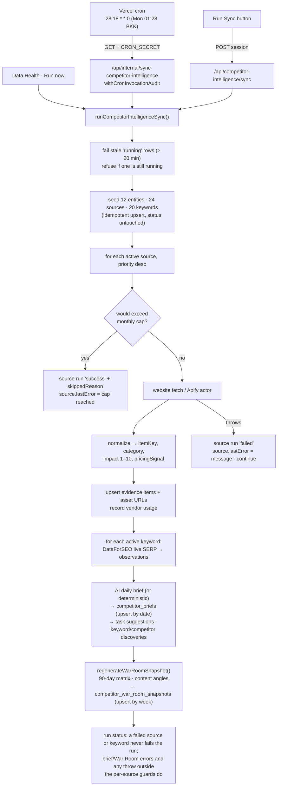

# Competitor Intelligence

**Status: stable**

What the badge rests on (there is no status marker anywhere in code): the whole pipeline is committed and unchanged since its 2026-06-15 build-out (`git log -- src/lib/competitor-intelligence` → `758724a` dashboard, `1534b3c` DataForSEO location fix, `6ede20d` War Room, `0abb5db` stale-run recovery); it is nav-registered as **Competitor BI**, the only tool in the *Market Intelligence* section ([`src/lib/navigation/tools.ts:76`-`80`, `228`-`234`](../../src/lib/navigation/tools.ts)); eight test files cover it; and **its cron is registered in `vercel.json`** — `/api/internal/sync-competitor-intelligence` on `28 18 * * 0` ([`vercel.json:12`-`15`](../../vercel.json)), which is Sunday 18:28 UTC = **Monday 01:28 Asia/Bangkok**. It is the only weekly entry among the file's 17 crons — every other schedule leaves the day-of-week field `*`. The Data Health registry agrees on path, expression and label ([`cron-registry.ts:93`-`109`](../../src/lib/data-health/cron-registry.ts)) and a regression test pins the expression ([`src/__tests__/vercel-crons.test.ts:20`](../../src/__tests__/vercel-crons.test.ts)). The schedule has moved twice: it began daily (`25 18 * * *`), became weekly in `6604377` ("Run competitor intelligence weekly"), and shifted from `:25` to `:28` in `da88794` on 2026-09-02. [`crons.md`](../reference/crons.md) already carries the new expression ([`:29`](../reference/crons.md)); [`internal-crons.md:52`](../reference/api/internal-crons.md) still prints `25 18 * * 0` — see [Open questions](#open-questions).

## Purpose

Competitor Intelligence is a market-watch workbench at `/competitor-intelligence` for BeGifted's management and marketing staff. It answers one recurring question without anyone trawling two dozen competitor pages by hand: *what did the other Bangkok tutoring and admissions businesses just do, and does BeGifted need to respond?*

Once a week the sync pulls three kinds of public signal: competitor **website** copy (page title plus meta description, fetched directly), competitor **Instagram and Facebook** posts (fetched through Apify actors), and **Google rankings** for a seeded keyword set (fetched through DataForSEO). Each captured signal becomes an **evidence item** — hashed to a stable key, classified into one of six market categories, scored 1–10 for impact, and flagged when it looks like pricing. From that evidence the pipeline writes two read-outs: a **brief** (executive summary, what changed, why it matters, recommended responses) and a **weekly War Room snapshot** (a 90-day competitor *attention matrix* plus content angles BeGifted could publish). Both read-outs are AI-assisted when OpenAI is configured and fall back to deterministic text when it is not.

Nothing the AI proposes is executed. Task suggestions and content angles wait in a queue until a human clicks **Accept**, which promotes the suggestion into a tracked task with owner, status and an append-only event trail. BeGifted itself is modelled as an `own_brand` entity in the same tables so the matrix can name a *gap* ("BeGifted has no captured instagram baseline for this competitor's active channel mix") rather than describe competitors in a vacuum.

**Who uses it.** Access is `role === "admin"` (or no role claim) plus either full page access or an `allowedPages` entry under `/competitor-intelligence` ([`access-policy.ts:3`-`13`](../../src/lib/competitor-intelligence/access-policy.ts)). Teacher, counselor, student and parent sessions are refused outright. The page redirects an anonymous visitor to `/login` and an authenticated-but-unauthorised one to `/` ([`page.tsx:13`-`21`](../../src/app/%28app%29/competitor-intelligence/page.tsx)); the API returns `401`/`403` ([`access.ts:19`-`47`](../../src/lib/competitor-intelligence/access.ts)). The middleware additionally gates `/api/competitor-intelligence/*` for restricted users by the same page prefix ([`src/middleware.ts:59`-`66`](../../src/middleware.ts)).

**Vendor spend is bounded by design.** Every paid fetch is pre-checked against a per-provider monthly USD hard cap and skipped — not attempted — when it would breach it ([`sync.ts:556`-`569`, `646`-`654`](../../src/lib/competitor-intelligence/sync.ts)); see [Business rules](#business-rules--edge-cases).

## Conceptual data model

Sixteen `competitor_*` tables and five enums, all in the `core` domain. Column, index and FK detail lives in [`erd-competitor-intelligence.md`](../reference/database/erd-competitor-intelligence.md#tables), the inventory with `schema.ts` line ranges in [`database/index.md`](../reference/database/index.md), and enum value sets in [`enums.md`](../reference/database/enums.md#competitor-intelligence). Migrations: `drizzle/0044_competitor_intelligence.sql` (15 tables + 5 enums) and `drizzle/0045_competitor_war_room.sql` (the snapshot table). This section says what each table *means*.

**Who is watched and where:**

- **`competitor_entities`** — one row per tracked organisation, unique on `slug`. `kind` separates `competitor` from the single `own_brand` row (`begifted`). `discoveredBy` is `"seed"` for the twelve shipped entities and `"ai"` for names the brief proposes; AI discoveries land **inactive** with `categoryTags: ["auto-discovered"]` and `discoveryMetadata.needsReview` ([`sync.ts:461`-`492`](../../src/lib/competitor-intelligence/sync.ts)). Only `active` entities are fetched or scored.
- **`competitor_sources`** — one monitored URL per entity, unique on (`entityId`, `sourceType`, `url`). `provider` names who fetches it (`internal` for websites, `apify` for social, `dataforseo` for the SERP pseudo-source), `priority` orders the sweep, `status` gates it, and `reliability`/`bestEffort` mark social sources whose failure is expected. `lastRunAt`/`lastSuccessAt`/`lastError` are the health read-out every KPI derives from.
- **`competitor_serp_keywords`** — the tracked Google queries, unique on (`keyword`, `language`, `location`, `device`). Seeded rows take the schema-default `active` status with `autoTracked`, confidence 1, and `approvedByEmail`/`approvedAt` stamped to the run's actor — the seed never sets `status` itself ([`data.ts:128`-`158`](../../src/lib/competitor-intelligence/data.ts), [`schema.ts:953`](../../src/lib/db/schema.ts)). AI-suggested rows are `active` only at confidence ≥ 0.8 and otherwise parked as `needs_review` ([`data.ts:747`-`780`](../../src/lib/competitor-intelligence/data.ts)). There is no `approved` status; the enum is `active`/`disabled`/`needs_review`/`archived`.

**What was captured:**

- **`competitor_evidence_items`** — the unit of evidence, unique on `itemKey` (a 24-hex SHA-256 of entity slug, channel, canonical URL, published-at and the first 500 characters of text — [`normalization.ts:51`-`66`](../../src/lib/competitor-intelligence/normalization.ts)). Re-observing the same content upserts the row and bumps `observedAt`; changed content is a new item. `channel` is `website`/`instagram`/`facebook`/`manual`; `category` is one of `pricing_offer`, `event_campaign`, `test_prep`, `admissions`, `homeschool`, `market_activity`. Manual entries carry `evidenceStatus: "manual"` and no source.
- **`competitor_assets`** — media URLs attached to an item (at most four per item). Despite the schema default `storageProvider: "vercel_blob"`, every row written today is `source_url` with `metadata.archiveStatus: "blob_not_configured"` — nothing is downloaded or archived ([`sync.ts:292`-`305`](../../src/lib/competitor-intelligence/sync.ts)).
- **`competitor_serp_observations`** — one Google result per (day, keyword, device, rank, URL), unique on an `observationKey` that embeds the observation date ([`normalization.ts:207`-`209`](../../src/lib/competitor-intelligence/normalization.ts)). `isBeGifted` is a substring test for `begifted` in URL or domain; `entityId` is attributed by matching the result's URL/domain/title against each entity's website hostname and slugified name ([`sync.ts:315`-`319`](../../src/lib/competitor-intelligence/sync.ts), [`data.ts:782`-`796`](../../src/lib/competitor-intelligence/data.ts)).

**Run ledgers:**

- **`competitor_sync_runs`** — one row per sync attempt. The partial unique index on `status = 'running'` is the Postgres single-flight lock ([`schema.ts:864`-`866`](../../src/lib/db/schema.ts)); `triggerType` is `cron` or `manual` (the enum's `backfill` value is never written). Counts, `errorSummary` and `metadata.seeded` are finalised at the end.
- **`competitor_source_runs`** — the per-fetch leaf of a sync run: one row for each source swept and one for each SERP keyword queried, recording what that single fetch yielded, what it cost, and — when it never happened — why it was skipped. It is the grain at which a partial sync is diagnosed, because a failure here never fails the run.
- **`competitor_ai_runs`** — one row per OpenAI call, of which there are at most two per sync (the brief and the War Room). It exists so a read-out can be traced back to the exact prompt version and model that produced it, and so an AI failure is visible even when the fallback text shipped.
- **`competitor_vendor_usage`** — the spend ledger, unique on (`usageMonth`, `provider`, `sourceType`); `hardCapUsd` and `capped` are re-stamped on every write ([`sync.ts:166`-`213`](../../src/lib/competitor-intelligence/sync.ts)).

**Read-outs and the human loop:**

- **`competitor_briefs`** — the week's executive read-out, one per Bangkok `briefDate` (unique), so a second sync on the same day overwrites rather than accumulates. Alongside the narrative it freezes the health and spend numbers as they stood when the brief was written, which is why the dashboard's live KPIs can disagree with it (see [Business rules](#business-rules--edge-cases)). Columns: [`erd-competitor-intelligence.md`](../reference/database/erd-competitor-intelligence.md#competitorbriefs-competitor_briefs-lines-10151037).
- **`competitor_war_room_snapshots`** — one per Bangkok Monday `weekStart` (unique); the matrix, content angles and per-entity score drill-downs are stored as JSON so the dashboard reads them without recomputing. `status` is `ready` or `ai_fallback`.
- **`competitor_task_suggestions`** — the AI queue. Rows come from the brief's task suggestions and from War Room content angles (labelled `content_angle`). `status` moves from `suggested` to `accepted`, recording the resulting task id and who accepted.
- **`competitor_tasks`** — the human-owned work item. Today the **only** creation path is accepting a suggestion ([`data.ts:594`-`640`](../../src/lib/competitor-intelligence/data.ts)); status, owner, priority, due date and labels are editable.
- **`competitor_task_events`** — append-only audit (`created_from_suggestion`, `updated` with the patch payload).
- **`competitor_task_comments`** — declared with an optional asset attachment, but **no code path writes it** (grep for `competitorTaskComments` outside `schema.ts` returns nothing).

Nothing in this feature reads any other subsystem's tables; its only outward dependency is `admin_users`-derived session claims via Auth.js.

## API surface

Nine session-authed endpoints under `/api/competitor-intelligence` plus one cron route. Full request/response contracts are in [`docs/reference/api/competitor-intelligence.md`](../reference/api/competitor-intelligence.md) and [`internal-crons.md`](../reference/api/internal-crons.md); the schedule and health thresholds are in [`docs/reference/crons.md`](../reference/crons.md) (per-cron entry 3).

| Endpoint | Purpose |
|---|---|
| `GET /api/competitor-intelligence` | The dashboard's only read. Everything the page shows arrives in one response, which is why there is no per-tab fetching and why every mutation is followed by a full reload. Response composition: [`competitor-intelligence.md`](../reference/api/competitor-intelligence.md#get-apicompetitor-intelligence). |
| `POST /api/competitor-intelligence/sync` | Run the whole pipeline now as `triggerType: "manual"`; `maxDuration = 800`; `409` when a run is already in flight, `500` when the run finished `failed` ([`sync/route.ts:8`-`24`](../../src/app/api/competitor-intelligence/sync/route.ts)). |
| `POST /api/competitor-intelligence/manual-evidence` | Record a signal a human saw (a flyer, a LINE broadcast) as an evidence item on a competitor, classified and scored by the same rules as scraped items. |
| `GET /api/competitor-intelligence/own-sources` | List BeGifted's own website/Instagram/Facebook sources. |
| `POST /api/competitor-intelligence/own-sources` | Add an own-brand source (`201`); creates the `begifted` entity if missing. |
| `PATCH /api/competitor-intelligence/own-sources/[sourceId]` | Edit an own-brand source; a body with `status: "disabled"` takes the disable path, anything else upserts. |
| `PATCH /api/competitor-intelligence/sources/[sourceId]` | Set any source's status — the human override that survives re-seeding, since the seed never writes `status`. |
| `POST /api/competitor-intelligence/task-suggestions/[suggestionId]/accept` | Promote a suggestion into a task; refuses a suggestion that is not `suggested`. |
| `PATCH /api/competitor-intelligence/tasks/[taskId]` | Edit a task in place; every patch appends a task event, so the audit trail is a side effect no caller can skip. |
| `GET`/`POST /api/internal/sync-competitor-intelligence` | The weekly cron (`28 18 * * 0`). `GET` is cron-secret only; `POST` also accepts a session that passes `requireCompetitorIntelligenceSession`, recorded as `triggerSource: "admin"` ([`route.ts:20`-`45`](../../src/app/api/internal/sync-competitor-intelligence/route.ts)). |

Every app handler shares two helpers: `requireCompetitorIntelligenceSession()` and `competitorIntelligenceErrorResponse()`, which maps `Unauthorized → 401`, `Forbidden → 403`, and everything else → `500` with the error message ([`access.ts:32`-`54`](../../src/lib/competitor-intelligence/access.ts)). The mapper rethrows Next's `HANGING_PROMISE_REJECTION` digest so `cacheComponents` prerendering is not swallowed ([`access.ts:33`-`40`](../../src/lib/competitor-intelligence/access.ts)). Bodies are validated with bare `Schema.parse()`, so a malformed body surfaces as `500` with the Zod message rather than `400` — the family has no `400` branch.

A third way in exists: the Data Health **Run now** button dispatches `competitor_intelligence` in-process with `actorEmail` defaulting to `data-health@begifted.local` ([`run-job.ts:82`-`98`](../../src/lib/data-health/run-job.ts)).

## UI

**Page** — [`src/app/(app)/competitor-intelligence/page.tsx`](../../src/app/%28app%29/competitor-intelligence/page.tsx): the default export `CompetitorIntelligencePage` is synchronous and does nothing but render `<Suspense>` with a skeleton fallback (`:25`-`31`); the `await auth()` guard and the two redirects live in the inner async `CompetitorIntelligenceBody` (`:13`-`23`), so the guard runs inside the boundary rather than blocking the shell. Neither passes props; the client fetches everything.

**Component** — [`competitor-intelligence-dashboard.tsx`](../../src/components/competitor-intelligence/competitor-intelligence-dashboard.tsx) (1,143 lines, the feature's only component). It loads `GET /api/competitor-intelligence` once on mount with `cache: "no-store"` ([`:107`-`114`, `:225`-`244`](../../src/components/competitor-intelligence/competitor-intelligence-dashboard.tsx)) and, after **every** mutation, reloads the whole payload rather than patching local state ([`:246`-`259`](../../src/components/competitor-intelligence/competitor-intelligence-dashboard.tsx)). All timestamps render in `Asia/Bangkok` ([`:63`-`70`](../../src/components/competitor-intelligence/competitor-intelligence-dashboard.tsx)).

Top to bottom:

1. **Header** — `Refresh` and `Run Sync` buttons; the sync result is summarised as "N new signals, M failed sources" ([`:261`-`269`, `:394`-`408`](../../src/components/competitor-intelligence/competitor-intelligence-dashboard.tsx)).
2. **Weekly War Room** card — week and 90-day lookback bounds, snapshot status badge (`ready` / `ai fallback` / `empty`), executive summary, and four KPI tiles: *Top Attention* (highest-scoring competitor), *Posting Velocity* (mean cadence/week across the matrix), *Channel Coverage* (healthy ÷ active sources), *BeGifted Gaps* (competitors whose gap text does not start with "No major") ([`:423`-`466`](../../src/components/competitor-intelligence/competitor-intelligence-dashboard.tsx)).
3. **War Room Health**, **Competitor Matrix** (click a row to select), **Score Drilldown** for the selected row (formula, six component scores, weekly timeline with top evidence), **Content Angles** (each with an Accept button that calls the suggestion-accept route), **SEO And Offers Context**, and **Accepted Tasks** ([`:468`-`673`](../../src/components/competitor-intelligence/competitor-intelligence-dashboard.tsx)).
4. **Six tabs** ([`:680`-`685`](../../src/components/competitor-intelligence/competitor-intelligence-dashboard.tsx)): **Activity** (recent evidence feed), **SEO** (rank matrix per keyword/device: best BeGifted rank vs best competitor rank), **Pricing** (pricing-flagged evidence plus the *Manual Evidence* form), **Sources** (the *BeGifted Own-Brand Sources* add/edit/disable form and the *Competitors And Sources* table with a per-row status select), **Tasks** (*AI Suggested Tasks* with Accept, *Active Tasks* with a status select), **Costs** (*Vendor Usage* by month/provider and *Recent Runs*).

There are no per-row detail pages, no task-creation form, no task comments UI, and no control to activate an AI-discovered entity or approve a `needs_review` keyword.

## Data flow

### The weekly sync

Step by step ([`sync.ts:494`-`827`](../../src/lib/competitor-intelligence/sync.ts)):

1. **Recover, then lock.** Any `competitor_sync_runs` row still `running` after 20 minutes is marked `failed`, and its child source runs and AI runs with it ([`sync.ts:40`, `82`-`124`](../../src/lib/competitor-intelligence/sync.ts)). If a `running` row remains, the call throws "already running", which every entry point maps to `409`.
2. **Seed.** The shipped catalogue in [`default-sources.ts`](../../src/lib/competitor-intelligence/default-sources.ts) is upserted on **every** run: 12 entities (BeGifted plus 11 Bangkok tutoring/admissions competitors), 24 sources, and 10 keyword phrases × {mobile, desktop} = 20 SERP keywords. The upserts refresh labels, handles, providers and priorities; their `set` clauses omit `status` on sources and keywords and `active` on entities ([`data.ts:79`-`89`, `109`-`125`, `144`-`158`](../../src/lib/competitor-intelligence/data.ts)), so a human's disable survives the next sync. (The effect is verified in code; no comment or commit message states it as intent.)
3. **Sweep sources.** Active sources of active entities, highest `priority` first ([`data.ts:164`-`177`](../../src/lib/competitor-intelligence/data.ts)). Websites (and the otherwise-unused `sitemap` type) are fetched directly with a 10-second timeout and reduced to `<title>` + meta description ([`providers.ts:53`-`67`](../../src/lib/competitor-intelligence/providers.ts), [`normalization.ts:91`-`117`](../../src/lib/competitor-intelligence/normalization.ts)). Instagram and Facebook go through Apify's `run-sync-get-dataset-items` with a 60-second timeout, `resultsLimit` from `source.config.limit` (default 12) ([`providers.ts:92`-`127`](../../src/lib/competitor-intelligence/providers.ts)). Each source's failure is isolated: the source run and `lastError` are written and the sweep continues ([`sync.ts:614`-`626`](../../src/lib/competitor-intelligence/sync.ts)).
4. **Sweep keywords.** Only if a `serp`-type source row exists (the seeded `begifted:serp-baseline` pseudo-URL) ([`providers.ts:184`-`191`](../../src/lib/competitor-intelligence/providers.ts), [`sync.ts:629`-`634`](../../src/lib/competitor-intelligence/sync.ts)). Each active keyword is one DataForSEO `serp/google/organic/live/regular` call; results are stored `onConflictDoNothing` ([`sync.ts:332`-`355`](../../src/lib/competitor-intelligence/sync.ts)). Because the observation key embeds the observation date **together with** result type, absolute rank and URL ([`normalization.ts:207`-`209`](../../src/lib/competitor-intelligence/normalization.ts)), a same-day re-run is a no-op only for results that have not moved; any result whose rank or URL changed is inserted as an additional observation for that day.
5. **Brief.** One `competitor_ai_runs` row (`daily_brief`, prompt version `competitor-intel-2026-06-15-v1`). Input is **only the items captured in this run**, capped at 80 with 1,000 characters of text each ([`ai.ts:190`-`196`](../../src/lib/competitor-intelligence/ai.ts)). The OpenAI Responses API is called with `store: false` and a strict JSON schema ([`ai.ts:161`-`277`](../../src/lib/competitor-intelligence/ai.ts)); the system prompt forbids inventing prices, events, competitors, dates or rankings ([`ai.ts:176`-`180`](../../src/lib/competitor-intelligence/ai.ts)). Without a key the deterministic brief is used ([`ai.ts:74`-`111`](../../src/lib/competitor-intelligence/ai.ts)). The brief row is upserted on the Bangkok date; keyword suggestions with confidence ≥ 0.7 and competitor suggestions ≥ 0.8 are persisted; task suggestions are de-duplicated on (title, item, `suggested`) ([`sync.ts:721`-`766`](../../src/lib/competitor-intelligence/sync.ts)).
6. **War Room.** `regenerateWarRoomSnapshot` recomputes the 90-day matrix from the last 500 evidence items and 1,000 SERP observations, asks OpenAI for content angles (prompt version `competitor-war-room-2026-06-15-v1`), turns each angle into a `content_angle` task suggestion, and upserts the week's snapshot ([`war-room.ts:496`-`638`](../../src/lib/competitor-intelligence/war-room.ts)).
7. **Finalise.** Counts and the first six error strings are written to the run. The status rule that matters operationally is the **negative** one: a fetch or store failure for an individual source or keyword never fails the run, because each is wrapped in its own `try`/`catch` ([`sync.ts:571`-`626`, `656`-`691`](../../src/lib/competitor-intelligence/sync.ts)) — any number of failed sources still yields `success` ([`sync.ts:802`-`813`](../../src/lib/competitor-intelligence/sync.ts)). Everything else can fail the run. Besides the brief and War Room flags, the outer `catch` marks the run `failed` on any throw outside those per-source guards ([`sync.ts:814`-`826`](../../src/lib/competitor-intelligence/sync.ts)): seeding, listing active sources, inserting a `competitor_source_runs` row or stamping `lastRunAt` (`:536`-`553`), the budget pre-check's own DB read (`:556`), `getSeededSerpSource` / `loadEntitiesByDomain` (`:629`-`631`), and the AI-run insert (`:697`-`705`) all sit outside them.

### The read path

`GET /api/competitor-intelligence` issues twelve queries in parallel — entities, sources, latest brief, 80 newest items, keywords, 300 newest SERP observations, up to 24 open suggestions, up to 50 tasks, 12 runs, all vendor-usage rows, per-item asset counts, and the latest War Room snapshot — and derives the KPIs in memory ([`data.ts:224`-`336`](../../src/lib/competitor-intelligence/data.ts)). Content-angle statuses are refreshed live against `competitor_task_suggestions` so an angle accepted since the snapshot shows as `accepted` ([`war-room.ts:688`-`700`](../../src/lib/competitor-intelligence/war-room.ts)). Nothing on the read path is cached with `"use cache"`; the client fetches with `no-store`.

### The human loop

Accept → `acceptCompetitorTaskSuggestion` runs in two stages. The task insert goes first and alone, because the two writes that follow both need `task.id` ([`data.ts:607`-`621`](../../src/lib/competitor-intelligence/data.ts)); only then are the suggestion stamp (`accepted`, `acceptedTaskId`, `acceptedByEmail`) and the `created_from_suggestion` event issued together in a `Promise.all` ([`data.ts:623`-`638`](../../src/lib/competitor-intelligence/data.ts)). There is no transaction around either stage, so a failure in the second leaves an orphan task — created and visible, but with its suggestion still showing as `suggested` and no event row. Status edits go through `updateCompetitorTask`, which sets `completedAt` when the new status is `done`, clears it on any other explicit status, and leaves it alone when status is omitted ([`data.ts:654`-`662`](../../src/lib/competitor-intelligence/data.ts)).

## Business rules & edge cases

**Evidence identity and classification** ([`normalization.ts`](../../src/lib/competitor-intelligence/normalization.ts))

- URLs are canonicalised before hashing: fragment dropped, query parameters sorted, trailing slash removed (`:38`-`49`). Two links to the same post with reordered parameters are one item.
- Category is decided by the **first** matching regex in a fixed order — price → event → test-prep → admissions → homeschool → `market_activity` (`:68`-`75`). A post that mentions both a price and SAT is `pricing_offer`.
- Impact starts at 1 and adds +3 for a price pattern, +2 for an event pattern, +1 for test-prep/admissions vocabulary, and +1 each for ≥100 likes, ≥20 comments, ≥1,000 views, capped at 10 (`:77`-`89`). The price regex accepts `฿`, `THB`, `บาท`, comma-grouped thousands, or 4–6 digits followed by baht/thb (`:4`).
- Confidence is a per-channel constant, not a computed value: website 0.8, Instagram 0.75, Facebook 0.72 (`:111`, `:146`, `:183`), manual 0.7 ([`data.ts:719`](../../src/lib/competitor-intelligence/data.ts)).
- Language is `th` if any Thai-block character appears, else `en` (`:108`).
- A website item has `publishedAt: null`, so its key is a function of URL + title + description: an unchanged page re-upserts the same item every week (bumping `observedAt`), a changed description creates a new one (`:99`-`101`).
- `buildTaskSuggestionSeed` (`:227`-`243`) is exported but imported nowhere — both the AI and deterministic paths build their own suggestion objects.

**Budget** ([`budget.ts`](../../src/lib/competitor-intelligence/budget.ts), [`sync.ts:126`-`213`](../../src/lib/competitor-intelligence/sync.ts))

- The usage bucket is the **UTC** month start (`budget.ts:11`-`16`), not Bangkok.
- Cap resolution: `COMPETITOR_<PROVIDER>_MONTHLY_CAP_USD` (provider upper-cased, non-alphanumerics → `_`, so `COMPETITOR_APIFY_MONTHLY_CAP_USD`, `COMPETITOR_DATAFORSEO_MONTHLY_CAP_USD`) → `COMPETITOR_INTEL_MONTHLY_CAP_USD` → default **250 USD** for paid types and **0** for `website`/`manual` (`budget.ts:18`-`25`). A cap ≤ 0 means *unlimited* (`budget.ts:27`-`30`), so websites are never budget-blocked.
- The pre-flight estimate is the *worst case*: Apify `limit × COMPETITOR_APIFY_COST_PER_ITEM_USD` (default 0.01), DataForSEO `COMPETITOR_DATAFORSEO_COST_PER_QUERY_USD` (default 0.002) per keyword (`sync.ts:126`-`138`). Actual usage recorded afterwards is `items fetched × cost` (minimum one unit) ([`providers.ts:121`-`124`, `177`-`179`](../../src/lib/competitor-intelligence/providers.ts)).
- A budget skip on a website or social source is recorded as a source run with `status: "success"` and a `skippedReason`, **and** writes `lastError = "Monthly vendor budget cap reached"` on the source (`sync.ts:556`-`569`). That `lastError` makes the source count as *unhealthy* in coverage and in the matrix's coverage component until a later run succeeds. The SERP budget skip is the exception: it writes `"Monthly SERP budget cap reached"` to the source run only (`sync.ts:646`-`654`), leaving the baseline source's health untouched.
- `budgetUsageRatio` in `budget.ts:32`-`35` is only imported by its test; production computes the ratio with a private `budgetRatio` (`sync.ts:400`-`409`).

**Missing vendor credentials are a skip, not a failure.** No `APIFY_API_TOKEN` → every social source returns `skippedReason: "APIFY_API_TOKEN is not configured"` and counts as skipped ([`providers.ts:92`-`101`](../../src/lib/competitor-intelligence/providers.ts)); no `DATAFORSEO_LOGIN`/`DATAFORSEO_PASSWORD` → every keyword likewise ([`providers.ts:129`-`141`](../../src/lib/competitor-intelligence/providers.ts)). **The two paths record the skip differently.** The social/website sweep copies `skippedReason` onto the source row's `lastError` ([`sync.ts:609`](../../src/lib/competitor-intelligence/sync.ts)), so a missing Apify token does surface as an unhealthy source. The keyword sweep writes only to `competitor_source_runs` ([`sync.ts:673`-`685`](../../src/lib/competitor-intelligence/sync.ts)) and never touches the seeded `begifted:serp-baseline` source row — neither for absent DataForSEO credentials nor for the SERP budget skip (`:646`-`654`). A DataForSEO outage is therefore invisible to coverage and to the matrix's coverage component; it shows up only in the *Costs* tab's run list. A keyword row stored with the legacy location `"Bangkok, Thailand"` is rewritten to DataForSEO's `"Bangkok,Bangkok,Thailand"` at call time ([`providers.ts:30`-`34`](../../src/lib/competitor-intelligence/providers.ts)); seeded rows already use the latter ([`default-sources.ts:3`](../../src/lib/competitor-intelligence/default-sources.ts)).

**AI gating and fallback** ([`ai.ts`](../../src/lib/competitor-intelligence/ai.ts))

- AI is on when `ENABLE_COMPETITOR_AI !== "false"` **and** `OPENAI_API_KEY` is set (`:70`-`72`) — an opt-out flag; only the literal lowercase `false` disables it.
- Model: `OPENAI_COMPETITOR_INTEL_MODEL` → `OPENAI_SCHEDULER_MODEL` → `gpt-5.4-mini` (`:64`-`68`).
- Output is validated twice: OpenAI's strict JSON schema, then a Zod schema with caps (≤ 8 bullets per section, ≤ 12 task suggestions, ≤ 12 keyword and ≤ 8 competitor suggestions; War Room ≤ 12 angles with a closed `suggestedChannel` enum) (`:7`-`47`). An unsupported channel such as `tiktok` is rejected ([`ai.test.ts:58`-`70`](../../src/lib/competitor-intelligence/__tests__/ai.test.ts)).
- **The two AI steps fail differently.** A brief failure marks the AI run `failed`, writes **no brief row** for the day, and fails the whole sync ([`sync.ts:774`-`786`, `802`](../../src/lib/competitor-intelligence/sync.ts)). A War Room failure falls back to `deterministicWarRoomInsights`, records `metadata.aiError`, and still writes the snapshot with `status: "ai_fallback"` ([`war-room.ts:569`-`581`, `599`](../../src/lib/competitor-intelligence/war-room.ts)).
- Discovered competitors are inserted `active: false`; discovered keywords below 0.8 confidence are `needs_review`. Neither has a review UI or endpoint, so they accumulate until someone edits the database.

**War Room scoring** ([`war-room.ts`](../../src/lib/competitor-intelligence/war-room.ts))

- Week = Bangkok Monday → Sunday; lookback = the 90 days ending on that Sunday (`:60`-`70`). Evidence is dated by `publishedAt ?? observedAt` (`:72`-`74`), but the DB query filters on `observedAt` (`:511`), so an old post captured this week is loaded and then excluded from the matrix by its published date.
- Six components, each clamped 0–100 (`:117`-`138`): activity = items × 8; burst = (30 if any item in the last 14 days) + 15 × (last-14 − previous-14); engagement = 28 × log10(units + 1) where units = likes + 3 × comments + 5 × shares + views ÷ 25 (`:308`-`315`); SEO = mean over keywords of `100 − 5 × (bestRank − 1)` (`:151`-`164`); offer = pricing signals × 25; coverage = healthy ÷ active sources × 100.
- Attention = 0.30 activity + 0.20 burst + 0.15 engagement + 0.15 SEO + 0.10 offer + 0.10 coverage (`:140`-`149`); the formula string is stored with every drill-down (`:245`). Competitors sort above the own-brand row, then by attention descending (`:370`-`373`).
- `burstLabel`: "Channel burst" when last-14 ≥ previous-14 + 3; "Rising cadence" when up; "Cooling" when down; else "Stable" (`:330`-`336`). `recommendedAngle` and `beGiftedGap` are rule tables keyed on top theme, cadence and channel mix (`:178`-`221`). The gap's cascade is worth reading precisely, because the seed ships no own-brand website or social source and it is tempting to assume the whole feature is inert until someone adds one. It is not: matrix rows are built for **every** `active` entity whether or not it has evidence (`:287`-`288`), and the seeded `begifted` entity is active by schema default (`schema.ts:806`; the seed never writes `active` — [`data.ts:66`-`90`](../../src/lib/competitor-intelligence/data.ts)). So an own-brand row with an empty `activeChannels` always exists after the first sync (`:364`), and the first branch to match for any competitor with a captured channel is the missing-channel one — "BeGifted has no captured *instagram, facebook* baseline for this competitor's active channel mix." (`:210`-`213`). The `"BeGifted baseline sources are not configured yet."` string (`:209`) is reachable only when there is **no own-brand row at all** — the `begifted` entity deleted or set `active: false` in the database.
- Content angles become `competitor_task_suggestions` with `labels: ["content_angle", channel]`, priority `high` at confidence ≥ 0.75, and `suggestedOwnerEmail` set to whoever triggered the sync (`:435`-`446`); on accept that becomes the task's `ownerEmail` ([`data.ts:617`](../../src/lib/competitor-intelligence/data.ts)).

**Dashboard KPIs are computed from different windows than the brief's.** `budgetUsedPercent` sums `estimatedCostUsd` and `hardCapUsd` across **every** `competitor_vendor_usage` row regardless of month ([`data.ts:305`-`306`, `333`](../../src/lib/competitor-intelligence/data.ts)), whereas the brief's `budgetUsageRatio` filters to the current month ([`sync.ts:400`-`409`](../../src/lib/competitor-intelligence/sync.ts)). `highImpactMoves` counts impact ≥ 6 among the 80 most recent items only ([`data.ts:301`](../../src/lib/competitor-intelligence/data.ts)); `seoVisibilityScore` on the KPI row is the latest brief's value, not recomputed ([`data.ts:331`](../../src/lib/competitor-intelligence/data.ts)).

**Own-brand sources** ([`data.ts:449`-`578`](../../src/lib/competitor-intelligence/data.ts))

- Allowed types are `website`, `instagram`, `facebook` only (`:23`); `serp`, `sitemap` and `manual` are refused by the route schema.
- Saving always ensures the `begifted` entity exists and pins priority 100; social sources are `best_effort`, websites `reliable` (`:524`-`528`). Updates are scoped to the own-brand entity id, so an own-brand `PATCH` cannot edit a competitor's source (`:533`-`541`).
- The seed ships BeGifted with **only** the SERP baseline — no BeGifted website or social source — so the own-brand baseline in the War Room depends entirely on a human adding sources in the *Sources* tab ([`default-sources.ts:27`-`42`](../../src/lib/competitor-intelligence/default-sources.ts)).

**Manual evidence** — the item key is built from entity slug, the literal channel `manual`, the *canonicalised URL*, a null `publishedAt` and the first 500 characters of `title\ncontentText` ([`data.ts:699`-`705`](../../src/lib/competitor-intelligence/data.ts), [`normalization.ts:57`-`65`](../../src/lib/competitor-intelligence/normalization.ts)). Re-submitting the same competitor + title + text therefore upserts the existing item rather than duplicating it **only when the URL matches too** ([`data.ts:728`-`743`](../../src/lib/competitor-intelligence/data.ts)); adding a `canonicalUrl` to a previously URL-less submission, or citing a different link for the same text, creates a second item. `pricingSignal` defaults to whether the text classified as `pricing_offer` (`:722`), and the submitter's email is kept in `raw` (`:725`).

**Cron route specifics** ([`route.ts`](../../src/app/api/internal/sync-competitor-intelligence/route.ts))

- The `CRON_SECRET` comparison is an inline `timingSafeEqual` with a length pre-check; an unset secret returns `500 Server misconfigured` rather than `401` (`:11`-`29`).
- `POST` falls back to `requireCompetitorIntelligenceSession()`, but flattens both `Unauthorized` and `Forbidden` to `401` (`:31`-`36`) — unlike the app routes, which distinguish `403`.
- Actor is `cron@begifted.local` on the secret path (`:22`), which becomes the `suggestedOwnerEmail` on that week's content angles.
- The Data Health registry treats the job as late 120 minutes after its expected Monday 01:28 slot and allows 800 s ([`cron-registry.ts:101`-`102`](../../src/lib/data-health/cron-registry.ts)); the route's `maxDuration` is also 800 (`:7`). Data Health reads `competitor_sync_runs` directly for run evidence and shows "N new signals" on its domain card ([`dashboard.ts:189`-`196`, `538`-`545`](../../src/lib/data-health/dashboard.ts)).

**Inert schema surface.** `competitor_sources.captureMedia`, `competitor_entities.archivedAt`, `competitor_evidence_items.taskSuggestionStatus` (always `"none"`), the `backfill` trigger value, and the `competitor_task_comments` table have no live code path at all (verified by grep across `src/` excluding `schema.ts`). `reviewStatus` is one step less dead: it is written as the constant `"new"` ([`data.ts:721`](../../src/lib/competitor-intelligence/data.ts)), declared on the payload type ([`types.ts:203`](../../src/lib/competitor-intelligence/types.ts)) and serialized into every `recentItems` entry of the GET response ([`data.ts:376`](../../src/lib/competitor-intelligence/data.ts)) — but the dashboard never renders it and nothing ever changes it, so the review workflow it implies does not exist.

## Tests

Eight files, all in the `unit` project; there is no integration suite for this feature.

| File | Covers |
|---|---|
| [`src/lib/competitor-intelligence/__tests__/access.test.ts`](../../src/lib/competitor-intelligence/__tests__/access.test.ts) | Full admins pass, restricted users need the `/competitor-intelligence` prefix, teacher-role sessions are refused. |
| [`__tests__/ai.test.ts`](../../src/lib/competitor-intelligence/__tests__/ai.test.ts) | Deterministic brief binds task suggestions to real item keys and emits no keyword/competitor discoveries; War Room Zod schema accepts a valid angle and rejects an unsupported channel. |
| [`__tests__/budget.test.ts`](../../src/lib/competitor-intelligence/__tests__/budget.test.ts) | UTC month bucket, scoped-over-global cap resolution, hard-cap blocking, bounded usage ratio. |
| [`__tests__/normalization.test.ts`](../../src/lib/competitor-intelligence/__tests__/normalization.test.ts) | Stable keys across parameter order and fragments; website pricing extraction; Apify Instagram/Facebook normalisation with metrics and media; DataForSEO rank observations with daily keys. |
| [`__tests__/sync-guard.test.ts`](../../src/lib/competitor-intelligence/__tests__/sync-guard.test.ts) | `failStaleRunningCompetitorSyncs` cascades to source runs and AI runs, and touches nothing when no run is stale. |
| [`__tests__/war-room.test.ts`](../../src/lib/competitor-intelligence/__tests__/war-room.test.ts) | Bangkok week/90-day bounds; matrix scoring, sorting, channel counts, coverage warnings and drill-down top evidence from fixture rows; the attention-score weighting on fixed components. |
| [`src/app/api/competitor-intelligence/__tests__/route.test.ts`](../../src/app/api/competitor-intelligence/__tests__/route.test.ts) | `GET` returns `401` with no session and never touches data; the payload contract for `weeklyWarRoom`, `competitorMatrix`, `contentAngles`, `scoreDrilldowns`. |
| [`own-sources/__tests__/route.test.ts`](../../src/app/api/competitor-intelligence/own-sources/__tests__/route.test.ts) | Access guard, listing, creating a BeGifted source for the signed-in user, disabling through `PATCH`. |

Cross-cutting pins: [`src/__tests__/vercel-crons.test.ts:20`](../../src/__tests__/vercel-crons.test.ts) fixes the `28 18 * * 0` expression; [`src/lib/navigation/__tests__/tools.test.ts:37`, `:67`](../../src/lib/navigation/__tests__/tools.test.ts) assert the tool is the sole member of *Market Intelligence*.

**Not covered**, as far as reading all eight files above shows — no coverage report was run, so treat this as an inventory of what the suites assert rather than a proof of zero incidental reach: `runCompetitorIntelligenceSync` end to end (only the stale-run guard is tested), every provider in `providers.ts` (network), `getCompetitorIntelligencePayload` and the KPI derivations in `data.ts`, the `manual-evidence`, `sources`, `tasks`, `task-suggestions` and `sync` app routes, the internal cron route, `regenerateWarRoomSnapshot`'s persistence, and the dashboard component.

## Open questions

1. **Two reference pages still print the old schedule.** `vercel.json:14`, `cron-registry.ts:98` and `vercel-crons.test.ts:20` all say `28 18 * * 0` (Monday 01:28 Bangkok, changed in `da88794` on 2026-09-02). [`crons.md:29`](../reference/crons.md) has already been regenerated and agrees, and its own open question 2 ([`crons.md:653`](../reference/crons.md)) flags the stragglers. Two remain: [`internal-crons.md:52`](../reference/api/internal-crons.md) (`25 18 * * 0`, "Mon 01:25 Bangkok") and [`OPEN-QUESTIONS.md` OPS-15](../OPEN-QUESTIONS.md) (quotes the registry label as "Weekly Monday 01:25 Bangkok" and `vercel.json:13` as `25 18 * * 0` — both now `:28`, which also dissolves the 0-vs-1 weekday point it raises). Should those two be regenerated, or does OPS-15 close outright?
2. **"Daily Market Brief" on a weekly cron.** The brief is titled and keyed by day, and the `briefDate` uniqueness means a second sync on the same date overwrites; the cron was daily (`25 18 * * *`) before `6604377`, though nothing in code records that as the reason for the naming. It is now produced once a week from only that run's captures ([`sync.ts:696`-`711`](../../src/lib/competitor-intelligence/sync.ts)). Is the weekly cadence the intended end state, and should the brief be renamed or widened to the week's evidence?
3. **Asymmetric AI failure handling.** A brief-generation error fails the entire run and writes no brief; a War Room error degrades gracefully to `ai_fallback`. Was the brief meant to fall back to `deterministicBrief` too?
4. **Dead-end review queues.** AI-discovered competitors are inserted inactive with `needsReview`, and sub-0.8 keywords as `needs_review`, but nothing in the UI or API lets a human activate or approve them. Is a review surface planned, or should discovery be disabled?
5. **`budgetUsedPercent` spans all months.** The dashboard KPI sums every `competitor_vendor_usage` row ([`data.ts:305`-`306`](../../src/lib/competitor-intelligence/data.ts)) while the sync's ratio is current-month only; after the first month rollover the tile will overstate spend. Bug or intended lifetime view?
6. **Skips are recorded two incompatible ways.** On the website/social path a budget or credential skip writes `source.lastError`, dropping the coverage score and the matrix coverage component even though no fetch was attempted. On the SERP path neither skip touches the source row at all, so a DataForSEO outage or cap is invisible to every health read-out. Should "cap reached" read as unhealthy — and whichever answer, should both paths do the same thing?
7. **Malformed bodies return `500`.** The family uses `Schema.parse()` with no `ZodError → 400` branch (already logged as DEF-8 in `OPEN-QUESTIONS.md`). Fix in the mapper, or switch the routes to `safeParse`?
8. **Unreachable schema surface.** `competitor_task_comments` is never written; `captureMedia`, `archivedAt`, `taskSuggestionStatus` and the `backfill` trigger are never updated; `reviewStatus` is written once as `"new"` and shipped in the payload but never rendered or changed; assets are stamped `blob_not_configured` against a `vercel_blob` default. Planned follow-ups or candidates for removal?
9. **No own-brand sources in the seed.** BeGifted ships with only the SERP baseline, so its matrix row exists but carries no `activeChannels` — every competitor's gap text is the generic "no captured … baseline" line, and the *BeGifted Gaps* KPI counts all of them, until someone adds sources by hand. Should the seed include the BeGifted website/social handles?
10. **Weekly cadence vs a wedged run.** A run that fails or is marked stale costs seven days of coverage with no automatic retry; recovery is the manual *Run Sync* button or Data Health *Run now*. Is a mid-week retry wanted?
11. **Accepting a suggestion is not atomic.** The task insert and the pair of follow-up writes are separate round trips with no transaction ([`data.ts:607`-`638`](../../src/lib/competitor-intelligence/data.ts)); a failure after the insert strands a task whose suggestion still reads `suggested`, and the *AI Suggested Tasks* list would offer it again. Neon-http has no transaction support, so this would need the `pg` driver as payroll does. Worth the change, or is a rare double-accept tolerable?
12. **This document's provenance and footer stamp.** The task brief said no feature doc existed, but `docs/features/competitor-intelligence.md` was already committed in `241deb5` and carried uncommitted edits from a concurrent pass when this write landed. This version supersedes both; confirm no content from the concurrent edit needs recovering. Separately, the mandated footer reads `main@0cd1e81 (clean tree)`, but at write time `0cd1e81` sat on `fix/payout-auto-approve-emergency`, four commits ahead of `origin/main`, with ~20 modified docs in the tree including this file. The commit is right; "main" and "clean tree" are not. The wording is fixed by the documentation task, so it was left as issued.

_Verified against main@0cd1e81 (clean tree) on 2026-09-02._
