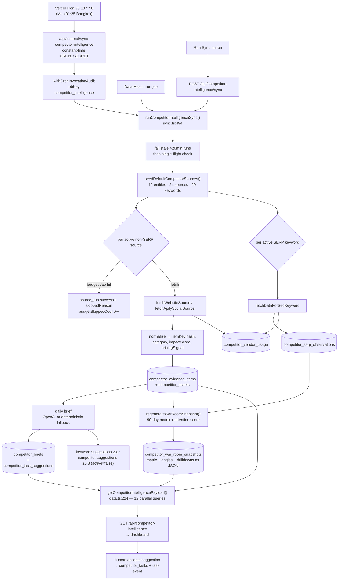

# Competitor Intelligence

**Status: stable** — an editorial designation carried by this handbook. No `@deprecated` or equivalent status marker exists anywhere under `src/lib/competitor-intelligence/`, `src/app/api/competitor-intelligence/`, `src/app/(app)/competitor-intelligence/` or `src/components/competitor-intelligence/`, so the badge word itself is not derivable from code — only the mechanism below is.

What *is* derivable: the page, the nine in-app API routes, the internal cron route and the whole `src/lib/competitor-intelligence/` pipeline are all committed (`git log` on `src/lib/competitor-intelligence` ends at `0abb5db Recover stale competitor sync runs`), the nav entry is registered (`src/lib/navigation/tools.ts:220`-`226`), eight test suites cover it, and **the cron _is_ registered in `vercel.json`** — `/api/internal/sync-competitor-intelligence` on `25 18 * * 0` (`vercel.json:11`-`14`). That is Sunday 18:25 UTC = **Monday 01:25 Asia/Bangkok**, and it is the only *weekly* cron in the file — but not the only non-sub-hourly one: several entries are daily and `/api/internal/student-promotions/july-1` is annual, `5 17 30 6 *` (`vercel.json:52`-`53`). The Data Health registry agrees with `vercel.json` on both the path and the schedule (`src/lib/data-health/cron-registry.ts:93`-`108`).

## Purpose

Competitor Intelligence is a market-watching workbench at `/competitor-intelligence` for BeGifted's management and marketing staff. It answers one recurring question — *what did the other Bangkok tutoring / admissions companies just do, and does BeGifted need to respond?* — without anyone manually trawling two dozen competitor pages every week.

A weekly pipeline pulls three kinds of public signal: competitor website copy (title + meta description), competitor Instagram/Facebook posts via Apify actors, and Google SERP rankings for a seeded keyword set via DataForSEO. The seed covers eleven competitor entities plus BeGifted itself, but the channel mix is uneven: of the 24 seeded sources only nine are Instagram, eight are Facebook, six are websites, and one is the SERP anchor — `learn` and `nauticus-group` are website-only (`default-sources.ts:26`-`171`; Instagram rows at `:61`, `:72`, `:95`, `:105`, `:118`, `:130`, `:143`, `:154`, `:168`). Each captured signal becomes an **evidence item** — classified into a market category, scored for impact, flagged if it smells like pricing. On top of that evidence the pipeline builds two AI-assisted read-outs: a **daily brief** (executive summary, what changed, why it matters, recommended responses) and a **weekly War Room snapshot** (a 90-day competitor attention matrix plus concrete content angles for BeGifted). Suggestions are never auto-executed: a human accepts a suggestion, which promotes it into a tracked task with an owner and a status.

BeGifted itself is modelled as an `own_brand` entity in the same tables, so the matrix can compute a gap ("BeGifted has no captured instagram baseline for this competitor's active channel mix") rather than just describing competitors in a vacuum.

The design document that preceded the build is [`docs/superpowers/specs/2026-06-15-competitor-intelligence-design.md`](../superpowers/specs/2026-06-15-competitor-intelligence-design.md). It describes intent at build time; this page describes what the code does now.

## Conceptual data model

Sixteen tables, all `competitor_*`. Column-level detail — types, defaults, indexes, ER diagram — lives in the database reference: [docs/reference/database/erd-core.md §2](../reference/database/erd-core.md) (table inventory at [docs/reference/database/index.md](../reference/database/index.md); enums at [docs/reference/database/enums.md](../reference/database/enums.md)). Four families:

**Subjects — what is being watched.**
- `competitor_entities` — one row per tracked organization, unique on `slug`. `kind` separates rivals (`competitor`) from the BeGifted baseline (`own_brand`); `active` decides whether the entity appears in the War Room matrix; `discoveredBy` records whether it came from the seed list or from an AI suggestion.
- `competitor_sources` — one monitored URL per entity × source type × url. Carries the provider (`internal` / `apify` / `dataforseo`), a fetch `priority`, a `status`, a `bestEffort` flag for sources that are allowed to fail quietly, and the `lastRunAt` / `lastSuccessAt` / `lastError` health triple that drives every coverage number in the UI.
- `competitor_serp_keywords` — one tracked search query per keyword × language × location × device. Also carries `discoveredBy` and `autoTracked`, because keywords can arrive from the AI.

**Runs — what happened when.**
- `competitor_sync_runs` — one row per pipeline attempt with the full counter set. A partial unique index over `status` where `status = 'running'` (`src/lib/db/schema.ts:864`-`866`) permits exactly one running row table-wide. That index is a database-level backstop, not the guard callers actually hit: the 409 both sync routes return comes from the orchestrator's application-level select-then-throw described under *Single-flight* below. An index violation would surface as an insert error instead.
- `competitor_source_runs` — the fan-out child: one row per source (or per SERP keyword) inside one sync run, carrying that fetch's `fetchedCount`, item counts, `skippedReason`, and its own `usageUnits` / `estimatedCostUsd`.
- `competitor_ai_runs` — one row per brief / War-Room *generation attempt*, tagged `runType` (`daily_brief` / `weekly_war_room`), `model`, `promptVersion`, latency, and the raw `output`. It is **not** one row per LLM call: the `daily_brief` row is inserted unconditionally, and `aiRunCount` set to 1, *before* the code checks whether AI is configured (`sync.ts:697`-`706`, then the branch at `:709`-`711`). An install with no `OPENAI_API_KEY` therefore still writes a row carrying a `model` name, with the deterministic fallback's output stored as `output`. Only the `weekly_war_room` row is conditional on `isCompetitorAiConfigured()` (`war-room.ts:544`-`553`).
- `competitor_vendor_usage` — spend accounting, one row per usage month × provider × source type. The month bucket is a **UTC** month start, unlike everything else in the feature. Columns: [database reference](../reference/database/erd-core.md).

**Evidence — what was captured.**
- `competitor_evidence_items` — the core fact table, unique on `itemKey` (a content-derived hash, so re-fetching the same post updates rather than duplicates). Four of its columns carry feature rules and are discussed below: `itemKey` (identity, see *Evidence identity*), `pricingSignal` (feeds the Pricing tab and the matrix `offer` component), `impactScore` (the `>= 6` threshold behind `highImpactMoves`), and `observedAt` vs `publishedAt` (the War Room query filters on the first, the matrix on the second). Full column list: [database reference](../reference/database/erd-core.md).
- `competitor_assets` — media belonging to an evidence item, unique on `storageKey`.
- `competitor_serp_observations` — one observed SERP result, unique on `observationKey`, soft-linked to an entity where the domain could be matched, with an `isBeGifted` flag.

**Read-outs and workflow — what humans act on.**
- `competitor_briefs` — one row per brief date (unique), holding the executive text plus the coverage / SEO / open-task / budget scorecard.
- `competitor_war_room_snapshots` — one row per ISO week (unique on `weekStart`), storing the *materialized* matrix, content angles and score drilldowns as JSON. This is a cache of a computation, not a normalized projection: reads never recompute the matrix.
- `competitor_task_suggestions` — AI proposals awaiting a human accept.
- `competitor_tasks`, `competitor_task_comments`, `competitor_task_events` — the accepted, human-owned work items, their comments, and an append-only event log.

## API surface

Nine in-app endpoints plus one internal cron route. Every in-app handler calls `requireCompetitorIntelligenceSession()` first. Full request/response contracts: [docs/reference/api/misc.md#competitor-intelligence](../reference/api/misc.md) and, for the cron route, [docs/reference/api/internal-crons.md](../reference/api/internal-crons.md). (The API index points at a `docs/reference/api/competitor-intelligence.md` that does not exist yet — see [Open questions](#open-questions).)

| Endpoint | Purpose |
|---|---|
| `GET /api/competitor-intelligence` | Assemble the entire dashboard payload — War Room, brief, KPIs, entities, sources, evidence, SERP, suggestions, tasks, runs, vendor usage. |
| `POST /api/competitor-intelligence/sync` | Run the pipeline now, attributed to the signed-in admin. |
| `POST /api/competitor-intelligence/manual-evidence` | Record a competitor signal a human found by hand. |
| `GET /api/competitor-intelligence/own-sources` | List the BeGifted own-brand baseline sources. |
| `POST /api/competitor-intelligence/own-sources` | Add a source to the BeGifted own-brand baseline. |
| `PATCH /api/competitor-intelligence/own-sources/[sourceId]` | Update an own-brand source, or disable it. |
| `PATCH /api/competitor-intelligence/sources/[sourceId]` | Set any competitor source's status. |
| `POST /api/competitor-intelligence/task-suggestions/[suggestionId]/accept` | Promote a suggestion into a tracked task. |
| `PATCH /api/competitor-intelligence/tasks/[taskId]` | Edit an accepted task; every edit appends an event to the task's audit log. |
| `GET`, `POST /api/internal/sync-competitor-intelligence` | Cron entry point (`CRON_SECRET`, constant-time compare; `POST` also accepts an admin session). |

Three callers can start the same `runCompetitorIntelligenceSync()`, and they differ in whether the invocation is audited:

- The internal route wraps every path in `withCronInvocationAudit` under job key `competitor_intelligence`, tagging `triggerSource: "cron"` for a valid secret and `"admin"` for the POST session fallback (`src/app/api/internal/sync-competitor-intelligence/route.ts:39`-`45`).
- Data Health's "run job" button applies its own audit wrapper and calls the sync directly (`src/lib/data-health/run-job.ts:81`-`96`).
- `POST /api/competitor-intelligence/sync` has **no** audit wrapper (`src/app/api/competitor-intelligence/sync/route.ts:10`-`19`), so the dashboard's own "Run Sync" button leaves a `competitor_sync_runs` row but no cron-invocation record.

## UI

**Page** — `src/app/(app)/competitor-intelligence/page.tsx`: a thin server component that re-checks the session, redirects to `/login` with no email and to `/` when `hasCompetitorIntelligenceAccess` is false, then renders the client shell inside `<Suspense>` with `CompetitorIntelligenceSkeleton`.

**`CompetitorIntelligenceDashboard`** (`src/components/competitor-intelligence/competitor-intelligence-dashboard.tsx`) is the entire client surface: 1,143 lines, with no sibling feature components under `src/components/competitor-intelligence/`. Four presentational helpers are defined inside that same file — `KpiCard` (`:116`), `SelectMenu` (`:140`), `EmptyState` (`:162`) and `CompetitorIntelligenceSkeleton` (`:170`) — and everything else lives in the single `CompetitorIntelligenceDashboard` function (`:184`). It fetches `GET /api/competitor-intelligence` once on mount (`:242`-`:244`), holds the whole payload in one `useState`, and after any mutation re-runs the full load rather than patching optimistically (`runAction`, `:246`-`:259`). A single `busy` string doubles as the in-flight marker and the per-row spinner key (`BusyAction`, `:40`).

Layout, top to bottom:

- **Header** — "Checked <timestamp>", a Refresh button and a Run Sync button; success and error banners.
- **War Room band** — the weekly executive summary card beside a War Room Health card (`:422`-`:503`).
- **Matrix band** — the Competitor Matrix table beside a Score Drilldown panel for the selected row, which renders the weighted formula, the six components, and the weekly evidence timeline (`:505`-`:604`). The table has eight columns — Brand, Attention, Cadence (rate + trend), Channels, Burst, Theme, BeGifted Gap, Recommended Angle (`:515`-`:522` headers, `:532`-`:556` cells). Note there is **no** offer-signals column: the matrix row's `offerSignalCount` (`war-room.ts:354`, `types.ts:77`) is computed but never rendered anywhere in the dashboard.
- **Angles band** — Content Angles (each with an Accept button), SEO And Offers Context, Accepted Tasks (`:605`-`:676`). The "Pricing / offer signals" figure in the middle card is the length of the client-side `pricingItems` memo over the ≤80 recent evidence items (`:206`-`:209`, rendered `:650`-`:651`), not the matrix's `offerSignalCount`.
- **Six tabs** (`:679`-`:1130`) — **Activity** (recent evidence feed), **SEO** (rank matrix per keyword: best BeGifted rank vs best competitor rank), **Pricing** (pricing/offer evidence plus the manual-evidence form), **Sources** (BeGifted own-brand source editor plus the competitor source table with per-source status control), **Tasks** (AI suggestions with Accept, and active tasks with a status selector), **Costs** (vendor usage rows and recent run history).

Every mutating control maps to exactly one endpoint: `runSync`, `updateSource`, `acceptSuggestion` / `acceptContentAngle`, `updateTask`, `createEvidence`, `saveOwnSource`, `disableOwnSource` (`:261`-`:378`). Notably there is **no** UI for activating an entity, approving a SERP keyword, or commenting on a task, even though the tables support all three.

## Data flow

The read path never recomputes the *expensive* part: `getCompetitorIntelligencePayload` fires twelve queries in parallel and reads the War Room matrix straight out of the stored JSON snapshot (`src/lib/competitor-intelligence/data.ts:224`-`282`, `:307`). It does still do in-process work on every request — all six KPIs are reduced/filtered out of the freshly-queried rows (`data.ts:284`-`336`), and each keyword's best BeGifted and best competitor rank is a `Math.min` over up to 300 SERP observations (`data.ts:379`-`395`) — but that is arithmetic over rows already in hand, not extra round trips. The one extra *query* outside the parallel batch is `refreshContentAngleStatuses`, awaited sequentially to re-check each content angle against its backing suggestion (`data.ts:327`; `war-room.ts:688`-`700`).

## Business rules & edge cases

**Access is role-gated, not just page-gated.** `hasCompetitorIntelligenceAccess` denies any session whose `role` is set and is not `"admin"`, then requires the page prefix when the session is page-restricted; a full-access admin has `allowedPages === null` and passes (`src/lib/competitor-intelligence/access-policy.ts:7`-`12`). Whether that makes this gate stricter than the app's other feature gates was not surveyed for this page — read the above as a description of this gate only. `requireCompetitorIntelligenceSession` nominally requires an email *and* a name, but `name` falls back to the email when the session carries none (`access.ts:22`), so in practice only a missing email can trigger the `Unauthorized` throw (`access.ts:23`). Its hardcoded `role: "admin"` on the returned user (`access.ts:29`) is type narrowing, not a privilege grant: the check three lines earlier (`access.ts:26` → `access-policy.ts:7`) has already rejected every non-admin role, so the constant can only fill in a role for a session that carried none — it can never upgrade anybody.

**The error mapper has no ZodError branch.** `competitorIntelligenceErrorResponse` maps `Unauthorized`→401 and `Forbidden`→403, re-throws Next's `HANGING_PROMISE_REJECTION` digest, and sends everything else to 500 (`access.ts:33`-`53`). Because the handlers use bare `.parse()` rather than the project-standard `.safeParse()` (e.g. `manual-evidence/route.ts:20`), a malformed body surfaces as **500 with the Zod message**, not 400. This is a deliberate-looking but convention-breaking deviation.

**Single-flight, with a 20-minute recovery valve.** Every run first fails any `running` row older than `STALE_RUNNING_COMPETITOR_SYNC_MS` (20 minutes) and cascades that failure to the run's child `competitor_source_runs` and `competitor_ai_runs` (`sync.ts:40`, `:82`-`124`); only then does it reject a still-live run with `"Competitor intelligence sync is already running"`, which both routes map to HTTP 409 (`sync.ts:502`-`509`; `internal/.../route.ts:57`-`60`). The recovery window is 20 minutes = 1,200s, which is **longer** than the 800s budget both sync routes declare (`src/app/api/competitor-intelligence/sync/route.ts:8`; `src/app/api/internal/sync-competitor-intelligence/route.ts:7`). A route-triggered run is therefore killed by the platform at ~13.3 minutes and cannot still be executing when the stale sweep fires; the window exists to convert a run that died without writing a terminal status into a `failed` row, so the next sync is not blocked forever.

**Seeding runs on every sync, not once.** `seedDefaultCompetitorSources` upserts the 12 default entities, their 24 sources and 20 keyword rows (10 keywords × mobile/desktop) at the top of every run (`sync.ts:536`; `default-sources.ts:26`-`189`). Editorial changes to a seeded entity's `displayName`, `categoryTags`, `marketPosition` or `websiteUrl`, and to a seeded source's `label`/`provider`/`priority`/`reliability`, are therefore **overwritten weekly** (`data.ts:79`-`89`, `:109`-`125`). Source `status` is not in the update set, so disabling a seeded source does stick.

**Budget caps are checked before spend, and `0` means unlimited.** Before each paid fetch the pipeline asks whether the estimated cost *would* push the current month past the cap and skips if so (`sync.ts:555`-`569` for social sources, `:645`-`654` for SERP), so a cap is never overshot and then detected. Cap resolution is per-provider env var → global env var → a default of `0` for `website`/`manual` and `250` otherwise (`budget.ts:18`-`25`), and `wouldExceedBudget` treats any cap `<= 0` as no cap at all (`budget.ts:28`). That resolution has one open edge: `Number(scoped ?? global)` (`budget.ts:21`) coerces an env var that is *set but empty* to `0`, which is finite and `>= 0`, so it is accepted as the cap (`budget.ts:22`) and then read as unlimited — a misconfigured variable resolves open, not closed. The usage bucket is a **UTC** month start (`budget.ts:11`-`16`) while everything else in the feature is Bangkok-anchored.

**A budget skip poisons the source's health, but only on the non-SERP path.** When a social/website source is skipped for budget, the run writes `lastError = "Monthly vendor budget cap reached"` onto the source row (`sync.ts:564`-`566`). That same `lastError` is what every coverage number counts as unhealthy (`sync.ts:363`, `war-room.ts:482`, `data.ts:304`), so hitting a spend cap visibly degrades the coverage KPI and the matrix `coverage` component even though nothing actually broke. The SERP budget skip writes no source-level error (`sync.ts:650`-`652`), so the two paths report differently.

**Missing vendor credentials are a skip, not a failure — but they still poison source health.** No `APIFY_API_TOKEN` → the Apify fetcher returns an empty zero-cost result with a `skippedReason` (`providers.ts:93`-`101`, message at `:99`); missing `DATAFORSEO_LOGIN`/`DATAFORSEO_PASSWORD` → same for SERP (`providers.ts:130`-`141`, `:139`). The run stays green and captures nothing. On the social/website path, however, the *success* branch writes `lastError: result.skippedReason ?? null` onto the source row (`sync.ts:606`-`612`, specifically `:609`), so an unconfigured Apify token degrades the coverage KPI and the matrix `coverage` component exactly like the budget skip described above — the same `lastError` field read as "unhealthy" at `sync.ts:363`, `war-room.ts:482` and `data.ts:304`. The same path asymmetry applies: the SERP branch updates only the source *run* (`sync.ts:673`-`685`) and leaves the sentinel source's `lastError` untouched.

**Per-source failures are isolated; AI failures are not.** A throwing source is caught, counted into `sourceFailedCount`, and written to both the source run and the source's `lastError` without aborting the loop (`sync.ts:614`-`626`). But if the daily-brief block throws, `aiFailed` is set and the *whole run* is marked `failed` even when every source succeeded (`sync.ts:774`-`786`, `:802`). The War Room path is more forgiving: its AI call has an internal fallback to deterministic insights and records `status: "ai_fallback"` on the snapshot (`war-room.ts:569`-`581`, `:599`), so only a non-AI War Room error fails the run (`sync.ts:788`-`800`).

**AI is optional and never trusted blind.** `isCompetitorAiConfigured()` requires an `OPENAI_API_KEY` and `ENABLE_COMPETITOR_AI !== "false"` (`ai.ts:70`-`72`); the model cascades `OPENAI_COMPETITOR_INTEL_MODEL` → `OPENAI_SCHEDULER_MODEL` → `gpt-5.4-mini` (`ai.ts:64`-`68`). Without it, `deterministicBrief` and `deterministicWarRoomInsights` produce the same shapes from captured evidence alone (`ai.ts:74`-`155`). When AI is on, both prompts carry an anti-fabrication instruction, though not the same one — the daily brief says "Do not invent prices, events, competitors, dates, or rankings" (`ai.ts:178`), while the War Room says "Do not invent prices, rankings, dates, channels, competitors, or campaign claims" (`ai.ts:317`) — the request pins a `strict: true` JSON schema, and the response is re-validated with Zod before it can touch the database (`ai.ts:286`, `:395`). Input is truncated — at most 80 evidence items, `contentText` clipped to 1000 chars (`ai.ts:190`-`196`).

**AI discovery lands in quarantine, and there is no way out of it.** Suggested keywords are only persisted at confidence ≥ 0.7 (`sync.ts:721`), and inside `upsertDiscoveredKeyword` only ≥ 0.8 gets `status: "active"` — below that the keyword is written as `needs_review` (`data.ts:761`-`762`). Suggested competitors need ≥ 0.8 and are inserted with `active: false` and `discoveryMetadata.needsReview` (`sync.ts:465`, `:481`). Quarantine bites at *collection*, not at read: the SERP loop only pulls `status = "active"` keywords (`listActiveSerpKeywords`, `data.ts:179`-`185`) and only `active` entities enter the matrix (`war-room.ts:288`), so a quarantined row never produces new data. It is not hidden, though — the dashboard payload selects **every** keyword with no status filter (`data.ts:254`) and maps all of them, `status` included, into `serp[]` (`data.ts:379`-`395`), and the SEO tab renders a Status badge per keyword (`competitor-intelligence-dashboard.tsx:748`, `:760`). So an admin can watch a `needs_review` keyword sit there permanently: the API surface exposes no endpoint to approve a keyword or activate a discovered entity.

**Evidence identity is content-derived.** `buildEvidenceItemKey` hashes entity slug + channel + canonicalized URL + published timestamp + `contentText.slice(0, 500)` (`normalization.ts:51`-`66`, the 500-char clip at `:63`). Because only the first 500 characters enter the hash, an edit **beyond** character 500 leaves `itemKey` unchanged, and the `onConflictDoUpdate` on `itemKey` refreshes the existing row (`sync.ts:269`-`289`) — the same path a re-fetched unchanged post takes. An edit **within** the first 500 characters mints a new key and therefore a *new* row, orphaning the old one. `newItemCount` is computed against the keys that existed before the insert (`sync.ts:241`-`242`, `:310`).

**Classification is regex-first and order-dependent.** `classifyMarketCategory` returns the first pattern that matches, in the fixed order pricing → event → test prep → admissions → homeschool → `market_activity` (`normalization.ts:68`-`75`), so a post that mentions both a price and a workshop is always `pricing_offer`. `pricingSignal` is the same Thai/English price regex (`normalization.ts:4`). `scoreImpact` adds category and engagement bonuses and clamps at 10 (`normalization.ts:77`-`89`).

**Assets are pointers, not archives.** Up to four asset URLs per item are recorded with `storageProvider: "source_url"` and `metadata: { archiveStatus: "blob_not_configured" }` (`sync.ts:292`-`305`). Nothing is downloaded, so an asset silently dies when the competitor deletes the post — the "asset count" in the UI counts links, not retained media.

**SERP attribution is substring matching.** An observation is attributed to an entity when the result's URL, display URL or title contains either the entity's hostname or its slugified display name (`sync.ts:315`-`319`, `data.ts:782`-`796`), and `isBeGifted` is a literal `"begifted"` substring test (`normalization.ts:221`). Both are cheap and both can false-positive on unrelated pages.

**SERP fetching hinges on one sentinel source row.** The whole keyword loop is gated on `getSeededSerpSource`, which takes the *first* row of type `serp` regardless of its status (`providers.ts:184`-`191`, `sync.ts:629`-`630`). That row is the seeded `begifted:serp-baseline` pseudo-URL (`default-sources.ts:34`-`41`) — not a fetchable address, just an anchor for the source runs. Delete it and SERP collection silently stops.

**The attention score is deliberately explainable.** Six components — activity, burst, engagement, seo, offer, coverage — each clamped 0-100 (`war-room.ts:117`-`138`), combined 30/20/15/15/10/10 (`war-room.ts:140`-`149`), with the formula string stored alongside the drilldown so the UI can show its own arithmetic (`war-room.ts:245`). Weeks and the 90-day lookback are computed Bangkok-anchored from a Monday week start (`war-room.ts:60`-`70`).

**Two silent truncations in the War Room.** The snapshot query caps evidence at 500 rows and SERP at 1000, ordered newest-first (`war-room.ts:509`-`518`) — a busy 90-day window quietly loses the tail. And that query filters on `observedAt` while the matrix then filters on `publishedAt ?? observedAt` (`war-room.ts:72`-`74`, `:290`-`292`), so a recently-observed but long-published post is fetched and then dropped.

**Counters are approximations, not identities.** `sourceCount` mixes sources and keyword queries (`sync.ts:538`, `:632`); a fetch that returns a `skippedReason` increments `sourceSkippedCount` *and* still stores whatever it returned (`sync.ts:589`-`590`); `taskSuggestionCount` is the brief's new suggestions plus the War Room's content-angle count (`sync.ts:762`, `:795`).

**The dashboard's six KPIs do not line up with the brief's scorecard.** Exactly one is a genuine same-name divergence: `budgetUsedPercent` sums `competitor_vendor_usage` across **every** month because the query has no month filter (`data.ts:276`, `:305`-`306`, `:333`), while the brief's `budgetUsageRatio` is scoped to `monthStartIso()` (`sync.ts:400`-`409`). The rest differ in kind, not in formula. `seoVisibilityScore` is not recomputed at all — it is copied verbatim off the last brief (`data.ts:331`). `highImpactMoves` and `sourceFailures` have **no** brief counterpart (`data.ts:301`-`302`; `competitor_briefs` stores no such column), and both are loose: `highImpactMoves` only counts within the 80 most recent evidence items (`data.ts:247`-`253`, `:301`), and `sourceFailures` counts any source carrying a `lastError` including disabled and archived ones (`data.ts:302`), whereas `coveragePercent` divides only within active sources (`data.ts:330`).

**Task promotion is guarded and audited.** `acceptCompetitorTaskSuggestion` refuses anything not in status `suggested`, inserts the task, marks the suggestion `accepted` with the accepting email, and writes a `created_from_suggestion` event (`data.ts:594`-`640`). `updateCompetitorTask` sets `completedAt` when moving to `done` and clears it on any other status change, leaving it untouched when no status is supplied (`data.ts:654`), and appends an `updated` event with the raw patch (`data.ts:669`-`674`).

**Own-brand sources are self-healing.** Saving one calls `ensureOwnBrandEntity`, which upserts the `begifted` entity before writing the source (`data.ts:449`-`476`, `:516`), so the baseline cannot be orphaned. Disabling routes through `disableOwnBrandSource`, which re-verifies the source belongs to an `own_brand` entity before flipping status (`data.ts:560`-`578`) — the generic `PATCH /sources/[sourceId]` has no such ownership check.

**Manual evidence is first-class.** It is written into the same table with `channel: "manual"`, `evidenceStatus: "manual"`, a fixed `confidence: 0.7`, and `pricingSignal` defaulting to whatever the classifier decided (`data.ts:698`-`726`). It therefore feeds the matrix, the brief and the drilldowns exactly like scraped evidence.

## Tests

Eight Vitest suites, all unit-level (no integration suite for this feature).

Library — `src/lib/competitor-intelligence/__tests__/`:
- `access.test.ts` — the four access outcomes: full-access admin, page-restricted user with the prefix, page-restricted user without it, non-admin role.
- `normalization.test.ts` — stable evidence keys from canonical facts, website pricing/course extraction, Apify Instagram normalization (metrics + media), Apify Facebook normalization, DataForSEO rank parsing with day-scoped observation keys.
- `budget.test.ts` — UTC month bucketing, per-provider cap override, cap-exceeded blocking, bounded usage ratio including the `cap = 0` case.
- `ai.test.ts` — that the deterministic fallback produces source-bound suggestions without inventing facts, and that the War Room content-angle JSON validates.
- `war-room.test.ts` — Bangkok week + 90-day bounds against a fixed `NOW`, a full matrix build asserting ordering, active channels, top theme, offer count, cadence trend, the BeGifted gap string, coverage warnings from a failing source, drilldown top evidence, and the exact weighted `attentionScore` arithmetic.
- `sync-guard.test.ts` — that stale `running` syncs and their child runs are failed, and that a clean table leaves child runs untouched.

Routes — `src/app/api/competitor-intelligence/__tests__/route.test.ts` (401 with no session; the full War Room payload contract including matrix, angles and drilldowns) and `own-sources/__tests__/route.test.ts` (access gate, list, create-as-signed-in-user, disable via PATCH).

Not covered by tests: the orchestrator's happy path end-to-end, the budget-skip branches inside `runCompetitorIntelligenceSync`, the OpenAI HTTP paths, the provider fetchers, `getCompetitorIntelligencePayload`, and every mutating route except own-sources.

## Open questions

- **Auto-discovery is a dead end by construction.** AI-suggested competitors are written `active: false` and AI-suggested keywords below 0.8 confidence are written `needs_review`, but no API route or UI control can activate an entity or approve a keyword. Was a review screen intended and dropped, or should the discovery writes be removed until one exists?
- **Weekly seeding overwrites editorial fields.** `seedDefaultCompetitorSources` re-upserts `displayName`, `categoryTags`, `marketPosition`, `websiteUrl` and source labels/priorities on every run. Is `default-sources.ts` meant to be the permanent source of truth for those fields, or should seeding become insert-only once a human has edited a row?
- **`buildTaskSuggestionSeed` looks like dead code.** It is exported from `normalization.ts:227`-`243` and imported nowhere in `src/` — not even by a test. The AI and deterministic paths build their own suggestion objects. Delete, or wire it in as the shared suggestion builder?
- **Is a skip really a source health failure?** Both skip kinds land in `competitor_sources.lastError` — `"Monthly vendor budget cap reached"` (`sync.ts:564`-`566`) and the provider's own `skippedReason` for missing credentials (`sync.ts:609`) — so the coverage KPI and the matrix `coverage` component drop whenever spend is capped or a vendor is simply not configured. Both read as breakage rather than as deliberate cost control or an unconfigured optional integration. Should `skippedReason` be tracked in its own column, separate from `lastError`?
- **Should a failed AI brief fail the whole run?** Every source can succeed and the run still reports `failed` because the brief threw, which will surface as a red cron in Data Health. The War Room path already prefers a deterministic fallback — should the brief do the same?
- **Two budget denominators.** The dashboard's `budgetUsedPercent` sums vendor usage across all months while the brief's `budgetUsageRatio` is current-month only. Which one is the number management is meant to read?
- **Missing reference page.** `docs/reference/api/index.md:38` and `:151`-`:159` link nine endpoints to a `docs/reference/api/competitor-intelligence.md` that does not exist; the contracts currently live in `docs/reference/api/misc.md`. This page links to `misc.md` per the canonical-home rule — should the split-out page be created and the index links left as-is, or should the index be repointed?
- **Weekly cadence vs. the 20-minute stale window.** The cron is weekly to bound vendor spend, which means a failed or wedged run costs seven days of coverage with no automatic retry. Is a mid-week retry (or a watchdog rerun) wanted, or is manual "Run Sync" the intended recovery?

_Verified against HEAD + uncommitted WIP on 2026-05-31._
