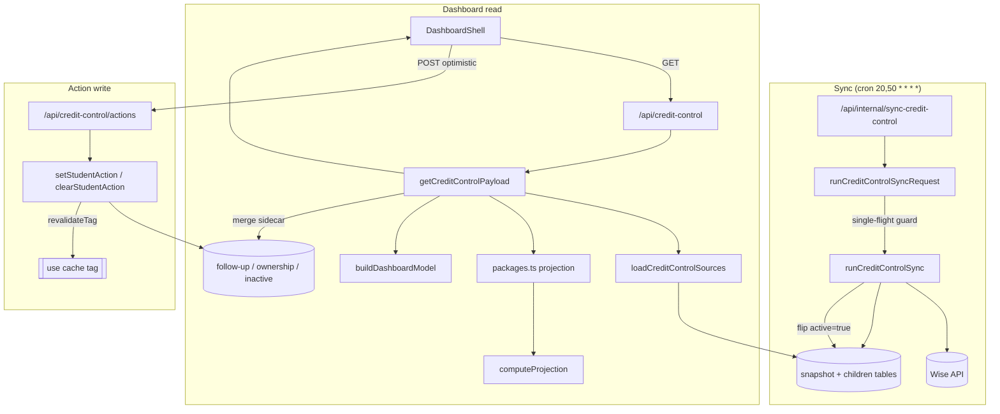

# Credit Control

**Status: stable**

## Purpose

Credit Control is the admin workspace for keeping every active student's prepaid credit balance from running out unnoticed. It pulls each student's credit packages, past sessions, and upcoming bookings out of Wise, projects when each package will fall below an alert threshold (and when it will hit zero), ranks the at-risk students into a prioritized follow-up queue, and lets admins record the outreach they've done against each student.

The primary users are the BeGifted admin/sales staff who own renewals. Each student is associated with a single owning admin so an admin can filter the dashboard down to "my students," see who needs a call today, copy a ready-made LINE message for the parent, and mark the student as `contacted` / `pending-callback` / `resolved`. The feature is read-mostly against Wise: it never writes credit data back — the only persisted state it owns is the follow-up status, the manual admin-ownership assignments, and the "this student is no longer active" suppressions.

## Conceptual data model

Credit Control uses two distinct families of tables. See the database reference ERD for the column-level detail: [docs/reference/database/erd-credit-control.md](../reference/database/erd-credit-control.md).

**Snapshot tables (machine-owned, replaced every sync).** A `credit_control_sync_runs` row tracks each sync attempt and its outcome. Each successful run writes a new `credit_control_snapshots` row plus its children — `credit_control_students`, `credit_control_packages`, `credit_control_sessions` (both past and future, distinguished by a `sessionKind` field), and `credit_control_credit_history` — then atomically flips the new snapshot to `active = true`. Exactly one snapshot is active at a time; the dashboard always reads the active snapshot's children. These tables are conceptually equivalent to the main app's snapshot model but live on a separate snapshot lineage.

**Sidecar tables (human-owned, survive across syncs).** These are keyed by a stable `studentKey` (a normalized `student-name::parent-name` string, see `buildDashboardStudentKey` in `src/lib/credit-control/helpers.ts:17`) rather than by snapshot, so they persist as snapshots are replaced:
- `credit_control_follow_up_state` — current follow-up status per student (one row per student, upserted).
- `credit_control_follow_up_log` — append-only audit trail of every status set/clear/bulk/auto-clear event.
- `credit_control_inactive_students` — students an admin has hidden as "no longer active."
- `credit_control_admin_ownership` — manual student→admin assignment overriding any source-derived ownership.

A subtle implementation detail: the read path does **not** query the snapshot child tables directly in their native shape. `loadCreditControlSources` (`src/lib/credit-control/db.ts:84`) reshapes the Postgres rows into in-memory "sheet snapshot" objects (`Aggregations`, `Credit_Control`, `Upcoming Sessions`, etc.) — a structural carry-over from a former Google Sheets data source — and the projection/analytics layer consumes those synthetic sheets. The sheet names and shapes are defined in `src/lib/credit-control/config.ts` and `src/lib/credit-control/domain.ts`.

## API surface

All in-app endpoints require an authenticated session except the internal cron route, which accepts a `CRON_SECRET` bearer token. The shared guard `requireCreditControlSession` (`src/lib/credit-control/api.ts:5-15`) only asserts the session carries an email and a name — it does **not** consult any admin allowlist itself; admin gating is enforced upstream (middleware), outside the credit-control module. Full request/response contracts live in the API reference: [docs/reference/api/credit-control.md](../reference/api/credit-control.md).

| Endpoint | Purpose |
|---|---|
| `GET /api/credit-control` | Return the full dashboard payload (summary, prioritized student queue, calendar, students) for the active snapshot. |
| `POST /api/credit-control/actions` | Set or clear a single student's follow-up status. |
| `POST /api/credit-control/actions/bulk` | Set or clear follow-up status for many students at once. |
| `GET /api/credit-control/actions/history` | Return the recent follow-up audit log for one student (last 7 days). |
| `POST /api/credit-control/admin-ownership` | Assign a student to an owning admin (or `unassigned`). |
| `POST /api/credit-control/inactive` | Mark a student as no longer active (hide from dashboard). |
| `DELETE /api/credit-control/inactive` | Un-hide a previously inactivated student. |
| `POST /api/credit-control/sync` | Admin-triggered manual sync of Wise credit data. |
| `GET` / `POST /api/internal/sync-credit-control` | Cron/manual sync entry point (CRON_SECRET, or session auth on POST). |

The internal cron route is registered in `vercel.json` to run at `20,50 * * * *` (twice hourly, staggered against the other syncs). Note the naming asymmetry: the cron path is `/api/internal/sync-credit-control` while the in-app admin trigger is `/api/credit-control/sync`; both delegate to the same `runCreditControlSyncRequest` (`src/lib/credit-control/run-sync-request.ts:138`).

## UI

- **Page**: `src/app/(app)/credit-control/page.tsx` — a server component that gates on an authenticated session (redirects to `/login` otherwise) and renders the client `DashboardShell`.
- **`DashboardShell`** (`src/components/credit-control/dashboard-shell.tsx`) — the orchestrating client component. It fetches `GET /api/credit-control` on mount and re-polls every 60s (only while the tab has focus), holds all UI state, applies optimistic updates for action changes, and wires keyboard shortcuts.
- **Key child components** (all under `src/components/credit-control/`):
  - `summary-bar.tsx` — exactly four KPI cards: "Students in queue", "Pinned students", "Notify packages", and "Pending deduction backlog" (`src/components/credit-control/summary-bar.tsx:16-31`).
  - `queue-panel.tsx` — the sortable, selectable prioritized student queue (the core worklist).
  - `calendar-panel.tsx` — month/week/day calendar of upcoming sessions, colored by student urgency.
  - `student-detail.tsx` — right-pane inspector for the selected student, with action buttons and follow-up history.
  - `bulk-action-bar.tsx` — always rendered (`src/components/credit-control/dashboard-shell.tsx:869`); it always offers a "Select all matching" button, and reveals the selection badge, clear, and bulk-action buttons only once one or more visible rows are selected.
  - `line-preview-modal.tsx` — slide-in drawer with a generated parent LINE message (`buildParentMessage`, `src/lib/credit-control/ui-helpers.ts:461`) and a "copy + mark contacted" action.
  - `toast-notification.tsx` — success/error toasts with an undo affordance for status changes.

The search box and risk-filter (all/notify/watch/ok) chips are rendered **inline** inside `DashboardShell` (`src/components/credit-control/dashboard-shell.tsx:833-867`), and admin scoping is a left rail (`workspace-rail`, `:815-828`) — there is no separate filter-toolbar component in the live tree. A `filter-toolbar.tsx` (`FilterToolbar`) file exists but is dead code: `grep -rn 'filter-toolbar\|FilterToolbar' src/` returns only its own definition (`filter-toolbar.tsx:5`) and `dashboard-shell.tsx` never imports it.

Admin scoping (the "show only my students" filter) is a pure client-side filter over the full payload, persisted to `localStorage` under `begifted-admin-view`; the API always returns all students.

## Data flow

A read (dashboard load) and a write (mark contacted) move through the layers like this:

Read path detail (`getCreditControlPayload`, `src/lib/credit-control/service.ts:27`):
1. Resolve "today" in the local sense and load the active snapshot's rows, reshaped into synthetic sheets (`loadCreditControlSources`).
2. Build the active-student set, exclusion reasons, pending-deduction context, and upcoming-session map (`src/lib/credit-control/packages.ts`).
3. Project each package's status with `computeProjection` (`src/lib/credit-control/projection.ts`).
4. Merge the human-owned sidecar data (follow-up state, admin ownership, inactive list) onto the students.
5. Rank into the queue and assemble summary/calendar via `buildDashboardModel` (`src/lib/credit-control/analytics.ts`).

The response is wrapped in Next.js `"use cache"` tagged with `CREDIT_CONTROL_CACHE_TAG` (60s revalidate). Every write action and every sync calls `revalidateTag(CREDIT_CONTROL_CACHE_TAG, { expire: 0 })` to bust it immediately.

## Business rules & edge cases

- **Alert / exhaust projection.** A package's balance is decremented session-by-session over its upcoming sessions (credits per session = duration minutes ÷ 60). The first session that drives the balance below `ALERT_THRESHOLD` (= 2 credits) sets `alertDate`; the first that drives it ≤ 0 sets `exhaustDate`. `src/lib/credit-control/projection.ts:41-62`, threshold at `src/lib/credit-control/config.ts:3`.
- **Status derivation (notify / watch / ok / nodata).** If the starting balance is already below 2 → `notify`. Else if it is projected to cross below 2 within `NOTIFY_WINDOW_DAYS` (= 30) → `watch`, otherwise `ok`. A package with no upcoming sessions and a healthy balance → `nodata`; with no upcoming sessions and a low balance → `notify` (dated today). `src/lib/credit-control/projection.ts:15-34,67-72`.
- **Pending deductions reduce the "true" balance (fail-toward-action).** A past session counts as a pending deduction when its status is `ENDED`, teacher feedback is empty/`0`, and `credits_consumed` is 0 — i.e. the session happened but Wise hasn't deducted credits yet. The package's `adjustedRemaining` subtracts these so the dashboard treats the student as more at-risk than the raw Wise balance suggests. `shouldCountAsPendingDeduction`, `src/lib/credit-control/packages.ts:207-220`.
- **Pending-deduction amount with fallback.** The deduction uses Wise's `Should_Credit` value when positive; otherwise it falls back to duration ÷ 60 and the package is flagged `pending-deduction-fallback`. `buildPendingDeductionDetail`, `src/lib/credit-control/packages.ts:222-259`.
- **Package exclusion.** Packages whose name or subject contains `pretest` or `trial` are dropped entirely (these aren't renewable credit packages). `EXCLUDED_PACKAGE_KEYWORDS` at `src/lib/credit-control/config.ts:6`; applied at sync time (`src/lib/credit-control/sync.ts:233-236`, stored as `excludedReason`) and again in the read path (`getPackageExclusionReason`, `src/lib/credit-control/packages.ts:138`).
- **Pinned students.** A student with no future schedule *and* a low/negative balance is `pinned` and forced to the top of the queue regardless of score. `src/lib/credit-control/analytics.ts:227-230,291`.
- **Priority scoring.** Both packages and students get a numeric `priorityScore` (zeroed/negative balances, days-until-alert/exhaust, pending deductions, data-quality flags, status worsening, multi-risk students all add weight). The queue sorts by score, then status, then soonest exhaust/alert. `computePriorityScore`, `src/lib/credit-control/analytics.ts:133-174`.
- **Auto-clear of recovered students (fail-safe on stale follow-up state).** On every dashboard load, any student who has a follow-up state but no remaining `notify`/`watch` package has their follow-up state deleted and an `auto-clear` log entry written under a synthetic system actor (`system@begifted.local`). This prevents resolved-then-recovered students from lingering as "contacted." `clearRecoveredActionStates`, `src/lib/credit-control/service.ts:91-118`.
- **Action status validation.** Only `contacted`, `pending-callback`, `resolved` are accepted; anything else normalizes to `null` (= clear). `normalizeStudentActionStatus`, `src/lib/credit-control/action-helpers.ts:17-24`.
- **`isToday` follow-up freshness.** Follow-up state read from the DB is always surfaced as `isToday: true` (`src/lib/credit-control/db.ts:200`), but the sanitizer recomputes `isToday` against the actual `updatedAt` date when attaching to students (`sanitizeStudentActionState`, `src/lib/credit-control/action-helpers.ts:26-40`).
- **Admin ownership resolution.** Manual assignments in `credit_control_admin_ownership` win. The named owner roster is the frozen `ADMIN_OWNER_REGISTRY` (6 admins, `src/lib/credit-control/config.ts:23-30`), but the `POST /admin-ownership` route does **not** validate against that registry directly — it accepts any key returned by `getAdminViewOptions()` (`src/lib/credit-control/config.ts:105-111`), i.e. the broader set `all` + the 6 registry keys + `unassigned`. So `all` (a view filter, not a real owner) is also an accepted `adminKey`; anything outside that set is rejected with 400 at `src/app/api/credit-control/admin-ownership/route.ts:19` (the `if` condition is at `:18`). A seeding helper (`admin-ownership-seed.ts`) can majority-vote ownership from a `RemainingCredits` admin column, but the live read path only consults the sidecar table (`src/lib/credit-control/service.ts:61-73`).
- **Sync single-flight + stale recovery.** A partial unique index (`ccsr_single_running_idx`, `src/lib/db/schema.ts`) allows only one `running` sync row. Before acquiring, runs older than 20 minutes still marked `running` are force-failed; if one is genuinely running, the request returns `202` skipped. A `23505` unique-violation on insert is treated as "someone else is running." `src/lib/credit-control/run-sync-request.ts:9,41-136`. Both sync entry points run with `maxDuration = 300` (`src/app/api/credit-control/sync/route.ts:4`, `src/app/api/internal/sync-credit-control/route.ts:7`).
- **Atomic promotion + failure preservation.** The new snapshot is inserted with `active = false`, all child rows are inserted in 100-row chunks, then a single `UPDATE` sets `active = (id = newSnapshot)`, flipping the new one on and all others off atomically. A failure during insert leaves the previous active snapshot untouched and records a structured `errorSummary` (DB code/constraint/detail extracted from nested causes, capped at 2000 chars). `src/lib/credit-control/sync.ts:510-600`, `serializeCreditControlSyncError` at `:179`.
- **Per-pair credit-fetch resilience.** Each student×class credit lookup is fetched with bounded concurrency; individual failures increment a `failedCreditPairs` counter and that pair is dropped rather than aborting the whole sync. `src/lib/credit-control/sync.ts:343-362`.
- **Teacher-feedback fetch is targeted.** Feedback is only fetched for `ENDED` past sessions that don't already have a positive credit-history match, to limit API calls. `src/lib/credit-control/sync.ts:398-416`.

## Tests

Tests live in `src/lib/credit-control/__tests__/`:
- `sync.test.ts` — covers the sync orchestrator: 100-row chunking, snapshot-id linkage ordering, dedupe of duplicate Wise session/student rows, failed-run traceability to the candidate snapshot, and the structured error serializer (`serializeCreditControlSyncError`) including nested DB-error field extraction and message truncation.
- `wise.test.ts` — covers (a) the Wise fetchers: student pagination with parent data, session date-window splitting (31-day windows), per-student credit + history parsing; and (b) business rules in `packages.ts`: Pretest/Trial exclusion, the duration fallback for ended-no-credit sessions, "project only future non-excluded sessions," and the RemainingCredits admin majority-vote + first-row tie-break.

A dedicated test file does cover the cron route's auth/validation: `src/app/api/internal/sync-credit-control/__tests__/route.test.ts:70-155` directly exercises `GET`/`POST /api/internal/sync-credit-control` — valid cron secret → 200, GET without the secret → 401, missing `CRON_SECRET` → 500, a signed-in admin POST → 200, and an already-running sync → 202 skipped.

There is, however, no dedicated test for the projection/analytics scoring math, the service-layer auto-clear behavior (`clearRecoveredActionStates`), or the in-app `/api/credit-control/*` route handlers (auth/validation on those routes is exercised only indirectly, if at all).

## Open questions

- **Snapshot-diff / history machinery appears inert.** `analytics.ts` contains a full apparatus for cross-snapshot deltas, status-change labels, weekly buckets, and a rolling history (`buildSummaryDeltas`, `updateHistory`, `buildWeeklyBuckets`, `buildSnapshotForPersistence`, `HISTORY_LIMIT`). But the only caller, `getCreditControlPayload` (`src/lib/credit-control/service.ts:83`), always passes `{ lastSnapshot: null, history: [] }` and discards the returned `snapshotState`. The result: all `deltas` come back `null`, `previousUpdatedAt` is always `null`, and `statusChange` is always `"new"`. Is the previous-snapshot comparison intended to be wired up (persisted between requests) and currently unfinished, or is this dead code to remove?
- **Legacy "sheet snapshot" indirection.** `db.ts` rebuilds Postgres rows into synthetic Google-Sheets-shaped objects (`Aggregations`, `Credit_Control`, etc.) that the rest of the pipeline parses by column name. AGENTS.md states there is "no production fallback to Google Sheets." Is keeping this sheet-shaped intermediate intentional (to preserve the projection code unchanged), or is a direct row→model refactor desired? Confirm no live sheet ingestion path remains.
- **Admin roster vs. allowlist divergence.** The follow-up "owning admin" roster (`ADMIN_OWNER_REGISTRY`, 6 named admins) is a separate hardcoded list from the auth allowlist. Should owners be derived from a single source of truth instead of two hardcoded lists?
- **`isToday` is hardcoded `true` at the DB layer** (`db.ts:200`) before being recomputed downstream. This is harmless given the sanitizer, but is the DB-layer value meant to be meaningful to any other consumer, or should it be dropped to avoid the misleading literal?

_Verified against HEAD `d4fe6d3` on 2026-06-05._
