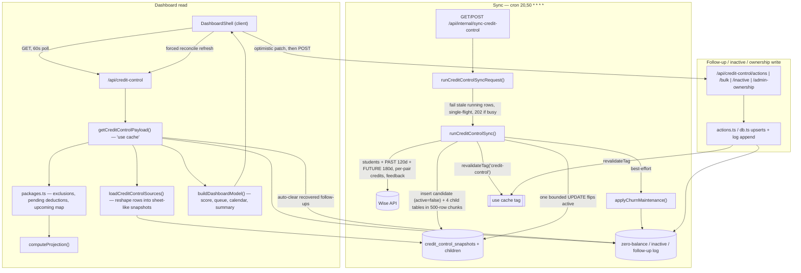

# Credit Control

**Status: stable** — cron-scheduled (`vercel.json:16-19`, `20,50 * * * *`), page → API → sync path fully wired, nine test files, registry and route agree on `maxDuration = 800`. The badge is applied from the documentation program's maturity map; there is no maturity marker in code.

## Purpose

> **Balance freshness (CRED-01, 2026-09-04).** The sync no longer refetches every
> (class, student) pair from Wise on every run. A pair is always refetched when it
> is new, when its balance sits at or near the alert band, when one of its
> sessions has ended since the last observation, or when the last observation is
> older than `CREDIT_REFRESH_MAX_AGE_MINUTES` (default 180). Everything else is
> carried forward with its original `credits_observed_at`.
>
> The safety argument: credits fall only through attendance, which forces a
> refetch, so a carried balance can only *under*-state — and under-stating keeps a
> student in the follow-up queue rather than dropping them out of it. The
> unguarded case is a top-up or a manual adjustment made inside Wise, which has no
> signal at all; that is bounded by the max-age. Because low-balance pairs are
> never reused, every balance the dashboard ranks or the LINE `/credit` bot quotes
> is still at most 30 minutes old.

Credit Control keeps a student's prepaid class credits from running out unnoticed. Twice an hour a sync pulls every student the institute returns, their per-class credit packages, their past sessions and their future bookings out of Wise into a fresh Postgres snapshot. The read path then walks each package's balance forward session by session to find the day it drops below the two-credit alert threshold and the day it hits zero, ranks the at-risk students into a prioritized worklist, and lets an admin record the outreach they did.

The users are the BeGifted admin/sales staff who own renewals — the six named owners in `ADMIN_OWNER_REGISTRY` (`src/lib/credit-control/config.ts:28-35`). Each student can be assigned to one owning admin, so a staff member can scope the dashboard to "my students", see who needs a call today, copy a ready-made Thai LINE message for the parent (`ui-helpers.ts:463-507`), and mark the student `contacted` / `pending-callback` / `resolved`. The feature is **read-only toward Wise**: every Wise call in `src/lib/credit-control/wise.ts` is a `client.get(...)` (`wise.ts:152`, `:176`, `:237`, `:269`, `:281`); nothing is written back.

The state the feature owns is the snapshot-independent sidecar: follow-up status, an append-only follow-up log, admin ownership, "no longer active" suppressions, and the zero-balance streak that drives auto-churn. Most of it is human-written, but the churn tables belong to the sync — `credit_control_zero_balance_tracking` has no human write path (its only writer and deleter are `sync.ts:556-576` and `:634-638`), and the sync also writes `auto-churn` rows into the inactive table and `auto-remove` / `auto-reactivate` log entries under the synthetic actor `system@begifted.local` (`sync.ts:578-628`, actor at `config.ts:18-19`).

One thing to know up front: the credit-control snapshot tables have outgrown this page. They are the de-facto institute-wide student/session store that eleven other modules read directly — `src/lib/student-schedule/data.ts`, `src/lib/student-report/db.ts`, `src/lib/progress-tests/db.ts`, `src/lib/post-class-feedback/repository.ts`, `src/lib/line/credit-bot.ts`, `src/lib/line/credit-digest.ts`, `src/lib/line/operational.ts`, `src/lib/line/student-links.ts`, `src/lib/leave-requests/data.ts`, `src/lib/wise-activity/reconciliation.ts`, and `src/lib/student-promotions/data.ts` all select from `creditControlSessions` / `creditControlPackages` / `creditControlSnapshots`. The Wise fetchers are shared too: [Student Schedule](student-schedule.md) reuses `fetchInstituteSessionsForDays` and `creditSessionTeacher` (`src/lib/student-schedule/live.ts:17`, `data.ts:31-35`), and the [Parent Report](student-report.md) borrows `PAST_WINDOW_DAYS` / `FUTURE_WINDOW_DAYS` as its queryable floor and ceiling (`src/lib/student-report/window.ts:2-5`). A regression in this sync is a multi-feature outage, not a single-page one.

## Conceptual data model

Eleven tables in two families, all declared in the `── Credit Control ──` block of `src/lib/db/schema.ts` (`:1148-1342`). Column-level detail, indexes and the ER diagram live in the database reference: [docs/reference/database/erd-credit-control.md](../reference/database/erd-credit-control.md) (table inventory in [index.md](../reference/database/index.md)).

**Snapshot family — machine-owned, re-derived wholesale every sync.** Its own snapshot lineage, entirely separate from the tutor-scheduling `snapshots` table. Nothing is overwritten in place: each run inserts a brand-new snapshot id plus fresh child rows, then flips `active` with one bounded `UPDATE` (`sync.ts:668-685`, `:707-721`). Every prior snapshot and all of its rows stay in the database.

- `credit_control_sync_runs` (`schema.ts:1162`) — one row per sync attempt with status, counts, `errorSummary`, and a `metadata` blob that records fetch diagnostics plus, since EFF-00, the Wise call count and top paths for that run (`sync.ts:741-748`). A partial unique index permits only one `running` row table-wide (`schema.ts:1177-1179`). That index is the race backstop, not the guard itself — see [Sync resilience](#sync-resilience).
- `credit_control_snapshots` (`schema.ts:1150`) — the immutable point-in-time header; exactly one row carries `active = true`. Its `metadata` records the fetch windows, raw counts and `failedCreditPairs` (`sync.ts:674-682`).
- `credit_control_students` (`schema.ts:1182`) — every student Wise returns for the institute, with the derived `studentKey`. `fetchCreditStudents` pages `/institutes/v3/{id}/students` with `showParents: "true"` and no activation filter (`wise.ts:146-163`), and `buildStudentsRows` persists all of them, writing `activated` as data rather than treating it as a gate (`sync.ts:311-327`).
- `credit_control_packages` (`schema.ts:1197`) — one row per (class × student) pair: total / consumed / remaining / available credits from Wise's `sessionCredits` endpoint plus an `excludedReason` stamped at sync time (`sync.ts:329-355`).
- `credit_control_sessions` (`schema.ts:1222`) — past *and* future sessions in one table, separated by `sessionKind`, carrying the Wise title, duration, meeting status, applied credit, teacher feedback (past only), and the teaching identity as Wise reports it — nullable, so an unresolved teacher renders "Teacher TBC" downstream instead of being guessed (`wise.ts:124-144`, `schema.ts:1243-1248`).
- `credit_control_credit_history` (`schema.ts:1264`) — the raw per-pair credit ledger from Wise, including the untouched `raw` payload (`sync.ts:389-410`).

**Sidecar family — snapshot-independent.** These rows survive snapshot rotation because they are keyed by `studentKey`, a normalized `student-name::parent-name` string built by `buildDashboardStudentKey` (`helpers.ts:17-22`), not by a snapshot id. Nothing joins them to a snapshot by foreign key.

- `credit_control_follow_up_state` (`schema.ts:1283`) — the current follow-up status, one upserted row per student.
- `credit_control_follow_up_log` (`schema.ts:1295`) — append-only audit trail. `actionType` is free text; the values written today are `set` / `clear` / `bulk-set` / `bulk-clear` (`actions.ts:74`, `:88`, `:110`, `:126`), `auto-clear` from the read path (`service.ts:129`), and `auto-remove` / `auto-reactivate` from the sync (`sync.ts:604`, `:622`).
- `credit_control_inactive_students` (`schema.ts:1310`) — students hidden from the worklist, with `source` and the balance they were removed at. `manual` rows come from the admin's "No Longer Active" click (`src/app/api/credit-control/inactive/route.ts:25-32`); `auto-churn` rows from the sync (`sync.ts:578-599`); and a third value, `student-promotion-graduation`, is written by [Student Promotions](student-promotions.md) when a graduate is dispositioned inactive (`src/lib/student-promotions/data.ts:2253-2260`).
- `credit_control_zero_balance_tracking` (`schema.ts:1325`) — how long each student has continuously held ≤ 0 credits; the input to the auto-churn timer. Machine-only.
- `credit_control_admin_ownership` (`schema.ts:1334`) — the student → owning-admin assignment. On read it is merged onto the payload with `adminOwnershipSource: "postgres-sidecar"` (`db.ts:290-310`, `service.ts:70-76`).

Retention: no code path deletes credit-control snapshot rows — the only credit-control deletes in the repo target sidecar rows (`db.ts:231-235`, `:284-288`, `sync.ts:613-615`, `:634-638`). A schema comment written to justify *not* adding an index quotes production at 67.8M session rows / 39GB across 3,367 retained snapshots (`schema.ts:1255-1261`). That number is reproduced here only as a quotation of the comment: it is undated, nothing in the repo can confirm it, and whatever the true figure is, it grows with every sync.

## API surface

Eight admin endpoints under `/api/credit-control` plus one internal cron route. Full request/response contracts, status codes and the no-Zod caveats: [docs/reference/api/credit-control.md](../reference/api/credit-control.md); the cron route is in [docs/reference/api/internal-crons.md](../reference/api/internal-crons.md#credit-control-sync).

| Endpoint | Purpose |
|---|---|
| `GET /api/credit-control` | Build and return the whole dashboard payload for the active snapshot. |
| `POST /api/credit-control/actions` | Set or clear one student's follow-up status. |
| `POST /api/credit-control/actions/bulk` | Set or clear follow-up status for many students at once. |
| `GET /api/credit-control/actions/history` | Last 7 days of follow-up log entries for one student. |
| `POST /api/credit-control/admin-ownership` | Assign a student to an owning admin. |
| `POST /api/credit-control/inactive` | Hide a student from the worklist ("No Longer Active"), recording the balance at removal. |
| `DELETE /api/credit-control/inactive` | Restore a hidden student. |
| `POST /api/credit-control/sync` | Session-triggered Wise resync — capped at `maxDuration = 300` (`sync/route.ts:4`). |
| `GET`, `POST /api/internal/sync-credit-control` | Cron entry point (`CRON_SECRET`; `POST` also accepts a session), `maxDuration = 800` (`internal/sync-credit-control/route.ts:14`). |

Every admin handler calls `requireCreditControlSession()` (`src/lib/credit-control/api.ts:5-15`), which asserts only that the session carries an email — the actor `name` falls back to the email when the session has no display name (`api.ts:8`), so the `!email || !name` check at `:10` can fail only on a missing email. The page is stricter and requires both (`src/app/(app)/credit-control/page.tsx:8`). Page-level gating happens upstream in `src/middleware.ts`, which matches a restricted user's `allowedPages` against both `/credit-control` and `/api/credit-control` (`middleware.ts:36-67`). Errors funnel through one envelope, `creditControlErrorResponse` (`api.ts:17-36`).

**Three callers, one body.** Every sync entry point funnels into `runCreditControlSyncRequest()` (`run-sync-request.ts:138-160`); what differs is auditing and the time budget:

- `GET`/`POST /api/internal/sync-credit-control` wraps the call in `withCronInvocationAudit` under job key `credit_control` — `triggerSource: "cron"` for a valid secret, `"admin"` for the `POST` session fallback (`route.ts:36-56`). Its 800s ceiling carries a comment (`route.ts:7-13`) stating that successful runs took 372-390s and that the old 300s ceiling produced recurring `Task timed out` failures from 2026-06-16 which stranded the `running` row. That duration is the comment's own measurement — the repo holds no artifact behind it, and how long a run takes today cannot be established here. (The same comment says a watchdog fails the stranded row after 30 minutes; the only in-code recovery is the 20-minute sweep in `run-sync-request.ts:9-12`, and Data Health only *reads* `credit_control_sync_runs`, `src/lib/data-health/dashboard.ts:774`.) The Data Health registry mirrors 800 (`src/lib/data-health/cron-registry.ts:119-122`).
- The Data Health "run job" button calls `runCreditControlSyncRequest()` directly under its own audit wrapper (`src/lib/data-health/run-job.ts:100-102`).
- `POST /api/credit-control/sync` calls it with no audit wrapper and the older 300s ceiling (`sync/route.ts:4-13`). If runs still take as long as the internal route's comment says, a manual sync through this route exceeds its own `maxDuration`; whether the platform then kills it, and what happens to its `running` row, is runtime behaviour the repo cannot attest. What the code does guarantee is the recovery path: a `running` row older than 20 minutes is force-failed by `failStaleRunningSyncs` (`run-sync-request.ts:9-12`, `:50-68`), and that sweep fires only at the start of the next sync attempt, not on a timer. No `fetch()` in `src/` targets this route or `/api/credit-control/admin-ownership` — see [Open questions](#open-questions).

The daily LINE credit digest (`/api/internal/line-credit-digest`, `3 2 * * *`, `vercel.json:68-71`) is registered under `feature: "Credit Control"` (`cron-registry.ts:339-353`) and reuses `computeProjection` and `bulkGetCreditAdminOwnership` (`src/lib/line/credit-digest.ts:38-39`), but its behaviour is documented with the [LINE credit bot](line-credit-bot.md).

## UI

**Page** — `src/app/(app)/credit-control/page.tsx`: a thin async Server Component that requires a session with an email and a name, redirects to `/login` otherwise (`:6-10`), and renders the client shell inside `<Suspense fallback={null}>` (`:22-28`). No server-side data fetch — the shell fetches on mount.

**`DashboardShell`** (`src/components/credit-control/dashboard-shell.tsx`) is the orchestrator: it fetches `GET /api/credit-control` on mount and re-polls every 60s while the tab has focus (`:121-187`), owns every piece of UI state, applies optimistic patches, and wires the keyboard shortcuts. Layout is a three-column workspace — an admin rail on the left (`:971-984`), a resizable queue/calendar split in the middle (`:1039-1087`, ratio persisted by `useResizableSplit`), and a student inspector on the right (`:1091-1101`). Styling is a dedicated stylesheet, `src/app/credit-control.css` (imported from `globals.css:4`), with plain class names rather than Tailwind utilities.

Children, all under `src/components/credit-control/`:

- `summary-bar.tsx` — four KPI cards: students in queue (with an "N of M actioned today" progress bar), pinned students, notify packages, pending-deduction backlog (`:16-31`). Counts are admin-scoped client-side via `buildAdminScopedSummary` (`ui-helpers.ts:70-149`).
- `queue-panel.tsx` — the worklist. Mounts *either* a desktop table *or*, at `max-width: 1024px`, a card list (`useCompactLayout`, `:26-51`) — never both. Sortable headers with `aria-sort`, per-row checkboxes and inline action buttons, a "Hide worked" toggle persisted in `localStorage` (`:103-114`), and slice windowing that mounts 60 rows and grows by 60 through an `IntersectionObserver` sentinel or a keyboard-accessible load-more button (`:128-207`; pure math in `src/lib/credit-control/queue-window.ts`).
- `calendar-panel.tsx` — a strip of upcoming "next urgent" and "next scheduled" days with Today / Next urgent / Next scheduled jumps (`:71-78`, `:91-112`), and an optional month/week/day grid behind a "Show grid" toggle (`:55`, `:86`). Day tints follow the urgency of the students booked that day (`ui-helpers.ts:220-232`).
- `student-detail.tsx` — the inspector: a sticky header with the action row (Contact via LINE combo, Contacted / Pending / Resolved / Clear, and the destructive "No Longer Active" behind a confirm dialog, `:118-179`), per-package tabs defaulting to the lowest-balance package (`:45-51`), a "What to do now" block (`:219-223`), the credit waterfall (`:260`), a five-row projection table (`:270-281`), and collapsible Recent Activity and Upcoming Sessions sections (`:306-348`).
- `bulk-action-bar.tsx` — bulk Contacted / Pending callback / Resolved, plus Clear behind a `window.confirm` (`:44-75`).
- `line-preview-modal.tsx` — the LINE drawer with "Copy + Mark Contacted" and "Copy message" (`:47-59`).
- `toast-notification.tsx` — success/error toasts with an Undo affordance (`:18-22`).
- `filter-toolbar.tsx` — an older two-row admin/risk toolbar. It has no importer anywhere in `src/`; the shell renders its own merged filter bar instead (`dashboard-shell.tsx:989-1023`).

Keyboard-first by design: `j`/`k` to move, `c`/`p`/`r` to mark, `l` for the LINE drawer, `Shift+L` for copy + mark contacted + advance, `/` or `s` to focus search, `?` for help (`src/hooks/use-keyboard-shortcuts.ts:79-88`, wired at `dashboard-shell.tsx:825-868`).

Admin scoping, the risk filter (all / notify / watch / ok) and search are pure client-side filters over the payload (`dashboard-shell.tsx:205-243`). The chosen admin view is persisted to `localStorage` under `begifted-admin-view` (`:62-69`). While a search is active the worklist widens from `studentQueue` (at-risk only) to `studentQueueAll` (every active student) so any student is reachable by name (`:229-243`; payload contract at `src/types/credit-control.ts:230-235`). A "Removed N" chip opens a modal listing hidden students with per-row Restore (`:922-932`, `:1151-1200`).

**Optimistic writes.** Every action patches the in-memory payload first (`payload-patch.ts:44-62`) and records the patch with a timestamp; a refresh whose `GET` was dispatched *before* the patch re-applies it so a confirmed pill never flickers back (`mergeLocalActionPatches`, `payload-patch.ts:73-87`, used at `dashboard-shell.tsx:153`). Refreshes are sequenced — a superseded response is dropped and its request aborted (`:109-116`, `:133-149`). Mark-inactive removes the student from both queue lists immediately but deliberately leaves `students` and `calendar` untouched, because calendar entries address students by index (`payload-patch.ts:120-143`); a forced background refresh then reconciles (`dashboard-shell.tsx:517`).

## Data flow

```mermaid
flowchart TD
  subgraph Sync["Sync — cron 20,50 * * * *"]
    Cron["GET/POST /api/internal/sync-credit-control"] --> RSR["runCreditControlSyncRequest()"]
    RSR -->|"fail stale running rows, single-flight, 202 if busy"| RCS["runCreditControlSync()"]
    RCS -->|"students + PAST 120d + FUTURE 180d, per-pair credits, feedback"| WISE[("Wise API")]
    RCS -->|"insert candidate (active=false) + 4 child tables in 500-row chunks"| SNAP[("credit_control_snapshots + children")]
    RCS -->|"one bounded UPDATE flips active"| SNAP
    RCS -->|"best-effort"| CHURN["applyChurnMaintenance()"]
    CHURN --> SIDE[("zero-balance / inactive / follow-up log")]
    RCS -->|"revalidateTag('credit-control')"| CACHE[["use cache tag"]]
  end

  subgraph Read["Dashboard read"]
    Shell["DashboardShell (client)"] -->|"GET, 60s poll"| RT1["/api/credit-control"]
    RT1 --> SVC["getCreditControlPayload() — 'use cache'"]
    SVC --> LOAD["loadCreditControlSources() — reshape rows into sheet-like snapshots"]
    LOAD --> SNAP
    SVC --> PKG["packages.ts — exclusions, pending deductions, upcoming map"]
    PKG --> PROJ["computeProjection()"]
    SVC --> SIDE
    SVC -->|"auto-clear recovered follow-ups"| SIDE
    SVC --> AN["buildDashboardModel() — score, queue, calendar, summary"]
    AN --> Shell
  end

  subgraph Write["Follow-up / inactive / ownership write"]
    Shell -->|"optimistic patch, then POST"| RT2["/api/credit-control/actions | /bulk | /inactive | /admin-ownership"]
    RT2 --> ACT["actions.ts / db.ts upserts + log append"]
    ACT --> SIDE
    ACT -->|revalidateTag| CACHE
    Shell -->|"forced reconcile refresh"| RT1
  end
```

**Sync** (`src/lib/credit-control/sync.ts:641-783`). Fetch students, PAST sessions (120 days back) and FUTURE sessions (180 days forward) in parallel (`:657-663`, windows at `:61-63`; Wise paging in 31-day, 100-row windows at `wise.ts:4-5`, `:165-191`). Derive the (class × student) pair set from two sources — activated students' `classrooms` and the sessions themselves (`collectPairs`, `:261-309`); the `activated` flag gates only the classroom-derived half (`:287`), while a session-derived pair is added for any fetched student (`:299-306`). Fetch per-pair credits with concurrency 15 to saturate the Wise client's own limiter (`:64-66`, `:357-376`); a failed pair is counted, not fatal (`:367-370`). Insert a candidate snapshot with `active = false` (`:668-685`) and link it to the run row (`:687-690`). Build student / package / session / history rows — for `ENDED` past sessions with no positive credit-history match, fetch the teacher feedback text at concurrency 6 (`:412-430`), and dedupe by `wiseSessionId|wiseStudentId` (`:433-443`). Insert in 500-row chunks, each wrapped so a failure names the table, chunk and row range (`:478-500`, `CreditControlInsertError`). Promote with a single `UPDATE ... SET active = (id = candidate) WHERE active OR id = candidate` (`:707-721`, REL-01). Run churn maintenance best-effort (`:723-728`). Mark the run `success` with counts and Wise call stats (`:730-750`) and `revalidateTag(CREDIT_CONTROL_CACHE_TAG, { expire: 0 })` (`:752`). On any throw, the run is marked `failed` with a truncated `errorSummary` and a serialized error tree merged into `metadata`, and the function *returns* `success: false` rather than rethrowing (`:762-782`).

**Read** (`src/lib/credit-control/service.ts:27-107`). Load the active snapshot's students, packages and sessions and reshape them into in-memory `SheetSnapshot` objects that keep the column names of the retired Google-Sheets source (`db.ts:88-194`; `Should_Credit` is always written as `""` at `:132` and the `RemainingCredits` ownership sheet is always empty at `:191`). Build the active-student set, the exclusion map, the pending-deduction context and the upcoming-session map (`packages.ts`), project each package (`projection.ts`), then merge the sidecar tables — follow-up state, inactive list, admin ownership — with `Promise.all` (`service.ts:64-68`). Auto-clear recovered follow-ups (`:79-81`), drop inactive students from the model input (`:83-86`), and assemble queue / calendar / summary (`analytics.ts:30-71`). The whole function is a Next.js `"use cache"` unit tagged `credit-control` with `stale: 60, revalidate: 60, expire: 300` (`service.ts:31-33`). The home hub's badge calls the same function with `clearRecoveredActionStates: false`, which is a distinct cache key (`src/lib/home/summary.ts:178-179`).

**Write.** Each route resolves the student against the cached payload (so an unknown key is a 404 — `actions/route.ts:17-21`, `inactive/route.ts:16-20`), performs its upsert/delete plus a log append in `actions.ts` / `db.ts`, and ends with `revalidateTag(CREDIT_CONTROL_CACHE_TAG, { expire: 0 })` (`actions.ts:79`, `:93`, `:116`, `:132`, `:137`, `:142`; `admin-ownership/route.ts:27`). Neon HTTP has no transactions, so bulk writes fan out with `Promise.all` and a partial failure can leave some students updated while the request reports 500 (`actions.ts:96-133`).

## Business rules & edge cases

### Projection and status

- A package's balance is walked down session by session at one credit per 60 minutes, rounded to hundredths. The first session that pushes it below `ALERT_THRESHOLD` (2) sets `alertDate`; the first that pushes it to ≤ 0 sets `exhaustDate` (`projection.ts:41-62`, threshold at `config.ts:3`).
- Status: starting balance already below 2 → `notify`; else crossing below 2 within `NOTIFY_WINDOW_DAYS` (30) → `watch`; else `ok` (`projection.ts:67-72`, `config.ts:4`). With no upcoming sessions: low balance → `notify` dated today (exhausted → `exhaustDate` today too), healthy balance → `nodata` (`projection.ts:15-35`). `nodata` means "cannot project", never "fine" — it still earns 28 priority points (`analytics.ts:146`).
- Only sessions strictly after today with Wise status `UPCOMING` feed the projection (`packages.ts:282-285`). Cancelled future sessions therefore never consume projected credit.
- A student's status is the worst of their packages, `notify` > `watch` > `ok` > `nodata` (`projection.ts:84-89`, order at `config.ts:7`).

### Pending deductions — deliberately pessimistic

- A past session counts as a pending deduction when its status is `ENDED`, teacher feedback is empty or `"0"`, *and* credits consumed is 0 — the class happened but Wise has not yet deducted for it (`packages.ts:212-225`). `adjustedRemaining = max(0, currentRemaining - pendingDeduction)` (`packages.ts:328`), so the dashboard always treats the student as at least as at-risk as Wise's raw balance says. Only sessions dated today or earlier qualify (`packages.ts:175`).
- The deduction amount prefers a positive `Should_Credit`, falling back to duration ÷ 60 rounded to tenths and flagging `pending-deduction-fallback` (`packages.ts:237-243`, `:261-262`). Because the Postgres-backed loader always writes `Should_Credit` as `""` (`db.ts:132`), the fallback branch is the one that runs in production and the flag fires on every pending deduction.

### Exclusions and de-duplication

- Any package whose name or subject contains `pretest` or `trial` is not a renewable credit package and is dropped (`config.ts:6`). This is applied twice: stamped as `excludedReason` at sync time (`sync.ts:247-250`, `:352`) and re-derived on read (`packages.ts:143-154`). The read-path map is keyed by *package name*; an in-code note records that keying it by subject was the bug that let Pretest packages leak through (`packages.ts:51-55`).
- A student is "active" only if they hold at least one non-excluded package (`db.ts:112`, `:146-149` → `packages.ts:30-44`). Students with only Pretest/Trial packages never enter the model.
- Duplicate rows for the same student + package name are merged, keeping the row with the larger `totalCredits` and bumping `duplicateCount` so the `duplicate-source-rows` flag fires (`packages.ts:581-597`, `:445-447`).

### Queue ranking

- `pinned` = no future schedule *and* (adjusted total below 2 or current total ≤ 0). Pinned students sort above everything regardless of score (`analytics.ts:231-235`, `:296`).
- Queue membership = pinned or at least one `notify`/`watch` package (`analytics.ts:235`); `studentQueueAll` keeps everyone with `includeInQueue` preserved so search can still reach healthy students (`analytics.ts:208-216`).
- `computePriorityScore` (`analytics.ts:135-176`) weights exhausted balance (140), notify (120), watch (80), nodata (28), then adds urgency for near alert/exhaust dates, pending deductions, data-quality flags, status worsening and negative balance deltas, and +10 for a student with more than one risky package. The student row adds pinned (+90), no-schedule (+18), zero-or-negative current total (+22), risky-package count and pending-deduction bonuses on top of the max package score (`analytics.ts:236-244`).
- The "worsened / improved / balance delta" machinery compares against a previous persisted snapshot, but the service always passes `{ lastSnapshot: null, history: [] }` (`service.ts:88-93`), so every package is `statusChange: "new"`, every `balanceDelta` is `null`, `previousUpdatedAt` is `null`, and all eight `summary.deltas` fields are `null` (`analytics.ts:111-113`, `:567-582`). See [Open questions](#open-questions).
- Recommended actions and "why now" text are rule tables, not free text (`packages.ts:508-545` per package, `analytics.ts:449-493` per student).

### Churn lifecycle (pure state machine in `churn.ts`, applied at sync time only)

- Balances roll up per student across non-excluded packages (`churn.ts:56-73`).
- A student continuously at ≤ 0 credits for `CHURN_INACTIVITY_DAYS` (45, `config.ts:16`) is auto-removed: an `auto-churn` row in `credit_control_inactive_students` plus an `auto-remove` log entry under the synthetic actor (`churn.ts:123-141`, `sync.ts:578-609`). The streak starts at the first sync that observes ≤ 0 (`churn.ts:124`) and is cleared the moment the student recovers above zero (`churn.ts:142-144`).
- Reactivation floor is `max(removedAtRemaining, 0)`: an auto-churned student (removed at ≤ 0) rejoins on any positive balance, while a manually removed student who still held credits only rejoins once they *exceed* that prior balance (`churn.ts:113-117`). The manual route records the balance for exactly this reason (`inactive/route.ts:22-32`); the graduation path writes `removedAtRemaining: null`, so a graduate rejoins on any positive balance (`student-promotions/data.ts:2259`).
- Write ordering is defensive: inactive rows and log entries are written first and zero-tracking rows cleared *last*, so a partial failure re-processes the student on the next sync instead of silently resetting their streak — Neon HTTP has no transactions (`sync.ts:630-638`).
- Churn maintenance is best-effort; its errors are logged and swallowed so they can never roll back a promoted snapshot (`sync.ts:723-728`).
- Restoring a student via `DELETE /api/credit-control/inactive` deletes the row without touching tracking, so the 45-day rule can remove them again on a later sync if they are still at ≤ 0 (`db.ts:284-288`).

### Follow-up state

- Three statuses only — `contacted`, `pending-callback`, `resolved` (`action-helpers.ts:17-24`). The single-student route treats any unrecognised `status` as a clear (`actions/route.ts:23-31`); the bulk route rejects it with 400 unless it is exactly `null` or `""` (`actions/bulk/route.ts:19-23`).
- **Auto-clear on recovery.** Inside the cached read, any student who has a follow-up state but no package left in `notify`/`watch` has that state deleted and an `auto-clear` log row appended (`service.ts:109-136`). This is a write performed by a `GET`. The home hub opts out (`summary.ts:179`).
- `isToday` on an action state is recomputed on every read against the server's "today" (`action-helpers.ts:26-55`); it drives the "N of M actioned today" progress bar (`summary-bar.tsx:12-23`).
- The Recent Activity panel shows the last 7 days of log rows, newest first, with no row cap (`actions/history/route.ts:15`, `db.ts:237-252`). The client caches history per student and invalidates on write (`dashboard-shell.tsx:88`, `:362-373`, `:422`).

### Admin ownership

- The six owners and their full Wise/sheet names are a frozen registry (`config.ts:28-35`); the view keys are typed as `AdminViewKey` (`types/credit-control.ts:3-11`). Assignment is validated against `getAdminViewOptions()`, which includes the `all` pseudo-view (`admin-ownership/route.ts:18-20`, `config.ts:110-116`).
- The read path passes an empty ownership map into the model (`service.ts:60`) and then overlays the Postgres sidecar (`service.ts:70-76`); students with no row stay `unassigned` (`packages.ts:554-563`). The sheet-based majority-vote resolver (`packages.ts:67-113`) survives only as the engine behind the one-off seed script `npm run credit-control:seed-admin-ownership` (`package.json:19`, `scripts/seed-credit-control-admin-ownership.ts`, `admin-ownership-seed.ts:33-88`), which requires an active snapshot and skips students that resolve to `unassigned`.

### Sync resilience

- **Single flight.** `acquireSyncRun` first force-fails any `running` row older than 20 minutes (`run-sync-request.ts:9-12`, `:50-68`), then skips with HTTP 202 if a `running` row remains (`:111-115`, `:145-147`), then inserts its own row. The partial unique index turns a lost race into Postgres `23505`, which is treated as "already running", not an error (`:41-48`, `:124-135`).
- **Fail-isolated fetches.** A failed per-pair credit fetch or teacher-feedback fetch is counted or blanked, never fatal (`sync.ts:367-370`, `:423-429`); the count lands in snapshot and run metadata as `failedCreditPairs`.
- **Failed runs never promote.** Promotion is the last write before churn; any throw before it leaves the previous active snapshot in place, and the run row keeps `snapshotId` so the orphaned candidate is traceable (`sync.ts:687-690`, `:762-772`).
- **Institute id fallback.** `runCreditControlSyncRequest` reads `WISE_INSTITUTE_ID` from `process.env` with a hard-coded fallback to the production institute id (`run-sync-request.ts:141`), bypassing the centralized `src/lib/env.ts` schema.

### Timezone

- `formatDateTime` and `formatShortTimestamp` pin `Asia/Bangkok` (`helpers.ts:66-97`), but `getTodayDate`, `parseDate` and `formatDate` use the process-local calendar (`helpers.ts:40-64`). The read path's `today` — which decides pending-deduction eligibility, projection dates and `isToday` — therefore follows the server's local timezone rather than Bangkok explicitly (`service.ts:28`, `:35`). See [Open questions](#open-questions).

## Tests

Nine test files, all Vitest unit tests (no integration suites). Run with `npm test`.

**`src/lib/credit-control/__tests__/`** (7 files):

- `sync.test.ts` — `runCreditControlSync` against a recording fake DB: 500-row chunking, candidate snapshot id attached to the run before child inserts, bounded promotion `UPDATE`, Wise call count recorded in run metadata, trimmed session title persistence, session/student row de-duplication, failed runs staying traceable to the candidate snapshot; plus `serializeCreditControlSyncError` capturing insert context, nested causes, DB fields and message caps.
- `wise.test.ts` — the Wise fetchers (student paging with `showParents`, date-window paging, long-range window splitting, per-pair credit parsing), `fetchInstituteSessionsForDays` PAST/FUTURE/BOTH day classification and paging, and the business rules: Pretest/Trial exclusion by name and by subject, duration fallback for pending deductions, upcoming-only projection input, and the RemainingCredits majority vote with first-row tie-break.
- `wise-teacher.test.ts` — `WiseCreditSessionSchema` accepting bare-string or expanded `userId`, and `creditSessionTeacher` preferring `teacherName`, falling back to the expanded name, and returning nulls (never guessing) for blank or missing teachers.
- `churn.test.ts` — `aggregateStudentRemaining` ignoring excluded packages, and every `computeChurnTransitions` branch: first ≤ 0 observation, preservation of `zeroSince` and removal past the threshold, tracking below threshold, clearing on recovery, auto-churn reactivation on any positive balance, no reactivation while non-positive, manual-removal reactivation only above the prior balance.
- `analytics.test.ts` — a healthy student appears in `studentQueueAll` but not in the at-risk `studentQueue`, with `includeInQueue` preserved.
- `payload-patch.test.ts` — optimistic patching across all three lists with referential stability, the optimistic inactive entry mirroring the route, capture/remove/restore round-trips that leave `students`/`calendar` untouched, and `mergeLocalActionPatches` re-applying newer patches while pruning server-reflected ones.
- `queue-window.test.ts` — window constants and the grow/clamp/never-shrink and grow-to-index math.

**`src/components/credit-control/__tests__/queue-panel.test.tsx`** — windowing (initial slice + sentinel, manual load-more button with progress counts, full count in the header), single-layout rendering outside compact viewports, selection/optimistic/active row state, and `aria-sort` on sortable header buttons.

**`src/app/api/internal/sync-credit-control/__tests__/route.test.ts`** — valid cron secret runs the sync with the guard's run id, wrong secret → 401, missing `CRON_SECRET` → 500, signed-in admin `POST` allowed, fresh running row → 202 skip.

Not covered: the eight admin route handlers under `src/app/api/credit-control/` have no test files. `getCreditControlPayload`, `buildDashboardStudents` and `computePriorityScore` have no test coverage, direct or indirect — no test file imports `buildDashboardStudents`, `computePriorityScore`, `buildDashboardModel` or `buildPackageRows` (the only paths that reach the scorer); `analytics.test.ts` imports only `buildAllStudentQueueRows` / `buildStudentQueue` (`:2`), which read `pkg.priorityScore` without computing it; and `getCreditControlPayload` appears in exactly one test, as a `vi.mock` stub (`src/lib/home/__tests__/summary.test.ts:3`). `computeProjection` is reached only outside this feature's suite, through the LINE credit digest: `src/lib/line/__tests__/credit-digest.test.ts:7` calls `computeCreditRunouts`, which invokes the real `computeProjection` (`src/lib/line/credit-digest.ts:39`, `:160`).

## Open questions

1. **Dead previous-snapshot machinery.** `buildDashboardModel` is always called with `{ lastSnapshot: null, history: [] }` (`service.ts:88-93`), so `statusChange`, `balanceDelta`, `previousUpdatedAt`, `summary.deltas` and `describeChange` never produce a non-trivial value. The exported `buildSnapshotForPersistence` / `updateHistory` / `buildHistoryPoint` (`analytics.ts:634-675`) are different: they run on every read (`analytics.ts:52-53`) and do build populated values — a per-package `{status, adjustedRemaining, priorityScore}` map and a one-point history — but the result is returned as `snapshotState` (`:66-69`) and thrown away, because `service.ts:93` takes only `.payload`. `buildWeeklyBuckets` (`analytics.ts:605-632`) has no caller at all. `HISTORY_LIMIT` (`config.ts:14`) exists only for `updateHistory`. Is snapshot-over-snapshot comparison a planned feature, or should the machinery be removed?
2. **Sheets-era residue.** Not all of it is dead. The six `SHEET_*` tab names in `config.ts:21-26` are live: `db.ts:6-11` imports them and every `buildSnapshot(...)` in `loadCreditControlSources` passes one as its `sheetName` label (`db.ts:160`, `:167`, `:178`, `:185`, `:186`, `:191`), so they belong to the load-bearing `SheetSnapshot` reshaping (`db.ts:114-194`) that the read path consumes. The rest has no caller outside its own defining file: `DASHBOARD_ACTION_STATE_SHEET` / `DASHBOARD_ACTION_LOG_SHEET` / `INACTIVE_STUDENTS_SHEET` and their header arrays, `REQUIRED_COLUMNS`, `SHEETS_IN_MEMORY_TTL_MS`, `DASHBOARD_CACHE_TAG` and `DASHBOARD_CACHE_REVALIDATE_SECONDS` (`config.ts:10`, `:12-13`, `:37-108`); `ActionStateRow` / `ActionLogRow` / `SnapshotState` in `types/credit-control.ts` (`:242-262`); `fallbackStudentKey` / `fallbackPackageKey` in `db.ts` (`:326-332`); and `defaultCreditAdminOwnership` in `service.ts` (`:138-144`). Is that remainder intentional compatibility or removable?
3. **Unused `FilterToolbar`.** `src/components/credit-control/filter-toolbar.tsx` has no importer; the shell renders an inline filter bar. Delete or keep?
4. **Two endpoints with no UI caller.** No `fetch()` in `src/` targets `POST /api/credit-control/sync` or `POST /api/credit-control/admin-ownership`. Ownership can only be set today through the seed script or a manual request. Is an in-app owner picker intended, and is the 300s manual sync route worth keeping when the internal route's own comment (`internal/sync-credit-control/route.ts:7-13`) says runs exceed 300s?
5. **`adminKey: "all"` is accepted.** The ownership route validates against the view list, which includes the `all` pseudo-view (`admin-ownership/route.ts:18-20`); a student assigned to `all` renders with the literal owner name `all` (`db.ts:302-306`). Intended?
6. **Third `source` value.** `credit_control_inactive_students.source` is documented in the schema as `manual` or `auto-churn` (`schema.ts:1316`), but Student Promotions writes `student-promotion-graduation` (`student-promotions/data.ts:2258`), which the UI labels "Manual" (`dashboard-shell.tsx:1180`). Should the UI and schema comment recognise it?
7. **Log `actionType` type drift.** `ActionLogRow.action_type` (`types/credit-control.ts:261`) and `ActionHistoryEntry.actionType` (`student-detail.tsx:24`) are typed as the four human values, but the log also carries `auto-clear`, `auto-remove` and `auto-reactivate`. Should the unions be widened?
8. **Server-local "today".** `getTodayDate` / `parseDate` use the process timezone (`helpers.ts:40-56`) while the app convention is `Asia/Bangkok`. If the production process runs in UTC, the pending-deduction cut-off, projection day boundaries and "actioned today" would flip at 07:00 Bangkok instead of midnight. The repo pins `TZ=Asia/Bangkok` only for tests (`vitest.config.ts:4`); nothing in `vercel.json`, `next.config.ts` or `src/lib/env.ts` sets `TZ`, and whether the Vercel function runtime has it set cannot be established from the repo. Is `TZ` pinned in production, or should these helpers pin Bangkok like `formatDateTime` does?
9. **Single-student clear leniency.** `POST /api/credit-control/actions` coerces an unknown `status` into a clear while the bulk route rejects it (`actions/route.ts:23` vs `actions/bulk/route.ts:19-23`). Deliberate?
10. **The registry-lag drift is closed.** Both reference pages now carry 800 for `credit_control`, matching `cron-registry.ts:119-122` and the route's `export const maxDuration = 800` — [`crons.md`](../reference/crons.md) entry 4 and [`internal-crons.md`](../reference/api/internal-crons.md) (`:167`, `:460`). Nothing is owed here.
11. **Snapshot retention.** Nothing prunes `credit_control_snapshots` or its child rows, and the one production figure in the repo (67.8M session rows / 39GB, `schema.ts:1255-1261`) is undated. Is unbounded retention intended, or is a pruning policy owed?
12. **Cross-feature doc links — resolved.** This page links to [`student-report.md`](./student-report.md) and [`line-credit-bot.md`](./line-credit-bot.md) because both features appear in the documentation program's maturity map. Neither file existed when this page was written; both landed in the gap-fill pass and the two links now resolve.

_Verified against main@0cd1e81 (clean tree) on 2026-09-02._
