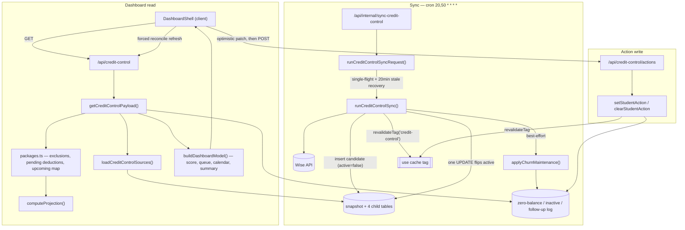

# Credit Control

**Status: live** — cron registered and running (`vercel.json`, `20,50 * * * *`), page → API → sync path fully wired, nine test suites, no `@deprecated` markers in code. (A statement about the code; no maturity badge was supplied for this feature by an authoritative source.)

## Purpose

Credit Control is the admin workspace that keeps a student's prepaid class credits from running out unnoticed. A twice-hourly sync pulls every student the institute returns, their per-class credit packages, their past sessions and their future bookings out of Wise; the read path projects each package forward session-by-session to work out when it drops below the alert threshold and when it hits zero, ranks the at-risk students into a prioritized worklist, and lets an admin record the outreach they did.

The primary users are the BeGifted admin/sales staff who own renewals. Each student can be assigned to one owning admin, so a staff member can scope the dashboard to "my students", see who needs a call today, copy a ready-made Thai LINE message for the parent, and mark the student `contacted` / `pending-callback` / `resolved`. It is deliberately read-mostly against Wise: nothing is ever written back. The only state the feature owns is snapshot-independent sidecar state — follow-up status, follow-up audit log, admin ownership, "no longer active" suppressions, and the zero-balance streak that drives auto-churn. Most of that is human-written, but not all of it: the churn tables belong to the sync. `credit_control_zero_balance_tracking` has no human write path at all (`sync.ts:549`-`569`, `:627`-`631` are its only writer and deleter), and the sync also writes `auto-churn` rows into the inactive table and `auto-remove` / `auto-reactivate` entries into the follow-up log under a synthetic actor (`sync.ts:571`-`619`).

One thing worth knowing up front: the credit-control snapshot tables have outgrown this feature. They are now the de-facto institute-wide student/session store that Student Schedule (`src/lib/student-schedule/data.ts:174`), Progress Tests (`src/lib/progress-tests/db.ts:68`), Post-class Feedback (`src/lib/post-class-feedback/repository.ts:1527`), LINE student links (`src/lib/line/student-links.ts:177`), Leave Requests (`src/lib/leave-requests/data.ts:340`), Wise Activity reconciliation (`src/lib/wise-activity/reconciliation.ts:881`) and Student Promotions (`src/lib/student-promotions/data.ts:690`) all read from. A regression in this sync is a multi-feature outage, not a single-page one.

## Conceptual data model

Eleven tables, in two families. Column-level detail (types, defaults, indexes) lives in the database reference: [docs/reference/database/erd-credit-control.md](../reference/database/erd-credit-control.md).

**Snapshot family (machine-owned, re-derived into a new snapshot every sync).** Its own snapshot lineage, entirely separate from the tutor-scheduling `snapshots` table. Nothing is overwritten in place: each run INSERTs a brand-new snapshot id plus fresh child rows, then flips `active` with one `UPDATE` (`sync.ts:661`-`678`, `:700`-`702`). Every prior snapshot and all of its rows stay in the database.

- `credit_control_sync_runs` — one row per sync attempt: status, counts, `errorSummary`, and a `metadata` JSON blob of fetch diagnostics. A partial unique index (`ccsr_single_running_idx`, `src/lib/db/schema.ts:1177`-`1179`) permits only one `running` row table-wide. That index is the *race backstop*, not the guard itself: the guard is `acquireSyncRun()` (see [Sync resilience](#business-rules--edge-cases)), and the index only catches the case where two callers pass the SELECT check simultaneously.
- `credit_control_snapshots` — the immutable point-in-time header; exactly one row carries `active = true`.
- `credit_control_students` — every student Wise returns for the institute, with the derived `studentKey`. `fetchCreditStudents` pages `/institutes/v3/{id}/students` with no activation filter (`wise.ts:145`-`162`) and `buildStudentsRows` persists all of them, writing `activated` as data rather than treating it as a gate (`sync.ts:305`-`321`).
- `credit_control_packages` — one row per (class × student) pair: total / consumed / remaining / available credits and an `excludedReason` stamped at sync time.
- `credit_control_sessions` — past *and* future sessions in one table, separated by `sessionKind`, carrying duration, meeting status, applied credit, teacher feedback, and the resolved teaching identity.
- `credit_control_credit_history` — the raw per-pair credit ledger from Wise, including the untouched `raw` payload.

**Sidecar family (snapshot-independent — human-written except the churn tables, which the sync owns).** The defining property is that these rows survive snapshot rotation, not that a person wrote them. All keyed by `studentKey` — a normalized `student-name::parent-name` string built by `buildDashboardStudentKey` (`src/lib/credit-control/helpers.ts:17`), not by a snapshot id.

- `credit_control_follow_up_state` — the current follow-up status, one upserted row per student.
- `credit_control_follow_up_log` — append-only audit trail of every `set` / `clear` / `bulk-set` / `bulk-clear` / `auto-clear` / `auto-remove` / `auto-reactivate` event, with actor. The three `auto-*` types are machine-written under the synthetic actor `system@begifted.local`: `auto-clear` by the read path (`service.ts:125`-`133`), `auto-remove` and `auto-reactivate` by the sync (`sync.ts:593`-`601`, `:611`-`619`).
- `credit_control_inactive_students` — students hidden from the worklist, with `source` and the balance they were removed at. `manual` rows come from the admin's "No Longer Active" click; `auto-churn` rows are written by the sync itself (`sync.ts:571`-`592`).
- `credit_control_zero_balance_tracking` — how long each student has continuously held ≤ 0 credits; the input to the auto-churn timer. Machine-only: the sync is its sole writer and deleter (`sync.ts:549`-`569`, `:627`-`631`), with no human write path anywhere in `src/`.
- `credit_control_admin_ownership` — the manual student → owning-admin assignment.

Note on retention: nothing prunes old credit-control snapshots. No code path deletes `credit_control_snapshots` or any of its child tables — the only credit-control deletes in the repo target sidecar rows (`db.ts:233`, `:286`, `sync.ts:607`, `:629`), and no migration drops snapshot data. An undated schema comment, written to justify *not* adding an index rather than to measure retention, quotes production figures from whenever it was taken: 67.8M session rows / 39GB across 3,367 retained snapshots (`src/lib/db/schema.ts:1252`-`1258`). Those numbers cannot be checked from the repo and grow with every sync — treat them as an order-of-magnitude signal, not a current measurement.

## API surface

Eight in-app endpoints plus one internal cron route. Every in-app handler calls `requireCreditControlSession()` (`src/lib/credit-control/api.ts:5`), which only asserts that the session carries an email and a name — page-level gating happens upstream in `src/middleware.ts`. Full request/response contracts: [docs/reference/api/credit-control.md](../reference/api/credit-control.md) and, for the cron route, [docs/reference/api/internal-crons.md](../reference/api/internal-crons.md).

| Endpoint | Purpose |
|---|---|
| `GET /api/credit-control` | Assemble and return the whole dashboard payload for the active snapshot. |
| `POST /api/credit-control/sync` | Admin-session-triggered Wise resync — not sized for the real run length (see below). |
| `POST /api/credit-control/actions` | Set or clear one student's follow-up status. |
| `POST /api/credit-control/actions/bulk` | Set or clear follow-up status for many students at once. |
| `GET /api/credit-control/actions/history` | Last 7 days of follow-up log entries for one student. |
| `POST /api/credit-control/admin-ownership` | Assign a student to an owning admin. |
| `POST /api/credit-control/inactive` | Hide a student from the worklist ("No Longer Active"). |
| `DELETE /api/credit-control/inactive` | Restore a hidden student. |
| `GET`, `POST /api/internal/sync-credit-control` | Cron entry point (`CRON_SECRET`; POST also accepts a session), sized for the real ~6-minute run. |

The two sync entry points are deliberately sized differently. The internal cron route's `maxDuration` was raised to cover the measured run length; `POST /api/credit-control/sync` was left at the older, shorter ceiling, so a manual sync started from the in-app button is expected to be killed mid-run and strand its `running` row until the 20-minute watchdog fails it. The exact values, and the route comment recording why the cron route was raised, live in the reference pages linked above.

The cron runs at `20,50 * * * *` (`vercel.json`), staggered against the other syncs. Three callers can start a sync and all of them funnel into the same `runCreditControlSyncRequest()` (`src/lib/credit-control/run-sync-request.ts:138`) — what differs is whether the invocation is audited:

- `GET`/`POST /api/internal/sync-credit-control` wraps the call in `withCronInvocationAudit` under job key `credit_control` on **both** its paths — `triggerSource: "cron"` for a valid `CRON_SECRET`, `triggerSource: "admin"` for the POST session fallback (`src/app/api/internal/sync-credit-control/route.ts:36`-`55`).
- The Data Health "run job" button does **not** go through that route. `runDataHealthJob` applies its own `withCronInvocationAudit` wrapper with `triggerSource: "admin"` around *every* job key (`src/lib/data-health/run-job.ts:34`-`40`) and then calls `runCreditControlSyncRequest()` directly (`:99`-`101`) — a separately audited third caller.
- `POST /api/credit-control/sync` calls it with no audit wrapper at all (`src/app/api/credit-control/sync/route.ts:6`-`13`), so of the two HTTP sync endpoints only the internal one leaves an invocation record.

## UI

**Page** — `src/app/(app)/credit-control/page.tsx`: a thin server component that requires a session with an email and name, redirects to `/login` otherwise, and renders the client shell inside `<Suspense>`.

**`DashboardShell`** (`src/components/credit-control/dashboard-shell.tsx`) is the orchestrator: it fetches `GET /api/credit-control` on mount, re-polls every 60s (`:183`-`:186`), owns every piece of UI state, applies optimistic patches, and wires the keyboard shortcuts. Layout is a three-column workspace — an admin rail on the left, a resizable queue/calendar split in the middle, and a student inspector on the right.

Children, all under `src/components/credit-control/`:

- `summary-bar.tsx` — four KPI cards: students in queue (with an "N of M actioned today" progress bar), pinned students, notify packages, pending-deduction backlog.
- `queue-panel.tsx` — the worklist. Renders a desktop table or, below 1024px, a card list; sortable headers; per-row checkboxes; a "Hide worked" toggle persisted in `localStorage` (`:103`-`:114`); and slice windowing that mounts 60 rows at a time and grows via an `IntersectionObserver` sentinel with a keyboard-accessible "Show more" button (`:132`-`:206`).
- `calendar-panel.tsx` — month/week/day calendar of upcoming sessions, tinted by the urgency of the students booked that day.
- `student-detail.tsx` — the inspector: per-package tabs (defaulting to the lowest-balance package), a "What to do now" block, the credit waterfall, upcoming sessions, follow-up history, and the action buttons including the destructive "No Longer Active" behind a confirm dialog.
- `bulk-action-bar.tsx`, `line-preview-modal.tsx` (the LINE drawer with copy / copy-and-mark-contacted), `toast-notification.tsx` (success/error toasts with undo).

Keyboard-first by design: `j`/`k` to move, `c`/`p`/`r` to mark, `l` for the LINE drawer, `Shift+L` for copy + mark contacted + advance, `/` to search, `?` for help (`src/hooks/use-keyboard-shortcuts.ts:78`-`89`).

Admin scoping, the risk filter (all/notify/watch/ok) and search are all pure client-side filters over whatever the payload contains (`dashboard-shell.tsx:210`-`222`, `:229`-`243`). That payload is every *active, non-hidden* student, not literally every student: only students holding at least one non-excluded package are marked active and enter the model (`db.ts:112`, `:146`-`149` → `packages.ts:30`-`44`, `:318`-`319`), and students on the inactive list are dropped server-side before the dashboard model is built (`service.ts:83`-`88`). The chosen admin view is persisted to `localStorage` under `begifted-admin-view` (`dashboard-shell.tsx:62`-`69`). While a search is active the worklist widens from `studentQueue` (at-risk only) to `studentQueueAll` (every active student) so any student is reachable by name (`:229`-`:243`).

## Data flow

```mermaid
flowchart TD
  subgraph Sync["Sync — cron 20,50 * * * *"]
    Cron["/api/internal/sync-credit-control"] --> RSR["runCreditControlSyncRequest()"]
    RSR -->|"single-flight + 20min stale recovery"| RCS["runCreditControlSync()"]
    RCS --> WISE[("Wise API")]
    RCS -->|"insert candidate (active=false)"| SNAP[("snapshot + 4 child tables")]
    RCS -->|"one UPDATE flips active"| SNAP
    RCS -->|"best-effort"| CHURN["applyChurnMaintenance()"]
    CHURN --> SIDE[("zero-balance / inactive / follow-up log")]
    RCS -->|"revalidateTag('credit-control')"| CACHE[["use cache tag"]]
  end

  subgraph Read["Dashboard read"]
    Shell["DashboardShell (client)"] -->|GET| RT1["/api/credit-control"]
    RT1 --> SVC["getCreditControlPayload()"]
    SVC --> LOAD["loadCreditControlSources()"]
    LOAD --> SNAP
    SVC --> PKG["packages.ts — exclusions, pending deductions, upcoming map"]
    PKG --> PROJ["computeProjection()"]
    SVC --> SIDE
    SVC --> AN["buildDashboardModel() — score, queue, calendar, summary"]
    AN --> Shell
  end

  subgraph Write["Action write"]
    Shell -->|"optimistic patch, then POST"| RT2["/api/credit-control/actions"]
    RT2 --> ACT["setStudentAction / clearStudentAction"]
    ACT --> SIDE
    ACT -->|revalidateTag| CACHE
    Shell -->|"forced reconcile refresh"| RT1
  end
```

**Sync** (`src/lib/credit-control/sync.ts:634`): fetch students + PAST sessions (120 days back) + FUTURE sessions (180 days forward) in parallel → derive the (class × student) pair set from both the students' classrooms and the sessions themselves (`collectPairs`, `:255`) — the `activated` flag gates only the classroom-derived half (`:280`-`:291`); a session-derived pair is added for any fetched student regardless of the flag (`:293`-`300`) → fetch per-pair credits with concurrency 8 → insert a candidate snapshot with `active = false` → build student/package/session/history rows → insert in 100-row chunks → one `UPDATE` sets `active = (id = candidate)` (`:700`-`:702`) → run churn maintenance → mark the run successful → `revalidateTag`.

**Read** (`src/lib/credit-control/service.ts:27`): load the active snapshot's rows and reshape them into in-memory "sheet snapshot" objects → build the active-student set, the package-exclusion map, the pending-deduction context and the upcoming-session map (`packages.ts`) → project each package (`projection.ts`) → merge the sidecar tables (follow-up state, ownership, inactive list) → drop inactive students → score and assemble queue/calendar/summary (`analytics.ts`). The whole function is a Next.js `"use cache"` unit tagged `credit-control` with a 60s revalidate (`service.ts:31`-`33`).

**Write**: the shell patches its in-memory payload optimistically (`payload-patch.ts`), POSTs, then reconciles with the server response; mark-inactive additionally forces a background refresh. Every mutating server action calls `revalidateTag(CREDIT_CONTROL_CACHE_TAG, { expire: 0 })`.

## Business rules & edge cases

**Projection and status**

- A package's balance is walked down session by session, one credit per 60 minutes. The first session that pushes it below `ALERT_THRESHOLD` (2 credits) sets `alertDate`; the first that pushes it to ≤ 0 sets `exhaustDate` (`src/lib/credit-control/projection.ts:41`-`62`, threshold at `config.ts:3`).
- Status: starting balance already below 2 → `notify`; else crossing below 2 within `NOTIFY_WINDOW_DAYS` (30) → `watch`; else `ok` (`projection.ts:67`-`72`). With no upcoming sessions at all: low balance → `notify` dated today, healthy balance → `nodata` (`projection.ts:15`-`34`). `nodata` means "we cannot project", never "fine".
- Only sessions strictly after today with Wise status `UPCOMING` feed the projection (`packages.ts:266`-`298`).

**Pending deductions — deliberately pessimistic**

- A past session counts as a pending deduction when its status is `ENDED`, teacher feedback is empty or `"0"`, *and* credits consumed is 0 — i.e. the class happened but Wise has not yet deducted for it (`packages.ts:212`-`225`). `adjustedRemaining = max(0, currentRemaining - pendingDeduction)` (`packages.ts:328`), so the dashboard always treats the student as at least as at-risk as Wise's raw balance says.
- The deduction amount prefers Wise's `Should_Credit`, falling back to duration ÷ 60 and flagging `pending-deduction-fallback` (`packages.ts:227`-`264`). In the current Postgres-backed path that column is always written as an empty string (`db.ts:122`-`134`), so the fallback branch is what actually runs and the flag fires on every pending deduction.

**Exclusions**

- Any package whose name or subject contains `pretest` or `trial` is dropped — these are not renewable credit packages (`config.ts:6`). Applied twice: stamped as `excludedReason` at sync time (`sync.ts:241`-`244`) and re-derived on read (`packages.ts:143`-`154`). The read-path map is keyed by *package name*, with an in-code note that keying it by subject was the bug that let Pretest packages leak through (`packages.ts:51`-`61`).
- Duplicate rows for the same student+package are merged, keeping the row with the larger `totalCredits` and recording `duplicateCount` for the `duplicate-source-rows` flag (`packages.ts:581`-`597`).

**Queue ranking**

- `pinned` = no future schedule *and* (adjusted total below 2 or current total ≤ 0). Pinned students sort above everything regardless of score (`analytics.ts:231`-`235`, `:296`).
- Queue membership = pinned or at least one `notify`/`watch` package (`analytics.ts:235`); `studentQueueAll` keeps everyone so search can still reach healthy students.
- `computePriorityScore` (`analytics.ts:135`-`176`) weights exhausted balances (140), notify (120), watch (80), nodata (28), urgency of alert/exhaust dates, pending deductions, data-quality flags, status worsening and multi-risk students.

**Churn lifecycle** (pure state machine in `churn.ts`, applied at sync time only)

- Balances roll up per student across non-excluded packages (`churn.ts:56`-`73`).
- A student continuously at ≤ 0 credits for `CHURN_INACTIVITY_DAYS` (45, `config.ts:16`) is auto-removed from the worklist: an `auto-churn` row in `credit_control_inactive_students` plus an `auto-remove` log entry under the synthetic actor `system@begifted.local` (`sync.ts:571`-`602`, `config.ts:18`-`19`).
- Reactivation floor is `max(removedAtRemaining, 0)`: an auto-churned student rejoins on any positive balance, while a manually removed student who still held credits only rejoins once they exceed that prior balance (`churn.ts:113`-`121`). The manual removal route records that balance for exactly this reason (`src/app/api/credit-control/inactive/route.ts:22`-`32`).
- Ordering is defensive: zero-tracking rows are cleared *last*, after the inactive writes, so a partial failure re-processes the student on the next sync instead of silently resetting their streak — Neon HTTP has no transactions (`sync.ts:623`-`631`).
- Churn maintenance is best-effort and its errors are swallowed so they can never roll back a promoted snapshot (`sync.ts:704`-`709`).

**Follow-up state**

- Only `contacted`, `pending-callback`, `resolved` are accepted; anything else normalizes to `null`, which means "clear" (`action-helpers.ts:17`-`24`).
- Auto-clear: on every payload build, a student who holds a follow-up status but no longer has any `notify`/`watch` package has that status deleted and an `auto-clear` entry logged, so recovered students do not linger as "contacted" (`service.ts:109`-`136`). This is a write inside a `"use cache"` function, so it only fires on a cache miss; the Home summary opts out with `clearRecoveredActionStates: false` (`src/lib/home/summary.ts:179`).
- `loadCreditActionStateMap` hardcodes `isToday: true` (`db.ts:196`-`208`); the real value is recomputed against `updatedAt` by `sanitizeStudentActionState` before it reaches the UI (`action-helpers.ts:26`-`40`).

**Admin ownership**

- The named roster is the frozen six-entry `ADMIN_OWNER_REGISTRY` (`config.ts:28`-`35`). Live resolution reads only the `credit_control_admin_ownership` sidecar: `getCreditControlPayload` passes an empty ownership map into the builder (`service.ts:60`) and then overlays the sidecar rows (`service.ts:70`-`76`), so everyone is "Unassigned" until explicitly assigned.
- The assign route validates against `getAdminViewOptions()` (`admin-ownership/route.ts:18`), which includes the pseudo-key `all` — so `all` is an accepted `adminKey` even though it is a view filter, not an owner.
- `seedCreditAdminOwnershipFromRemainingCredits` (`admin-ownership-seed.ts:33`) can bulk-seed ownership by majority vote from a legacy `RemainingCredits` admin column; it is invoked only from `scripts/seed-credit-control-admin-ownership.ts`, never from the app.

**Sync resilience**

- Single-flight lives in `acquireSyncRun()` (`run-sync-request.ts:106`-`136`): it force-fails `running` rows older than 20 minutes (`:9`, `:50`-`67`), then SELECTs for a live run and, if one exists, returns the `skipped` payload — which `runCreditControlSyncRequest()` serves as HTTP `202` (`:145`-`147`). A `23505` unique violation on the insert — the `ccsr_single_running_idx` backstop firing on a true race — is converted into that same skip (`:41`-`48`, `:124`-`134`).
- Failure preserves the previous active snapshot — the candidate is inserted inactive and only promoted after all inserts succeed. Failures record a structured `errorSummary` that walks nested causes for Postgres `code` / `constraint` / `detail` and caps at 2000 chars (`sync.ts:187`-`217`, `:738`-`757`).
- A per-pair credit fetch that fails increments `failedCreditPairs` and drops that pair rather than aborting the run (`sync.ts:351`-`370`). Teacher feedback is only fetched for `ENDED` past sessions with no positive credit-history match, to bound the request count (`sync.ts:406`-`424`).
- Session rows are deduped by `(sessionId, studentId)` before insert (`sync.ts:435`-`437`); Wise session pages are walked in 31-day windows of 100 (`wise.ts:164`-`190`).
- Fail-closed on teacher identity: a session with no resolvable teacher is stored as `null` and rendered "TBC" downstream, never inferred from the class name (`wise.ts:123`-`143`).

**Client-side correctness**

- Refreshes are sequenced: each load aborts the previous request and drops any response that is no longer the newest, so an older payload cannot overwrite a newer one (`dashboard-shell.tsx:105`-`110`, `:133`-`176`). Background polls are skipped in unfocused tabs but a forced post-mutation reconcile is never skipped (`:129`).
- Action patches applied after a GET was dispatched are re-applied on top of that response and patches the server already reflects are pruned (`payload-patch.ts:73`-`87`).
- Optimistic mark-inactive removes the student from the queue arrays only — `students` and `calendar` are left alone because calendar entries address students by `studentIndex`, and shifting that array would mis-target the detail pane until the refresh lands (`payload-patch.ts:120`-`143`).
- A re-entry guard stops a second mark-inactive on an already-removed student, which would otherwise capture empty worklist rows and 404 (`dashboard-shell.tsx:468`-`479`).

**Time handling.** `parseDate` / `getTodayDate` / `formatDate` build dates with the local-time `Date` constructor, so they resolve in whatever timezone the process happens to run in (`helpers.ts:40`-`64`), while `formatDateTime` and `formatShortTimestamp` explicitly format in `Asia/Bangkok` (`helpers.ts:66`-`97`). Nothing in the repo pins a timezone for the deployed runtime: `vercel.json` contains only `crons`, and neither `next.config.ts` nor `src/lib/env.ts` sets or validates `TZ` — the single `TZ` assignment anywhere is `vitest.config.ts:4`, which pins the *test* runner to `Asia/Bangkok`. So the "today" boundary used for projections follows the deployment's default timezone rather than the Bangkok one the UI renders against; what that default actually is in production is a platform detail this repo does not record.

## Tests

Unit tests live in `src/lib/credit-control/__tests__/` plus one component suite:

- `sync.test.ts` — 100-row chunking, snapshot-id linkage ordering, dedupe of duplicate Wise session/student rows, failed runs staying traceable to the candidate snapshot, and the structured error serializer (nested causes, DB fields, truncation).
- `wise.test.ts` — student pagination with parents requested, date-window splitting, per-pair credit + history parsing; plus business rules: Pretest/Trial exclusion (including the name-vs-subject case), the duration fallback for ended-no-credit sessions, "future non-excluded sessions only", and the admin majority-vote/tie-break.
- `wise-teacher.test.ts` — the widened `userId` shapes (bare id vs expanded ref) and the never-guess teacher rule.
- `churn.test.ts` — the whole state machine: first zero observation, streak preservation, auto-removal at threshold, recovery clearing, and both reactivation floors.
- `analytics.test.ts` — queue membership: a healthy student appears in `studentQueueAll` but not the at-risk `studentQueue`.
- `payload-patch.test.ts` — the optimistic-update helpers, including referential stability for memoized rows, calendar `studentIndex` safety, the remove/restore round trip, and patch merge/prune ordering.
- `queue-window.test.ts` — window growth, clamping, and never shrinking on a shorter list.
- `src/components/credit-control/__tests__/queue-panel.test.tsx` — windowing and the load-more sentinel, single-layout rendering, selection/optimistic row state, and sortable-header a11y.
- `src/app/api/internal/sync-credit-control/__tests__/route.test.ts` — cron-secret auth (200/401/500), admin POST fallback, and the 202 already-running skip.

Not covered by any test: the projection/priority-score math end to end, `clearRecoveredActionStates`, and the eight in-app `/api/credit-control/*` handlers.

## Open questions

- **The snapshot-diff machinery is inert.** `analytics.ts` has a complete apparatus for cross-refresh deltas, status-change labels, weekly buckets and rolling history (`buildSummaryDeltas`, `updateHistory`, `buildWeeklyBuckets`, `buildSnapshotForPersistence`, `HISTORY_LIMIT`), but its only caller always passes `{ lastSnapshot: null, history: [] }` and discards the returned `snapshotState` (`service.ts:88`-`93`). Every `delta` is therefore `null`, `previousUpdatedAt` is always `null`, and `statusChange` is always `"new"`. Is persisting the previous snapshot state intended and unfinished, or should this be deleted?
- **Calendar-day highlighting looks broken.** The shell builds `selectedDayStudentKeys` from `CalendarStudentEntry.key`, which is `"<student name>::<date>"` (`analytics.ts:339`-`340`), and passes it to the queue panel, which tests membership against `row.studentKey`, which is `"<normalized name>::<normalized parent>"` (`dashboard-shell.tsx:316`-`319`, `:1057`; `queue-panel.tsx:291`). The two key spaces cannot intersect, so `isDayHighlighted` should never be true. Intended feature that regressed, or dead prop?
- **Dead exports.** `filter-toolbar.tsx` (`FilterToolbar`) has no importer; nor do `buildWeeklyBuckets`, `defaultCreditAdminOwnership`, `fallbackStudentKey`, `fallbackPackageKey`, `sortByEarliestDate`, `diffDays`, and the Sheets-era constants `SHEETS_IN_MEMORY_TTL_MS`, `REQUIRED_COLUMNS`, `DASHBOARD_ACTION_STATE_SHEET` / `DASHBOARD_ACTION_LOG_SHEET` / `INACTIVE_STUDENTS_SHEET`. Safe to remove, or kept as scaffolding for planned work?
- **The "sheet snapshot" indirection.** `loadCreditControlSources` (`db.ts:88`) reassembles Postgres rows into synthetic Google-Sheets-shaped tables that the rest of the pipeline parses by column name — including an always-empty `RemainingCredits` sheet (`db.ts:191`) and an always-blank `Should_Credit` column. Keep it to avoid touching the projection code, or refactor to row → model directly? If `Should_Credit` should be real, where does Wise expose it?
- **Snapshot retention.** Nothing prunes old credit-control snapshots — no code path deletes snapshot or child rows anywhere in `src/`, `scripts/` or `drizzle/`. The only size signal available in the repo is an undated schema comment written for a different purpose (3,367 retained snapshots / 39GB, `src/lib/db/schema.ts:1252`-`1258`); the live figures are unknown here and rise every 30 minutes. Is indefinite retention a deliberate business/audit decision, and if so, what is the plan as the table keeps growing?
- **`adminKey: "all"` is accepted by the ownership route** because validation goes through `getAdminViewOptions()` (`admin-ownership/route.ts:18`). Should it validate against `ADMIN_OWNER_REGISTRY` + `unassigned` instead?
- **Two admin rosters.** The six-name `ADMIN_OWNER_REGISTRY` is separate from the auth allowlist in `admin_users`. Should ownership be derived from one source of truth?
- **Cron-registry drift on the sync timeout.** `src/lib/data-health/cron-registry.ts:118` declares `maxDurationSeconds: 300` for the `credit_control` job while the route itself sets `800` (`src/app/api/internal/sync-credit-control/route.ts:14`). This is code-vs-code, not doc drift — the registry feeds the Data Health job list, so the ops UI advertises a ceiling the route no longer has. Should the registry field be derived from the route constant rather than hand-copied?
- **Runtime vs Bangkok "today".** Projections bucket by the process's local date while timestamps render in `Asia/Bangkok`, and no `TZ` is configured for the deployed runtime anywhere in the repo. What timezone does the production function actually run in, and should `getTodayDate` be explicitly Bangkok-anchored so the alert/exhaust dates cannot drift from the dates the UI shows?

_Verified against HEAD + uncommitted WIP on 2026-05-31._
