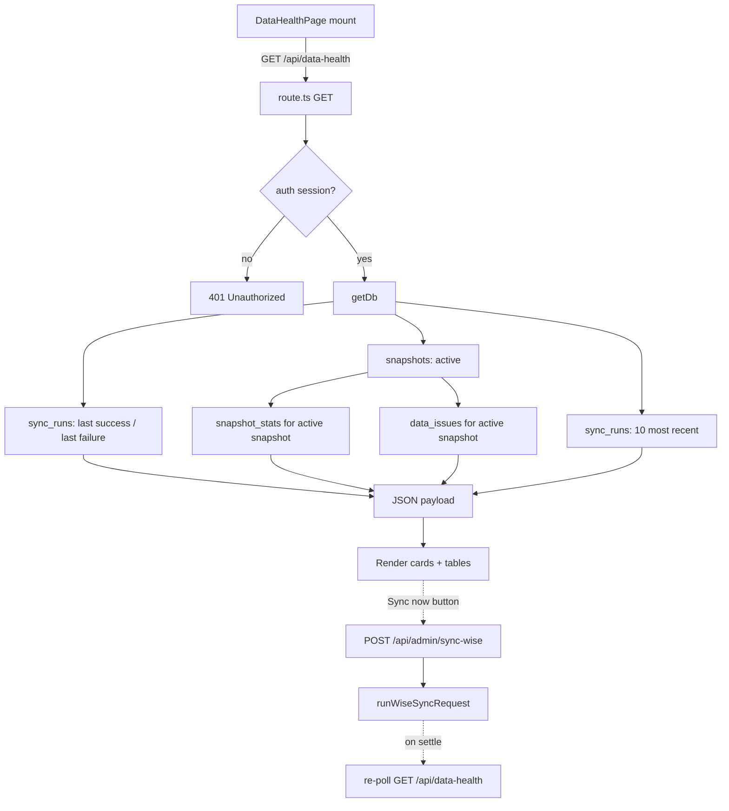

# Data Health

**Status: stable**

## Purpose

Data Health is the admin-facing observability dashboard for the Wise snapshot sync pipeline. It answers one question for non-technical admin staff: **is the tutor data the rest of the app is searching against fresh and trustworthy right now?**

It surfaces, in one screen:

- When the last sync succeeded, when one last failed (and why), and whether the active snapshot is stale.
- Which snapshot is currently active and its headline counts (Wise teachers, identity groups, resolved vs. unresolved, total issues).
- A breakdown of unresolved normalization problems by category, with drill-down tables for the three that need a human to fix the source data in Wise: unresolved tutor aliases, unresolved/contradictory modality, and unmapped qualification tags.
- A rolling history of the last 10 sync runs.

It also provides a single operational lever — a **Sync now** button — that lets an admin trigger an on-demand sync without shell access or the `CRON_SECRET`.

The feature is almost entirely a **read layer**: the `/api/data-health` endpoint performs only `SELECT`s and never writes. The only mutation reachable from the page is the manual sync trigger, which is delegated to a separate endpoint.

The primary user is an admin who sees the "tutor data may be outdated" banner elsewhere in the app and clicks through here to investigate (`src/components/layout/stale-snapshot-banner.tsx:101-107`).

## Conceptual data model

Data Health reads four tables, all part of the snapshot/sync subsystem. It writes none of them.

| Table | Role in this feature |
|-------|----------------------|
| `snapshots` | Identifies the single `active` snapshot. Only its `id` is read; the first 8 chars are shown as the "Active Snapshot" card. |
| `sync_runs` | The audit log of every sync attempt. Read three ways: last `success`, last `failed`, and the 10 most recent runs by start time. |
| `snapshot_stats` | The pre-aggregated counts (teacher totals, identity-group resolution, total issues, and a JSON `issuesByType` map) for the active snapshot. |
| `data_issues` | All unresolved normalization issues for the active snapshot. Filtered by `type` into the alias / modality / tag drill-down tables. |

These tables are produced and promoted by the sync orchestrator (the writer side); Data Health is strictly a consumer. For exact columns, types, indexes, and constraints, see the snapshot/scheduler ERD reference: [docs/reference/database/erd-core.md](../reference/database/erd-core.md).

## API surface

| Endpoint | Purpose |
|----------|---------|
| `GET /api/data-health` | Returns the full health payload — sync timestamps, stale age, active snapshot id, headline stats, `issuesByType`, the three filtered issue lists, and recent sync history. Auth-gated (401 if no session). |
| `POST /api/admin/sync-wise` | Not part of this feature's own code, but is the target of the page's "Sync now" button. Triggers an on-demand Wise sync via the shared `runWiseSyncRequest` runner. |

Full request/response contracts belong in the API reference: [docs/reference/api/misc.md](../reference/api/misc.md). The manual sync endpoint (`POST /api/admin/sync-wise`) is documented there alongside the sync pipeline.

## UI

- **Page**: `src/app/(app)/data-health/page.tsx` — a single `"use client"` component (`DataHealthPage`) rendered at `/data-health`. Reachable from the persistent top nav (`src/components/layout/app-nav.tsx:32`) and from the stale-data banner link.
- **Layout** (top to bottom):
  - **Sync status row** (3 cards): Last Successful Sync (with a destructive "Stale (Nm ago)" badge and the **Sync now** button), Active Snapshot (8-char id), Last Failed Sync (with truncated error).
  - **Stats row** (5 cards): Wise Teachers, Identity Groups, Resolved, Unresolved, Total Issues — rendered only when `stats` is present.
  - **Issues by Type**: outline badges, one per `issuesByType` key.
  - **Drill-down tables**, each rendered only when non-empty: Unresolved Aliases, Modality issues (with per-row `group`/`session` tags), Unmapped Tags (capped at 50 rows).
  - **Recent Sync History**: 10-row table with a status badge (success/failed/other), Bangkok-formatted timestamps, teacher count, and error.
- **Components**: shadcn/ui `Card`, `Badge`, `Button`, `Table`. A bespoke `DataHealthSkeleton` shimmer matches the card layout during initial load. Timestamps are formatted with `formatBangkokDateTime` (`src/lib/bangkok-time.ts`); staleness is decided by `isApiSnapshotStale` (`src/lib/ops/stale.ts`).

## Data flow

On mount the page fetches `/api/data-health`; the route reads the four tables and returns a denormalized payload. The "Sync now" button takes a different path — it POSTs to the separate admin sync endpoint and then re-polls `/api/data-health` to refresh the view.

Notable flow details:

- The active-snapshot lookup gates the stats and issue queries. If no snapshot is `active`, the route skips those queries entirely and returns `stats: null` with empty issue lists (`src/app/api/data-health/route.ts:71-102`).
- `staleAgeMs` is computed in the route as `Date.now() - lastSuccess.finishedAt`, and `staleMinutes` is derived from it (`src/app/api/data-health/route.ts:105-121`). The page independently re-derives staleness for the badge using the same threshold helper.
- The same `GET /api/data-health` endpoint is also consumed headlessly by the global stale banner to decide whether to show itself (`src/components/layout/stale-snapshot-banner.tsx:58-66`).

## Business rules & edge cases

- **Auth-first, fail-closed.** The route returns 401 before touching the DB if there is no session (`src/app/api/data-health/route.ts:34-37`). All errors are caught and returned as `{ error }` with status 500 (`src/app/api/data-health/route.ts:145-148`).
- **Stale threshold is 90 minutes for this dashboard.** `isApiSnapshotStale` returns true when `staleAgeMs > 90 * 60 * 1000` (`src/lib/ops/stale.ts:2,11-13`). This is deliberately wider than the 30-minute cron cadence to tolerate cron jitter and sync-recovery headroom. Note the **separate, larger 2-hour threshold** (`shouldShowStaleBanner`, `src/lib/ops/stale.ts:3,15-17`) governs the app-wide warning banner — so the page can show "Stale" while the global banner stays hidden.
- **Modality issues merge two issue types into one number.** `selectModalityIssues` filters `data_issues` to BOTH `type === "modality"` (legacy group-level, from `deriveModality`) AND `type === "conflict_model"` (session-level signal contradictions, from `detectSessionModalityConflict`), projecting each row with an `issueType` field so the UI can tag it `group` vs `session` (`src/app/api/data-health/modality-counter.ts:19-31`; rendered at `src/app/(app)/data-health/page.tsx:361-375`). The page carries an explicit note that this counter is **expected to rise** post-deploy and that the rise is "surface-of-reality, not a regression" (`src/app/(app)/data-health/page.tsx:348-350`).
- **Two homes for the same helper, on purpose.** The canonical `selectModalityIssues` lives in `modality-counter.ts`; `route.ts` re-exports a thin wrapper. The split exists so Vitest can import the helper without pulling the Next.js route module graph (which transitively imports `next-auth`, whose `next/server` subpath the bare Node resolver can't resolve) (`src/app/api/data-health/route.ts:8-31`, `src/app/api/data-health/modality-counter.ts:1-18`).
- **`issuesByType` comes straight from the snapshot, not recomputed.** The breakdown badges read the pre-aggregated `snapshotStat.issuesByType` JSON; the per-row tables are computed live from `data_issues`. The two can therefore differ in framing (the aggregate may carry types the page has no dedicated table for, e.g. `completeness`), which is by design.
- **Aliases/modality/tags are the only categories given drill-down tables.** Other `data_issues` types appear only in the `issuesByType` badge row. Unmapped tags are capped at 50 rows in the table (`src/app/(app)/data-health/page.tsx:400`); aliases and modality are uncapped.
- **`entityName` is coerced to `""`.** Null entity names from `data_issues` become empty strings in all three lists (`src/app/api/data-health/route.ts:89,101`, `src/app/api/data-health/modality-counter.ts:27`).
- **"Sync now" is resilient to early-terminated requests.** A full Wise sync can outlast the browser's HTTP request. The handler treats a non-OK/thrown response as possibly-still-succeeded: it re-polls health and, if `lastSuccessfulSync` advanced to within 30s of when the click started, reports success anyway (`src/app/(app)/data-health/page.tsx:129-133,158-176`). It also distinguishes the single-flight "already running" skip response (`src/app/(app)/data-health/page.tsx:152-157`).
- **Sync trigger is a different endpoint.** The button POSTs `/api/admin/sync-wise` — a route module that exports `maxDuration = 800` (`src/app/api/admin/sync-wise/route.ts:5`) and delegates the work to `runWiseSyncRequest` (`src/lib/sync/run-wise-sync.ts:142`, which itself sets no `maxDuration`) — not `/api/data-health` (`src/app/(app)/data-health/page.tsx:136`, `src/app/api/admin/sync-wise/route.ts:7-15`). Data Health itself never writes.

## Tests

- `src/app/api/data-health/__tests__/route.test.ts` — exercises the `GET` handler against a mocked Drizzle chain. Covers: 401 when unauthenticated; the full 200 response shape (sync timestamps, stats, `issuesByType`, all three filtered issue lists, recent syncs) including that a `modality` issue and a `conflict_model` issue both land in `unresolvedModality` with the right `issueType`; and a 500 JSON error when the DB throws.
- `src/app/api/data-health/__tests__/modality-counter.test.ts` — unit tests for `selectModalityIssues`: includes both `modality` and `conflict_model` types under one counter, excludes unrelated types, handles a session-only scenario (zero `modality` rows), preserves `entityName`/`message`/`issueType`, and coerces null `entityName` to `""`.

No automated test covers the page component itself (skeleton, stale badge rendering, or the "Sync now" early-termination logic).

## Open questions

- **`issuesByType` vs. drill-down divergence.** The badge row is sourced from the snapshot's pre-aggregated `issuesByType`, while the tables are filtered live from `data_issues`. Is it intended that a category counted in the badges (e.g. `completeness`) has no corresponding detail table, and could the aggregate and live counts ever disagree if a snapshot's stats were computed at a different moment than its issues were written?
- **No page-level tests for the resilient "Sync now" path.** The early-termination success heuristic (30s window around click start) is non-obvious and untested. Is leaving it uncovered acceptable, or should it have a component/integration test?

_Verified against HEAD + uncommitted WIP on 2026-05-31._
