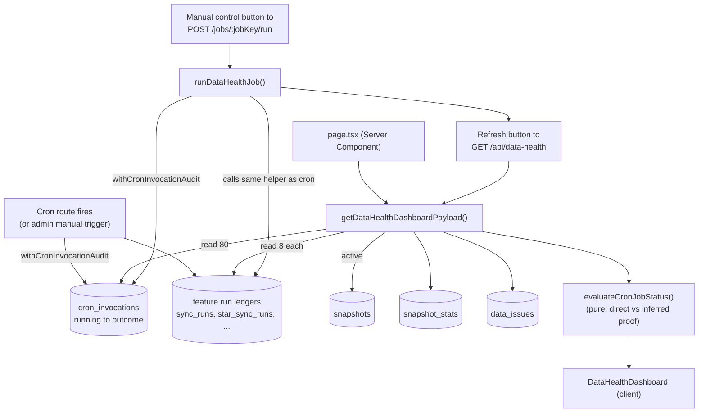

# Data Health

**Status: stable**

## Purpose

Data Health is the operations command center for BGScheduler's background pipelines. It answers a single question for non-technical admin staff: _"Is the data behind the site fresh, and are the crons that keep it fresh actually running?"_

It does this by aggregating, into one read-only dashboard:

- **Cron health** — for every registered background job (Wise snapshot sync, Wise activity audit, sales/credit/leave imports, classroom automation, progress tests, the one-shot July 1 student-promotions writeback, room utilization), whether it is `healthy`, `late`, `failing`, `running`, `manual-only`, or `unknown`, with the next/last expected schedule window.
- **Data freshness** — per-domain "last successful sync" and record counts (e.g. how many teachers in the active snapshot, how many sales rows last imported).
- **Wise snapshot fidelity** — the active search snapshot's normalization counters (teachers, identity groups resolved vs. unresolved, total data issues) and last successful/failed sync.
- **Normalization issue drill-downs** — the unresolved aliases, modality issues, and unmapped qualification tags that the fail-closed pipeline routed to "Needs review".
- **A unified run history** across all subsystems.

It also exposes a small **write surface**: session-gated "Manual controls" that let an admin trigger any registered job on demand (the same underlying sync/automation helpers the crons call). Everything else on the page is read-only.

The page is one of the in-app pages, linked as "Data Health" in the top nav (`src/components/layout/app-nav.tsx:34`).

## Conceptual data model

Data Health is overwhelmingly a **read layer**. It owns no domain data of its own — it reads the run ledgers, snapshot tables, and issue tables that other features write, then derives health verdicts in memory. Its one owned table is the cron audit ledger.

**Reads (Core domain):**

- **`snapshots`** — to find the single `active = true` Wise search snapshot.
- **`snapshot_stats`** — the per-snapshot denormalized counters (teacher count, identity groups, resolved/unresolved, total data issues, qualifications, availability windows, leaves, future sessions, plus an `issuesByType` JSON rollup) for the active snapshot.
- **`sync_runs`** — the Wise snapshot sync ledger; used for the "Wise snapshot" domain card, the last-successful/last-failed banner fields, and the stale-age calculation.
- **`data_issues`** — the normalization fail-closed log for the active snapshot, projected into three admin-facing lists (aliases, modality, tags).

**Reads (other features' run ledgers):** `wise_activity_sync_runs`, `sales_dashboard_import_runs`, `sales_dashboard_projection_import_runs`, `credit_control_sync_runs`, `leave_request_sync_runs`, `classroom_assignment_runs`, and `classroom_admin_email_runs` are each read `RECENT_LIMIT = 8` rows deep (`src/lib/data-health/dashboard.ts:17`, `dashboard.ts:550`–`562`) to derive that job's latest / latest-successful / latest-failed / running evidence. The one exception is `room_utilization_sessions`, fetched only `.limit(1)` (`dashboard.ts:563`) — its single latest row is treated as success evidence, with no failed/running inference.

**Writes (owns):**

- **`cron_invocations`** — a durable audit row written via `withCronInvocationAudit` whenever a wrapped cron route _or_ a manual trigger fires. This is the "direct" proof source for cron liveness. The dashboard reads the most recent 80 rows; the audit wrapper inserts a `running` row on entry and updates it with outcome/duration/response on exit. The wrapper is not universal: of the 11 registry jobs, 10 internal cron routes wrap their handler (`sync-wise`, `sync-wise-activity`, `sync-sales-dashboard`, `sync-credit-control`, `sync-progress-tests`, `progress-tests/admin-digest`, `sync-leave-requests`, `class-assignments/morning`, `class-assignments/admin-email`, `sync-room-utilization`). The **student-promotions July 1** route is the exception — it calls `applyVerifiedStudentPromotionRun` directly with no audit wrapper (`src/app/api/internal/student-promotions/july-1/route.ts:33`–`36`), so it writes no `cron_invocations` row, and Student Promotions has no feature run ledger of its own. (`pickJobRuns` has no branch for `student_promotions_july_1`, `progress_tests`, or `progress_tests_digest`, so they fall through to the final `return` and borrow room-utilization rows as run evidence — `dashboard.ts:215`–`235`; absent both a cron audit row and real run evidence, the verdict is `unknown`.)

All of these tables live in the **Core** domain. For column-level detail, indexes, and the snapshot-promotion ER diagram, see [docs/reference/database/erd-core.md](../reference/database/erd-core.md). For the `data_issues.type` enum (`alias`, `modality`, `tag`, `completeness`, `conflict_model`, `sync`), see [docs/reference/database/enums.md](../reference/database/enums.md).

> `cron_invocations` is snapshot-independent (it survives snapshot rotation) — it is keyed by `job_key`, not `snapshot_id`. Its migration is `drizzle/0038_data_health_cron_invocations.sql`.

## API surface

Two endpoints, both **admin-session** authed (Auth.js `auth()`, 401 if no session). Full request/response contracts live in [docs/reference/api/misc.md](../reference/api/misc.md) under "Data Health".

| Method | Path | Purpose |
|---|---|---|
| `GET` | `/api/data-health` | Returns the full dashboard payload — delegates to `getDataHealthDashboardPayload()`. Used by the page's "Refresh" button (the initial render is server-fetched, not via this route). |
| `POST` | `/api/data-health/jobs/[jobKey]/run` | Manually trigger a registered job by `jobKey`; validates against the typed cron registry (404 on unknown), gates "dangerous" jobs behind `confirmed: true` (409 otherwise), then runs the same helper the cron route would. |

The `GET` route additionally re-exports `selectModalityIssues` (`src/app/api/data-health/route.ts:6`) as a thin wrapper over the helper in `modality-counter.ts` — purely so acceptance greps against the route module pass; the real implementation lives in a separate module Vitest can import without the `next-auth` route graph.

## UI

- **Page**: `src/app/(app)/data-health/page.tsx` — an async Server Component (`DataHealthBody`) that calls `auth()` (redirects to `/login` if no email), server-fetches `getDataHealthDashboardPayload()`, and passes it as `initialData` to the client shell. Wrapped in `<Suspense>` with a skeleton (`DataHealthSkeleton`).
- **Client shell**: `src/components/data-health/data-health-dashboard.tsx` (`DataHealthDashboard`) — `"use client"`, holds the payload in `useState`, and re-fetches via `GET /api/data-health` on manual refresh or after a job run.

Key sub-sections of the dashboard (all in that one component file):

- **Overall banner** — worst-status headline + counts (healthy/late/failing/running/unknown/manual).
- **`Timeline`** ("Next expected cron") — per-job cadence + next-expected, scheduled jobs only.
- **`QuickActions`** ("Manual controls") — the write surface; one button per registered job. Dangerous jobs render amber with a `ShieldAlert` icon and trigger a `window.confirm()` before POSTing.
- **`CronControlPlane`** — the full per-job table (status, proof source, last-seen, expected window, duration, error).
- **`DataFreshness`** — per-domain cards (freshness label + record count + issue count).
- **`WiseSnapshot`** ("Wise snapshot fidelity") — the `snapshot_stats` metrics + issues-by-type badges.
- **`NormalizationIssues`** — three `IssueTable`s: unresolved aliases, modality issues, unmapped tags (capped at 80 rows each).
- **`RecentRuns`** ("Unified run history") — the cross-subsystem run ledger.

## Data flow

The dashboard payload is assembled entirely server-side in `getDataHealthDashboardPayload()` (`src/lib/data-health/dashboard.ts:628`). The status verdict for each job is a pure function (`evaluateCronJobStatus`, `src/lib/data-health/status.ts:160`) that combines two independent evidence sources.

The central design idea: **a cron is proven healthy by either a direct `cron_invocations` audit row OR, as a fallback, by inference from the feature's own durable run ledger.** Direct audit rows supersede inference as they accumulate: the proof source is computed `proof = latestDirect ? "direct" : latestRun ? "inferred" : "none"` (`status.ts:185`), so the moment a cron-sourced invocation exists it takes precedence over the run-table fallback.

A manual run does **not** re-implement any sync logic: `runDataHealthJob` (`src/lib/data-health/run-job.ts:20`) dispatches on `jobKey` to the exact same library helpers the cron routes call (e.g. `runWiseSyncRequest()`, `syncWiseActivityEvents()`, `runClassroomMorningAutomation()`), wrapping the whole thing in `withCronInvocationAudit` with `triggerSource: "admin"`. After a successful POST, the client calls `refresh()` to re-pull the payload.

## Business rules & edge cases

- **Two-source proof model (`direct` vs `inferred`).** `evaluateCronJobStatus` prefers a `cron_invocations` row whose `triggerSource === "cron"` (`dashboard.ts:284`). If none exists, it falls back to the feature's run ledger and labels the proof `inferred` ("...until cron audit rows accumulate", `status.ts:313`). With no evidence at all → `unknown` (`status.ts:243`).
- **Cron-only liveness, not manual.** The "is this cron alive?" check keys specifically on the latest **cron**-sourced invocation (`latestCronInvocation`), so an admin clicking a manual button does not mask a dead schedule. The general `latestInvocation` is only used for the displayed "latest invocation" detail.
- **Stuck-run detection.** A job is flipped from `running` to `failing` once it exceeds `maxDurationSeconds * 1000 + STUCK_BUFFER_MS` (60s buffer, `status.ts:5`, `status.ts:207`).
- **Failure recency wins, but recovers.** A failure only marks the job `failing` if it is more recent than the latest success (`hasRecentFailure`, `status.ts:200`); a later success clears it (covered by a test).
- **Schedule windows are Bangkok-aware.** Interval crons (`*/30`, `5,35`, ...) use `intervalExpectation`; daily/window crons use `dailyExpectation` against an explicit `Asia/Bangkok` offset (`BANGKOK_OFFSET_MS`, `status.ts:4`) rather than a rolling-24h shortcut. "Late" requires both passing `lateAfterAt` and no run seen in the expected window (`status.ts:286`).
- **Dangerous jobs require confirmation, twice.** Jobs flagged `dangerous: true` in the registry (classroom morning, classroom admin-email, student-promotions July 1 — `src/lib/data-health/cron-registry.ts`) are gated client-side by `window.confirm()` and server-side by `body.confirmed !== true` → HTTP 409 (`src/app/api/data-health/jobs/[jobKey]/run/route.ts:23`). These are the writeback-capable jobs (publish to Wise / send emails / apply promotions).
- **Registry is the contract with `vercel.json`.** `SCHEDULED_CRON_JOBS` must exactly match the `crons` array in `vercel.json` — enforced by `cron-registry.test.ts`. `room_utilization` is intentionally `manualOnly` (schedule `null`) and asserted absent from `vercel.json`.
- **Modality issue counter folds two issue types (MOD-03 / D-10).** The "Modality issues" list and counter deliberately include both group-level `"modality"` issues (from `deriveModality`) and session-level `"conflict_model"` issues (from `detectSessionModalityConflict`), surfaced as one number (`src/app/api/data-health/modality-counter.ts:19`, mirrored in `dashboard.ts:263`). The doc comment notes the counter is _expected_ to rise after MOD-01 ships — "surface-of-reality per D-11, not a regression." Of the six `data_issues.type` values, only `alias`, `modality`/`conflict_model`, and `tag` get drill-down tables — `issueDetailsFromIssues` filters for exactly those types (`dashboard.ts:258`–`273`). `completeness` and `sync` are defined in the `data_issue_type` enum but get no dedicated list; any counts for them surface only inside the precomputed `issuesByType` rollup (read verbatim from `snapshot_stats`, `dashboard.ts:678`, populated at sync time outside this module).
- **Missing-table tolerance (optional-table pattern).** If `cron_invocations` does not exist (e.g. pre-migration), `fetchCronInvocations` swallows the "relation does not exist" error, logs an info line, and returns `[]` so the dashboard degrades to pure run-table inference rather than 500ing (`dashboard.ts:586`). The audit wrapper's insert/update failures are likewise caught and logged, never thrown (`cron-audit.ts:108`, `cron-audit.ts:139`).
- **Fail-soft audit ergonomics.** `withCronInvocationAudit` clones the response to read its body for outcome classification without consuming the stream (`cron-audit.ts:72`), and on a thrown handler it still records a synthetic 500 invocation before returning (`cron-audit.ts:153`).
- **Stale flags.** The payload carries `staleAgeMs`/`staleMinutes` derived from the last successful `sync_runs.finishedAt`; the dashboard's "Wise snapshot stale" card and `dataHealthSummaryIsStale` both use the 90-minute `API_STALE_THRESHOLD_MS` (`src/lib/ops/stale.ts:2`, `dashboard.ts:746`). These top-level compatibility fields exist so the global `StaleSnapshotBanner` and older tests keep working alongside the v2 payload shape.
- **`canRunManually` is always `true`.** Every job is hardcoded runnable from the UI (`dashboard.ts:319`); there is no per-job manual-disable.

## Tests

Test files live beside the code under `__tests__/` directories:

- `src/lib/data-health/__tests__/status.test.ts` — the status state machine: inferred-before-audit, interval lateness, daily Bangkok windows (no rolling-24h shortcut), stuck-run → failing, and failure-then-recovery.
- `src/lib/data-health/__tests__/cron-registry.test.ts` — registry to `vercel.json` parity, and that room-utilization is excluded as manual-only.
- `src/lib/data-health/__tests__/migration.test.ts` — asserts `drizzle/0038_data_health_cron_invocations.sql` creates the table and the three dashboard indexes.
- `src/app/api/data-health/__tests__/route.test.ts` — `GET` returns 401 unauth, 200 with the v2 payload (preserving stale-banner fields), 500 on aggregation error.
- `src/app/api/data-health/__tests__/modality-counter.test.ts` — the MOD-03/D-10 folding of `modality` + `conflict_model` into one list.
- `src/app/api/data-health/jobs/[jobKey]/run/__tests__/route.test.ts` — manual-trigger auth (401), known job (200), dangerous-job confirmation gate (409 → 200 when confirmed), unknown job (404).
- `src/components/data-health/__tests__/data-health-dashboard.test.tsx` — the client shell rendering.

There is no dedicated unit test for `getDataHealthDashboardPayload` itself (the heavy multi-ledger aggregation in `dashboard.ts`); it is exercised only indirectly. See Open questions.

## Open questions

- **No direct test of `getDataHealthDashboardPayload`.** The per-domain aggregation, `pickJobRuns` dispatch, and `buildDomains` mappings in `dashboard.ts` (~700 lines) are not unit-tested in isolation — only `evaluateCronJobStatus` (the pure verdict fn) and the route wrapper are. Intentional, or a coverage gap to fill?
- **`progress_tests` / `progress_tests_digest` not handled in `runDataHealthJob`.** Both keys exist in the cron registry (and thus appear as manual-control buttons via `data.manualActions`), but `run-job.ts` has no branch for them — a manual run would fall through to the `"Unknown job"` 404. Is that deliberate (cron-only, no manual trigger) or an oversight now that the Progress Tests feature has shipped?
- **`student_promotions_july_1` similarly unhandled.** Same situation — registered (and `dangerous`), surfaced as a button, but no `run-job.ts` branch. Given it is a one-shot July 1 2026 promotion writeback, is manual triggering intended to be blocked, or is the dispatch branch simply missing?
- **Domain `issueCount` heuristics are coarse.** Several `buildDomains` cards derive `issueCount` as `latestRun.status === "failed" ? 1 : 0` (e.g. wise-activity, sales, credit, leave). Is a binary "1 issue" the intended signal, or should these surface real per-run error counts?
- **Timeline progress-bar widths are cosmetic.** The `Timeline` bars use fixed widths (`78%`/`52%`/`100%`) keyed only on status, not actual time-to-next-run. Confirm this is intentional visual styling rather than a placeholder.

_Verified against HEAD `d4fe6d3` on 2026-06-05._
