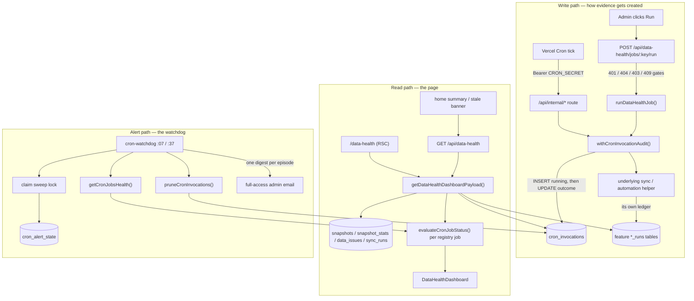

# Data Health

**Status: stable** — a handbook designation, not a code marker. No `@deprecated`, `TODO`, `FIXME`, or `HACK` exists under `src/lib/data-health/`, `src/app/api/data-health/`, `src/app/(app)/data-health/`, `src/components/data-health/`, or in `src/lib/internal/cron-watchdog.ts`, so maturity cannot be read off the source. The badge records that the page, both API routes, the audit wrapper, and the watchdog cron are all wired and registered: `/api/internal/cron-watchdog` is one of the 17 `crons` entries in `vercel.json` (`vercel.json:60-63`), and a regression test asserts the registry mirrors that file exactly (`src/lib/data-health/__tests__/cron-registry.test.ts:19-32`). Whether the crons are actually firing in production is a runtime fact this repository cannot attest.

## Purpose

Data Health is the operations command center for admin staff. It exists because the app runs 17 scheduled jobs across a dozen subsystems, each with its own run ledger, and nobody can tell from the domain pages whether the *machinery* behind them is alive. The page answers three questions in one place:

1. **Did each scheduled job actually fire, and did it succeed?** Every Vercel cron is declared in a typed registry (`src/lib/data-health/cron-registry.ts:47-399`) and evaluated against two kinds of evidence — *direct* proof (an audit row written by the route itself) and *inferred* proof (the job's own durable run table). A job with neither is `unknown`, never `healthy`.
2. **Is the data fresh enough to trust?** Nine per-domain freshness cards (`src/lib/data-health/dashboard.ts:483-593`) show last success, record counts, and issue counts for the tutor snapshot, Wise activity audit, post-class feedback, sales, competitor intelligence, credit control, leave requests, class assignments, and room utilization.
3. **What did normalization refuse to resolve?** Drill-down tables of unresolved aliases, modality issues, and unmapped tags from the active Wise snapshot — the fail-closed residue that keeps tutors out of "Available" in [Tutor Search](./tutor-search.md).

It also carries **manual run controls**: one button per registered job, session-gated, with a confirmation gate on the nine jobs flagged `dangerous` because they email people, write to Wise, append payout deductions, or push LINE messages to staff groups (`cron-registry.ts`, `dangerous: true` on nine entries; the LINE case is `line_credit_digest`, `:339-350`). Those buttons execute the real jobs, so the page is read-mostly, not read-only.

The **cron watchdog** (`src/lib/internal/cron-watchdog.ts`) is the push half of the feature. It is itself a registered 30-minute cron that re-runs the same health derivation and emails full-access admins once per failure episode, with a recovery notice when the job comes back (`cron-watchdog.ts:1-17`). It also carries the retention sweep for the audit table (`cron-watchdog.ts:380-385`).

Consumers, beyond the page:

- **Home hub** — `getHomeSummaryPayload` loads the full dashboard payload to build the Data Health action tile (count = late + failing) and the site-wide freshness block (`src/lib/home/summary.ts:187-188`, `:244-250`, `:254-279`).
- **Stale-snapshot banner** — `StaleSnapshotBanner` fetches `/api/data-health` once when the current path is `/search`, `/scheduler`, or `/compare` and reads only `staleAgeMs` (`src/components/layout/stale-snapshot-banner.tsx:18-28`, `:58-66`). It does not poll; the fetch runs in an effect keyed on the workspace-path flag with `AbortController` cleanup (`:36-76`).
- **Navigation** — the tool is in the Data & Audit section, pinned as a shortcut, with the `dataHealth` badge key (`src/lib/navigation/tools.ts:250-258`).

There is no role model beyond the admin session. `GET /api/data-health` gates on `auth()` alone (`src/app/api/data-health/route.ts:15-18`); the run route requires a session with an email and adds one capability check for post-class jobs (see [Business rules](#business-rules--edge-cases)). Restricted users reach the page when an `allowedPages` entry prefix-matches `/data-health`, which the middleware also applies to the `/api/data-health` namespace (`src/middleware.ts:36-37`, `:59-64`).

## Conceptual data model

Data Health **owns two tables** and **reads fourteen run ledgers plus the snapshot control plane**. Column-level detail, indexes, and the ER diagram for everything it owns or reads from the core spine are in [`docs/reference/database/erd-core.md`](../reference/database/erd-core.md) — §1 covers `snapshots`, `sync_runs`, `cron_invocations`, `cron_alert_state`, and `admin_users`; §4 covers `data_issues`, `snapshot_stats`, and `room_utilization_sessions`. The per-feature run ledgers live in their owners' ERDs, linked from [`docs/reference/database/index.md`](../reference/database/index.md).

**Owned**

- **`cron_invocations`** — one row per authenticated invocation of a registered job, whether Vercel fired it or an admin clicked Run. It is the *direct proof* that a route was reached. The row is inserted with `outcome: "running"` before the handler executes and updated from the response afterwards, so a function killed by the platform timeout leaves a stranded `running` row rather than nothing (`src/lib/data-health/cron-audit.ts:131-159`, `:161-189`). `linkedRunIds` opportunistically joins the invocation to the domain run row it produced (`cron-audit.ts:37-59`). The table is append-only in practice; the watchdog prunes rows older than 90 days that are also outside the newest-8-per-job read window (`src/lib/data-health/cron-retention.ts:16`, `:32-55`). Created by `drizzle/0038_data_health_cron_invocations.sql`.
- **`cron_alert_state`** — one row per job the watchdog has alerted on, keyed by job key, recording the open failure episode and whether the recovery notice has gone out (`src/lib/db/schema.ts:501-514`). It doubles as the watchdog's single-flight lock: a sentinel row keyed `__watchdog_sweep_lock` is claimed by conditional upsert because neon-http has neither transactions nor advisory locks (`cron-watchdog.ts:42-51`, `:305-330`). Created by `drizzle/0043_abandoned_jetstream.sql`.

**Read — snapshot control plane**

- **`sync_runs`** — the Wise snapshot sync ledger. Its newest `success` and `failed` rows supply the "last successful / last failed Wise sync" pair and the `staleAgeMs` every consumer keys off (`dashboard.ts:902-914`, `:966-968`).
- **`snapshots`** and **`snapshot_stats`** — the single `active = true` snapshot and its roll-up counters (teachers, identity groups, resolved/unresolved, issue totals, issues-by-type) (`dashboard.ts:916-950`).
- **`data_issues`** — every issue row for the active snapshot, projected to `type` / `entityName` / `message` and split three ways: `alias` → unresolved aliases, `modality` + `conflict_model` → modality issues, `tag` → unmapped tags (`dashboard.ts:952-960`, `:413-429`). The other enum values (`completeness`, `sync`) are counted in `issuesByType` but have no drill-down table.

**Read — run ledgers, as health evidence and run history**

Fourteen tables are fetched in one `Promise.all` (`dashboard.ts:752-806`): `sync_runs`, `wise_activity_sync_runs`, `sales_dashboard_import_runs`, `sales_dashboard_projection_import_runs`, `competitor_sync_runs`, `credit_control_sync_runs`, `leave_request_sync_runs`, `progress_test_sync_runs`, `progress_test_admin_digest_runs`, `post_class_sync_runs`, `post_class_notification_runs`, `classroom_assignment_runs`, `classroom_admin_email_runs`, and `room_utilization_sessions`. Each is the *inferred proof* for the job that writes it, and eleven of them also feed the unified run history (`dashboard.ts:620-750`). The `classroom_assignment_runs` read is filtered to automation-batch or `cron%`-created rows so an admin's ad-hoc assignment run cannot stand in as cron proof (`dashboard.ts:780-785`).

**Read — recipients**

- **`admin_users`** — the watchdog emails only rows with `allowedPages IS NULL`, i.e. full-access admins who can open the `/data-health` link the email points at (`cron-watchdog.ts:257-269`).

One consequence worth stating plainly: the manual-run buttons execute the underlying jobs, and whatever those jobs write, one click from this page writes. `classroom_morning` runs the assignment automation and Wise location publish; `post_class_feedback_payout_accrual` appends real payout deductions (`cron-registry.ts:245-256`); the two tutor reminders and the admin digests send email; `line_credit_digest` pushes to registered LINE staff groups (`:339-350`).

## API surface

Both endpoints are admin-session. Full request/response contracts and status codes are in [`docs/reference/api/data-health.md`](../reference/api/data-health.md); this table gives purpose only.

| Endpoint | Purpose |
|---|---|
| `GET /api/data-health` | The whole ops payload: overall roll-up, per-job cron health, domain freshness, Wise snapshot fidelity, issue drill-downs, unified run history, and the manual-action list. Also the source of the compatibility fields (`staleAgeMs`, `lastSuccessfulSync`, `recentSyncs`, …) the banner and older callers read (`src/lib/data-health/types.ts:132-151`). Handler `src/app/api/data-health/route.ts:14-26`. |
| `POST /api/data-health/jobs/[jobKey]/run` | Run one registered job now, in-process, under the caller's session. Session-, registry-, capability-, and confirmation-gated — the *why* of each gate is under [Business rules](#business-rules--edge-cases); the body shape and status-code ladder are in the reference linked above. Carries an 800s function budget so a manual full Wise sync survives (`src/app/api/data-health/jobs/[jobKey]/run/route.ts:11`). |

Two routes outside this prefix are part of the same mechanism:

- **`GET|POST /api/internal/cron-watchdog`** — the alerting sweep, `CRON_SECRET`-gated, `maxDuration = 300` (`src/app/api/internal/cron-watchdog/route.ts:7-34`). Contract in [`docs/reference/api/internal-crons.md` — Cron watchdog](../reference/api/internal-crons.md#cron-watchdog); schedule and shared cron mechanics in [`docs/reference/crons.md`](../reference/crons.md).
- **`POST /api/admin/sync-wise`** — the session-gated Wise sync trigger is audit-wrapped with `jobKey: "wise_snapshot"`, `triggerSource: "admin"` (`src/app/api/admin/sync-wise/route.ts:15-23`), so its runs appear on this page as admin invocations.

Every `/api/internal/*` cron route except `student-promotions/july-1` wraps its handler in `withCronInvocationAudit` — 21 internal route files plus `admin/sync-wise` import it at HEAD — which is what makes direct proof available at all.

## UI

**Page** — `src/app/(app)/data-health/page.tsx`. The default export is a synchronous Server Component whose only job is the `<Suspense>` boundary and its skeleton (`page.tsx:35-41`). The async child `DataHealthBody` re-checks the session and redirects to `/login` without one, awaits `getDataHealthDashboardPayload()`, and hands the payload to the client shell as `initialData` (`page.tsx:7-13`). The skeleton mirrors the header, banner, two-column, and table layout (`page.tsx:15-33`).

**Client shell** — `src/components/data-health/data-health-dashboard.tsx`, `"use client"`. It holds the payload in state, re-fetches `GET /api/data-health` on Refresh with a shape guard before accepting the response (`data-health-dashboard.tsx:449-468`, guard at `:85-87`), and dispatches manual runs (`:470-498`). Status vocabulary and colours: `healthy`, `running`, `late`, `failing`, `manual-only`, `unknown` (`:32-48`). All timestamps render in Bangkok time via `formatBangkokDateTime` (`:59-71`).

Sections, top to bottom:

| Section | Component | Shows |
|---|---|---|
| Header | inline | Checked-at time and the active snapshot id prefix; Refresh button disabled while a job is running (`:502-513`) |
| Overall banner | inline | Headline + detail line and six counters — healthy / late / failing / running / unknown / manual (`:527-547`) |
| Next expected cron | `Timeline` | One card per **scheduled** job only (`:101`): cadence, status badge, a decorative progress bar, last seen, next expected (`:100-149`) |
| Manual controls | `QuickActions` | One button per entry in `manualActions` — all 22 registry keys (`:167-180`); dangerous jobs styled amber with a shield icon; all buttons disabled while any job is busy (`:173`) |
| Cron control plane | `CronControlPlane` | Every registry job: path, status, proof (Direct / Inferred / None) with the health detail sentence, last seen, last and next expected, duration, error (`:186-235`) |
| Data freshness | `DataFreshness` | The nine domain cards with freshness label, record-count label, and an amber "N issues need attention" strip when `issueCount > 0` (`:237-274`) |
| Wise snapshot fidelity | `WiseSnapshot` | Six counters (teachers, identity groups, resolved, unresolved, future sessions, total issues — unresolved and total issues tinted amber when non-zero, `:292`, `:294`; the tint is `HealthMetric`'s `late` colour at `:93`), last successful/failed sync, last failure error, issues-by-type badges (`:276-326`) |
| Normalization issues | `NormalizationIssues` → three `IssueTable`s | Unresolved aliases · Modality issues (each row tagged `group` or `session`) · Unmapped tags; each table capped at 80 rows (`:328-384`, cap at `:352`, tag at `:356-360`) |
| Unified run history | `RecentRuns` | The 30 most recent runs across eleven ledgers with status, times, duration, a per-ledger count label, and error (`:386-436`) |
| Proof footer | inline cards | Counts of direct-proof and inferred-proof jobs, and a Wise-stale yes/no at the 90-minute threshold (`:562-584`, threshold at `:582`) |

The dangerous-job confirmation is a `window.confirm` showing the registry's `confirmationLabel`; the request then carries `confirmed: action.dangerous` so a non-dangerous job never sends `true` and a dangerous one always does (`:473-485`). The server enforces the same gate independently.

## Data flow

The whole page is one server function, `getDataHealthDashboardPayload()` (`src/lib/data-health/dashboard.ts:899-1015`), which gathers three independent evidence sets and folds them through a pure status evaluator per registry job.

1. **Snapshot leg** — newest `success` and `failed` `sync_runs`, the `active` snapshot, its `snapshot_stats`, and all `data_issues` for that snapshot (`dashboard.ts:902-961`).
2. **Invocation leg** — the newest 8 `cron_invocations` **per job key**, via `row_number() OVER (PARTITION BY job_key ORDER BY received_at DESC)`, scanning only the last 45 days (`dashboard.ts:812-845`). The function's JSDoc justifies the per-key ranking by recording that a global `LIMIT` used to let chatty half-hourly jobs push a daily job's only invocation out of the window within hours (`:822-827`), and the constant's JSDoc justifies the 45-day cap as avoiding a rank over the whole unbounded append-only table on every page load (`:814-819`). Both are the comments' account of prior behaviour; nothing at HEAD exhibits it. A missing table degrades to an empty list and inferred proof, not a 500 (`:846-853`).
3. **Run leg** — the fourteen ledgers in one `Promise.all`, 8 rows each except `post_class_notification_runs` at 32 (one sweep spans four notification kinds) and `room_utilization_sessions` at 1 (`dashboard.ts:752-806`, `RECENT_LIMIT` at `:17`).

Per job, `pickJobRuns()` selects that job's run evidence — latest run, latest successful, latest failed, currently running (`dashboard.ts:142-341`) — and `evaluateCronJobStatus()` combines it with the invocation evidence and the expected schedule window into a status, a proof source, and timestamps (`src/lib/data-health/status.ts:195-363`). `buildDomains`, `buildRecentRuns`, and `overallFromJobs` then shape the rest of the payload (`dashboard.ts:483-593`, `:620-750`, `:856-886`).

```mermaid
flowchart TD
    subgraph write["Write path — how evidence gets created"]
      VC["Vercel Cron tick"] -->|"Bearer CRON_SECRET"| IR["/api/internal/* route"]
      AB["Admin clicks Run"] --> RJ["POST /api/data-health/jobs/:key/run"]
      RJ -->|"401 / 404 / 403 / 409 gates"| RDJ["runDataHealthJob()"]
      IR --> WRAP["withCronInvocationAudit()"]
      RDJ --> WRAP
      WRAP -->|"INSERT running, then UPDATE outcome"| CI[("cron_invocations")]
      WRAP --> JOB["underlying sync / automation helper"]
      JOB -->|"its own ledger"| RUNS[("feature *_runs tables")]
    end

    subgraph read["Read path — the page"]
      PAGE["/data-health (RSC)"] --> PAY["getDataHealthDashboardPayload()"]
      API["GET /api/data-health"] --> PAY
      HOME["home summary / stale banner"] --> API
      PAY --> CI
      PAY --> RUNS
      PAY --> SNAP[("snapshots / snapshot_stats / data_issues / sync_runs")]
      PAY --> EVAL["evaluateCronJobStatus() per registry job"]
      EVAL --> UI["DataHealthDashboard"]
    end

    subgraph alert["Alert path — the watchdog"]
      WD["cron-watchdog :07 / :37"] --> PRUNE["pruneCronInvocations()"]
      PRUNE --> CI
      WD --> CJH["getCronJobsHealth()"]
      CJH --> EVAL
      WD --> LOCK["claim sweep lock"]
      LOCK --> CAS[("cron_alert_state")]
      WD -->|"one digest per episode"| MAIL["full-access admin email"]
    end
```

The registry is the join key. `CRON_JOBS` (`cron-registry.ts:47-399`) declares 22 jobs; the `CronJobDefinition` field shape (`:27-45`) and the row-by-row table are in [`docs/reference/crons.md` — Cron registry](../reference/crons.md#cron-registry-authoritative), and how the evaluator consumes those fields is in [§3 Health derivation](../reference/crons.md#3-health-derivation). What matters here is that one declaration feeds five consumers — this payload (`dashboard.ts:5`), the status evaluator (`status.ts:1`), the audit wrapper (`cron-audit.ts:4`), the watchdog (`cron-watchdog.ts:26`), and the manual-run route and runner (`jobs/[jobKey]/run/route.ts:3`, `run-job.ts:25`) — so a registry field that drifts from the route it describes is wrong everywhere at once. `SCHEDULED_CRON_JOBS` is the 17 with `manualOnly === false` (`:401`). Three tests hold it honest: the scheduled set must equal `vercel.json` on `{path, schedule}` (`cron-registry.test.ts:19-32`), every entry's `path` must resolve to a real `route.ts` (`:50-56`), and every entry's `maxDurationSeconds` must equal the route's exported `maxDuration`, read as text (`:62-73`). The comments around that last test name the credit-control case: the route header records why it moved from 300s to 800s (`src/app/api/internal/sync-credit-control/route.ts:7-13`), the status test records that a 300s registry value used to report healthy 372–390s production runs as `failing` (`status.test.ts:120-122`), and the registry entry and the mirror test both state the general rule — a registry number below the route's reports a legitimate long run as `failing` (`cron-registry.ts:119-121`; `cron-registry.test.ts:58-61`). That is the comments' narrative of prior behaviour; which change closed the drift, and in what order, is not something HEAD can attest.

## Business rules & edge cases

**Proof hierarchy: direct beats inferred, and no evidence is not "fine".**
`proof` is `direct` when a `cron_invocations` row with `triggerSource === "cron"` exists, `inferred` when only a run-table row exists, `none` otherwise (`status.ts:218-221`). Only *cron*-sourced invocations count as direct proof for lateness — an admin's manual run is shown in the job's recent invocations but does not stand in for the scheduler (`dashboard.ts:437-447`). A scheduled job with `proof === "none"` is `unknown`, never `healthy` (`status.ts:278-294`), and `unknown` is alertable (`cron-watchdog.ts:53`).

**Status ladder, in evaluation order** (`status.ts:195-363`):
1. `manual-only` short-circuits before any lateness math when the registry says `manualOnly: true` (`:199-216`).
2. `failing` — a run has been `running` past `maxDurationSeconds + 60s` (`:238-258`; buffer at `:6`). The number is the **registry's** `maxDurationSeconds`, which is why the mirror test exists.
3. `running` — an in-flight direct invocation or run row (`:260-276`).
4. `unknown` — no proof at all (`:278-294`).
5. `failing` — the latest failure is newer than the latest success, or the latest direct invocation / latest run is itself a failure (`:296-312`).
6. `late` — interval jobs: last evidence older than `lateAfterMinutes`; calendar jobs: the last expected window has closed plus `lateAfterMinutes` and nothing was seen at or after its start (`:314-344`).
7. `healthy` (`:346-362`).

**Interval vs calendar windows.** `expectedWindowForJob` branches on registry hints (`status.ts:167-176`): `expectedBangkokWeekday` → weekly Bangkok window (`:137-165`); `expectedBangkokMinute` or `…WindowStartMinute` → daily Bangkok window (`:111-135`); otherwise interval, which parses the **minute field only** of the cron string (`*/N` or a comma list) and scans ±2 hours (`:57-92`). The daily branch anchors to today's Bangkok window rather than "24 hours ago", so a job that fired at 06:41 is not late at 06:20 the next morning (`:119-134`; pinned by `status.test.ts:58-76`). The classroom admin email declares a *window* (07:04–07:36 Bangkok) rather than an instant because its schedule has four minute values (`cron-registry.ts:294-304`). Interval parsing is safe today only because every hour-scoped job also carries a Bangkok hint; see [Open questions](#open-questions).

**A `skipped` invocation is success for health purposes.** `determineOutcome` maps body `skipped: true` or an "already running" error message to `skipped`, `ok: false` / `success: false` to `failed`, HTTP 202 to `skipped`, HTTP ≥ 400 to `failed`, else `success` (`cron-audit.ts:108-117`). `evaluateCronJobStatus` treats `skipped` like `success` when computing `lastSuccessAt` (`status.ts:227-230`) — a single-flight skip is still proof the route fired. A job that skips forever because its own ledger holds a stale `running` row is caught by the run-table side: that row becomes `runningRun`, and rule 2 flips the job to `failing` once `maxDuration + 60s` passes.

**Audit writes never block the job.** `startInvocation` and `finishInvocation` catch and `console.error` their own failures (`cron-audit.ts:155-158`, `:186-188`). A handler that throws is converted to a synthetic `500 { error }`, audited as `failed`, and returned (`:200-205`). The response body persisted to `metadata.response` is a size-capped digest — scalars kept, strings truncated to 200 chars, arrays and objects collapsed to their size, whole digest capped at 2 KB (`cron-audit.ts:61-106`). The JSDoc's stated reason is that every invocation used to persist the whole body verbatim, so one chatty backfill route could write megabytes a day into an append-only table (`:70-80`); that prior behaviour is the comment's account, not something observable at HEAD.

**Retention is conservative by construction.** `pruneCronInvocations` deletes a row only when it is *both* older than 90 days *and* outside the newest 8 for its job key, so an annual job keeps its proof forever (`cron-retention.ts:1-8`, `:32-55`). It runs at the start of every watchdog sweep in its own try/catch, so a failed prune can never suppress an alert digest (`cron-watchdog.ts:380-388`). The 90-day horizon is deliberately clear of the dashboard's 45-day read window (`cron-retention.test.ts:72-75`).

**Per-job evidence selection is hand-mapped, and two jobs deliberately have none.**
`pickJobRuns` names 16 keys explicitly (`dashboard.ts:161-315`). Two of them return no run evidence on purpose:
- `student_promotions_july_1` — its route is not audit-wrapped and its run table mixes admin drafts with the cron apply, so borrowing generic evidence would report a Wise-writing cron as healthy without it ever firing. It reads `unknown`, which is alertable (`dashboard.ts:274-286`).
- `cron_watchdog` — no domain run table; its health comes solely from its own audit rows (`dashboard.ts:306-315`).

Everything else falls to a fallback that treats the newest `room_utilization_sessions` row as a successful run (`dashboard.ts:317-340`). The comment says only `room_utilization` reaches it; at HEAD six keys do — see [Open questions](#open-questions).

**Per-feature status quirks encoded in the reader.**
- Post-class feedback trusts `metadata.outcome === "partial"` over the raw run status (`dashboard.ts:393-398`); the JSDoc records that before this change every run read `partial`, `lastSuccessAt` never matched, and the collector looked as if it had never succeeded (`:386-392`) — the comment's account of prior behaviour, not observable at HEAD. A `partial` run surfaces its `sourceIssueCount` as the error summary (`:400-411`).
- The progress-tests digest counts a `skipped` run (nothing to report) as proof it fired (`dashboard.ts:225-233`).
- Post-class notification runs map `cancelled` to success and `pending`/`sending` to running (`dashboard.ts:373-384`); the three notification job keys are split from one table by `kind` (`:248-272`).
- Generic success statuses are `success | sent | completed | published`; failed are `failed | partial`; running are `running | pending` (`dashboard.ts:112-133`).
- Classroom morning runs never report `running` (`dashboard.ts:293`).

**Overall roll-up ignores manual-only jobs.** The worst status is taken across scheduled jobs by `statusRank` (`cron-registry.ts:407-414`), and a roll-up that would be `unknown` with at least one healthy job is reported `healthy` (`dashboard.ts:865-868`). The six counters, however, count every job including manual-only (`:857-864`).

**Manual-run gating.** The run route (`src/app/api/data-health/jobs/[jobKey]/run/route.ts:13-44`) refuses four ways before it dispatches, and each refusal has a reason the code makes visible:
- A session **with an email** is required, not just any session, because the actor's email becomes the `triggerSource: "admin"` invocation row's actor and is forwarded to every domain helper as the human who triggered the run (`src/lib/data-health/run-job.ts:35-41`).
- The key must be a registry entry — the registry, not the runner, defines what counts as a job (`getCronJobDefinition`, `:20-23`).
- Any `post_class_feedback*` key defers to the post-class feature's own access model (`getPostClassCapabilities`) and requires its `access_manager` capability rather than the bare admin session (`:25-30`; capability resolved by `src/lib/post-class-feedback/access.ts:129`).
- A `dangerous` job requires an explicit `confirmed: true` because those nine jobs act outside this app — email, Wise writes, payout deductions, LINE pushes — and the server re-checks the registry flag itself rather than trusting the client's `window.confirm` (`:33-41`).

The status-code ladder, body shape, and response contract are in [`docs/reference/api/data-health.md`](../reference/api/data-health.md) and [`docs/reference/crons.md` — From the Data Health job runner](../reference/crons.md#from-the-data-health-job-runner); this doc does not restate them. A request that clears all four gates dispatches to `runDataHealthJob`, which wraps the branch in `withCronInvocationAudit` with `triggerSource: "admin"` and the actor's email (`run-job.ts:35-41`).

The runner passes `triggerType: "manual"` into every domain helper that accepts one (`run-job.ts:53`, `:68`, `:85`, `:108`, `:129`, `:156`), so both the invocation row and the domain run row record that a human triggered it. Single-flight collisions surface as 409 (`:57-59`, `:95`, `:116`); a reminder job whose readiness checkpoint has unreconciled sessions returns 503 rather than emailing (`:131-137`).

**Seven manual buttons are wired to nothing.** `manualActions` is built from the whole registry (`dashboard.ts:989-994`) and `canRunManually` is hard-coded `true` (`:474`), but `runDataHealthJob` dispatches 15 of the 22 keys (`run-job.ts:43-205`). `progress_tests`, `progress_tests_digest`, `post_class_feedback_backfill`, `student_promotions_july_1`, `admissions_notifications`, `line_credit_digest`, and `line_backlog_recovery` pass the route's registry check and hit the fallthrough `404 { "error": "Unknown job" }` (`:207`). Because that 404 is produced *inside* the audit wrapper, the click also writes a `failed` `cron_invocations` row for the job it failed to run (`cron-audit.ts:115`). `post_class_feedback_backfill` is stopped earlier by the capability gate for anyone lacking `access_manager` (403, no audit row); only an access manager reaches the 404.

**Parked jobs are `manual-only`, never `late`.** The post-class admin digest and the two tutor reminders exist as routes but have no `vercel.json` entry, so they are registered with `schedule: null, manualOnly: true` and stay runnable from this page without being reported late (`cron-registry.ts:189-236`). `room_utilization` and `line_backlog_recovery` are manual-only for the same reason (`:369-398`); only the former has a runner branch. The payout accrual is **not** parked at HEAD — it is scheduled hourly, `dangerous`, and confirm-gated (`:237-257`; `vercel.json:40-43`).

**Watchdog rules** (`src/lib/internal/cron-watchdog.ts`):
- Alertable statuses are `failing | late | unknown` (`:53`). `checked` excludes manual-only jobs and the watchdog itself (`:159-178`).
- Episode dedup: a new alert is sent only when no state row exists or the last episode closed with `recovered`; a recovery notice is sent only for a healthy job whose episode is still `alerted` (`:169-176`). Episode state is written **after** at least one recipient accepted the email, so a total delivery failure retries next sweep (`:482-485`, `:494-519`). Partial delivery still closes the episode — a documented tradeoff against re-emailing everyone every 30 minutes for one bouncing address (`:11-17`, `:486-492`).
- Single-flight: the sweep claims the sentinel `cron_alert_state` row via one conditional upsert whose `setWhere` allows takeover only when the previous holder released it or went stale after 6 minutes (`:51`, `:305-330`); release matches on the claim token so a stale-reclaim race cannot release someone else's lock (`:333-350`). A second sweep in flight skips with `skippedReason: "another sweep is in flight"` (`:419-429`).
- Missing `cron_alert_state` (pg `42P01`, detected on the error and its `cause`) disables alerting for the sweep rather than sending un-deduped mail; the route still returns 200 with the reason (`:278-296`, `:403-417`).
- **Synthetic job.** The sweep appends `post_class_payout_window`, derived from `loadPayoutWindowStaleness`, so a payout window left un-finalized past its anchor month's end alerts even though the accrual cron itself fired on time (`:84-123`; `src/lib/post-class-feedback/payout-window-health.ts:20-24`). The loader returns `null` while the accrual entry has no schedule, so the check arms itself when the registry does (`payout-window-health.ts:98-102`). A throw inside it degrades to "no payout entry this sweep" (`cron-watchdog.ts:125-143`).
- The digest links to `${APP_BASE_URL}/data-health` and escapes every job field before rendering HTML (`:180-255`).

**Staleness thresholds.** `dataHealthSummaryIsStale` uses the shared 90-minute API threshold (`dashboard.ts:1017-1019`; `src/lib/ops/stale.ts:2`, `:11-13`); the user-facing banner uses a separate 2-hour threshold (`stale.ts:3`, `:15-17`). Staleness is a warning, never withheld data.

**Modality issue counting (MOD-03 / D-10).** The "Modality issues" table deliberately merges group-level `modality` issues (from `deriveModality`) with session-level `conflict_model` issues (from `detectSessionModalityConflict`) into one admin-facing number (`src/app/api/data-health/modality-counter.ts:1-31`; the live payload applies the same filter at `dashboard.ts:418-424`), and the UI tags each row `group` or `session`. The module comment records that the counter is expected to rise after MOD-01 as surface-of-reality per D-11, not as a regression (`modality-counter.ts:9-10`). The helper lives in its own module so Vitest can import it without the Next/auth route graph (`:12-15`).

## Tests

All under `src/**/__tests__/`, in the `unit` Vitest project.

| File | Covers |
|---|---|
| `src/lib/data-health/__tests__/cron-registry.test.ts` | Scheduled registry equals `vercel.json` on sorted `{path, schedule}`; admissions-notifications is a scheduled daily GET job; room utilization is not scheduled; every registry `path` resolves to a real `route.ts`; every `maxDurationSeconds` mirrors the route's exported `maxDuration`. |
| `src/lib/data-health/__tests__/status.test.ts` | Inferred proof before audit rows accumulate; interval lateness; daily Bangkok window without a rolling-24h shortcut; weekly competitor window healthy and late (with `lateAfterAt`); stuck-past-`maxDuration + 60s` → `failing` for credit control at 800s; recovery after a later success. |
| `src/lib/data-health/__tests__/cron-audit.test.ts` | `buildResponseDigest`: scalars kept, 200-char string truncation, arrays/objects collapsed to size, non-object → `{}`, 2 KB cap with `truncated: true`, small bodies untouched. |
| `src/lib/data-health/__tests__/cron-retention.test.ts` | 90-day cutoff; cutoff is clear of the 45-day read window; prune deletes against the ranked subquery and returns the count; zero when nothing is eligible. |
| `src/lib/data-health/__tests__/migration.test.ts` | `drizzle/0038_data_health_cron_invocations.sql` creates the table and its three dashboard indexes. |
| `src/app/api/data-health/__tests__/route.test.ts` | 401 unauthenticated; v2 payload with the stale-banner compatibility fields preserved; 500 JSON when aggregation throws. |
| `src/app/api/data-health/__tests__/modality-counter.test.ts` | `modality` + `conflict_model` merged under one counter, including the session-only case; `entityName`/message preserved; null `entityName` coerced to `""`. |
| `src/app/api/data-health/jobs/[jobKey]/run/__tests__/route.test.ts` | Admin session required; non-dangerous run; 409 without confirmation; confirmed dangerous run; 404 unknown job; `access_manager` gate on post-class jobs in both directions. |
| `src/components/data-health/__tests__/data-health-dashboard.test.tsx` | One static render (`:146-158`) asserting most section headings — Next expected cron, Manual controls, Cron control plane, Wise snapshot fidelity, Unified run history — plus the page title, one proof-footer label (`Direct audit`), one domain label (`Room Utilization`), and the `manual only` badge. Data freshness, the three normalization-issue tables, and the other proof labels are not asserted. |
| `src/lib/internal/__tests__/cron-watchdog.test.ts` | `sweepCronJobs` classification (failing/late/unknown, self- and manual-only exclusion, episode dedup, re-failure as a new episode, recoveries); digest email content, recovery subject, HTML escaping; `runCronWatchdog`: alert once, no duplicate while open, late and unknown alerts, recovery re-arms, never self-alerts, unmarked episode when no recipient reachable, lock claim/release, skip when another sweep holds the lock, missing-table fail-safe (drizzle-wrapped and bare), rethrow of unrelated errors, payout-window alert and recovery, no payout entry when the loader yields nothing, sweep survives a payout-check throw, retention count reported, alerting survives a prune throw. |
| `src/__tests__/vercel-crons.test.ts` | Pins the 17 `vercel.json` entries and their stagger; complements the registry mirror test from the other side. |

No integration test exercises `getDataHealthDashboardPayload` against a real database; the payload builder is covered only indirectly through the mocked route test.

## Open questions

- **The run-evidence fallback comment undercounts what reaches it.** `pickJobRuns` ends with "Only room_utilization reaches this fallback; every scheduled job above maps to its own run table" (`dashboard.ts:317-319`), but six keys have no explicit branch and land there: `post_class_feedback_backfill`, `post_class_feedback_payout_accrual`, `admissions_notifications`, `line_credit_digest`, `room_utilization`, `line_backlog_recovery`. Four of those are **scheduled**. For them the newest `room_utilization_sessions` row becomes `latestRun` and `latestSuccessfulRun` (`:320-340`), so `lastSuccessAt` is misattributed and, whenever no direct `cron_invocations` row is in the 45-day window, the job reads `late` or even `healthy` (if someone recently ran the utilization sync) instead of `unknown` — the substitution the comment says cannot happen. All four routes are audit-wrapped, so direct proof normally wins in practice. Should they get explicit no-evidence branches like `student_promotions_july_1`, or their own run-table mappings?
- **Seven manual buttons are rendered for jobs the runner cannot run.** `manualActions` publishes all 22 keys and `canRunManually` is hard-coded `true` (`dashboard.ts:474`, `:989-994`) while `runDataHealthJob` implements 15 (`run-job.ts:43-205`). Clicking `progress_tests`, `progress_tests_digest`, `post_class_feedback_backfill`, `student_promotions_july_1`, `admissions_notifications`, `line_credit_digest`, or `line_backlog_recovery` yields 404 and a `failed` audit row for the job it did not run (`run-job.ts:207`; `cron-audit.ts:115`). Should the payload filter `manualActions` to dispatchable keys, or should the missing branches be added? Several are `dangerous` write paths, which may be why they were left out. Note that the manual-only `line_backlog_recovery` therefore has no invocation path at all except a direct `CRON_SECRET` call.
- **`student_promotions_july_1` is `unknown` forever by design.** With no run evidence (`dashboard.ts:274-286`) and no audit wrapper on its route, it is permanently alertable; episode dedup means one email, then silence until a recovery that cannot happen. Is a permanently open alert episode the intended steady state, or should the annual job be given evidence (audit-wrap the route) or excluded from the sweep?
- **Interval health reads only the minute field.** `minutesFromSchedule` ignores hour/day/month (`status.ts:57-69`). Safe today because every job with a non-`*` hour field also sets a Bangkok hint routing it to the daily or weekly branch. Should the registry type or a test enforce that invariant so a future hour-scoped cron without a hint cannot silently get a wrong expected window?
- **The stale banner and home hub pay for the whole payload.** Both call the full `getDataHealthDashboardPayload` / `GET /api/data-health` — 14 ledger queries, the windowed invocation query, and the snapshot leg — to read `staleAgeMs` or six counters (`stale-snapshot-banner.tsx:58-66`; `home/summary.ts:187-188`). Is a lighter "freshness only" read intended, or is the cost acceptable at current scale?
- **`selectModalityIssues` is re-exported from the route with zero importers.** `route.ts:4-11` wraps the helper from `modality-counter.ts`, `dashboard.ts:418-424` duplicates the filter inline, and the test deliberately imports `../modality-counter`, not `../route` (`modality-counter.test.ts:2-7`) — its header says the wrapper exists only so "acceptance greps on the route module still pass". Nothing in `src/` imports the route export; it is grep-only dead code, tracked as DEAD-14 in [`docs/OPEN-QUESTIONS.md`](../OPEN-QUESTIONS.md). Is the re-export still needed, or is it dead?
- **`post_class_payout_window` is alert-only.** The watchdog synthesizes it at sweep time (`cron-watchdog.ts:91-123`), so it can trigger emails but never appears on `/data-health`. Deliberate, or should the page surface it too?
- **Two ledgers are fetched but only partly surfaced.** `progress_test_sync_runs` and `progress_test_admin_digest_runs` feed cron health (`dashboard.ts:216-233`) but have no freshness card and no run-history rows; `room_utilization_sessions` gets a card but no run-history rows (`:620-750`). Deliberate scoping, or omissions?
- **The `Timeline` progress bar is decorative.** Bar width is fixed per status — 78% healthy, 52% running, 100% otherwise (`data-health-dashboard.tsx:131`) — and does not reflect time until the next expected run. Is it meant to become a real countdown?

_Verified against main@0cd1e81 (clean tree) on 2026-09-02._
