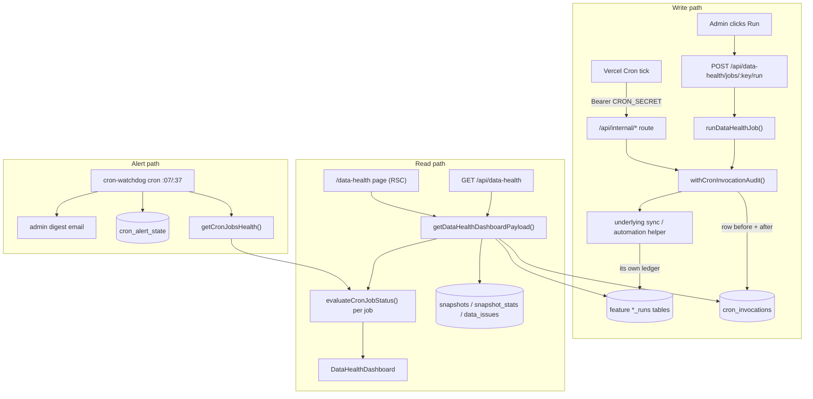

# Data Health

**Status: wired end to end at HEAD** — the page, both API routes, and the watchdog cron all exist and are registered; `/api/internal/cron-watchdog` is entry 14 of the 15 `crons` in `vercel.json` (`vercel.json:55-58`). Whether those crons are actually firing in production is a runtime fact this repository cannot attest.

## Purpose

Data Health is the admin-facing operations command center. It answers three questions on one page:

1. **Did the scheduled jobs actually fire?** Every Vercel Cron entry is declared in a typed registry and evaluated against direct invocation audit rows or, failing those, the job's own durable run table.
2. **Is the data fresh enough to trust?** Per-domain freshness cards (tutor snapshot, Wise audit, post-class feedback, sales, competitor intelligence, credit control, leave requests, class assignments, room utilization) with last-success time, record counts, and issue counts.
3. **What did normalization refuse to resolve?** Drill-down tables of unresolved aliases, modality issues, and unmapped tags from the active Wise snapshot — the fail-closed residue that keeps tutors out of "Available".

It also carries **manual run controls**: a button per registered job, session-gated, with a confirmation gate on jobs that send email, write to Wise, or move money. That third category is real, not hypothetical: `post_class_feedback_payout_accrual` is flagged `dangerous` because it "Appends real payout deductions to the master ledger" (`cron-registry.ts:234-247`), a Sheets/finance write rather than an email or a Wise call. The button grid is built from the whole registry, but only 14 of the 21 registered keys are actually implemented in the job runner — see [Seven manual controls are wired to nothing](#business-rules--edge-cases).

The consumers are BeGifted admin staff (the `admin_users` allowlist), plus two machine consumers that reuse the same payload: the home hub summary (`src/lib/home/summary.ts:187-188`, `:244-249`) for its status tiles, and the stale-snapshot banner (`src/components/layout/stale-snapshot-banner.tsx:58`), which reads `/api/data-health` for `staleAgeMs` alone. The banner does **not** poll — a single `fetch` fires from a `useEffect` keyed on whether the current path is a workspace path (`:36`, `:76`), with `AbortController` cleanup (`:72-75`); there is no interval anywhere in the file.

The **cron watchdog** (`src/lib/internal/cron-watchdog.ts`) is the push half of this feature: it is itself a registered 30-minute cron that re-runs Data Health's status derivation and emails admins when a job turns unhealthy.

## Conceptual data model

Data Health is read-mostly. It **owns** two tables and **reads** everyone else's run ledgers.

| Table | Owned? | Role |
|---|---|---|
| `cron_invocations` | owned | One row per authenticated invocation of a registered job, cron or admin — the *direct proof* that Vercel actually reached the route. Inserted before the handler runs and updated from the response afterwards (`cron-audit.ts:84-142`). |
| `cron_alert_state` | owned (watchdog) | Per-job alert-episode state so one failure episode produces one email, not one per sweep. Also holds the watchdog's single-flight sweep-lock sentinel row. |
| `snapshots`, `snapshot_stats`, `data_issues` | read | Active Wise snapshot identity, roll-up counters, and the unresolved-issue drill-downs. |
| `sync_runs` | read | Wise snapshot sync ledger; also the source of truth for snapshot staleness. |
| `wise_activity_sync_runs`, `sales_dashboard_import_runs`, `sales_dashboard_projection_import_runs`, `competitor_sync_runs`, `credit_control_sync_runs`, `leave_request_sync_runs`, `progress_test_sync_runs`, `progress_test_admin_digest_runs`, `post_class_sync_runs`, `post_class_notification_runs`, `classroom_assignment_runs`, `classroom_admin_email_runs`, `room_utilization_sessions` | read | Per-feature durable run evidence — used as *inferred proof* when no audit row exists yet, and as the unified run-history table. |
| `admin_users` | read | Watchdog recipient list, restricted to full-access admins. |

Column-level detail, indexes, and ER diagrams live in the reference: [`docs/reference/database/erd-core.md`](../reference/database/erd-core.md) covers snapshots, `sync_runs`, `snapshot_stats`, `data_issues`, `cron_invocations`, and `admin_users`; the sidecar run tables are in the per-domain ERDs linked from [`docs/reference/database/index.md`](../reference/database/index.md).

Data Health's *own* writes are limited to audit rows (`cron_invocations`) and watchdog alert state (`cron_alert_state`) — but the manual-run buttons execute the real jobs, so the page is not read-only in effect. `classroom_morning` is the clearest case: the button dispatches to `runClassroomMorningAutomation()` (`run-job.ts:153-161`), which builds a live Wise client (`morning-automation.ts:190`) and calls `publishClassroomAssignmentRun()` (`morning-automation.ts:208`) → `updateSessionLocation()` (`src/lib/classrooms/data.ts:1687`, `src/lib/wise/fetchers.ts:410`), publishing eligible `OFFLINE` session locations back to Wise. Whatever the underlying job writes, one click from this page can write.

## API surface

| Method | Path | Purpose |
|---|---|---|
| `GET` | `/api/data-health` | Full ops payload — overall roll-up, per-cron health, domain freshness, Wise snapshot fidelity, issue drill-downs, unified run history, manual-action list. |
| `POST` | `/api/data-health/jobs/[jobKey]/run` | Manually trigger one registered job under an admin session; jobs flagged `dangerous` require explicit confirmation. |

Full request/response contracts: [`docs/reference/api/misc.md`](../reference/api/misc.md). The session-gated `POST /api/admin/sync-wise` is documented in the same file and is *not* part of this group, but it is audit-wrapped with the same helper (`src/app/api/admin/sync-wise/route.ts:15`) so its runs appear in Data Health. The cron routes that feed this page are catalogued in [`docs/reference/api/internal-crons.md`](../reference/api/internal-crons.md) and [`docs/reference/crons.md`](../reference/crons.md).

## UI

- **Page**: `src/app/(app)/data-health/page.tsx`. The default export `DataHealthPage` is a *synchronous* Server Component whose only job is the `<Suspense>` boundary and its skeleton (`page.tsx:35-41`); all the async work lives in the child `DataHealthBody` (`page.tsx:7-13`), which re-checks the session and redirects to `/login` without one (`page.tsx:9`), fetches the payload server-side, and renders the client shell.
- **Client shell**: `src/components/data-health/data-health-dashboard.tsx` (`DataHealthDashboard`), hydrated from `initialData` and refreshed client-side via `GET /api/data-health` (`data-health-dashboard.tsx:453`).

Sections, top to bottom:

| Section | Component | Shows |
|---|---|---|
| Overall banner | inline | Headline plus six counters — healthy / late / failing / running / unknown / manual |
| Next expected cron | `Timeline` | One card per scheduled job: cadence, status, last seen, next expected |
| Manual controls | `QuickActions` | One button per registered job — all 21, including the 7 the runner cannot dispatch (`:167-179`); dangerous jobs styled amber and `window.confirm`-gated |
| Cron control plane | `CronControlPlane` | Every job with status, proof source (Direct / Inferred / None), expected window, duration, error |
| Data freshness | `DataFreshness` | Per-domain cards with freshness label, record-count label, issue count |
| Wise snapshot fidelity | `WiseSnapshot` | Active snapshot id, teacher/identity/resolved/unresolved/session/issue counters, issues-by-type badges |
| Normalization issues | `NormalizationIssues` → three `IssueTable`s | Unresolved aliases · modality issues (tagged `group` vs `session`) · unmapped tags, capped at 80 rows each (`:352`) |
| Unified run history | `RecentRuns` | Latest 30 runs merged from 11 of the 14 fetched ledgers (`dashboard.ts:620-750`) — the two progress-test tables and `room_utilization_sessions` are read for cron health but never listed here |
| Proof footer | inline cards | Direct-proof vs inferred-proof job counts, plus a Wise-stale yes/no at the 90-minute threshold (`:582`) |

Status vocabulary rendered by the badges: `healthy`, `running`, `late`, `failing`, `manual-only`, `unknown` (`data-health-dashboard.tsx:32-48`). Navigation entry: `src/lib/navigation/tools.ts:242-251` (section `data-audit`, badge key `dataHealth`, flagged as a shortcut).

## Data flow

The whole page is one server function, `getDataHealthDashboardPayload()` (`src/lib/data-health/dashboard.ts:885`). It runs three independent gathers, then folds them through a single pure status evaluator.

1. **Snapshot leg** — latest successful `sync_runs`, latest failed `sync_runs`, the `active` snapshot, its `snapshot_stats` row, and all `data_issues` for that snapshot (`dashboard.ts:888-947`).
2. **Invocation leg** — the latest 8 `cron_invocations` **per job key**, via a `row_number() OVER (PARTITION BY job_key)` window (`dashboard.ts:816-840`, cap at `:808`).
3. **Run leg** — recent rows from each of 14 feature run tables, fetched in one `Promise.all` (`dashboard.ts:752-806`). The limit is not uniform: 12 tables take `RECENT_LIMIT = 8` (`:17`), `post_class_notification_runs` takes `RECENT_LIMIT * 4` because a single sweep spans four notification kinds (`:779`), and `room_utilization_sessions` takes exactly one row (`:787`).

Then, per registered job, `pickJobRuns()` selects that job's run evidence and `evaluateCronJobStatus()` (`src/lib/data-health/status.ts:195`) combines invocation evidence, run evidence, and the expected schedule window into a status, a proof label, and the expected-window timestamps.

```mermaid
flowchart TD
    subgraph write["Write path"]
      VC[Vercel Cron tick] -->|Bearer CRON_SECRET| IR["/api/internal/* route"]
      AB[Admin clicks Run] --> RJ["POST /api/data-health/jobs/:key/run"]
      RJ --> RDJ["runDataHealthJob()"]
      IR --> WRAP["withCronInvocationAudit()"]
      RDJ --> WRAP
      WRAP -->|row before + after| CI[(cron_invocations)]
      WRAP --> JOB["underlying sync / automation helper"]
      JOB -->|its own ledger| RUNS[(feature *_runs tables)]
    end

    subgraph read["Read path"]
      PAGE["/data-health page (RSC)"] --> PAY["getDataHealthDashboardPayload()"]
      API["GET /api/data-health"] --> PAY
      PAY --> CI
      PAY --> RUNS
      PAY --> SNAP[(snapshots / snapshot_stats / data_issues)]
      PAY --> EVAL["evaluateCronJobStatus() per job"]
      EVAL --> UI["DataHealthDashboard"]
    end

    subgraph alert["Alert path"]
      WD["cron-watchdog cron :07/:37"] --> CJH["getCronJobsHealth()"]
      CJH --> EVAL
      WD --> CAS[(cron_alert_state)]
      WD --> MAIL["admin digest email"]
    end
```

The registry (`src/lib/data-health/cron-registry.ts:46-373`, 21 job keys at `:3-24`) is the join key that makes this work: it is the typed mirror of `vercel.json` plus the operational metadata a cron entry cannot express, and every job key rendered on this page comes from it. The declared field set and its mirror test are documented once, in [`docs/reference/crons.md` §3](../reference/crons.md#3-the-registry-mirror-and-its-test). What matters here is the strength of the guarantee: `SCHEDULED_CRON_JOBS` (`cron-registry.ts:375` — the 15 entries with `manualOnly === false`) is asserted equal to `vercel.json`, but the mirror test compares **only** sorted `{path, schedule}` pairs and asserts no other field (`cron-registry.test.ts:12-19`). A sibling test in the same file does pin three more fields, but for a single job: `admissions_notifications` has its `key`, `schedule`, and `routeMethod` asserted (`cron-registry.test.ts:27-30`). `maxDurationSeconds` is asserted **nowhere** — a repo-wide grep finds only the registry declarations, two consumers (`status.ts:239`, `:256`; `dashboard.ts:456`), the type (`types.ts:35`), and test fixtures — and it has in fact drifted; see the stuck-run rule below.

## Business rules & edge cases

**Proof hierarchy — direct beats inferred, and "no evidence" is not "fine".**
`proof` is `direct` when a `cron_invocations` row with `triggerSource === "cron"` exists, `inferred` when only a run-table row exists, and `none` otherwise; `proof === "none"` on a scheduled job resolves to `unknown`, never `healthy` (`status.ts:218-221`, `status.ts:278-294`). The UI labels the difference so an admin can tell "Vercel definitely called this route" from "something wrote a run row around the right time".

**Per-job invocation window, not a global one.**
`fetchCronInvocations` ranks by `row_number()` partitioned by `jobKey` and keeps the top 8 per key (`dashboard.ts:816-840`). The function's own JSDoc on `fetchCronInvocations` records the reason (`dashboard.ts:810-815`): a global `LIMIT` used to let chatty 30-minute jobs push a daily job's only invocation out of the window within hours, downgrading it to inferred proof. That prior behaviour is attested by the comment only — no such code exists at HEAD and it is not otherwise observable from the tree.

**Audit writes never block production.**
`withCronInvocationAudit` swallows and logs insert/update failures (`cron-audit.ts:108-111`, `:139-141`), and a handler that throws is still recorded as a 500 invocation before the error response is returned (`cron-audit.ts:153-158`). Symmetrically, a missing `cron_invocations` table degrades the dashboard to inferred proof instead of 500-ing (`dashboard.ts:832-839`).

**Outcome classification is body-aware, not status-code-only.**
`determineOutcome` (`cron-audit.ts:61-70`) maps `skipped: true` or an "already running" message to `skipped`, `ok: false` / `success: false` to `failed`, HTTP 202 to `skipped`, and any ≥400 to `failed`. A `skipped` outcome counts as **success** for health purposes (`status.ts:228`) — a single-flight skip is still proof the route fired.

**Seven manual controls are wired to nothing.**
`manualActions` is built from the entire registry (`dashboard.ts:975-980`) and the UI renders a button for every entry (`data-health-dashboard.tsx:167-179`), but `runDataHealthJob` implements only 14 of the 21 keys — `wise_snapshot`, `wise_activity`, `sales_dashboard`, `competitor_intelligence`, `credit_control`, `post_class_feedback`, `post_class_feedback_digest`, `post_class_feedback_day_after`, `post_class_feedback_deadline`, `leave_requests`, `classroom_morning`, `classroom_admin_email`, `cron_watchdog`, `room_utilization` (`run-job.ts:42-193`). The other seven — `progress_tests`, `progress_tests_digest`, `post_class_feedback_backfill`, `post_class_feedback_payout_accrual`, `student_promotions_july_1`, `admissions_notifications`, `line_backlog_recovery` — are *known* keys, so they pass the route's registry check and then hit the fallthrough `404 { "error": "Unknown job" }` (`run-job.ts:195`). Because that 404 is produced *inside* `withCronInvocationAudit` (`run-job.ts:34-41`), the click also writes a `failed` `cron_invocations` row for the job it failed to run (`cron-audit.ts:68`, `:114-142`) — those dead buttons are not silent, they dirty the audit trail of the very job they claim to trigger.

That side effect is not universal across all seven. Two of them — `post_class_feedback_backfill` and `post_class_feedback_payout_accrual` — match the route's `job.key.startsWith("post_class_feedback")` capability gate, which returns `403` **before** `runDataHealthJob` is ever called (`jobs/[jobKey]/run/route.ts:25-30` vs. the delegation at `:43`). The audit wrapper only starts inside the runner (`run-job.ts:34`), so an admin without `access_manager` gets a clean 403 and no audit row at all; only an actor who clears the capability gate reaches the 404-plus-`failed`-row path.

**Stuck-run detection uses the registry's declared `maxDuration`, not the route's.**
A job observed `running` past `maxDurationSeconds + 60s` is reported `failing` rather than `running` (`status.ts:238-258`; buffer at `status.ts:6`). The number read is `job.maxDurationSeconds` from the registry (`status.ts:239`, `:256`), and nothing keeps it in sync with the route's own `export const maxDuration` — the mirror test checks `path` and `schedule` only. `credit_control` is currently drifted: the registry declares `maxDurationSeconds: 300` (`cron-registry.ts:118`) while the route was deliberately raised to `maxDuration = 800` (`src/app/api/internal/sync-credit-control/route.ts:14`). The stuck threshold is therefore `300s + 60s = 360s`, so a legitimate **361–800s** credit-control run is reported `failing` with *"Running longer than 300s maxDuration."* (`status.ts:6`, `:238-242`, `:256`). The route's own comment records observed successful runs of 372–390s, i.e. squarely inside that mis-reported band. Tracked as open question 2 in [`docs/reference/crons.md`](../reference/crons.md#open-questions).

**Lateness is evaluated differently for interval vs calendar jobs.**
Interval jobs (`*/30`, `5,35`) go late when evidence is older than `lateAfterMinutes` (`status.ts:318-321`). Daily and weekly jobs are anchored to a Bangkok-local window (`status.ts:111-165`) and go late only once that window has closed with no evidence at or after its start (`status.ts:322-326`) — a rolling-24h shortcut would misfire around the boundary. The admin-email job uses a window (07:00–07:30 Bangkok) rather than a point (`cron-registry.ts:292-293`).

**Fail-closed evidence selection for dangerous jobs.**
`student_promotions_july_1` is deliberately given **no** run evidence (`dashboard.ts:274-286`): its route is not audit-wrapped and its run table mixes admin drafts with the cron apply, so borrowing generic evidence would report a Wise-writing cron as healthy without it ever firing. It therefore reads `unknown`, which the watchdog treats as alertable. `cron_watchdog` likewise has no domain run table and relies solely on its own audit rows (`dashboard.ts:306-315`).

**Parked jobs are `manual-only`, never `late`.**
The post-class admin digest, the two tutor reminders, and the payout-accrual route all exist but have no `vercel.json` entry, so they are registered with `schedule: null, manualOnly: true` and reported manual-only rather than perpetually late (`cron-registry.ts:185-247`). Of those four, three are re-runnable from this page (`run-job.ts:120-138`); **`post_class_feedback_payout_accrual` has no branch in the job runner**, so its Data Health button fails — `403` for an admin without `access_manager` (`jobs/[jobKey]/run/route.ts:25-30`), `404` for one who has it — and the job is reachable in practice only through its own `CRON_SECRET`-protected internal route (`src/app/api/internal/post-class-feedback/payout-accrual/route.ts:22`), despite that route's header comment claiming it is "Reachable only manually from Data Health" (`:12-14`). `room_utilization` and `line_backlog_recovery` are manual-only for the same "no `vercel.json` entry" reason (only the former is implemented in the runner). The `manual-only` branch short-circuits before any lateness math (`status.ts:199-216`).

**Per-feature status quirks encoded in the reader.**
- Post-class feedback trusts `metadata.outcome === "partial"` over the raw run status — confirmed at `dashboard.ts:393-398`, where `postClassFeedbackOutcome` returns `"partial"` whenever that metadata flag is set and the run's own `status` otherwise. The function's JSDoc (`:386-392`) records *why*: the flag now means "this run could not be trusted run-wide" rather than "some session had messy data", and before that change every run read as `partial`, `lastSuccessAt` never matched, and the collector looked as if it had never succeeded. Only the current behaviour is verifiable from the tree; that history is attested by the comment alone.
- The progress-tests digest counts a `skipped` run (nothing to report) as proof it fired (`dashboard.ts:225-233`).
- Classroom runs are filtered to automation/cron-created rows so an admin's ad-hoc assignment run cannot stand in as cron proof (`dashboard.ts:780-785`).
- Post-class notification runs map `cancelled` to success and `pending`/`sending` to running (`dashboard.ts:373-384`).

**Overall roll-up ignores manual-only jobs.**
The worst status is taken across scheduled jobs only, and an otherwise-`unknown` roll-up with at least one healthy job is reported healthy (`dashboard.ts:851-854`).

**Manual-run gating.**
`POST /api/data-health/jobs/[jobKey]/run` requires a session with an email, validates the key against the registry, and requires the `access_manager` capability for any `post_class_feedback*` job (`jobs/[jobKey]/run/route.ts:25-30`). A job flagged `dangerous` is refused unless the request body explicitly confirms it (`:33-41`); the client mirrors that gate with `window.confirm` (`data-health-dashboard.tsx:473-476`), but the server check is the real one. Manual runs are audited with `triggerSource: "admin"` and the actor's email (`run-job.ts:34-40`), and the route carries the 800s function budget so a manually triggered full Wise sync survives (`jobs/[jobKey]/run/route.ts:11`). Status codes and response shapes: [`docs/reference/api/misc.md`](../reference/api/misc.md).

**Watchdog fail-safes.**
Alertable statuses are `failing | late | unknown` (`cron-watchdog.ts:52`). It never alerts about itself or about manual-only jobs (`cron-watchdog.ts:160`). Episode state is persisted only after at least one recipient accepted the email, so a total delivery failure retries on the next sweep (`cron-watchdog.ts:454-457`); partial delivery deliberately closes the episode anyway (module header, `cron-watchdog.ts:11-17`). A missing `cron_alert_state` table disables alerting rather than spamming un-deduped mail every 30 minutes (`cron-watchdog.ts:375-389`), and a conditional-upsert sweep lock prevents two concurrent sweeps from double-emailing (`cron-watchdog.ts:298-323`). Recipients are restricted to full-access admins (`allowedPages IS NULL`), since page-restricted users cannot open the `/data-health` link the email points at (`cron-watchdog.ts:255-262`). A failure inside the payout-window check degrades to "no payout entry this sweep" rather than failing the sweep (`cron-watchdog.ts:124-136`).

**Staleness thresholds.**
`dataHealthSummaryIsStale` uses the shared 90-minute API threshold (`dashboard.ts:1003-1005`, `src/lib/ops/stale.ts:11-13`); the user-facing banner uses a separate 2-hour threshold (`stale.ts:15-17`). Staleness is a warning, never withheld data.

**Modality issue counting (MOD-03 / D-10).**
The "Modality issues" table deliberately merges group-level `modality` issues with session-level `conflict_model` issues into one admin-facing number (`src/app/api/data-health/modality-counter.ts:19-31`; the live payload applies the same filter at `dashboard.ts:418-424`), and the UI tags each row `group` or `session` (`data-health-dashboard.tsx:355-360`). The module comment adds that the counter rising after MOD-01 is surface-of-reality per D-11 rather than a regression (`modality-counter.ts:9-11`) — the D-11 decision record itself is not present in this codebase.

## Tests

| File | Covers |
|---|---|
| `src/lib/data-health/__tests__/cron-registry.test.ts` | Scheduled registry entries match `vercel.json` on sorted `path`+`schedule` pairs only (`:12-19`); admissions-notifications registration; room utilization is not scheduled. |
| `src/lib/data-health/__tests__/status.test.ts` | Inferred-before-audit proof; interval lateness; daily Bangkok window (no rolling-24h shortcut); weekly competitor window healthy and late; stuck-past-`maxDuration` → failing; recovery after a later success. |
| `src/lib/data-health/__tests__/migration.test.ts` | `drizzle/0038_data_health_cron_invocations.sql` creates the audit table and its three dashboard indexes. |
| `src/app/api/data-health/__tests__/route.test.ts` | 401 unauthenticated; v2 payload with stale-banner compatibility fields preserved; 500 JSON on aggregation failure. |
| `src/app/api/data-health/__tests__/modality-counter.test.ts` | `modality` + `conflict_model` merged under one counter, including the session-only case; `entityName` and message preserved; null `entityName` coerced. |
| `src/app/api/data-health/jobs/[jobKey]/run/__tests__/route.test.ts` | Admin session required; non-dangerous run; 409 without confirmation; confirmed dangerous run; 404 unknown job; `access_manager` capability gate on post-class jobs, both directions. |
| `src/components/data-health/__tests__/data-health-dashboard.test.tsx` | Renders the ops sections and cron proof labels. |
| `src/lib/internal/__tests__/cron-watchdog.test.ts` | Sweep classification (failing/late/unknown, self-exclusion, manual-only exclusion, episode dedup, re-failure, recovery); digest email content and HTML escaping; lock claim/release/skip; missing-table fail-safe in both drizzle-wrapped and bare forms; rethrow of unrelated query errors; payout-window alert and recovery; sweep survives a payout-check throw. |

## Open questions

- **Seven manual buttons are rendered for jobs the runner cannot run.** `manualActions` publishes all 21 registry keys (`dashboard.ts:975-980`) while `runDataHealthJob` implements 14 (`run-job.ts:42-193`), so `progress_tests`, `progress_tests_digest`, `post_class_feedback_backfill`, `post_class_feedback_payout_accrual`, `student_promotions_july_1`, `admissions_notifications`, and `line_backlog_recovery` all fail on click. Five of them 404 and leave a `failed` audit row behind; the two `post_class_feedback*` keys are stopped earlier by the `access_manager` gate (`jobs/[jobKey]/run/route.ts:25-30`) and return 403 with no audit row for anyone lacking that capability. Should the payload filter `manualActions` to runnable keys, or should the missing branches be implemented (several of these routes are `dangerous` write paths, which is likely why they were left out)?
- **The run-evidence fallback comment undercounts what reaches it.** `pickJobRuns` ends with a comment asserting "Only `room_utilization` reaches this fallback" (`dashboard.ts:317-319`), but **five** registry keys have no explicit branch and land there: `post_class_feedback_backfill`, `post_class_feedback_payout_accrual`, `admissions_notifications`, `room_utilization`, `line_backlog_recovery`. The other 16 keys are all handled explicitly (`dashboard.ts:161-315`), including the two deliberate no-evidence branches. Two of the five — `post_class_feedback_backfill` and `admissions_notifications` — are **scheduled**, so a recent `room_utilization_sessions` row can serve as their inferred run proof whenever no direct `cron_invocations` row is available, exactly the substitution the comment says must not happen. Both routes are audit-wrapped, so direct proof normally wins in practice. Is the fallback still meant to be reachable for them, or should they get explicit no-evidence branches like `student_promotions_july_1`?
- **`selectModalityIssues` is exported from the route but unused by the payload.** `src/app/api/data-health/route.ts:6-12` re-exports the helper while the live payload path duplicates the same filter inline (`dashboard.ts:418-424`). Nothing outside the tests imports the route export. Is the re-export still needed as an acceptance-grep anchor, or is it dead?
- **`cron_alert_state` is absent from the database reference.** The table is defined (`src/lib/db/schema.ts:505`) and is load-bearing for watchdog dedup, but no `docs/reference/database/erd-*.md` documents it. Which ERD should own it — core, or a new Data Health grouping?
- **`post_class_payout_window` is a synthetic swept job, not a registry entry.** The watchdog appends it at sweep time (`cron-watchdog.ts:84-116`), so it can trigger alert emails but never appears on `/data-health`. Alert-only by design, or should the page surface it too?
- **Progress-test run tables are fetched but only partly surfaced.** `progressTests` / `progressTestDigest` feed cron health (`dashboard.ts:216-233`) but have no `dataDomains` freshness card and no `recentRuns` entries. The run-history half of that gap is not unique to them: `buildRecentRuns` sources 11 ledgers and omits `roomUtilization` as well (`dashboard.ts:620-750`), though room utilization does get a freshness card (`:581-591`). Deliberate scoping, or an omission?

_Verified against HEAD + uncommitted WIP on 2026-05-31._
