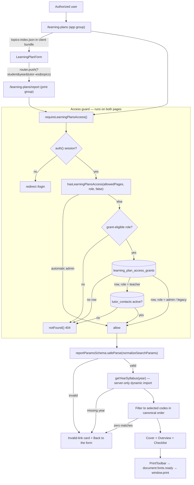

# Learning Plans

**Status: stable** — a label from this documentation set, not an in-code marker (no `@deprecated` or status flag exists anywhere under `src/lib/learning-plans/`, `src/lib/syllabus/`, or `src/components/learning-plan/`). Verified mechanism: two live pages (the builder in the `(app)` group, the report in the `(print)` group), one owned table created by a journal-registered migration (`drizzle/0056_learning_plan_access_grants.sql`, `drizzle/meta/_journal.json:401`), a nav entry in the Student Lifecycle section (`src/lib/navigation/tools.ts:184-190`), and seven dedicated test files plus coverage inside the middleware, nav, and app-nav suites — 10 files / 106 tests passing on the verification date. No environment flag gates any part of it. The feature landed in two PRs on 2026-07-23 (`25f630c`, `4975a2d`); the only later commits touching its paths came from other features' PRs (`d18028a`, `076c3ed`).

## Purpose

Learning Plans turns the committed BeGifted General Mathematics syllabus into a printable, student-specific curriculum plan. An authorized user picks a year group (1–13) and the topics to include, adds the student's name plus an optional "prepared by" line and parent-facing notes, then opens a shell-free A4 report that is printed or saved as PDF from the browser's own print dialog (`src/components/learning-plan/print-toolbar.tsx:15-19`). The form copy states the intent directly: generate a branded plan, "then download it as a PDF to send to parents" (`src/components/learning-plan/learning-plan-form.tsx:99-102`).

Who uses it: full-access admins automatically, plus individually granted restricted admins and teachers, resolved per request from a dedicated grant table (`src/lib/learning-plans/access.ts:72-114`). The bootstrap grant list names one restricted admin and two tutors (`drizzle/0056_learning_plan_access_grants.sql:9-13`; the access test names the same three accounts by role at `src/lib/learning-plans/__tests__/access.test.ts:165-180`).

The feature is deliberately a **stateless document generator**: it creates no student record, saves no plan, and synchronizes nothing with Wise or Google Sheets. The entire document — student, year, tutor, notes, topic selection — lives in the report URL's query string, and the generation date is computed in `Asia/Bangkok` at render time (`src/app/(print)/learning-plans/report/page.tsx:121-126`).

Two things distinguish it inside BGScheduler:

- It is the origin of the app's **`(print)` route group** — a layout-less page tree that renders outside the operations shell. Student Schedule and Student Report both describe themselves as mirroring it (`src/app/(print)/student-schedule/report/page.tsx:4-7`, `src/app/(print)/student-report/report/page.tsx:4-7`) and import its `PrintToolbar` (`student-schedule/report/page.tsx:17`, `student-report/report/page.tsx:17`); Student Report also reuses `DigitSafe` (`src/components/student-report/report-document.tsx:3`, `report-tables.tsx:3`) and mounts its document under the same `.begifted` feature root (`report-document.tsx:35`).
- Its **capability-gated access model** is the second instance of an established pattern rather than a novel one — Post-Class Feedback resolves fresh Postgres grants the same way (`getPostClassCapabilities`, `src/lib/post-class-feedback/access.ts:129`), and the middleware carries the two coarse-pass exceptions back to back (`src/middleware.ts:39-46` vs `47-53`), with the `(app)` layout resolving both capability sets side by side (`src/app/(app)/layout.tsx:15-20`). What is specific to Learning Plans is that its grant table carries **no foreign key to `admin_users`** (`src/lib/learning-plans/__tests__/migration.test.ts:54-59`) and that a **teacher** grant additionally requires a live `tutor_contacts` row (`src/lib/learning-plans/access.ts:102-104`).

## Conceptual data model

Learning Plans persists **no plan content**. The only database state it owns is its authorization grant list; everything else it touches is read-only and owned by another feature.

| Table | Role here | Access |
|---|---|---|
| `learning_plan_access_grants` | The feature's own capability list — one row per granted email, keyed by the normalized address, with a `granted_by_email` audit column. Snapshot-independent; deliberately no FK to `admin_users`. | Read only on grant-dependent requests (restricted admins outside the historical prefix, teachers, legacy no-role sessions); never read for automatic admins (`src/lib/learning-plans/access.ts:79-87`). Written only by migration or direct SQL — no code path inserts or deletes rows. |
| `tutor_contacts` | Owned by [Tutor Profiles](./tutor-profiles.md). The liveness check for a **teacher** grant: the granted email must still match an `active` contact's onsite or online address (`src/lib/learning-plans/access.ts:43-60`; columns `active`, `onsite_email`, `online_email` at `src/lib/db/schema.ts:1972-1977`). | Read-only. |

The two tables sit in different reference allocations: `learning_plan_access_grants` is in the core allocation ([`erd-core.md`](../reference/database/erd-core.md), section "Snapshot & sync control plane, cron observability, Wise activity audit, auth & access"), while `tutor_contacts` belongs to the tutor-profiles allocation ([`erd-tutor-profiles.md`](../reference/database/erd-tutor-profiles.md)). Column-level detail for both lives in [`docs/reference/database/index.md`](../reference/database/index.md); the Drizzle declaration is `learningPlanAccessGrants` at `src/lib/db/schema.ts:601-614`.

The syllabus corpus itself is **committed JSON, not database state**, under `src/lib/syllabus/data/`: thirteen per-year files (`year-01.json` … `year-13.json`) plus a `topics-index.json` of names and per-topic skill counts. Each year is a `YearSyllabus` of `Topic`s, each topic a list of `Skill`s with a code and description (`src/lib/syllabus/types.ts:1-15`). The data-integrity test locks the exact size — 13 years, 549 topics, 4,981 skills — and re-derives the whole index from the year files so the two cannot drift (`src/lib/syllabus/__tests__/data-integrity.test.ts:35-57`, `59-77`); recomputing from the JSON on the verification date gives the same three numbers. Nothing fetches it from Wise or Sheets at runtime.

## API surface

**Learning Plans has no HTTP endpoints.** There is no `src/app/api/learning-plans/` directory at this revision, and `docs/reference/api/index.md` carries no entry for it; both routes are Server-Component pages, and the report is produced by rendering rather than by an API call.

The middleware nevertheless takes an explicit position on that namespace: the coarse authenticated pass-through for `/learning-plans` pages is deliberately **not** extended to `/api/learning-plans*`, which is denied outright for restricted users (`src/middleware.ts:54-57`) and returns `403 { "error": "Forbidden" }` (`src/middleware.ts:98-100`). If an API namespace is ever added it must ship its own fresh grant check rather than inherit the page exception. The middleware conventions that produce this behaviour are documented in [`docs/reference/api/misc.md`](../reference/api/misc.md) under "Middleware tier"; the platform-wide endpoint inventory is [`docs/reference/api/index.md`](../reference/api/index.md).

The one request contract the feature does have — the report URL's query string — is owned by `reportParamsSchema` (`src/lib/syllabus/report-params.ts:7-17`), described under [Business rules](#stateless-url-contract) below.

## UI

| Route | Route group | File | What it is |
|---|---|---|---|
| `/learning-plans` | `(app)` | `src/app/(app)/learning-plans/page.tsx` | The plan builder, inside the normal ops shell (top nav, stale-snapshot banner from `src/app/(app)/layout.tsx:33-38`). |
| `/learning-plans/report` | `(print)` | `src/app/(print)/learning-plans/report/page.tsx` | The print-ready report. `src/app/(print)/` has **no `layout.tsx`**, so the page inherits only the root layout (`src/app/layout.tsx`) — no `AppNav`, no banner, nothing but the document. |

Both pages set `robots: { index: false, follow: false }` (`src/app/(app)/learning-plans/page.tsx:27`, `src/app/(print)/learning-plans/report/page.tsx:22`), and both wrap their async body in `<Suspense>` (`page.tsx:30-36`, `report/page.tsx:155-171`) because the access guard calls `auth()`, which is uncached and therefore dynamic under `cacheComponents: true` (`next.config.ts:4`; the reasoning is spelled out in the `(app)` layout comment at `src/app/(app)/layout.tsx:8-12`).

Key components under `src/components/learning-plan/`:

- **`learning-plan-form.tsx`** — the client builder (`"use client"`, line 1). Reads the committed topic index (`topicsIndex`, line 21), holds student / year / tutor / notes / selection in `useState` (lines 32-36, defaulting to Year 7 with every topic selected), shows a live "N/M topics · K skills" count (lines 185-187), offers Select all / Clear (lines 190-206), and on submit pushes a query-string URL to the report route (line 80).
- **`print-toolbar.tsx`** — sticky, `print-hidden` bar (line 22) with a back link and a "Download PDF" button. `backHref` / `backLabel` are props defaulting to `/learning-plans` / "Back to form" (lines 8-14); the PDF button awaits `document.fonts.ready` before `window.print()` so the PDF does not capture fallback typefaces (lines 15-19). The hint text tells staff to choose "Save as PDF" and that it is "best in Chrome" (lines 34-36).
- **`report-cover.tsx`** — page 1: logo and Bangkok date (lines 27-35), the student headline (lines 40-45), Year and optional "Prepared by" pills (lines 47-54), three stat tiles for topics / skills / year (lines 58-83), explanatory copy (lines 85-99), and the optional parent-note card (lines 101-110).
- **`report-overview.tsx`** — page 2: numbered two-column topic list with per-topic skill counts (lines 36-53), plus a "N of the year's M topics" line when the plan is a subset (lines 17, 26-34).
- **`report-checklist.tsx`** — the appendix: one table per topic with code, skill description, and an empty tick box per skill (lines 22-67), ending in a LINE contact footer (lines 69-77).
- **`digit-safe.tsx`** — splits a string on digit runs and wraps each run in the `digits` utility (lines 7-22) so numerals inside the display serif render in Sarabun instead of Cormorant's old-style figures, which turn `11` into `ıı` (`src/app/learning-plans.css:83-86`).

Both the form and the cover render the brand mark from `public/brand/logo-horizontal.png` (`learning-plan-form.tsx:86-93`, `report-cover.tsx:27-34`).

Visual identity is scoped, not global. `src/app/learning-plans.css` defines a `begifted-*` orange/blue editorial palette and font tokens (lines 8-34) and overrides shadcn semantic tokens **only** under the `.begifted` feature root (lines 36-63), so the rest of the ops design system is untouched. The three typefaces — Cormorant Garamond for display, Sarabun for body (Latin + Thai), Trirong as the Thai display fallback — are loaded once in the root layout with `preload: false` (`src/app/layout.tsx:21-44`) and referenced through `--font-begifted-display` / `--font-begifted-body` (`learning-plans.css:28-29`).

Navigation: the tool is registered in the `student-lifecycle` section with no badge and no shortcut (`src/lib/navigation/tools.ts:184-190`; asserted at `src/lib/navigation/__tests__/tools.test.ts:34-36`).

## Data flow

The builder is entirely client-side over the committed topic index; the report is a server render of one year's JSON. The only server-side lookups on either page are the access checks.

Layer by layer:

1. **Edge middleware** does a coarse pass only. Unauthenticated requests redirect to `/login` with the original path and query as `callbackUrl` (`src/middleware.ts:89-93`); authenticated restricted users are waved through the `/learning-plans` page namespace so the fresh guard can decide (`src/middleware.ts:47-53`).
2. **The Server Component guard** (`requireLearningPlansAccess`, `src/lib/learning-plans/access.ts:149-157`) is authoritative. It runs before any feature content is touched — on the builder before `<LearningPlanForm>` (`src/app/(app)/learning-plans/page.tsx:8`), and on the report inside `generateMetadata` (`report/page.tsx:29`) as well as the body (`report/page.tsx:82`), in both cases before `await searchParams`. A source-order test pins that ordering (`src/lib/learning-plans/__tests__/page-guards.test.ts`).
3. **The `(app)` layout** separately calls `getLearningPlansAccess()` to decide nav visibility (`src/app/(app)/layout.tsx:19`). `React.cache` wraps `getCurrentLearningPlansAccess` (`src/lib/learning-plans/access.ts:121-138`), so within one render the guard's `auth()` call and grant query are shared between the layout's visibility check and the page's guard. It does **not** memoize `auth()` in general — the layout issues its own `auth()` at `layout.tsx:14` — so a `/learning-plans` request makes at least two `auth()` calls. The memoization is per render only (`access.ts:117-119`), so a revoked grant applies on the next request without waiting for JWT expiry.
4. **Parameter validation** collapses Next's `string | string[] | undefined` search params to first values and drops empty strings, then Zod-parses them (`src/lib/syllabus/report-params.ts:32-41`, `7-17`).
5. **Syllabus load** uses a static map of dynamic imports behind `server-only`, so exactly one year's detail file reaches the server chunk and the 4,981-skill corpus never enters the client bundle (`src/lib/syllabus/get-year-syllabus.ts:1`, `5-21`). The builder ships only the lighter `topics-index.json` (`src/lib/syllabus/topics-index.ts:1-4`).
6. **PDF** is browser-native. There is no server PDF service, no upload, and no stored artifact.

## Business rules & edge cases

### Access model (fail-closed, capability-gated)

- **Full-access admins stay automatic and never touch Postgres.** The short-circuit ANDs two conditions: the role must be admin-shaped — `"admin"`, or `null`/`undefined` for a legacy session issued before the role claim existed — **and** `allowedPages` must be null or contain the exact route (`src/lib/learning-plans/access-policy.ts:8`, `13-21`). When it short-circuits, the resolver returns before constructing a query (`src/lib/learning-plans/access.ts:79-87`; asserted with a throwing `select` at `__tests__/access.test.ts:43-55`).
- **A restricted admin carrying the exact historical `/learning-plans` page prefix also stays automatic** — a migration affordance from before the grant table existed. A *nested* or *similarly prefixed* entry does not count: `["/learning-plans/report"]` and `["/learning-plans-extra"]` both fail, because the check is `allowedPages.includes("/learning-plans")` (`access-policy.ts:17`; `__tests__/access-policy.test.ts:35-42`).
- **A null `allowedPages` on a teacher session would not short-circuit.** The policy is a conjunction, so it would fall through to the grant + active-contact path. That combination is unreachable today — `resolveUserAccess` hands `allowedPages: null` only to admins and always gives teachers `["/progress-tests"]` (`src/lib/auth-access.ts:68`, `77`) — but the policy does not depend on that.
- **Everyone else needs a fresh grant row**, matched on an exact normalized email (`trim().toLowerCase()`, `access.ts:26-28`, `30-41`). There is no `lower()` on the query side, so the lookup depends on rows already being stored normalized; the table enforces that itself with `learning_plan_access_email_normalized_check` (`src/lib/db/schema.ts:606-609`).
- **Only `admin`, `teacher`, and a null/undefined legacy role are grant-eligible.** A `counselor`, `student`, `parent`, or unknown role is denied *before* any database work (`access.ts:89-95`), so a stray grant row cannot elevate them (`access-policy.ts:22-24`; `__tests__/access-policy.test.ts:53-57`).
- **A teacher grant additionally requires a live tutor identity.** The granted email must match an `active` row in `tutor_contacts` on `lower(btrim(onsite_email))` or `lower(btrim(online_email))` (`access.ts:47-57`), so deactivating or re-addressing a tutor revokes access immediately. The contact query is skipped entirely when no grant exists (`access.ts:99-100`; asserted at `__tests__/access.test.ts:105-114`).
- **Any database failure on a grant-dependent path fails closed** — the whole lookup is wrapped in a bare `catch { return false }` (`access.ts:97-113`).
- **A grant row never creates authentication or a role.** With no session the resolver returns before `getDb()` is called (`access.ts:123-127`; `__tests__/access.test.ts:232-237`).
- **Denial shape:** unauthenticated → `redirect("/login")`; authenticated but ungranted → `notFound()`, i.e. a 404 rather than a 403, so the page's existence is not confirmed to the caller (`access.ts:149-157`).
- **The grant only changes tool visibility.** `AppNav` strips any legacy `/learning-plans` page claim from the visible list and re-adds the route only when the fresh decision allows (`src/components/layout/app-nav.tsx:121-131`); Home and the brand-link destination stay tied to the raw page claims as adjusted for Post-Class Feedback, not to the Learning Plans decision (`app-nav.tsx:134-137`).

### Stateless URL contract

The report reads five query parameters: `student` and `year` are required; `tutor`, `notes`, and `topics` are optional. The field-by-field signature — types, length caps, bounds, and the topic-code pattern — is defined once by `reportParamsSchema` (`src/lib/syllabus/report-params.ts:7-17`) and is not restated here.

> **Reference-home exception.** Mechanical request signatures normally live under `docs/reference/api/`, but that index covers HTTP route handlers only and Learning Plans has none, so it has no entry there. The Zod schema is the canonical contract; this page carries the behavioural rules only.

The rules that are *not* readable off the schema:

- **Omitting `topics` means every topic in that year**, not "no topics" — `parseTopicCodes` returns `null` for an absent value and the report treats `null` as all (`report-params.ts:21-25`, `report/page.tsx:105-108`).
- **Repeated keys collapse to their first value and empty optionals are dropped**, so `?tutor=` behaves as absent rather than as an empty string (`report-params.ts:32-41`).
- **Duplicate topic codes de-duplicate** through a `Set`, and the report always follows the **year's canonical topic order**, not URL order, because it filters `syllabus.topics` rather than mapping the URL list (`report/page.tsx:106-108`).
- **Unknown codes are ignored** as long as at least one selected code exists in that year; a mixed valid/unknown selection renders only the valid topics. A selection matching nothing falls through to the invalid-link card (`report/page.tsx:109-115`). Selection is therefore bounded to committed data — a URL cannot inject arbitrary report rows.
- **The 1,000-character notes cap is a transport limit, not a style preference.** The comment above the schema records the reasoning: Thai text percent-encodes at roughly 9 bytes per character, so 1,000 chars ≈ 9 KB, which together with a max-length Thai name stays inside Vercel's ~14 KB request-URI limit and Node's 16 KB header budget, while 1,500 did not (`report-params.ts:3-6`). Those platform limits and the 1,500-char trial are external to the repo — nothing here reproduces them — but the operative rule is unambiguous: do not raise the cap without moving notes out of the query string. The form enforces the same cap client-side (`learning-plan-form.tsx:23`, `170`) and shows a live counter (`175-177`).
- **Expired-session edge case:** middleware embeds the already-encoded report URL inside the login `callbackUrl` via ``searchParams.set("callbackUrl", `${pathname}${search}`)`` (`src/middleware.ts:91`), which re-encodes the existing percent-escapes and roughly doubles their length. A very long all-Thai link therefore expands substantially on the redirect; where exactly that crosses a header limit is untested in this repo. If a report link misbehaves after the session expires, sign in at `/login` first, then reopen it.
- **Privacy consequence:** `student`, `tutor`, and `notes` are visible in the address bar and may persist in browser history, copied links, and request logs. The application stores none of them, but treat the link as student information and keep sensitive material out of the notes field.

### Report rendering

- Invalid params, an unknown year, and an empty topic match all render the **same friendly card** — "That link doesn't look right", with a **Back to the form** link — instead of throwing or printing an empty plan (`report/page.tsx:57-75`, `87-115`). `getYearSyllabus` returning `null` for a year outside the loader map is the second of those three paths (`get-year-syllabus.ts:23-25`); in practice the Zod `min(1).max(13)` bound catches it first.
- `generateMetadata` degrades to a plain `"Learning Plan"` title on invalid params rather than failing the render; on valid params the tab title carries the student and year (`report/page.tsx:34-43`).
- The generation date is formatted `en-GB` (e.g. "2 September 2026") in `Asia/Bangkok`, matching the app-wide timezone rule (`report/page.tsx:121-126`).
- The parent-note block appears only when `notes` is present, and its heading falls back to "your consultant" when no tutor was supplied (`report-cover.tsx:101-110`).
- The overview's "N of the year's M topics" line appears only for a subset; a full-year plan omits it (`report-overview.tsx:17`, `26-34`).

### Builder behaviour

- **Re-selecting the current year does not wipe a curated topic selection.** Base UI's `Select` fires `onValueChange` even when the already-selected item is clicked again, so `changeYear` early-returns on an unchanged year; a genuine year change resets the selection to that year's full topic set (`learning-plan-form.tsx:45-51`).
- **When every topic is selected the `topics` parameter is omitted entirely**, keeping the URL short and letting the report take the "all topics" path (`learning-plan-form.tsx:40`, `71-79`).
- **Submit is blocked on a blank student name or an empty topic selection**, both in the handler and via the disabled button (`learning-plan-form.tsx:64`, `233`). Student and tutor inputs carry `maxLength={80}` to match the schema (`114`, `154`).

### Print and PDF

- **`@page { size: A4; margin: 14mm 12mm }` in `src/app/learning-plans.css:97-101` is document-wide**, because every feature stylesheet is `@import`ed into `globals.css` (`src/app/globals.css:4-7`). The comment calls it "the intentional global print default for this internal Thailand tool" (`learning-plans.css:97`). It is why Student Schedule had to declare a *named* `@page` to get landscape without flipping every other printable page (`src/app/student-schedule.css:4-13`), and Student Report leans on it explicitly for portrait (`src/app/student-report.css:4-6`). Anything that changes this at-rule changes printing app-wide.
- Print styles reset the root layout's fixed-height, `overflow-hidden` flex body (`src/app/layout.tsx:61`) so multipage documents are not clipped, and the white-paper background is re-applied **only** when the learning-plan print root is mounted, via `body:has(> [data-learning-plan-report])` (`learning-plans.css:122-141`; the attribute is set at `report/page.tsx:49`).
- The stylesheet asks the browser for the usual print niceties — repeated table headers (`thead { display: table-header-group }`), `break-inside: avoid` on rows, `break-after: avoid` on headings, and `print-color-adjust: exact` on the report root (`learning-plans.css:103-120`); cover and overview each end with `break-after-page` (`report-cover.tsx:25`, `report-overview.tsx:20`). These are declarations, not verified output: no browser-automation test in the repo checks the rendered pagination (see [Tests](#tests)).
- The toolbar and other screen-only chrome carry `print-hidden`, and the on-screen sheet's margin, rounding, and shadow are stripped in print (`learning-plans.css:143-159`).

## Tests

Seven files are dedicated to the feature; three shared suites cover its middleware and navigation edges. All are unit-project Vitest tests under `npm test`; none needs Postgres or a browser. Running the ten files together on the verification date gave 106 passing tests.

| File | Covers |
|---|---|
| `src/lib/syllabus/__tests__/data-integrity.test.ts` | Locks the exact corpus — years 1–13 present and in order, 549 topics / 4,981 skills — and re-derives the entire `topics-index.json` from the year files, so the index and details cannot drift. |
| `src/lib/syllabus/__tests__/report-params.test.ts` | Required student with trimming, year coercion and 1–13 bounds (rejecting `0`, `14`, `7.5`, `abc`), the 80- and 1,000-character caps, the uppercase topic-CSV regex (accepting `AA,BB`, rejecting `a,b`, `A,`, `A,,B`, `1,2`), `parseTopicCodes` null-means-all, and array/empty-string normalization. |
| `src/lib/learning-plans/__tests__/access-policy.test.ts` | The pure policy: automatic full admins, legacy no-role sessions, the exact historical page grant, rejection of nested/similar prefixes, teacher-only-with-grant, and denial of `viewer`/`counselor`/`student`/`parent` even with a grant row. |
| `src/lib/learning-plans/__tests__/access.test.ts` | The DAL against a stub `select` builder: admins resolved without touching the database, restricted-admin grant lookup, the teacher grant + active-contact pair, skipping the contact query when no grant exists, fail-closed on a throwing database, re-reading the grant within one live session, the three migrated accounts resolving without changing their sign-in claims, and `getLearningPlansAccess` returning false with no session without calling `getDb`. |
| `src/lib/learning-plans/__tests__/migration.test.ts` | Migration `0056`: normalized-email PK, both check constraints, no `REFERENCES` and an empty `foreignKeys` map in the snapshot, exactly three idempotent bootstrap grants, and correct snapshot-chain (`0054 → 0055 → 0056`) and journal registration. |
| `src/lib/learning-plans/__tests__/page-guards.test.ts` | Source-order assertions that `requireLearningPlansAccess()` runs before `<LearningPlanForm` on the builder, and before `await searchParams` in both `generateMetadata` and the report body. |
| `src/components/learning-plan/__tests__/digit-safe.test.tsx` | `DigitSafe` wraps every digit run without altering surrounding text, including inside a rendered `ReportOverview` heading. |
| `src/__tests__/middleware.test.ts:97-182` | Unauthenticated report → `/login` with `callbackUrl`; pass-through for full admins, matching restricted admins, and coarse-passed restricted users on both routes; `/learning-plans-extra` still redirected to the landing page; `/api/learning-plans*` returning `403 { "error": "Forbidden" }`. |
| `src/lib/navigation/__tests__/tools.test.ts`, `src/components/layout/__tests__/app-nav.test.tsx` | Nav registration without badge or shortcut, exclusion from a `/progress-tests`-only user's tool list, visibility only when the fresh decision allows, Home and brand destination unaffected by the grant, and active-state on the nested report path. |

There are no page-render or browser-automation tests for the end-to-end form → report → print flow; pagination and PDF output are verified manually.

## Open questions

- **Grant administration has no UI or API.** Rows in `learning_plan_access_grants` can only be added by migration or direct SQL (`granted_by_email` was seeded as `system:migration`, `drizzle/0056_learning_plan_access_grants.sql:9-13`). Is a self-service grant screen intended, or is DBA-only issuance the deliberate control?
- **The three bootstrap grants are real addresses committed in the migration** — two personal (gmail) addresses and one company-domain address. Should those be parameterized or moved to an operational runbook step?
- **Is the legacy no-role admin path still needed?** `hasLearningPlansAccess` treats `role === null || role === undefined` as admin-shaped (`access-policy.ts:8`) for sessions issued before the role claim existed. Every session now carries `role` (`src/types/next-auth.d.ts:26-31`); once those older JWTs have expired the branch is dead, but removing it changes an access rule and needs an owner's call.
- **`getYearSummary` in `src/lib/syllabus/topics-index.ts:6-8` has no caller anywhere in `src/`** (the form re-implements the lookup inline at `learning-plan-form.tsx:26`, `38`). Dead code to remove, or a deliberate public helper?
- **The `AppNav` active-state branch for `/learning-plans/report` is unreachable in practice.** That route lives in the `(print)` group, which has no layout and therefore never renders `AppNav`; the behaviour is asserted only in component tests (`tools.test.ts:68-69`, `app-nav.test.tsx:107-116`). Is the print report expected to gain a shell, or should the assertion be dropped?
- **Shared print primitives live under a feature-named directory.** `PrintToolbar` and `DigitSafe` are imported by Student Schedule and Student Report from `src/components/learning-plan/` (see [Purpose](#purpose)). Should they move to a neutral `src/components/print/` home? Relatedly, **DEF-24 in `docs/OPEN-QUESTIONS.md` is stale**: it reports `PrintToolbar` hard-coding `/learning-plans`, but the toolbar now takes `backHref`/`backLabel` props (`print-toolbar.tsx:8-14`) and both other print pages pass their own (`student-schedule/report/page.tsx:98`, `student-report/report/page.tsx:127`).
- **The whole-app `@page` default lives in this feature's stylesheet** (`learning-plans.css:97-101`), and two other print surfaces now depend on it. Should it be promoted to `globals.css` so a future printable feature does not have to discover the coupling?
- **The `/api/learning-plans*` deny guards a namespace that does not exist** (`src/middleware.ts:54-57`; also raised as DEAD-27 in `docs/OPEN-QUESTIONS.md`). The comment reads as forward-looking protection — confirm that is the intent so nobody removes it as dead code.
- **The report URL contract has no reference home.** `docs/reference/api/index.md` inventories HTTP route handlers only, so the request signature lives solely in `reportParamsSchema`. Should `docs/reference/api/misc.md` gain a non-endpoint entry, or is the schema-as-contract exception documented above the intended answer?
- **Student names and parent notes travel in the URL by design.** The stateless model is deliberate, but it means student information sits in browser history and request logs. Is that acceptable long-term, or should notes move to a short-lived server-side token like Student Schedule's capability links?
- **Syllabus corpus ownership and refresh cadence are undocumented.** The 549-topic / 4,981-skill JSON has no generator script in the repo and is locked by an exact-count test — what is the intended process when the curriculum changes?
- **Minor reference and index drift to reconcile in a reference pass:** `docs/reference/database/erd-core.md:154` cites `schema.ts:601-617` for the grant table while the declaration spans `601-614` (and `index.md:84` already says `601-614`); `docs/reference/database/erd-tutor-profiles.md:9` places `tutor_contacts` at `schema.ts:1962–1980` while it now sits at `1965-1983`; `docs/reference/api/misc.md:41` cites `middleware.ts:44-51` for the Learning Plans exception, which now sits at `47-57`; and `docs/README.md:126`, `168` still record this page as having "no status line", which has not been true since the status badge above was added.

_Verified against main@0cd1e81 (clean tree) on 2026-09-02._
