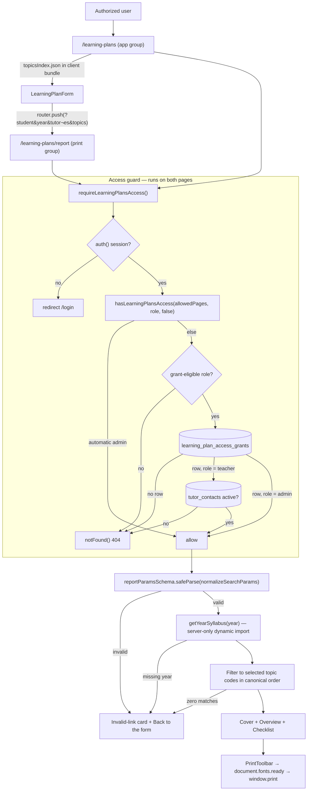

# Learning Plans

## Purpose

Learning Plans turns the committed BeGifted General Mathematics syllabus into a printable,
student-specific curriculum plan. An authorized user picks a year group and the topics to
include, adds the student name plus optional "prepared by" and parent-facing notes, then
opens a shell-free A4 report that can be printed or saved as PDF from the browser's own
print dialog.

Access is limited to admins plus individually granted teachers, resolved per request from a
dedicated grant table (`src/lib/learning-plans/access.ts:72-114`). The feature is
deliberately a **stateless document generator**: it creates no student record, saves no
plan, and synchronizes nothing. The entire document state — student, year, tutor, notes,
topic selection — lives in the report URL, and the generation date is computed in
`Asia/Bangkok` at render time (`src/app/(print)/learning-plans/report/page.tsx:121-126`).

Two things distinguish it inside BGScheduler:

- It is the origin of the app's **`(print)` route group** — a print-first page tree that
  renders outside the operations shell.
- Its **capability-gated access model** is the second instance of an established pattern,
  not a novel one: Post-Class Feedback already resolves `post_class_access_grants` fresh on
  every request (`src/lib/post-class-feedback/access.ts:129-141`), with the same coarse-pass
  middleware exception sitting immediately above the Learning Plans one
  (`src/middleware.ts:33-40` vs `41-47`), and the `(app)` layout resolves both capability
  sets side by side (`src/app/(app)/layout.tsx:15-20`). What is genuinely specific to
  Learning Plans is that its grant table has **no FK or join to `admin_users`** — post-class
  grants inner-join that allowlist (`src/lib/post-class-feedback/access.ts:139-141`) — and
  that a **teacher** grant additionally requires a live `tutor_contacts` row.

## Conceptual data model

Learning Plans persists **no plan content**. The only database state it owns is its
authorization grant list; everything else it touches is read-only and owned by another
feature.

| Table | Role here | Access |
|---|---|---|
| `learning_plan_access_grants` | The feature's own capability list — one row per granted email. Snapshot-independent, and deliberately carries no foreign key to `admin_users`. | read only on grant-dependent requests (restricted admins outside the historical prefix, teachers, legacy no-role sessions); never read for automatic admins; written only by migration/DBA |
| `tutor_contacts` | Owned by [Tutor Profiles](./tutor-profiles.md). Used as the liveness check for a **teacher** grant: the granted email must still match an `active` contact's onsite or online address. | read-only |

The two tables sit in **different reference allocations**: `learning_plan_access_grants` is
in the core allocation ([`erd-core.md`](../reference/database/erd-core.md)), while
`tutor_contacts` belongs to the tutor-profiles allocation
([`erd-tutor-profiles.md`](../reference/database/erd-tutor-profiles.md)). Column-level
detail for both lives in [`docs/reference/database/index.md`](../reference/database/index.md).
The grant table is created (and seeded with three bootstrap grants) by
[`drizzle/0056_learning_plan_access_grants.sql`](../../drizzle/0056_learning_plan_access_grants.sql).

The syllabus corpus itself is **committed JSON, not database state**, under
`src/lib/syllabus/data/`: 13 per-year files holding **549 topics and 4,981 skills**, plus a
lightweight `topics-index.json` of names and counts. It is never fetched from Wise or Google
Sheets at runtime.

## API surface

**Learning Plans has no HTTP endpoints.** There is no `src/app/api/learning-plans/`
directory at this revision; both routes are Server-Component pages, and the report is
produced by rendering rather than by an API call.

The middleware nevertheless takes an explicit position on that namespace: the coarse
authenticated pass-through granted to `/learning-plans` pages is deliberately **not**
extended to `/api/learning-plans*`, which is denied outright for restricted users
(`src/middleware.ts:48-51`). If an API namespace is ever added it must ship its own fresh
grant check rather than inherit the page exception.

For the platform-wide endpoint inventory see
[`docs/reference/api/index.md`](../reference/api/index.md).

## UI

| Route | Route group | File | What it is |
|---|---|---|---|
| `/learning-plans` | `(app)` | `src/app/(app)/learning-plans/page.tsx` | The plan builder, inside the normal ops shell (top nav, stale-snapshot banner). |
| `/learning-plans/report` | `(print)` | `src/app/(print)/learning-plans/report/page.tsx` | The print-ready report. The `(print)` group has **no `layout.tsx`**, so it inherits the root layout only — no `AppNav`, no banner, nothing but the document. |

Both pages set `robots: { index: false, follow: false }`
(`src/app/(app)/learning-plans/page.tsx:23-28`,
`src/app/(print)/learning-plans/report/page.tsx:22`), and both wrap their async body in
`<Suspense>` because the access guard calls `auth()`, which is uncached and therefore
dynamic under `cacheComponents: true` (`next.config.ts:4`).

Key components under `src/components/learning-plan/`:

- **`learning-plan-form.tsx`** — the client builder. Reads the committed topic index, holds
  student/year/tutor/notes/selection in `useState`, shows live "N/M topics · K skills"
  counts, and on submit pushes a query-string URL to the report route.
- **`print-toolbar.tsx`** — sticky, `print-hidden` bar with "Back to form" and "Download
  PDF"; the PDF button awaits `document.fonts.ready` before `window.print()`
  (`src/components/learning-plan/print-toolbar.tsx:9-13`).
- **`report-cover.tsx`** — page 1: logo, Bangkok date, student headline, Year/topic/skill
  stat tiles, explanatory copy, and the optional parent note card.
- **`report-overview.tsx`** — page 2: numbered two-column topic list with per-topic skill
  counts, plus a "N of the year's M topics" line when the plan is a subset
  (`src/components/learning-plan/report-overview.tsx:17`, `26-34`).
- **`report-checklist.tsx`** — the appendix: one table per topic, every skill with a code,
  description, and an empty tick box, ending in a LINE contact footer.
- **`digit-safe.tsx`** — splits a string on digit runs and wraps each run in the `digits`
  utility so numerals inside the display serif render in Sarabun instead of Cormorant's
  old-style figures (which turn `11` into `ıı`, `src/app/learning-plans.css:83-86`).

Visual identity is scoped, not global: `src/app/learning-plans.css` defines a
`begifted-*` orange/blue editorial palette and overrides shadcn semantic tokens **only**
under the `.begifted` feature root (`src/app/learning-plans.css:36-63`), so the rest of the
ops design system is untouched.

Navigation: the tool is registered in the `student-lifecycle` section with no badge and no
shortcut (`src/lib/navigation/tools.ts:176-182`).

## Data flow

The builder is entirely client-side over the committed topic index; the report is a server
render of one year's JSON. The only server-side lookups on either page are the access
checks.

Layer by layer:

1. **Edge middleware** does a coarse pass only. Unauthenticated requests redirect to
   `/login` with the original URL as `callbackUrl` (`src/middleware.ts:71-75`); authenticated
   restricted users are waved through the `/learning-plans` page namespace so the fresh
   guard can decide (`src/middleware.ts:41-47`).
2. **The Server Component guard** (`requireLearningPlansAccess`,
   `src/lib/learning-plans/access.ts:149-157`) is authoritative. It runs before any feature
   content is touched, including inside `generateMetadata`
   (`src/app/(print)/learning-plans/report/page.tsx:29`).
3. **The `(app)` layout** separately calls `getLearningPlansAccess()` to decide nav
   visibility (`src/app/(app)/layout.tsx:15-26`). `React.cache` wraps only
   `getCurrentLearningPlansAccess` (`src/lib/learning-plans/access.ts:121-138`), so within
   one render the guard's `auth()` call and grant query are shared across the guard's own
   call sites — the layout's `getLearningPlansAccess()` plus the page's
   `requireLearningPlansAccess()`, or `generateMetadata` plus the body on the report page.
   It does **not** cover `auth()` generally: the `(app)` layout issues its own separate
   `auth()` at `src/app/(app)/layout.tsx:14` and next-auth's `auth()` is not itself
   `React.cache`-memoized, so a `/learning-plans` request makes at least two `auth()` calls.
   The memoization is per-render only, so a revoked grant applies on the next request
   without waiting for JWT expiry. (The `(app)` layout and `generateMetadata` never
   co-occur: the layout wraps only the builder page, while `generateMetadata` belongs to the
   report page in the layout-less `(print)` group.)
4. **Parameter validation** normalizes Next's `string | string[] | undefined` search params,
   then Zod-parses them (`src/lib/syllabus/report-params.ts:32-41`, `7-17`).
5. **Syllabus load** uses a static map of dynamic imports behind `server-only`, so exactly
   one year's detail file reaches the server chunk and none of the 4,981-skill corpus is
   bundled into the client (`src/lib/syllabus/get-year-syllabus.ts:1-28`).
6. **PDF** is browser-native. There is no server PDF service, no upload, no stored artifact.

## Business rules & edge cases

### Access model (fail-closed, capability-gated)

- **Full-access admins stay automatic and never touch Postgres.** The short-circuit ANDs
  two conditions rather than accepting either alone: the role must be admin-shaped
  (`"admin"`, or `null`/`undefined` for a legacy session issued before the role claim
  existed) **and** `allowedPages` must be null or contain the exact route
  (`src/lib/learning-plans/access-policy.ts:8`, `13-19`). A null `allowedPages` on a
  `teacher` session would therefore *not* short-circuit; it would fall through to the grant
  + active-contact path. That combination is unreachable today — `resolveUserAccess` hands
  `allowedPages: null` only to admins and always gives teachers `["/progress-tests"]`
  (`src/lib/auth-access.ts:66`, `76-78`) — but the policy is a conjunction, not a pair of
  alternatives. When it does short-circuit, the resolver returns before constructing a query
  (`src/lib/learning-plans/access.ts:79-87`).
- **A restricted admin carrying the exact historical `/learning-plans` page prefix also
  stays automatic** — a migration affordance. A *nested* or *similarly prefixed* entry does
  not count: `["/learning-plans/report"]` and `["/learning-plans-extra"]` both fail, because
  the check is `allowedPages.includes("/learning-plans")`
  (`src/lib/learning-plans/access-policy.ts:17`).
- **Everyone else needs a fresh grant row**, matched on an exact normalized email
  (`trim().toLowerCase()`, `src/lib/learning-plans/access.ts:26-28`, `30-41`). There is no
  `lower()` on the query side, so the lookup depends on rows already being stored
  normalized; the table enforces that itself — see
  [`docs/reference/database/index.md`](../reference/database/index.md) for the constraint.
- **Only `admin` and `teacher` (and a null/undefined legacy role) are grant-eligible.** A
  `counselor`, `student`, `parent`, or unknown role is denied *before* any database work
  (`src/lib/learning-plans/access.ts:89-95`), so a stray grant row cannot elevate them
  (`src/lib/learning-plans/access-policy.ts:22-24`).
- **A teacher grant additionally requires a live tutor identity.** The granted email must
  match an `active` row in `tutor_contacts` on `lower(btrim(onsite_email))` or
  `lower(btrim(online_email))` (`src/lib/learning-plans/access.ts:43-60`, `102-104`), so
  deactivating or re-addressing a tutor revokes access immediately. The contact query is
  skipped entirely when no grant exists.
- **Any database failure on a grant-dependent path fails closed** — the whole lookup is
  wrapped in a bare `catch { return false }` (`src/lib/learning-plans/access.ts:111-113`).
- **A grant row never creates authentication or a role.** With no session the resolver
  returns before `getDb()` is called (`src/lib/learning-plans/access.ts:124-127`).
- **Denial shape:** unauthenticated → `redirect("/login")`; authenticated but ungranted →
  `notFound()`, i.e. a 404 rather than a 403, so the page's existence is not confirmed
  (`src/lib/learning-plans/access.ts:149-157`).
- **The grant only changes tool visibility.** `AppNav` strips the legacy
  `/learning-plans` entry and re-adds it only when the fresh decision allows, while Home and
  the brand-link destination stay tied to the raw page claims
  (`src/components/layout/app-nav.tsx:121-137`).

### Stateless URL contract

The report reads five query parameters: `student` and `year` are required, `tutor`, `notes`,
and `topics` optional. The field-by-field signature — types, length caps, bounds, and the
topic-code pattern — is defined once by `reportParamsSchema`
(`src/lib/syllabus/report-params.ts:7-17`) and is not restated here.

> **Reference-home exception.** Mechanical request signatures normally live under
> `docs/reference/api/`, but that index covers HTTP route handlers only and Learning Plans
> has none, so it has no entry there. The Zod schema above is the canonical contract; this
> page carries the behavioural rules only. See the open questions for the standing decision.

The rules that are *not* readable off the schema:

- **Omitting `topics` means every topic in that year**, not "no topics" —
  `parseTopicCodes` returns `null` for an absent value and the report treats `null` as all
  (`src/lib/syllabus/report-params.ts:21-25`).
- **Repeated keys collapse to their first value and empty optionals are dropped**, so
  `?tutor=` behaves as absent rather than as an empty string
  (`src/lib/syllabus/report-params.ts:32-41`).
- **Duplicate topic codes de-duplicate** through a `Set`, and the report always follows the
  **year's canonical topic order**, not URL order, because it filters `syllabus.topics`
  rather than mapping the URL list (`src/app/(print)/learning-plans/report/page.tsx:105-108`).
- **Unknown codes are ignored** as long as at least one selected code exists in that year; a
  mixed valid/unknown selection renders only the valid topics. A selection matching nothing
  falls through to the invalid-link card
  (`src/app/(print)/learning-plans/report/page.tsx:109-115`). Selection is therefore bounded
  to committed data — a URL cannot inject arbitrary report rows.
- **The 1,000-char notes cap is a transport limit, not a style preference.** The comment
  above the schema records the reasoning: Thai text percent-encodes at roughly 9 bytes per
  character, so 1,000 chars ≈ 9 KB, which together with a max-length Thai name was judged to
  stay inside Vercel's ~14 KB request-URI limit and Node's 16 KB header budget, while 1,500
  did not (`src/lib/syllabus/report-params.ts:3-6`). Those platform limits and the 1,500-char
  trial are external to the repo — no test or script here reproduces them — but the operative
  rule is unambiguous: the cap must not be raised without moving notes out of the query
  string. The form enforces the same cap client-side
  (`src/components/learning-plan/learning-plan-form.tsx:23`).
- **Expired-session edge case:** middleware embeds the already-encoded report URL inside the
  login `callbackUrl` via ``searchParams.set("callbackUrl", `${pathname}${search}`)``
  (`src/middleware.ts:73`), which re-encodes the existing percent-escapes and so roughly
  doubles their length. A very long all-Thai link therefore expands substantially on the
  redirect; where exactly that crosses a header limit is untested in this repo. If a report
  link misbehaves after the session expires, sign in at `/login` first, then reopen it.
- **Privacy consequence:** `student`, `tutor`, and `notes` are visible in the address bar and
  may persist in browser history, copied links, and proxy/request logs. The application
  stores none of them, but treat the link as student information and keep sensitive material
  out of the notes field.

### Report rendering

- Invalid params, an unknown year, and an empty topic match all render the **same friendly
  card** — "That link doesn't look right", with a **Back to the form** link — instead of
  throwing or printing an empty plan (`src/app/(print)/learning-plans/report/page.tsx:57-75`,
  `87-115`).
- `generateMetadata` degrades to a plain `"Learning Plan"` title on invalid params rather
  than failing the render (`src/app/(print)/learning-plans/report/page.tsx:34-36`).
- The generation date is formatted `en-GB` in `Asia/Bangkok`, matching the app-wide timezone
  rule (`src/app/(print)/learning-plans/report/page.tsx:121-126`).
- The parent-note block only appears when `notes` is present, and its heading falls back to
  "your consultant" when no tutor was supplied
  (`src/components/learning-plan/report-cover.tsx:101-110`).

### Builder behaviour

- **Re-selecting the current year does not wipe a curated topic selection.** Base UI's
  `Select` fires `onValueChange` even when the already-selected item is clicked again, so
  `changeYear` early-returns on an unchanged year; a genuine year change resets the selection
  to that year's full topic set
  (`src/components/learning-plan/learning-plan-form.tsx:45-51`).
- **When every topic is selected the `topics` parameter is omitted entirely**, keeping the
  URL short and letting the report take the "all topics" path
  (`src/components/learning-plan/learning-plan-form.tsx:71-79`).
- Submit is blocked on a blank student name or an empty topic selection, both in the handler
  and via the disabled button (`src/components/learning-plan/learning-plan-form.tsx:63-64`,
  `233`).

### Print and PDF

- **`@page { size: A4; margin: 14mm 12mm }` in `src/app/learning-plans.css:97-101` is
  document-wide**, because both feature stylesheets are `@import`ed into `globals.css`
  (`src/app/globals.css:5-6`). It is the intentional app-wide print default for this internal
  Thailand tool — and the reason Student Schedule had to declare a *named* `@page` to get
  landscape without flipping every other printable page
  (`src/app/student-schedule.css:1-19`). Anything that changes this at-rule changes printing
  app-wide.
- Print styles reset the app's fixed-height, `overflow-hidden` flex body so multipage
  documents are not clipped, and the white-paper background is re-applied **only** when the
  learning-plan print root is mounted, via
  `body:has(> [data-learning-plan-report])` (`src/app/learning-plans.css:122-141`).
- The stylesheet asks the browser for the usual print niceties — repeated table headers
  (`thead { display: table-header-group }`), `break-inside: avoid` on rows, `break-after:
  avoid` on headings, and `print-color-adjust: exact` on the report root
  (`src/app/learning-plans.css:103-120`); cover and overview each end with
  `break-after-page`. These are declarations, not verified output: no browser-automation test
  in the repo checks the rendered pagination (see [Tests](#tests)).
- The toolbar and other screen-only chrome carry `print-hidden`, and the on-screen sheet's
  margin/rounding/shadow are stripped in print (`src/app/learning-plans.css:143-159`).

## Tests

| File | Covers |
|---|---|
| `src/lib/syllabus/__tests__/data-integrity.test.ts` | Locks the exact corpus — years 1–13 present and in order, **549 topics / 4,981 skills** — and re-derives the entire `topics-index.json` from the year files, so the index and details cannot drift. |
| `src/lib/syllabus/__tests__/report-params.test.ts` | Required student, year coercion and 1–13 bounds (rejecting `0`, `14`, `7.5`, `abc`), 80/1,000-char caps, the uppercase topic-CSV regex (accepting `AA,BB`, rejecting `a,b`, `A,`, `A,,B`, `1,2`), `parseTopicCodes` null-means-all, and array/empty-string normalization. |
| `src/lib/learning-plans/__tests__/access-policy.test.ts` | The pure policy: automatic full admins, legacy no-role sessions, the exact historical page grant, rejection of nested/similar prefixes, teacher-only-with-grant, and denial of `viewer`/`counselor`/`student`/`parent` even with a grant row. |
| `src/lib/learning-plans/__tests__/access.test.ts` | The DAL: admins resolved without touching the database at all, restricted-admin grant lookup, the teacher grant + active-contact pair, skipping the contact query when no grant exists, fail-closed on a throwing database, re-reading the grant within one live session, and `getLearningPlansAccess` returning false with no session (without calling `getDb`). |
| `src/lib/learning-plans/__tests__/migration.test.ts` | Migration `0056`: normalized-email PK, both check constraints, no foreign key to the admin allowlist, exactly three idempotent bootstrap grants, and correct snapshot-chain/journal registration. |
| `src/lib/learning-plans/__tests__/page-guards.test.ts` | Source-order assertions that `requireLearningPlansAccess()` runs **before** the form renders, and before `await searchParams` in both `generateMetadata` and the report body. |
| `src/components/learning-plan/__tests__/digit-safe.test.tsx` | `DigitSafe` wraps every digit run without altering surrounding text, including inside a rendered `ReportOverview` heading. |
| `src/__tests__/middleware.test.ts` | Unauthenticated report → `/login` with `callbackUrl`; pass-through for full admins, matching restricted admins, and coarse-passed restricted users; `/learning-plans-extra` still redirected; `/api/learning-plans*` returning `403`. |
| `src/lib/navigation/__tests__/tools.test.ts`, `src/components/layout/__tests__/app-nav.test.tsx` | Nav registration without badge/shortcut, visibility only when the fresh decision allows, Home and brand destination unaffected, and active-state on the nested report path. |

There are no page-render or browser-automation tests for the end-to-end form → report → print
flow; that path is verified manually. Run `npm test` for the unit suite.

## Open questions

- **This feature carries no maturity marker in code.** There is no `@deprecated` or status
  annotation anywhere under `src/lib/learning-plans/`, `src/lib/syllabus/`, or
  `src/components/learning-plan/`, and no registry entry records one, so the status badge
  other feature docs carry cannot be derived here and has been omitted. Where should feature
  maturity be recorded so it is verifiable rather than asserted?
- **The report URL contract has no reference home.** `docs/reference/api/index.md` inventories
  HTTP route handlers only, and Learning Plans has none, so the request signature currently
  lives solely in `reportParamsSchema`. Should `docs/reference/api/misc.md` gain a
  non-endpoint entry for the report URL contract, or is the schema-as-contract exception
  documented above the intended answer?
- **Grant administration has no UI or API.** Rows in `learning_plan_access_grants` can only
  be added by migration or direct SQL (`granted_by_email` was seeded as `system:migration`).
  Is a self-service grant screen intended, or is DBA-only issuance the deliberate control?
- **`getYearSummary` in `src/lib/syllabus/topics-index.ts:6-8` appears unused** — no caller
  exists anywhere in `src/`. Dead code to remove, or a deliberate public helper?
- **The `AppNav` active-state branch for `/learning-plans/report` may be unreachable.** That
  route lives in the `(print)` group, which has no layout and therefore never renders
  `AppNav`; the behaviour is asserted only in a component test. Is the print report expected
  to gain a shell, or should the branch be dropped?
- **The three bootstrap grants are real addresses committed in the migration** — two
  personal (gmail) addresses and one company-domain address
  (`drizzle/0056_learning_plan_access_grants.sql:9-13`). Should those be parameterized or
  moved to an operational runbook step?
- **The whole-app `@page` default lives in this feature's stylesheet**
  (`src/app/learning-plans.css:97-101`). Should it be promoted to `globals.css` so a future
  printable feature does not have to discover the coupling the way Student Schedule did?
- **Syllabus corpus ownership and refresh cadence are undocumented.** The 549-topic /
  4,981-skill JSON has no generator script in the repo and is locked by an exact-count test —
  what is the intended process when the curriculum changes?

_Verified against HEAD + uncommitted WIP on 2026-05-31._
