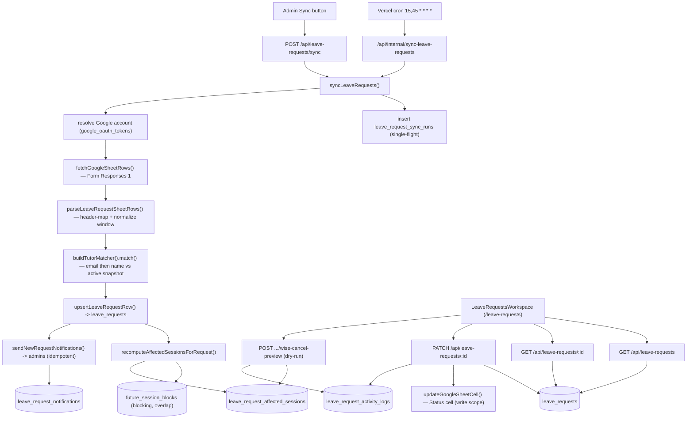

# Leave Requests

**Status: live (preview-only Wise cancel)**

> **Maturity note.** The whole feature is committed and tracked in git at HEAD `d4fe6d3` — `git ls-files` returns the migration, the `src/lib/leave-requests/` module, every API route, the `/leave-requests` page, the `src/components/leave-requests/` UI, and the test files; the working tree is clean. The `vercel.json` cron entry, the `AppNav` link + action badge, and the database schema are all in place. The one real caveat is that the Wise-cancellation path is deliberately preview-only (no Wise mutation is wired) and the parser/normalization heuristics are young; treat shapes as stabilizing rather than frozen. See [Open questions](#open-questions).

## Purpose

Leave Requests is the admin workspace for triaging tutor time-off submissions.

Tutors fill out a Google Form whose responses land in a Google Sheet tab ("Form Responses 1"). This feature pulls those rows into Postgres, matches each row to a Wise tutor identity, computes which of that tutor's upcoming Wise sessions actually overlap the requested leave window, and gives admin/ops staff a worklist to review each request: set a workflow status, leave a staff note, and (optionally) write a status string back into the source sheet. New submissions also fan out an email notification to every admin user.

The primary users are the BeGifted admin/ops staff who process leave. The feature is **read-mostly with respect to Wise** — it never mutates Wise sessions. The only Wise-cancellation capability it offers today is a **dry-run preview** that records the cancellation endpoints an operator would have to call manually and explicitly logs that "No Wise mutation was sent." (`src/lib/leave-requests/data.ts:652`-`665`). The only outbound write the feature performs is updating a single "Status" cell in the source Google Sheet, gated on an explicit admin action and on a write-scoped Google account.

## Conceptual data model

Leave Requests owns **five tables**, created together in `drizzle/0036_tutor_leave_requests.sql` and defined in `src/lib/db/schema.ts:1325`-`1466` (plus two `pgEnum`s — `leave_request_workflow_status` at `schema.ts:163` and `leave_request_sheet_write_status` at `:172`). For column-level detail (types, defaults, every index, constraints) see the database reference ERD: [docs/reference/database/erd-leave-requests.md](../reference/database/erd-leave-requests.md).

- **`leave_request_sync_runs`** — one row per sync attempt (manual or cron) with status, trigger type, scanned/inserted/updated/notification counts, an error summary, and a JSONB metadata blob. A **partial unique index** (`leave_request_sync_runs_single_running_idx`, only one row with `status = 'running'`) enforces single-flight at the database layer.
- **`leave_requests`** — the central record: one row per source sheet row, keyed unique on `(spreadsheet_id, sheet_name, source_row_number)`. Each row carries the parsed form fields, the normalized leave window (`leave_start_time`/`leave_end_time` plus `start_minute`/`end_minute` and a `normalization_status`), the resolved Wise identity (nullable FK `tutor_group_id` → `tutor_identity_groups`, plus a canonical key, display name, and a `match_confidence` label), the admin workflow state (`workflow_status` enum, staff note, `unread` flag), the sheet-writeback state (`sheet_write_status` enum, error, timestamp), the affected-class and cancellation-preview counts, and the full raw sheet row as JSONB.
- **`leave_request_affected_sessions`** — the Wise sessions that overlap a request's leave window, denormalized out of `future_session_blocks` (unique on `(leave_request_id, wise_session_id)`, cascade-deleted with the parent). Each row carries the overlap in minutes and a `cancel_preview_selected` flag.
- **`leave_request_activity_logs`** — append-only audit trail per request (action types observed: `source_inserted`, `source_updated`/`source_refreshed`, `status_update`, `sheet_status_write`, `wise_cancel_preview`), with request/response payloads, an error message, and actor email/name. Cascade-deleted with the parent.
- **`leave_request_notifications`** — one "new submission" email row per `(request × recipient)`, deduped by a unique `idempotency_key`. The key **stored on the row** is `leave-request:new:{requestId}:{recipient}` (`src/lib/leave-requests/sync.ts:355`) and does **not** include the sync run, so a given request never double-notifies a recipient across runs. (A separate `leave-requests:{syncRunId}:{recipient}` key is built at `sync.ts:329` but is handed only to the email *sender*, not persisted.) A nullable `sync_run_id` FK lets a notification be traced back to its run without being part of the uniqueness constraint.

The feature also **reads** the active Wise snapshot and a few sibling subsystems via tables it does not own:

- `snapshots` — to find the active Wise snapshot (`matching.ts:55`, `data.ts:412`).
- `tutor_identity_groups` / `tutor_identity_group_members` / `tutor_contacts` / `tutor_aliases` — for the tutor matcher's email/name indexes (`matching.ts:68`-`82`).
- `future_session_blocks` — the source for overlap computation (`data.ts:421`-`451`).
- `credit_control_snapshots` / `credit_control_sessions` / `credit_control_students` and `line_contact_student_links` / `line_contacts` — to attach an affected-student roster (with verified LINE chat links) to each affected Wise session (`data.ts:332`-`381`).
- `admin_users` — notification recipients (`sync.ts:270`-`276`).
- `google_oauth_tokens` — to pick a Sheets-scoped Google account for read/write (`sync.ts:125`-`149`).

## API surface

All five HTTP endpoints exist and are wired. The four user-facing routes require an authenticated Auth.js session **with an email** (they check `!session?.user?.email`); the internal cron route is gated by `CRON_SECRET` via `rejectInvalidCronSecret` instead. Full request/response contracts are the responsibility of the API reference — see [docs/reference/api/misc.md](../reference/api/misc.md) (the four user-facing routes) and [docs/reference/api/internal-crons.md](../reference/api/internal-crons.md) (the cron route); the index is [docs/reference/api/index.md](../reference/api/index.md).

| Method · Path | Auth | Purpose |
|---|---|---|
| `GET /api/leave-requests` | admin | List/triage payload — KPI cards, a per-day timeline, the request rows, and the caller's Google Sheets connection status. Accepts `status` / `q` / `startDate` / `endDate` / `summaryOnly` query params. |
| `GET /api/leave-requests/[requestId]` | admin | Full detail for one request: the record (incl. `rawValues`), its affected Wise sessions (with student/LINE rosters), and its activity log. |
| `PATCH /api/leave-requests/[requestId]` | admin | Update workflow status / staff note, and optionally write the Status cell back to the source sheet. |
| `POST /api/leave-requests/[requestId]/wise-cancel-preview` | admin | Record a **dry-run** Wise-cancellation preview for the selected affected sessions. No Wise mutation is sent. |
| `POST /api/leave-requests/sync` | admin | Admin-triggered manual sync (`triggerType: "manual"`). Returns `409` if a sync is already running. |
| `GET, POST /api/internal/sync-leave-requests` | cron (`CRON_SECRET`) | Cron/manual sync entry point (`triggerType: "cron"` for both methods). `maxDuration = 800`. |

The cron route is registered in `vercel.json` at `15,45 * * * *` (staggered 5 minutes off the other `sync-*` jobs) and wraps the run in `withCronInvocationAudit({ jobKey: "leave_requests", … })`. Both the in-app trigger (`/api/leave-requests/sync`) and the cron route call the same `syncLeaveRequests` (`sync.ts:366`).

## UI

- **Page**: `src/app/(app)/leave-requests/page.tsx` — an async Server Component that calls `auth()`, redirects to `/login` when unauthenticated, and renders `<LeaveRequestsWorkspace>` inside a `<Suspense>` skeleton.
- **Workspace shell**: `src/components/leave-requests/leave-requests-workspace.tsx` — the `"use client"` orchestrator. It loads the list (search box debounced via `useDeferredValue`), auto-selects the first visible row, lazily loads the selected request's detail, and drives the four mutating actions (sync, save status, retry sheet write, log cancel-preview) through `fetch` with `AbortController` cancellation and reload tokens. When write scope is missing it offers a "Reconnect Sheets" button that calls `signIn("google", …)` requesting the full Sheets write scope (`leave-requests-workspace.tsx:234`-`238`).
- **Panels**: `src/components/leave-requests/leave-requests-panels.tsx` exports the presentational pieces — `LeaveRequestsCommandHeader` (sync + reconnect-Sheets), `LeaveKpiStrip`, `RequestQueue` (filters: Action needed / New / Review / Done / All, plus date presets), `LeaveTimelinePanel` (next-14-day pressure strip), `AffectedClassesPanel`, `RequestInspector` (status select, staff note, sheet-status text, affected-session checkboxes), `PreviewOnlyNotice`, and `ErrorBanner`.
- **View model**: `src/components/leave-requests/view-model.ts` holds pure, unit-tested helpers — queue filtering, Bangkok-timezone date math, timeline bucketing, status/sheet labels + tone classes, "class impact" pressure tiers, and the per-request alert list. The Sheets write scope constant lives here too (`view-model.ts:10`). Shared client types are in `src/components/leave-requests/types.ts`.
- **Nav entry**: `src/components/layout/app-nav.tsx:21` adds a "Leave Requests" link with a `leaveRequests` action badge fed by `GET /api/leave-requests?summaryOnly=true` (`app-nav.tsx:67`).

## Data flow

A sync run (cron or manual) drives ingestion; the operator then triages in the workspace. `syncLeaveRequests` (`sync.ts:366`) is the spine. End to end:

1. **Acquire single-flight lock.** Insert a `leave_request_sync_runs` row (`status = 'running'`). A collision with the partial unique index throws `LeaveRequestSyncAlreadyRunningError`, which routes map to HTTP `409` (`sync.ts:384`-`386`, `55`-`58`).
2. **Resolve a Google account & fetch the sheet.** Pick a healthy Sheets-scoped token (`resolveLeaveRequestsConnectedEmail` → `selectLeaveRequestsConnectedEmail`) and read the "Form Responses 1" rows (`sync.ts:390`-`392`).
3. **Parse.** `parseLeaveRequestSheetRows` maps each row to a `ParsedLeaveRequestRow`, normalizing dates/timestamps to Bangkok, deriving the leave-minute window from the time-period / specific-time text, and hashing the row into a `source_fingerprint` (`parser.ts:307`-`369`).
4. **Match the tutor.** `buildTutorMatcher` builds email/name lookup maps from the active snapshot's identity groups, members, tutor contacts, and aliases; each row matches by email → name alias → unmatched (`matching.ts:113`-`145`).
5. **Upsert.** `upsertLeaveRequestRow` inserts a new row (computing the initial workflow status) or refreshes an existing one keyed by `(spreadsheet, sheet, rowNumber)`, writing an activity-log entry on insert/change (`sync.ts:196`-`268`).
6. **Recompute affected sessions.** `recomputeAffectedSessionsForRequest` deletes prior rows, then (if matched + dated) pulls the tutor's **blocking** `future_session_blocks` in the leave's date range, keeps those with a positive minute-overlap, and writes `affected_class_count` + `cancellation_preview_count` (`data.ts:394`-`495`).
7. **Notify.** Newly inserted requests trigger one email per admin recipient, recorded idempotently in `leave_request_notifications` (`sync.ts:316`-`364`).
8. **Finalize the run** → `success` (with counts + metadata) or, on any throw, `failed` (with `error_summary`) and re-throw (`sync.ts:418`-`454`).
9. **Triage (UI).** The operator opens the workspace, selects a request, and either updates status/note (`PATCH`, which may write the sheet Status cell) or logs a Wise-cancel preview (`POST .../wise-cancel-preview`). Detail reads join in the affected-student roster and verified-LINE chat links.

## Business rules & edge cases

- **Wise is never mutated — preview only.** `createWiseCancelPreview` flags the selected affected sessions, builds the `DELETE /teacher/classes/{classId}/sessions/{sessionId}?cancelSession=true` endpoint strings with `manualRequired: true`, and logs `status: "manual_required"` / `policy: "preview_only_manual_required"` with the message "No Wise mutation was sent." (`data.ts:608`-`668`). The module imports no Wise HTTP client anywhere; the preview route imports only `auth`, `getDb`, and `createWiseCancelPreview` (`wise-cancel-preview/route.ts:1`-`4`), and filters non-string IDs before the call (`:21`-`23`).
- **Fail-closed normalization → Needs review.** Missing dates, an end-before-start range, or an unparseable specific time set `normalization_status = "needs_review"` (`parser.ts:208`-`274`). On insert, `initialWorkflowStatus` routes any row that is not `ok` **or** is `unmatched` to `needs_review` (`data.ts:166`-`177`). On re-sync, a row still in `new`/`needs_review` that regresses to not-`ok`/`unmatched` is forced back to `needs_review` and never silently advanced (`sync.ts:242`-`246`).
- **Source-sheet Status is only a hint.** A sheet Status containing "done"/"complete"/"approved" → `done`; "ignore" → `ignored`; "cancel" → `canceled_by_tutor` — but only as the *initial* status for a brand-new row (`data.ts:171`-`174`; pinned by `__tests__/matching.test.ts:24`). After that, the workflow status is operator-owned.
- **Leave-window normalization** (`normalizeLeaveWindow`, `parser.ts:208`): named periods map to fixed Bangkok minute ranges (morning `0–720`, afternoon `720–1020`, evening `1020–1440`); "specific" times go through `parseSpecificTimeWindow` (`parser.ts:149`) and, if unparseable, fall back to a full day with a `needs_review` flag. Dates/timestamps accept both Google serial numbers and formatted strings, including the Excel/Sheets epoch serial (`EXCEL_UNIX_EPOCH_SERIAL = 25569`, `parser.ts:5`) and `24:00 → 1440` in the clock parser (`parser.ts:144`). Everything is locked to `Asia/Bangkok` (`bangkokDateTimeUtc`, `parser.ts:96`).
- **Header mapping is fuzzy with positional fallback.** `headerIndex` (`parser.ts:276`) matches by exact then substring header text, falling back to a fixed column index, so the parser tolerates header drift; `FALLBACK_HEADERS` (`parser.ts:40`) is used when the sheet has no header row.
- **Change detection by row fingerprint.** Each row gets a SHA-256 fingerprint of its cell values (`rowFingerprint`, `parser.ts:300`). On re-sync, a changed fingerprint re-flags the row `unread` and logs `source_updated`; matching/status changes log `source_refreshed` (`sync.ts:239`-`266`).
- **Tutor matching is two-tier and fail-closed.** Email match wins (`matchConfidence: "email"`); otherwise normalized-name aliases are tried (`"name"`); otherwise `"unmatched"` (`matching.ts:113`-`145`). Two helpers differ and it matters: `normalizeTutorLookupKey` (`matching.ts:22`) lowercases, strips the word "online" at **any** position (`/\bonline\b/g`), and collapses non-alphanumerics to spaces — so it deletes bracket *characters* but keeps the text inside them (test pins `" Kevin (Kev) Y. Hsieh Online "` → `"kevin kev y hsieh"`, `__tests__/matching.test.ts:7`). The trailing-only "online" removal and the *extraction of a parenthetical nickname into its own alias* live in `tutorNameAliases` (`matching.ts:31`-`42`), which builds the candidate alias set (full key, online-stripped key, nickname, first name). With **no active snapshot**, every row is `unmatched` with reason "No active Wise snapshot found." (`matching.ts:61`-`66`).
- **Only blocking sessions count, by minute-overlap.** `recomputeAffectedSessionsForRequest` filters `future_session_blocks.isBlocking = true`, re-checks the Bangkok date key inside `[startDate, endDate]`, and requires `overlapMinutes > 0`; a full-day leave is minutes `0..1440` (`data.ts:421`-`457`). The row is fully recomputed (delete-then-insert) each sync; a request with no `tutorGroupId`/dates, or no active snapshot, yields zero. `cancellation_preview_count` only counts overlapping sessions that have **both** a `wise_class_id` and `wise_session_id`, and only when `normalization_status === "ok"` (`data.ts:490`).
- **Affected-student rosters trust only verified LINE links.** Rosters are built from the active credit-control snapshot's future sessions; a LINE contact is attached only when the link `status = "verified"`, and a direct chat URL is surfaced only when it passes `trustedLineChatUrlFromEvidence` — HTTPS, host `chat.line.biz`, `/{oaId}/chat/{userId}` shape, both IDs matching `^U[a-f0-9]{32}$`, and the user-id matching the contact (`data.ts:85`-`153`). If no credit-control snapshot exists, rosters are empty (`data.ts:339`-`344`).
- **Sheet writeback is gated and best-effort.** `updateLeaveRequestWorkflow` (`data.ts:497`) writes the Status cell (column `S` from config, `config.ts:10`) only when a status/sheet-text/retry was supplied, and only via a write-scoped account; a missing account raises `MissingGoogleSheetsTokenError`, the request is recorded `sheet_write_status = "failed"` with the error surfaced as a UI `warning`, and the endpoint does **not** throw (`data.ts:546`-`599`). The status update itself always succeeds and is logged independently of the sheet write.
- **"Action needed" definition.** `workflow_status ∈ {new, needs_review}` **or** `sheet_write_status = "failed"` (`data.ts:240`-`244`, mirrored client-side at `view-model.ts:68`-`70`). This drives the queue's default filter and the nav badge count.
- **Single source tab.** Only "Form Responses 1" is read; the notification email body explicitly states "Leave Analytics and Emergency Tracker are ignored." (`sync.ts:302`). Spreadsheet ID, sheet name, the Status column letter (`S`), and the connected-account fallback chain are centralized in `config.ts`. The default spreadsheet ID is a hard-coded literal when the env var is unset (`config.ts:1`-`2`).
- **Google account resolution is health- and scope-aware.** `selectLeaveRequestsConnectedEmail` prefers the configured account, then the actor, then any healthy write-scoped token; it skips tokens that are revoked/expired (`/expired|revoked|invalid_grant/i`) or lack usable access/refresh material, and returns `null` (→ a thrown "no healthy account" error) when write is required and none qualifies (`sync.ts:60`-`123`). Read paths can fall back to a read-only account; status writeback requires write scope.
- **Single-flight + notification idempotency.** A second concurrent sync hits the partial unique index → `409` (`sync/route.ts:31`-`32`, `internal/sync-leave-requests/route.ts:20`-`21`). Admin-recipient emails use `onConflictDoNothing` on `idempotency_key`, so retries don't double-send, and they fire only for rows newly *inserted* this run (`sync.ts:345`-`358`).

## Tests

Tests live under `src/lib/leave-requests/__tests__/`, `src/components/leave-requests/__tests__/`, and `src/app/api/leave-requests/[requestId]/wise-cancel-preview/__tests__/`:

- **`parser.test.ts`** — full-day row normalization with raw-value preservation; Google serial-date → Bangkok date; named-period → minute ranges; a battery of specific-time formats (`10:30-12:00`, `4pm to 6pm`, `10-1pm`, `4 to 6pm`, `Before 13:00`, `16.00 onwards`); ambiguous specific times and inverted date ranges routed to `needs_review`; empty rows skipped.
- **`matching.test.ts`** — `normalizeTutorLookupKey` (strips "online", collapses punctuation/whitespace) and `initialWorkflowStatus` routing (unresolved/ambiguous → needs review; sheet-status hints → done/ignored).
- **`sync.test.ts`** — `selectLeaveRequestsConnectedEmail`: prefers the configured account, skips revoked/expired tokens, prefers write- over read-scoped, returns `null` when nothing is healthy.
- **`contact-context.test.ts`** — `trustedLineChatUrlFromEvidence` (accepts only trusted LINE OA URLs) and `buildAffectedSessionStudentRosters` (single-student roster with verified LINE metadata, group-class students kept distinct, suggested links ignored, parent-missing / verified-without-URL states, empty input).
- **`src/components/leave-requests/__tests__/view-model.test.tsx`** — the client view-model helpers.
- **`wise-cancel-preview/__tests__/route.test.ts`** — the preview route requires auth (`401` without a session) and delegates to `createWiseCancelPreview` with non-string IDs filtered out. It mocks the data-layer helper and checks delegation; the "no Wise mutation" property comes from the route importing no Wise client, not from a test spy on a Wise call.

**Coverage gaps (no automated tests yet):** the sync orchestrator end-to-end (`syncLeaveRequests`), the affected-session overlap recompute (`recomputeAffectedSessionsForRequest`), the sheet-writeback path and its failure handling (`updateLeaveRequestWorkflow`), and the list/detail/PATCH route handlers.

## Open questions

- **Maturity labelling.** Resolved (2026-06-05): the feature is committed and tracked at HEAD `d4fe6d3`, the tree is clean, and both this page and `docs/reference/database/erd-leave-requests.md` now reflect that. The schema sits at `schema.ts:1325`-`1466` and the ERD line citations have been re-verified against it. Remaining caveat is only that the Wise-cancel path is preview-only and the parser/normalization heuristics are young.
- **No business-rule Zod validation on the mutating routes.** The leave-request `POST`/`PATCH` handlers hand-parse `request.json()` and swallow parse errors into `{}` rather than using `.safeParse()` (`[requestId]/route.ts:33`-`43`, `wise-cancel-preview/route.ts:14`-`23`, `sync/route.ts:14`-`20`), diverging from the project's standard 4-step route contract. Intentional concession or a gap to close before graduation?
- **Wise cancellation is preview-only by design — is an automated cancel planned?** The endpoint-string scaffolding (`DELETE …?cancelSession=true`) suggests an eventual real cancel path. Confirm whether a future flag-gated writeback is intended (mirroring the LINE write-path dry-run pattern) or whether preview-only is the permanent policy.
- **Two idempotency keys per notification.** A per-run key is passed to the email sender (`sync.ts:329`) while a per-request key is stored on the row (`sync.ts:355`). This looks intentional (sender-level vs row-level dedup), but a human should confirm that's the desired semantics and not a refactor leftover.
- **No row-deletion / orphan handling.** Rows are upserted by `source_row_number`; nothing removes a `leave_requests` row when its source sheet row disappears or is reordered. Confirm whether stale rows are acceptable, or whether reordering the form sheet could mis-key existing rows.
- **Hard-coded default spreadsheet ID.** `LEAVE_REQUESTS_SPREADSHEET_ID` defaults to a literal Google Sheet ID when the env var is unset (`config.ts:1`-`2`). Confirm that fallback is intended for production vs. requiring the env var.

_Verified against HEAD `d4fe6d3` on 2026-06-05._
