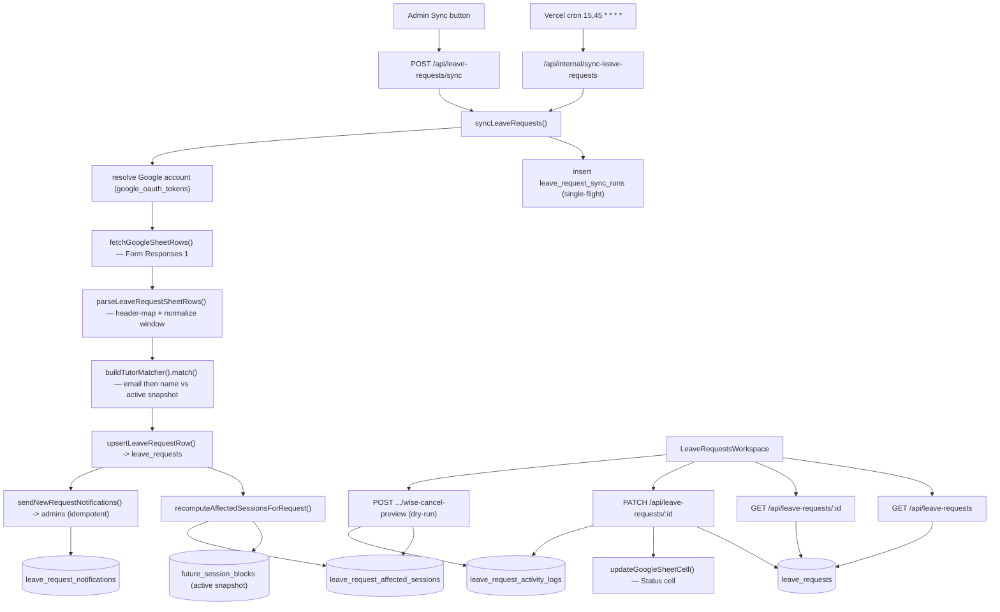

# Leave Requests

**Status: in progress (uncommitted)**

> This feature is **in-progress and entirely uncommitted** at this revision. Migration `drizzle/0036_tutor_leave_requests.sql`, the `leave_request*` tables in `src/lib/db/schema.ts`, the `src/lib/leave-requests/` module, the API routes under `src/app/api/leave-requests/` and `src/app/api/internal/sync-leave-requests/`, the `/leave-requests` page, the nav link, and the `vercel.json` cron entry are all present in the working tree as untracked/modified files (`git status`), none of them committed to `docs/full-redocumentation`. Document content below reflects what exists in the working tree; treat shapes as provisional until they land.
>
> The task brief stated that "routes/UI are pending." That is **not** accurate for this working-tree revision — both exist (uncommitted). See Open Questions.

## Purpose

Leave Requests is the admin workspace for triaging tutor time-off submissions. Tutors fill out a Google Form; its responses land in a Google Sheet ("Form Responses 1"). This feature pulls those rows into Postgres, matches each row to a Wise tutor identity, computes which of that tutor's upcoming Wise sessions actually overlap the requested leave window, and gives admin staff a worklist to review each request, set a workflow status, leave a staff note, and (optionally) write a status string back into the source sheet.

The primary users are the BeGifted admin/ops staff who process leave. The feature is read-mostly with respect to Wise — it **never** mutates Wise sessions; the only Wise-cancellation capability it currently offers is a **dry-run preview** that logs the cancellation endpoints an operator would have to call manually (`src/lib/leave-requests/data.ts:443`). The only outbound write it performs is updating a single "Status" cell in the source Google Sheet, gated on an explicit admin action and a write-scoped Google account.

## Conceptual data model

Leave Requests owns five tables, created together in `drizzle/0036_tutor_leave_requests.sql` and defined in `src/lib/db/schema.ts:1185`–`1326`. For column-level detail (types, defaults, indexes, constraints) see the database reference ERD: [docs/reference/database/erd-leave-requests.md](../reference/database/erd-leave-requests.md).

- **`leave_request_sync_runs`** — one row per sync attempt (manual or cron) with status, trigger type, scanned/inserted/updated/notification counts, error summary, and metadata. A partial unique index enforces single-flight (`leave_request_sync_runs_single_running_idx`, only one `running` row at a time).
- **`leave_requests`** — the central record: one row per source sheet row, with a unique key over the spreadsheet ID, sheet name, and source row number. Conceptually each row carries the parsed form fields, the normalized leave window, the resolved Wise identity (a nullable FK to `tutor_identity_groups` plus a canonical key and a match-confidence label), the admin workflow state (status, staff note, unread flag), the sheet-writeback state, the affected-class and cancellation-preview counts, and the full raw sheet row as JSONB. Exact column names, types, and indexes live in the [ERD](../reference/database/erd-leave-requests.md).
- **`leave_request_affected_sessions`** — the Wise sessions that overlap a request's leave window, denormalized from `future_session_blocks` (unique on `leave_request_id` + `wise_session_id`, cascade-deleted with the parent). Each row carries the overlap in minutes and a `cancel_preview_selected` flag.
- **`leave_request_activity_logs`** — append-only audit trail per request (`source_inserted`, `source_updated`/`source_refreshed`, `status_update`, `sheet_status_write`, `wise_cancel_preview`), with request/response payloads and actor email/name. Cascade-deleted with the parent.
- **`leave_request_notifications`** — one "new submission" email row per (request × recipient), deduped by a unique `idempotency_key` of the form `leave-request:new:{requestId}:{recipient}` (`src/lib/leave-requests/sync.ts:273`) — note the stored dedup key does **not** include the sync run, so the row-level uniqueness is per (request × recipient) regardless of which run inserted it. (A separate per-(syncRunId × recipient) key is built at `sync.ts:247` but is passed only to the email *sender*, not stored on the row.) In practice this is harmless because notifications fire only for rows newly inserted this run (`sync.ts:322`). The row also keeps a nullable `sync_run_id` FK so a notification can be traced back to its run, but that column is not part of the uniqueness constraint.

The feature also **reads** the active Wise snapshot via several existing tables it does not own: `snapshots` (to find the active snapshot), `tutor_identity_groups` / `tutor_identity_group_members` / `tutor_contacts` / `tutor_aliases` (for tutor matching, `src/lib/leave-requests/matching.ts:68`), `future_session_blocks` (for overlap computation, `src/lib/leave-requests/data.ts:256`), `admin_users` (notification recipients, `src/lib/leave-requests/sync.ts:188`), and `google_oauth_tokens` (to pick a Sheets-scoped account, `src/lib/leave-requests/sync.ts:59`).

## API surface

All five HTTP endpoints exist in the working tree. The user-facing ones require an authenticated session (`auth()` from `src/lib/auth.ts`); the internal cron route is protected by `CRON_SECRET` instead (`rejectInvalidCronSecret`, `src/lib/internal/cron-auth.ts:19`). Full request/response contracts belong in the API reference: [docs/reference/api/misc.md](../reference/api/misc.md).

| Endpoint | Purpose |
|---|---|
| `GET /api/leave-requests` | List/triage payload — KPI cards, a per-day timeline, the request rows, and the caller's Google Sheets connection status. Accepts status / search / date-range / summary-only query params (see the [API reference](../reference/api/misc.md) for exact names). |
| `GET /api/leave-requests/[requestId]` | Full detail for one request: the request record (incl. `rawValues`), its affected Wise sessions, and its activity log. |
| `PATCH /api/leave-requests/[requestId]` | Update workflow status / staff note, and optionally write the Status cell back to the source sheet. |
| `POST /api/leave-requests/[requestId]/wise-cancel-preview` | Record a **dry-run** Wise-cancellation preview for the selected affected sessions. No Wise mutation is sent. |
| `POST /api/leave-requests/sync` | Admin-triggered manual sync (`triggerType: "manual"`). Returns 409 if a sync is already running. |
| `GET` / `POST /api/internal/sync-leave-requests` | Cron/manual sync entry point (`triggerType: "cron"`, `CRON_SECRET` auth). `maxDuration = 800`. |

The internal cron route is registered in `vercel.json` to run at `15,45 * * * *` (twice hourly, staggered against the other syncs). Note the naming asymmetry mirrors the other sync features: the cron path is `/api/internal/sync-leave-requests` while the in-app admin trigger is `/api/leave-requests/sync`; both call `syncLeaveRequests` (`src/lib/leave-requests/sync.ts:284`).

## UI

- **Page**: `src/app/(app)/leave-requests/page.tsx` — a server component that gates on an authenticated session (redirects to `/login` otherwise) and renders the client `LeaveRequestsWorkspace` inside a `Suspense` boundary.
- **`LeaveRequestsWorkspace`** (`src/components/leave-requests/leave-requests-workspace.tsx`) — the single client component for the whole feature. A master-detail layout: a left list (status filter + free-text search, a per-day "affected classes" timeline bar chart, and the selectable request rows) and a right inspector for the selected request. It fetches `GET /api/leave-requests` on filter/search change and `GET /api/leave-requests/[id]` on selection.
  - The inspector exposes the workflow controls (status `<select>`, editable Sheet-Status text, staff-note textarea, Save / "Retry Sheet" buttons), the affected-sessions checklist with a "Log Wise Cancel Preview" button, the parsed form notes, the action history, and a collapsible raw-payload `
`.
  - It also surfaces a Google Sheets connection badge and, when write scope is missing, a "Reconnect Sheets" button that triggers `signIn("google", …)` requesting the Sheets write scope (`src/components/leave-requests/leave-requests-workspace.tsx:23`, `:366`).
- **Nav entry**: `src/components/layout/app-nav.tsx:21` adds a "Leave Requests" link with a `leaveRequests` badge. The badge count comes from a separate `GET /api/leave-requests?summaryOnly=true` fetch and shows `unreadActionCount` (`app-nav.tsx:56`).

## Data flow

A sync run is the spine of the feature. `syncLeaveRequests` (`src/lib/leave-requests/sync.ts:284`) opens a `leave_request_sync_runs` row (single-flight guarded), resolves a Google account, fetches the sheet, parses + matches + upserts each row, recomputes affected Wise sessions, emails admins about brand-new requests, and finalizes the run. The triage UI then reads those persisted rows; admin status changes are a separate write path that can also push a Status cell back to the sheet.

## Business rules & edge cases

- **Source is "Form Responses 1" only.** The spreadsheet ID and sheet name are config constants with env overrides (`src/lib/leave-requests/config.ts:1`). The new-request email explicitly states "Leave Analytics and Emergency Tracker are ignored" (`src/lib/leave-requests/sync.ts:220`).
- **Fail-closed triage routing.** `initialWorkflowStatus` (`src/lib/leave-requests/data.ts:55`) routes a new row to `needs_review` whenever the leave window failed to normalize (`normalizationStatus !== "ok"`) **or** the tutor could not be matched (`matchConfidence === "unmatched"`). On re-sync, an existing `new`/`needs_review` row that still fails to normalize or match is held at `needs_review` and never silently advanced (`src/lib/leave-requests/sync.ts:160`).
- **Sheet Status is a hint, not the source of truth.** A source "Status" cell containing done/complete/approved → `done`, ignore → `ignored`, cancel → `canceled_by_tutor`; this only seeds the *initial* workflow status of a freshly-inserted row (`src/lib/leave-requests/data.ts:60`). The matching test pins this behavior (`__tests__/matching.test.ts:24`).
- **Leave-window normalization** (`normalizeLeaveWindow`, `src/lib/leave-requests/parser.ts:208`): missing start/end date → `needs_review`; `endDate < startDate` → flagged `needs_review` but still bounded to a full-day window; named periods map to fixed Bangkok minute ranges (morning `0–720`, afternoon `720–1020`, evening `1020–1440`); "specific" times are parsed by `parseSpecificTimeWindow` (`parser.ts:149`) and, if unparseable, fall back to a full day with a `needs_review` flag (`parser.ts:255`). The whole pipeline is locked to `Asia/Bangkok` (`bangkokDateTimeUtc`, `parser.ts:96`).
- **Dates/timestamps support both Google serial numbers and formatted strings**, including a special-cased Excel/Sheets epoch serial (`EXCEL_UNIX_EPOCH_SERIAL = 25569`, `parser.ts:5`) and `24:00 → 1440` handling in the clock parser (`parser.ts:144`).
- **Header mapping is fuzzy with positional fallback.** `headerIndex` (`parser.ts:276`) matches by exact then substring header text, falling back to a fixed column index, so the parser tolerates header drift; `FALLBACK_HEADERS` (`parser.ts:40`) is used when the sheet has no header row.
- **Change detection by row fingerprint.** Each row gets a SHA-256 fingerprint of its cell values (`rowFingerprint`, `parser.ts:300`). On re-sync, a changed fingerprint re-flags the row as `unread` and logs `source_updated`; matching/status changes log `source_refreshed` (`src/lib/leave-requests/sync.ts:157`).
- **Tutor matching is two-tier and fail-closed.** `buildTutorMatcher` (`src/lib/leave-requests/matching.ts:54`) builds name/email indexes from the active snapshot's identity groups, members, tutor contacts, and aliases. Email match wins (`matchConfidence: "email"`); otherwise normalized-name aliases are tried (`"name"`); otherwise `"unmatched"`. The two helpers do different things, and it matters: `normalizeTutorLookupKey` (`matching.ts:22`) lowercases, strips the word "online" at **any** position (`/\bonline\b/g`, `matching.ts:25`), and collapses non-alphanumerics to spaces (`/[^\p{L}\p{N}]+/gu`, `matching.ts:26`) — so it deletes bracket *characters* but **keeps the text inside them** (the test pins `" Kevin (Kev) Y. Hsieh Online "` → `"kevin kev y hsieh"`, nickname retained, `__tests__/matching.test.ts:7`). The trailing-only "online" removal (`/\s+online$/i`) and the *extraction of a parenthetical nickname into its own separate alias* live in the different helper `tutorNameAliases` (`matching.ts:35`, `:37`–`38`), which builds the candidate alias set (full key, online-stripped key, nickname, first name) used to populate and probe the name index. If there is **no active snapshot**, every row is `unmatched` with reason "No active Wise snapshot found" (`matching.ts:61`).
- **Affected-session overlap** (`recomputeAffectedSessionsForRequest`, `src/lib/leave-requests/data.ts:229`): only sessions in the active snapshot, for the matched `tutorGroupId`, with `isBlocking = true`, whose Bangkok date falls within `[startDate, endDate]` and whose minute range overlaps the leave window are recorded. The row is fully recomputed (delete-then-insert) each sync. A request with no `tutorGroupId`/dates, or no active snapshot, yields zero affected classes. `cancellationPreviewCount` is seeded to the count of overlapping sessions that have **both** a `wiseClassId` and `wiseSessionId`, and only when `normalizationStatus === "ok"` (`data.ts:325`).
- **Wise cancellation is preview-only / manual-required.** `createWiseCancelPreview` (`data.ts:443`) records the DELETE endpoint string (`/teacher/classes/{classId}/sessions/{sessionId}?cancelSession=true`) per selected session with `manualRequired: true` and logs a `wise_cancel_preview` entry whose status is `manual_required` and payload notes `policy: "preview_only_manual_required"`. **No Wise client call is made** — the preview route imports no Wise HTTP client at all, only `auth`, `getDb`, and `createWiseCancelPreview` (`route.ts:1`–`4`). Non-string IDs in the request body are filtered out before the call (`route.ts:21`–`23`). The route test (`wise-cancel-preview/__tests__/route.test.ts`) mocks `createWiseCancelPreview` and verifies the handler **delegates** to it — 401 without a session (`:37`), 200 with non-string IDs filtered out of the forwarded `affectedSessionIds` (`:41`, `:46`–`54`); it does not (and cannot, having no Wise client to spy on) directly assert a Wise mutation was suppressed, so the "no Wise mutation" guarantee rests on the route's imports above rather than on a test assertion.
- **Sheet writeback is gated and best-effort.** `updateLeaveRequestWorkflow` (`data.ts:332`) writes the Status cell (column `S` from config, `config.ts:10`) only when a status/sheet-text/retry was supplied, and only via a write-scoped Google account; a missing account raises `MissingGoogleSheetsTokenError` and the request is recorded as `sheet_write_status = "failed"` with the error surfaced as a UI `warning` (it does **not** throw out of the endpoint). The status update itself always succeeds and is logged independently of the sheet write.
- **Single-flight sync.** A second concurrent sync hits the partial unique index and is surfaced as `LeaveRequestSyncAlreadyRunningError` → HTTP 409 (`sync.ts:44`, `:303`; routes return 409 at `sync/route.ts:31` and `internal/sync-leave-requests/route.ts:16`). Errors during the run mark the row `failed` with an `errorSummary` and re-throw (`sync.ts:361`).
- **New-request notifications are idempotent.** Admin recipients come from `admin_users`; each (request × recipient) email row uses an `idempotencyKey` and `onConflictDoNothing`, so retries don't double-send (`sync.ts:263`). Notifications are sent only for rows newly *inserted* this run, not updates (`sync.ts:322`).
- **Google account resolution** (`resolveLeaveRequestsConnectedEmail`, `sync.ts:49`) prefers the configured `LEAVE_REQUESTS_CONNECTED_EMAIL`, then the actor (read-only syncs), then any stored token with the required scope; write paths require a write-scoped token. Read uses `hasSheetsReadScope`, write uses `hasSheetsWriteScope` (`src/lib/sales-dashboard/google-oauth.ts:78`).

## Tests

Tests live under `src/lib/leave-requests/__tests__/` and `src/app/api/leave-requests/[requestId]/wise-cancel-preview/__tests__/`. All three files (11 tests) pass at this revision (`npx vitest run src/lib/leave-requests src/app/api/leave-requests`).

- **`parser.test.ts`** — full-day row normalization with raw-value preservation; Google serial-date → Bangkok date; named-period → minute ranges (morning/afternoon/evening); a battery of specific-time formats (`10:30-12:00`, `4pm to 6pm`, `10-1pm`, `4 to 6pm`, `Before 13:00`, `16.00 onwards`); ambiguous specific times and inverted date ranges routed to `needs_review`; empty rows skipped.
- **`matching.test.ts`** — tutor-name normalization for Wise lookup; fail-closed `needs_review` routing for unresolved/ambiguous rows; sheet-status hints (`done`/`ignored`) on insert. (Imports `initialWorkflowStatus` from `data.ts` and `normalizeTutorLookupKey` from `matching.ts`.)
- **`wise-cancel-preview/__tests__/route.test.ts`** — the preview route requires auth (401 without a session, `:37`) and delegates to `createWiseCancelPreview` with non-string IDs filtered out (`:41`, `:46`). The test mocks the data-layer helper and checks delegation; the "no Wise mutation" property comes from the route importing no Wise client (`route.ts:1`–`4`), not from a test spy on a Wise call.

**Coverage gaps (no automated tests yet):** the sync orchestrator (`sync.ts`), the affected-session overlap recompute (`recomputeAffectedSessionsForRequest`), the sheet-writeback path and its failure handling (`updateLeaveRequestWorkflow`), the list/detail/PATCH route handlers, and the `LeaveRequestsWorkspace` UI.

## Open questions

- **The task brief said "routes/UI are pending," but they exist.** At this working-tree revision the API routes (`src/app/api/leave-requests/**`, `src/app/api/internal/sync-leave-requests/`), the page (`src/app/(app)/leave-requests/page.tsx`), the workspace component, the nav link, and the `vercel.json` cron entry are all present (uncommitted). Per the ground rules I documented what exists and flagged the discrepancy here rather than silently following the brief. A human should confirm whether the brief is simply stale or whether some of this WIP is expected to be reverted/reworked before commit.
- **Migration journal vs. file ordering.** `drizzle/meta/_journal.json` is modified and there is a second untracked migration `drizzle/0037_payroll_rate_cards.sql` in the tree. Whether `0036` is correctly sequenced/registered in the journal for this branch should be confirmed before this work is committed/migrated.
- **Hard-coded default spreadsheet ID.** `LEAVE_REQUESTS_SPREADSHEET_ID` defaults to a literal Google Sheet ID (`config.ts:1`) when the env var is unset. A human should confirm that fallback is intended for production vs. requiring the env var.
- **Workflow statuses `in_progress` and `done`/`canceled_by_tutor` have no automated transitions.** They are settable via PATCH and seedable from the sheet, but nothing in the sync path advances a row into `in_progress`. Confirm whether additional automation (or removal of unused states) is planned.
- **No row-deletion/orphan handling.** Rows are upserted by `source_row_number`; there is no path that removes a `leave_requests` row when its source sheet row disappears or is reordered. Confirm whether stale rows are acceptable.

_Verified against HEAD + uncommitted WIP on 2026-05-31._
