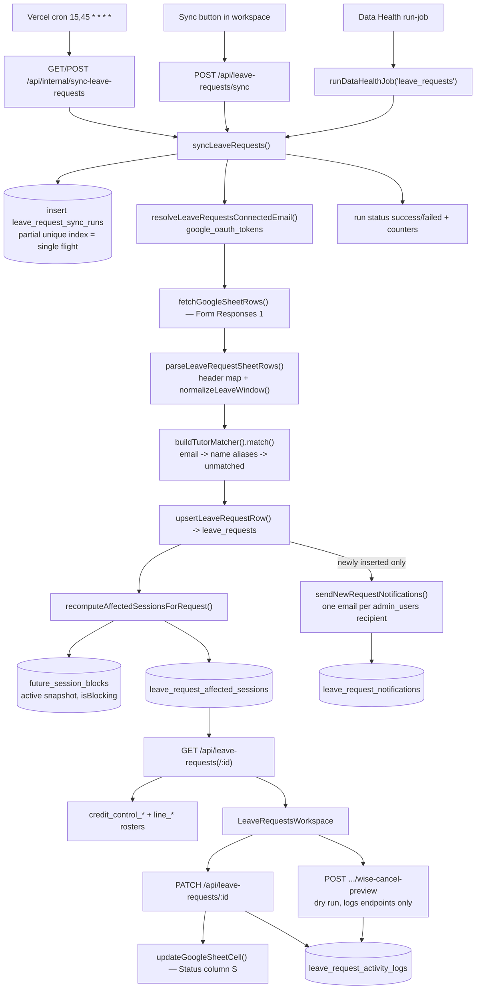

# Leave Requests

**Status: committed, cron-scheduled, nav-registered** — stated from code, because no `@deprecated` or feature-status marker exists anywhere under `src/lib/leave-requests/`, `src/app/api/leave-requests/`, `src/app/(app)/leave-requests/`, or `src/components/leave-requests/`, so no badge is derivable from the tree. What the tree does prove: the source is committed (`git log -1 -- src/lib/leave-requests/` → `8cc2717`, 2026-06-04), cron-scheduled (`vercel.json:39`-`42`, `15,45 * * * *`), and nav-registered (`src/lib/navigation/tools.ts:117`-`124`). Its only Wise-facing capability is a dry-run cancellation preview.

> **Documentation-drift note.** Earlier revisions of this handbook described the feature as "in progress / entirely uncommitted", with routes and UI pending. That is **no longer true at HEAD**, and one such claim still survives in the tree: the API reference calls this source "in-flight WIP at this revision" (`docs/reference/api/misc.md:261`). Every file in this feature is in fact tracked and committed — `git log -1 -- src/lib/leave-requests/` resolves to `8cc2717` (2026-06-04, "chore: reconcile live production source"), `git status --porcelain` is empty for every leave-request source path, and the API routes, the `/leave-requests` page, the nav entry, the `vercel.json` cron entry, and six test files all exist in the tree. The database reference ([`erd-leave-requests.md`](../reference/database/erd-leave-requests.md)) still carries a 🟡 IN PROGRESS badge, but its own text already refuses the uncommitted reading: it records that the five tables and their migration are committed and running in production, and instructs the reader to take the badge as "feature still maturing", not "schema uncommitted" (`erd-leave-requests.md:3`, `:19`-`27`). Everything below describes what is actually in the code.

## Purpose

Leave Requests is the admin workspace for triaging tutor time-off submissions. Those submissions reach the app as rows in one Google Sheet tab — `Form Responses 1` on a hard-coded default spreadsheet id, both overridable by env (`src/lib/leave-requests/config.ts:1`-`5`). A Google Form is presumed upstream — the tab name says so and the workspace header labels the source "Google Form Responses 1" (`leave-requests-panels.tsx:245`) — but the app never touches the Forms API: every read and the single write go through the shared Sheets helpers (`sync.ts:4`, `:392`; `data.ts:5`, `:551`), so the Form is outside this system's reach. A twice-hourly sync pulls those rows into Postgres, matches each row to a Wise tutor identity in the active snapshot, computes exactly which of that tutor's upcoming Wise sessions overlap the requested leave window, and emails the admin allowlist about brand-new submissions. Admin staff then work the resulting queue: set a workflow status, leave a staff note, push a status string back into the source sheet's Status column, and log a preview of the Wise cancellations an operator would have to perform by hand.

The audience is admin/ops staff, which is what the code enforces rather than merely assumes: every in-app route requires an Auth.js session **email**, and the notification recipients are exactly the `admin_users` allowlist (`sync.ts:270`-`276`). Two properties define the feature's posture:

- **It never mutates Wise.** The cancellation capability is a *preview*: it records the endpoints an operator would call and stamps the activity log with `status: "manual_required"` and `policy: "preview_only_manual_required"` (`src/lib/leave-requests/data.ts:652`-`665`). No Wise HTTP client is imported anywhere in `src/lib/leave-requests/` or in the leave-request routes.
- **Its only outbound write to a system of record is one Google Sheets cell** — the Status column (column `S`, `src/lib/leave-requests/config.ts:10`) of the originating sheet row. That write is far less conditional than it looks. `shouldWriteSheet` is true whenever the request body carries `sheetStatusText` (even `null`), `retrySheetWrite`, or *any* `workflowStatus` (`data.ts:517`), and the workspace's Save always sends `workflowStatus` **and** `sheetStatusText` (`leave-requests-workspace.tsx:187`-`192`) — so in practice every save attempts a sheet write. Nor is account availability a gate: the writer email falls back to the acting admin regardless of scope (`data.ts:548`), and when nothing resolves at all the attempt throws `MissingGoogleSheetsTokenError` into the failure branch and is recorded as `sheetWriteStatus = "failed"` (`data.ts:550`, `:578`-`599`) — it is never silently skipped.

Outbound email is a second, lesser side effect (not a write to any system of record): each sync sends one notification per admin recipient through the shared Apps Script schedule-email sender (`sync.ts:333`-`339`, `:415`).

The workspace also enriches each affected class with a student/parent roster and verified LINE contact links pulled from the Credit Control and LINE tables, so staff can see who has to be told about a cancellation before touching anything.

## Conceptual data model

Five owned tables — `leave_request_sync_runs`, `leave_requests`, `leave_request_affected_sessions`, `leave_request_activity_logs`, `leave_request_notifications` — created together in `drizzle/0036_tutor_leave_requests.sql` and defined in `src/lib/db/schema.ts` alongside two supporting `pgEnum`s. Their mechanical detail — `schema.ts` locations, columns, types, defaults, index names, and cascade behaviour — is the database reference's job: [docs/reference/database/erd-leave-requests.md](../reference/database/erd-leave-requests.md). What follows is only what each table *means*.

- **`leave_request_sync_runs`** — one row per sync attempt, manual or cron. Its partial unique index over the `running` status *is* the single-flight guard: there is no pre-check, the second concurrent insert simply collides (see [the single-flight rule](#business-rules--edge-cases)). On completion the run stamps a metadata blob recording which sheet was read, which Google account read it, and which Wise snapshot the matching ran against (`sync.ts:427`-`432`).
- **`leave_requests`** — the central record: one row per source sheet row, identified by its sheet coordinate (spreadsheet id, sheet name, source row number) rather than by submission content. Conceptually it stacks four layers on one row: the raw form fields as submitted; the normalized Bangkok leave window plus the verdict on that normalization; the resolved Wise identity and how confidently it was matched; and the admin layer (workflow state, staff note, unread, sheet-writeback outcome, and the two counters). The untouched sheet row is kept as JSONB so nothing from the form is lost.
- **`leave_request_affected_sessions`** — the Wise sessions that overlap a request's leave window, denormalized out of `future_session_blocks` at sync time. One row per (request, Wise session), recording the overlap in minutes and whether the operator selected it for the cancellation preview. It is a full replace on every recompute, so it always reads "as of the last sync", never as history.
- **`leave_request_activity_logs`** — an append-only audit trail per request. The action types actually emitted are `source_inserted`, `source_updated`, `source_refreshed` (`sync.ts:229`-`235`, `:258`-`266`), `status_update` and `sheet_status_write` (`data.ts:532`-`544`, `:568`-`598`), and `wise_cancel_preview` (`data.ts:652`-`665`), each with request/response payloads and the acting admin's email/name.
- **`leave_request_notifications`** — one "new submission" email row per (request × recipient), deduped on an `idempotency_key` of the form `leave-request:new:{requestId}:{recipient}` (`sync.ts:355`). The *stored* key does not include the sync run, so row-level uniqueness is per (request × recipient) regardless of which run inserted it; a separate per-(run × recipient) key is built at `sync.ts:329` but is handed only to the email *sender*, never persisted. Neither key can suppress a duplicate **send** — see [the notification rule](#business-rules--edge-cases) for what actually does.

The feature also **reads** tables it does not own: `snapshots`, `tutor_identity_groups`, `tutor_identity_group_members`, `tutor_contacts` and `tutor_aliases` for identity matching (`matching.ts:55`-`82`); `future_session_blocks` for overlap computation (`data.ts:443`-`451`); `credit_control_snapshots` / `credit_control_sessions` / `credit_control_students` plus `line_contact_student_links` / `line_contacts` for the affected-student roster (`data.ts:339`-`378`); `admin_users` for notification recipients (`sync.ts:270`-`276`); and `google_oauth_tokens` to pick a Sheets-scoped account (`sync.ts:130`-`140`).

## API surface

Five in-app endpoints plus one internal cron route. Every in-app handler calls `auth()` and requires a session **email** (not merely a session) before doing anything; the cron route uses the constant-time `CRON_SECRET` check instead (`rejectInvalidCronSecret`, `src/app/api/internal/sync-leave-requests/route.ts:10`). Full request/response contracts — status codes, function timeouts, body shapes — live in the API reference: [docs/reference/api/misc.md](../reference/api/misc.md) for the in-app group and [docs/reference/api/internal-crons.md](../reference/api/internal-crons.md) for the cron route.

| Endpoint | Purpose |
|---|---|
| `GET /api/leave-requests` | Queue payload — KPI cards, a per-start-date timeline, the request rows, and the caller's Google Sheets connection status. |
| `GET /api/leave-requests/[requestId]` | Full detail for one request: the record (incl. raw sheet values), its affected Wise sessions with student/LINE rosters, and its activity log. |
| `PATCH /api/leave-requests/[requestId]` | Update workflow status / staff note, and optionally write the Status cell back to the source sheet. |
| `POST /api/leave-requests/[requestId]/wise-cancel-preview` | Record a **dry-run** Wise-cancellation preview for the selected affected sessions. No Wise mutation is sent. |
| `POST /api/leave-requests/sync` | Admin-triggered manual sync (`triggerType: "manual"`). |
| `GET`, `POST /api/internal/sync-leave-requests` | Cron entry point (`CRON_SECRET` only, no session fallback); both methods record `triggerType: "cron"`. |

The cron route is registered in `vercel.json` at `15,45 * * * *` — staggered against the other half-hourly syncs — and mirrored in the Data Health cron registry as job key `leave_requests` (`src/lib/data-health/cron-registry.ts:249`-`261`). That registry entry also makes the sync runnable on demand from Data Health via `POST /api/data-health/jobs/leave_requests/run`, which calls `syncLeaveRequests` with `triggerType: "manual"` (`src/lib/data-health/run-job.ts:140`-`145`). Data Health additionally surfaces run freshness, the last scanned-row count, and run history straight from `leave_request_sync_runs` (`src/lib/data-health/dashboard.ts:560`-`568`, `:712`-`714`).

## UI

- **Page** — `src/app/(app)/leave-requests/page.tsx`: the default export is a *synchronous* Server Component whose entire body is a `<Suspense>` boundary with a three-column skeleton (`:12`-`18`); the auth gate lives in the async child `LeaveRequestsBody`, which awaits `auth()`, redirects to `/login` without a session email, and only then renders the client workspace (`:6`-`10`). That split is what lets the skeleton stream while the session resolves.
- **`LeaveRequestsWorkspace`** (`src/components/leave-requests/leave-requests-workspace.tsx`) — the single stateful client component. It owns the queue filter, date preset, deferred search text, selected request, and two reload tokens; it fetches `GET /api/leave-requests` whenever the derived query string changes and `GET /api/leave-requests/[id]` whenever the selection changes, each behind its own `AbortController` (`:87`-`110`, `:124`-`151`). Selection auto-heals: if the current selection falls out of the visible rows it snaps to the first row (`:112`-`122`).
- **`leave-requests-panels.tsx`** — the presentational layer: `LeaveRequestsCommandHeader` (sync button + Sheets connection state), `LeaveKpiStrip`, `RequestQueue` (+ `RequestQueueRow`), `LeaveTimelinePanel`, `AffectedClassesPanel`, `RequestInspector`, `PreviewOnlyNotice`, and `ErrorBanner`.
- **`view-model.ts`** — all pure presentation logic, which is why it is the most heavily tested part of the UI: queue filters (`filterQueueRows`), the server-side status mapping (`serverStatusForFilter`), Bangkok-anchored date presets (`dateRangeForPreset`), the 14-day timeline builder, status/tone labels, and the alert list (`requestAlerts`).
- **Google Sheets reconnect** — the header badge reads "write connected" / "write scope needed" and the Reconnect Sheets button appears, both driven by `googleSheets.writeConnected` (`leave-requests-panels.tsx:247`-`259`, `:272`-`277`); the button calls `signIn("google", …)` requesting the full spreadsheets scope (`view-model.ts:10`, `leave-requests-workspace.tsx:234`-`238`). **That badge describes the signed-in admin's own Google token, not the account that performs the write.** `GET /api/leave-requests` computes it with `getGoogleTokenStatus(session.user.email)`, a single-row lookup on exactly that email (`route.ts:22`; `src/lib/sales-dashboard/google-oauth.ts:267`-`283`), whereas the writer is resolved independently by `selectLeaveRequestsConnectedEmail` and may be `LEAVE_REQUESTS_CONNECTED_EMAIL` or any other healthy write-scoped account (`sync.ts:107`-`122`, `data.ts:548`). An admin can therefore see "write scope needed" while writes keep succeeding through the configured account — and, less benignly, see "write connected" while the actual writer is broken.
- **Nav + badge** — registered in `src/lib/navigation/tools.ts:117`-`124` under the `scheduling-tutors` section with `badgeKey: "leaveRequests"`. The badge number is *not* computed by this feature's own API: `AppNav` reads `/api/home/summary`, and the home summary calls `listLeaveRequests(db, { summaryOnly: true })` and uses its `unreadActionCount` (`src/lib/home/summary.ts:169`-`170`, `:194`-`200`).

Client-side the queue filter is applied **twice**: `buildListParams` maps `new` / `review` / `done` to a server `status` param, and `filterQueueRows` re-filters the returned rows locally — which is what makes the `action` filter (new ∪ needs-review ∪ failed sheet write) possible without a server-side equivalent (`view-model.ts:72`-`85`, `:126`-`141`).

## Data flow

A sync run is the spine. `syncLeaveRequests` (`src/lib/leave-requests/sync.ts:366`) opens a run row (single-flight guarded by the DB index), resolves a Google account, fetches the sheet, then for each parsed row matches a tutor, upserts the request, and recomputes affected sessions. Newly inserted requests trigger one notification email per admin. The triage UI reads those persisted rows; admin edits are a separate write path that can also push the Status cell back to the sheet.

```mermaid
flowchart TD
  Cron["Vercel cron 15,45 * * * *"] --> CronRoute["GET/POST /api/internal/sync-leave-requests"]
  AdminBtn["Sync button in workspace"] --> ManualRoute["POST /api/leave-requests/sync"]
  DataHealth["Data Health run-job"] --> RunJob["runDataHealthJob('leave_requests')"]
  CronRoute --> Sync["syncLeaveRequests()"]
  ManualRoute --> Sync
  RunJob --> Sync

  Sync --> Run[("insert leave_request_sync_runs<br/>partial unique index = single flight")]
  Sync --> Token["resolveLeaveRequestsConnectedEmail()<br/>google_oauth_tokens"]
  Token --> Fetch["fetchGoogleSheetRows() — Form Responses 1"]
  Fetch --> Parse["parseLeaveRequestSheetRows()<br/>header map + normalizeLeaveWindow()"]
  Parse --> Match["buildTutorMatcher().match()<br/>email -> name aliases -> unmatched"]
  Match --> Upsert["upsertLeaveRequestRow() -> leave_requests"]
  Upsert --> Recompute["recomputeAffectedSessionsForRequest()"]
  Recompute --> FSB[("future_session_blocks<br/>active snapshot, isBlocking")]
  Recompute --> Affected[("leave_request_affected_sessions")]
  Upsert -->|newly inserted only| Notify["sendNewRequestNotifications()<br/>one email per admin_users recipient"]
  Notify --> Notifs[("leave_request_notifications")]
  Sync --> Finish["run status success/failed + counters"]

  Affected --> Api["GET /api/leave-requests(/:id)"]
  Api --> Roster["credit_control_* + line_* rosters"]
  Api --> UI["LeaveRequestsWorkspace"]
  UI --> Patch["PATCH /api/leave-requests/:id"]
  Patch --> SheetWrite["updateGoogleSheetCell() — Status column S"]
  Patch --> Logs[("leave_request_activity_logs")]
  UI --> Preview["POST .../wise-cancel-preview<br/>dry run, logs endpoints only"]
  Preview --> Logs
```

## Business rules & edge cases

**Sheet parsing is defensive about shape.** Column positions are resolved by header text with exact-then-substring matching plus a hard-coded positional fallback per field (`parser.ts:276`-`330`), so a renamed or reordered column degrades rather than crashes; `FALLBACK_HEADERS` (`parser.ts:40`-`60`) labels the raw-value blob when the sheet has no usable header row. A row is skipped entirely only when tutor name, start date *and* timestamp are all empty (`parser.ts:336`). `sourceRowNumber` is derived as `offset + 2` — it assumes exactly one header row (`parser.ts:344`) — and that number is both the upsert key and the sheet cell address used for writeback.

**Dates are read day-first and anchored to Bangkok.** Slash dates parse as `D/M/Y` (`parser.ts:110`-`114`), Google serial numbers convert through the Excel epoch (`EXCEL_UNIX_EPOCH_SERIAL = 25569`, `parser.ts:5`, `:88`-`94`), and every derived timestamp is constructed at `+07:00` (`parser.ts:96`-`102`). A minute value of `1440` (end of day) rolls forward to the next Bangkok day rather than overflowing (`parser.ts:97`-`98`), and the clock parser maps a literal `24:00` to `1440` (`parser.ts:144`).

**The leave window degrades to a full day, but says so.** Named periods map to fixed minute ranges — morning `0–720`, afternoon `720–1020`, evening `1020–1440` (`parser.ts:247`-`253`). A "specific time" is parsed from free text supporting `before/until/till X`, `after/from X`, `X onwards`, and `X - Y` ranges, including inferring a missing am/pm on the start of a range from its end (`parser.ts:163`-`195`). **Fail-closed:** when the text cannot be parsed the window widens to the full day *and* the row is flagged `needs_review` with the offending text quoted into `normalizationError` (`parser.ts:254`-`263`, `:200`-`206`) — the system never narrows a window it does not understand. Missing start/end dates produce a null window and `needs_review` (`parser.ts:221`-`230`); an end date before the start date still produces a full-day window but is flagged (`parser.ts:231`-`240`). A missing end date silently defaults to the start date (`parser.ts:338`).

**Change detection is a row fingerprint.** Every row gets a SHA-256 hash of its cell values (`parser.ts:300`-`305`). On re-sync a changed fingerprint re-raises `unread` and logs `source_updated`; a changed tutor match or sheet status logs `source_refreshed` (`sync.ts:239`-`267`).

**Tutor matching is email-first, then name aliases, then nothing.** `buildTutorMatcher` builds lookup maps from the active snapshot's identity groups, their members, active `tutor_contacts` (both onsite and online emails), and the `tutor_aliases` redirect table (`matching.ts:84`-`111`). Two helpers do different jobs and the difference matters: `normalizeTutorLookupKey` lower-cases, strips the standalone word "online" anywhere in the string, and collapses non-alphanumerics to spaces — so it removes bracket *characters* but keeps the text inside them (`matching.ts:22`-`29`); `tutorNameAliases` is what extracts a parenthesized nickname and the bare first name into their own candidate aliases and strips a *trailing* "online" (`matching.ts:31`-`42`). At match time an email hit wins outright, then each name alias is tried, then the row is `unmatched` with a reason string (`matching.ts:115`-`144`). **Fail-closed:** with no active Wise snapshot *every* row returns `unmatched` with "No active Wise snapshot found." rather than guessing (`matching.ts:61`-`66`).

*Caveat:* there is **no ambiguity detection**. The alias map is built with unguarded `byName.set(...)` calls over groups, members, contacts, contact source names and the alias redirect table (`matching.ts:88`-`111`), so it is last-write-wins: because `tutorNameAliases` emits the bare first name as its own alias (`matching.ts:39`-`40`), two tutors sharing a first name collapse onto whichever group was iterated last, and a bare-first-name row then matches that one silently with `matchConfidence: "name"`. Nothing in the code detects or flags the collision.

**Workflow status is seeded from the sheet, then defended.** On insert, `initialWorkflowStatus` reads the sheet's own Status text — `done`/`complete`/`approved` → `done`, `ignore` → `ignored`, `cancel` → `canceled_by_tutor` — otherwise a bad normalization or an unmatched tutor forces `needs_review`, and only a clean row starts as `new` (`data.ts:166`-`177`). On re-sync an admin's decision is **never** overwritten: a status is pushed back to `needs_review` only if it is still `new` or `needs_review` *and* the row still fails a data-quality check — `normalizationStatus !== "ok"` **or** an `unmatched` tutor (`sync.ts:242`-`246`). Note that second condition is about quality, not about change: a row that has always been unmatched and did not change at all is re-stamped `needs_review` on every sync. Whether anything *changed* is a different variable in the same block (`fingerprintChanged`, `sync.ts:239`), and it drives `unread` and the log action type, not the status. `unread` is sticky — a sync can raise it but never clear it (`sync.ts:253`); clearing it is an admin action (`data.ts:524`). A row whose tutor name is blank is stored as the literal `"(missing tutor)"` rather than failing the insert (`sync.ts:160`).

**Overlap is recomputed from scratch every sync, and only against blocking sessions.** `recomputeAffectedSessionsForRequest` deletes the existing rows first, then re-derives them (`data.ts:400`-`402`). It bails to zero when the request has no matched tutor group or no dates (`data.ts:404`-`410`). Candidate sessions come from `future_session_blocks` in the active snapshot for that group with `isBlocking = true` and a start time inside the Bangkok day range (`data.ts:443`-`451`); each is then re-checked against its Bangkok date key and must have a strictly positive minute overlap with the leave window, where a null request window is treated as the full day (`data.ts:383`-`392`, `:453`-`457`). **`cancellationPreviewCount` is gated on normalization — but only on this path.** The sync recompute counts sessions carrying both a Wise class id and session id, and only when `normalizationStatus === "ok"`, so a freshly-synced `needs_review` row reports zero previewable cancellations (`data.ts:490`). `createWiseCancelPreview` then overwrites the same column with a bare `rows.length` — no normalization check and no class-id/session-id filter (`data.ts:647`-`650`) — so once an admin logs a preview, a `needs_review` request *can* carry a non-zero `cancellationPreviewCount` until the next recompute overwrites it again.

*Edge case:* if no active Wise snapshot exists, the recompute returns `0` **after** having already deleted the existing affected-session rows and **without** resetting `affectedClassCount` on the parent (`data.ts:412`-`417`) — the stored counter can disagree with the (now empty) child rows until the next successful run.

**Google account selection prefers configured, then actor, then any healthy write token.** `selectLeaveRequestsConnectedEmail` is a pure function (which is why it is unit-tested): a configured `LEAVE_REQUESTS_CONNECTED_EMAIL` wins if it is healthy *or* has no token row at all; otherwise the acting admin's token, checked at the requested scope; otherwise the first healthy **write**-scoped token (`sync.ts:88`-`116`). The two callers diverge there. With `requiresWrite = true` the search stops: it returns `null` rather than silently degrading to a read-only account (`sync.ts:117`). A read caller instead falls through to the actor's read-scoped token and then to the first healthy read-scoped token, returning `null` only when no healthy read token exists at all (`sync.ts:119`-`122`). "Healthy" means three things at once: the stored `lastError` does not read as expired/revoked/`invalid_grant`, the row has usable token material, and the scope matches the requested access (`sync.ts:75`-`82`). Usable token material is **not** an either/or — an encrypted access token is required in every case, and a row holding only a refresh token is never healthy. Given one, an absent or zero `expiresAt` counts as usable outright, an expiry beyond the 2-minute skew counts as usable, and only a token at or inside that skew needs a refresh token to rescue it (`sync.ts:68`-`73`). Reads resolve with `requiresWrite = false`; the `PATCH` route resolves with `requiresWrite = true` and swallows the failure into `connectedEmail = null`, letting the write path produce the user-visible error instead (`src/app/api/leave-requests/[requestId]/route.ts:46`-`51`).

**Sheet writeback failures are surfaced, not thrown.** A `PATCH` writes the DB first and sets `sheetWriteStatus = "pending"`, then attempts the cell write. Success stamps `sourceSheetStatus` / `success` / `sheetWrittenAt`; failure records `failed` plus the message and returns it as a non-fatal `warning` on an otherwise successful response, so an admin's status change is never lost to a Sheets outage (`data.ts:519`-`600`). A failed sheet write is itself an action-needed signal — it feeds the "Action needed" filter, the KPI card, and the nav badge (`data.ts:236`, `:240`-`244`, `view-model.ts:68`-`70`). A write with no resolvable account raises `MissingGoogleSheetsTokenError` into that same failure branch (`data.ts:550`).

**The Wise cancel preview is structurally incapable of mutating Wise.** It validates that the selected affected-session ids belong to the request, resets and re-sets the `cancelPreviewSelected` flags, and builds a descriptive list of `DELETE /teacher/classes/{classId}/sessions/{sessionId}?cancelSession=true` strings with `manualRequired: true` — as data written into an activity-log payload, never as a request (`data.ts:613`-`665`). The route's whole import list is `NextRequest` / `NextResponse`, `auth`, `getDb` and `createWiseCancelPreview` — no Wise client of any kind — and it filters non-string ids out of the body before calling through (`wise-cancel-preview/route.ts:1`-`4`, `:21`-`23`). That absence holds feature-wide: no file under `src/lib/leave-requests/` and no leave-request route handler — in-app or cron — imports a Wise HTTP client. The UI states the same policy to the operator (`leave-requests-panels.tsx:735`-`748`).

**LINE contact links are whitelist-validated before rendering.** Only `status = "verified"` links are attached to a student (`data.ts:131`), and any chat URL taken from link evidence must parse as `https://chat.line.biz/{oaId}/chat/{userId}` with both ids matching `/^U[a-fA-F0-9]{32}$/u` — hex in either case (`data.ts:79`, applied at `:104`) — and the user id equal to the expected one, or it is dropped (`data.ts:85`-`107`). Rosters require an active Credit Control snapshot and consider only `sessionKind = "future"` sessions; with no active snapshot the roster is simply empty (`data.ts:339`-`378`).

**Single-flight is enforced by the database.** `syncLeaveRequests` inserts the run row first; a collision with `leave_request_sync_runs_single_running_idx` is detected by message match and converted into `LeaveRequestSyncAlreadyRunningError`, which both sync routes surface as a conflict rather than starting a second run (`sync.ts:55`-`58`, `:384`-`387`; `sync/route.ts:31`, `internal/sync-leave-requests/route.ts:20` — status codes in the API reference). A thrown sync marks the run `failed` with the message and re-throws (`sync.ts:443`-`454`).

**Notification idempotency is row-level, not send-level.** Recipients are the deduped, lower-cased `admin_users` list; zero admins means zero notifications and no error (`sync.ts:270`-`276`, `:322`-`324`). The email is dispatched *first*, once per recipient per run (`sync.ts:333`-`339`), and only then are the per-request rows inserted with `onConflictDoNothing` on `idempotency_key` (`sync.ts:345`-`358`) — a conflict there suppresses a duplicate **row**, never an email that has already gone out. What actually keeps a request from being emailed twice sits one level up: only rows inserted during *this* run enter `newRequests` and reach the sender (`sync.ts:404`-`407`), and a re-scan of the same sheet row takes the update path rather than inserting again. Note that the update path is not database-enforced the way the single-flight guard is: `upsertLeaveRequestRow` runs an explicit `SELECT` on (spreadsheet id, sheet name, source row number) and branches to a plain `insert` or a plain `update` (`sync.ts:202`-`213`, `:219`-`228`, `:248`-`256`) — there is no `ON CONFLICT` on that unique index anywhere, so the index only *prevents* a duplicate row (and would raise on a concurrent race), it does not route the re-scan. Contrast the notification insert, which genuinely does use `onConflictDoNothing` (`sync.ts:358`). The sender's own key is run-scoped (`leave-requests:{syncRunId}:{recipient}`, `sync.ts:329`), so it cannot dedupe across runs either. `notificationCount` increments once per successfully-emailed *row* — N new requests × M admins reports N×M (`sync.ts:359`). Delivery goes through the shared Apps Script schedule-email sender unless a caller injects one via the optional `sender` option (`sync.ts:33`, `:415`); no test currently exercises that seam. The email body explicitly tells admins that only `Form Responses 1` is read and that "Leave Analytics and Emergency Tracker are ignored" (`sync.ts:302`).

**Configuration is read straight from `process.env`, not from the validated env schema.** Spreadsheet id, sheet name and connected email all carry defaults in `config.ts` — including a hard-coded literal spreadsheet id and a fallback to `SALES_DASHBOARD_CONNECTED_EMAIL` (`config.ts:1`-`13`) — and none of them appear in `src/lib/env.ts`, so a misconfiguration surfaces at sync time rather than at boot.

## Tests

Six leave-request test files, split across the three layers, plus cross-feature coverage. Run with `npm test`.

- `src/lib/leave-requests/__tests__/parser.test.ts` — full-day normalization with raw-value preservation, Google serial dates as Bangkok calendar days, partial-day period → minute-range mapping, the specific-time format matrix, the fail-closed path for ambiguous times and inverted date ranges, and empty-row skipping.
- `src/lib/leave-requests/__tests__/matching.test.ts` — despite the file name, only one of its three cases touches the matching layer: `normalizeTutorLookupKey`, a pure string helper (`:6`-`9`). The other two import `initialWorkflowStatus` from `../data` (`:2`) and assert data-layer rules — an unmatched tutor or a failed normalization routing to `needs_review` (`:11`-`22`), and a staff-written sheet status acting as a workflow *hint* only (`:24`-`35`).
- `src/lib/leave-requests/__tests__/sync.test.ts` — `selectLeaveRequestsConnectedEmail` in isolation: configured-email precedence, skipping revoked/expired rows, preferring a write-scoped token over a read-only one, and returning `null` when nothing is healthy.
- `src/lib/leave-requests/__tests__/contact-context.test.ts` — the LINE chat-URL trust check, single-student roster assembly with verified LINE metadata, group classes keeping students distinct while ignoring merely-suggested links, the parent-missing and verified-without-URL states, and the empty-roster case.
- `src/components/leave-requests/__tests__/view-model.test.tsx` — both halves of the UI: pure helpers (action-needed filtering, status tones, query-param building, Bangkok-anchored presets, the 14-day timeline including month boundaries, pressure labels) and rendered panels (empty queue, timeline rail, the alert stack, preview-only copy, roster fallbacks and unverified LINE states, group-class rosters, the inspector with no affected sessions).
- `src/app/api/leave-requests/[requestId]/wise-cancel-preview/__tests__/route.test.ts` — the route requires auth, and delegates to preview logging **without any Wise client mutation**. Note the test mocks the data-layer helper and asserts delegation; the "no Wise mutation" guarantee rests on the route's import list rather than on a spy over a Wise call.

Cross-feature coverage is thinner than the file names suggest. `src/lib/internal/__tests__/cron-watchdog.test.ts` uses `"leave_requests"` only as an arbitrary fixture job key inside generic sweep/alert scenarios (`:222`, `:286`, `:312`) — it asserts nothing about this feature's registry entry. That entry is covered only *implicitly*, by the whole-list equality between `SCHEDULED_CRON_JOBS` and `vercel.json` in `src/lib/data-health/__tests__/cron-registry.test.ts:7`-`20` (the string `leave` never appears in that file), and `src/__tests__/vercel-crons.test.ts` does not mention leave requests at all. Genuine cross-feature coverage does exist for the badge: `src/components/home/__tests__/home-hub.test.tsx` and `src/lib/home/__tests__/summary.test.ts` both exercise the home-hub `leaveRequests` action item and its count.

There is **no** test for `syncLeaveRequests` end to end, for `recomputeAffectedSessionsForRequest`, or for `updateLeaveRequestWorkflow` — the three functions that own the write paths — nor for the list/detail/PATCH route handlers. `syncLeaveRequests` is not named in any test file in `src/`, which is why the injectable `sender` seam is unexercised. **`buildTutorMatcher` is equally uncovered**: `normalizeTutorLookupKey` is the only symbol any test imports from `matching.ts`, so the whole matcher — the email-then-alias precedence, the alias map, and the fail-closed "No active Wise snapshot found." path this page promotes as a key rule — is asserted nowhere; its only caller anywhere in `src/` is the sync itself (`sync.ts:394`).

## Open questions

1. **Maturity label.** The header states the feature's reach from code rather than asserting a maturity badge, because nothing in the tree carries one. Which editorial label should it get — and should the API reference's surviving "in-flight WIP at this revision" line (`docs/reference/api/misc.md:261`) and the ERD's 🟡 IN PROGRESS badge be revised to match, given both pages otherwise describe committed, production code?
2. **Name matching has no ambiguity branch.** `buildTutorMatcher` builds its alias map with last-write-wins `set` calls and emits the bare first name as an alias (`matching.ts:39`-`40`, `:88`-`111`), so two tutors sharing a first name silently collapse and a first-name-only submission is attributed to whichever group was iterated last, with `matchConfidence: "name"`. Should a colliding alias instead be dropped (or downgraded to `unmatched`), in line with the feature's fail-closed posture elsewhere?
3. **`countLeaveRequestActionBadge` looks like dead code.** It is exported from `src/lib/leave-requests/data.ts:677` but has zero callers anywhere in `src/` — the nav badge is served instead by `listLeaveRequests(..., { summaryOnly: true }).unreadActionCount` through the home summary. Was it superseded, or is it waiting on a consumer?
4. **`summaryOnly` still fetches full rows.** `listLeaveRequests` caps at 200 rows in summary mode and 500 otherwise, then discards the rows for summary callers (`data.ts:230`, `:250`). The 200-row cap means badge/KPI counts are computed over at most 200 requests — intentional truncation, or should the summary path be a `count(*)` aggregate?
5. **`recomputeAffectedSessionsForRequest` with no active snapshot** deletes the child rows and returns `0` without resetting the parent's `affectedClassCount` (`data.ts:412`-`417`). Should that path zero the counter, or is the stale count deliberately preserved as a "we lost the snapshot" signal?
6. **Two disagreeing notification idempotency keys.** The persisted row key is per (request × recipient) and excludes the run (`sync.ts:355`); the key handed to the sender is per (run × recipient) (`sync.ts:329`). Neither can dedupe a *send* across runs, and the row key would silently drop the bookkeeping row for a request that was legitimately re-notified. Was the split deliberate, or a leftover from an earlier design?
7. **Sheet Status writeback vs. the sheet's own edits.** `initialWorkflowStatus` reads the sheet's Status only on *insert*; on later syncs a manual edit in the sheet updates `sourceSheetStatus` but never the workflow status. Is the sheet meant to be write-only from the app's side after first ingest?
8. **`sourceRowNumber` as the identity key.** The upsert key is (spreadsheet id, sheet name, source row number) and the row number is derived positionally as `offset + 2` (`parser.ts:344`), so a given `leave_requests` row is bound to a *sheet position*, not to a submission. Whether that is safe depends on an operational fact the repo cannot show: that `Form Responses 1` is append-only — no inserts, deletions, or re-sorts. If it is not, a re-sort would re-point existing rows at different submissions and aim the Status writeback at the wrong cell. Is append-only guaranteed in practice, and should stale/orphaned rows be reaped when a source row disappears?
9. **Unused workflow states.** Nothing in the sync path ever advances a row into `in_progress`; it and `canceled_by_tutor` are only reachable by an admin PATCH or a sheet-status keyword. Is further automation planned, or should the enum be trimmed?

_Verified against HEAD + uncommitted WIP on 2026-05-31._
