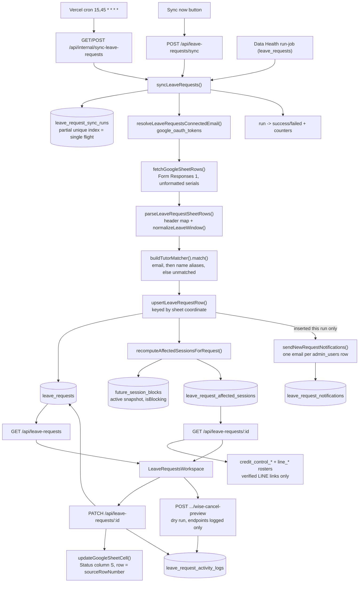

# Leave Requests

**Status: stable** — badge applied from the maturity map for this documentation pass. The mechanism behind it checks out in the tree: every source path is committed (`git log -1 -- src/lib/leave-requests/`, `src/app/api/leave-requests/`, `src/app/(app)/leave-requests/`, `src/components/leave-requests/`, `src/app/api/internal/sync-leave-requests/` all resolve to `8cc2717`, 2026-06-04), the sync is cron-scheduled ([`vercel.json:44`-`47`](../../vercel.json), `15,45 * * * *`), the page is nav-registered ([`src/lib/navigation/tools.ts:118`-`125`](../../src/lib/navigation/tools.ts)), and the six leave-request test files pass (34 tests, run for this revision). Its only Wise-facing capability is a dry-run cancellation preview; it never writes to Wise.

> **Premise check.** The brief for this pass described Leave Requests as *in progress and uncommitted*, with only `config.ts` and the `leave_request*` tables in existence and "routes/UI pending". **That premise does not hold at `0cd1e81`.** `git status --short -- src/ drizzle/ vercel.json` is empty, and the tree contains five module files under `src/lib/leave-requests/`, four in-app route files plus one internal cron route, the `/leave-requests` page, four non-test component files (`leave-requests-panels.tsx`, `leave-requests-workspace.tsx`, `view-model.ts`, `types.ts`), and six test files — all tracked since `8cc2717`. The database reference ([`erd-leave-requests.md`](../reference/database/erd-leave-requests.md)) reached the same conclusion for the schema side. This page documents what is actually in the code; the discrepancy is recorded under [Open questions](#open-questions).

## Purpose

Leave Requests is the admin workspace for triaging tutor time-off submissions. Tutors submit a form whose responses land in one Google Sheet tab — `Form Responses 1` on a hard-coded default spreadsheet id, both overridable by env ([`config.ts:1`-`5`](../../src/lib/leave-requests/config.ts)). The app never touches the Forms API; every read and the single write go through the shared Google Sheets helpers borrowed from the sales dashboard ([`sync.ts:4`](../../src/lib/leave-requests/sync.ts), [`data.ts:5`](../../src/lib/leave-requests/data.ts)).

Twice an hour the sync pulls those rows into Postgres, matches each row to a Wise tutor identity in the active snapshot, computes exactly which of that tutor's upcoming Wise sessions overlap the requested leave window, and emails the admin allowlist about brand-new submissions. Admin staff then work the resulting queue: set a workflow status, leave a staff note, push a status string back into the sheet's Status column, and log a *preview* of the Wise cancellations an operator would have to perform by hand.

The audience is admin/ops staff, and the code enforces that rather than assuming it: every in-app route requires an Auth.js session **email** ([`route.ts:8`-`11`](../../src/app/api/leave-requests/route.ts)), the page redirects to `/login` without one ([`page.tsx:6`-`10`](../../src/app/%28app%29/leave-requests/page.tsx)), and notification recipients are exactly the `admin_users` allowlist ([`sync.ts:270`-`276`](../../src/lib/leave-requests/sync.ts)). Three properties define the feature's posture:

- **It never mutates Wise.** The cancellation capability records the endpoints an operator would call and stamps the activity log `status: "manual_required"` with `policy: "preview_only_manual_required"` ([`data.ts:654`-`661`](../../src/lib/leave-requests/data.ts)). No file under `src/lib/leave-requests/`, `src/app/api/leave-requests/`, `src/app/api/internal/sync-leave-requests/`, or `src/components/leave-requests/` imports anything from `@/lib/wise` (verified by grep for this revision).
- **Its only outbound write to a system of record is one Google Sheets cell** — the Status column (`S`, [`config.ts:10`](../../src/lib/leave-requests/config.ts)) of the originating sheet row ([`data.ts:551`-`557`](../../src/lib/leave-requests/data.ts)).
- **Email is a secondary side effect.** A sync that inserts new requests sends one "new submissions" email per admin; a sync with zero inserts returns before it ever loads recipients or touches the sender ([`sync.ts:322`-`323`](../../src/lib/leave-requests/sync.ts)). Delivery goes through the shared Apps Script schedule-email sender, which POSTs the message to a configured Apps Script web-app URL with a shared secret ([`sync.ts:333`-`339`, `:415`](../../src/lib/leave-requests/sync.ts); [`schedule-email.ts:597`-`627`](../../src/lib/classrooms/schedule-email.ts)).

The workspace also enriches each affected class with a student/parent roster and verified LINE contact links pulled from the Credit Control and LINE tables, so staff can see who has to be told about a cancellation before touching anything ([`data.ts:332`-`380`](../../src/lib/leave-requests/data.ts)).

## Conceptual data model

Five owned tables plus two `pgEnum`s, created together in [`drizzle/0036_tutor_leave_requests.sql`](../../drizzle/0036_tutor_leave_requests.sql) (both enums at `:1`-`2`, the five `CREATE TABLE` bodies at `:3`-`124`, then foreign keys and indexes through `:146`). Only the tables sit under the `── Tutor Leave Requests ──` header at [`src/lib/db/schema.ts:2094`](../../src/lib/db/schema.ts); the two enums — `leaveRequestWorkflowStatusEnum` and `leaveRequestSheetWriteStatusEnum` — are declared roughly 1,900 lines earlier, in the file's shared enum block at [`schema.ts:165`-`172` and `:174`-`179`](../../src/lib/db/schema.ts). Columns, types, defaults, index names and cascade behaviour are the database reference's job — see [**erd-leave-requests.md**](../reference/database/erd-leave-requests.md) and the enum lists in [`enums.md`](../reference/database/enums.md). What follows is only what each table *means*.

- **`leave_request_sync_runs`** — one row per sync attempt, manual or cron, on the shared `sync_status` enum (`running` / `success` / `failed`). Its partial unique index over the `running` status *is* the single-flight guard: there is no pre-check, a second concurrent insert simply collides ([`schema.ts:2110`-`2112`](../../src/lib/db/schema.ts); see [Single-flight](#business-rules--edge-cases)). On completion the run stamps a metadata blob recording which sheet was read, which Google account read it, and which Wise snapshot the matching ran against ([`sync.ts:427`-`432`](../../src/lib/leave-requests/sync.ts)).
- **`leave_requests`** — the central record: one row per source sheet row, identified by its sheet coordinate (spreadsheet id, sheet name, source row number) rather than by submission content ([`schema.ts:2168`](../../src/lib/db/schema.ts)). Conceptually it stacks four layers: the raw form fields as submitted; the normalized Bangkok leave window plus the verdict on that normalization; the resolved Wise identity and how confidently it was matched; and the admin layer (workflow state, staff note, unread flag, sheet-writeback outcome, and two counters). The untouched sheet row is kept as JSONB so nothing from the form is lost. It carries **no `snapshot_id`** — leave requests are human workflow state that must survive snapshot rotation.
- **`leave_request_affected_sessions`** — the Wise sessions that overlap a request's leave window, denormalized out of `future_session_blocks` at sync time. One row per (request, Wise session), recording overlap minutes and whether the operator selected it for the cancellation preview. It is a full replace on every recompute, so it always reads "as of the last sync", never as history.
- **`leave_request_activity_logs`** — an append-only audit trail per request. The action types actually emitted are `source_inserted`, `source_updated`, `source_refreshed` ([`sync.ts:229`-`235`, `:258`-`266`](../../src/lib/leave-requests/sync.ts)), `status_update` and `sheet_status_write` ([`data.ts:534`, `:570`, `:591`](../../src/lib/leave-requests/data.ts)), and `wise_cancel_preview` ([`data.ts:654`](../../src/lib/leave-requests/data.ts)), each with request/response payloads and the acting admin's email/name.
- **`leave_request_notifications`** — one "new submission" email row per (request × recipient), deduped on an `idempotency_key` of the form `leave-request:new:{requestId}:{recipient}` ([`sync.ts:355`](../../src/lib/leave-requests/sync.ts)). See [Notifications](#business-rules--edge-cases) for why that key does not dedupe *sends*.

The feature also **reads** tables it does not own: `snapshots`, `tutor_identity_groups`, `tutor_identity_group_members`, `tutor_contacts` and `tutor_aliases` for identity matching ([`matching.ts:55`-`82`](../../src/lib/leave-requests/matching.ts)); `future_session_blocks` for overlap ([`data.ts:443`-`451`](../../src/lib/leave-requests/data.ts)); `credit_control_snapshots` / `credit_control_sessions` / `credit_control_students` plus `line_contact_student_links` / `line_contacts` for the affected-student roster ([`data.ts:339`-`378`](../../src/lib/leave-requests/data.ts)); `admin_users` for notification recipients ([`sync.ts:270`-`276`](../../src/lib/leave-requests/sync.ts)); and `google_oauth_tokens` to pick a Sheets-scoped account ([`sync.ts:130`-`140`](../../src/lib/leave-requests/sync.ts)).

## API surface

Five in-app endpoints plus one internal cron route. Every in-app handler calls `auth()` and requires a session **email**; the cron route uses the constant-time `CRON_SECRET` check instead ([`internal/sync-leave-requests/route.ts:10`](../../src/app/api/internal/sync-leave-requests/route.ts)). Full request/response contracts — status codes, body shapes, timeouts — live in the API reference: [**leave-requests.md**](../reference/api/leave-requests.md) for the in-app group and [**internal-crons.md § Leave requests**](../reference/api/internal-crons.md#leave-requests) for the cron route.

| Endpoint | Purpose |
|---|---|
| `GET /api/leave-requests` | Queue payload — KPI cards, a per-start-date timeline, the request rows, and the caller's Google Sheets connection status. |
| `GET /api/leave-requests/[requestId]` | Full detail for one request: the record (incl. raw sheet values), its affected Wise sessions with student/LINE rosters, and its activity log. |
| `PATCH /api/leave-requests/[requestId]` | Update workflow status / staff note and attempt the Status-cell writeback to the source sheet. |
| `POST /api/leave-requests/[requestId]/wise-cancel-preview` | Record a **dry-run** Wise-cancellation preview for the selected affected sessions. No Wise call is made. |
| `POST /api/leave-requests/sync` | Admin-triggered manual sync; runs are recorded as manual, not cron. |
| `GET` / `POST /api/internal/sync-leave-requests` | Cron entry point (`CRON_SECRET` only, no session fallback); both verbs record `triggerType: "cron"`. |

The cron route is registered in `vercel.json` at `15,45 * * * *` — staggered against the other half-hourly syncs — and mirrored in the Data Health cron registry as job key `leave_requests` with a 45-minute late threshold and no `dangerous` flag ([`cron-registry.ts:258`-`272`](../../src/lib/data-health/cron-registry.ts)). That registry entry also makes the sync runnable on demand from Data Health: the run-job handler calls `syncLeaveRequests` with `triggerType: "manual"` and the acting admin's email ([`run-job.ts:152`-`162`](../../src/lib/data-health/run-job.ts)). Data Health additionally surfaces run freshness, the last `scannedRowCount` as "N sheet rows", and run history straight from `leave_request_sync_runs` ([`dashboard.ts:207`-`213`, `:560`-`568`, `:714`, `:775`](../../src/lib/data-health/dashboard.ts)). Registry ↔ `vercel.json` parity is pinned by [`cron-registry.test.ts:19`-`25`](../../src/lib/data-health/__tests__/cron-registry.test.ts).

## UI

- **Page** — [`src/app/(app)/leave-requests/page.tsx`](../../src/app/%28app%29/leave-requests/page.tsx). The default export is a *synchronous* Server Component whose whole body is a `<Suspense>` boundary around a three-column skeleton (`:12`-`18`); the auth gate lives in the async child `LeaveRequestsBody`, which awaits `auth()`, redirects to `/login` without a session email, and only then renders the client workspace (`:6`-`10`). That split lets the skeleton stream while the session resolves.
- **`LeaveRequestsWorkspace`** ([`leave-requests-workspace.tsx`](../../src/components/leave-requests/leave-requests-workspace.tsx)) — the single stateful client component. It owns the queue filter (default `action`), date preset, deferred search text, selected request, and two reload tokens; it fetches `GET /api/leave-requests` whenever the derived query string changes and `GET /api/leave-requests/[id]` whenever the selection changes, each behind its own `AbortController` (`:87`-`110`, `:124`-`151`). Selection self-heals: when the current selection drops out of the visible rows it snaps to the first row (`:112`-`122`). Save always sends the **complete** PATCH body — every field at once, never a partial patch (`:187`-`192`; field-by-field semantics in [leave-requests.md § `PATCH /api/leave-requests/[requestId]`](../reference/api/leave-requests.md#patch-apileave-requestsrequestid)) — which is why every Save also attempts a sheet write (see [Business rules](#business-rules--edge-cases)). A `warning` on the response is surfaced through the same error banner (`:198`).
- **`leave-requests-panels.tsx`** — the presentational layer: `LeaveRequestsCommandHeader` (source label "Google Form Responses 1", Sheets badge, `Sync now`, conditional `Reconnect Sheets` — `:245`, `:258`, `:270`, `:273`-`276`), `LeaveKpiStrip`, `RequestQueue`, `LeaveTimelinePanel`, `AffectedClassesPanel` (footer copy "Wise cancellation remains manual", `:692`), `RequestInspector` ("Workflow decision", `Save changes`, `Retry Sheet` — `:866`, `:903`-`910`), `PreviewOnlyNotice` ("Preview only - no Wise mutation is sent.", `:735`-`748`), and `ErrorBanner`.
- **`view-model.ts`** — all pure presentation logic: queue filters and their server-side status mapping (`:72`-`85`), Bangkok-anchored date presets (`:115`-`124`), the 14-day timeline builder (`:212`-`227`), status/tone labels, and the alert list (`:286`-`300`). The queue filter is applied **twice** — `buildListParams` maps `new` / `review` / `done` to a server `status` param and `filterQueueRows` re-filters locally — which is what makes the `action` filter (new ∪ needs-review ∪ failed sheet write) work with no server-side equivalent (`:68`-`85`, `:126`-`141`).
- **`types.ts`** — the fourth non-test file in the directory and the only one with no runtime output: 136 lines of `type`/`interface` declarations (`WorkflowStatus`, `SheetWriteStatus`, `LeaveRequestRow`, `LeaveListResponse`, `TimelineBucket`, `AffectedLineContact`, `AffectedStudentContact`, `AffectedSession`, `ActivityLog`, `LeaveRequestDetail`) shared by the other three ([`workspace.tsx:18`](../../src/components/leave-requests/leave-requests-workspace.tsx), [`panels.tsx:37`](../../src/components/leave-requests/leave-requests-panels.tsx), [`view-model.ts:8`](../../src/components/leave-requests/view-model.ts)). It restates the two `pgEnum` value sets as string unions, so an enum change has to be mirrored here by hand.
- **Google Sheets reconnect** — the `Reconnect Sheets` button calls `signIn("google", …)` requesting the full spreadsheets scope ([`view-model.ts:10`](../../src/components/leave-requests/view-model.ts), [`workspace.tsx:234`-`238`](../../src/components/leave-requests/leave-requests-workspace.tsx)). **The header badge describes the signed-in admin's own token, not the account that performs writes**: `GET /api/leave-requests` computes it with `getGoogleTokenStatus(session.user.email)`, a single-row lookup on exactly that email ([`route.ts:22`](../../src/app/api/leave-requests/route.ts); [`google-oauth.ts:276`-`293`](../../src/lib/sales-dashboard/google-oauth.ts)), whereas the writer is resolved separately and may be `LEAVE_REQUESTS_CONNECTED_EMAIL` or another healthy write-scoped account (see [Google account selection](#business-rules--edge-cases)). An admin can therefore see "write scope needed" while writes succeed through the configured account, or "write connected" while the actual writer is broken.
- **Nav + badge** — registered under `scheduling-tutors` with `badgeKey: "leaveRequests"` ([`tools.ts:118`-`125`](../../src/lib/navigation/tools.ts)). The badge number is not served by this feature's own API: the home summary calls `listLeaveRequests(db, { summaryOnly: true })` and uses its `unreadActionCount`, with the subtitle "N new, M needs review" ([`summary.ts:169`-`170`, `:194`-`200`](../../src/lib/home/summary.ts)).

## Data flow

A sync run is the spine. `syncLeaveRequests` ([`sync.ts:366`](../../src/lib/leave-requests/sync.ts)) opens a run row (single-flight guarded by the DB index), resolves a Google account, fetches the sheet, then for each parsed row matches a tutor, upserts the request, and recomputes affected sessions. Newly inserted requests trigger one email per admin. The triage UI reads those persisted rows; admin edits are a separate write path that also pushes the Status cell back to the sheet.

```mermaid
flowchart TD
  Cron["Vercel cron 15,45 * * * *"] --> CronRoute["GET/POST /api/internal/sync-leave-requests"]
  AdminBtn["Sync now button"] --> ManualRoute["POST /api/leave-requests/sync"]
  DataHealth["Data Health run-job (leave_requests)"] --> Sync
  CronRoute --> Sync["syncLeaveRequests()"]
  ManualRoute --> Sync

  Sync --> Run[("leave_request_sync_runs<br/>partial unique index = single flight")]
  Sync --> Token["resolveLeaveRequestsConnectedEmail()<br/>google_oauth_tokens"]
  Token --> Fetch["fetchGoogleSheetRows()<br/>Form Responses 1, unformatted serials"]
  Fetch --> Parse["parseLeaveRequestSheetRows()<br/>header map + normalizeLeaveWindow()"]
  Parse --> Match["buildTutorMatcher().match()<br/>email, then name aliases, else unmatched"]
  Match --> Upsert["upsertLeaveRequestRow()<br/>keyed by sheet coordinate"]
  Upsert --> Requests[("leave_requests")]
  Upsert --> Recompute["recomputeAffectedSessionsForRequest()"]
  Recompute --> FSB[("future_session_blocks<br/>active snapshot, isBlocking")]
  Recompute --> Affected[("leave_request_affected_sessions")]
  Upsert -->|inserted this run only| Notify["sendNewRequestNotifications()<br/>one email per admin_users row"]
  Notify --> Notifs[("leave_request_notifications")]
  Sync --> Finish["run -> success/failed + counters"]

  Requests --> ListApi["GET /api/leave-requests"]
  Affected --> DetailApi["GET /api/leave-requests/:id"]
  DetailApi --> Roster["credit_control_* + line_* rosters<br/>verified LINE links only"]
  ListApi --> UI["LeaveRequestsWorkspace"]
  DetailApi --> UI
  UI --> Patch["PATCH /api/leave-requests/:id"]
  Patch --> Requests
  Patch --> SheetWrite["updateGoogleSheetCell()<br/>Status column S, row = sourceRowNumber"]
  Patch --> Logs[("leave_request_activity_logs")]
  UI --> Preview["POST .../wise-cancel-preview<br/>dry run, endpoints logged only"]
  Preview --> Logs
```

## Business rules & edge cases

**Sheet parsing is defensive about shape.** Column positions resolve by header text — exact match, then substring — with a hard-coded positional fallback per field ([`parser.ts:276`-`285`, `:310`-`330`](../../src/lib/leave-requests/parser.ts)), so a renamed or reordered column degrades rather than crashes; `FALLBACK_HEADERS` labels the raw-value blob when the sheet has no usable header row (`:40`-`60`, `:291`-`298`). A row is skipped only when tutor name, start date **and** timestamp are all empty (`:336`). `sourceRowNumber` is `offset + 2` — it assumes exactly one header row (`:344`) — and that number is both the upsert key and the sheet cell address used for writeback. The sheet is fetched with `valueRenderOption: "UNFORMATTED_VALUE"` and `dateTimeRenderOption: "SERIAL_NUMBER"` ([`sheets.ts:139`-`141`](../../src/lib/sales-dashboard/sheets.ts)), which is why the parser handles numeric serials first.

**Dates are read day-first and anchored to Bangkok.** Slash dates parse as `D/M/Y` (`parser.ts:110`-`114`), Google serial numbers convert through the Excel epoch (`EXCEL_UNIX_EPOCH_SERIAL = 25569`, `:5`, `:88`-`94`), and every derived timestamp is constructed at `+07:00` (`:96`-`102`). A minute value of `1440` rolls forward to the next Bangkok day rather than overflowing (`:97`-`98`), and the clock parser maps a literal `24:00` to `1440` (`:144`).

**The leave window degrades to a full day, but says so.** Named periods map to fixed minute ranges — morning `0–720`, afternoon `720–1020`, evening `1020–1440` (`parser.ts:247`-`253`). A "specific time" is parsed from free text supporting `before/until/till X`, `after/from X`, `X onwards`, and `X - Y` ranges, including inferring a missing am/pm on the start of a range from its end (`:163`-`195`). **Fail-closed:** when the text cannot be parsed the window widens to the full day *and* the row is flagged `needs_review` with the offending text quoted into `normalizationError` (`:254`-`263`, `:200`-`206`) — the system never narrows a window it does not understand. Missing start/end dates produce a null window and `needs_review` (`:221`-`230`); an end date before the start date still produces a full-day window but is flagged (`:231`-`240`). A missing end date silently defaults to the start date (`:338`).

**Change detection is a row fingerprint.** Every row gets a SHA-256 of its cell values (`parser.ts:300`-`305`). On re-sync a changed fingerprint re-raises `unread` and logs `source_updated`; a changed tutor match or sheet status logs `source_refreshed` ([`sync.ts:239`-`267`](../../src/lib/leave-requests/sync.ts)). The upsert itself is *not* `ON CONFLICT`: it is an explicit `SELECT` on (spreadsheet id, sheet name, row number) followed by a plain insert or update (`:202`-`213`, `:219`-`228`, `:248`-`256`), so the unique index only prevents duplicates — it does not route the re-scan.

**Tutor matching is email-first, then name aliases, then nothing.** `buildTutorMatcher` builds lookup maps from the active snapshot's identity groups, their members, active `tutor_contacts` (onsite and online emails), and the `tutor_aliases` redirect table ([`matching.ts:84`-`111`](../../src/lib/leave-requests/matching.ts)). Two helpers do different jobs: `normalizeTutorLookupKey` lower-cases, strips the standalone word "online" anywhere, and collapses non-alphanumerics to spaces — it removes bracket *characters* but keeps the text inside (`:22`-`29`); `tutorNameAliases` extracts a parenthesized nickname and the bare first name as their own candidates and strips a *trailing* "online" (`:31`-`42`). At match time an email hit wins outright, then each name alias is tried, then the row is `unmatched` with a reason string (`:115`-`144`). **Fail-closed:** with no active Wise snapshot *every* row returns `unmatched` with "No active Wise snapshot found." (`:61`-`66`).

*Caveat — no ambiguity detection.* The alias map is built with unguarded `byName.set(...)` over groups, members, contacts, source names and the alias table (`matching.ts:88`-`111`), so it is last-write-wins. Because the bare first name is itself an alias (`:39`-`40`), two tutors sharing a first name collapse onto whichever group was iterated last, and a first-name-only submission matches that one silently with `matchConfidence: "name"`.

**Workflow status is seeded from the sheet, then defended.** On insert, `initialWorkflowStatus` reads the sheet's own Status text — `done`/`complete`/`approved` → `done`, `ignore` → `ignored`, `cancel` → `canceled_by_tutor` — otherwise a bad normalization or an unmatched tutor forces `needs_review`, and only a clean row starts as `new` ([`data.ts:166`-`177`](../../src/lib/leave-requests/data.ts)). On re-sync an admin's decision is **never** overwritten: a status is pushed to `needs_review` only if it is still `new` or `needs_review` *and* the row still fails a quality check (`sync.ts:242`-`246`) — a condition about quality, not change, so a permanently unmatched row is re-stamped `needs_review` on every sync. `unread` is sticky — a sync can raise it but never clear it (`sync.ts:253`); clearing is an admin action (`data.ts:524`). A blank tutor name is stored as the literal `"(missing tutor)"` rather than failing the insert (`sync.ts:160`). Nothing in the sync path ever produces `in_progress`; it and `canceled_by_tutor` are reachable only by admin PATCH or a sheet keyword.

**Overlap is recomputed from scratch every sync, and only against blocking sessions.** `recomputeAffectedSessionsForRequest` deletes the existing child rows first (`data.ts:401`), bails to a zero count when the request has no matched group or no dates (`:404`-`410`), and otherwise pulls `future_session_blocks` for the active snapshot and group with `isBlocking = true` inside the Bangkok day range (`:443`-`451`), keeping each only if its Bangkok date falls inside the leave and its minute overlap is strictly positive (`:454`-`457`). **`cancellationPreviewCount` is gated on normalization here** — only sessions with both a Wise class id and session id count, and only when `normalizationStatus === "ok"` (`:490`) — but `createWiseCancelPreview` later overwrites the same column with a bare `rows.length` (`:649`), so a `needs_review` request *can* advertise previewable cancellations until the next recompute. This is tracked as **DEF-12** in [`docs/OPEN-QUESTIONS.md`](../OPEN-QUESTIONS.md).

*Edge case:* with no active Wise snapshot the recompute returns `0` **after** deleting the child rows and **without** resetting the parent's `affectedClassCount` (`data.ts:417`), so the stored counter can disagree with the now-empty child rows until the next successful run.

**Google account selection prefers configured, then actor, then any healthy write token.** `selectLeaveRequestsConnectedEmail` is a pure function ([`sync.ts:88`-`123`](../../src/lib/leave-requests/sync.ts)): a configured `LEAVE_REQUESTS_CONNECTED_EMAIL` wins if its token row is healthy **or if it has no token row at all** (`:107`-`110`) — in the latter case the subsequent Sheets fetch fails loudly with `MissingGoogleSheetsTokenError` rather than falling back; otherwise the acting admin's token at the requested scope; otherwise the first healthy **write**-scoped token. With `requiresWrite = true` the search stops there and returns `null` rather than degrading to a read-only account (`:117`); a read caller falls through to any healthy read-scoped token (`:119`-`122`). "Healthy" means `lastError` does not read as expired/revoked/`invalid_grant`, the row has an encrypted access token (a refresh token alone is never enough), and the scope matches (`:60`-`82`). The `PATCH` route resolves with `requiresWrite = true` and swallows failure into `connectedEmail = null` ([`[requestId]/route.ts:46`-`51`](../../src/app/api/leave-requests/%5BrequestId%5D/route.ts)), and the data layer then falls back to the acting admin's email regardless of scope (`data.ts:548`).

**Sheet writeback failures are surfaced, not thrown — and every save attempts one.** `shouldWriteSheet` is true whenever the PATCH body carries any of the three fields that can imply a status change (`data.ts:517`; the body's field-level contract is [leave-requests.md § `PATCH`](../reference/api/leave-requests.md#patch-apileave-requestsrequestid)'s job). Because the workspace always sends the full body rather than a partial patch ([`workspace.tsx:187`-`192`](../../src/components/leave-requests/leave-requests-workspace.tsx)), that predicate is always true in practice: **every Save writes the sheet.** The DB is updated first with `sheetWriteStatus = "pending"`, then the cell write runs with `valueInputOption: "USER_ENTERED"` ([`sheets.ts:254`](../../src/lib/sales-dashboard/sheets.ts)). Success stamps `sourceSheetStatus` / `success` / `sheetWrittenAt` (`data.ts:562`); failure records `failed` plus the message and returns it as a non-fatal `warning` on an otherwise successful response, so an admin's status change is never lost to a Sheets outage (`:580`-`584`). A failed write is itself an action-needed signal — it feeds the "Action needed" filter, the KPI card, and the nav badge (`data.ts:236`, `:240`-`244`; [`view-model.ts:68`-`70`](../../src/components/leave-requests/view-model.ts)). No resolvable account raises `MissingGoogleSheetsTokenError` into the same failure branch (`data.ts:550`).

**The Wise cancel preview is structurally incapable of mutating Wise, but its id handling is loose.** It de-dupes the submitted ids and rejects an empty selection (`data.ts:613`-`614`), loads the affected-session rows that match **both** the request and the submitted ids, and throws only when *zero* of them match (`:616`-`623`) — so membership is never checked per id. Foreign ids are silently dropped from the query result and therefore from `endpoints` and the `cancellationPreviewCount` write, both of which derive from the filtered `rows` (`:637`, `:649`), yet the **full submitted list** — foreign ids included — is persisted verbatim into the activity log as `selectedAffectedSessionIds: ids` (`:659`). The audit payload can therefore name ids that were never previewed. From there it resets and re-sets `cancelPreviewSelected` (`:627`, `:631`) and builds a list of `DELETE /teacher/classes/{classId}/sessions/{sessionId}?cancelSession=true` strings with `manualRequired: true` as *data* inside an activity-log payload (`:640`-`644`, `:654`-`661`). The route filters non-string ids and imports no Wise client ([`wise-cancel-preview/route.ts:1`-`4`, `:21`-`23`](../../src/app/api/leave-requests/%5BrequestId%5D/wise-cancel-preview/route.ts)). Every error on this route maps to `400` — there is no `500` branch — and the sibling `GET [requestId]` has no try/catch at all; both are tracked as **DEF-10** in [`docs/OPEN-QUESTIONS.md`](../OPEN-QUESTIONS.md).

**LINE contact links are whitelist-validated before rendering.** Only `status = "verified"` links attach to a student (`data.ts:131`, `:370`), and a chat URL taken from link evidence must parse as `https://chat.line.biz/{oaId}/chat/{userId}` with both ids matching `/^U[a-fA-F0-9]{32}$/u` and the user id equal to the expected one, or it is dropped (`:79`, `:85`-`107`). Rosters require an active Credit Control snapshot and consider only `sessionKind = "future"` sessions; with no snapshot the roster is simply empty (`:339`-`344`, `:375`).

**Single-flight is enforced by the database, with no stale-run reclaim.** `syncLeaveRequests` inserts the run row first; a collision with `leave_request_sync_runs_single_running_idx` is detected by message match and converted to `LeaveRequestSyncAlreadyRunningError` (`sync.ts:55`-`58`, `:384`-`387`), which both sync routes surface as `409`. A thrown sync marks the run `failed` and re-throws (`:443`-`454`). What it does **not** have is the timeout-based reclaim of an abandoned `running` row that the other `*_sync_runs` lineages carry — each of those defines a 20-minute stale cutoff and fails the stranded row before starting ([`run-wise-sync.ts:10`, `:51`](../../src/lib/sync/run-wise-sync.ts), [`credit-control/run-sync-request.ts:9`, `:50`](../../src/lib/credit-control/run-sync-request.ts), [`progress-tests/run-sync-request.ts:48`](../../src/lib/progress-tests/run-sync-request.ts), [`wise-activity/sync.ts:13`, `:130`](../../src/lib/wise-activity/sync.ts), [`sales-dashboard/import-guard.ts:6`](../../src/lib/sales-dashboard/import-guard.ts), [`competitor-intelligence/sync.ts:40`, `:82`](../../src/lib/competitor-intelligence/sync.ts), [`payroll/sync.ts:24`, `:125`](../../src/lib/payroll/sync.ts)), while `src/lib/leave-requests/sync.ts` matches no `stale`/`reclaim`/`abandoned` grep at all. A function killed at `maxDuration` therefore wedges every later sync (tracked as **DEF-5** in [`docs/OPEN-QUESTIONS.md`](../OPEN-QUESTIONS.md), which counts thirteen reclaiming modules).

**Notification idempotency is row-level, not send-level.** Recipients are the deduped, lower-cased `admin_users` list; zero admins means zero emails and no error (`sync.ts:270`-`276`, `:322`-`324`). The email is dispatched *first*, once per recipient per run (`:333`-`339`), and only then are per-request rows inserted with `onConflictDoNothing` on `idempotency_key` (`:345`-`358`) — a conflict suppresses a duplicate **row**, never an email already sent. What actually prevents double-notifying is one level up: only rows inserted during *this* run reach the sender (`:404`-`407`). The sender's own key is run-scoped (`leave-requests:{syncRunId}:{recipient}`, `:329`) and is never persisted. `notificationCount` increments once per successfully-emailed *row* — N new requests × M admins reports N×M (`:359`). The email links to `${APP_BASE_URL}/leave-requests` and tells admins that only `Form Responses 1` is read ("Leave Analytics and Emergency Tracker are ignored", `:286`, `:302`).

**Configuration is read straight from `process.env`, not the validated env schema.** Spreadsheet id, sheet name, connected email and base URL carry defaults in `config.ts` — including a hard-coded literal spreadsheet id and a fallback to `SALES_DASHBOARD_CONNECTED_EMAIL` ([`config.ts:1`-`21`](../../src/lib/leave-requests/config.ts)) — and none appear in `src/lib/env.ts`, so a misconfiguration surfaces at sync time rather than at boot. The full variable table is [`env.md § 2.6`](../reference/env.md#26-leave-requests-4).

**The cron route records manual re-runs as cron.** Both verbs of `/api/internal/sync-leave-requests` pass `triggerType: "cron"` ([`route.ts:17`](../../src/app/api/internal/sync-leave-requests/route.ts)); only the in-app `POST /api/leave-requests/sync` and the Data Health run-job record `"manual"`.

**Other features depend on this module's helpers.** Progress Tests imports `normalizeTutorLookupKey` ([`teacher-access.ts:17`](../../src/lib/progress-tests/teacher-access.ts)) and `trustedLineChatUrlFromEvidence` ([`line.ts:12`](../../src/lib/progress-tests/line.ts)); Progress Tests' heads-up and digest and the cron watchdog import `APP_BASE_URL` from this feature's `config.ts` ([`teacher-heads-up.ts:24`](../../src/lib/progress-tests/teacher-heads-up.ts), [`admin-digest.ts:26`](../../src/lib/progress-tests/admin-digest.ts), [`cron-watchdog.ts:30`](../../src/lib/internal/cron-watchdog.ts)). A change to those helpers ripples beyond leave requests.

## Tests

Six leave-request test files (34 tests, all passing at this revision under `npx vitest run --project unit`), split across the three layers:

- [`src/lib/leave-requests/__tests__/parser.test.ts`](../../src/lib/leave-requests/__tests__/parser.test.ts) — full-day normalization with raw-value preservation, Google serial dates as Bangkok calendar days, period → minute-range mapping, the specific-time format matrix, the fail-closed path for ambiguous times and inverted date ranges, and empty-row skipping.
- [`src/lib/leave-requests/__tests__/matching.test.ts`](../../src/lib/leave-requests/__tests__/matching.test.ts) — despite the name, only one of three cases touches `matching.ts` (`normalizeTutorLookupKey`, `:6`-`9`); the other two import `initialWorkflowStatus` from `../data` and assert the needs-review routing and the sheet-status-as-hint rule (`:11`-`35`).
- [`src/lib/leave-requests/__tests__/sync.test.ts`](../../src/lib/leave-requests/__tests__/sync.test.ts) — `selectLeaveRequestsConnectedEmail` in isolation: configured-email precedence, skipping revoked/expired rows, preferring write over read scope, and `null` when nothing is healthy.
- [`src/lib/leave-requests/__tests__/contact-context.test.ts`](../../src/lib/leave-requests/__tests__/contact-context.test.ts) — the LINE chat-URL trust check, single-student roster assembly, group classes keeping students distinct while ignoring `suggested` links, parent-missing / verified-without-URL states, and the empty-roster case.
- [`src/components/leave-requests/__tests__/view-model.test.tsx`](../../src/components/leave-requests/__tests__/view-model.test.tsx) — pure helpers (action-needed filtering, tones, query-param building, Bangkok presets, the 14-day timeline across month boundaries, pressure labels) and rendered panels via `renderToStaticMarkup` (empty queue, timeline rail, the alert stack, preview-only copy, roster fallbacks, group-class rosters, the inspector with no affected sessions).
- [`src/app/api/leave-requests/[requestId]/wise-cancel-preview/__tests__/route.test.ts`](../../src/app/api/leave-requests/%5BrequestId%5D/wise-cancel-preview/__tests__/route.test.ts) — the route requires auth and delegates to `createWiseCancelPreview` with non-string ids stripped. The data layer is mocked, so the "no Wise mutation" guarantee rests on the import list, not on a spy.

Cross-feature coverage: [`src/lib/home/__tests__/summary.test.ts`](../../src/lib/home/__tests__/summary.test.ts) and [`src/components/home/__tests__/home-hub.test.tsx`](../../src/components/home/__tests__/home-hub.test.tsx) exercise the `leaveRequests` badge action item; [`cron-registry.test.ts`](../../src/lib/data-health/__tests__/cron-registry.test.ts) covers the cron entry only implicitly through whole-list parity with `vercel.json`.

**Untested write paths.** No test in `src/` names `syncLeaveRequests`, `recomputeAffectedSessionsForRequest`, `updateLeaveRequestWorkflow`, or `buildTutorMatcher` (grep for this revision). The email-then-alias precedence, the alias-map construction, the fail-closed "No active Wise snapshot found." path, the delete-then-rebuild overlap recompute, the sheet writeback branch, and the injectable `sender` seam (`sync.ts:33`, `:415`) are therefore asserted nowhere. The list, detail and PATCH route handlers have no route tests either.

## Open questions

1. **Brief premise vs. tree.** This pass was told the feature is uncommitted with routes/UI pending. At `0cd1e81` everything is committed (`8cc2717`) and the routes, page, components, cron entry and tests all exist. The footer half of this question is settled: no page under `docs/reference/api/` carries `_Verified against HEAD + uncommitted WIP on 2026-05-31._` any more — all 22 were regenerated to `_Verified against main@0cd1e81 (clean tree) on 2026-09-02._`. What is still open is the badge: the ERD keeps its 🟡 IN PROGRESS marker ([`erd-leave-requests.md:3`](../reference/database/erd-leave-requests.md)) with an explicit provenance note saying the premise no longer holds. Is there a newer in-flight branch this brief was describing, and should the badge be retired to match the tree?
2. **Name matching has no ambiguity branch.** The alias map is last-write-wins and emits the bare first name as an alias (`matching.ts:39`-`40`, `:88`-`111`), so two tutors sharing a first name silently collapse. Should a colliding alias be dropped or downgraded to `unmatched`, in line with the fail-closed posture elsewhere?
3. **Two exported helpers have no callers.** `countLeaveRequestActionBadge` (`data.ts:677`) and `affectedSessionLabel` (`data.ts:670`) are exported but referenced nowhere else in `src/` — the badge is served by `listLeaveRequests(..., { summaryOnly: true }).unreadActionCount` instead. Superseded, or waiting on a consumer?
4. **`summaryOnly` still fetches rows.** Summary mode caps at 200 rows and discards them after counting (`data.ts:230`), so badge/KPI counts are computed over at most 200 requests. Intentional truncation, or should it be a `count(*)` aggregate?
5. **No-snapshot recompute leaves a stale counter.** `recomputeAffectedSessionsForRequest` deletes child rows and returns `0` without resetting `affectedClassCount` when no Wise snapshot is active (`data.ts:417`). Zero it, or is the stale count a deliberate "snapshot lost" signal?
6. **Two disagreeing notification idempotency keys.** The persisted key is per (request × recipient) and excludes the run (`sync.ts:355`); the sender's key is per (run × recipient) (`sync.ts:329`). Neither dedupes a send across runs. Deliberate, or a leftover?
7. **Sheet Status is read only on insert.** A later manual edit in the sheet updates `sourceSheetStatus` but never the workflow status (`sync.ts:242`-`246`). Is the sheet meant to be write-only from the app's side after first ingest?
8. **`sourceRowNumber` as identity.** Rows are bound to a sheet *position* (`parser.ts:344`), which is only safe if `Form Responses 1` is append-only — no deletions or re-sorts. Is that guaranteed operationally, and should orphaned rows be reaped when a source row disappears?
9. **`in_progress` is never set automatically.** It and `canceled_by_tutor` are reachable only through admin PATCH or a sheet keyword. Is further automation planned, or should the enum be trimmed?
10. **Cron `POST` records `"cron"`.** A manual re-run through `/api/internal/sync-leave-requests` is logged as a cron trigger (`route.ts:17`). Intentional?
11. **The header Sheets badge measures the wrong account.** It reflects the signed-in admin's token (`route.ts:22`) while writes may go through `LEAVE_REQUESTS_CONNECTED_EMAIL`. Should it report the resolved writer instead?
12. **No stale-run reclaim** (cross-reference **DEF-5**). The `*_sync_runs` lineages that were opened for this pass — Wise snapshot, credit control, progress tests, Wise activity, sales import, competitor intelligence, payroll — all reclaim an abandoned `running` row on a 20-minute cutoff; this one does not. Intentional, or add the same 20-minute reclaim?
13. **The cancel-preview audit log can name ids it never previewed.** `createWiseCancelPreview` throws only when *no* submitted id belongs to the request (`data.ts:623`), then logs the raw submitted list (`:659`) while the endpoints and the count come from the filtered rows (`:637`, `:649`). Should a foreign id be rejected outright, or should the log record the matched ids instead of the submitted ones?

_Verified against main@0cd1e81 (clean tree) on 2026-09-02._
