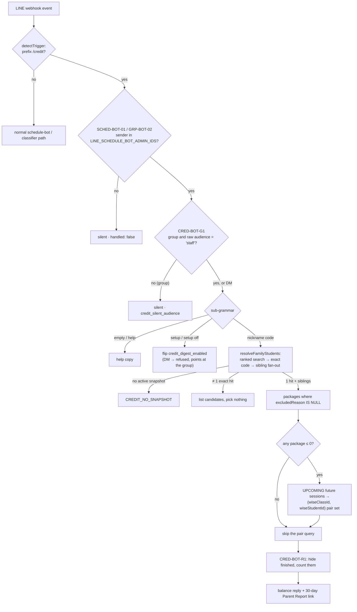

# LINE Credit Bot

**Status: stable**

What the badge rests on: three commits built the whole surface and nothing has touched it since —
`b9c0e19` (2026-08-17) the `/credit` balances command plus the daily run-out digest, `9bc2b43`
(2026-08-19) the finished-package filter and the per-admin digest sections, and `8148ac9`
(2026-08-29), which added the sibling `/report` family and reused this module's family resolver and
staff gate rather than forking them. It is cron-scheduled
([`vercel.json:68`-`71`](../../vercel.json)), registered in the Data Health cron registry under
`feature: "Credit Control"` ([`cron-registry.ts:338`-`353`](../../src/lib/data-health/cron-registry.ts)),
carries one migration ([`drizzle/0067_line_credit_digest.sql`](../../drizzle/0067_line_credit_digest.sql)),
and is covered by three dedicated Vitest files plus eleven copy assertions. The badge comes from
the documentation program's maturity map; there is no maturity marker in code.

It is also the smallest feature in the app that has **no page and no nav entry**. Its entire user
interface is a LINE chat.

## Purpose

An admin is in LINE talking to a parent, and needs one number: *how many credits does this family
have left?* Before this feature the answer meant leaving the conversation, opening
`/credit-control`, finding the student, and reading the dashboard. The credit bot puts that answer
in the chat the question was asked in, and then goes one step further — it stops waiting to be
asked.

Two surfaces, one module pair:

1. **`/credit <code>`** — an on-demand lookup. The bot resolves a bracketed nickname code to the
   *whole family*, replies with each sibling's package balances read from the active credit-control
   snapshot, and appends a link to that family's Parent Report for the last 30 days
   ([`credit-bot.ts:322`-`377`](../../src/lib/line/credit-bot.ts)).
2. **`/credit setup`** — opts a staff group into a **daily 09:03 Bangkok digest** that names every
   student whose credits run out inside the next seven days, plus everyone already at zero with
   classes still on the calendar, sectioned by the admin who owns the follow-up
   ([`credit-digest.ts:241`-`412`](../../src/lib/line/credit-digest.ts)).

**Who can use it.** Only the LINE user IDs listed in `LINE_SCHEDULE_BOT_ADMIN_IDS`, and inside a
group only in a chat whose stored audience is exactly `staff`. Everyone else — a parent, a tutor,
an unlisted staff member — gets *silence*, not a refusal. Both properties are inherited or enforced
fail-closed; see [The two gates](#the-two-gates-and-what-audience-does-not-grant).

**What it is not.** It is not a second credit-control engine. It reuses Credit Control's projection
arithmetic and admin-ownership table verbatim
([`credit-digest.ts:38`-`39`](../../src/lib/line/credit-digest.ts)) and writes nothing back to any
credit-control table; it never calls Wise; and it is not a parent-facing product — every link it
sends points at an authenticated page. Business meaning for balances, projection and ownership
belongs to [Credit Control](./credit-control.md); the bot's router, grammar and the wider LINE
surface belong to [LINE Integration](./line-integration.md).

The sibling `/report` command (`src/lib/line/report-bot.ts`) is *not* this feature — it is the
Parent Report's LINE front door — but it is documented here in passing because it imports this
module's `rawStaffGroup` and `resolveFamilyStudents` and mirrors CRED-BOT-G1 as REP-BOT-G1
([`report-bot.ts:27`](../../src/lib/line/report-bot.ts), [`:112`-`114`](../../src/lib/line/report-bot.ts)).
A `student-report.md` feature page does not exist at HEAD (see [Open questions](#open-questions));
its endpoint contract is at
[`reference/api/student-schedule-and-report.md` § `GET /api/student-report`](../reference/api/student-schedule-and-report.md#get-apistudent-report).

## Conceptual data model

The feature **owns** one table and three columns; everything else it touches, it reads. Columns,
indexes and grains are the database reference's job:
[`erd-line.md`](../reference/database/erd-line.md) for what it owns,
[`erd-credit-control.md`](../reference/database/erd-credit-control.md) for what it reads, with the
inventory in [`database/index.md`](../reference/database/index.md). What follows is what those rows
*mean*.

**Owned — the opt-in.** Three columns bolted onto the schedule bot's existing
`line_group_settings` row: `credit_digest_enabled`, `credit_digest_set_by_line_user_id`,
`credit_digest_updated_at` ([`schema.ts:4711`-`4718`](../../src/lib/db/schema.ts); detail at
[`erd-line.md`](../reference/database/erd-line.md#linegroupsettings-line_group_settings)). Living on
the schedule bot's table rather than a table of its own is a deliberate consequence of the design:
a chat's *audience* and its *digest enrolment* are two facts about the same chat, and the digest's
send-time query joins them in one `WHERE`.

**Owned — the ledger.** `line_credit_digest_runs`, one row per Bangkok calendar day, with a unique
index on `digest_date` that *is* the single-flight guard rather than merely backstopping one
([`schema.ts:4733`-`4758`](../../src/lib/db/schema.ts); detail at
[`erd-line.md`](../reference/database/erd-line.md#linecreditdigestruns-line_credit_digest_runs)). Its
counters are split by intent — `runs_out_count` / `already_out_count` describe the credit
population the digest found, `group_count` the audience it meant to reach, and
`attempted_count` / `success_count` / `failed_count` what delivery actually did. The schema comment
names `progress_test_admin_digest_runs` as the pattern it copies.

**Read — the credit-control snapshot.** `credit_control_students` (the directory, via the LINE
student search), `credit_control_packages` (balances, filtered to `excludedReason IS NULL`),
`credit_control_sessions` (`sessionKind = 'future'`, `meetingStatus = 'UPCOMING'`), and
`credit_control_inactive_students` (digest only). All of it comes from whichever snapshot carries
`active = true` at read time, so the bot's answer is exactly as fresh as the last credit-control
sync — which is why every reply ends with a `Data as of …` line
([`schedule-bot-copy.ts:474`-`476`](../../src/lib/line/schedule-bot-copy.ts)).

**Read — ownership.** `credit_control_admin_ownership`, through Credit Control's own
`bulkGetCreditAdminOwnership`, and only for students the digest actually flagged
([`credit-digest.ts:348`-`351`](../../src/lib/line/credit-digest.ts)).

**Not read, deliberately.** The dashboard's `adjustedRemaining` — see
[Balance semantics](#balance-semantics-raw-wise-not-adjusted). And Wise: there is no Wise call
anywhere in either module.

## API surface

One HTTP endpoint, and it is not the command surface.

| Method | Path | Auth | Purpose |
|---|---|---|---|
| GET | `/api/internal/line-credit-digest` | `CRON_SECRET` | Compute today's run-outs and push the digest to every enrolled staff group |

`maxDuration = 300`, constant-time secret check, wrapped in `withCronInvocationAudit` under job key
`line_credit_digest`, and `result.status === "failed"` is the only path that returns `500`
([`route.ts:6`-`24`](../../src/app/api/internal/line-credit-digest/route.ts)). The full request /
response contract and the status ladder belong to the reference:
[`internal-crons.md` § GET /api/internal/line-credit-digest](../reference/api/internal-crons.md#get-apiinternalline-credit-digest);
schedule, registry fields and health derivation are at
[`crons.md` §17](../reference/crons.md#17-line-credit-digest--apiinternalline-credit-digest).

**The `/credit` command has no endpoint of its own.** It arrives on `POST /api/line/webhook` like
any other LINE event and is routed in-process by the schedule bot's two routers before the
classifier runs, so a `/credit` command never costs an OpenAI call and never enters the parent
review queue ([`schedule-bot.ts:261`-`276`](../../src/lib/line/schedule-bot.ts),
[`schedule-bot-group.ts:353`-`366`](../../src/lib/line/schedule-bot-group.ts)). See
[LINE Integration § Schedule bot](./line-integration.md#schedule-bot).

**Manual re-run.** `line_credit_digest` has no branch in `runDataHealthJob`, so the Data Health
"run job" button returns `404 Unknown job` for it; a direct `CRON_SECRET` request is the only manual
path ([`internal-crons.md` § The Data Health manual-run path](../reference/api/internal-crons.md#the-data-health-manual-run-path)
records this alongside six other keys).

## UI

There is none in the app. The interface is the text of four replies, all built in
`src/lib/line/schedule-bot-copy.ts`, and the copy is load-bearing enough to have its own test block.

**Balance reply** (`creditBalanceReply`, [`:526`-`566`](../../src/lib/line/schedule-bot-copy.ts)) —
one `💳` block per sibling, queried student first, each with its package bullets; a
`🗂 N finished packages hidden` line where CRED-BOT-R1 suppressed rows; then a blank line, the
`Report (last 30 days):` label with the URL, an optional `Report covers the first 8 students (+N
more).` note, and the snapshot-age caveat. A student with everything hidden reads
`no active packages` rather than a bare zero ([`:545`](../../src/lib/line/schedule-bot-copy.ts)).
Credits are printed with trailing zeros trimmed and the noun singularised at exactly 1
([`:442`-`448`](../../src/lib/line/schedule-bot-copy.ts)).

**Digest** (`creditDigestMessage`, [`:669`-`795`](../../src/lib/line/schedule-bot-copy.ts)) — a
`👤 <Admin>` section per owner in `ADMIN_OWNER_REGISTRY` order, unrecognised admin keys next
(label-sorted, kept distinct), `Unassigned` last, and owners with nothing to report omitted
entirely. Inside a section, `Already out, classes still scheduled:` leads because those families are
the most urgent, then `Runs out:` grouped under `D/M (Weekday)` date headers. When the only section
is Unassigned the `👤` header is suppressed and the output is byte-identical to the pre-grouping
format. Footer: the dashboard URL and the snapshot caveat.

**Help** (`CREDIT_HELP_DM` / `CREDIT_HELP_GROUP`,
[`:478`-`487`](../../src/lib/line/schedule-bot-copy.ts)) — deliberately different per surface: a DM
is told to go type `setup` in the staff group, a group is told `setup` / `setup off`.

**Not-exact and no-snapshot** ([`:492`-`505`](../../src/lib/line/schedule-bot-copy.ts)) — candidate
codes are listed, never auto-picked.

The two URLs a reply can carry both point at authenticated pages: the Parent Report print surface
`/student-report/report`, which calls `auth()` and redirects to `/login`
([`(print)/student-report/report/page.tsx:80`-`81`](<../../src/app/(print)/student-report/report/page.tsx>)),
and the `/credit-control` dashboard in the digest footer. Neither is on the middleware public
allowlist ([`middleware.ts:10`-`26`](../../src/middleware.ts)) — unlike the tokenised
`/schedule/{token}` page the [Student Schedule](./student-schedule.md) bot sends, these links are
useless to anyone without a session.

## Data flow

### `/credit <code>` — request to reply

Three details in that path are worth naming. The **directory search is Credit Control's**, not a
bespoke one — `searchCurrentLineStudentsWithSnapshot` returns the active snapshot plus up to five
ranked rows ([`student-links.ts:653`-`662`](../../src/lib/line/student-links.ts)), and
`exactCodeMatches` then throws away every substring and parent-name hit, keeping only rows whose
bracketed nickname code matches exactly after NFKC normalisation
([`schedule-bot-command.ts:132`-`140`](../../src/lib/line/schedule-bot-command.ts),
[`student-links.ts:85`-`91`](../../src/lib/line/student-links.ts)). The **pair query is
conditional**: it only runs when at least one package is already at ≤ 0, so the common all-positive
family costs one query less ([`credit-bot.ts:246`](../../src/lib/line/credit-bot.ts)). And the
**report link is capped** at `REPORT_MAX_STUDENTS = 8`
([`student-report/params.ts:3`](../../src/lib/student-report/params.ts)) with the overflow stated in
the reply rather than silently dropped.

### The daily digest — 09:03 Bangkok

`3 2 * * *` UTC. Vercel fires the route, the route calls `sendLineCreditDigest()`, and the function
walks five ordered decisions before it computes anything
([`credit-digest.ts:241`-`412`](../../src/lib/line/credit-digest.ts)):

1. **Is LINE on?** `lineSchedulerEnabled()` requires `ENABLE_LINE_SCHEDULER !== "false"` *and* both
   channel credentials to be non-blank ([`client.ts:19`-`23`](../../src/lib/line/client.ts)).
2. **Has today already run?** Any `line_credit_digest_runs` row for the Bangkok date, whatever its
   status, is terminal ([`:200`-`207`](../../src/lib/line/credit-digest.ts)).
3. **Is there a snapshot?** No active credit-control snapshot ends the run — and pointedly writes
   **no** terminal row, so a snapshot that lands later the same day can still produce the digest on
   a manual re-run ([`:269`-`274`](../../src/lib/line/credit-digest.ts)).
4. Four reads fire in one `Promise.all`: every non-excluded package on the snapshot, every UPCOMING
   future session, the inactive-student list, and the target groups —
   `audience = 'staff' AND credit_digest_enabled = true`
   ([`:276`-`315`](../../src/lib/line/credit-digest.ts)).
5. **Is anyone listening?** Zero target groups still writes a terminal `skipped` row, because the
   computation *did* happen and tomorrow's run should not redo today
   ([`:325`-`338`](../../src/lib/line/credit-digest.ts)).

Then `computeCreditRunouts` classifies, the run row is claimed, ownership is fetched for the flagged
students only, one message is rendered, and it is pushed group by group. Per-group failures are
caught and counted rather than thrown, so one bad group cannot cost the others their digest; the
run row settles to `sent`, `partial` or `failed` from the tallies
([`:368`-`401`](../../src/lib/line/credit-digest.ts)).

## Business rules & edge cases

### The two gates, and what `audience` does *not* grant

`/credit` sits behind two gates in series. The first is **inherited**: both routers check
`LINE_SCHEDULE_BOT_ADMIN_IDS` before they dispatch the credit verb
([`schedule-bot.ts:247`-`248`](../../src/lib/line/schedule-bot.ts),
[`schedule-bot-group.ts:345`-`348`](../../src/lib/line/schedule-bot-group.ts)), and the allowlist is
itself fail-closed — an unset or empty variable yields an empty `Set` and `isScheduleBotAdmin`
requires `ids.size > 0` ([`:116`-`128`](../../src/lib/line/schedule-bot.ts)). The second is this
feature's own:

> **CRED-BOT-G1 — staff chats only, fail closed *and* fully silent.** In a group, every `/credit`
> command — balances, `setup`, and even bare `/credit help` — requires the chat's stored audience to
> be exactly `"staff"`. A missing settings row, a `family` audience, or any unexpected value
> produces **no reply at all** ([`credit-bot.ts:325`-`329`](../../src/lib/line/credit-bot.ts)).

Silence rather than a refusal is the point: balances, a refusal message, and the help text are all
things a parent must not see, and a refusal would additionally confirm that the bot exists. The gate
reads the column **raw** through `rawStaffGroup`
([`:114`-`121`](../../src/lib/line/credit-bot.ts)) instead of the schedule bot's `groupSettings()`,
because that helper coerces any value other than `"family"` to `"staff"`
([`schedule-bot-group.ts:198`](../../src/lib/line/schedule-bot-group.ts)) — permissive in exactly
the wrong direction here. A DM has no audience concept and is governed by the allowlist alone.

**What a `staff` audience does not do**, and each of these is a separate mechanism:

- **It does not admit a non-admin.** GRP-BOT-02 runs *first*; a parent or tutor sitting in a staff
  chat still gets nothing. `audience` narrows *where* an admin may use the command, never *who* may.
- **It grants no application access.** The schema comment is explicit that `audience` "selects the
  template only — it grants nothing and relaxes no gate"
  ([`schema.ts:4702`-`4703`](../../src/lib/db/schema.ts)). The links in the replies are
  session-gated pages; a forwarded digest is a login wall, not a leak.
- **It does not relax the schedule bot's per-student confirm.** That is `skip_confirm` /
  GRP-BOT-07, a different column with a different toggle.
- **It does not enrol the chat.** Enrolment is `credit_digest_enabled`, and it is re-checked
  jointly with the audience at send time, so a chat later flipped to `family` silently stops
  receiving the digest without anyone editing the opt-in
  ([`credit-digest.ts:306`-`314`](../../src/lib/line/credit-digest.ts)).
- **It cannot be created by `/credit setup`.** That handler is a bare `UPDATE`
  ([`credit-bot.ts:305`-`312`](../../src/lib/line/credit-bot.ts)) — it has no row to flip in a chat
  that never completed the schedule bot's `setup family|staff` registration, and CRED-BOT-G1 would
  have exited silently before reaching it anyway.

`/report` mirrors this rule verbatim as REP-BOT-G1, reusing the same `rawStaffGroup`
([`report-bot.ts:112`-`114`](../../src/lib/line/report-bot.ts)); its reply names every family member,
so the same reasoning applies.

### Balance semantics: raw Wise, not adjusted

Both surfaces report Wise's raw `remainingCredits`. The `/credit-control` dashboard reports
`adjustedRemaining`, which subtracts *pending deductions* — classes that have ended without Wise
having deducted for them yet (see
[Credit Control § Pending deductions](./credit-control.md#pending-deductions--deliberately-pessimistic)).
The bot deliberately does not, so that its numbers match the Parent Report it links to
([`credit-bot.ts:20`-`23`](../../src/lib/line/credit-bot.ts),
[`credit-digest.ts:13`-`16`](../../src/lib/line/credit-digest.ts)).

The consequence is stated rather than hidden: **the dashboard can flag a family a class or two
earlier than the digest.** That is the intended asymmetry — the dashboard is the pessimistic
worklist, the bot is the number you can read aloud to a parent.

### CRED-BOT-R1 — the finished-package filter

A family that has been with the school for years accumulates dead packages: last year's pay band,
an ended summer camp, a receipt-only classroom. Left in, they turn a useful reply into a wall of
zeroes and negatives.

> A package with `remainingCredits ≤ 0` **and** no UPCOMING future session for its
> `(wiseClassId, wiseStudentId)` pair is treated as finished: hidden from the reply, counted into a
> per-student `🗂 N finished packages hidden` line
> ([`credit-bot.ts:266`-`280`](../../src/lib/line/credit-bot.ts)).

Three things follow, all deliberate:

- **A drained package with classes still booked stays visible.** That family needs a top-up, not
  silence — the rule keys on *is anything still scheduled*, never on the balance alone.
- **The family total can read higher than the Parent Report.** The total sums visible rows only
  ([`:289`-`291`](../../src/lib/line/credit-bot.ts)), while the report page still lists everything;
  when the hidden rows are negative, the two legitimately disagree. The hidden-count line is what
  makes that difference visible instead of mysterious.
- **The rule is session-based because Wise offers nothing better.** The header records the
  verification: ended camps come back `hidden: false, isSuspended: false`, so there is no archived
  flag to read ([`:35`-`38`](../../src/lib/line/credit-bot.ts)). Name-keyword matching was
  considered and rejected — a student nicknamed "Summer" would match a summer-camp filter
  ([`:38`-`39`](../../src/lib/line/credit-bot.ts)).

Pretest and Trial packages never appear at all: both queries filter `excludedReason IS NULL`, which
is Credit Control's own exclusion stamped at sync time
(see [Credit Control § Exclusions](./credit-control.md#exclusions-and-de-duplication)).

### Family resolution

One resolver serves `/credit` and `/report`
([`credit-bot.ts:149`-`196`](../../src/lib/line/credit-bot.ts)):

- **Exactly one exact code, or nothing.** Anything else lists candidates and looks up no balances —
  the same discipline as GRP-BOT-03 on the schedule path, for the same reason: a fuzzy hit here
  discloses the wrong family's finances.
- **Siblings fan out by `parentName` within the snapshot**, so one code answers for the whole
  household — which is how parents actually ask.
- **A blank `parentName` must not fan out.** The column defaults to `""`, and matching it would
  sweep in every parent-less student on the snapshot
  ([`:168`-`170`](../../src/lib/line/credit-bot.ts)). The blank case degrades to the queried student
  alone.
- **Order is queried-student-first, then siblings by name, de-duped by key**
  ([`:184`-`187`](../../src/lib/line/credit-bot.ts)) — the person who asked reads their answer on
  line one.
- **Students on the credit-control inactive list are deliberately included.** This is raw snapshot
  truth matching the linked report, not the worklist. The digest takes the opposite position and
  skips them ([`credit-digest.ts:133`](../../src/lib/line/credit-digest.ts)) — correctly, since a
  push about a student nobody is chasing is noise.

### The digest's two buckets

`computeCreditRunouts` is a pure function over packages, sessions and the inactive set
([`credit-digest.ts:115`-`182`](../../src/lib/line/credit-digest.ts)):

- **already out** — balance ≤ 0 *and* at least one class today or later. Reported with the next
  class date, and sorted first in every section because those classes are being taught unpaid.
- **runs out** — walking only *strictly future* Bangkok days and deducting `durationMinutes / 60`
  per class, the balance first reaches ≤ 0 within seven days (`RUNOUT_WINDOW_DAYS`,
  [`:57`](../../src/lib/line/credit-digest.ts)).
- **neither** — a dead package with no upcoming class is not reported at all: nothing is at stake
  in the window. Inactive students are skipped before any of this.

Edge cases that fall out of those definitions:

- **Today's class is excluded from the projection**, mirroring the dashboard's `date > today` filter
  ([`:154`-`159`](../../src/lib/line/credit-digest.ts)). A package with 1 credit and a class today
  is therefore not flagged today; it becomes "already out" tomorrow, once Wise has deducted. Parity
  with the dashboard was chosen over independently correct arithmetic.
- **Zero or negative durations default to 60 minutes** before the division
  ([`:124`](../../src/lib/line/credit-digest.ts)) — the same guard the dashboard applies.
- **`daysUntilExhaust` must be ≥ 1** to enter the run-out bucket
  ([`:162`-`165`](../../src/lib/line/credit-digest.ts)); a same-day exhaustion is either already-out
  or, per the rule above, invisible until tomorrow.

### Bangkok-safety, by construction

Sessions are bucketed with `bangkokDateKey` and fed to `computeProjection` as Bangkok-midnight
instants ([`:117`-`127`](../../src/lib/line/credit-digest.ts),
[`room-capacity/dates.ts:44`-`47`](../../src/lib/room-capacity/dates.ts)), and only the **numeric**
`daysUntilExhaust` is consumed — the exhaust date is rebuilt with `addBangkokDays` rather than read
off the engine's date strings, which run through a process-local formatter and are off by one on a
UTC server ([`credit-digest.ts:18`-`21`](../../src/lib/line/credit-digest.ts),
[`:167`](../../src/lib/line/credit-digest.ts)). This is the module working around the server-local
`today` that [Credit Control](./credit-control.md#timezone) carries as an open question, rather than
inheriting it.

### Idempotency: two independent mechanisms

A daily push that fires twice is a visible failure in a staff chat, so there are two layers:

1. **The per-date run row.** `line_credit_digest_runs` has a unique index on `digest_date`; the
   existence check runs before any work, and a lost concurrent insert surfaces as Postgres `23505`,
   which `createDigestRun` swallows into a `null` return that ends the run
   ([`:209`-`233`](../../src/lib/line/credit-digest.ts),
   [`:340`-`343`](../../src/lib/line/credit-digest.ts)). Note that *any* status is terminal —
   `failed` included. A failed digest is not retried automatically; a human must decide.
2. **The per-`(date, group)` push retry key.** A UUIDv5 over
   `line-credit-digest:{date}:{groupId}` in a namespace of its own, so a credit retry key can never
   collide with a schedule-bot one ([`:54`](../../src/lib/line/credit-digest.ts),
   [`:374`-`377`](../../src/lib/line/credit-digest.ts)). LINE deduplicates on
   `X-Line-Retry-Key` and answers a repeat with `409`, which the client treats as success
   ([`client.ts:123`](../../src/lib/line/client.ts), [`:132`-`141`](../../src/lib/line/client.ts)).
   That makes a webhook- or platform-level retry a no-op **even if the run row is missing** — the
   two layers do not depend on each other.

### The skip paths

Expected states never throw. Each returns `status: "skipped"` with an explanatory `message`, so the
route stays `200` and the audit trail reads as a decision rather than an outage
([`:235`-`240`](../../src/lib/line/credit-digest.ts)):

| Condition | Terminal run row? | Why |
|---|---|---|
| LINE disabled (`ENABLE_LINE_SCHEDULER === "false"` or a blank credential) | no | Nothing was computed; the kill switch should not consume the day |
| A run row already exists for this Bangkok date | n/a — it is the guard | Any status is terminal; re-running would double-post |
| No active credit-control snapshot | **no**, on purpose | A snapshot arriving later the same day must still be able to produce the digest |
| No staff group has `credit_digest_enabled` | **yes**, `skipped` | The computation happened and the counts are worth recording |

A fifth exit exists and is a race backstop rather than a state: losing the concurrent
`createDigestRun` insert returns `skipped` with "already created concurrently"
([`:340`-`343`](../../src/lib/line/credit-digest.ts)).

### Sectioning, truncation and delivery

- **Sections follow `ADMIN_OWNER_REGISTRY` order**, then any unrecognised admin key (label-sorted,
  kept distinct rather than folded into Unassigned), then `Unassigned` last; owners with nothing to
  report are omitted ([`schedule-bot-copy.ts:719`-`728`](../../src/lib/line/schedule-bot-copy.ts)).
  Ownership is Credit Control's sidecar, read fresh — see
  [Credit Control § Admin ownership](./credit-control.md#admin-ownership).
- **Truncation cannot lie or strand a header.** LINE caps a text message at 5,000 characters; the
  builder budgets 4,500 and commits structural lines (admin headers, date headers, sub-labels) only
  together with the first student row that fits beneath them, stopping entirely once one row has
  been dropped. The tail reads `…+N more — see the dashboard.`, so a long list reads as truncated
  rather than complete ([`:650`](../../src/lib/line/schedule-bot-copy.ts),
  [`:762`-`791`](../../src/lib/line/schedule-bot-copy.ts)).
- **Delivery is per-group and fail-isolated.** Each push is try/caught; the loop records
  `attempted` / `success` / `failed` and the last error message, and the run settles to `partial`
  when some groups succeeded and `failed` when none did — which is the only case the route turns
  into a `500` ([`credit-digest.ts:366`-`401`](../../src/lib/line/credit-digest.ts)).
- **`sent_at` is set only when at least one push succeeded**
  ([`:398`](../../src/lib/line/credit-digest.ts)).
- **The all-clear is a heartbeat, not silence.** With both buckets empty the digest still posts
  `✅ Credit check (D/M/YYYY) — no students running out in the next 7 days.`
  ([`schedule-bot-copy.ts:686`-`691`](../../src/lib/line/schedule-bot-copy.ts)) — so a staff group
  can tell "nothing to do" apart from "the cron is broken".
- **`APP_BASE_URL` shapes both links**, falling back to `https://bgscheduler.vercel.app`
  ([`credit-digest.ts:56`](../../src/lib/line/credit-digest.ts),
  [`:353`-`355`](../../src/lib/line/credit-digest.ts)); see
  [`reference/env.md`](../reference/env.md).

### `/credit setup`

`CREDIT_SETUP_PATTERN` is `/^setup(?:\s+(on|off))?$/i`
([`schedule-bot-command.ts:70`](../../src/lib/line/schedule-bot-command.ts)) — bare `setup` means
on. In a DM the command is refused with a pointer to the group
([`credit-bot.ts:339`-`342`](../../src/lib/line/credit-bot.ts)), because the thing being enrolled is
a *destination*, and a DM is the wrong one. In a group it stamps `credit_digest_enabled`, the
setting admin's LINE user ID, and `credit_digest_updated_at`
([`:305`-`312`](../../src/lib/line/credit-bot.ts)); note it does **not** touch the row's own
`updated_at`, so the schedule bot's audit timestamp is not disturbed by a digest opt-in.

## Tests

All Vitest unit tests; no integration suite, and the cron route has no route-level test (the
directory holds only `route.ts`).

**`src/lib/line/__tests__/credit-bot.test.ts` — 20 cases in five blocks.**
*Admin gate inheritance* proves a non-admin `/credit` is silently unhandled in a DM and gets no
reply in a group, and — importantly — that nothing is looked up. *DM balance reply* covers sibling
fan-out with queried-student-first ordering, the blank-`parentName` non-fan-out, candidate listing
instead of guessing, the no-snapshot copy, the 8-student link cap with its dropped count, and the
help text. *CRED-BOT-R1* has a case per branch: hidden and counted, kept visible while classes are
booked, positive-with-nothing-booked kept, the fully-archived student, and the assertion that the
pair query is skipped entirely when every package is positive. *CRED-BOT-G1* covers the silent
family-group exit, silence for bare `/credit help`, and the staff-chat happy path. */credit setup*
covers on, `setup off`, the DM refusal, and that setup in a family group is silent **and writes
nothing**. A final block asserts a `/credit` command never reaches the schedule flow.

**`src/lib/line/__tests__/credit-digest.test.ts` — 21 cases.** `computeCreditRunouts` is tested for
single- and multi-session drain, out-of-window exclusion, the already-out bucket, the dead-package
non-report, inactive skipping, **Bangkok- not UTC-day bucketing**, today's-class exclusion
(explicitly labelled dashboard parity), and sort order. `sendLineCreditDigest` is tested for the
push-per-group happy path with run finalisation, per-admin sectioning from the ownership table,
**retry-key stability across runs for the same date and group**, the all-clear heartbeat, the
already-ran short-circuit, the no-snapshot skip *without* a terminal row, the terminal `skipped` row
when no group is registered, the lost-race path, `partial` when one of two groups fails, and the
LINE-disabled skip.

**`src/lib/line/__tests__/report-bot.test.ts` — 14 cases** for the sibling command: inherited admin
gate on both surfaces, the trailing-30-day default with feedback on, a trailing-days argument, an
explicit from/to range, candidate listing, no-snapshot, blank-parent non-fan-out, the 8-student cap,
help, and four REP-BOT-G1 cases.

**`src/lib/line/__tests__/schedule-bot-copy.test.ts` — 11 credit cases** pinning the reply text
itself: per-sibling blocks with the caveat, singularisation at 1 credit, the truncated-link note,
hidden-count placement and singularisation, date-grouped digest rows with weekday and D/M dates,
per-admin sectioning with Unassigned last, the heartbeat line, truncation under the LINE cap with
`+N more`, the guarantee that an admin header is never stranded when all its rows are truncated, and
decimal trimming.

**`src/lib/line/__tests__/schedule-bot-group.test.ts`** additionally pins the grammar —
`detectTrigger("/credit …")` and the case-insensitive `/CREDIT setup`
([`:147`-`149`](../../src/lib/line/__tests__/schedule-bot-group.test.ts)).

Worth noting for [Credit Control](./credit-control.md#tests): `computeProjection` has no test inside
its own feature's suite. Its only real-code exercise in the repo is through
`computeCreditRunouts` here.

## Open questions

1. **A `failed` digest is never retried.** Any run row for the date is terminal, `failed` included
   ([`credit-digest.ts:199`-`207`](../../src/lib/line/credit-digest.ts)), and `line_credit_digest`
   has no branch in `runDataHealthJob`, so recovery means a hand-rolled `CRON_SECRET` request — and
   the row that blocks it must be deleted first. Should a `failed` row be re-runnable, or is
   one-shot-per-day the intent?
2. **`line_credit_digest_runs` is written but never read by Data Health.** It is absent from
   `fetchAllRuns`, so the job falls through to the `room_utilization_sessions` fallback for its
   `latestSuccessfulRun` — a scheduled job whose freshness can be masked by an unrelated table
   (recorded as open question 4 in [`crons.md`](../reference/crons.md)). Wire the ledger in?
3. **The digest is registered `dangerous: true`** ([`cron-registry.ts:349`](../../src/lib/data-health/cron-registry.ts))
   with a confirmation label, but it cannot be run from Data Health at all. The flag currently
   guards a button that returns `404`.
4. **`/credit setup` cannot bootstrap a chat.** It is a bare `UPDATE`, so a staff group must first
   be registered through the schedule bot's `setup staff` flow. That is coherent, but the failure is
   invisible: an admin in an unregistered chat sees nothing at all (CRED-BOT-G1 fires first). Should
   an unregistered *staff-intent* chat get the schedule bot's own setup prompt instead of silence?
5. **Enrolment has no read-back.** Nothing lists which groups are enrolled — no endpoint, no page,
   no `/credit status`. The only way to know is to query `line_group_settings` directly or wait for
   09:03.
6. **`credit_digest_set_by_line_user_id` and `credit_digest_updated_at` have no reader.** They are
   written on every `setup` ([`credit-bot.ts:309`-`310`](../../src/lib/line/credit-bot.ts)) and
   never selected anywhere in `src/`. Audit-only by design, or the beginning of an unbuilt admin
   view?
7. **Two definitions of "still has classes" coexist.** CRED-BOT-R1 asks whether *any* UPCOMING
   future session exists for the pair, with no date bound
   ([`credit-bot.ts:250`-`258`](../../src/lib/line/credit-bot.ts)); the digest asks whether a
   session falls on today or later ([`credit-digest.ts:135`-`138`](../../src/lib/line/credit-digest.ts)).
   Both are correct for their own purpose and both rely on the sync's guarantee that
   `sessionKind = 'future'` rows really are future. Should the rule be shared?
8. **Inactive students are included by `/credit` and excluded by the digest** — deliberate and
   documented in both headers, but an admin who reads a digest and then runs `/credit` on the same
   family sees two different populations. Worth a line of copy?
9. **The Parent Report now has its own page — closed.** [`student-report.md`](./student-report.md)
   landed in this pass (`ls docs/features/` → 25 files), so the `/report` family here links a feature
   doc rather than only an endpoint contract; the contract itself stays at
   [`reference/api/student-schedule-and-report.md` § `GET /api/student-report`](../reference/api/student-schedule-and-report.md#get-apistudent-report).
   This was C-1 in [`OPEN-QUESTIONS.md`](../OPEN-QUESTIONS.md).
10. **The two sibling follow-up edits are done.** [`credit-control.md:62`](./credit-control.md)
    already linked `line-credit-bot.md` and is unblocked by this page;
    [`line-integration.md`](./line-integration.md#open-questions) open question 9 asked for the
    cross-link once this page landed and now carries it, and its open question 5 — that
    `erd-line.md` omits `lineCreditDigestRuns` — is stale: the regenerated ERD documents the table
    and all thirteen LINE tables ([`erd-line.md`](../reference/database/erd-line.md#linecreditdigestruns-line_credit_digest_runs)).

_Verified against main@0cd1e81 (clean tree) on 2026-09-02._
