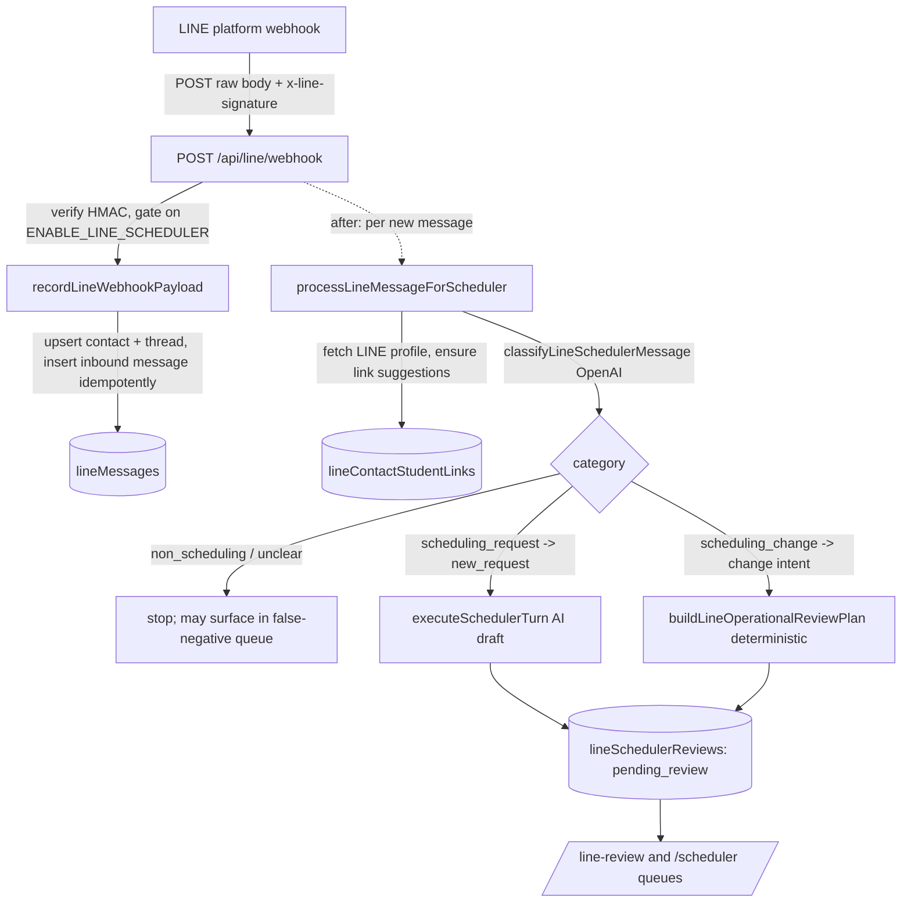

# LINE Integration

**Status: stable (scheduler write-path flag-gated; Wise writeback dry-run only).**

The read/triage path — webhook ingest, classification, the human review queue, contact↔student linking, and the OA resolver — is production-grade. The two mutating edges are deliberately fenced: outbound LINE replies require `ENABLE_LINE_SCHEDULER`, and every Wise session change is recorded as a dry run and never sent (see [Business rules](#business-rules--edge-cases)).

> Mechanical detail lives in the reference pages and this doc links to them. Endpoint signatures: [`reference/api/line.md`](../reference/api/line.md). Table columns/indexes: [`reference/database/erd-line.md`](../reference/database/erd-line.md) and the [database index](../reference/database/index.md).

---

## Purpose

BeGifted runs a LINE Official Account (OA) that parents message — often in Thai, sometimes English — to ask for new classes or to move, pause, resume, or cancel existing ones. This subsystem turns that inbound stream into a **safe, auditable admin worklist**:

1. **Ingest** every inbound LINE message via the platform webhook, deduped and idempotent.
2. **Classify** each message (scheduling request / scheduling change / non-scheduling / unclear) with an LLM, and surface likely misses in a false-negative queue.
3. **Draft** a parent-facing reply — either a full AI-scheduler turn (for new-class requests) or a deterministic operational plan with candidate Wise sessions (for change requests).
4. **Review**: an admin approves-and-sends, accepts-without-sending, rejects (with a correction that feeds telemetry), or dismisses each draft. Sending is the only path that pushes a LINE reply.
5. **Link** each LINE contact to a real Wise/credit-control student, so the system can prove which child a request is about before proposing any operational action. Linking is supported three ways: per-contact in the review screen, bulk **alias import** (paste or screenshot), and the browser-extension-driven **OA resolver**.

The primary users are the same non-technical admin staff who run the rest of BGScheduler. They work the queue from two surfaces: the dedicated `/line-review` page and an embedded LINE queue inside the AI Scheduler page (`/scheduler`).

This is one of the largest subsystems in the app: ~13 library modules under `src/lib/line/`, 28 HTTP handlers under `src/app/api/line/`, eight Postgres tables, and a multi-panel review workspace.

---

## Conceptual data model

LINE owns **eight tables** (all defined in `src/lib/db/schema.ts`). Conceptually they fall into four clusters — see [`reference/database/erd-line.md`](../reference/database/erd-line.md) for the ER diagram, keys, and cascade rules, and the [database index](../reference/database/index.md) for column-level detail.

- **Inbox** — `lineContacts` (one row per LINE user; the hub of the domain, keyed by a unique `line_user_id`), `lineThreads` (one conversation per contact, optionally linked to an AI-scheduler conversation), and `lineMessages` (one row per inbound/outbound event, carrying the inline classifier verdict and a separate human review-of-classification block). Idempotency is enforced by unique indexes on `webhook_event_id` and `line_message_id`.
- **Linking** — `lineContactStudentLinks` (one row per contact↔student association, `suggested | verified | rejected`), which doubles as the validation-workbench worklist via its `validation_assigned_*` columns and `source_kind`/`source_run_id` provenance.
- **Review** — `lineSchedulerReviews` (the central human-in-the-loop record: one review per inbound message, holding the intent, draft, candidate sessions, proposed Wise actions, decision, and LINE send outcome) and `lineWiseActionLogs` (append-only audit of each Wise writeback attempt; `dry_run` defaults to `true`).
- **OA resolver** — `lineOaResolverRuns` (a token-scoped batch job, addressed by a hashed token with an expiry) and `lineOaResolverRows` (one student worklist entry per run, which on commit points back into `lineContacts` / `lineContactStudentLinks`).

**Reads from other domains (never written here):**

- **AI Scheduler** tables (`aiSchedulerConversations` / `aiSchedulerMessages` / `aiSchedulerRuns`) — the LINE review reuses the AI scheduler's conversation/turn/feedback machinery; a thread links to a conversation and a review references the run/message it came from (all `set null`). See [`ai-scheduler.md`](ai-scheduler.md).
- **Credit Control** snapshot tables (`creditControlStudents` / `creditControlPackages` / `creditControlSessions`) — the *current* student directory, "live package / future session" flags, and the candidate future-session list all come from the active credit-control snapshot. See [`credit-control.md`](credit-control.md).
- **Tutor snapshot** tables (`futureSessionBlocks`, `tutorIdentityGroups`) and the in-memory search index — used to attach teacher identity to a candidate session and to score reschedule-replacement tutors.

Snapshot-independent note: the LINE tables survive Wise snapshot rotation (they are not snapshot-scoped), but the student data they join against *is* snapshot-scoped, so a contact's "current student" facts are recomputed against whatever credit-control snapshot is active at read time.

---

## API surface

28 handlers under `src/app/api/line/`. Full method/path/auth/request/response contracts are in [`reference/api/line.md`](../reference/api/line.md) — this is a narrative index only; it does not restate schemas.

**Three auth tiers** guard the group ([`reference/api/line.md` § Authentication model](../reference/api/line.md#authentication-model)): admin Auth.js **session** (the default for everything an admin touches), the LINE **HMAC signature** (webhook only), and a per-run **bearer token** (the two OA-resolver extension endpoints). `src/middleware.ts:10-12` exempts exactly those three machine-facing paths from the login redirect; every other LINE route is session-gated.

- **Webhook** (`POST /api/line/webhook`) — inbound event ingestion; signature-verified, gated by `lineSchedulerEnabled()`, schedules classification off the request path.
- **Scheduler reviews** (`/api/line/scheduler-reviews…`) — list reviews + analytics; the false-negative queue; per-review chat context; the primary `PATCH` decision endpoint (approve-send / accept-no-send / reject / dismiss); and a `POST …/operational-plan` to rebuild a pending review's deterministic plan.
- **Wise actions** (`/api/line/scheduler-reviews/[reviewId]/wise-actions`) — list and *confirm* proposed Wise session changes; confirmation is **dry-run only** in this build.
- **Messages** (`/api/line/messages/[messageId]…`) — promote a missed message into a review; record a human classification correction.
- **Students** (`GET /api/line/students`) — typeahead over current credit-control students for linking.
- **Contacts — link validation** (`/api/line/contacts/link-validation…`) — the round-robin validation worklist, lead-only summary, reviewer assignment, and per-link verify/reject.
- **Contacts — contact + student links** (`/api/line/contacts/[contactId]…`, `…/refresh-profiles`) — edit contact labels, list/create/verify student links, refresh cached LINE profiles.
- **Contacts — alias import** (`/api/line/contacts/alias-import/preview|commit`) — parse pasted chat-list text or a screenshot into proposed aliases, then persist them.
- **Contacts — OA resolver** (`/api/line/contacts/oa-resolver…`) — create/list/get resolver runs, the extension's token-authed worklist + row write-back, and commit resolved rows into links.

There is **no cron** for LINE — ingestion is webhook-driven and the heavy work runs in a Next.js `after()` callback. (LINE does not appear in `vercel.json`.)

---

## UI

Two surfaces consume the same `/api/line/*` endpoints.

### `/line-review` — dedicated triage workspace

`src/app/(app)/line-review/page.tsx` is an async Server Component that gates on an Auth.js session and renders the client shell `LineReviewWorkspace` (`src/components/line-review/line-review-workspace.tsx`) inside `<Suspense>`. The workspace has two tabs (`src/components/line-review/line-review-workspace.tsx:38-41`):

- **AI Review Queue** — the main triage view. Left: `ReviewQueue` (pending reviews, intent filter). Center: `ChatEvidencePanel` (merged LINE + website timeline). Right: `ResolutionBoard` (verified-student status, candidate sessions, proposed Wise actions) and the `ReplyDock` (the approve-send / accept-handled / reject controls). Supporting components: `CaseHeader`, `StudentLinkCommand`, `SignalsDialog` (analytics), `AliasImportDialog`, `OaResolverDialog`, `status-badges`.
- **Mapping Validation** — `MappingValidationWorkspace` + `link-validation-panel` + `resolution-board`, the round-robin link-validation tracker driven by the OA-resolver worklist.

`alias-import-batch.ts` holds the client-side batching logic for the screenshot/paste importer; `utils.ts` holds shared helpers including `studentLinkVisibilityForReview` (the verified/suggested/none badge logic, `src/components/line-review/utils.ts:115-135`).

### `/scheduler` — embedded LINE queue

The AI Scheduler workspace (`src/components/scheduler/scheduler-workspace.tsx`) embeds a compact **LINE Review Queue** panel and a "morning triage" flow. It calls the same endpoints — `/api/line/scheduler-reviews`, `…/false-negatives`, the `PATCH` decision route, `/api/line/messages/[id]/promote`, `/api/line/messages/[id]/classification-feedback`, and `/api/line/contacts/[id]/student-links` — and reuses `confidenceBand` from `src/lib/line/confidence.ts`. So a review created from a LINE message is workable from either page.

---

## Data flow

### Inbound → review (the hot path)

A parent message becomes a review without ever blocking the webhook response. `processLineMessageForScheduler` runs inside `after()`, so the platform gets its 200 immediately and classification/drafting happen afterward (`src/app/api/line/webhook/route.ts:21-29`).

Key branch points inside `processLineMessageForScheduler` (`src/lib/line/review-service.ts:126-379`):

- Only `scheduling_request` and `scheduling_change` proceed to a review; everything else stops after recording the classification (`review-service.ts:148-150`).
- For a **change** request (`intentType !== "new_request"`), it builds a deterministic operational plan and stores a `deterministic-line-ops` assistant turn (`review-service.ts:152-227`).
- For a **new** request, if the AI scheduler is configured it runs a real `executeSchedulerTurn` and stores the AI draft + suggestions (`review-service.ts:243-336`); if not configured, it still creates a `pending_review` with an empty draft so the message is not lost (`review-service.ts:229-241`). On AI failure it records a failed run and a fallback "please review manually" review (`review-service.ts:337-378`).

### Review decision → outbound

The admin's decision flows through one `PATCH` route to `review-service.ts`:

- **approve_send** (`approveLineSchedulerReview`, `review-service.ts:426-492`) — the *only* path that calls `pushLineTextMessage`. It first requires a verified student link (or an explicit override), pushes the reply with a deterministic idempotency `X-Line-Retry-Key`, records an outbound `lineMessages` row, and writes scheduler feedback (`accept` vs `edit` by comparing final text to the draft).
- **accept_no_send** / **reject** / **dismiss** — update review state and write feedback, but never send. Reject requires a category + reason + staff correction and records a `reject` feedback signal that drives the rejection-reason analytics.

### Operational change → Wise (dry run)

`buildLineOperationalReviewPlan` (`src/lib/line/operational.ts:584-689`) parses an intent (cancel / pause-until / resume / reschedule), picks the verified student, loads that student's future sessions from the credit-control snapshot, scores them by date/time proximity, and proposes a Wise action only when exactly one session clears the bar. `confirmLineWiseAction` (`src/lib/wise/operations.ts:26-95`) then **logs the intent without mutating Wise** — see below.

### Contact → student linking (three entry points)

- **Per-contact** — `ensureLineContactStudentLinkSuggestions` parses dotted nickname codes from the contact's display name / staff label and matches them against current students (`src/lib/line/student-links.ts:450-490`); admins verify/reject in the review screen.
- **Alias import** — `previewLineAliasImport` extracts chat-list rows from pasted text or an OpenAI vision pass over a screenshot, ranks contact candidates, and suggests students; `commitLineAliasImport` writes the labels and regenerates suggestions (`src/lib/line/contact-aliases.ts:465-507`).
- **OA resolver** — a token-scoped run materializes a worklist of current students with computed search codes; a browser extension posts back discovered LINE chat URLs (matched/ambiguous), with **sibling fan-out** to same-parent rows; commit creates stub contacts + suggested links (`src/lib/line/oa-resolver.ts`). Resolver-sourced links then feed the **Mapping Validation** round-robin tracker (`src/lib/line/link-validation.ts`).

---

## Business rules & edge cases

The non-obvious, load-bearing logic — most of it fail-closed or flag-gated.

### Feature gate: `lineSchedulerEnabled()`

The webhook returns **503** and processes nothing unless the flag is on (`src/app/api/line/webhook/route.ts:10-12`). The flag is true only when `ENABLE_LINE_SCHEDULER !== "false"` **and both** `LINE_CHANNEL_SECRET` and `LINE_CHANNEL_ACCESS_TOKEN` are set (`src/lib/line/client.ts:19-23`). All three are *optional* env vars (`src/lib/env.ts:13-15`), so the subsystem is dark by default and the rest of the app runs without it.

### Signature verification is mandatory and constant-time

The webhook reads the raw body via `request.text()` so the exact bytes can be signed, then verifies `HMAC-SHA256(channelSecret, rawBody)` base64 against `x-line-signature` with a length pre-check + `timingSafeEqual` (`src/lib/line/signature.ts:10-19`). Missing secret or signature → reject. An invalid signature returns 401 *before* any DB write (`src/lib/line/webhook.ts:24-33`).

### Webhook ingestion is idempotent and selective

`recordLineWebhookPayload` (`src/lib/line/data.ts:403-481`) only ingests `source.type === "user"` text messages; non-user sources, non-message events, and non-text messages are counted as `ignoredEvents`. `unsend` events flip `is_retracted` on the matching message rather than deleting it. New rows use `onConflictDoNothing` on `webhook_event_id`, so a redelivered webhook increments `duplicateEvents` instead of creating a duplicate (`data.ts:457-477`).

### Off-request processing never fails the webhook

Classification + drafting run in `after()`; any thrown error is logged with `console.error` and swallowed (`src/app/api/line/webhook/route.ts:22-28`). The webhook's own response only reflects ingestion counts.

### Fail-open classification, fail-closed review

The classifier is fail-**open** for *surfacing*: a `non_scheduling` verdict below the 0.75 confidence threshold, and *all* `unclear` verdicts, are surfaced in the false-negative queue for a human re-check — the queue only shows messages, it never auto-acts (`src/lib/line/classifier.ts:21-24`). `NULL` confidence counts as "show" (`src/lib/line/data.ts:561-571`). The review path is fail-**closed**: messages drop out of the queue only once an admin records classification feedback (both "Not scheduling" and "Promote" do so) or once a review already exists (`data.ts:556-571`).

### Sending requires a proven student link

`approveLineSchedulerReview` throws "Verify a LINE student link or mark this contact as unmatched before sending" when there are no verified student keys and no `studentLinkOverride` (`src/lib/line/review-service.ts:438-441`). This is the human-in-the-loop guarantee that a reply only goes out once staff have confirmed which child the conversation is about (or explicitly overridden). Empty final text is also rejected (`review-service.ts:443-444`).

### Outbound idempotency

Each review has a deterministic retry key derived via UUIDv5 from its id (`review-service.ts:80-82, 446`), passed as `X-Line-Retry-Key`. The LINE client treats HTTP 409 as an accepted retry rather than an error (`src/lib/line/client.ts:83-92`), so a re-approve cannot double-send.

### Wise writeback is dry-run only (the second fence)

This is the most important safety property of the change path. `confirmLineWiseAction` **never mutates Wise**. When `WISE_SESSION_OPERATIONS_VERIFIED !== "true"` it records a log with `status: "manual_required", dryRun: true` and sets the review's `writebackStatus` to `manual_required` (`src/lib/wise/operations.ts:49-68`). Even when that flag *is* set, it still only records a `status: "dry_run"` log ("Dry run recorded; no Wise mutation was sent.") and `writebackStatus: "dry_run"` — the cancel/reschedule request shape is intentionally not wired until verified against production-safe Wise docs (`operations.ts:71-94`). Confirmation also requires a `pending_review` status and at least one selected session (`operations.ts:34-47`). The same `WISE_SESSION_OPERATIONS_VERIFIED` flag drives the disabled-reason and `endpointVerified` fields when proposing actions (`src/lib/line/operational.ts:21,464-491`).

### Deterministic intent parsing is conservative (bilingual)

`inferLineOperationalIntent` (`operational.ts:262-307`) classifies change intent via Thai+English regexes and parses Thai/English/Buddhist-era dates and times (`parseDateFromText`/`parseTimeFromText`, `operational.ts:190-250`; Buddhist→Gregorian year normalization at `:175-181`). It refuses to guess: a pause with no exact resume date, or a cancel/reschedule with no exact target date, records an `issue` that blocks any proposed action (`operational.ts:286-291`). An action is proposed only when exactly one candidate session scores ≥ 60 and there are no issues; if multiple sessions match, it adds an issue forcing the admin to pick (`operational.ts:643-671`). Multiple verified children with no in-message mention also block (`operational.ts:319-334`).

### Student matching keys off dotted nickname codes

BeGifted student identity in LINE labels uses dotted codes like `nick.suffix`. `parseLineStudentCodes` (`student-links.ts:121-144`) cleans labels (stripping checkmarks, "sent a photo" previews, leading single-letter prefixes), splits on separators, and infers a shared suffix across siblings. Matching cascades nickname-in-parentheses → student key → student name → substring (`student-links.ts:315-349`). Suggestions are written at confidence 0.95; an admin "add" is written `verified` at confidence 1 (`student-links.ts:471, 617-619`).

### Link-validation lead gate returns empty, not 403

The validation **summary** is lead-only, but for a non-lead admin it returns an *empty* summary (`canViewTracker: false`) rather than erroring (`link-validation.ts:480-482`). The lead list comes from `LINE_VALIDATION_LEAD_EMAILS` or a built-in default (`link-validation.ts:119-122, 217-231`). Assignment is round-robin by current open-assignment count, deterministic by a stable sort key (`planRoundRobinValidationAssignments`, `link-validation.ts:336-359`).

### OA resolver: hashed tokens, TTL, parsed chat URLs, sibling fan-out

Run tokens are `runId.secret`; only the SHA-256 hash is stored, with an 8-hour TTL and a display-only prefix (`oa-resolver.ts:111, 540-590`). Token auth requires a non-expired matching hash (`authenticateLineOaResolverToken`, `:592-606`). Chat URLs are strictly validated: HTTPS, host `chat.line.biz`, path `…/chat/…`, and both ids matching `^U[a-fA-F0-9]{32}$` (`parseLineOaChatUrl`, `:344-360`). A discovered match fans out to same-parent sibling rows with `matchMode: "sibling_fanout"` (`:670-720`). Guard rails: matched/ambiguous rows with no valid candidate URL are downgraded to `error`; a `no_match` reported while the extension is still on a chat URL is flagged as an error to retry from the chat list (`:762-803`). Commit creates stub contacts (`profileRaw.source = "line_oa_resolver_stub"`) and `suggested` links tagged `source_kind: "line_oa_resolver"`, never auto-verifying (`:867-946`); a run auto-closes to `committed` only once no matched/ambiguous rows remain (`:1086-1093`).

### Analytics derive everything at read time

`getLineSchedulerAnalytics` (`data.ts:1128-1237`) computes classifier mix, review outcomes, rejection rate, **Levenshtein** edit distance between draft and final/correction, average model latency (joined from `aiSchedulerRuns`), classification accuracy / false-positive / false-negative counts from human feedback, and the unverified-link backlog — all from live queries, no materialized counters.

---

## Tests

LINE has heavy unit coverage. Library suites live in `src/lib/line/__tests__/`:

- `signature.test.ts` — HMAC verify (valid/invalid/length-mismatch).
- `webhook.test.ts` — ingest result shape, dedup, retraction, signature rejection.
- `client.test.ts` — LINE push/profile client behavior (incl. 409 retry handling).
- `confidence.test.ts` — band thresholds around the 0.75 false-negative cutoff.
- `review-service.test.ts` — the largest suite: classification branching, new-request vs change-request review creation, approve/accept/reject/dismiss, the send guard, and promote.
- `operational.test.ts` — bilingual intent + date/time parsing, candidate scoring, pause/resume session selection, issue gating.
- `student-links.test.ts` — code parsing and the matching cascade.
- `link-validation.test.ts` — round-robin assignment planning, totals, lead gate.
- `oa-resolver.test.ts` and `oa-resolver-extension-candidates.test.ts` — search-code building, chat-URL parsing, candidate normalization, sibling fan-out.
- `contact-aliases.test.ts` — chat-list row extraction, contact-candidate ranking, suggested-student derivation.
- `test-data-cleanup.test.ts` — the cleanup-targets resolver in `test-data-cleanup.ts`.

Route-handler tests sit beside the handlers under `src/app/api/line/**/__tests__/route.test.ts` (classification-feedback, promote, false-negatives, context, link-validation + assign + summary + `[linkId]`, refresh-profiles, alias-import commit, and all four OA-resolver route groups).

UI tests are in `src/components/line-review/__tests__/` (`line-review-workspace.test.ts`, `alias-import-batch.test.ts`).

---

## Open questions

- **`test-data-cleanup.ts` has no production caller.** It exposes `LINE_TEST_DATA_DELETE_CONFIRMATION` and a cleanup-targets/counts API and is exercised only by its own test (`test-data-cleanup.test.ts`); no route, page, or script imports it. Is this dead code, a fixture utility for integration tests, or a planned admin/ops endpoint that was never wired? A human should confirm intent before it is removed or surfaced.
- **`WISE_SESSION_OPERATIONS_VERIFIED` is intentionally never honored as a real writeback.** Even when set to `"true"`, `confirmLineWiseAction` still records a dry run only (`src/lib/wise/operations.ts:71-94`). Is the real Wise cancel/reschedule call a committed near-term roadmap item, or is dry-run the permanent design until Wise publishes a verified contract? The code comments say "until verified" but give no owner/date.
- **Some `writebackStatus` enum values look unreachable in this build.** The dry-run path sets `writebackStatus` to `"dry_run"` / `"manual_required"`, while `confirmed` and `failed` exist in the `LineWritebackStatus` type (`src/lib/line/data.ts:25-31`) but are not written anywhere in the current code. Confirm whether `confirmed`/`failed` are reserved for the future live path or are vestigial.
- **Hardcoded validation-lead default list.** `DEFAULT_LINE_VALIDATION_LEAD_EMAILS` (`src/lib/line/link-validation.ts:119-122`) bakes in two specific Gmail addresses as the fallback when `LINE_VALIDATION_LEAD_EMAILS` is unset. Intended as a permanent default, or should it fall back to "all admins" / empty in production?

_Verified against HEAD `d4fe6d3` on 2026-06-05._
