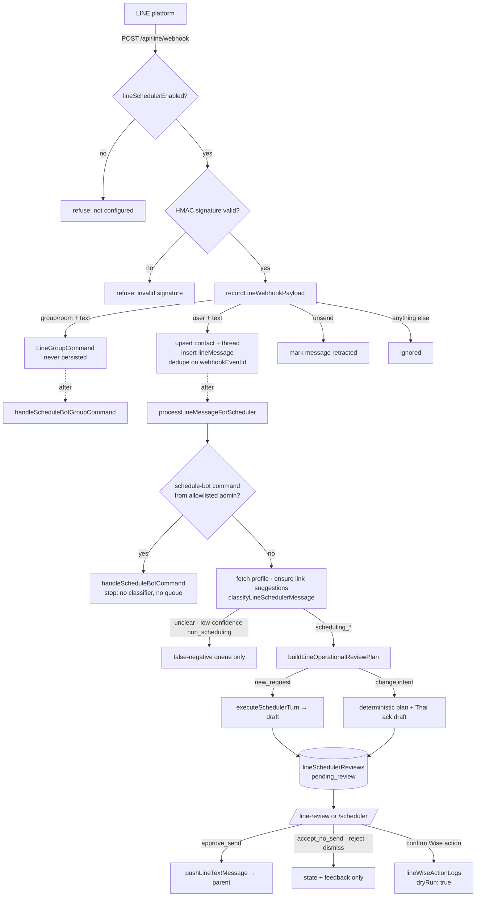

# LINE Integration

**Status: stable** — the ingest, review, and identity paths are fully built and covered by tests; the Wise write-path is dry-run only. Note that `ENABLE_LINE_SCHEDULER` gates webhook **ingest**, not sending — the outbound push never consults it (`src/app/api/line/webhook/route.ts:11`, and see [Feature flags](#feature-flags-and-what-they-actually-gate)). The LINE-platform side of the setup lives outside this repo: `LINE_CHANNEL_SECRET` and `LINE_CHANNEL_ACCESS_TOKEN` are optional env vars (`src/lib/env.ts:13-14`) and there is no webhook-registration config anywhere in the tree, so whether the OA is live has to be checked in the LINE console.

## Purpose

This feature is the bridge between a LINE Official Account (OA) and the rest of BGScheduler. That the OA carries BeGifted's parent relationships is operating context the code assumes rather than proves; what the code does show is four jobs:

1. **Ingest** — receive LINE webhook events, persist 1:1 parent conversations, and keep a contact profile cache.
2. **Triage** — classify each inbound parent message with an LLM, and when it is scheduling-related, build a draft reply plus a deterministic operational plan (which future Wise sessions the parent is talking about) and park it in a human review queue.
3. **Identify** — answer the hardest question in the subsystem: *which Wise student is this LINE user?* Several independent matchers feed one review workbench, and none of them may ever self-confirm.
4. **Deliver** — a "schedule bot" that lets an allowlisted admin ask, from inside LINE itself, for a student's monthly schedule link and post it either back to themselves or into a family chat.

The intended split is staff in the app, parents in LINE. The repo cannot confirm who the actual operators are, but the shape is consistent with it: every UI and API route in this feature is session-guarded and page-scoped so that only admins reach `/api/line/**` (see the [API reference auth model](../reference/api/line.md#authentication-model)), and the only parent-facing surface is the tokenised `/schedule/<token>` page. Staff work in `/line-review` (queue + mapping validation) and `/scheduler` (which triages the same review queue alongside the website AI scheduler). The OA resolver has a second, machine "user": the MV3 Chrome extension checked in at `extensions/line-oa-resolver/` (`manifest.json:2-3`), which authenticates with a per-run bearer token and no Google session — it pulls the worklist (`extensions/line-oa-resolver/popup.js:61-62`) and pushes captured rows (`content.js:481-485`) against the two token-authenticated endpoints.

Two safety postures run through the whole feature and explain most of its odd-looking code:

- **A parent-facing send always has a human decision behind it** — an explicit admin decision in the web UI, an explicit `YES` inside LINE, or an allowlisted admin's schedule-bot command in a group the bot has already delivered that student to. That case is one of two exceptions to "someone typed YES": once `line_group_schedule_sends` holds a row for this (group, student) — *and* the chat has a registered audience, *and* the command carries no `send` verb — a repeat command posts the link straight into the chat with no pending row and no confirmation (`src/lib/line/schedule-bot-group.ts:490-504`). The design rationale in the code is that the command itself is the authorisation, because the destination is a chat that has already received this student — see [GRP-BOT-04](#schedule-bot-gates). The second exception is **instant mode** (`skip_confirm` on `line_group_settings`): an allowlisted admin can switch a chat's confirm gate off entirely with `/schedule setup instant`, after which every command in that chat — `send` verb included — posts immediately (`:476-488`). The standing decision to trust the chat is itself the human decision, taken in-chat by an admin and reversible in-chat (`/schedule setup confirm`) — see [GRP-BOT-07](#schedule-bot-gates).
- **Nothing auto-verifies an identity.** Every matcher — display-name codes, AI-extracted names, follower-roster tokens, the browser-extension OA resolver — writes `status: "suggested"` and stops. Only a human sets `verified`.

## Conceptual data model

Grain, key columns, indexes, and relationships for every table named below live in [`reference/database/erd-line.md`](../reference/database/erd-line.md); this section describes what each table *means*.

**Conversation spine** — `lineContacts` (one row per LINE user, carrying the cached LINE profile and staff-applied labels), `lineThreads` (one thread per contact; `line_user_id` is unique, so the conversation model is structurally 1:1), and `lineMessages` (every inbound/outbound text, plus the inline classifier verdict and a separate human review-of-classification block). A thread may point at an `aiSchedulerConversation`, which is how a LINE chat and the website AI scheduler share one transcript.

**Group chats are deliberately absent from that spine.** A group message has no single contact and no 1:1 thread, so it is never persisted as a `lineMessage`; it is handed straight to the schedule-bot router (`src/lib/line/data.ts:38-48`, `:445-461`). What a group command *can* leave behind is narrower than the spine but wider than one table. Three paths persist: reaching the confirm or setup prompt writes a `lineScheduleBotPending` row (`src/lib/line/schedule-bot-group.ts:508-533`); `setup family|staff` and `setup instant|confirm` both write the `lineGroupSettings` row (audience upsert `:199-215`, instant-mode update `:222-237`); and a successful delivery writes `lineGroupScheduleSends` at the end of `deliver()` (`:688-701`). Everything short of those persists nothing — silently ignored (`:267-268`, `:275-278`), unparsed (`:325-328`), refused for a non-exact code (`:396-402`), snapshot-less (`:409-412`), empty-month (`:415-418`), cancelled (`:292-296`), or expired (`:516-520`) — leaving only the `console.log` trace described under [Business rules](#business-rules--edge-cases). The JSDoc's "audited to their own table" (`data.ts:45-46`) still overstates the coverage: the delivery table records deliveries, not attempts.

**Identity** — `lineContactStudentLinks` is the (contact, student) association table, unique on `(contactId, studentKey)`, with a three-value status (`suggested` / `verified` / `rejected`). It also carries the provenance of a suggestion (`sourceKind`, `sourceRunId`, `evidence` jsonb), the round-robin validation assignment block, and `isPhantom` — a quarantine flag. **Nothing in this repo ever sets `isPhantom` to true**: migration `drizzle/0040_nifty_mercury.sql:1` adds the column as `DEFAULT false NOT NULL`, and every occurrence in `src/` is a read filter (`link-validation.ts:248`, `:425`, `:737`; `student-links.ts:734`; `schedule-bot.ts:157`). Whether any rows are actually flagged is not observable from the repo; if any are, they were set out of band, so the stated cause (a legacy OA-resolver harvest that captured chat-surface LINE ids from a different namespace — asserted in the module header at `src/lib/line/schedule-bot-group.ts:10-12`) is a code comment, not something the code demonstrates.

**Review queue** — `lineSchedulerReviews`, one row per inbound message that entered the queue (`inboundMessageId` is unique, which is what makes review creation idempotent). It stores the classifier verdict, the inferred operational intent, the proposed and final reply text, the candidate Wise sessions, the proposed Wise actions, the send outcome, and the reviewer block. `lineWiseActionLogs` is the append-only audit of Wise-action confirmations hanging off a review.

**OA resolver** — `lineOaResolverRuns` / `lineOaResolverRows` back a token-scoped browser-extension job that walks a student worklist and captures the LINE OA chat URL for each one. Rows commit forward into `lineContacts` + `lineContactStudentLinks`.

**Backlog recovery** — `lineBacklogRecoverySyncRuns` records each run of the follower-roster re-match job with the standard single-`running`-row guard.

**Schedule bot** — `lineScheduleBotPending` holds the outstanding confirm, scoped per conversation (`scopeKey` is the literal `"dm"` in a 1:1 thread (`src/lib/line/schedule-bot.ts:186`) and `"group:<groupId>"` in a group, built by `scopeKeyFor` (`src/lib/line/schedule-bot-group.ts:128-130`, used at `:164`, `:379`, `:442`, `:511`) — so one admin can have a DM confirm and a group confirm alive at once); `lineGroupSettings` records a group's `family` / `staff` audience plus its `skip_confirm` instant-mode flag (GRP-BOT-07); `lineGroupScheduleSends` is both the delivery audit and the "has this group already received this student?" lookup that decides whether a confirm is required (`schedule-bot-group.ts:239-253`).

**Tables the feature reads but does not own** — the credit-control snapshot tables (`creditControlStudents` / `Packages` / `Sessions`) are the student directory and the source of candidate future sessions (`src/lib/line/student-links.ts:204-254`, `src/lib/line/operational.ts:351-411`); the Wise snapshot tables (`futureSessionBlocks`, `tutorIdentityGroups`) supply the teacher on a session; `adminUsers` supplies the reviewer roster; the AI-scheduler tables receive the conversation, messages, runs, and feedback that a LINE turn produces.

## API surface

Full request/response contracts, status codes, and auth per endpoint are in [`reference/api/line.md`](../reference/api/line.md). What the groups *do*:

- **Webhook** — `POST /api/line/webhook`. The only inbound door. HMAC-signature auth, no session; public in `src/middleware.ts:10`.
- **Scheduler reviews** — list/filter the queue, fetch chat context for one review, rebuild its operational plan, and take the decision (`approve_send` / `accept_no_send` / `reject` / `dismiss`). Also the false-negative queue of messages the classifier probably got wrong.
- **Wise actions** — list and "confirm" the proposed session operations for a review. Confirmation is dry-run only; see [Business rules](#business-rules--edge-cases).
- **Messages** — promote a single message into a review (manual escalation), and record classifier-accuracy feedback.
- **Students** — typeahead over the current credit-control student directory, used when linking a contact.
- **Contacts** — label edits, the contact↔student link lifecycle, the link-validation workbench (list / summary / assign / verify-reject), profile refresh, the screenshot/text alias import (preview + commit), and the followers re-anchor + backlog-recovery trigger.
- **OA resolver** — run creation and listing, the two token-authenticated endpoints the browser extension talks to (worklist pull, row push), and commit.
- **Internal cron** — `GET /api/internal/line-backlog-recovery`, `CRON_SECRET`-guarded. It is registered as **manual-only** in the cron registry and is deliberately absent from `vercel.json` (`src/lib/data-health/cron-registry.ts:358-372`).

Three of these are exempt from the session redirect and self-authenticate: the webhook (HMAC, `src/middleware.ts:10`), and the two OA-resolver extension endpoints (per-run bearer token, `:16` and the run-scoped rows regex at `:17`).

## UI

**`/line-review`** (`src/app/(app)/line-review/page.tsx`) is a thin auth shell around `LineReviewWorkspace` (`src/components/line-review/line-review-workspace.tsx`), a client component with two tabs (`line-review-workspace.tsx:38-41`):

- **AI Review Queue** — `ReviewQueue` (left rail, filtered by intent), `ChatEvidencePanel` (the merged LINE + website timeline), `ResolutionBoard` (student links, candidate sessions, proposed Wise actions), and `ReplyDock` (the draft textarea plus the three decision buttons). `CaseHeader` carries refresh, plan rebuild, and the `SignalsDialog` analytics readout.
- **Mapping Validation** — `MappingValidationWorkspace` + `LinkValidationPanel`: the round-robin task list with six scopes, including `phantom` ("Legacy / needs re-match") which is an archive filter over quarantined rows (`link-validation-panel.tsx:30-37`). Validation leads additionally see a per-reviewer progress tracker; the default scope differs for leads vs. ordinary admins (`mapping-validation-workspace.tsx:31-32`, `:69-72`).

Two dialogs are launched from the header: `OaResolverDialog` (create a run, copy the token, watch rows land, commit) and `AliasImportDialog` (paste chat-list text or drop a LINE Desktop screenshot, review the proposed alias→contact matches, commit).

**`/scheduler`** (`src/components/scheduler/scheduler-workspace.tsx`) is the AI Scheduler's own workspace, but it consumes the same LINE endpoints — pending reviews, false negatives, classification feedback, promote, student links, and the review PATCH (`scheduler-workspace.tsx:631`, `:649`, `:1157`, `:1175`, `:1553-1571`). Both pages can therefore action the same review.

**`/schedule/<token>`** is the parent-facing page the schedule bot links to. It is public by capability token (`src/middleware.ts:15`) and belongs to the student-schedule feature, not this one.

## Data flow

An inbound webhook POST is verified, persisted, and answered within the request; all classification and drafting happens afterwards via `after()` so LINE never waits on OpenAI (`src/app/api/line/webhook/route.ts:22-39`). Status codes and the exact 200 body are in [`reference/api/line.md`](../reference/api/line.md#post-apilinewebhook).

```mermaid
flowchart TD
    L[LINE platform] -->|POST /api/line/webhook| G{lineSchedulerEnabled?}
    G -->|no| G503[refuse: not configured]
    G -->|yes| S{HMAC signature valid?}
    S -->|no| S401[refuse: invalid signature]
    S -->|yes| I[recordLineWebhookPayload]

    I -->|group/room + text| GC[LineGroupCommand<br/>never persisted]
    I -->|user + text| M[upsert contact + thread<br/>insert lineMessage<br/>dedupe on webhookEventId]
    I -->|unsend| R[mark message retracted]
    I -->|anything else| X[ignored]

    GC -.->|after| GB[handleScheduleBotGroupCommand]
    M -.->|after| P[processLineMessageForScheduler]

    P --> B{schedule-bot command<br/>from allowlisted admin?}
    B -->|yes| DM[handleScheduleBotCommand<br/>stop: no classifier, no queue]
    B -->|no| C[fetch profile · ensure link suggestions<br/>classifyLineSchedulerMessage]
    C -->|unclear · low-confidence non_scheduling| FN[false-negative queue only]
    C -->|scheduling_*| O[buildLineOperationalReviewPlan]
    O -->|new_request| AI[executeSchedulerTurn → draft]
    O -->|change intent| DET[deterministic plan + Thai ack draft]
    AI --> Q[(lineSchedulerReviews<br/>pending_review)]
    DET --> Q

    Q --> H[/line-review or /scheduler/]
    H -->|approve_send| PUSH[pushLineTextMessage → parent]
    H -->|accept_no_send · reject · dismiss| NOSEND[state + feedback only]
    H -->|confirm Wise action| DRY[lineWiseActionLogs<br/>dryRun: true]
```

**Ingest.** `recordLineWebhookPayload` walks `events[]` once. Group/room text messages become `LineGroupCommand`s and are returned, not stored (`src/lib/line/data.ts:445-461`). User text messages upsert the contact and thread, then insert the message with `onConflictDoNothing` on `webhookEventId`, so a LINE redelivery is counted rather than creating a second row (`:498-520`). `unsend` events flip `isRetracted` on the matching message (`:468-482`). Everything else is counted as ignored, at three separate exits: a non-`user` source or missing `userId` (`:463-466`), a non-`message` event such as a join or follow (`:484-487`), and a message that carries no text (`:489-495`). The per-category counters this produces are the webhook's 200 body; see the [API reference](../reference/api/line.md#post-apilinewebhook).

**Triage.** `processLineMessageForScheduler` runs the schedule-bot router first, so an admin command never costs an OpenAI call and never lands in the parent queue (`src/lib/line/review-service.ts:136-148`). Then it refreshes the LINE profile, regenerates student-link suggestions (feeding in any names the AI has already extracted for this thread), classifies the message, and stores the verdict. Non-scheduling categories stop there — the message is still reachable through the false-negative queue.

**Planning.** For a scheduling message, `buildLineOperationalReviewPlan` infers an intent deterministically from regexes over Thai and English text (`src/lib/line/operational.ts:262-307`). A `new_request` gets the full LLM path: a scheduler conversation is created or reused, `executeSchedulerTurn` produces suggestions and a parent draft, and the review stores the top suggestion plus its tutor ids. A *change* intent (cancel / pause / resume / reschedule) never asks the LLM for availability — it loads that student's future sessions from the credit-control snapshot, scores them against the parsed date/time, and emits candidate sessions plus proposed Wise actions with a canned Thai acknowledgement as the draft (`operational.ts:584-689`). Either way the result is one `pending_review` row.

**Decision.** The admin edits the draft and picks an action. `approve_send` is the only path that reaches `pushLineTextMessage` (`review-service.ts:487-491`). Three writes follow the send, but **only two are best-effort**: the outbound `lineMessage` mirror (`:507-516`) and the AI-scheduler feedback row (`:517-528`) each go through `recordPostSendAudit`, which swallows the error into a `console.error` (`:87-93`). The review status patch in between is a bare `await patchLineSchedulerReview(...)` (`:493-505`) — if it throws after the parent has already received the message, `approveLineSchedulerReview` rejects, the UI reports a send failure, and the review is left `pending_review` (see [open question 8](#open-questions)).

**Schedule-bot delivery** is a separate loop that never touches the review queue. The link is minted *after* confirmation, not before: command → resolve student → check the month is non-empty → write a pending row holding only student/month/recipient → confirm → mint → post (`src/lib/line/schedule-bot.ts:410-455` then `:479-508`; group equivalent at `schedule-bot-group.ts:455-464` then `:573-610`). In a DM the default path skips the confirm entirely — it mints and replies to the requesting admin — and only the explicit `send` verb resolves a parent (`schedule-bot.ts:284-288`). In a group the link goes into the group the command came from, so no identity resolution is involved at all.

## Business rules & edge cases

### Feature flags and what they actually gate

- `lineSchedulerEnabled()` is **opt-out**: it is true whenever `ENABLE_LINE_SCHEDULER !== "false"` *and* both `LINE_CHANNEL_SECRET` and `LINE_CHANNEL_ACCESS_TOKEN` are set (`src/lib/line/client.ts:19-23`). Setting the variable to any other value — or leaving it unset — leaves the feature on.
- That flag is checked in exactly one place: the webhook route (`src/app/api/line/webhook/route.ts:11-13`). The `approve_send` path does **not** re-check it; what actually stops an outbound push there is a missing `LINE_CHANNEL_ACCESS_TOKEN` (`client.ts:29-33`) plus the verified-link gate below.
- `WISE_SESSION_OPERATIONS_VERIFIED` is read once at module load into a `const` (`src/lib/line/operational.ts:21`), so changing it requires a redeploy, not just an env edit.
- `LINE_SCHEDULE_BOT_ADMIN_IDS` is the schedule bot's allowlist; an empty or unset value yields an empty set, which disables the bot entirely (`src/lib/line/schedule-bot.ts:112-124`).
- `LINE_VALIDATION_LEAD_EMAILS` selects who can see the validation tracker; it falls back to a hard-coded two-address default (`src/lib/line/link-validation.ts:122-125`, `:220-234`). A non-lead gets an **empty** summary, not a 403 (`:494-496`).

### Fail-closed identity

- **No matcher may verify.** Display-name/dotted-code matches insert at `confidence: 0.95, status: "suggested"` (`src/lib/line/student-links.ts:478-504`). AI-extracted-name matches carry the explicit invariant `status: "suggested" — NEVER verified from content (IDENT-02)` (`student-links.ts:519`). The name matcher itself does no DB writes and returns scored suggestions only (`src/lib/line/name-matcher.ts:130-133`). Backlog recovery repeats the same rule (`src/lib/line/backlog-recovery.ts:138`). Even the OA-resolver commit downgrades to `suggested` unless the row was *already* human-verified (`src/lib/line/oa-resolver.ts:909`).
- **Phantom quarantine.** Rows flagged `isPhantom` are excluded from every active scope, from all summary aggregates, and from status patches (`src/lib/line/link-validation.ts:246-249`, `:737`); the dedicated `phantom` scope is the only place they surface (`:422-430`). `listVerifiedLineStudentKeys` excludes them too, so a phantom row can never satisfy the send gate (`src/lib/line/student-links.ts:734`), and neither can it resolve a schedule-bot recipient (`src/lib/line/schedule-bot.ts:157`). The flag is read-only in this codebase — see the note under [Conceptual data model](#conceptual-data-model).
- **Sending requires a verified link.** `approveLineSchedulerReview` throws unless the contact has at least one verified, non-phantom student link — or the admin explicitly ticks `studentLinkOverride` (`src/lib/line/review-service.ts:477-481`).
- **Ambiguity refuses rather than guesses.** With multiple verified children on one contact and no unambiguous mention in the message, the operational planner selects *no* student and emits an issue instead (`src/lib/line/operational.ts:319-334`). Likewise, more than one matching future session raises "Admin must select the correct class" rather than picking the top score (`operational.ts:669-671`).
- **Sibling dominance.** A candidate that matched only on parent name is dropped when it shares the parent of a student that matched confidently on their own name — that candidate is the named child's sibling, not the named child. Conflicting parent-only matches are kept for review (`src/lib/line/name-matcher.ts:220-232`).

### Review lifecycle

- Every transition is guarded by `if (review.status !== "pending_review") return review;` — an already-decided review is returned unchanged rather than re-sent (`review-service.ts:475`, `:543`, `:582`, `:625`).
- Rejection is the training signal, so it is the strictest action: category, reason, and a staff correction are all required (`review-service.ts:584-589`).
- The outbound push uses a UUIDv5 retry key derived from the review id, so a duplicated approve cannot double-send; LINE's 409 "already accepted" response is treated as success and annotated rather than thrown (`review-service.ts:83-85`, `src/lib/line/client.ts:132-141`).
- Review creation is idempotent on `inboundMessageId` (`src/lib/line/data.ts:753-779`, `onConflictDoNothing`), which is what makes `promoteLineMessageToReview` safe to call twice — it returns `alreadyExisted: true`.
- When the AI scheduler is not configured, or its turn throws, a review is still created with an **empty draft** so the message reaches a human instead of vanishing (`review-service.ts:268-280`, `:376-417`).

### Classification

- Category enum and confidence are LLM output validated by a `.strict()` Zod schema (`src/lib/line/classifier.ts:26-31`).
- The false-negative queue surfaces every `unclear` message, plus `non_scheduling` below a 0.75 confidence threshold — and **fails open**: a NULL confidence counts as "show" (`src/lib/line/classifier.ts:24`, `src/lib/line/data.ts:604-614`). Messages drop out of the queue once an admin records classification feedback or the message is promoted (`data.ts:597-603`).
- `promoteLineMessageToReview` records the classification correction *before* creating the review, so accuracy metrics count the false negative even though the draft is empty (`review-service.ts:438-449`).

### Wise writeback is dry-run, always

`confirmLineWiseAction` has two branches — one for an unverified Wise endpoint contract, one for a verified one — and **neither calls Wise** (`src/lib/wise/operations.ts:49-94`). Every proposed action is constructed with `dryRun: true` hard-coded upstream, in the planner (`src/lib/line/operational.ts:468-486`), so there is no input that can produce a live mutation. The only real mutation this subsystem performs against the outside world is sending a LINE message. The per-branch log status, `writebackStatus` values, and response payload are endpoint mechanics — see [`reference/api/line.md` → Wise actions](../reference/api/line.md#wise-actions).

### Identity re-link cascade (IDENT-06)

Verifying a link does not just flip a status: it immediately recomputes every `pending_review` scheduler row for that contact so `matchedStudentKeys`, candidate sessions, and `writebackStatus` reflect the new identity. Per-row failures are swallowed so they cannot abort the status patch (`src/lib/line/link-validation.ts:749-796`). The UI mirrors this by rebuilding the plan client-side after a verify on a non-`new_request` review (`line-review-workspace.tsx:253-255`).

### OA resolver

- A run mints `runId.secret`; only the SHA-256 hash is stored, and the token expires after 8 hours (`src/lib/line/oa-resolver.ts:111`, `:124`, `:592-606`).
- Chat URLs are validated structurally: HTTPS, host exactly `chat.line.biz`, and both path ids matching `/^U[a-fA-F0-9]{32}$/` (`oa-resolver.ts:112`, `:344-360`).
- A `matched`/`ambiguous` row with no valid candidate URL is downgraded to `error`, not accepted (`oa-resolver.ts:762-777`). A `no_match` posted while the extension was still sitting on a chat URL is also rejected, as a context guard (`:779-803`).
- **Sibling fan-out**: when a capture succeeds for one child, the same candidate contacts are copied onto every other row sharing a normalized parent name, marked `matchMode: "sibling_fanout"` — already-committed rows are skipped (`oa-resolver.ts:670-720`).
- The run only flips to `committed` when no `matched` or `ambiguous` rows remain (`oa-resolver.ts:1086-1093`).

### Schedule bot gates

The DM path documents four gates in its header block (`src/lib/line/schedule-bot.ts:1-27`), but they do not all cover the same ground: **SCHED-BOT-02 and SCHED-BOT-03 apply only to the `send` verb** — the path that messages a parent — while SCHED-BOT-01 and SCHED-BOT-04 apply to both DM paths. The header's own claim that "All four must pass before `pushLineTextMessage` is reached" (`:7`) is therefore imprecise: the *default* DM path (`replyWithLink`, `:296-353`) also reaches `deps.push` — via `reply()` (`:172-183`) — after the allowlist check (`:226`) and its own empty-month refusal (`:327-330`) only. It skips 02 and 03 deliberately: the destination is the admin who typed the command, so there is no third party to protect (`:291-295`, branch at `:284-286`).

| Gate | Rule | Applies to |
|---|---|---|
| SCHED-BOT-01 | Sender must be in `LINE_SCHEDULE_BOT_ADMIN_IDS`; everyone else gets `handled: false` and **no reply**, so a parent sees no evidence the bot exists (`schedule-bot.ts:226`). | both DM paths |
| SCHED-BOT-02 | The recipient is resolved only from `verified` + non-phantom links. No name-matching fallback (`schedule-bot.ts:139-170`, `:380-389`). | `send` only |
| SCHED-BOT-03 | The first message never sends: a 5-minute pending row is written and an explicit `YES` is required (`schedule-bot.ts:410-455`, `:457-477`). | `send` only |
| SCHED-BOT-04 | A month with zero classes refuses rather than pushing a blank calendar (`schedule-bot.ts:401-404`, and `:327-330` on the default path). | both DM paths |

The group path re-weights these for a group destination (`src/lib/line/schedule-bot-group.ts:1-41`): the bot must be addressed by typed `/schedule` prefix or a native `isSelf` mention (`GRP-BOT-01`); non-admins get silence (`GRP-BOT-02`); matching is narrowed to a single **exact** bracketed nickname code, because the ranked directory search is far too loose when the result is posted into a family chat (`GRP-BOT-03`, `schedule-bot-command.ts:94-102`); the first time any student appears in a given group a confirm is required, which is the only defence against the right code typed in the wrong family's group (`GRP-BOT-04`, `schedule-bot-group.ts:490-504`); and empty months still refuse (`GRP-BOT-05`). One gate is waivable per chat: **GRP-BOT-07** lets an allowlisted admin switch a group to instant mode (`/schedule setup instant` → `skip_confirm` on `lineGroupSettings`), which skips the GRP-BOT-04 confirm entirely — including the `send` verb's force-confirm — for that chat (`schedule-bot-group.ts:476-488`). The toggle is admin-gated like every other command, refuses in a chat that has never declared an audience (`:222-237`, `:348-361`), and `/schedule setup confirm` restores the default. GRP-BOT-01/02/03/05 are unaffected by instant mode. The verified-link gate is deliberately *not* applied in groups — the destination is the chat everyone is already in.

Other non-obvious details:

- A bare `YES` / `FAMILY` / `STAFF` is accepted without the `/schedule` prefix, but **only** when an allowlisted admin has a pending row in that conversation — because the bot's own prompts ask for exactly those words (`schedule-bot-command.ts:38-52`, `schedule-bot.ts:238-245`, `schedule-bot-group.ts:257-270`). The two entry checks test existence, not freshness: `hasPendingDm` selects `id` (`schedule-bot.ts:189-199`) and `hasPendingQuestion` selects `expiresAt` but still returns `Boolean(row)` (`schedule-bot-group.ts:154-168`), so an expired-but-uncleared row still unlocks the bare answer. Expiry is enforced one step later, inside the confirm handler, which refuses and clears (`schedule-bot.ts:473-477`, `schedule-bot-group.ts:516-520`) — the gate holds, but at the second check rather than the first.
- `mentionsSelf` is strict: a mentionee counts only when `isSelf === true` **and** its `type` is `"user"` or absent (`src/lib/line/mentions.ts:54-57`), so a `type: "all"` (@everyone) announcement never triggers a command, and a malformed `mention` object reads as "no mention" (`:39-45`).
- Group audience (`family` / `staff`) selects the message **wording** — the template ternary at `schedule-bot-group.ts:661-675`, described as "only selects the wording" in the `deliver()` JSDoc. It relaxes no gate, but it is not inert: a registered audience is a precondition of both straight-through paths, so an unregistered chat can never skip the confirm — GRP-BOT-04's repeat-send fast path requires it (`:494`), and instant mode cannot even be switched on without it (`:222-237`); its absence forces the setup prompt in place of the confirm prompt (`:538-546`); and a bare `FAMILY`/`STAFF` reply both registers the chat and authorises the pending student in one step. The setting that *does* relax a gate is `skip_confirm` (GRP-BOT-07) — audience never does; changing the audience preserves the flag (`:209-214`).
- Group replies prefer the webhook `replyToken` (free, no quota, no stored destination) and fall back to a push at the group id once the one-minute token window closes (`schedule-bot-group.ts:132-151`, `src/lib/line/client.ts:151-161`).
- The group router records `command` text **only** for allowlisted admins, so a parent's message never reaches the logs (`schedule-bot-group.ts:271-278`, `:342-368`). Coverage is partial, though — `trace()` fires on the two silent exits (`:267`, `:276`) and on three admin outcomes (setup `:305`, unparsed `:325`, send/reply `:338`), but the help, `NO`-cancel, audience-reply and bare-`YES` confirm branches all return without calling it (`:282-319`). A confirmed send therefore leaves only the trace line from the original command — and that line reads `outcome=reply` for the ordinary `/schedule <code>` form, `outcome=send` only when the `send` verb was typed, since the outcome is `pushToParent ? "send" : "reply"` (`:332`, `:338`). The `YES` or `FAMILY` answer itself leaves no trace line at all.

### Test-data cleanup

`deleteLineTestData` is destructive and refuses to run without the literal confirmation string `delete-line-test-data`; it supports a dry run that returns the plan and counts without deleting (`src/lib/line/test-data-cleanup.ts:5`, `:211-227`).

## Tests

LINE tests live in `src/lib/line/__tests__/` (21 files), `src/components/line-review/__tests__/` (2), and per-route `__tests__/` directories under `src/app/api/line/` (15). Run with `npm test`.

- **Ingest & transport** — `signature.test.ts` (HMAC verification, length mismatch, missing secret), `webhook.test.ts` (401/400 paths, scheduling of background processing), `data-group-ingest.test.ts` (group/room commands extracted and not persisted), `client.test.ts` (push retry-key + 409-as-success result shape, `fetchLineFollowerIds` pagination/filtering/error, reply success + throw-on-reject).
- **Classification & review** — `confidence.test.ts` (band boundaries), `review-service.test.ts` (approve/accept/reject/dismiss transitions, verified-link gate, promote idempotency).
- **Identity** — `student-links.test.ts` (code parsing, directory matching, search ranking), `name-matcher.test.ts` + `name-matcher.eval.test.ts` (scoring tiers, sibling dominance, an eval corpus), `backlog-matcher.test.ts` (distinctive tokens, ambiguous shortlists), `backlog-recovery.test.ts` (dry-run purity, always-suggested inserts), `contact-aliases.test.ts` (chat-list parsing + candidate ranking), `link-validation.test.ts` (scopes, round-robin planning, totals), `oa-resolver.test.ts` + `oa-resolver-extension-candidates.test.ts` (worklist codes, URL parsing, candidate normalization, sibling fan-out, commit).
- **Operational planning** — `operational.test.ts` (intent inference, pause-boundary selection, student-link selection).
- **Schedule bot** — `schedule-bot.test.ts` (one describe block per DM gate, `:145`–`:336`, plus a separate "default path — reply to the requesting admin" block at `:480-522` covering the branch that skips gates 02/03), `schedule-bot-group.test.ts` (mention gate, exact-code narrowing, setup/confirm flow), `schedule-bot-copy.test.ts` (message templates), `mentions.test.ts` (mentionee parsing and stripping).
- **Cleanup** — `test-data-cleanup.test.ts` (target derivation, confirmation guard).
- **Routes** — handler tests cover link-validation (list/summary/assign/patch), the OA-resolver endpoints including token auth, promote, classification feedback, false negatives, review context, alias-import commit, refresh-profiles, and followers-reanchor.

## Open questions

1. **Is the `ENABLE_LINE_SCHEDULER` opt-out default intentional?** The flag disables the feature only when set to the exact string `"false"`; every other value (including unset) leaves it on. `AGENTS.md` still describes the write path as "flag-gated", but `lineSchedulerEnabled()` has exactly one call site — the webhook route — so it gates ingest only; the `approve_send` push never consults it.
2. **`WISE_SESSION_OPERATIONS_VERIFIED` is a module-load constant** in `operational.ts:21` while `wiseSessionOperationsVerified()` in `src/lib/wise/operations.ts:10-12` reads it per call. Is the divergence deliberate, or should the planner also read it dynamically?
3. **Is the OA-resolver harvest permanently retired?** The panel labels the quarantine scope "Legacy / needs re-match", yet the resolver run/commit machinery is fully live and reachable from the header button. Should the resolver still be offered, or is backlog recovery its replacement?
4. **`/api/line/contacts/followers-reanchor` double-fetches the follower roster** (re-anchor sequentially, then backlog recovery in batch) — the code calls this a known follow-up and directs fixes elsewhere (`route.ts:7-12`). Is that route still the intended admin entry point now that the dedicated cron exists?
5. **`line_backlog_recovery` is registered but unscheduled** — manual-only in the cron registry and absent from `vercel.json`. Is it meant to stay manual, or was a cadence intended?
6. **Two workspaces action the same queue.** `/line-review` and `/scheduler` both list pending reviews and can approve/reject them, with no visible locking. Is the overlap intentional, and which is the canonical surface for staff?
7. **`src/lib/line/data.ts` and `src/lib/line/name-matcher.ts` each define their own `levenshtein`** (the latter documents itself as a verbatim copy, citing stale line numbers). Should they be consolidated?
8. **A failed review patch reads as a failed send.** In `approveLineSchedulerReview` the two audits after the push are wrapped in `recordPostSendAudit`, but the `patchLineSchedulerReview` between them is not (`review-service.ts:493-505`). If that write throws, the parent has already received the message yet the promise rejects, the UI shows a send failure, and the row stays `pending_review` — where a second approve would push again (the UUIDv5 retry key makes LINE treat the repeat as already-accepted, so the parent is not double-messaged, but the review is still stuck). Should the patch be retried, or the whole tail moved behind one guard?
9. **Who sets `isPhantom`?** No code path in this repo writes `is_phantom = true` — the column ships `DEFAULT false` (`drizzle/0040_nifty_mercury.sql:1`) and every `src/` reference is a read filter. Whether the quarantine holds any rows in production is not visible from the repo; if it does, they were set out of band. Should the population be captured as a migration or a documented runbook step so it is reproducible — and if the flag is in fact unused, should the `phantom` scope stay in the UI?

_Verified against HEAD + uncommitted WIP on 2026-05-31._
