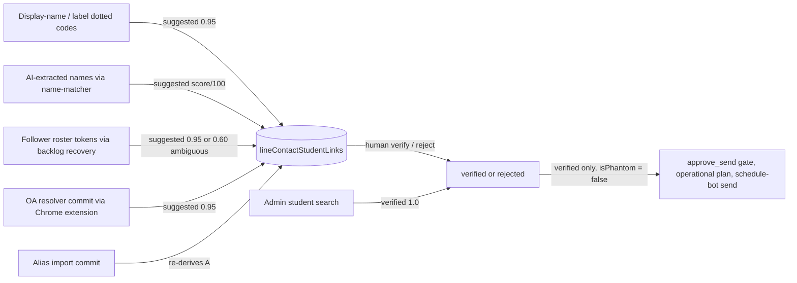

# LINE Integration

**Status: stable (scheduler write-path flag-gated)** — the webhook ingest, classifier, review queue, identity-linking tooling, and schedule bot are all built and unit-tested. Two flags shape the write paths, and they gate *different* things: `ENABLE_LINE_SCHEDULER` (together with the two LINE credentials) gates whether the webhook accepts events at all (`src/lib/line/client.ts:19-23`, `src/app/api/line/webhook/route.ts:9-11`), while `WISE_SESSION_OPERATIONS_VERIFIED` never causes a Wise mutation; it only changes the plan's readiness label (`writebackStatus` `ready` vs `manual_required`, with every proposed action still `dryRun: true` — `src/lib/line/operational.ts:21`, `:481-483`, `:488-491`) and the logged status of a confirmed action (`src/lib/wise/operations.ts:49-94`). No code path in this feature ever mutates Wise, regardless of flag. The one real outbound write, the LINE push behind "approve and send", consults neither flag; it needs only `LINE_CHANNEL_ACCESS_TOKEN` (`src/lib/line/client.ts:29-33`, `src/lib/line/review-service.ts:487-491`).

## Purpose

This feature connects BeGifted's LINE Official Account (OA) to the rest of BGScheduler. Parents talk to the OA; staff work in the web app. The code does four jobs:

1. **Ingest** — accept LINE webhook events, persist 1:1 parent conversations as contacts, threads, and messages, and keep a cached LINE profile per contact.
2. **Triage** — classify every inbound parent message with the OpenAI Responses API, and for scheduling-related messages produce either an AI-drafted reply (new requests) or a deterministic operational plan (cancel / pause / resume / reschedule an existing class) that names the Wise sessions involved. Each one lands in a human review queue; nothing is sent to a parent without an admin decision.
3. **Identify** — answer *which Wise student does this LINE user belong to?* Five independent matchers (display-name codes, AI-extracted names, the follower roster, a browser-extension "OA resolver", and pasted chat-list aliases) all produce **suggestions**; only a human verifies one.
4. **Deliver** — an in-LINE "schedule bot" that lets an allowlisted admin request a student's monthly schedule link with `/schedule <code>`, either back to themselves or into a family group chat, plus `/credit` and `/report` command families that share its spine.

The users are BeGifted admin staff. Every `/api/line/**` route except three machine-facing ones requires an Auth.js session (see [`reference/api/line.md` § Conventions shared across the endpoints](../reference/api/line.md#conventions-shared-across-the-endpoints)); parents only ever see the OA chat and the tokenised `/schedule/{token}` page produced by the [Student Schedule](./student-schedule.md) feature. The OA resolver also has a machine user: the MV3 Chrome extension at `extensions/line-oa-resolver/` (`manifest.json:1-12`), which authenticates with a per-run bearer token and no Google session (`popup.js:61`).

The `/credit` and `/report` command families (`src/lib/line/credit-bot.ts`, `credit-digest.ts`, `report-bot.ts`) ride the schedule bot's router but belong to Credit Control and the Parent Report; this document covers how they are dispatched and gated and summarises their rules in [§ Credit and report command families](#credit-and-report-command-families); Credit Control's business meaning lives in [`credit-control.md`](./credit-control.md). Their own pages carry the rest: [`line-credit-bot.md`](./line-credit-bot.md) for the `/credit` family, the daily run-out digest and the group allowlist, and [`student-report.md`](./student-report.md) for the `/report` family and the Parent Report surface behind it.

## Conceptual data model

Columns, indexes, and relationships live in [`reference/database/erd-line.md`](../reference/database/erd-line.md); this section says what each table *means*. The feature owns 13 `line_*` tables — `lineContacts`, `lineThreads`, `lineMessages`, `lineContactStudentLinks`, `lineSchedulerReviews`, `lineWiseActionLogs`, `lineOaResolverRuns`, `lineOaResolverRows`, `lineBacklogRecoverySyncRuns`, `lineScheduleBotPending`, `lineGroupSettings`, `lineCreditDigestRuns`, `lineGroupScheduleSends` — declared in two blocks of `src/lib/db/schema.ts` (`:2437-2684` and `:4668-4772`), plus four LINE-specific enums (`schema.ts:110-134`). Per-table line anchors belong to the ERD page, which is currently one table behind (see open question 5).

**Conversation spine.** `lineContacts` is one row per LINE user the OA has seen, carrying the cached profile and two staff-applied labels (`linkedParentLabel`, `linkedStudentLabel`). `lineThreads` is one thread per contact — `lineUserId` is unique on both tables and both are upserted on it (`src/lib/line/data.ts:313-346`, `:384-406`), so the conversation model is structurally 1:1. `lineMessages` holds every inbound and outbound text, the inline classifier verdict (`classifier*`), and a separate human review-of-classification block (`classificationReviewed*`) so accuracy can be measured without overwriting the model's output. A thread may point at an AI-scheduler conversation (`aiSchedulerConversationId`), which is how a LINE chat and the website AI scheduler share one transcript.

**Group chats are absent from that spine by design.** A group or room message has no single contact and no 1:1 thread, so `recordLineWebhookPayload` never persists it; it is collected as a transient `LineGroupCommand` and handed straight to the schedule-bot router (`src/lib/line/data.ts:38-54`, `:441-461`). What a group command can leave behind is narrower: a `lineScheduleBotPending` confirm row, a `lineGroupSettings` row, or a `lineGroupScheduleSends` delivery record.

**Identity.** `lineContactStudentLinks` is the (contact, student) association, unique per pair, with a three-value status — `suggested`, `verified`, `rejected`. It carries the provenance of every suggestion (`sourceKind`, `sourceRunId`, free-form `evidence`), the round-robin validation-assignment block, and an `isPhantom` quarantine flag that every active read filters out (`src/lib/line/link-validation.ts:246-249`; `src/lib/line/student-links.ts:755-768`; `src/lib/line/schedule-bot.ts:158-162`). No code in `src/`, `scripts/`, or `drizzle/` ever sets `isPhantom = true` — the column arrived as `DEFAULT false` in `drizzle/0040_nifty_mercury.sql:1` and is only read.

**Review queue.** `lineSchedulerReviews` is exactly one row per inbound message that entered the queue (unique on `inboundMessageId`, which is what makes review creation idempotent — `src/lib/line/data.ts:777`). It stores the classifier snapshot, the inferred operational intent and payload, the proposed and final reply, matched/verified student keys, candidate Wise sessions, proposed Wise actions, the `writebackStatus`, the send outcome, and the reviewer. `lineWiseActionLogs` is the append-only audit of Wise-action confirmations hanging off a review; both its `status` and `dryRun` default to the non-mutating value (`src/lib/line/data.ts:1015-1016`).

**OA resolver.** `lineOaResolverRuns` / `lineOaResolverRows` back a time-boxed, token-authenticated worklist: one row per current student, walked by the Chrome extension, which captures the `chat.line.biz` URL of the matching parent chat. Committed rows create stub contacts and `suggested` links. Only the SHA-256 hash of the run token is stored (`src/lib/line/oa-resolver.ts:124-126`, `:562-565`).

**Backlog recovery.** `lineBacklogRecoverySyncRuns` is declared with the standard single-`running` partial unique index, but no code outside `schema.ts` references it; the recovery job reports its counts to the caller and relies on the cron-invocation audit instead (`src/lib/line/backlog-recovery.ts:106-115`, `src/app/api/internal/line-backlog-recovery/route.ts:15-20`).

**Schedule bot.** `lineScheduleBotPending` holds the outstanding confirm prompt, scoped per conversation (`scopeKey` is `"dm"` in a 1:1 chat and `group:<groupId>` in a group — `src/lib/line/schedule-bot.ts:190`, `src/lib/line/schedule-bot-group.ts:141-143`). `lineGroupSettings` records a group's `family`/`staff` audience, its instant-mode `skipConfirm` flag, and the `/credit setup` digest opt-in (`schema.ts:4700-4722`). `lineGroupScheduleSends` is both the delivery audit and the "has this group already received this student?" lookup (`schedule-bot-group.ts:243-257`). `lineCreditDigestRuns` is the once-per-Bangkok-day ledger for the credit-runout digest (`schema.ts:4733-4758`).

**Tables read but not owned.** The active credit-control snapshot (`creditControlStudents` / `Packages` / `Sessions`) is the student directory and the source of candidate future sessions (`src/lib/line/student-links.ts:214-264`, `src/lib/line/operational.ts:351-411`) — with no active credit-control snapshot the directory is empty. The Wise tutor snapshot (`futureSessionBlocks`, `tutorIdentityGroups`) supplies the teacher on a session; `adminUsers` supplies the reviewer roster; the AI-scheduler tables receive the conversation, messages, runs, and feedback that a LINE turn produces; `studentScheduleLinks` receives the capability tokens the bot mints.

## API surface

Full method/path/auth/request/response contracts are in [`reference/api/line.md`](../reference/api/line.md). Grouped by purpose:

- **Webhook** — `POST /api/line/webhook`: LINE-signature-authenticated ingest; queues classification and group-command handling with `after()` so the 200 returns before any OpenAI call (`src/app/api/line/webhook/route.ts:20-43`).
- **Scheduler reviews** — list (with optional analytics), the merged LINE + website chat context, the four-way decision `PATCH` (approve+send / accept without send / reject / dismiss), rebuild the operational plan, and list/confirm Wise actions for a review.
- **Messages** — the false-negative queue, promote a missed message into a review, and record a human classification correction.
- **Students** — typeahead over the current credit-control student directory.
- **Contacts: labels and links** — rewrite a contact's labels, list/create/verify/reject its student links.
- **Contacts: link validation** — the paged validation worklist, the lead-only progress tracker, round-robin assignment, and per-task verify/reject.
- **Contacts: alias import** — preview (text or screenshot) and commit pasted LINE Desktop chat-list aliases; refresh every contact's LINE profile.
- **Contacts: bulk identity** — `followers-reanchor` (follower-roster re-anchor + backlog recovery, `dryRun` supported).
- **Contacts: OA resolver** — session-guarded run create/list/read/commit, plus two token-authenticated extension endpoints (`worklist`, `runs/[runId]/rows`) that are also exempt from the session middleware (`src/middleware.ts:22-23`).
- **Internal crons** — `GET /api/internal/line-credit-digest` (daily `3 2 * * *`, `vercel.json:68-71`) and the manual-only `GET /api/internal/line-backlog-recovery` (`src/lib/data-health/cron-registry.ts:385-398`); see [`reference/api/internal-crons.md`](../reference/api/internal-crons.md) and [`reference/crons.md`](../reference/crons.md).

## UI

**`/line-review`** (`src/app/(app)/line-review/page.tsx`) redirects to `/login` without a session and renders `<LineReviewWorkspace>` inside `<Suspense>` (`:6-21`). It appears in the nav as **LINE AI Review** under Scheduling & Tutors with a live badge equal to the count of `pending_review` rows (`src/lib/navigation/tools.ts:111-117`, `src/lib/home/summary.ts:101-106`).

`LineReviewWorkspace` (`src/components/line-review/line-review-workspace.tsx`) has two tabs (`:38-41`):

- **AI Review Queue** — `ReviewQueue` (left rail, filterable by the six intent types — `review-queue.tsx:17-28`), `CaseHeader` (analytics, refresh, rebuild plan, the "Bulk OA resolver" and "Screenshot aliases" launchers), `ChatEvidencePanel` (renders the context endpoint's `combinedTimeline` and counts its `websiteMessages` — `chat-evidence-panel.tsx:17-19`, `:36`), `ResolutionBoard` (a four-step checklist — student, session, Wise action, parent reply — whose states are derived in `getResolutionStepStates`, `resolution-board.tsx:14-59`), and `ReplyDock` (edit the draft, then Reject / Accept-handled / Approve-and-send). `StudentLinkCommand` is the popover for parsing a label, searching students, and verifying or rejecting links; `SignalsDialog` shows analytics, links, Wise-action logs, and the false-negative list.
- **Mapping Validation** — `MappingValidationWorkspace` wraps `LinkValidationPanel`: resolver-run picker, the lead-only progress tracker, round-robin assignment, per-task verify, or reject with an optional note (the note is a `window.prompt` collected only on reject; verify sends `note: null` — `link-validation-panel.tsx:284-288`), and a "re-anchor" button that calls `followers-reanchor` (`mapping-validation-workspace.tsx:80-123`). It defaults to the `all` scope for validation leads and `my` for everyone else (`:31-32`, `:70-73`).

Dialogs: `OaResolverDialog` (create a run, show the one-time token, poll the run every 4 seconds while it is `active` — `oa-resolver-dialog.tsx:251-257` — and commit selected candidates) and `AliasImportDialog` (paste text or upload a PNG/JPEG/WebP screenshot, review the ranked contact candidates, commit; also hosts the refresh-profiles action).

The `/scheduler` workspace consumes the same review queue: its `MissedMessagesBand` marks a false-negative candidate as non-scheduling or promotes it (`src/components/scheduler/scheduler-workspace.tsx:611-655`), and its per-review card patches reviews and student links through the same endpoints (`:1157`, `:1175`, `:1194`).

## Data flow

### Inbound message to admin decision

```mermaid
sequenceDiagram
    participant LINE as LINE platform
    participant WH as POST /api/line/webhook
    participant DB as Postgres
    participant BG as after() background
    participant AI as OpenAI Responses API
    participant Admin as /line-review admin

    LINE->>WH: events + x-line-signature
    WH->>WH: lineSchedulerEnabled? else 503
    WH->>WH: HMAC verify (timingSafeEqual) else 401
    WH->>DB: upsert contact, thread; insert message (idempotent on webhookEventId)
    WH-->>LINE: 200 { createdMessageIds, ... }
    WH->>BG: processLineMessageForScheduler(messageId)
    BG->>BG: schedule-bot intercept (allowlisted admin commands exit here)
    BG->>LINE: fetch profile
    BG->>DB: ensure suggested student links
    BG->>AI: classify (last 8 thread messages as context)
    BG->>DB: store classifier verdict on message
    alt non_scheduling or unclear
        BG->>DB: stop (visible via false-negative queue)
    else scheduling_change (cancel / pause / resume / reschedule)
        BG->>DB: deterministic operational plan + review (pending_review)
    else scheduling_request
        BG->>AI: executeSchedulerTurn (AI scheduler)
        BG->>DB: review with draft + suggestion (pending_review)
    end
    Admin->>DB: verify student link (or override)
    Admin->>LINE: approve_send -> push (idempotent retry key)
    Admin->>DB: review approved_sent, outbound message, feedback
```

The handler reads the raw body so the exact bytes can be signed (`src/app/api/line/webhook/route.ts:14`), and both background jobs lazy-import their modules so the pre-response cold start stays on the ingest path only (`:23-25`, `:35-37`). `processLineMessageForScheduler` (`src/lib/line/review-service.ts:129-418`) runs the schedule-bot router *before* the classifier so an admin command never costs an OpenAI call or lands in the parent queue (`:136-148`), then refreshes the contact profile (`:150-151`), reads AI-extracted names from any linked scheduler conversation to seed name-based link suggestions (`:153-178`), classifies (`:180-185`), and branches: non-scheduling/unclear stops with no review (`:187-189`); a non-`new_request` intent takes the deterministic path and logs a `deterministic-line-ops` run (`:197-266`); a `new_request` with the AI scheduler unconfigured produces a review with an empty draft (`:268-280`); otherwise `executeSchedulerTurn` drafts the reply and a failure still produces a review, with an empty draft and a `failed` run (`:282-417`). See [`ai-scheduler.md`](./ai-scheduler.md) for the turn itself.

### Identity funnel

```mermaid
flowchart LR
    A[Display-name / label dotted codes] -->|suggested 0.95| L[(lineContactStudentLinks)]
    B[AI-extracted names via name-matcher] -->|suggested score/100| L
    C[Follower roster tokens via backlog recovery] -->|suggested 0.95 or 0.60 ambiguous| L
    D[OA resolver commit via Chrome extension] -->|suggested 0.95| L
    E[Alias import commit] -->|re-derives A| L
    L -->|human verify / reject| V[verified or rejected]
    F[Admin student search] -->|verified 1.0| V
    V -->|verified only, isPhantom = false| G[approve_send gate, operational plan, schedule-bot send]
```

Every automated producer writes `status: "suggested"` (`src/lib/line/student-links.ts:497`, `:529`; `src/lib/line/backlog-recovery.ts:138`; `src/lib/line/oa-resolver.ts:938`, and the resolver preserves an existing `verified` rather than downgrading it, `:909`). The only paths to `verified` are an admin's explicit search-and-link (`student-links.ts:674-722`) or a verify action on a suggestion (`:724-753`; `link-validation.ts:715-802`).

## Business rules & edge cases

### Feature flags and what they actually gate

- `lineSchedulerEnabled()` is true only when `ENABLE_LINE_SCHEDULER !== "false"` **and** both `LINE_CHANNEL_SECRET` and `LINE_CHANNEL_ACCESS_TOKEN` are set (`src/lib/line/client.ts:19-23`). It is consulted by the webhook (503 before the signature is even checked, `webhook/route.ts:9-11`) and by the credit digest (`src/lib/line/credit-digest.ts:261-263`). It is **not** consulted by `approveLineSchedulerReview` or the schedule bot's pushes — those only need the access token (`client.ts:29-33`).
- `WISE_SESSION_OPERATIONS_VERIFIED` is read at module load in the planner (`src/lib/line/operational.ts:21`) and per call in `confirmLineWiseAction` (`src/lib/wise/operations.ts:10-12`). Unverified: actions carry a `disabledReason`, the plan's `writebackStatus` is `manual_required`, and confirming logs `status: "manual_required"`. Verified: `writebackStatus` becomes `ready` and confirming logs `status: "dry_run"` with "Dry run recorded; no Wise mutation was sent." Either way `dryRun: true` and no Wise request is made (`operations.ts:49-94`; `operational.ts:464-491`).
- `LINE_SCHEDULE_BOT_ADMIN_IDS` is fail-closed: unset or empty yields an empty set and `isScheduleBotAdmin` requires `ids.size > 0` (`src/lib/line/schedule-bot.ts:116-128`).
- `LINE_VALIDATION_LEAD_EMAILS` falls back to two hard-coded personal addresses (`src/lib/line/link-validation.ts:122-125`, `:220-229`); a non-lead gets an empty tracker with `canViewTracker: false`, not an error (`:494-496`).
- The classifier and the screenshot alias extractor both require `OPENAI_API_KEY` and `isAiSchedulerConfigured()` (`ENABLE_AI_SCHEDULER !== "false"`), else they throw (`src/lib/line/classifier.ts:93-96`; `src/lib/line/contact-aliases.ts:363-366`; `src/lib/ai/scheduler.ts:477-480`). A classifier throw inside the `after()` job is caught and logged, so the message stays persisted but unclassified (`webhook/route.ts:27-29`).

### Ingest

- Signature verification is base64 `HMAC-SHA256(channelSecret, rawBody)` compared with `timingSafeEqual` after a length pre-check; a missing secret or header fails closed (`src/lib/line/signature.ts:8-19`).
- Idempotency is the unique `webhookEventId`: a redelivered event is `onConflictDoNothing` and counted as a duplicate rather than reprocessed (`src/lib/line/data.ts:500-520`).
- LINE `unsend` events flag `isRetracted` / `retractedAt` on the matching row; nothing is deleted (`data.ts:468-482`). Non-text messages, joins/leaves, and events without a sender are ignored (`:463-495`).
- The contact upsert refreshes `lastSeenAt` on every ingested 1:1 text message — `unsend`, non-`message`, non-text, and sender-less events `continue` before it is reached (`data.ts:463-495`, `:498`) — but passes `undefined` for profile fields when no profile was fetched, so a bare event never blanks a cached name (`data.ts:333-343`).

### Classification and the false-negative safety net

- Four categories: `scheduling_request`, `scheduling_change`, `non_scheduling`, `unclear`; the prompt supports Thai and English and explicitly excludes payment/credit questions unless they also ask to schedule (`src/lib/line/classifier.ts:8-12`, `:57-76`). Output is strict JSON-schema, `store: false` (`:104-126`).
- Only `scheduling_request` / `scheduling_change` create a review. Everything else is "fail-open for review": the false-negative queue surfaces `unclear` always, and `non_scheduling` below `LINE_FALSE_NEGATIVE_CONFIDENCE_THRESHOLD = 0.75` **or with NULL confidence**, excluding messages already triaged or already promoted (`classifier.ts:21-24`; `data.ts:597-617`). Confidence bands are 0.85/0.6 so the threshold sits inside "medium" (`src/lib/line/confidence.ts:3-10`).
- Promoting a missed message records a `scheduling_request` correction and creates a `pending_review` row with an **empty** draft — it never calls the AI and never sends (`review-service.ts:420-463`). A human correction is stored beside, not over, the model's verdict (`data.ts:682-729`), which is what makes `classificationAccuracy`, false-positive and false-negative counts computable (`data.ts:1209-1218`).

### Review decisions

- All four actions are no-ops on a review that is no longer `pending_review` (`review-service.ts:475`, `:543`, `:582`, `:625`).
- **Approve and send** refuses unless the contact has at least one verified, non-phantom student link or the reviewer sets `studentLinkOverride` — "Verify a LINE student link or mark this contact as unmatched before sending" (`:477-480`, `student-links.ts:755-768`). The override is persisted on the row so the exception is auditable (`:497`). An empty final text is rejected (`:482-483`).
- The push carries a deterministic `X-Line-Retry-Key` derived from the review id (uuid v5, `:83-85`, `:485`), so a retry after a DB failure cannot double-send; LINE's 409 is treated as an accepted retry, not an error (`client.ts:132-141`). Post-send bookkeeping (outbound message row, scheduler feedback) is best-effort — a failure there is logged and the review stays `approved_sent` (`:87-93`, `:507-528`).
- Feedback is labelled `accept` when the final text equals the proposed draft and `edit` otherwise; rejection requires all of category, reason, and staff correction (`:521`, `:584-589`). Analytics derive `averageEditDistance` (Levenshtein between draft and final/correction) and a keyword-categorised rejection breakdown from these rows (`data.ts:1133-1160`, `:1221-1228`).
- The route maps every thrown service error to HTTP 400, so a failed LINE push surfaces as a 400 with the LINE message (`src/app/api/line/scheduler-reviews/[reviewId]/route.ts:129-132`).

### Operational planner

- Intent is inferred by Thai/English regex, not the LLM: reschedule beats pause-until beats resume beats cancel-one-off; the fallback is `new_request` for a `scheduling_request` and `unclear_change` for a `scheduling_change` (`src/lib/line/operational.ts:270-281`). Confidence is a constant 0.82, or 0.35 for `unclear_change` (`:302`).
- Dates are parsed from ISO, `d/m[/yyyy]`, Thai month names, and bare "วันที่ N" (rolling into next month if past); Buddhist-era years are converted (`:175-229`). A pause without a resume date, or a cancel/reschedule without a target date, records an issue and blocks readiness (`:286-291`).
- Student selection is fail-closed: no verified links → issue; one → selected; several → only if exactly one child is mentioned in the message, else an issue asking the admin to pick (`:319-334`).
- Candidate sessions come from the active credit-control snapshot's future sessions, scored +60 for the same Bangkok date and +30 for a start within 15 minutes (`:351-433`). A Wise action is proposed only when exactly one candidate scores ≥ 60 and there are no issues; multiple matches add an issue (`:649-671`). Pause proposes cancelling every session before the resume date; resume proposes reviewing the next class (`:614-642`).
- A reschedule also computes replacement-teacher suggestions: the original teacher if `executeSearch` proves them free at the new time, else up to three tutors ranked by Wise subject qualification and profile-tag overlap (`:521-582`).
- Parent-facing drafts for operational intents are fixed Thai acknowledgements, never LLM text (`:493-519`). `new_request` intents return an empty plan (`:591-602`).
- Verifying a link from the validation queue immediately rebuilds every `pending_review` plan for that contact (IDENT-06), swallowing per-row errors (`link-validation.ts:749-796`); the review UI does the same after a verify or add from the case view (`line-review-workspace.tsx:253-255`, `:301-303`).

### Identity matchers

- **Dotted-code parsing** strips checkmarks and a leading single-letter prefix, splits multi-child labels on `/ , & + and`, and propagates a shared `.suffix` across siblings (`student-links.ts:93-146`). Helper text after `=` is a fallback source (`:384-389`, `:397-428`).
- **Name matcher** is pure and never writes — its only import is a type, and `matchNamesToDirectory` accumulates into a local `Map`/`Set` and returns a sorted array (`src/lib/line/name-matcher.ts:9-15`, `:137-235`): exact NFKC match scores 90 (student) / 75 (parent), all-token subset 70 / 55; shortlist threshold 50; a parent-only match is dropped when it is merely the sibling of a confidently named student (`src/lib/line/name-matcher.ts:32-35`, `:94-99`, `:220-232`).
- **Backlog recovery** fetches the full follower roster, tokenises display names into ≥ 4-character distinctive tokens, and matches against human-verified OA-resolver targets; exactly one student → `high` (0.95), several → one `ambiguous` row each (0.60, `evidence.ambiguous = true`), never collapsed (`src/lib/line/backlog-matcher.ts:53`, `:178-224`; `backlog-recovery.ts:129-154`). `dryRun` performs no writes (`:115`).
- **Followers re-anchor** (IDENT-03) upserts a contact per follower with `onConflictDoNothing` and runs only the display-name suggestion path (`student-links.ts:784-843`). The combined route double-fetches the roster; the cron route is the single-fetch vehicle (`src/app/api/line/contacts/followers-reanchor/route.ts:7-12`).
- **Admin search-and-link** overwrites a `suggested` or `rejected` row to `verified` with confidence 1 (`student-links.ts:687-720`).

### Link validation queue

- Scopes are `my | all | unassigned | verified | rejected | phantom`; `phantom` is the archive view and the only scope that returns quarantined rows, with no status filter (`link-validation.ts:12`, `:420-451`).
- Assignment is deterministic round-robin: candidates sorted by parent → student → key → display name, each handed to the reviewer with the fewest open assignments; every reviewer email must exist in `adminUsers` (`:340-363`, `:638-651`). Updates are one `UPDATE` per link, not a transaction (`:692-703`).
- A phantom row cannot be verified or rejected from the queue (`:735-738`).

### OA resolver

- A run token is `<runId>.<32 random bytes>`, valid for 8 hours, returned in plaintext exactly once — the `POST …/runs` response carries `createLineOaResolverRun`'s `{ run, token }`, while every other read goes through `runToDto`, which emits only `tokenPrefix` (`oa-resolver.ts:205-210`, `:492-538`, `:586-589`; `src/app/api/line/contacts/oa-resolver/runs/route.ts:35-43`); lookups require both the hash and `expiresAt > now()` (`oa-resolver.ts:111`, `:545-547`, `:592-606`). Run expiry is derived at read time, not written back (`:150-154`).
- A chat URL is accepted only as `https://chat.line.biz/<U-hex32>/chat/<U-hex32>` (`:112`, `:344-360`). Extension callbacks that claim `matched`/`ambiguous` without a parseable URL, or `no_match` while still parked on a chat URL, are demoted to `error` rather than rejected (`:762-803`). Candidates fan out to sibling rows sharing a normalised parent name as `sibling_fanout` (`:670-720`).
- Commit creates stub contacts (`profileRaw.source = "line_oa_resolver_stub"`) and `suggested` links; a run flips to `committed` only when no `matched`/`ambiguous` rows remain (`:867-890`, `:1086-1093`).

### Contact labels and alias import

- `updateLineContactLabels` writes `?? null` for **both** label columns, so `PATCH /api/line/contacts/[contactId]` with only `linkedStudentLabel` — which is what the review UI and the alias-import commit send — clears `linkedParentLabel` (`data.ts:366-382`; `line-review-workspace.tsx:268-274`; `contact-aliases.ts:490-507`).
- Alias rows are matched to contacts by latest-message preview (+76 exact / +68 substring), existing label (+30) or display name (+18), and Bangkok time-of-day (+20); time alone is never enough, and auto-selection needs a score ≥ 80 with a ≥ 20 lead (`contact-aliases.ts:246-312`). When both text and an image are supplied, the image wins (`:471-474`).

### Schedule bot

The DM router (`src/lib/line/schedule-bot.ts`) and group router (`src/lib/line/schedule-bot-group.ts`) share one grammar (`src/lib/line/schedule-bot-command.ts`): prefixes `/schedule`, `/credit`, `/report`; `<code> [YYYY-MM] [send]`; bare YES/NO/FAMILY/STAFF accepted only while a pending question exists (`:21-39`, `:81-86`). Its gates, each named in code:

- **SCHED-BOT-01 / GRP-BOT-02** — only allowlisted LINE user IDs are served; everyone else gets `handled: false` and **no reply**, so a parent never learns the bot exists and the classifier path runs untouched (`schedule-bot.ts:247-252`; `schedule-bot-group.ts:342-348`). In a DM a bare short message from an admin is ignored unless it is an answer to a live prompt (`schedule-bot.ts:254-296`).
- **SCHED-BOT-02** — a `send` to a parent resolves the recipient exclusively from `verified`, non-phantom links; suggested/missing/multiple → refuse (`schedule-bot.ts:142-174`, `:434-443`). Without `send`, the link is handed back to the requesting admin and needs neither a verified link nor a confirm (`:332-337`, `:347-407`).
- **SCHED-BOT-03 / GRP-BOT-04** — the first message never sends. A `lineScheduleBotPending` row (5-minute TTL) is written and the admin must reply YES; a missing or expired row sends nothing (`schedule-bot.ts:78`, `:466-533`; `schedule-bot-group.ts:656-660`). In a group, outside instant mode (GRP-BOT-07 below, which is checked first — `schedule-bot-group.ts:548-560`), the confirm is skipped only when the chat has a registered audience, the command has no `send` verb, and `lineGroupScheduleSends` shows this group already received this student (`schedule-bot-group.ts:562-576`).
- **GRP-BOT-01** — a group message is a command only if it carries the typed prefix or LINE's native `mention.mentionees[].isSelf` flag; `@all` does not count, and a malformed mention payload reads as "no mention" (`src/lib/line/mentions.ts:39-57`).
- **GRP-BOT-03** — exact bracketed-nickname-code match or nothing; substring and parent-name hits list candidates and send nothing (`schedule-bot-command.ts:132-140`; `schedule-bot-group.ts:514-522`).
- **SCHED-BOT-04 / GRP-BOT-05** — a month with zero sessions refuses rather than pushing a blank calendar (`schedule-bot.ts:456-460`; `schedule-bot-group.ts:540-544`).
- **GRP-BOT-06 / GRP-BOT-07** — an unregistered chat is asked once whether it is `family` or `staff`; the answer doubles as the confirm and only selects the template (Thai parent copy vs English admin copy). `setup instant` disables the per-student confirm for that chat — including the `send` verb — and refuses in a chat with no audience; `setup family|staff` never resets instant mode (`schedule-bot-group.ts:184-240`, `:396-421`, `:548-560`, `:608-618`).
- Replies prefer the free one-minute `replyToken` and fall back to a push at the group id (`schedule-bot-group.ts:150-164`; `client.ts:151-161`). Parent pushes use a deterministic retry key per pending row (`schedule-bot.ts:554-564`). A DM delivery mirrors into `lineMessages` as an outbound row, best-effort (`:579-616`); every group attempt emits a `[schedule-bot]` trace line, with the command text recorded only for admins (`schedule-bot-group.ts:455-483`).

### Credit and report command families

- Both dispatch after the admin gate and skip the classifier (`schedule-bot.ts:261-288`; `schedule-bot-group.ts:353-378`). In a group every `/credit` or `/report` command, help included, requires the stored audience to be exactly `"staff"` read raw — a missing row or `family` produces **no reply at all** (CRED-BOT-G1 / REP-BOT-G1, `credit-bot.ts:114-121`, `:322-329`; `report-bot.ts:112-114`).
- `/credit setup [on|off]` toggles `creditDigestEnabled` on the group's settings row and is refused in a DM (`credit-bot.ts:301-347`). The daily digest re-checks `audience = 'staff' AND creditDigestEnabled` at send time, records one terminal `lineCreditDigestRuns` row per Bangkok date as its single-flight guard, and uses a per-(date, group) retry key (`credit-digest.ts:265-267`, `:306-314`, `:368-385`). No active credit-control snapshot leaves no terminal row so a later same-day re-run can still send (`:269-274`).

### Access model

- Middleware exempts exactly three LINE paths from the session redirect — the webhook and the two resolver-token endpoints (`src/middleware.ts:10-26`). For page-restricted users, `allowedPages` is matched as `/x` or `/api/x`; the pages are `/line-review` and `/scheduler` while the APIs live under `/api/line`, so a restricted user whose list names the page is still 403'd on every `/api/line/**` call (`:36-66`). In practice only full-access admins (`allowedPages === null`) can drive this feature.
- Test-data teardown is a script, not a route: `scripts/delete-line-test-data.ts` requires `CONFIRM_DELETE_LINE_TEST_DATA=delete-line-test-data` and verifies zero remaining rows afterwards (`:32-48`; `src/lib/line/test-data-cleanup.ts:5`, `:211-267`).

## Tests

All LINE tests are Vitest unit tests (none use the `*.integration.test.ts` suffix).

- **`src/lib/line/__tests__/` — 24 files.** `webhook.test.ts` (signature before parse, invalid JSON, schedules only new messages), `signature.test.ts`, `data-group-ingest.test.ts` (group/room text collected without persisting; joins, non-text, missing sender ignored), `client.test.ts` (an accepted retry-key 409 treated as a successful push, `fetchLineFollowerIds` paging/errors/filtering, reply-token replies — `client.test.ts:11`, `:54-111`, `:123-148`), `mentions.test.ts`, `confidence.test.ts`, `review-service.test.ts` (push-sends exactly once, retry-key reuse, verified-link gate, no double-send after completion, accept/reject/dismiss feedback, promote idempotency), `operational.test.ts` (intent parsing, safety helpers), `student-links.test.ts` (code parsing, `listVerifiedLineStudentKeys` fail-closed on phantoms, evidence source kinds), `name-matcher.test.ts` + `name-matcher.eval.test.ts` (tiers, thresholds, precision/recall against a distractor-rich directory), `backlog-matcher.test.ts`, `backlog-recovery.test.ts` (fresh-fetch wiring, `dryRun` read-only, live inserts, evidence), `link-validation.test.ts` (round-robin planning, phantom scope, verify guard, phantom-excluded summary, IDENT-06 recompute), `oa-resolver.test.ts` + `oa-resolver-extension-candidates.test.ts` (URL parsing, worklist, sibling search codes, multi-account candidates), `contact-aliases.test.ts` (text extraction, profile refresh), `schedule-bot.test.ts` (SCHED-BOT-01..04, happy path, command parsing, default reply-to-admin path), `schedule-bot-group.test.ts` (trigger detection, GRP-BOT-01..07), `schedule-bot-copy.test.ts`, `credit-bot.test.ts` (admin gate inheritance, balance reply, CRED-BOT-R1 finished-package filter, CRED-BOT-G1, `/credit setup`), `credit-digest.test.ts` (`computeCreditRunouts`, `sendLineCreditDigest`), `report-bot.test.ts` (REP-BOT-G1), `test-data-cleanup.test.ts`.
- **`src/app/api/line/**/__tests__/route.test.ts` — 15 files** covering the false-negatives, context, promote, classification-feedback, link-validation (list/assign/summary/[linkId]), OA-resolver (runs/rows/worklist/commit), alias-import commit, followers-reanchor, and refresh-profiles handlers; each asserts the 401 path plus the service pass-through. The webhook route, the scheduler-reviews list/`PATCH`/operational-plan/wise-actions routes, the contacts label/student-links routes, the students search, alias-import preview, and both internal cron routes have **no route-level test** (the webhook handler and review actions are covered at the lib layer instead).
- **`src/components/line-review/__tests__/` — 2 files**: `line-review-workspace.test.ts` (student-link visibility badge, tab navigation, pagination helpers, resolution-board step states) and `alias-import-batch.test.ts` (merging preview sources).

## Open questions

1. **What does "scheduler write-path flag-gated" refer to?** The task brief describes the classifier/review write path as "gated by `ENABLE_LINE_SCHEDULER`", but in code that flag gates webhook *ingest* (`client.ts:19-23`, `webhook/route.ts:9-11`); the parent-facing push in `approveLineSchedulerReview` and the schedule bot consult only `LINE_CHANNEL_ACCESS_TOKEN`, and the Wise write path is unconditionally dry-run, with `WISE_SESSION_OPERATIONS_VERIFIED` changing only the plan's readiness label and the log status. Is the intent that outbound sends should also honour the kill switch?
2. **Is the Wise write path meant to go live?** `confirmLineWiseAction` records a dry run even when `WISE_SESSION_OPERATIONS_VERIFIED=true` ("Endpoint contract intentionally remains dry-run until the Wise cancel/move request shape is verified", `operations.ts:71-72`). The `confirmed` / `failed` values of `LineWritebackStatus` (`data.ts:25-31`) and the `"Confirmed"` UI label (`utils.ts:15`) have no producer.
3. **`lineBacklogRecoverySyncRuns` has no reader or writer** outside `schema.ts`; the recovery job and its cron route report counts without persisting a run row. Planned instrumentation, or a table to drop?
4. **`isPhantom` is never set to `true` by anything in the repo.** Every occurrence is a read filter, so any quarantined rows were flagged out of band. How were they flagged, and can new phantom rows still arise (SCHED-BOT-02 depends on this filter)?
5. **`docs/reference/database/erd-line.md` is stale relative to `schema.ts`**: it counts 12 tables and omits `lineCreditDigestRuns` (`schema.ts:4740`) and the `creditDigest*` columns on `lineGroupSettings` (`:4712-4718`); its cited line ranges have also shifted. The JSDoc for `lineGroupScheduleSends` (`schema.ts:4724-4732`) is now separated from its table by the `lineCreditDigestRuns` declaration — worth re-attaching.
6. **Restricted-admin access.** Because `allowedPages` matches `/api/<page>` and the LINE APIs live under `/api/line`, a user scoped to `/line-review` cannot call any LINE endpoint (`middleware.ts:36-66`). Intentional (full admins only) or an oversight?
7. **`PATCH /api/line/contacts/[contactId]` is not a partial update** — sending only `linkedStudentLabel` clears `linkedParentLabel` (`data.ts:374-381`), and both the review UI and alias-import commit do exactly that. Is `linkedParentLabel` still used anywhere that matters?
8. **`LINE_VALIDATION_LEAD_EMAILS` defaults to two personal Gmail addresses baked into source** (`link-validation.ts:122-125`). Should it be required, or moved to `admin_users`?
9. **Sibling docs have landed — closed.** [`line-credit-bot.md`](./line-credit-bot.md) and [`student-report.md`](./student-report.md) both exist now (`ls docs/features/` → 25 files), and the cross-links this item asked for are in the opening paragraph. This page keeps the dispatch and gating rules; the credit balances' business meaning still lives in [`credit-control.md`](./credit-control.md).
10. **Untested routes.** The webhook route, all five `scheduler-reviews` mutation/list routes, the contact label/student-link routes, `students`, alias-import preview, and both internal LINE cron routes have no route-level tests. Acceptable given lib-layer coverage, or a gap to close?

_Verified against main@0cd1e81 (clean tree) on 2026-09-02._
