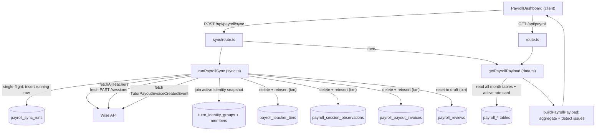

# Payroll

**Status: stable**

## Purpose

The Payroll feature reconciles BeGifted's tutor pay against the source of truth in Wise. For a chosen calendar month (Asia/Bangkok) it pulls every ended teaching session and every tutor payout invoice from Wise, joins them to the active tutor-identity snapshot and to each teacher's tier tag, aggregates paid hours and payout amounts per tutor, checks each invoice against an expected rate card, and surfaces a list of data-integrity issues (missing invoices, orphan invoices, tier gaps, duration mismatches, expected-rate variances). Admins review the month, add manual adjustments, and approve it.

The primary users are admin/finance staff (the GM approves). The page is reachable from the top nav as "Payroll" (`src/components/layout/app-nav.tsx:32`) and is gated to authenticated admin users (the route group enforces the `admin_users` allowlist via middleware; the page additionally redirects unauthenticated callers to `/login`).

The unit of work is a **payroll month**, stored as the first-of-month date (e.g. `2026-05-01`) and addressed in the UI/API as `YYYY-MM` (`src/lib/payroll/domain.ts:79-89`). Every payroll table is keyed by that `payrollMonth`, so months are fully independent of one another.

## Conceptual data model

Payroll owns eight tables, all keyed by `payrollMonth` (the first-of-month `date`). For full columns, types, indexes, and the ER diagram, see the database reference: [docs/reference/database/erd-payroll.md](../reference/database/erd-payroll.md).

- **`payroll_sync_runs`** — one row per sync attempt for a month: status (`running`/`success`/`failed`), counts, error summary, and a `metadata` JSON blob of fetch diagnostics. A partial unique index allows only one `running` row across the whole table (single-flight guard). Parent of the tier/invoice/observation children and referenced by `payroll_reviews.lastSyncRunId`.
- **`payroll_reviews`** — one row per month (unique on `payrollMonth`): review `status` (`draft`/`approved`), free-text notes, approver identity, and the last sync run that touched it. A successful sync resets this row to `draft`.
- **`payroll_teacher_tiers`** — per-month snapshot of each Wise teacher's tier tag (`rawTier` + `normalizedTier`) and full tag list, captured at sync time.
- **`payroll_payout_invoices`** — normalized `TutorPayoutInvoiceCreatedEvent` rows from the Wise activity feed: transaction id, session credits (paid hours), amount, currency, and the linked session/class. Unique on `eventId`, so distinct events that share a Wise transaction id are both kept.
- **`payroll_session_observations`** — normalized Wise PAST sessions that fall in the month: duration, meeting status, subject/class, student count, and the resolved tutor identity (`tutorGroupCanonicalKey`). The utilization side of the reconciliation.
- **`payroll_adjustments`** — manual hour/amount corrections entered by admins, with author audit fields. The sync never writes these (it writes only the run, tier, invoice, observation, and review tables — `src/lib/payroll/sync.ts:386-388`, `:394-412`); adjustments come solely from the admin adjustments API.
- **`payroll_rate_card_versions`** — versioned "PayRate" cards; a partial unique index allows only one `active = true` version. Read by the aggregator to derive expected rates.
- **`payroll_rate_rules`** — per-version expected-revenue rules keyed by `(studentBand, normalizedCourseKey, tierKey)`.

Payroll also **reads** (never writes) the cross-feature identity tables `tutor_identity_groups` and `tutor_identity_group_members`, joined to the active `snapshots` row, to resolve a Wise teacher to a canonical tutor (`src/lib/payroll/sync.ts:139-159`). Those tables are documented under the core ERD: [docs/reference/database/erd-core.md](../reference/database/erd-core.md).

## API surface

All routes live under `src/app/api/payroll/` and require an authenticated session. Full request/response contracts: [docs/reference/api/payroll.md](../reference/api/payroll.md).

- **`GET /api/payroll`** — return the assembled payroll payload for `?month=YYYY-MM` (defaults to the current Bangkok month). `src/app/api/payroll/route.ts`
- **`POST /api/payroll/sync`** — run a manual Wise sync for a month, then return the fresh payload. Carries `maxDuration = 800`. `src/app/api/payroll/sync/route.ts`
- **`PATCH /api/payroll/review`** — set review status (`draft`/`approved`) and/or notes; approval is blocked while expected-rate issues remain. `src/app/api/payroll/review/route.ts`
- **`POST /api/payroll/adjustments`** — add a manual adjustment row. `src/app/api/payroll/adjustments/route.ts`
- **`DELETE /api/payroll/adjustments/{adjustmentId}`** — delete a manual adjustment. `src/app/api/payroll/adjustments/[adjustmentId]/route.ts`

There is **no cron** for payroll — sync is exclusively user-triggered. Verified against `vercel.json` (no payroll entry); `triggerType` is hardcoded `"manual"` in the `payroll_sync_runs` insert (`src/lib/payroll/sync.ts:264`) and also defaults to `"manual"` in the schema (`src/lib/db/schema.ts:998`).

## UI

- **Page**: `src/app/(app)/payroll/page.tsx` — a thin server component that checks auth (redirects to `/login` if unauthenticated) and renders the dashboard inside `<Suspense>`.
- **Component**: `src/components/payroll/payroll-dashboard.tsx` (`PayrollDashboard`, a `"use client"` component) — owns all state and data fetching. It contains:
  - a month picker (`<input type="month">`, defaults to the current Bangkok month) plus Refresh / Sync Wise buttons;
  - five KPI stat cards: total payout, utilization vs variance, Kevin hours, rate checks, issues (`payroll-dashboard.tsx:285-291`);
  - a "Monthly reconciliation" table of per-tutor rows with quick filters — `all` / `issues` / `rate` / `kevin` / `free-pay` — computed client-side (`payroll-dashboard.tsx:159-166`);
  - a "GM approval" card (notes textarea, Approve/Unapprove, Save notes);
  - an "Adjustments" card (add/delete manual rows);
  - three bottom tabs — **Aggregate**, **Long**, **Issues** — that re-present the same payload. The Aggregate/Long tabs are local renderings of `data.tutors` (`payroll-dashboard.tsx:447-486`), **not** the legacy-sheet reconciliation report described under Open questions.

All mutations re-hydrate state from the `payload` returned by each API route, so the table, KPIs, and approval state stay in sync without a second fetch (the adjustment-delete path is the exception: it re-loads via `GET /api/payroll`).

## Data flow

A sync proceeds: route → `runPayrollSync` (fetch + normalize) → transactional month-replace write → `getPayrollPayload` (read + aggregate) → JSON to the client.

Key steps:

1. **Fetch** (`src/lib/payroll/sync.ts:276-281`) runs four calls in parallel: all teachers, the active identity snapshot, PAST sessions for the (widened) date range, and payout-invoice events.
2. **Normalize** turns raw Wise shapes into row inserts. A session resolves its tutor via Wise user id → identity-by-user, falling back to teacher-id → identity-by-teacher (`sync.ts:317-319`). Teacher tier comes from the per-month `payroll_teacher_tiers` snapshot derived from each teacher's Wise tags (`sync.ts:291-311`).
3. **Write** (`sync.ts:385-425`) is a transaction that deletes the month's tier/invoice/session rows and reinserts, resets the month's review to `draft`, and marks the run `success` with final counts.
4. **Aggregate** (`src/lib/payroll/data.ts:258-527`) is a pure function over the persisted rows: it walks ended sessions (utilization) and payout invoices (paid hours, payout amount, rate buckets), attaches issues, and rolls up the month summary. `getPayrollPayload` reads the seven month-scoped tables plus the single active rate card and its rules, then calls `buildPayrollPayload` (`data.ts:529-575`).

The aggregator is intentionally split from I/O: `buildPayrollPayload` takes already-loaded rows, which is why the bulk of the test suite drives it directly with fixtures rather than a live DB.

## Business rules & edge cases

**Fail-closed identity & tiers.** A session or invoice whose teacher does not resolve to an active identity group is still counted but tagged `unresolved_tutor_identity` (high severity), bucketed under a synthetic key like `unresolved:<userId>` (`src/lib/payroll/data.ts:138-148`, `:308-315`, `:360-368`). A teacher with no tier tag is tagged `missing_tier` and bucketed as the `"Unassigned"` tier (`data.ts:316-323`, `:369-377`). Tier labels are normalized from Wise tag text: `Tier 0-x → BG0`, `Tier 1/2/3 → BG1/BG2/BG3`, everything else → `Unassigned` (`domain.ts:109-117`).

**Two-sided reconciliation drives the core issues.** Ended sessions are indexed by id; invoices are matched back to them.
- An **ended** session (`meetingStatus === "ENDED"`, `domain.ts:155-157`) with no invoice → `missing_payout_invoice` (`data.ts:324-331`). Only ENDED sessions count toward utilization (`data.ts:285`).
- An invoice pointing at a session not in the month's pull → `orphan_payout_invoice` (`data.ts:378-385`).
- Invoice credits differing from the scheduled session duration by more than `DURATION_MISMATCH_HOURS = 0.05` h → `duration_mismatch` (`data.ts:29`, `:388-396`).

**Paid hours vs utilization are different sources.** `paidHours`/`payoutAmount`/`effectiveRate` come from **invoice** credits and amounts (`data.ts:355-358`, `:225`); `utilizationHours` comes from **session** duration (`data.ts:304-306`). `varianceHours = paidHours - utilizationHours` (`data.ts:247`). The UI tints the variance cell red beyond 0.05 h (`payroll-dashboard.tsx:345`) and the KPI card warns beyond 1 h (`payroll-dashboard.tsx:287`).

**Zero-credit / zero-amount invoices = "free pay".** An invoice with `sessionCredits <= 0` or `amount <= 0` (`domain.ts:159-164`) is always flagged `zero_credit_or_zero_amount`, and if it matched a session, that session's hours accrue to `freePayHours` (`data.ts:397-408`). Such invoices are **excluded from expected-rate checking** (`data.ts:401`/`:409` branch; verified by test `data.test.ts:283-294`).

**Expected-rate checking is gated and tolerant.** It runs only when the invoice matched a session, the tutor has a real (non-`Unassigned`) tier, and an active rate card exists (`data.ts:409`). Course mapping uses `normalizePayrollRateCourse` over the session subject/class name (`src/lib/payroll/rate-card.ts:52-81`); student band comes from `studentCount` (1 / 2 / 3_plus, defaulting to "1" when unknown — `rate-card.ts:83-88`). Outcomes:
- subject not mappable → `unmapped_rate_course` (high) (`data.ts:414-428`);
- no rule for `(band, course, tier)` → `missing_expected_rate_rule` (high) (`data.ts:429-446`);
- actual rate differs from expected by **more than ฿1/h** → `expected_rate_mismatch` (high) (`data.ts:447-469`). The `> 1` tolerance is asserted by `data.test.ts:235-244`.

**Approval gate (fail-closed).** Approving a month is rejected with HTTP 409 if any `expected_rate_mismatch`, `missing_expected_rate_rule`, or `unmapped_rate_course` issue remains (`src/app/api/payroll/review/route.ts:27-40`). The UI additionally disables the Approve button while *any* issue exists (`payroll-dashboard.tsx:390`), so the button is stricter than the server. Approval stamps approver email/name/time; switching back to draft clears them (`data.ts:595-618`).

**"Kevin" is tracked separately.** Rows whose canonical key equals `"kevin"` (case-insensitive, exact — `domain.ts:132-134`) are flagged `isKevin` and summed into dedicated `kevinHours/kevinPaidHours/kevinPayoutAmount` summary fields (`data.ts:489-492`). `"Kevin Online"` does **not** match (`domain.test.ts:69`). This carves the owner/founder's own teaching hours out of the headline payout total for review.

**Single-flight + stale-run recovery.** A unique partial index on `status = 'running'` makes a concurrent sync insert raise `23505`, which `runPayrollSync` translates to `PayrollSyncAlreadyRunningError` → HTTP 409 (`sync.ts:54-59`, `:270-273`; route `:44-46`). Before starting, any `running` row older than 20 minutes is force-failed (`sync.ts:125-137`, `:24`).

**Neon-HTTP transaction fallback.** The month-replace write runs in a Drizzle transaction; if the Neon HTTP driver rejects transactions, it transparently retries over a dedicated `pg.Pool` with manual `BEGIN/COMMIT/ROLLBACK` (`sync.ts:89-123`). Inserts are chunked at 500 rows to stay under Postgres parameter limits (`sync.ts:25`, `:71-81`). On any write failure the whole sync is rolled back and the run is marked `failed` with a summary truncated to 2,000 chars (`sync.ts:83-87`, `:437-447`; rollback verified by `sync.test.ts:240-270`).

**Month-window widening.** The Wise query range is padded by one day on each side of the Bangkok month (`domain.ts:91-107`); rows are then re-filtered to the exact month via `dateIsInPayrollMonth` (`sync.ts:316`, `:345`) to absorb timezone boundary effects. Payout-event paging additionally short-circuits once a full page contains only sessions dated before the month (`sync.ts:212-228`).

**Amount units & event recognition.** THB amounts arrive in minor units and are divided by 100; other currencies pass through (`domain.ts:127-130`). A payout event is recognized only when `eventName === "TutorPayoutInvoiceCreatedEvent"` and it carries an event id, transaction id, and timestamp (`domain.ts:166-178`).

## Tests

Unit tests live in `src/lib/payroll/__tests__/` and `src/app/api/payroll/__tests__/`:

- **`domain.test.ts`** — tier-label normalization, payout-event normalization (incl. THB minor→major), duration derivation precedence (scheduled times over `duration` ms), and the Kevin / zero-credit predicates.
- **`rate-card.test.ts`** — PayRate sheet parsing with grouped tier-column expansion and priority (`Tier 0-2` outranks `Tier 0-1`), subject→course-key normalization, student-band derivation, and `actualInvoiceRate`.
- **`data.test.ts`** — the aggregation core: paid-vs-utilization matching, `missing_payout_invoice`, `orphan_payout_invoice` (+ unresolved), zero-credit free-pay, Kevin separation, multiple rate buckets, and the full expected-rate matrix (pass, ±฿1 tolerance, mismatch, missing-rule, unmapped, and the zero-credit skip).
- **`sync.test.ts`** — `runPayrollSync` against a fake DB/Wise client: distinct events sharing a transaction id are both persisted; an insert failure rolls back the month-replace and records a truncated error summary.
- **`may-reconciliation.test.ts`** — parsing legacy Aggregate/Long payroll sheets and building the discrepancy report (see Open questions re: production wiring).
- **`src/app/api/payroll/__tests__/route.test.ts`** — auth gating, month passthrough, invalid-month → 400, manual sync (institute id + `maxEventPages: 1000`), 409 already-running, review update, the approval block on unresolved rate issues, and adjustment creation.

## Open questions

- **No *runtime* rate-card import path.** Rate-card data is live in production: migration `drizzle/0037_payroll_rate_cards.sql` both creates and seeds the rate tables — it inserts one `active = true` `payroll_rate_card_versions` row (`'PayRate May 2026'`, effective `2026-05-01`, `0037_payroll_rate_cards.sql:40-49`; registered as journal tag `0037_payroll_rate_cards`, `drizzle/meta/_journal.json:247`) and expands the PayRate sheet into `payroll_rate_rules` (`0037_payroll_rate_cards.sql:181`). So the expected-rate branch at `data.ts:409` does fire. What is **missing** is any route/seed-script/sync write path that re-imports an *updated* PayRate sheet at runtime: `parsePayRateRows` (`src/lib/payroll/rate-card.ts:98-160`) is referenced only by its test. Refreshing rates after the initial seed currently requires a new migration or manual SQL. Is a runtime rate-card importer planned?
- **`may-reconciliation.ts` has no production caller.** The entire module (legacy-sheet parsers + `buildMayPayrollReconciliationReport`) is exercised only by its test; nothing in `src/app` or `src/lib` imports it (confirmed repo-wide). Is it a one-off migration aid for the cutover from the old spreadsheet payroll, dead code, or pending UI wiring? The dashboard's "Aggregate"/"Long" tabs render `data.tutors` directly and are unrelated to this module.
- **UI vs server approval strictness mismatch.** The Approve button is disabled when `issueCount > 0` (any issue, `payroll-dashboard.tsx:390`), but the server only blocks on the three expected-rate issue types (`review/route.ts:29-33`). Intentional (UI conservative) or should they align? As written, a month with only e.g. `missing_payout_invoice` issues cannot be approved from the UI even though the server would allow it.
- **`maxEventPages` ceiling.** The sync route clamps the request value to 1–2000 but `runPayrollSync` defaults to 1000 (`sync.ts:23`, `:253`); whether 2000 is ever needed for a heavy month is unverified.

_Verified against HEAD `d4fe6d3` on 2026-06-05._
