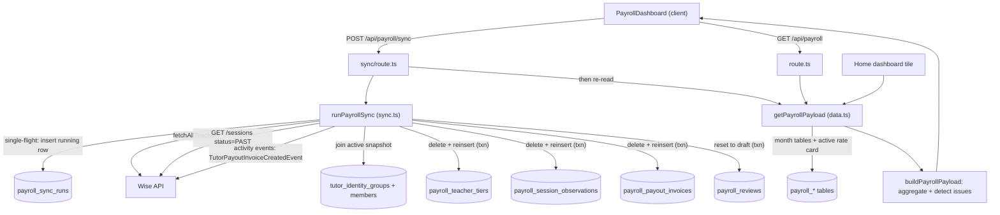

# Payroll

**Status: stable** — an editorial designation carried by this handbook. No `@deprecated` or equivalent status marker exists anywhere under `src/lib/payroll/`, `src/app/api/payroll/`, `src/app/(app)/payroll/`, or `src/components/payroll/`, so the badge is not derivable from code.

## Purpose

Payroll reconciles what BeGifted actually paid its tutors against what Wise says happened. For one calendar month (Asia/Bangkok) it pulls every **past session** and every **tutor payout invoice** from Wise, joins them to the active tutor-identity snapshot and to each teacher's Wise tier tag, aggregates paid hours / payout amount per tutor, prices each invoice against a versioned rate card, and emits a typed list of data-integrity issues. A reviewer then records manual adjustments and approves the month.

There is **no role model** behind that review step: every payroll route gates on `auth()` alone (`src/app/api/payroll/route.ts:8-11`, `sync/route.ts:19-22`, `review/route.ts:7-10`, `adjustments/route.ts:7-10`, `adjustments/[adjustmentId]/route.ts:10-13`), so any signed-in user who can reach `/payroll` can approve, adjust, or re-sync. "GM approval" is UI copy on the approval card (`src/components/payroll/payroll-dashboard.tsx:373`), not an enforced permission.

The unit of work is a **payroll month**: stored as the first-of-month `date` (e.g. `2026-05-01`), addressed everywhere in the UI/API as `YYYY-MM`, and validated by `assertPayrollMonth` (`src/lib/payroll/domain.ts:79-89`).

Entry points:

- The **Payroll** page, registered in the nav registry under the `finance-revenue` section (`src/lib/navigation/tools.ts:212-219`). Full-access admins reach it unconditionally — `isPathAllowed` short-circuits on `if (!allowedPages) return true;` (`src/middleware.ts:31`) — while a restricted user needs an `allowedPages` entry that prefix-matches `/payroll` or `/api/payroll` (`src/middleware.ts:30-61`, match at `:53-59`).
- The **home dashboard action tile**, which calls `getPayrollPayload` for the current Bangkok month and badges the tile with `summary.issueCount` and `summary.unresolvedTutorCount` (`src/lib/home/summary.ts:181-182`, `:226-232`).

Payroll is **read-only against Wise** — it fetches teachers, sessions, and activity events and never writes back.

## Conceptual data model

Payroll owns eight tables. Six are keyed by `payrollMonth`; the two rate-card tables are keyed by **version**, not by month — `effectiveMonth` is descriptive only (see *The active rate card is global* below). Columns, types, index and constraint composition, and the ER diagram live in the reference: [docs/reference/database/erd-payroll.md](../reference/database/erd-payroll.md).

- **`payroll_sync_runs`** — one row per sync attempt for a month, carrying its outcome and its fetch diagnostics. At most one run may be `running` across the whole table at a time; that is the single-flight guard.
- **`payroll_reviews`** — the human review record for a month, one row per month: `draft`/`approved`, free-text notes, approver identity, and the sync run that last touched it.
- **`payroll_teacher_tiers`** — each Wise teacher's tier tag (`rawTier` + `normalizedTier`) plus the full tag list, as read during that month's sync. It is per-month, but **not** an immutable snapshot — see *Re-syncing rewrites the month's tier rows* below.
- **`payroll_payout_invoices`** — normalized `TutorPayoutInvoiceCreatedEvent` rows from the Wise activity feed; `sessionCredits` is the paid-hours figure the whole reconciliation turns on. Dedupe is per **event**, so two distinct events sharing one Wise transaction id are both kept.
- **`payroll_session_observations`** — normalized Wise `PAST` sessions inside the month, each carrying the `tutorGroupCanonicalKey` resolved at sync time. This is the only place in the domain where a Wise record is bound to a canonical tutor.
- **`payroll_adjustments`** — manual hour/amount corrections typed in by admins, with author audit fields. The sync never writes this table.
- **`payroll_rate_card_versions`** — versioned "PayRate" cards; exactly one may be active at a time.
- **`payroll_rate_rules`** — per-version expected-revenue rules, one per (student band, course, tier) cell.

Payroll **reads but never writes** the cross-feature identity tables `tutor_identity_groups` + `tutor_identity_group_members`, joined to the active `snapshots` row, to map a Wise teacher onto a canonical tutor (`src/lib/payroll/sync.ts:139-159`).

Two payroll tables are read **outside** payroll, so this data is not private to the feature:

- **The rate card** — Student Promotions resolves the active version and its rules exactly the way payroll does, to model pay-rate impact (`src/lib/student-promotions/data.ts:1579-1595`).
- **`payroll_payout_invoices`** — Post-Class Feedback's `resolvePostClassPayoutEligibility` looks up an invoice by `wiseSessionId` with `sessionCredits > 0` **or** `amount > 0`, and treats its presence as proof the session was payable (`src/lib/post-class-feedback/repository.ts:2154-2172`, wired in at `src/lib/post-class-feedback/sync.ts:1063`). Because a payroll sync deletes and reinserts a month's invoice rows, re-syncing a month — or never syncing it — can flip another feature's eligibility answer.

## API surface

Five endpoints under `src/app/api/payroll/`. Their shared auth/validation conventions, full request/response contracts, status-code tables, and side effects live in the reference: [docs/reference/api/payroll.md](../reference/api/payroll.md).

- **`GET /api/payroll`** — assemble and return the payroll payload for `?month=YYYY-MM` (default: current Bangkok month). `src/app/api/payroll/route.ts`
- **`POST /api/payroll/sync`** — run a manual Wise sync for a month, then re-read and echo the rebuilt payload so the client needs no follow-up `GET`. `src/app/api/payroll/sync/route.ts`
- **`PATCH /api/payroll/review`** — set review status and/or notes; approval is refused while expected-rate issues remain. `src/app/api/payroll/review/route.ts`
- **`POST /api/payroll/adjustments`** — append a manual adjustment row. `src/app/api/payroll/adjustments/route.ts`
- **`DELETE /api/payroll/adjustments/{adjustmentId}`** — delete one adjustment. `src/app/api/payroll/adjustments/[adjustmentId]/route.ts`

There is **no payroll cron**. `vercel.json` registers no payroll entry, no `/api/internal/*` route calls `runPayrollSync` — its only production caller is `POST /api/payroll/sync` (`src/app/api/payroll/sync/route.ts:34`) — and every run is inserted with `triggerType: "manual"` (`src/lib/payroll/sync.ts:264`). So nothing refreshes a month on a schedule. In practice that means someone presses **Sync Wise**; strictly, it means any authenticated session that can reach the route (a script holding a session cookie included) can start one.

## UI

- **Page** — `src/app/(app)/payroll/page.tsx`: a thin Server Component that re-checks `auth()`, redirects to `/login` when there is no session email, and renders the dashboard inside `<Suspense>`.
- **Component** — `src/components/payroll/payroll-dashboard.tsx` (`PayrollDashboard`, `"use client"`) owns all state and fetching:
  - month picker (`<input type="month">`) plus **Refresh** and **Sync Wise** buttons;
  - five KPI stat cards — total payout, utilization vs variance, Kevin hours, rate checks, issues (`:286-290`);
  - a **Monthly reconciliation** table of per-tutor rows with client-side quick filters `all` / `issues` / `rate` / `kevin` / `free-pay` (`:159-166`);
  - a **GM approval** card (notes textarea, Save notes, Approve / Unapprove);
  - an **Adjustments** card (free-form tutor key/name, hours, amount, description; add and delete);
  - three bottom tabs — **Aggregate**, **Long**, **Issues** — that re-present `data.tutors` / `data.issues` in the shape of the legacy payroll sheets (`:439-518`).

Every mutation re-hydrates component state from the `payload` echoed by the route, so the table, KPIs, and approval badge stay consistent without a follow-up `GET` (`:179-180`, `:199-200`, `:227`). Only the adjustment delete re-fetches, because that route returns no payload (`:243`).

## Data flow

A sync is: route → `runPayrollSync` (fetch + normalize) → one transactional month-replace → `getPayrollPayload` (read + aggregate) → JSON to the client. Reads skip the whole left half.

```mermaid
flowchart TD
    UI["PayrollDashboard (client)"] -->|"POST /api/payroll/sync"| SyncRoute["sync/route.ts"]
    SyncRoute --> RunSync["runPayrollSync (sync.ts)"]

    RunSync -->|"single-flight: insert running row"| SyncRuns[("payroll_sync_runs")]
    RunSync -->|"fetchAllTeachers"| Wise["Wise API"]
    RunSync -->|"GET /sessions status=PAST"| Wise
    RunSync -->|"activity events: TutorPayoutInvoiceCreatedEvent"| Wise
    RunSync -->|"join active snapshot"| Identity[("tutor_identity_groups + members")]

    RunSync -->|"delete + reinsert (txn)"| Tiers[("payroll_teacher_tiers")]
    RunSync -->|"delete + reinsert (txn)"| Sessions[("payroll_session_observations")]
    RunSync -->|"delete + reinsert (txn)"| Invoices[("payroll_payout_invoices")]
    RunSync -->|"reset to draft (txn)"| Reviews[("payroll_reviews")]

    SyncRoute -->|"then re-read"| GetPayload["getPayrollPayload (data.ts)"]
    UI -->|"GET /api/payroll"| GetRoute["route.ts"] --> GetPayload
    Home["Home dashboard tile"] --> GetPayload
    GetPayload -->|"month tables + active rate card"| AllTables[("payroll_* tables")]
    GetPayload --> Build["buildPayrollPayload: aggregate + detect issues"]
    Build --> UI
```

1. **Fetch** — four calls in parallel: all teachers, the active identity snapshot, `PAST` sessions over the widened date range, and payout-invoice events (`sync.ts:276-281`).
2. **Normalize** — Wise shapes become insert rows. A session resolves its tutor by Wise **user** id first, then falls back to the teacher record's id (`sync.ts:317-319`); the user id itself is `getWiseUserId(session.userId) ?? session.teacherId` (`src/lib/wise/types.ts:322-326`).
3. **Write** — a single transaction deletes the month's tier/session/invoice rows, reinserts them in 500-row chunks, resets the month's review to `draft`, and marks the run `success` with final counts (`sync.ts:385-425`). Diagnostics are written to `metadata` *before* the transaction, so they survive a failed write (`sync.ts:366-383`).
4. **Aggregate** — `buildPayrollPayload` is a pure function over the persisted rows (`data.ts:258-527`): walk ended sessions for utilization, walk invoices for paid hours / payout / rate buckets, attach issues to both, then roll up the month summary.

## Business rules & edge cases

**Paid hours come from invoice credits, utilization from session duration.** `paidHours` accumulates `invoice.sessionCredits` (`data.ts:355`); `utilizationHours` accumulates `durationMinutes / 60` of **ENDED** sessions only (`data.ts:285`, `:304-306`). `varianceHours = paidHours - utilizationHours` is the headline reconciliation number (`data.ts:247`).

**Fail-closed identity — with an asymmetry between the two sides.** Nothing is ever dropped for failing to resolve; an unresolved row is still counted, under a synthetic key: `unresolved:<wiseUserId>`, else `unresolved-session:<id>`, else `unresolved-transaction:<id>` (`data.ts:138-148`). But the two loops mean different things by "unresolved":

- **Sessions** carry a `tutorGroupCanonicalKey` resolved against the active identity snapshot at sync time; a session row without one raises `unresolved_tutor_identity` (high) (`data.ts:308-315`).
- **Invoices never consult the identity tables at all.** An invoice borrows its canonical key from its matched session — `const canonicalKey = matchedSession?.tutorGroupCanonicalKey ?? null` (`data.ts:337`) — and the issue fires on `!canonicalKey` (`data.ts:360-368`). So on an invoice, `unresolved_tutor_identity` means *"no resolved canonical key was reachable through a matched session"*, which collapses two distinct failures: **no matching session row** in this month's pull, and **a matched session that itself resolved to no identity group** (the session write stores `identity?.canonicalKey ?? null`, `sync.ts:318-326`). Only the second is "this teacher does not resolve".

The consequence is that **every orphan invoice is double-flagged** — `orphan_payout_invoice` *and* `unresolved_tutor_identity` — even when the teacher resolves perfectly and has a valid tier row (`data.test.ts:181-188` builds exactly that case and expects `issueCount === 2`). It also lands in a **second aggregate row**, keyed `unresolved:<wiseUserId>`, alongside the same tutor's canonical-key row — inflating both `summary.tutorCount` and `summary.unresolvedTutorCount` (`data.ts:515`, `:521`). Sessions and invoices for a genuinely unresolved Wise user do still merge into a single row, because both fall back to the same `unresolved:<userId>` key; rows lacking a user id fragment per session/transaction.

**`missing_tier` covers three different failures.** The condition is `!tier || tier.normalizedTier === "Unassigned"` (`data.ts:316`, `:369`), so it fires when (a) there is no tier row for the session/invoice's Wise user id, (b) a tier row exists but the teacher carried **no** `Tier …` tag — `extractTierTag` returns `null` (`domain.ts:119-125`) and `normalizeTierLabel` takes its empty-value branch, `if (!value) return "Unassigned";` (`domain.ts:111`) — or (c) a tag exists but matched none of the `Tier 0`–`Tier 3` patterns and fell through to the same `"Unassigned"` (`domain.ts:116`). Case (b) is the dominant one, because *every* fetched teacher gets a tier row whether or not it has a tag (`sync.ts:291-311`); it is also what the code's own message says — *"Tutor has no Wise tier tag for this payroll month."* Severity is medium. Tier lookup is by `wiseUserId` only, and tier rows without one are silently unindexed (`data.ts:130-136`), so a teacher record missing a user id can never be tiered. A tutor first seen as `Unassigned` is upgraded in place if a later row carries a real tier (`data.ts:172-178`).

**Two-sided reconciliation produces the core issues.**
- ENDED session (`meetingStatus === "ENDED"`, `domain.ts:155-157`) with no invoice → `missing_payout_invoice` (high) (`data.ts:324-331`).
- Invoice pointing at a session absent from the month's pull → `orphan_payout_invoice` (high) (`data.ts:378-385`).
- Invoice credits differing from scheduled duration by more than `DURATION_MISMATCH_HOURS = 0.05` h (3 minutes) → `duration_mismatch` (medium) (`data.ts:29`, `:388-396`).

**Zero-credit / zero-amount invoices are "free pay".** `sessionCredits <= 0` **or** `amount <= 0` (`domain.ts:159-164`) always raises `zero_credit_or_zero_amount`; when the invoice matched a session, that session's hours accrue to `freePayHours` (`data.ts:397-408`). Such invoices are deliberately **excluded from expected-rate checking** (`data.ts:401-409`, asserted by `data.test.ts:283-294`) — you cannot price a giveaway.

**Expected-rate checking is gated and tolerant.** It runs only when the invoice matched a session **and** the tutor has a real tier **and** an active rate card exists (`data.ts:409`, `:271`). Course mapping is a regex cascade over the session subject (falling back to class name) — `normalizePayrollRateCourse` (`rate-card.ts:52-81`); the student band is derived from `studentCount` as `1` / `2` / `3_plus`, defaulting to `"1"` when the count is missing or non-numeric (`rate-card.ts:83-88`). Outcomes:
- subject not mappable → `unmapped_rate_course` (high) (`data.ts:414-428`);
- no rule for `(band, course, tier)` → `missing_expected_rate_rule` (high) (`data.ts:429-446`);
- actual rate off expected by **more than ฿1/h** → `expected_rate_mismatch` (high) (`data.ts:447-469`). The `> 1` tolerance is pinned by `data.test.ts:235-244`.

The rate-card parser expands grouped sheet columns (`Tier 0-1`, `Tier 0-2`) into per-tier rules with a priority ladder, so a narrower column wins over a broader one for the same `(band, course, tier)` key (`rate-card.ts:22-28`, `:128-149`).

**The active rate card is global, not month-scoped.** `effectiveMonth` is never used as a key, a filter, or a selector anywhere in the codebase: the only query is `active = true` ordered by `createdAt desc` (`data.ts:552-557`), and the outside consumer does the same (`src/lib/student-promotions/data.ts:1580-1585`). The column survives purely as an echoed DTO field (`data.ts:107`, `types.ts:83`). Every payroll month — including long-settled past months — is therefore priced against whatever version happens to be active *now*, so activating a replacement card silently re-prices history on the next payload build.

**Approval gate (fail-closed, two layers).** `PATCH /api/payroll/review` re-reads the payload and returns **409** if any `expected_rate_mismatch`, `missing_expected_rate_rule`, or `unmapped_rate_course` issue survives (`src/app/api/payroll/review/route.ts:27-40`). The UI is stricter still: the Approve button is disabled while *any* issue exists (`payroll-dashboard.tsx:390`). Approving stamps approver email/name/time; returning to draft clears all three (`data.ts:595-618`).

**A successful sync silently un-approves the month.** The transactional upsert resets `payroll_reviews` to `status: "draft"` and nulls the approver fields (`sync.ts:394-412`), so re-syncing an approved month forces a fresh approval. Notes are not cleared (they are absent from the conflict `set`).

**Re-syncing rewrites the month's tier rows.** Nothing marks a month closed, and nothing pins its tier data. The same write transaction deletes every `payroll_teacher_tiers` row for the month (`sync.ts:386`) and reinserts rows built from the tags fetched during *that* run (`sync.ts:390`, rows assembled at `:291-311`), so re-syncing an old month replaces its tiers with current Wise tags — and, per the rule above, drops the approval too. Nothing in the code treats tier data as a frozen snapshot; if settled months stay stable in practice, that is an operating habit, not a guarantee this repo can enforce or evidence.

**Manual adjustments are reported, not applied.** They are summed into `summary.manualAdjustmentHours` / `manualAdjustmentAmount` (`data.ts:483-484`, `:513-514`) but are **not** folded into any tutor row, `totalPayoutAmount`, or `paidHours` — those totals are pure sums over the tutor rows (`data.ts:485-487`). Adjustments are a reviewer's ledger for the downstream payout, not a mutation of the Wise-derived numbers.

**"Kevin" is tracked separately.** A row whose canonical key equals `"kevin"` (trimmed, case-insensitive, exact — `domain.ts:132-134`) is flagged `isKevin` and summed into dedicated `kevinHours` / `kevinPaidHours` / `kevinPayoutAmount` fields (`data.ts:489-492`). `"Kevin Online"` deliberately does **not** match (`domain.test.ts:66-73`).

**Single-flight plus stale-run recovery.** A concurrent sync insert violates the partial unique index on `status = 'running'`, raising `23505`, which becomes `PayrollSyncAlreadyRunningError` → HTTP 409 (`sync.ts:54-59`, `:270-273`; route `:44-46`). Before starting, any `running` row older than `STALE_RUNNING_MS` (20 min) is force-failed with an explanatory summary (`sync.ts:24`, `:125-137`).

**Neon-HTTP transaction fallback.** The month-replace needs a real transaction, which the neon-http driver cannot give. `runPayrollWriteTransaction` tries Drizzle's `db.transaction`, detects the specific "No transactions support in neon-http driver" error, and transparently retries over a dedicated single-connection `pg.Pool` with manual `BEGIN`/`COMMIT`/`ROLLBACK` (`sync.ts:89-123`). Any failure rolls the whole month back and marks the run `failed` with an error summary truncated to 2,000 chars (`sync.ts:83-87`, `:437-447`; rollback verified by `sync.test.ts:240-270`).

**Month-window widening applies to sessions only.** `payrollMonthRange` pads the query range one day either side of the Bangkok month (`domain.ts:91-107`, using `endOfBangkokMonth`/`bangkokDateStartUtc`), but `queryStartDate`/`queryEndDate` are handed to the **session** fetch alone (`sync.ts:279` → `:161-191`, which forwards `startDate`/`endDate` to Wise). The payout-event fetch receives no dates at all (`sync.ts:280` → `:193-232`), and `fetchWiseActivityEvents` sends only `page_number`/`page_size`/`type`/`eventName`/`userId`/`classIds` (`src/lib/wise/fetchers.ts:503-515`) — so on the event side there is no server-side range to widen; the walk pulls the raw feed and filters client-side (`sync.ts:223`). Both sides are then re-filtered to the exact Bangkok month by `dateIsInPayrollMonth` before anything is written (`sync.ts:316` sessions, `:345` invoices) — belt-and-braces against UTC boundary drift.

**Payout-event paging heuristic.** Events are pulled page by page (50 per page) filtered to `TutorPayoutInvoiceCreatedEvent`, and paging stops early once a page is short **or** every dated event on it predates the month (`sync.ts:203-229`). An event that normalizes without a `sessionStartTime` keeps the scan alive but is never persisted, since `dateIsInPayrollMonth(null)` is false (`domain.ts:223-227`). `maxEventPages` caps the walk, defaulting to `DEFAULT_MAX_EVENT_PAGES = 1000` (`sync.ts:23`, applied at `:253`); the request-side bounds on that parameter belong to the endpoint contract — see [docs/reference/api/payroll.md](../reference/api/payroll.md#post-apipayrollsync).

**Amount units and event recognition.** THB amounts arrive in minor units and are divided by 100; other currencies pass through untouched (`domain.ts:127-130`). An activity event is only recognized as a payout when `eventName === "TutorPayoutInvoiceCreatedEvent"` **and** it carries an event id, a transaction id, and a timestamp — otherwise it normalizes to `null` and is dropped (`domain.ts:166-178`).

## Tests

Unit tests live in `src/lib/payroll/__tests__/` and `src/app/api/payroll/__tests__/` (no integration suite for this feature).

- **`domain.test.ts`** — tier-label normalization, payout-event normalization including THB minor→major conversion, duration precedence (scheduled start/end beats `duration` ms), and the Kevin / zero-credit predicates.
- **`rate-card.test.ts`** — PayRate sheet parsing with grouped tier-column expansion and priority, Wise subject → course-key normalization, student-band derivation, and `actualInvoiceRate`.
- **`data.test.ts`** — the aggregation core: credits-vs-utilization matching, `missing_payout_invoice`, `orphan_payout_invoice`, zero-credit free-pay, Kevin separation, multiple rate buckets per tutor, and the full expected-rate matrix (pass, ฿1 tolerance, mismatch, missing rule, unmapped course, zero-credit skip).
- **`sync.test.ts`** — `runPayrollSync` against a fake DB and Wise client: distinct events sharing one transaction id are both persisted; an insert failure rolls back the month replacement and stores a truncated error summary.
- **`may-reconciliation.test.ts`** — parsing the legacy Aggregate/Long payroll sheets and building the discrepancy report (see Open questions — the module has no production caller).
- **`src/app/api/payroll/__tests__/route.test.ts`** — auth gating, month passthrough, invalid month → 400, manual sync (institute id + `maxEventPages: 1000`), 409 already-running, review update, approval blocked by unresolved rate issues, and adjustment creation.

## Open questions

- **No runtime path re-imports a rate card.** `payroll_rate_card_versions` / `payroll_rate_rules` are created *and populated* by migration `drizzle/0037_payroll_rate_cards.sql` (one `active = true` version, `'PayRate May 2026'`, sourced from `Google Sheet PayRate gid 157734374`, plus a CTE chain that expands the sheet into rules — `drizzle/0037_payroll_rate_cards.sql:38-60`). So a rate card is seeded by migration, never by a runtime path. Whether expected-rate checking is actually *live* depends on that migration having been applied to the production Neon database, which is not observable from this repo: with no `active` version, `getPayrollPayload` returns `rateCard: null`, `rateRuleLookup` is `null` (`data.ts:271`), and every rate check silently no-ops (`data.ts:409`). And `parsePayRateRows` (`rate-card.ts:98-160`) — the parser that would ingest an updated sheet — is referenced only by its test; there is no route, script, or sync that writes these tables. Refreshing rates today requires a new migration or manual SQL. Is a runtime rate-card import planned, and who owns the sheet→DB refresh?
- **`may-reconciliation.ts` has no production caller.** The whole module (legacy sheet parsers plus `buildMayPayrollReconciliationReport`) is imported only by its test. One-off migration aid, dead code, or pending UI wiring? Note the dashboard's Aggregate/Long tabs render `data.tutors` directly and are unrelated to it.
- **UI and server disagree on approval strictness.** The Approve button is disabled when `issueCount > 0` (any issue type), while the server blocks only on the three expected-rate types. Deliberate conservatism in the UI, or should the two align? As written, a month with only `missing_tier` or `duration_mismatch` issues can be approved via the API but not via the button.
- **Adjustments never reach a total.** Manual adjustments appear only in their own summary fields and the sidebar list. Is a downstream consumer meant to add them to the payout, or is the reviewer expected to apply them by hand outside the app?
- **Home-dashboard cost.** `getPayrollPayload` runs the full month aggregation (all tier/invoice/session rows plus the rate card) on every home-dashboard load for users with payroll access (`src/lib/home/summary.ts:181-182`), uncached. Acceptable, or should the tile read a cheaper count?
- **`maxEventPages` ceiling.** The mechanics are settled, and the request-side contract is documented in [docs/reference/api/payroll.md](../reference/api/payroll.md#post-apipayrollsync). What is **not** verified — no production run data lives in this repo — is whether any real month's payout feed ever exhausts the default page budget, or whether the early-stop heuristic always fires first.
- **Orphan invoices are counted twice, by design or by accident?** An invoice whose session is missing from the month's pull raises `unresolved_tutor_identity` on top of `orphan_payout_invoice` and opens a second `unresolved:<wiseUserId>` aggregate row beside the tutor's real row, inflating `summary.tutorCount` and `summary.unresolvedTutorCount`. Should the invoice loop resolve its own identity (via `payroll_teacher_tiers.wiseUserId`, which it already looks up for the tier) so an orphan stays one row with one issue?
- **Should a settled month pin its rate card?** Pricing always uses the currently active version (`data.ts:552-557`), so publishing a new card retroactively re-prices every past month's expected-rate checks and can turn an approved month back into a rate-mismatch month on the next payload build. `payroll_rate_card_versions.effectiveMonth` exists but is never read as a selector — was month-scoped selection intended and dropped?

_Verified against HEAD + uncommitted WIP on 2026-05-31._
