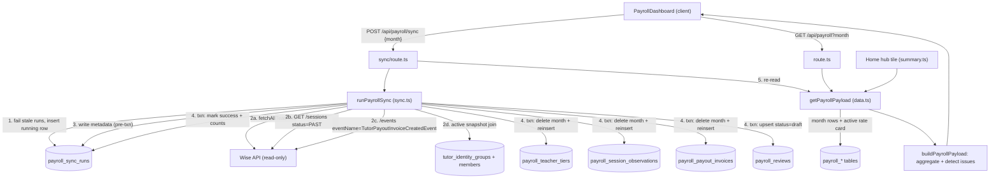

# Payroll

**Status: stable** — a handbook designation, not a code marker. No `@deprecated`, `TODO`, or `FIXME` exists anywhere under `src/lib/payroll/`, `src/app/api/payroll/`, `src/app/(app)/payroll/`, or `src/components/payroll/`, so maturity cannot be read off the source; the badge is applied from the handbook's maturity map and records that the code has been stable in shape since the payroll tracker migration (`drizzle/0034_wise_payroll_tracker.sql`): the last commit touching `src/lib/payroll/`, `src/app/api/payroll/`, or `src/components/payroll/` is `8cc2717` (`git log -- <those paths>`), and no payroll source file differs from `origin/main`. Whether the payroll tables were migrated in Neon or the page is actually used in production is a runtime fact the repo cannot attest.

## Purpose

Payroll answers one question per Bangkok calendar month: **does what Wise says we paid each tutor match what Wise says each tutor taught?** For a chosen month it pulls every finished (`PAST`) Wise session and every `TutorPayoutInvoiceCreatedEvent` from the Wise activity feed, binds **sessions** to the canonical tutor identity from the active snapshot (`src/lib/payroll/sync.ts:318-319`, written at `:326`) — invoices never consult the identity tables and inherit the key through their matched session at aggregation time (`src/lib/payroll/data.ts:337`) — looks up each teacher's Wise "Tier" tag by Wise user id for both, and aggregates per tutor:

- **paid hours** and **payout amount** from invoice credits/amounts;
- **utilization hours** from the scheduled duration of `ENDED` sessions;
- the **variance** between the two;
- an **expected-rate check** of each invoice against the active versioned rate card ("PayRate");
- a typed list of **integrity issues** (nine kinds, each with a severity).

A finance reviewer then records free-form **manual adjustments**, writes notes, and **approves** the month. The feature is read-only toward Wise (teachers, sessions, and events are only ever fetched — `src/lib/payroll/sync.ts:276-281`) and never writes to any other feature's tables.

Users are finance/admin staff. The page lives in the **Finance & Revenue** nav section with a live count badge (`src/lib/navigation/tools.ts:220-227`, badge key at `:38`), and the home hub tile for it shows the current month's `issueCount` with an "N unresolved tutors" detail line (`src/lib/home/summary.ts:181-182`, `:226-232`). There is **no role model**: every route gates on `auth()` alone (`src/app/api/payroll/route.ts:8-11`, `sync/route.ts:19-22`, `review/route.ts:7-10`, `adjustments/route.ts:7-10`, `adjustments/[adjustmentId]/route.ts:10-13`), so any signed-in user who can reach `/payroll` can sync, adjust, approve, or un-approve. "GM approval" is the card title in the UI (`src/components/payroll/payroll-dashboard.tsx:373`), not an enforced permission. Restricted users reach it only when an `allowedPages` entry prefix-matches `/payroll`, which the middleware also applies to the `/api/payroll` namespace (`src/middleware.ts:36-37`, `:59-66`).

The unit of work is a **payroll month**: addressed everywhere as `YYYY-MM`, validated by `assertPayrollMonth` (`src/lib/payroll/domain.ts:79-89`), and stored as the first-of-month `date` (`payrollMonthRange` builds `${month}-01`, `domain.ts:91-107`).

## Conceptual data model

Payroll owns eight tables in the "Wise Payroll Review" section of `src/lib/db/schema.ts` (section header at `:1761`). Columns, indexes, and the ER diagram are in the reference: [docs/reference/database/erd-payroll.md](../reference/database/erd-payroll.md); the review-status enum is in [enums.md](../reference/database/enums.md#payroll).

Six tables are keyed by `payroll_month`:

- **`payroll_sync_runs`** — one row per sync attempt: outcome, counts, error summary, and a `metadata` bag of fetch diagnostics. A partial unique index on `status = 'running'` makes it the single-flight guard for the whole feature (`schema.ts:1776-1778`).
- **`payroll_reviews`** — the one human review record per month (unique on month, `:1796`): `draft`/`approved`, notes, approver identity, and the sync run that last rewrote the month.
- **`payroll_teacher_tiers`** — every Wise teacher's `Tier …` tag as read during *that month's* sync, raw and normalized, plus the full tag list. It is per-month but not frozen — see *Re-syncing rewrites the month* below.
- **`payroll_payout_invoices`** — normalized `TutorPayoutInvoiceCreatedEvent` rows. `session_credits` is the paid-hours figure the reconciliation turns on. Uniqueness is per Wise **event id** (`:1836`), so two events sharing one transaction id are both kept.
- **`payroll_session_observations`** — normalized Wise `PAST` sessions inside the month, each stamped with the `tutor_group_canonical_key` resolved at sync time. This is the only place a Wise record is bound to a canonical tutor.
- **`payroll_adjustments`** — free-form hour/amount corrections typed in by a reviewer, with author fields. The sync never touches this table.

Two tables are keyed by **rate-card version**, not by month:

- **`payroll_rate_card_versions`** — named "PayRate" cards; a partial unique index allows at most one `active = true` (`:1899-1901`).
- **`payroll_rate_rules`** — one expected `revenue per hour` per (`student_band`, `normalized_course_key`, `tier_key`) within a version (`:1920`).

Payroll **reads but never writes** the tutor-identity tables (`tutor_identity_groups` + `tutor_identity_group_members`, joined to the active `snapshots` row) to map a Wise teacher onto a canonical key (`src/lib/payroll/sync.ts:139-159`).

Two payroll tables are consumed **outside** the feature, so its data is not private:

- **Rate card** — Student Promotions loads the active version and its rules exactly as payroll does, to model before/after pay-band impact (`src/lib/student-promotions/data.ts:1579-1595`), imports payroll's tier and course normalizers (`data.ts:5-12`), and its pay-rate-impact table carries FKs into `payroll_rate_rules` (`schema.ts:1492-1493`). See [erd-student-promotions.md](../reference/database/erd-student-promotions.md).
- **Payout invoices** — Post-Class Feedback's `resolvePostClassPayoutEligibility` looks up an invoice by `wise_session_id` with `session_credits > 0` **or** `amount > 0` and treats its presence as proof the session was payable; absence is a definite "not payable", not an unknown (`src/lib/post-class-feedback/repository.ts:2162-2180`, called from `src/lib/post-class-feedback/sync.ts:1063`). Because a payroll sync deletes and reinserts a month's invoice rows, whether and when a month was synced can change another feature's answer.

## API surface

Five endpoints under `src/app/api/payroll/`. Request/response contracts, status-code tables, and side effects are in the reference: [docs/reference/api/payroll.md](../reference/api/payroll.md).

- **`GET /api/payroll`** — build and return the reconciled payload for `?month=YYYY-MM` (default: current Bangkok month). `src/app/api/payroll/route.ts`
- **`POST /api/payroll/sync`** — run a manual Wise sync for a month, then re-read and echo the rebuilt payload (`maxDuration = 800`). `src/app/api/payroll/sync/route.ts`
- **`PATCH /api/payroll/review`** — save notes and/or set `draft`/`approved`; approval is refused while expected-rate issues remain. `src/app/api/payroll/review/route.ts`
- **`POST /api/payroll/adjustments`** — append a manual adjustment row (month + description required). `src/app/api/payroll/adjustments/route.ts`
- **`DELETE /api/payroll/adjustments/{adjustmentId}`** — remove one adjustment; `404` when unknown. `src/app/api/payroll/adjustments/[adjustmentId]/route.ts`

Two conventions differ from the rest of the app: none of the five handlers uses Zod — bodies are `request.json()` with a `{}` fallback (`.catch(() => ({}))` in `review/route.ts:12` and `adjustments/route.ts:12`; a `try`/`catch` plus a `typeof body === "object"` guard in `sync/route.ts:24-30`) followed by hand-written `if` checks — and none declares `"use cache"`, `revalidate`, or `cacheTag` — every request reads Postgres directly.

**There is no payroll cron.** `vercel.json` has no payroll entry, nothing under `src/app/api/internal/` references payroll, and every run is inserted with `triggerType: "manual"` (`src/lib/payroll/sync.ts:264`). The only production caller of `runPayrollSync` is `POST /api/payroll/sync` (`sync/route.ts:34`), which the dashboard's **Sync Wise** button hits. Payroll is likewise absent from the Data Health cron registry, so a stale month is never reported anywhere except inside its own payload (`src/lib/payroll/data.ts:538-543`).

## UI

- **Page** — `src/app/(app)/payroll/page.tsx`: a thin Server Component that re-checks `auth()`, redirects to `/login` when there is no session email (`:7-10`), and renders the dashboard inside `<Suspense fallback={null}>` (`:16-18`). It passes no props; all data is fetched client-side.
- **Component** — `src/components/payroll/payroll-dashboard.tsx` (`PayrollDashboard`, `"use client"`) owns all state:
  - header with an `<input type="month">` (initialized to the current Bangkok month, `:29-37`, `:122`), **Refresh**, and **Sync Wise** (`:253-274`);
  - five KPI cards — total payout / paid hours, utilization / variance (amber when |variance| > 1 h), Kevin hours, rate checks (red when any rate issue), issues (red when any issue) (`:285-291`);
  - **Monthly reconciliation** — the per-tutor table with quick filters `All` / `Issues` / `Rate issues` / `Kevin` / `Free-pay` (`:25`, `:159-166`, `:308-319`), the last-sync line and active rate-card name (`:298-301`), and a Draft/Approved badge (`:303-305`);
  - **GM approval** — notes textarea, **Save notes**, and **Approve** / **Unapprove** (`:371-402`);
  - **Adjustments** — free-text tutor key, tutor name, hours, amount, description; add and delete (`:404-435`);
  - three bottom tabs, **Aggregate**, **Long**, **Issues**, that re-present `data.tutors` and `data.issues` in the shape of the legacy payroll sheets (`:439-518`). The Issues tab shows course / student band / tier and expected-vs-actual rate for the three rate-issue types (`:504-511`).

Every mutating call re-hydrates component state from the `payload` the route echoes (`:179-180`, `:199-200`, `:227`), so KPIs, table, and approval badge never drift from the server without a follow-up `GET`. Only adjustment deletion re-fetches, because that route returns no payload (`:243`). The `GET` uses `cache: "no-store"` (`:143`).

## Data flow

A sync is *route → `runPayrollSync` (fetch + normalize) → one transactional month-replace → `getPayrollPayload` (read + aggregate) → JSON*. A plain read skips the left half entirely; the aggregation is a pure function over persisted rows, so `GET` never touches Wise.

```mermaid
flowchart TD
    UI["PayrollDashboard (client)"] -->|"POST /api/payroll/sync {month}"| SyncRoute["sync/route.ts"]
    SyncRoute --> RunSync["runPayrollSync (sync.ts)"]

    RunSync -->|"1. fail stale runs, insert running row"| SyncRuns[("payroll_sync_runs")]
    RunSync -->|"2a. fetchAllTeachers"| Wise["Wise API (read-only)"]
    RunSync -->|"2b. GET /sessions status=PAST"| Wise
    RunSync -->|"2c. /events eventName=TutorPayoutInvoiceCreatedEvent"| Wise
    RunSync -->|"2d. active snapshot join"| Identity[("tutor_identity_groups + members")]

    RunSync -->|"3. write metadata (pre-txn)"| SyncRuns
    RunSync -->|"4. txn: delete month + reinsert"| Tiers[("payroll_teacher_tiers")]
    RunSync -->|"4. txn: delete month + reinsert"| Sessions[("payroll_session_observations")]
    RunSync -->|"4. txn: delete month + reinsert"| Invoices[("payroll_payout_invoices")]
    RunSync -->|"4. txn: upsert status=draft"| Reviews[("payroll_reviews")]
    RunSync -->|"4. txn: mark success + counts"| SyncRuns

    SyncRoute -->|"5. re-read"| GetPayload["getPayrollPayload (data.ts)"]
    UI -->|"GET /api/payroll?month"| GetRoute["route.ts"] --> GetPayload
    Home["Home hub tile (summary.ts)"] --> GetPayload
    GetPayload -->|"month rows + active rate card"| Tables[("payroll_* tables")]
    GetPayload --> Build["buildPayrollPayload: aggregate + detect issues"]
    Build --> UI
```

1. **Guard** — `markAbandonedRuns` force-fails any `running` row older than 20 minutes, then a new `running` row is inserted; a unique-index violation here becomes `PayrollSyncAlreadyRunningError` (`sync.ts:255-273`).
2. **Fetch** — four calls in parallel: all teachers, the active identity snapshot, `PAST` sessions over the widened date range, and payout events (`sync.ts:276-281`).
3. **Normalize** — teachers become tier rows (every teacher, tagged or not, `sync.ts:291-311`); sessions are re-filtered to the exact Bangkok month and stamped with a canonical key resolved by Wise **user** id first, then by the teacher record's id (`sync.ts:313-340`, resolution at `:317-319`); events become invoice rows, again re-filtered to the month (`sync.ts:342-364`).
4. **Write** — fetch diagnostics are saved to `metadata` *before* the transaction so they survive a failed write (`sync.ts:366-383`), then one transaction deletes the month's tier/session/invoice rows, reinserts them in 500-row chunks, resets the month's review to `draft`, and marks the run `success` with final counts (`sync.ts:385-425`).
5. **Aggregate** — `buildPayrollPayload` walks `ENDED` sessions for utilization, walks invoices for paid hours / payout / rate buckets / rate checks, attaches issues to both, and rolls up the summary (`data.ts:258-527`).

## Business rules & edge cases

**Paid hours come from invoice credits; utilization from `ENDED` session duration.** `paidHours += invoice.sessionCredits` and `payoutAmount += invoice.amount` (`data.ts:355-356`); `utilizationHours += durationMinutes / 60` only for sessions whose `meetingStatus` normalizes to `ENDED` — `isEndedPayrollSession` compares `String(status ?? "").trim().toUpperCase()`, so `ended` or ` Ended ` also count (`domain.ts:155-157`, `data.ts:285`, `:304-306`). `varianceHours = paidHours − utilizationHours` per tutor (`data.ts:247`) and for the month (`:508`). Duration prefers scheduled start/end and falls back to Wise's `duration` milliseconds (`domain.ts:136-148`).

**Invoices against non-`ENDED` sessions become variance, not an issue.** The session lookup used by the invoice loop indexes *every* persisted session regardless of status (`data.ts:272`), while only `ENDED` sessions add utilization. So a paid invoice for a cancelled or otherwise non-ended session is matched (no `orphan_payout_invoice`), rate-checked, and counted as paid hours — it surfaces only as a positive variance. A session with no `meetingStatus` is normalized to `"UNKNOWN"` (`domain.ts:216`) and treated the same way.

**Identity is resolved once, at sync time, and only for sessions.** The canonical key comes from the active snapshot's identity groups (`sync.ts:139-159`) and is written onto the session row (`sync.ts:326`). Invoices never consult the identity tables: an invoice borrows its canonical key from its matched session — `matchedSession?.tutorGroupCanonicalKey ?? null` (`data.ts:337`). Nothing is dropped for failing to resolve; unresolved rows aggregate under a synthetic key — `unresolved:<wiseUserId>`, else `unresolved-session:<id>`, else `unresolved-transaction:<id>` (`data.ts:138-148`) — and raise `unresolved_tutor_identity` (high) (`data.ts:308-315`, `:360-368`).

The consequence is that **every orphan invoice is double-flagged and double-counted**: an invoice whose session is absent from the month's pull gets `orphan_payout_invoice` *and* `unresolved_tutor_identity` even when its teacher resolves perfectly, and it lands in a second aggregate row keyed `unresolved:<wiseUserId>` beside the tutor's real row, inflating `summary.tutorCount` and `summary.unresolvedTutorCount` (`data.ts:338-342`, `:515`, `:521`). `data.test.ts:181-188` pins this behavior (`issueCount === 2` for one orphan).

**Tier comes from a Wise tag and is looked up by Wise user id.** `extractTierTag` takes the first tag matching `/^Tier\s+/i` (`domain.ts:14`, `:119-125`); `normalizeTierLabel` maps `Tier 0…` → `BG0`, `Tier 1` → `BG1`, `Tier 2` → `BG2`, `Tier 3` → `BG3`, and anything else — including no tag — to `Unassigned` (`domain.ts:109-117`). Because `Tier 0-1` and `Tier 0-2` both start with `Tier 0`, they normalize to `BG0` (`domain.test.ts:12`). Tier rows are indexed by `wiseUserId` only; rows without one are silently unindexed (`data.ts:130-136`). A tutor first seen as `Unassigned` is upgraded in place when a later row carries a real tier (`data.ts:173-176`). `missing_tier` (medium) fires when `!tier || tier.normalizedTier === "Unassigned"` (`data.ts:316`, `:369`), which covers three distinct situations: no tier row for that user id, a teacher with no `Tier` tag, or a tag that matched none of the patterns.

**Issue taxonomy.** Nine `PayrollIssueType`s (`types.ts:3-12`), each attached both to the issue list and to the tutor's `flags`:

| Issue | Severity | Raised when |
|---|---|---|
| `missing_payout_invoice` | high | An `ENDED` session has no invoice pointing at it (`data.ts:324-331`). |
| `orphan_payout_invoice` | high | An invoice's `wiseSessionId` is not in the month's session pull (`data.ts:378-385`). |
| `unresolved_tutor_identity` | high | Session has no canonical key, or invoice has no matched-session canonical key (`data.ts:308-315`, `:360-368`). |
| `missing_tier` | medium | No usable tier for the session's / invoice's Wise user id (`data.ts:316-323`, `:369-377`). |
| `duration_mismatch` | medium | `|sessionCredits − scheduledHours| > 0.05 h` (3 min) (`data.ts:29`, `:387-396`). |
| `zero_credit_or_zero_amount` | medium | `sessionCredits <= 0` **or** `amount <= 0` (`domain.ts:159-164`, `data.ts:401-408`). |
| `unmapped_rate_course` | high | Subject/class name maps to no rate-card course key (`data.ts:414-428`). |
| `missing_expected_rate_rule` | high | No rule for (band, course, tier) in the active card (`data.ts:431-446`). |
| `expected_rate_mismatch` | high | `|actual − expected| > ฿1/h` (`data.ts:447-469`, tolerance at `:451`). |

**Zero-credit / zero-amount invoices are "free pay".** They always raise `zero_credit_or_zero_amount`; when matched to a session, that session's hours accrue to the tutor's `freePayHours` and the month's `detectedFreePayHours` (`data.ts:397-399`, `:488`). They are deliberately **excluded from expected-rate checking** (`data.ts:401-409`; `data.test.ts:283-294`), and `addRateBucket` ignores them too (`data.ts:215`).

**Expected-rate checking is gated three ways and tolerant by ฿1.** It runs only when the invoice matched a session **and** the tutor has a real tier **and** an active rate card exists (`data.ts:409`; the lookup is `null` without a card, `:271`). The student band is derived from `studentCount` as `1` / `2` / `3_plus`, defaulting to `"1"` when the count is missing (`rate-card.ts:83-88`). The course key is a regex cascade over the session `subject`, falling back to `className` (`data.ts:412`, `rate-card.ts:52-81`), which strips `(2-STU)`-style tokens wherever they appear (`/\([^)]*stu[^)]*\)/gi`, `rate-card.ts:38`; the tested example is a prefix, `rate-card.test.ts:42`) and treats "Masterclass"/"Master Class" as the `_master` variant (`rate-card.ts:34-42`, `:55`). The actual rate is `amount / sessionCredits` rounded to 2 dp (`rate-card.ts:178-184`); a mismatch needs `|difference| > 1` (`data.ts:451`; `data.test.ts:235-244`). Per-tutor counters distinguish checked, mismatched, and missing (`types.ts:56-59`); the UI's "Rate check" badge reads `N issues` / `N checked` / `No coverage` from them (`payroll-dashboard.tsx:108-114`).

**The rate card is global, not month-scoped.** The only selector anywhere is `active = true` ordered by `createdAt desc` (`data.ts:552-557`); `effectiveMonth` is never used as a key or filter and survives only as an echoed DTO field (`data.ts:107`, `types.ts:83`). Every month — including settled ones — is therefore priced against whatever card is active *now*, and activating a replacement re-prices history on the next payload build. The only card the repo seeds, `PayRate May 2026`, arrives **by migration** with its rules expanded from the sheet in SQL (version row at `drizzle/0037_payroll_rate_cards.sql:39-50`; the `source_rows` → `expanded` → `ranked` CTE chain that fans it out into `payroll_rate_rules` runs from `:51` to the end of the file). Whether that card is the one active in production — or whether another was inserted or deactivated by hand in Neon since — is a runtime fact the repo cannot attest (see Open questions). No route, script, or sync writes `payroll_rate_card_versions` or `payroll_rate_rules`; the sheet parser `parsePayRateRows` (`rate-card.ts:98-160`), which expands the grouped `Tier 0-1` / `Tier 0-2` columns with a priority ladder so the narrower column wins (`rate-card.ts:22-28`, `:131`), is referenced only by its test.

**Approval is fail-closed at two different thresholds.** The server re-reads the payload and returns **409** if any `expected_rate_mismatch`, `missing_expected_rate_rule`, or `unmapped_rate_course` issue survives (`review/route.ts:27-40`). The UI is stricter: **Approve** is disabled while *any* issue exists (`payroll-dashboard.tsx:390`), with a tooltip that mentions only rate issues (`:391`). So a month with only `missing_tier` or `duration_mismatch` can be approved via the API but not via the button. Approving stamps approver email/name/time; reverting to `draft` clears all three; a notes-only save leaves status alone (`data.ts:595-599`, `:604-618`).

**A successful sync silently un-approves the month.** The transactional upsert resets `payroll_reviews` to `draft`, nulls the approver fields, and re-points `lastSyncRunId` — notes are preserved because they are absent from the conflict `set` (`sync.ts:394-412`). Re-syncing an approved month therefore forces a fresh approval.

**Re-syncing rewrites the month wholesale, including tiers.** Nothing marks a month closed. The write transaction deletes every tier, invoice, and session row for the month and reinserts rows built from *this* run's fetch (`sync.ts:386-392`), so re-syncing an old month replaces its tier rows with the teachers' **current** Wise tags. Tier data is per-month storage, not a frozen snapshot.

**Single-flight is global across months.** The partial unique index is on `status` alone (`schema.ts:1776-1778`), so while any month is syncing, a sync for any *other* month also gets `409 Payroll sync is already running` (`sync.ts:54-59`, `:270-273`; route mapping at `sync/route.ts:44-46`). A `running` row older than `STALE_RUNNING_MS` (20 min) is force-failed with an explanatory summary before each run (`sync.ts:24`, `:125-137`).

**Neon-HTTP transaction fallback.** The month-replace needs a real transaction, which the neon-http driver cannot provide. `runPayrollWriteTransaction` tries Drizzle's `db.transaction`, recognizes the specific "No transactions support in neon-http driver" error, and retries over a dedicated single-connection `pg.Pool` with manual `BEGIN`/`COMMIT`/`ROLLBACK` (`sync.ts:89-123`, `max: 1` at `:96`). Any failure rolls the whole month back — the previous rows survive — and marks the run `failed` with an error summary truncated to 2,000 characters (`sync.ts:26`, `:83-87`, `:437-447`; rollback and truncation asserted by `sync.test.ts:240-270`).

**Month-window widening applies to sessions only; both sides are re-filtered.** `payrollMonthRange` pads the Bangkok month by one day either side (`domain.ts:95-98`), and that padded range is sent only to the session fetch (`sync.ts:279`, forwarded at `:179-180`). The event fetch takes no dates at all — `fetchWiseActivityEvents` sends only paging, `type`, `eventName`, `userId`, and `classIds` (`src/lib/wise/fetchers.ts:503-515`) — so it walks the raw feed and filters client-side. Both sides are then re-filtered to the exact month by `dateIsInPayrollMonth` before anything is written (`sync.ts:316`, `:345`; predicate at `domain.ts:223-227`).

**Session paging.** Sessions are pulled with `status: "PAST"`, `paginateBy: "DATE"`, 1,000 per page, until `page_count` is reached or a page comes back empty (`sync.ts:22`, `:169-188`).

**Payout-event paging heuristic.** Events are pulled 50 per page (the fetcher clamps `page_size` to 50, `fetchers.ts:505`) filtered to `TutorPayoutInvoiceCreatedEvent`; the walk stops early when a page is short **or** every dated event on it predates the month (`sync.ts:203-229`). That early stop **assumes the Wise `/events` feed returns newest events first** — the request sends no ordering parameter (`fetchers.ts:503-511`) and nothing in the repo sorts the pages or verifies the feed order, so an out-of-order feed would silently truncate the pull. An event that normalizes without a `sessionStartTime` keeps the scan alive but is never persisted, since `dateIsInPayrollMonth(null)` is false (`sync.ts:215-217`; `:345`). The walk is capped by `maxEventPages`, default 1,000 (`sync.ts:23`), which the route accepts from the body and clamps to 1–2,000 (`sync/route.ts:13-16`, `:39`).

**Event recognition and money units.** An activity event counts as a payout only when `eventName === "TutorPayoutInvoiceCreatedEvent"` **and** it carries an event id, a transaction id, and a timestamp; otherwise it normalizes to `null` and is dropped (`domain.ts:166-178`). The teacher is `transaction.senderId` (`:186`); the session/class ids come from `transaction.metadata` with a fallback to `payload.session` / `payload.class` (`:188-189`). THB amounts arrive in minor units and are divided by 100; any other currency passes through unchanged (`domain.ts:127-130`, default currency `THB` at `:180`).

**Duplicate transaction ids are preserved.** Persistence is unique per `event_id` (`schema.ts:1836`), so two events sharing one `transactionId` both survive (`sync.test.ts:209-238`).

**Manual adjustments are reported, never applied.** They sum into `summary.manualAdjustmentHours` / `manualAdjustmentAmount` (`data.ts:483-484`, `:513-514`) but are not folded into any tutor row, `totalPayoutAmount`, or `paidHours`, which are pure sums over tutor rows (`data.ts:485-487`). `tutorCanonicalKey` and `tutorDisplayName` are trimmed but never validated against a real tutor (`data.ts:640-642`), `source` is always `"manual"` (`:646`), and deletion is by id alone — unscoped by month and recording no deleting actor (`adjustments/[adjustmentId]/route.ts:15-20`, `data.ts:654-660`).

**"Kevin" is tracked separately.** A row whose canonical key is exactly `kevin` (trimmed, case-insensitive; `domain.ts:132-134`) is flagged `isKevin` (`data.ts:194`) and summed into `kevinHours` / `kevinPaidHours` / `kevinPayoutAmount` (`data.ts:489-492`); `Kevin Online` does **not** match (`domain.test.ts:66-73`). The UI has a dedicated filter and KPI card for it.

**Rate buckets and ordering.** Each tutor keeps one bucket per distinct rounded ฿/h rate with hours, amount, and invoice count (`data.ts:214-222`), rendered as e.g. `THB 700/h x 3h, THB 800/h x 1h` (`payroll-dashboard.tsx:101-106`) — `formatMoney` is `Intl.NumberFormat("en-US", { style: "currency", currency: "THB", maximumFractionDigits: 0 })` (`:43-49`), which in the `en-US` locale prints the ISO code `THB`, not the `฿` sign; the same formatter drives every money cell in the dashboard (KPI cards `:286-288`, Payout column `:348`, Aggregate/Long tabs `:461`, `:481`, Issues-tab expected/actual `:508`). Tutors are sorted by tier label then name (`data.ts:475-481`), so `BG0…BG3` precede `Unassigned`.

**Institute id.** The sync route reads `WISE_INSTITUTE_ID` with an inline fallback to the production institute (`sync/route.ts:11`, `:37`).

## Tests

All payroll tests are Vitest **unit** tests; there is no `*.integration.test.ts` for this feature and no testcontainers Postgres is involved.

- **`src/lib/payroll/__tests__/domain.test.ts`** — tier-label normalization (including `Tier 0-1` → `BG0`), payout-event normalization with THB minor→major conversion, duration precedence (scheduled start/end over `duration` ms), and the Kevin / zero-credit predicates.
- **`src/lib/payroll/__tests__/rate-card.test.ts`** — PayRate sheet parsing with grouped tier-column expansion (`:31-35`) — the priority ladder itself (`rate-card.ts:131`) is **not** exercised, because no fixture row carries a numeric value in both a grouped `Tier 0-1`/`Tier 0-2` column and a single-tier column for the same tier (`:15-16`, `:22`, `:27`) — exclusion of rows with no numeric revenue (`IGCSE Pathway`), Wise subject → course-key normalization, student-band derivation, and `actualInvoiceRate`.
- **`src/lib/payroll/__tests__/data.test.ts`** — the aggregation core against typed fake rows: credits-vs-utilization matching, `missing_payout_invoice`, `orphan_payout_invoice` (with its double count), zero-credit free-pay, Kevin separation, multiple rate buckets per tutor, and the expected-rate matrix (pass, ฿1 tolerance, mismatch, missing rule, unmapped course, zero-credit skip).
- **`src/lib/payroll/__tests__/sync.test.ts`** — `runPayrollSync` against an in-memory fake DB and fake Wise client: distinct events sharing one transaction id are both persisted with correct run metadata; an insert failure rolls back the month replacement, leaves prior rows intact, and stores a truncated error summary.
- **`src/lib/payroll/__tests__/may-reconciliation.test.ts`** — parsing the legacy Aggregate/Long payroll sheets and building the discrepancy report (see Open questions — the module has no production caller).
- **`src/app/api/payroll/__tests__/route.test.ts`** — auth gating, month passthrough, invalid month → 400, manual sync call shape (institute id, `maxEventPages: 1000`), 409 when already running, review update, approval blocked by rate issues, and adjustment creation. The `DELETE` handler has no route test.

Cross-feature coverage that touches payroll includes `src/lib/home/__tests__/summary.test.ts`, which mocks `getPayrollPayload` to assert the home tile's count and error handling (`:76-128`); `src/__tests__/middleware.test.ts`, which asserts `/api/payroll` gating for restricted users (`:258`, `:422`); and `src/lib/student-promotions/__tests__/data.test.ts`, which builds `PayrollRateRuleRow` fixtures from `@/lib/payroll/rate-card` (`:16`, `:131`).

## Open questions

Several of these are already tracked in [docs/OPEN-QUESTIONS.md](../OPEN-QUESTIONS.md); the IDs are given where they exist.

- **Who refreshes the rate card, and how?** (OPS-23) The only card was seeded by `drizzle/0037_payroll_rate_cards.sql`; no runtime path writes `payroll_rate_card_versions` / `payroll_rate_rules`, and `parsePayRateRows` has no caller outside its test. Is a new card meant to arrive as another migration, or is an admin import still to be built? Whether expected-rate checking is live in production depends on that migration having been applied, which the repo cannot attest — without an active card every rate check silently no-ops (`data.ts:271`, `:409`).
- **Should a month pin its rate card?** `effectiveMonth` exists but is never read as a selector; activating a new card retroactively re-prices every past month and can turn an approved month into a mismatch month on the next payload build. Was month-scoped selection intended and dropped?
- **`may-reconciliation.ts` — dead code or pending wiring?** (DEAD-6) The legacy Aggregate/Long sheet parsers and `buildMayPayrollReconciliationReport` are imported only by their test. The dashboard's Aggregate/Long tabs render `data.tutors` directly and do not use them.
- **UI vs server approval strictness.** The button blocks on any issue; the server blocks only on the three rate-issue types. Deliberate conservatism in the UI, or should they align?
- **Orphan invoices double-counted — by design?** (DEF-16) The invoice loop already looks up `payroll_teacher_tiers` by the same `wiseUserId`; should it resolve identity itself so an orphan stays one row with one issue?
- **Adjustments never reach a total.** Is a downstream consumer expected to add them to the payout, or does the reviewer apply them by hand outside the app? Related (DATA-9): `tutorCanonicalKey` is unvalidated, so a typo yields an orphan adjustment that still counts toward the summary.
- **Global single-flight.** (DATA-8) One running sync blocks syncs for every other month. Intended, or should the guard be per month?
- **Invoices for non-`ENDED` sessions.** They count as paid hours and show only as variance, never as an issue. Is a paid-but-not-ended session (e.g. late cancellation still paid) an expected case, or should it be flagged?
- **No cron, no Data Health visibility.** (OPS-9) A month is only as fresh as the last manual **Sync Wise**, and nothing alerts when it goes stale. Accepted as a manual-only feature?
- **Post-Class Feedback depends on payroll freshness.** `resolvePostClassPayoutEligibility` treats a missing invoice row as "not payable". Is there an operating rule that the payroll month is synced before post-class eligibility is evaluated, and what happens to eligibility if a month is never synced or is re-synced mid-window?
- **Home-tile cost.** The home hub runs the full month aggregation (all tier/invoice/session rows plus the rate card) uncached on every load for users with payroll access (`summary.ts:181-182`). Acceptable, or should the tile read a cheaper count?
- **Audit gap.** Every route gates on `auth()` alone, and `DELETE /api/payroll/adjustments/{id}` is unscoped by month and records no actor. Is that accepted for a finance approval surface?

_Verified against main@0cd1e81 (clean tree) on 2026-09-02._
