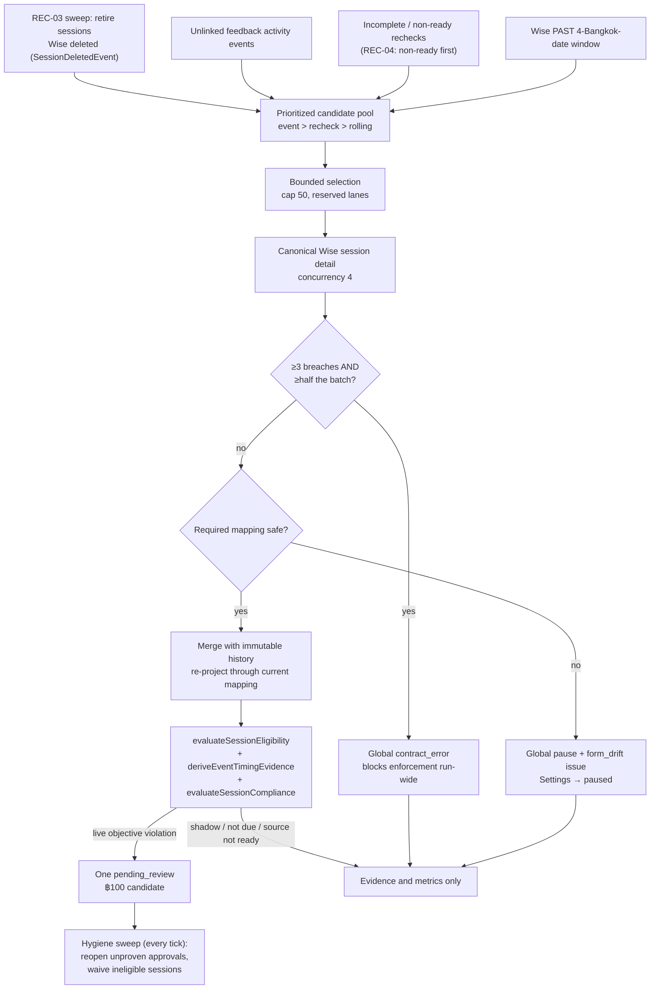
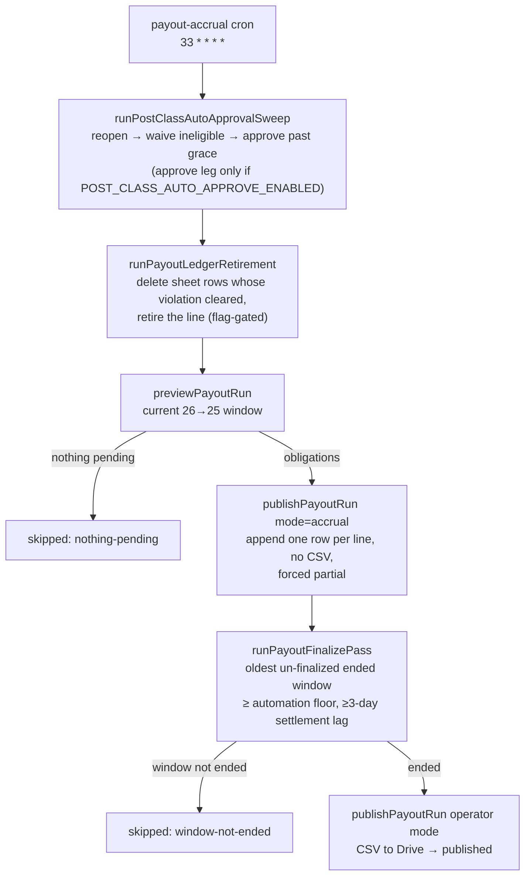

# Wise Post-Class Feedback Tracking

**Status: stable** — the payout write path inside it is **stable (writes flag-gated by `POST_CLASS_PAYOUT_WRITES_ENABLED` / `POST_CLASS_AUTO_APPROVE_ENABLED`)**.

## Purpose

Post-Class Feedback Tracking replaces the spreadsheet-based comment queue with a durable, capability-gated admin workspace at `/post-class-feedback`. For every class Wise says ended, it reads the canonical Wise session detail, preserves every observed teacher-feedback version as immutable evidence, evaluates an objective deadline/content policy, raises at most one ฿100 deduction candidate per session, and carries decided deductions into an app-owned tab of the finance payout workbook through a lease-fenced, append-only ledger writer.

Its users are four roles, all allowlisted admins holding fresh Postgres capability grants (`src/lib/post-class-feedback/access.ts:11`-`16`): a **viewer** inspecting evidence, a **reviewer** deciding deductions, a **finance** user running the payout handoff, and an **access manager** owning mapping, mode, and role configuration. Five further "users" are system actors, each leaving the same audit rows a human would, and each gated differently:

| Actor | What it signs | Gate |
|---|---|---|
| `system:post-class-auto-approve` (`payout-config.ts:197`, bound at `auto-approval.ts:33`-`36`) | the unattended approve sweep (`:96`) **and** the reopen sweep (`:215`) | only the approve leg is behind `POST_CLASS_AUTO_APPROVE_ENABLED`; the reopen sweep is deliberately not (`payout-config.ts:158`-`162`) and runs on every collection tick via `runPostClassDeductionHygiene` (`auto-approval.ts:266`-`282`, called at `sync-post-class-feedback/route.ts:29`) |
| `system:post-class-ineligible-waive` (`auto-approval.ts:117`-`120`) | waivers on sessions that lost eligibility | ungated — waiving releases a money claim (`:113`-`116`) |
| `system:post-class-payout-accrual` (`payout-accrual.ts:42`-`47`) | the hourly accrual/finalize ledger pass | the cron itself is always scheduled; what `POST_CLASS_PAYOUT_WRITES_ENABLED` gates is its sheet writes, resolved through `resolveWriteTarget({ forWrite: true })` before the run is even created (`payout-run.ts:158`-`161`, called at `:723`) |
| `system:post-class-reassess` (`reassess.ts:45`-`48`) | waivers a policy replay cleared | ungated; `apply` defaults to `false` at the route |
| `system:post-class-feedback` (`repository.ts:1874`, `:2062`) | candidate creation and the form-drift pause | ungated — it is the collector's own signature |

It is the second-largest subsystem in the codebase by table count — **32 `post_class_*` tables**, behind University Admissions' 36 `admissions_*` and ahead of Competitor Intelligence's 16 (counted from the `pgTable("<prefix>` declarations in `src/lib/db/schema.ts`) — because it holds four separable concerns behind one workspace: source collection, compliance assessment, decision, and an external money path.

Three boundaries define what it is not:

- **Read-only toward Wise.** It never creates, edits, backdates, or submits feedback, and never mutates a Wise session (`src/lib/db/schema.ts:3137`-`3140` states the rule at the top of the table block). The original feedback Google Sheet is requirements reference only; there is no production fallback to it.
- **No Payroll write.** Nothing is written into the Payroll subsystem. The only outbound financial artefact is a signed row appended to the app-owned deductions tab of the master payout workbook (`payout-writer.ts:8`-`16`), plus a CSV in Drive. Payroll is read once, as a payability signal (`repository.ts:2162`-`2180`).
- **Prospective activation, decision-gated money.** Enforcement starts in `shadow`; an access manager must clear the setup checklist and choose a current-or-future effective instant, and sessions ending before that instant are assessed but can never produce a deduction (`settings.ts:40`-`45`, `:186`-`193`). Money then moves only on a recorded decision: a human reviewer's, or — while `POST_CLASS_AUTO_APPROVE_ENABLED` is the exact string `true` — the audited auto-approve actor's (`payout-repository.ts:131`-`145`).

## Conceptual data model

All 32 tables live in the `core` schema domain and are declared in `src/lib/db/schema.ts` from `postClassEnforcementWindows` (line 3141) through `postClassPayoutRollOutcomes` (line 3927 onward). **Columns, types, indexes, constraints, and the ER diagram are in the reference and are not restated here:** [docs/reference/database/erd-core.md § 7 Post-class feedback](../reference/database/erd-core.md), the per-table inventory in [docs/reference/database/index.md](../reference/database/index.md), and the enum value sets in [docs/reference/database/enums.md](../reference/database/enums.md).

Conceptually the tables group into six areas:

| Area | Tables | What it holds |
|---|---|---|
| Policy and access | `post_class_enforcement_windows`, `post_class_settings`, `post_class_field_mappings`, `post_class_access_grants`, `post_class_config_audit_log`, `post_class_digest_recipients` | The single settings row, the versioned Wise question→field mapping, prospective enforcement windows (an open window has a null end), per-email capability grants, digest recipients, and a configuration audit trail that also carries finance-period, AI-review, shadow-review, and payout-lease events. Append-only is enforced in Postgres, not in application code: the `pc_config_audit_immutable` trigger fires `BEFORE UPDATE OR DELETE` and raises `% is append-only` (`drizzle/0055_post_class_feedback.sql:571`-`576`, `:607`-`609`). |
| Source collection | `post_class_sync_runs`, `post_class_sessions`, `post_class_session_participants`, `post_class_feedback_versions`, `post_class_feedback_event_links`, `post_class_assessments`, `post_class_source_issues` | One row per Wise session in scope with its source/content/timing/deduction state plus two lifecycle facts (`source_status_before` for REC-01 restore, `wise_deleted_at` for REC-03); every observed feedback submission as an append-only version; the activity-event associations that prove timing; one assessment per evaluation; and fail-closed source defects keyed by fingerprint. |
| Notifications | `post_class_notification_runs`, `post_class_notification_deliveries`, `post_class_notification_items`, `post_class_notification_attempts` | Grouped, idempotent tutor reminders and admin digests with a durable per-attempt retry trail. Retained, but nothing creates a run on a schedule — see *Parked reminders* below. |
| AI | `post_class_ai_runs`, `post_class_ai_concerns`, `post_class_ai_reviews` | De-identified advisory runs keyed by a request hash, per-dimension concerns, and the human confirm/dismiss decisions recorded against them. |
| Finance | `post_class_finance_periods`, `post_class_deductions`, `post_class_deduction_actions`, `post_class_deduction_offsets` | Calendar-month open/closed gates; **at most one deduction per session, ever** (unique `session_id`, `schema.ts:3589`); an append-only action ledger; and immutable compensating offsets. |
| Payout runs | `post_class_payout_runs`, `post_class_payout_tutor_names`, `post_class_payout_run_lines`, `post_class_payout_adjustments`, `post_class_payout_exceptions`, `post_class_payout_roll_runs`, `post_class_payout_roll_outcomes`, `post_class_tutor_payout_sheets` | One lifecycle per 26th→25th window; the exact ledger identity strings for each tutor (copied, never constructed); negative deduction lines that can be **retired** (`retired_at`) when their sheet row is deliberately removed; positive correction obligations with a terminal `superseded` state; reviewed blockers; the resumable per-workbook date-roll audit; and the active tutor-workbook registry the maintenance scripts drive. |

Two notes that matter for reading the code:

- `post_class_tutor_payout_sheets` and `post_class_payout_tutor_names` are **not** two generations of one thing. `post_class_payout_tutor_names` holds the ledger identity strings the runtime money path matches on (`payout-repository.ts:328`-`340`); `post_class_tutor_payout_sheets` is the **active registry of tutor workbooks** used by the offline maintenance path. Three offline scripts touch it, but only one goes through the registry helper: `scripts/roll-payout-workbook-dates.ts:387` calls `loadActivePayoutWorkbookRegistry` (`payout-repository.ts:2028`-`2039`), while `scripts/repoint-payout-workbook-formulas.ts:66`-`68` selects the active rows straight off `schema.postClassTutorPayoutSheets`, and `scripts/inventory-payout-workbooks.ts:295`-`309` rewrites the table directly inside a transaction (deactivate every row, then upsert on `canonicalKey`). The schema JSDoc on `postClassTutorPayoutSheets` still says "nothing reads or writes it" — that comment is stale, and it is the origin of the same claim in the database reference (tracked as DEAD-13 in [docs/OPEN-QUESTIONS.md](../OPEN-QUESTIONS.md)).
- The feature also adds an optional `primary_email` to the shared `tutor_contacts` table (`settings.ts:279`-`354`). Other features keep their previous onsite/online selection unless they explicitly opt in.

Migrations: `0055_post_class_feedback.sql` creates the 24-table base; `0057` adds `post_class_payout_runs`, `post_class_tutor_payout_sheets`, `post_class_payout_run_lines`; `0058` adds `source_status_before`; `0059` adds `post_class_payout_tutor_names`; `0060` adds adjustments, exceptions, roll runs, roll outcomes; `0061` adds `source_anchor_fingerprint`; `0062` adds `wise_deleted_at`; `0068_payout_adjustment_superseded.sql` widens the adjustment status check to admit `superseded`. `migration.test.ts` pins `0055` and `0057`–`0062` (`__tests__/migration.test.ts:4`-`31`) but not `0068`.

## API surface

Thirteen admin endpoints under `/api/post-class-feedback/**`, each guarded by `requirePostClassCapability(...)` — an Auth.js session **plus** a capability re-read from Postgres on every request (`access.ts:153`-`176`). **Methods, paths, request/response contracts, and status codes are in the reference and are not restated here:** the `post-class-feedback` rows of [docs/reference/api/index.md](../reference/api/index.md) and the per-endpoint contracts in [docs/reference/api/post-class-feedback.md](../reference/api/post-class-feedback.md), which carries all thirteen workspace contracts alongside the six internal cron routes. Where that page and the handlers under `src/app/api/post-class-feedback/` disagree, the handlers are the tie-breaker.

What the thirteen let each capability do:

- **`viewer`** — `GET /api/post-class-feedback` (workspace payload for a Bangkok date range, shaped per capability) and `GET /api/post-class-feedback/sessions/[sessionId]` (one session's immutable version history, exact answers, and the Wise event timeline that decided its verdict).
- **`reviewer`** — `POST …/review` decides exactly one deduction at a time (including the INC-260829 re-charge of a waived item) and `POST …/ai-review` confirms or dismisses exactly one AI concern with a required note. There is no bulk path in either.
- **`finance`** — `POST …/finance` moves, processes, or reverses one decided deduction; `POST …/finance-periods` gates a calendar month; and `POST …/payout-runs` is the whole payout handoff behind one multiplexed route, spanning a read-only preview, the irreversible publish, a CSV-only retry, a read-only ledger reconciliation, and post-close exception resolution. Every payout response carries a `writeCapability` projection of the kill switch and target so the UI can explain a disabled publish before the operator reaches the confirmation (`payout-runs/route.ts:84`-`103`).
- **`access_manager`** — `POST …/sync` in two modes: collection (manual rolling collection or a bounded date-range backfill) and **reassessment** (re-decide stored verdicts from persisted evidence with zero Wise traffic; `apply` defaults to `false` so the dry run is the default, `sync/route.ts:19`-`46`); `PATCH …/settings` (mode, effective date, Wise field mapping, digest recipients); `POST …/shadow-review`; `PATCH …/access` (one capability for one allowlisted admin); `PATCH …/tutor-emails` (a tutor's `primary_email`); and `POST …/test-email` (part of the parked email subsystem).

The exact action literals and their per-action bodies belong to the reference, not here — see [docs/reference/api/post-class-feedback.md](../reference/api/post-class-feedback.md).

Six internal routes are `CRON_SECRET`-guarded and wrapped in `withCronInvocationAudit`. **Job keys, cron expressions, budgets, and recovery behaviour are in the reference:** [docs/reference/crons.md](../reference/crons.md) (entries 8, 9, 10, and *The three parked post-class routes*) and [docs/reference/api/internal-crons.md](../reference/api/internal-crons.md).

| Route | Purpose | Schedule |
|---|---|---|
| `GET /api/internal/sync-post-class-feedback` | Rolling four-day collection, then AI review, notification retries, and the **deduction hygiene sweep** (reopen unproven approvals, waive deductions on sessions that became ineligible) under `Promise.allSettled` (`route.ts:22`-`30`). | `13,43 * * * *` |
| `GET /api/internal/post-class-feedback-backfill` | Drains history: works the oldest still-unreconciled window, or an explicit range. | `23,53 * * * *` |
| `GET /api/internal/post-class-feedback/payout-accrual` | Accrual pass (sweep → retirement → append in `accrual` mode), then the finalize pass, which no-ops until a window has ended and settled (`route.ts:12`-`17`). | `33 * * * *` |
| `GET /api/internal/post-class-feedback/reminder-day-after` | Day-after tutor reminder checkpoint. **Parked.** | none |
| `GET /api/internal/post-class-feedback/reminder-deadline` | Deadline-day tutor reminder checkpoint. **Parked.** | none |
| `GET /api/internal/post-class-feedback/admin-digest` | Admin digest email. **Parked.** | none |

The three scheduled routes have `vercel.json` entries (`vercel.json:32`-`42`). The three parked routes carry `schedule: null`, `manualOnly: true`, and `dangerous: true` in the cron registry so Data Health never reports them late but still lets an access manager run them deliberately behind a confirmation label (`src/lib/data-health/cron-registry.ts:189`-`236`; the `access_manager` requirement is in `src/app/api/data-health/jobs/[jobKey]/run/route.ts:25`-`30`). The payout accrual keeps `dangerous: true` — the manual Run-now path stays confirm-gated even though it is scheduled (`cron-registry.ts:237`-`253`). The Data Health job runner dispatches five of the six keys — collection (`src/lib/data-health/run-job.ts:104`), digest (`:121`), both reminders (`:126`), and payout accrual (`:141`) — but has **no** branch for `post_class_feedback_backfill`, so a targeted drain cannot be started from Data Health.

The two Wise read contracts the collector uses (`fetchWisePastSessionsByBangkokDate`, `fetchWiseSessionDetail`; `src/lib/wise/fetchers.ts:153`, `:187`) are documented in [docs/reference/wise-api.md](../reference/wise-api.md). Payout and auto-approval environment variables are in [docs/reference/env.md](../reference/env.md) § 2.4.

## UI

One page: `src/app/(app)/post-class-feedback/page.tsx`. It is a Server Component that requires a session and the `viewer` capability, redirecting to `/login` or `/` otherwise, and renders the client shell inside `<Suspense>` (`page.tsx:7`-`27`). Because the capability is read fresh from Postgres per request, `src/middleware.ts:39`-`46` deliberately exempts the page and its API namespace from the legacy JWT `allowedPages` prefix check — the coarse JWT list must not be able to override a live grant. That exemption is **untested**: `src/__tests__/middleware.test.ts` never exercises either path against a restricted `allowedPages` list, and mentions post-class feedback only once, in the public-route list for the backfill cron (`:355`). The nav entry is *Class Feedback* under *Scheduling & Tutors* (`src/lib/navigation/tools.ts:148`-`154`).

`src/components/post-class-feedback/post-class-feedback-workspace.tsx` holds the shell: a Bangkok date range that **defaults to the current 26th→25th payout window** (`:118`-`120`), a mode badge, a setup banner, a six-cell KPI band, a 60-second background refresh (`:191`), and up to six tabs. Restricted tabs are **omitted from the DOM**, not merely disabled (`:338`-`347`), and the **Deductions** and **Settings** tabs fall back to Operations when a refreshed payload's capabilities no longer allow them (`:195`-`202`). That effect has no `payouts` branch, so a user sitting on the Payouts tab who loses `finance` mid-session is not redirected; the tab itself refuses instead, rendering a *Finance access required* panel in place of every control (`payouts-tab.tsx:452`-`458`). The six tabs:

- **Operations** (`operations-tab.tsx`) — filterable session queue with objective evidence, source state, reminder state, AI concerns, exact feedback, immutable version history and the Wise event timeline (`session-detail-dialog.tsx`, `TimingEvidenceTimeline` at `:256`), and individual reviewer actions. It has a **Submitted by** column and filter (`:154`, `:300`) so a session an admin rescued can never read as the tutor having done the work.
- **Analytics** (`analytics-tab.tsx`) — headline KPIs, tutor ranking, length statistics, concerns, and per-tutor **Tutor wrote / Admin rescued / Auto-filled** counts (`:123`-`125`).
- **Deductions** (`deductions-tab.tsx`) — shown only with `reviewer` or `finance`. A live decisions feed with a **Decided** column (`:250`), a ledger hint keyed on `payoutLedgerState` — *Ledger verified* / *Publish required* / *Row removed from ledger* / *Netting pending* (`:286`-`292`) — and a **Reinstate** control rendered on every `waived` row (`:321`-`331`), disabled only by capability or an in-flight submit. Its "allowed only when the original ledger row was removed" text is a tooltip, not the gate: the rule is enforced server-side in `applyPostClassReviewAction`, which refuses while a live written line exists, while a previous write is uncertain, or once the deduction's payout window is closed (`actions.ts:611`-`634`). Individual decisions only (`:204`); no bulk actions.
- **Payouts** (`payouts-tab.tsx`) — `finance` only. Read-only preview, exact-tutor **canary** (`:498`), **Verify sheet** (`:524`), explicit publish confirmation with a written reason (`:657`-`700`), CSV-only retry (`:724`), and post-close exception resolution (`:808`). The write kill switch and target are rendered before confirmation and a banner explains why writes are disabled (`:633`-`638`).
- **Audit** (`audit-tab.tsx`) — configuration, AI-review, deduction, finance, reminder, and source history.
- **Settings** (`settings-tab.tsx`) — `access_manager` only. Six numbered cards: launch control (mode, effective date, shadow/rolling sync, bounded backfill, shadow-review confirmation), access roles, tutor reminder emails, Wise form mapping, admin digest recipients, and finance periods (`:94`, `:255`, `:343`, `:366`, `:403`, `:477`), plus a sticky setup checklist (`:524`).

A persistent "Setup required" banner stays until four items complete: Wise field mapping healthy, reviewer/finance/access-manager coverage present, shadow review confirmed, and enforcement live (`src/lib/post-class-feedback/dashboard.ts:752`-`757`). Email relay, digest recipients, and tutor-email coverage were removed from that list when outbound email was parked (`:749`-`751`), and the payout handoff is deliberately **not** an activation item — the pinned Google account's Sheets/Drive readiness is reported to finance users separately (`:759`-`768`, `:778`-`785`).

## Data flow

A scheduled collection run:

Layer by layer, a request or run moves: **Wise client** (`fetchWisePastSessionsByBangkokDate`, `fetchWiseSessionDetail`) → **parser** (`wise.ts` — mapping resolution, teacher-profile filtering, version hashing) → **pure policy** (`policy.ts` — eligibility, content, deadline, timing) → **repository** (`repository.ts`, `payout-repository.ts` — persistence, locks, restores) → **orchestrator** (`sync.ts`) → **routes** → **dashboard projection** (`dashboard.ts`, `detail.ts`) → **client tabs**.

Every candidate is fetched and parsed **before** any deduction candidate is persisted (`sync.ts:695`-`746`), so form drift is a true run-wide circuit breaker even when detail requests complete out of order.

The money path is a separate hourly loop:

`preview` is read-only and returns a deterministic token; `publish` recomputes the same fingerprint under the finance lock, claims a durable 15-minute lease, appends one row at a time, persists each outcome immediately, and finalizes. Source sync and payout publication are bidirectionally fenced: a running collector blocks lease acquisition (`payout-repository.ts:796`-`804`) and a live payout lease defers new collection (`repository.ts:770`-`784`) and blocks source persistence mid-run (`repository.ts:295`-`321`).

## Business rules & edge cases

### Non-negotiable boundaries

- One Wise session produces one obligation and at most one ฿100 deduction candidate, including group classes. The unique `session_id` index on `post_class_deductions` enforces it in the database and the insert is `onConflictDoNothing` on that key; the amount is `10_000` minor units (`repository.ts:1857`-`1879`).
- Source, content, timing, and deduction state are separate dimensions. A source problem can never become a content failure or a financial decision.
- Wise session detail is canonical. Persisted Wise activity events prioritize sessions for re-fetch and supply the only immutable timing/authorship evidence; they never substitute for the detail record.
- The system never generates substitute comments, never fabricates activity, and never invents an author or source timestamp (`workspace-contract.test.ts` asserts no "generate feedback/comment" control exists).
- AI is advisory. It cannot create, approve, waive, process, reverse, or otherwise transition a deduction.
- A payout run appends **new rows only** to the dedicated app-owned deductions tab. The one deletion path is the marker-located ledger retirement, which removes an app-owned row the system itself wrote and proves the removal by readback before recording it (`payout-retirement.ts:352`-`378`). Finance-owned source rows and tutor workbooks are never mutated.

### Eligibility and identity

`evaluateSessionEligibility` (`policy.ts:402`-`460`) proves eligibility in a fixed order, and every branch is fail-closed:

1. Cancelled evidence anywhere — meeting status, attendance status, or a status attached to any feedback submission — is ineligible.
2. Missed / no-show likewise.
3. The meeting status must be exactly `ENDED`.
4. Classroom `classType` outranks the session `type`, because `type` is frequently Wise's ONLINE/OFFLINE modality rather than a business classification. `OTHER` is excluded; trial/complimentary is excluded.
5. Positive consumed credits, or a read-only payout-eligibility observation from `payroll_payout_invoices` (`repository.ts:2162`-`2180`), prove billability.
6. **Both** signals known and neither positive → `non_billable`. Either signal unknown → `ambiguous` / `billing_evidence_missing`, which becomes `source_status = 'unavailable'` and drops the row from the denominator rather than guessing (`sync.ts:876`-`877`).

An ambiguous canonical tutor resolution sets `identity_review` instead (`sync.ts:874`-`875`). Resolution requires exactly one identity group in the active snapshot, and that group must be a single member or an onsite/online pair with exactly one online variant (`repository.ts:2097`-`2160`). Group sessions remain one obligation; participant rows retain all students for display and payout matching.

A session can lose eligibility after a candidate was raised (cancelled or marked no-show in Wise later). The hygiene sweep waives such `pending_review` deductions automatically with the eligibility reason as the note and `class_cancelled` as the category when Wise says cancelled (`auto-approval.ts:132`-`170`); this leg is not env-gated because waiving releases a claim (`:113`-`116`).

### Wise evidence and immutable history

`parseWisePostClassSession` accepts only submissions whose `profile` is exactly `teacher` after case normalization (`wise.ts:417`-`418`). For every version it retains the Wise submission id when present, a content hash over the canonicalised raw answers (order-independent, `:256`-`272`), exact raw answers plus their mapped fields, the source timestamp and its kind, the observation time, actor id/name, and `manual | auto | unknown` provenance derived from the linked activity event (`:311`-`348`).

Timestamp trust is deliberately narrow: a Wise submission can mutate in place, so only an explicit `updatedAt` is treated as trustworthy timing evidence; a bare `createdAt` is retained but marked untrustworthy (`wise.ts:339`-`343`).

Three merge rules keep history honest:

- **Mutable-edit demotion.** If a submission id already has a stored version with a different content hash, a newly observed version whose only timestamp is `created` is demoted to untrustworthy, so an edit cannot inherit an earlier date (`sync.ts:318`-`325`).
- **Deletion is real.** Historical versions stay as immutable audit evidence, but only versions present in the current canonical detail govern content (`sync.ts:332`-`338`, `:827`-`836`).
- **Wise's clock only (INC-260829).** `compareVersions` orders versions by Wise's `sourceCreatedAt`; a version Wise gave no time sorts after every Wise-timed version, and our `observedAt` is only a tiebreak — an ingestion instant must never outrank a Wise instant (`policy.ts:467`-`490`).

Historical answers are re-projected through the *currently configured* mapping on every run, so an access manager can repair a mapping and reassess old evidence without mutating preserved Wise source (`sync.ts:818`-`825`).

### Timing and authorship from Wise activity events

Session detail alone establishes neither *when* feedback was written nor *who* wrote it: Wise rarely returns `updatedAt`, and an admin submitting on a tutor's behalf still writes `profile: "teacher"`. The persisted `SessionFeedbackSubmittedEvent` stream is the only immutable source for both. Wise emits the auto-submission flag at `payload.session.autoSubmitted` and omits the actor object entirely for auto-submissions. The projector's own comment records that no production row has ever carried a submission id — a production-data observation the repository cannot itself prove — which is why **event-to-submission binding is not relied on for timing**; timing evidence is correlated to a session instead (`events.ts:57`-`92`).

The parser does still attempt an event→submission match, but only to derive *provenance*, and only where the match is unambiguous: `eventForSubmission` filters to events carrying the exact submission id, keeps those within ±5 minutes of the submission's own timestamp, and returns one only if a single event wins outright — a tie is `null`; with no id-matched event it falls back to a lone event within ±5 minutes (`wise.ts:274`-`304`). An unmatched or ambiguous event leaves provenance `unknown` (`:306`-`309`).

`deriveEventTimingEvidence` (`policy.ts:357`-`400`) applies four steps:

1. A qualifying event is any event Wise did **not** auto-submit. `autoSubmitted` wins over the actor role, since an auto event carries no actor (`policy.ts:327`-`333`). **D-EVT-04 — the actor role is not an authorship gate** (`:341`-`350`): Wise stamps `actorRole` from the *account's* role, not from who wrote the text, so a tutor who also holds an admin account is recorded as `ADMIN`; gating on `TEACHER` discarded genuine pre-deadline submissions and proved lateness against them. `submitterRoles` still records every role observed, so authorship stays auditable without changing the verdict.
2. The earliest qualifying event at or before the deadline proves `on_time`.
3. No qualifying event, with the deadline inside event coverage, proves `late`.
4. **Coverage floor (D-EVT-01)** — if the deadline predates the oldest persisted feedback event, absence proves nothing and timing stays `unknown` (`policy.ts:381`-`382`, floor read once per run at `repository.ts:1121`-`1128`). Without this a historical backfill would manufacture universal non-compliance for every session predating the event store.

Event evidence outranks the mutable submission timestamps and, like any newly discovered pre-deadline proof, can clear a prior violation lock (**D-EVT-02**, `policy.ts:601`-`606`). Timing and content stay independent: proving the tutor submitted on time does not excuse content that fails the objective bar (`:612`-`641`). The verdict's basis is persisted as a `timingEvidence` code — `wise_activity_event_before_deadline`, `wise_activity_event_no_tutor_submission` (kept verbatim after D-EVT-04 because it is on historical rows), `proven_before_deadline`, `wise_timestamp_unavailable`, `wise_created_at_late_lower_bound`, `wise_source_created_at`, `observed_state` (`repository.ts:714`-`741`) — plus the observed `submitterRoles`. The session detail dialog renders the same events with `countedAsProof` / `notCountedReason` from `eventProofOutcome` (`detail.ts:19`-`38`, applied at `:275`-`291`), which mirrors the policy so the two cannot drift.

The same `min(event_timestamp)` over non-auto events (`autoSubmitted IS DISTINCT FROM true`, NULL-safe) is what the payout line stores as `tutor_submitted_at` (`payout-repository.ts:184`-`190`), so the dashboard's Submitted column, the policy, and the sheet agree.

### Observation versus enforcement (D-EVT-03)

Assessment and enforcement are separate. A session ending before `policyEffectiveAt` is still assessed and scored, so historical timeliness is visible in Operations and Analytics — but `deductionCandidate` requires `enforcementMode === "live"` **and** `policyApplies` (`policy.ts:549`-`553`). A broken source or a `paused` feature suspends assessment outright (`:571`-`584`), which is why `evaluateSessionCompliance` cannot produce a candidate for any session whose `sourceStatus !== "ready"` — every downstream money gate relies on that.

### Deadline and objective compliance

The deadline is **23:59:59.999 Asia/Bangkok on the second calendar day after the final scheduled-end date**, weekends and holidays included; Thailand is permanently UTC+07:00, so the implementation is a direct `Date.UTC(..., day + 2, 16, 59, 59, 999)` (`policy.ts:302`-`320`).

Required fields are **topics**, **performance** (how the student did), and **improvement** (needs more work on). Homework and due date are stored and displayed but do not affect compliance (`types.ts:1`-`10`). **The content bar is the combined character minimum only** (business decision 2026-08-29, `policy.ts:266`-`271`): the three required fields together must total at least **300 raw Unicode code points** (`policy.ts:18`), counted with spaces and line breaks intact, and that count must be carried by at least one field of real (non-placeholder) language — 300 characters of repeated filler still fails (`all_fields_placeholder`). An **empty individual field is informational, never a violation by itself**: per-field ✓/✗ states remain visible in the review UI and per-version rows, but only `combined_characters:N/300` and `all_fields_placeholder` are persisted as an assessment's violating reasons and rendered as the payout reason (`policy.ts:242`-`300`).

`isPlaceholderFeedback` (`policy.ts:194`-`212`) rejects, in order: empty or punctuation-only text; the exact known placeholder set including Thai equivalents and a trailing-politeness variant; repeated known placeholders; low-diversity repeated text (unique-token ratio ≤ 0.25, or an exactly periodic compact unit — the Thai path, since Thai often has no word spaces); low-information gibberish (≤2 distinct letters, or one letter ≥85% of the text); and text containing no Latin or Thai characters at all. A "no improvement needed" statement is valid **only** if the same response also contains a positive next-step goal *and* a rationale (`policy.ts:206`-`208`).

Timing follows evidence, never inference (`policy.ts:516`-`771`):

- A compliant version with a trustworthy pre-deadline timestamp locks the session on-time; later deletion or weaker feedback cannot undo the lock. Locks are scoped to the exact policy version, mapping version, scheduled end, and deadline that produced them (`:536`-`547`).
- Compliant content without a trustworthy source timestamp is `unknown` — not backdated from its observation time. It earns adjusted compliance but not raw on-time compliance.
- A submission whose `createdAt` is after the deadline proves lateness even when untrustworthy for content, because it could not have contained on-time content (`versionProvesLate`).
- Past the deadline with no compliant provably-on-time version, the violation stands. A later compliant version is `remediatedLate` but still noncompliant unless a reviewer waives it.
- Not-yet-due sessions and any session whose source is not ready are outside the assessed denominator.

### Reassessment without Wise (policy replay)

A policy change can invalidate verdicts already written against evidence the system still holds. `reassessPostClassSessions` (`reassess.ts:82`-`221`) re-runs the same pure functions over persisted versions and the activity mirror with zero Wise traffic, defaults to revisiting `late` verdicts, and is verdict-only — it never rewrites identity, eligibility, participants, or content (`:20`-`37`). The previous violation lock is deliberately not loaded, because it was written by the rule being corrected (`:146`-`149`). A re-decision that clears an open deduction — by timing *or* by content (e.g. the char-count bar clearing a field-empty violation) — writes an assessment row keyed `reassess:…` (`:249`-`257`) and **waives** the deduction under `system:post-class-reassess` with a reason-scoped idempotency key; a deduction already written to the ledger is left for Finance (`:311`-`357`). The route defaults `apply` to `false` so the operator sees every change before any is written.

### Source safety and form drift

`SourceStatus` is one of `ready`, `unavailable` (Wise/auth/contract/billing evidence unusable), `form_drift` (a required Wise question missing or ambiguous), or `identity_review` (teacher not resolvable to one canonical tutor) (`types.ts:15`). The collector's precedence is form drift → global blocking issue → identity → billing ambiguity (`sync.ts:861`-`878`).

**Form drift is a run-wide circuit breaker.** The first drifted mapping records a blocking global issue and calls `pauseForFormDrift`, which closes the enforcement window, moves Settings to `paused`, and marks the mapping invalid under the finance lock and source fence (`sync.ts:774`-`800`, `repository.ts:2044`-`2089`). Recovery requires repairing the mapping (only while not `live`, `settings.ts:127`-`128`), a healthy shadow reassessment, a fresh shadow-review confirmation, and an explicit resume; sessions ending inside the paused interval stay outside enforcement rather than being penalized retroactively.

**CONTRACT-01 escalates on prevalence, not on first occurrence.** A run treats malformed detail payloads as a Wise contract change only when at least 3 breaches occur *and* they are at least half the batch (`sync.ts:50`-`56`, `:748`-`769`). One permanently malformed session would otherwise re-suspend the feature every 30 minutes forever, because a session that cannot be parsed never leaves the recheck queue. The per-session default scope in `safeWiseIssue` carries the same lesson: its comment attributes the change to a June 2026 reconciliation collapse in which ten unclassified per-session Wise 400s each fell through to a `global` default and demoted every eligible row (`sync.ts:429`-`441`). The incident is recorded only in that comment — the repository holds the fix, not the evidence.

**REC-01 — run-wide demotion is reversible, per-session demotion is not.** When a blocking global issue forces a row to `unavailable`, the observation carries `globalSourceDemotion: true` and `saveObservation` stashes the prior status in `source_status_before` (keep-first), so `completeSync`'s one-statement bulk restore heals the row on the next globally healthy run (`types.ts:308`-`315`, `repository.ts:834`-`845`). A per-session `unavailable` is a genuine first-hand observation and is never resurrected to a stale state.

**REC-02 — abandoned missing sessions.** A `session_not_found` issue older than a 7-day grace window stops being retried by any lane, while the issue row deliberately stays `open` and visible in Data Health (`repository.ts:36`, `:69`-`91`).

**REC-03 — sessions deleted in Wise.** Wise answers a detail fetch for a deleted session with HTTP 400 `Session not found!`, and such a session can never auto-resolve. Deletion is proven by a `SessionDeletedEvent` in the `wise_activity_events` mirror: a sweep at the very top of each run resolves the session's open issues and marks the row deleted and ineligible (`sync.ts:599`-`606`, `repository.ts:1276`-`1323`), and every candidate lane anti-joins on the same evidence (`:50`-`67`). Two deliberate design choices: deletion is a fact of its own (`wise_deleted_at`), **not** a `source_status` value, because every `source_status <> 'ready'` reader treats its subject as blocking and would park deleted sessions in the payout coverage denominator forever; and `deleted_in_wise` is deliberately absent from `KNOWN_INELIGIBLE_REASON_VALUES`, because that list feeds the one-terminal-row-per-run readmission lane and a deleted session has nothing to recover to (`types.ts:190`-`207`). Retired sessions are not counted into `sourceIssueCount`.

**REC-04 — non-ready rows first in the recheck lane.** A run-wide demotion resets every eligible row's `updated_at` to one instant, so an `updated_at`-only order let already-`ready` rows fill the cap forever; the lane now sorts `source_status = 'ready'` false-first so the demoted backlog drains (`repository.ts:983`-`990`).

### Collection, caps, and reconciliation

`DEFAULT_DETAIL_CAP = 50`, `BACKFILL_DETAIL_CAP = 400`, `DETAIL_CONCURRENCY = 4`, `ROLLING_WINDOW_DAYS = 4` (`sync.ts:40`-`49`). The larger cap is honoured **only** for a manual trigger that supplies both `startDate` and `endDate` and is not a reminder checkpoint (`sync.ts:572`-`577`); everything else is clamped to 50 so a routine run can never monopolise the Wise API.

Candidate lanes merge in priority order `feedback_event` → `incomplete_recheck` → `rolling_window` (`sync.ts:204`-`208`). Selection reserves bounded capacity for both the recheck and rolling lanes — `min(10, floor(cap / 3))` each — so a persistent activity-event backlog can accelerate discovery without replacing canonical reconciliation, while at least thirty priority slots remain at cap 50 (`sync.ts:262`-`298`). The pool is filtered for already-reconciled rows *before* the hard cap, otherwise recent reconciled sessions occupy all 50 slots and starve older missing-feedback rows (`sync.ts:662`-`671`).

A run is `partial` only when a blocking global issue, form drift, or a widespread contract breach makes the whole run untrustworthy — not when one row had messy data (`sync.ts:952`-`962`). `sourceIssueCount` still records every per-session issue honestly. The run metadata carries `globalSourceHealthy` and `mappingObservedHealthy` (the two flags the activation gate keys on) plus `readySessionCount`, `rollingSelectedCount`, and `rollingSavedCount` for recent-window readability (`sync.ts:988`-`1003`).

`windowCandidateCount` is measured on the filtered pool rather than on what the batch selected, because the question a backfill needs answered is "is any work left in this window", not "did this batch pick some of it up" (`sync.ts:681`-`686`); the backfill job treats zero as drained (`backfill-job.ts:83`-`96`).

The historical drain picks the oldest Bangkok date with an eligible, not-yet-`ready` session and walks forward four days, clamped to today; when nothing is unreconciled it returns `null` and the route reports `skipped: "nothing-unreconciled"` rather than failing (`backfill-window.ts:32`-`53`).

Concurrency is guarded by a partial unique index on `status = 'running'` plus a 20-minute stale-run reaper (`repository.ts:262`, `:747`-`800`); a second collector raises `PostClassFeedbackSyncAlreadyRunningError` → HTTP 409. A configuration change (settings, policy, or mapping version) mid-run throws `PostClassPolicySnapshotConflictError` and the run is discarded as a global `configuration_changed` issue (`repository.ts:280`-`346`, `sync.ts:446`-`449`).

### Metrics and analytics

The assessed denominator includes only eligible, source-ready sessions that became compliant or reached their deadline (`metrics.ts:15`-`25`).

- **Raw on-time rate** = proven on-time / assessed.
- **Adjusted compliance** = proven on-time + compliant-but-timing-unknown + waived, over the same denominator.
- Late remediation stays noncompliant unless waived.

Tutor ranking is lowest adjusted compliance first, then most unresolved violations, then canonical name; tutors with zero assessed sessions are dropped rather than ranked (`metrics.ts:34`-`42`). A reminder failure counts as terminal only after retry exhaustion (≥4 attempts) or an explicit stop (`metrics.ts:69`-`74`). The dashboard's `sourceHealth` badge counts only **global** blocking issues, because a per-session `session_not_found` for a deleted session can never resolve and would pin it at "degraded" forever (`dashboard.ts:724`-`740`).

### AI quality review

A model is invoked only when deterministic code marks a substantive version suspicious (`similarity.ts:108`-`158`): any required field under 50 raw characters; combined length 300–349; a required field matching a placeholder pattern; or ≥85% character-trigram cosine similarity to the same canonical tutor's prior 90 days (`ai.ts:227`-`231`).

Similarity input is Unicode-normalized, lowercased, whitespace-collapsed text with known names replaced. Before the request, student names become stable `[STUDENT_n]` placeholders and tutor names become `[TUTOR]`, matching full names, parenthetical-stripped names, and individual components, longest-first (`similarity.ts:32`-`72`). The OpenAI Responses request sets `store: false` (`ai.ts:70`), supports English/Thai/bilingual text, and asks only about vagueness, actionable detail, irrelevance, unprofessional tone, contradiction, and probable copying (`ai.ts:17`-`24`). The model defaults to `gpt-5.4-mini` and is overridable via `OPENAI_POST_CLASS_FEEDBACK_MODEL` (`ai.ts:297`).

A version the deterministic pass clears still gets a persisted `deterministic-only` run with `modelInvoked: false`, so the same healthy version cannot occupy the head of every bounded cron batch (`ai.ts:274`-`295`). Each concern is independently `pending`, `confirmed`, or `dismissed`; every confirm/dismiss requires a note, an expected version, and an idempotency key (`ai.ts:388`-`466`). A model failure is stored as an AI-run failure and never blocks objective compliance processing. Feedback text is never written into application logs or AI-run metadata, and `postClassFeedbackErrorResponse` refuses to serialize unknown error objects for exactly that reason (`api.ts:45`-`52`).

### Parked tutor reminders and admin digest

The delivery implementation is intact but **no new reminder or digest run is ever created on a schedule**: all three email routes have `schedule: null` and are `manualOnly` in the cron registry, and none has a `vercel.json` entry. The one scheduled survivor is the retry sweep — the rolling collector cron calls `processDuePostClassNotificationRetries()` under `Promise.allSettled` every 30 minutes — so the retry lane runs on time and finds nothing to retry, because nothing creates deliveries. Outbound email is also no longer an activation gate (`settings.ts:182`-`185`).

If restored, the design is two grouped tutor checkpoints — one the day after class, one on deadline day — plus an admin digest. Only the *dates* are in source: `reminderCheckpointBangkokDate` subtracts one Bangkok day for `day_after` and two for `deadline` (`sync.ts:147`-`153`). The times of day would come from `vercel.json` entries that do not exist. Each reminder route first reconciles the exact Bangkok class date and drains sequential 50-detail batches under an 8-batch / 9-minute budget; if the checkpoint cannot be drained, the route returns HTTP 503 and sends nothing (`reminder-job.ts:11`-`12`, `:42`-`48`; the routes' `!result.ready` branch). Reminders are enabled only when the mode is `live`, the mapping is valid, and no blocking global issue is open (`notifications.ts:167`-`173`).

Delivery rechecks current content and requires an observation no older than 20 minutes (`notifications.ts:394`, `:586`), mirrored by the collector's own checkpoint freshness default (`sync.ts:647`-`651`). A separate 20-minute threshold, `SENDING_STALE_MS` (`notifications.ts:40`), governs recovering an attempt stuck in `sending`. Transport is the Apps Script schedule-email relay shared with Classroom Assignments — a `primary` sender for the first attempt and a `backup` sender for retries (`notifications.ts:19`, `:175`-`177`, `:189`-`192`). Retries are one primary attempt then up to three backup attempts at 30 / 90 / 180 minutes (`:38`-`39`). Recipient resolution prefers `tutor_contacts.primary_email`; Wise-derived onsite/online addresses are accepted only when they collapse to one unambiguous address (`notifications.ts:200`+, `settings.ts:65`-`88`).

### Review and finance workflow

At the deadline, a source-ready objective violation inside a live enforcement window creates one `pending_review` ฿100 candidate with a `candidate_created` action row (`repository.ts:1857`-`1879`). If Wise later moves the canonical session end into a different Bangkok month, the pending candidate's default finance month is corrected with a `default_month_corrected` action rather than a second deduction (`:1761`-`1790`). There are no bulk decision actions.

Reviewer actions (`actions.ts:561`-`709`) are `approve`, `waive` (requires a note and one of **seven** categories — `wise_system_outage`, `incorrect_session_tutor_data`, `pre_approved_exception`, `tutor_emergency`, `duplicate_system_error`, `class_cancelled`, `other`, `actions.ts:25`-`33`), `reopen` an approved, unwritten item, and **`reinstate`** a waived item (INC-260829 re-charge). Reinstate is allowed only when every previously written row is provably **off** the ledger — a live written line blocks it, an uncertain (`pending`/`failed`) write blocks it, and the 26→25 window must not be closed (`:611`-`634`); the fresh row then plans under the next *generation* identity so unique indexes and markers cannot collide with the removed original (`payout-plan.ts:30`-`39`, `payout-master.ts:142`-`161`, `payout-repository.ts:197`-`208`).

Finance actions are `move`, `process`, and `reverse`, each protected by pure, independently tested invariants:

- A deduction can never move before its class month; a move must target a strictly later month than the class month and differ from the current assignment; `process` must target the month the deduction is already assigned to (`actions.ts:114`-`136`).
- Approval requires the governing finance period to be open, and an assigned period that cannot be verified is a hard error (`:96`-`112`).
- **`process` is not permitted until the corresponding payout line is durably written, verified, and still live** — a retired line does not count (`:144`-`153`, `payout-repository.ts:1445`-`1466`). The required order is approve → preview/publish → verify sheet → process.
- Before any decision, `assertPostClassDeductionCandidateStillActionable` re-proves the whole chain under row locks on the session and settings: session eligible, source `ready`, mapping valid, no blocking global issue, an assessment that is source-ready, live, in-policy, still an objective violation, and not compliant by either measure (`:155`-`185`, `:339`-`413`).
- Review and finance actions fail closed while the deduction's 26→25 window has a live publish lease, because the publisher releases the transaction lock before its irreversible Google append (`:213`-`254`). They also refuse to change an obligation whose append is *uncertain* (`pending`/`failed`) until a fresh publish re-reads the tab's markers (`:256`-`281`).
- Waiving a deduction whose row **is** live on the ledger records a positive `waiver` adjustment; reversing a processed deduction records an immutable offset plus a `reversal` adjustment (`:691`-`699`, `:849`-`855`). A correction is one immutable positive row in an open period with its own reason and reference — never an edit or deletion of the finance record.
- Approving after the payout run has been published demotes the run to `partial` so the next pass sees the new obligation; approving after it is **closed** raises one idempotent `post_close_late_approval` exception instead (`payout-repository.ts:1581`-`1639`).

Closing a finance month is refused while any approved deduction in that month is neither moved nor processed (`actions.ts:1005`-`1023`). Every mutation is capability-gated, audited, and protected by idempotency keys with payload-match checks and/or expected-version checks; finance-period transitions, deduction decisions, payout publication, corrections, exceptions, and date rolls all serialize under one advisory transaction lock (`finance-lock.ts:14`-`18`).

### Payout runs

Tutor pay uses a **26th-to-25th** Bangkok window. A run anchored to `2026-07` covers 26 June through 25 July inclusive (`payout-window.ts:44`-`52`). This is separate from the calendar-month finance periods, so one run legitimately spans two finance months.

A run selects approved deductions whose session ended inside the window, is `eligible`, source-`ready`, not deleted in Wise, not offset, and whose `decision_by_email` is a human — or, while the auto-approve flag is on, exactly `system:post-class-auto-approve` (`payout-repository.ts:99`-`160`). Pending review is not a decision; waived items are excluded.

**Live review + ledger verification.** The Deductions tab is a live decisions feed against the current payout window (workspace default range, 60-second refresh). The ledger hint keys on `payoutLedgerState` — `written` (a live, non-retired ledger row exists), `removed` (its row was written then deliberately removed), `none` (`dashboard.ts:578`) — and the server-side Process gate ignores retired lines, so a reinstated deduction correctly reads "Publish required" until its fresh generation row lands. **Verify sheet** (`verify_sheet`, finance capability, read-only — one Sheets read via `verifyPayoutSheet`, `payout-sheet-verify.ts:97`-`267`) compares every ledger row and correction against the live tab (present / absent / amount-changed / `netted-removed` for expected absences), lists human-approved-but-unpublished candidates, and rolls the result up per tutor. `POST_CLASS_PAYOUT_WRITES_ENABLED` deliberately does not gate it (`:20`-`25`); `scripts/report-payout-sheet-reconciliation.ts` is a thin CLI over the same engine.

**Coverage gates** (`payout-plan.ts:93`-`140`) come in two kinds. An open blocking global source issue and any `unprovenApprovedDeductions > 0` are **absolute** — no acknowledgement escape. Pending reviews, and a non-ready ratio above 2% of the window's eligible sessions (`:81`), are overridable only by echoing back the **exact** count the preview showed, plus a reason; a stale tab cannot wave through a number that has grown. The coverage denominator includes non-ready sessions even where billing evidence leaves eligibility unproven, and excludes only sessions Wise deleted (`payout-repository.ts:245`-`326`).

**Preview/publish contract** (`payout-run.ts:269`-`280`, `:681`-`954`; `payout-plan.ts:142`-`231`): `preview` is read-only and returns a deterministic token fingerprinting the anchor month, run version, exact coverage counts, candidate identities, and the optional exact canonical tutor filter. The rule `publish` enforces is that nothing in the operator's view may have moved since that preview — same token, same counts, same tutor scope, an explicit confirmation, and a written reason; the service re-checks all of it at `payout-run.ts:701`-`713`, and the field shapes themselves are the route's Zod body, documented in [post-class-feedback.md § `POST /api/post-class-feedback/payout-runs`](../reference/api/post-class-feedback.md#post-apipost-class-feedbackpayout-runs). The lease acquisition recomputes the snapshot under the finance lock, refuses while a source sync is running, and rejects any written line whose immutable payload has drifted (`payout-repository.ts:784`-`860`). The service then claims a durable `publishing` lease (15 minutes, `payout-repository.ts:59`) under a 10-minute external-write budget with quiescence before lease expiry (`payout-run.ts:71`-`88`), appends one line at a time, persists each outcome immediately, and rechecks the claimed source fingerprint after external writes (`payout-repository.ts:1347`-`1443`). A canary uses `tutorFilter=<exact canonical key>` and, being an operator-mode publish, may run only after the window ends (`payout-run.ts:716`-`720`). Its filter is persisted alongside the acting email, reason, preview token, coverage counts, and timestamp in the run's `publishAcknowledgements` record (`payout-repository.ts:926`-`940`), which the close gate reads back and refuses on when it is non-null (`:1794`-`1800`); the run itself stays `partial`, because `selectionComplete` is false whenever a tutor filter narrowed the selection (`:1214`-`1215`).

A run advances draft → publishing (lease held) → partial (canary, time-bounded pass, in-window accrual pass, or mixed outcome) → published (every required line written or retired, every adjustment written or superseded, no open exception, fingerprint still matching) → closed. A stale `publishing` lease is recovered to `partial` with an `expire_publish_lease` audit row on the next acquisition (`payout-repository.ts:862`-`900`).

**A persisted payout run line is always a negative deduction.** The database enforces `amount_minor < 0` (`schema.ts:3820`). A *correction* is never a run line: it is a row in `post_class_payout_adjustments` with `amount_minor > 0`, and `correction` appears only as a synthetic line kind in the CSV projection (`payout-run.ts:621`-`651`). An adjustment can be `pending`, `written`, `failed`, `exception`, or **`superseded`** — terminal, meaning the correction reached the ledger outside the system (the INC-260829 manual fix) or its source row was retired, so no pass may ever append it and it does not block close (`schema.ts:3834`-`3838`, `payout-run.ts:745`-`755`).

**The workbook is three tabs with three owners.** The externally refreshed source tab is read-only to the app; the app-owned deductions tab takes append-only A:H rows; a formula-backed composite `QUERY`-unions both, and tutor workbooks query only that composite (`payout-master.ts:5`-`11`). Tab names, workbook id, connected account, CSV folder, and the tutor-workbook inventory root are all required environment variables with **no** embedded production ids or account fallbacks (`payout-config.ts:1`-`5`, `:72`-`143`). Three sheet facts are asserted only by source comments — each carrying the phrase "verified against production" — and cannot be checked from the repository, because the workbook itself is external:

- Column C is historically mislabeled "Course name" and actually holds the student name (`payout-master.ts:20`-`21`).
- Both payout surfaces record class times in **UTC**, not Bangkok — reading them as Bangkok would shift every match by seven hours (`payout-master.ts:13`-`15`, `payout-sheet.ts:9`-`11`).
- A live session records its *actual* start, which is why matching carries a tolerance at all: the comment cites a 10:26 row against a class scheduled for 10:30 (`payout-master.ts:334`-`336`).

Rows are read with `UNFORMATTED_VALUE`/`SERIAL_NUMBER`, so dates and times arrive as Google serials; an app row copies the anchor cells exactly, because constructing date/time strings makes Sheets `QUERY` drop the row as a minority type (`payout-master.ts:421`-`444`).

Matching uses the exact mapped teacher identity, student, and UTC session time with a **±15-minute** default tolerance (`payout-master.ts:337`-`391`). Rows a previous publish appended are never anchors. A same-tutor, same-student row a whole number of hours away is reported as `clock_disagreement` rather than matched to the nearest row (`:358`-`369`, `:393`-`412`). Every app row carries a stable marker with **12** hexadecimal identity characters inside the Session name cell — 12 rather than 8 because a collision reads as "already written" and silently drops a real deduction (`payout-master.ts:42`-`47`). The publisher scans for that marker before appending, so a crash retry recovers a landed row instead of writing it twice; a duplicated marker on the tab is a hard error (`:248`-`262`). Each written line also records a durable anchor fingerprint over the source row's exact cells so a Finance re-paste that moves row numbers does not break reconciliation; a written line whose anchor is missing quarantines only its own tutor as an exception instead of failing the run (`payout-master.ts:264`-`305`, `payout-run.ts:354`-`418`).

Reviewed tutor identity overrides take precedence over nickname parsing and are usable only when the literal primary identity exists in the source ledger; the module never manufactures an online/onsite twin (`payout-tutor-mapping.ts:7`-`13`, `:50`-`66`). Four canonical keys are explicitly **blocked** until an exact ledger identity appears, and three ledger prefixes are explicitly **unassigned** (`:37`-`48`) — deliberate refusals to guess.

**Guardrails:**

- `POST_CLASS_PAYOUT_TARGET` must be `production` on a Vercel Production deployment and `scratch` on Preview; anything else throws (`payout-config.ts:115`-`123`).
- Missing target/account/folder/tab configuration fails closed with the exact missing variable names (`:103`-`108`).
- External money writes require `POST_CLASS_PAYOUT_WRITES_ENABLED` to equal the exact string `true` (`payout-config.ts:49`-`51`, enforced at `:126`-`130`). The finance UI shows this switch and the pinned account's Sheets/Drive grants before confirmation.
- The write switch gates runtime money rows, not workbook maintenance or the retirement pass (`payout-retirement.ts:205`-`209`). Maintenance scripts require a full-fleet preflight/readback and an explicit `--commit`; a dry run is the default.
- Google writes are paced at ~1.1 s per call against the 60/min per-user quota; read-heavy maintenance uses 2.1 s and the lease-bound date roll 1.5 s (`payout-writer.ts:27`-`61`). Appends are never batched, because a partially failed batch cannot say which rows landed (`:171`-`185`).
- Publish does not process a deduction, and switching writes off does not undo already-appended rows — rollback is a reviewed compensating correction or, inside the automation scope, a proven retirement.
- Drive uploads use the per-file `drive.file` scope rather than the restricted full `drive` scope, and translate Drive's 404-instead-of-403 behaviour into an explicit "share the folder as Editor" setup message (`drive.ts:6`-`10`, `:84`-`93`).

**Closing and repointing is CLI-only.** `closePayoutRun` is exported (`payout-run.ts:1023`-`1036`) but has no API or UI caller; `scripts/roll-payout-workbook-dates.ts` strictly closes one run against every close gate (`inspectPayoutRunCloseReadiness`, `payout-repository.ts:1738`-`1874`) and then rolls each validated tutor workbook's date window forward exactly once under a resumable, CAS-fenced roll lease. Dry-run is the default; commit requires an accountable actor and reason.

### Unattended charging (post-INC-260829 re-enable)

INC-260829 was an armed accrual cron converting the entire `pending_review` backlog into sheet writes with no human decision. The whole unattended pipeline now keys on `POST_CLASS_AUTO_APPROVE_ENABLED` being the exact string `true` (`payout-config.ts:150`-`168`): the approve sweep, the payout-candidate carve-out that admits exactly `system:post-class-auto-approve` as a decision-maker (`payout-repository.ts:131`-`145` — every other `system:*` actor stays excluded), and the ledger-retirement pass. Flipping the flag off instantly restores human-only approvals and planning; `POST_CLASS_PAYOUT_WRITES_ENABLED` remains the independent kill switch for every sheet write.

Scope is bounded twice (`autoChargeLowerBoundUtc`, `auto-approval.ts:51`-`57`): never before `PAYOUT_AUTO_CHARGE_FLOOR_BANGKOK` = `2026-08-26` (the start of the 2026-09 window; the INC-260829 backlog and the settled 2026-08 ledger stay human decisions, `payout-config.ts:199`-`205`), and never before the last-ended payout window's start, so months-late flags always fall back to the review UI.

**Approve sweep.** A `pending_review` deduction whose deadline is at least `POST_CLASS_AUTO_APPROVE_GRACE_HOURS` in the past (default 24; blank, non-numeric, or negative values fall back to 24; an explicit `0` is the deliberate charge-at-deadline mode, `payout-config.ts:170`-`190`) on a `live`-enforced, source-`ready` session inside scope is approved through `applyPostClassReviewAction` — so the finance lock, revalidation, period check, idempotency, and audit row are exactly a human approval's (`auto-approval.ts:69`-`110`). **Reopen sweep.** An `approved`, unwritten deduction whose session lost eligibility or source readiness is reopened (`:183`-`229`); it is not flag-gated because it restores safety, and it is what keeps `assertPayoutRunPublishable`'s hard `unprovenApprovedDeductions` gate at zero. **Ineligible waive** runs alongside (see *Eligibility*). Order per tick is reopen → waive → approve (`:239`-`257`); the reopen+waive half also runs on every collection tick as the hygiene sweep (`:266`-`282`).

**Ledger retirement (auto-un-charge, `payout-retirement.ts`).** Because charging is instant, evidence that arrives later and clears a violation must take the written row back **off** the ledger — by marker-located row deletion plus `retired_at`, never by netting a +฿100 correction (`:28`-`43`). Each tick retires live written lines inside scope whose deduction was waived or reversed, whose session became ineligible, or whose latest assessment on a source-ready session no longer finds an objective violation (`:95`-`164`). Deletes run in descending 50-row chunks; deletion is proven by readback before any line is retired; pending corrections on a retired line are superseded and written ones leave with the negative row; a hand-edited sheet amount is left untouched for Verify sheet to flag (`:285`-`290`); the pass stands down for a tick rather than fight a live publish lease (`:194`-`202`); and affected runs' versions are bumped so stale operator previews fail closed (`:413`-`417`). Retiring first is what keeps the no-netting invariant — a subsequent waive sees no live written line, so `createPayoutAdjustment` is never reached.

**Accrual and finalize passes (`payout-accrual.ts`).** The accrual pass runs the sweep, then retirement (non-fatal on failure), then publishes the current window with `mode: "accrual"`, which skips the window-ended guard, skips the CSV/Drive leg entirely, and forces `partial` so it can never mint `published` while the window is open (`payout-run.ts:689`-`700`, `:716`-`720`, `:903`, `:940`-`947`). The finalize pass targets the **oldest** un-finalized ended run at or after the automation floor (`payout-repository.ts:423`-`447`), so a window that fails to finalize keeps being retried however many months pass; only when none exists does it fall back to the window anchored to today's own calendar month — the only branch that can create a run row, which is what stops it minting an empty `published` run for a window the system never observed (`payout-accrual.ts:156`-`197`). Both branches see the clock shifted back by a **3-Bangkok-day settlement lag** (`:49`-`58`): the feedback deadline is 23:59:59 two days after the class date, so the last classes of a window can still produce brand-new proven violations through the 27th.

A window still un-finalized once its anchor month has passed — or with no run row at all for the most recently ended window — is surfaced by the cron watchdog as a synthetic `post_class_payout_window` job (`payout-window-health.ts:50`-`87`; `src/lib/internal/cron-watchdog.ts:91`-`103`). The check is gated on the accrual cron actually having a schedule and ignores pre-floor windows (`payout-window-health.ts:102`-`110`).

### Access model

Four database-backed capabilities, read fresh from Postgres on every request and deliberately **not** JWT claims (`access.ts:128`-`146`):

| Capability | Access |
|---|---|
| `viewer` | Operations, analytics, exact source feedback, immutable history, aggregate deduction/AI metrics, sanitized audit view. |
| `reviewer` | Viewer plus the deduction queue, AI-concern details, and individual decisions (approve / waive / reopen / reinstate). |
| `finance` | Viewer plus the approved/processed queue, payout preview/publish/verify/CSV/exception controls, and finance-period actions. |
| `access_manager` | Viewer plus manual sync/backfill/reassess, mapping, mode, access, tutor-email, digest-recipient, email-test, and shadow-review settings; the only capability allowed to Run-now a `post_class_feedback*` job from Data Health. |

Any action capability implies `viewer`, so nobody can hold a workflow action while being unable to inspect its evidence; an empty set is still allowed when a manager revokes access entirely (`access.ts:61`-`72`). An explicit non-admin JWT role (currently `teacher`) fails closed with 403 even if a grant exists; a legacy session with no role claim falls back to the fresh grant (`access.ts:163`-`168`).

Grants can be given only to existing `admin_users`. Two safeguards are pure and independently tested: a manager cannot remove their own `access_manager` capability (another manager must), and the last manager can never be removed (`access.ts:91`-`126`). The replacement transaction takes an advisory lock on the role matrix plus a key-share lock on the two `admin_users` rows, inserts new grants before deleting obsolete ones to avoid a transient last-manager gap, and checks the client's expected version **inside** that lock (`access.ts:219`-`379`).

Reviewer, finance, and access-management payloads are assembled separately; a plain viewer never receives individual AI concerns, the deduction queue, finance periods, the role matrix, tutor emails, form-mapping values, or digest-recipient addresses (`dashboard.ts:126`-`128`, `:770`-`800`; `detail.ts:169`-`183`).

### The shadow-review activation gate

`classifyPostClassShadowReviewEvidence` (`shadow-review.ts:143`-`314`) judges the newest successful sync run that matches the current policy and mapping version *and* finished after the mapping was last edited — version and freshness decide *which* run to judge, not how good it is (`:101`-`118`). It reports every condition, passed or not, so the blocking reason is a durable checklist rather than one sentence.

**Absolute conditions:** a candidate run exists; `globalSourceHealthy` and `mappingObservedHealthy` on that run (the latter is what proves the *current* mapping parsed a real Wise payload); zero open blocking **global** source issues queried live at gate time; non-empty detail/session/assessment counts; and **a minimum sample of 20 recent eligible sessions** (`MIN_RECENT_SAMPLE`, `:34`, condition at `:235`-`243`). Missing metadata fails closed — the remedy is one fresh shadow sync. `recent_sample` is not in `ACKNOWLEDGEABLE_KEYS`, so there is no way to talk past a small sample (`:128`-`131`, `:290`-`305`).

**Acknowledgeable conditions — exactly two:** readability and resolvability, both required at 80% (`:26`-`28`). Below either bar an access manager may proceed only by echoing the exact server-computed total with a reason, both recorded in `post_class_config_audit_log` (`settings.ts:356`-`410`). This mirrors `assertPayoutRunPublishable`, which gates the actual movement of money the same way.

Both rates are **scoped to the trailing 4-day collector window** (`shadow-review/route.ts:17`-`18`, `:54`-`56`), because the event and recheck lanes carry no lower date bound and a run routinely observes months-old backlog (`shadow-review.ts:228`-`233`). Resolvability is read from persisted state (`loadPostClassRecentSessionReadiness`), while readability stays a run measure over the rolling lane (`rollingSavedCount / rollingSelectedCount`), because a session whose detail fetch failed never gets a row. A zero denominator on either side **blocks**; it is not a pass (`:247`-`255`).

### The activation gate

Moving to `live` requires, in `updatePostClassSettings` (`settings.ts:173`-`194`): all three required Wise fields mapped; reviewer, finance, and access-manager coverage present; a confirmed shadow review that was not invalidated by a mapping edit in the same request; and an effective instant that is not backdated by more than 60 seconds unless a prior live window already exists (`:40`-`46`). Editing the mapping clears `shadowReviewedAt` (`:244`) and is refused while live (`:127`-`129`). Once recorded, the live effective instant is immutable (`:167`-`170`). A date equal to today resolves to `now` rather than Bangkok midnight, keeping activation prospective (`:157`-`163`). Every mode change closes the open window and opens a new one (`:196`-`211`); pausing later creates a new excluded interval, and resuming reuses the immutable original boundary so sessions in the paused interval are never penalized retroactively.

## Tests

Thirty-eight suites under `src/lib/post-class-feedback/__tests__/` — ten of them `*.integration.test.ts` against ephemeral Postgres via `testcontainers` — plus six component suites under `src/components/post-class-feedback/__tests__/`, three route suites (`post-class-feedback/payout-runs`, `post-class-feedback/shadow-review`, and `internal/post-class-feedback-backfill`), and one Wise-fetcher suite. Highlights:

- **Policy** — `policy.test.ts`: eligibility precedence, English/Thai content rules, Unicode counts, placeholder and gibberish detection, the exact deadline boundary, timing-unknown, late remediation, the on-time lock, `feedbackSubmitterRole`, and `deriveEventTimingEvidence`.
- **Wise contract** — `wise.test.ts` and `src/lib/wise/__tests__/post-class-feedback-fetchers.test.ts`: required-field mapping, teacher-profile filtering, auto/manual provenance, mutable submission observations, exact answer retention, `PAST` pagination and the canonical detail request shape.
- **Collector** — `sync.test.ts` (planning and event-derived timing), `recheck-queue.integration.test.ts` (REC-02, REC-04), `backfill-job.test.ts`, `backfill-window.integration.test.ts`: four-date windowing, lane priority and reserved caps, source issues, form drift, contract-breach escalation, and idempotent resync.
- **Recovery** — `source-status-restore.integration.test.ts` (REC-01 run-wide demotion and one-statement recovery), `deleted-session-retirement.integration.test.ts` (REC-03), `recent-readiness.integration.test.ts`, `reassess.test.ts`.
- **Evidence and AI** — `events.test.ts`, `detail.test.ts`, `similarity.test.ts`, `ai.test.ts`: event projection, proof outcome, name redaction, trigram cosine similarity, deterministic trigger boundaries, and idempotent concern review.
- **Access, settings, gates** — `access.test.ts`, `settings.test.ts`, `shadow-review.test.ts` (including recent-window scoping and acknowledgement), plus the shadow-review route suite.
- **Finance and automation** — `actions.test.ts` (pure invariants), `auto-approval.test.ts` (flag, grace, scope floor), `auto-approval.integration.test.ts` (approve, ineligible-waive, reopen, sweep ordering), `metrics.test.ts`, `notifications.test.ts`, `reminder-job.test.ts`.
- **Payout** — `payout-config.test.ts`, `payout-window.test.ts`, `payout-window-health.test.ts`, `payout-tutor-mapping.test.ts`, `payout-sheet.test.ts`, `payout-master.test.ts`, `payout-plan.test.ts`, `payout-writer.test.ts`, `payout-workbook-operations.test.ts`, plus `payout-run.integration.test.ts` (publish lifecycle, source-anchor quarantine), `payout-repository.integration.test.ts` (candidate selection, lease, tutor identity, compensation, strict close fencing, CSV retry, audited date rolls), `payout-retirement.integration.test.ts`, and `payout-accrual.integration.test.ts` (accrual and finalize passes).
- **Migrations** — `migration.test.ts` asserts required tables, enums, indexes, append-only triggers, defaults, seeds, and each of `0055` and `0057`–`0062` in turn.
- **Routes and UI** — `payout-runs/__tests__/route.test.ts` and `payouts-tab.test.tsx` (action schemas, kill-switch exposure, explicit confirmation, canary scope, CSV retry, exception resolution); `workspace-contract.test.ts` (required views, separate reviewer/finance endpoints, no synthetic comment generator); `operations-filter.test.ts`; `deductions-tab.test.ts` (payout lifecycle, CSV export); `session-detail-dialog.test.ts` (Wise-times-only timeline); `feedback-ui.test.tsx`.
- **Cross-feature** — `src/lib/internal/__tests__/cron-watchdog.test.ts` covers the synthetic payout-window staleness entry; `src/__tests__/vercel-crons.test.ts` pins the three schedules; `src/app/api/data-health/jobs/[jobKey]/run/__tests__/route.test.ts` covers manual invocation and the `access_manager` gate; `src/components/layout/__tests__/app-nav.test.tsx` and `src/lib/navigation/__tests__/tools.test.ts` cover the nav entry.

## Open questions

1. **Is enforcement `live` in production, what is the effective instant, and is `POST_CLASS_AUTO_APPROVE_ENABLED` set?** The code defaults to `shadow` and to human-only approvals; both the enforcement mode (a `post_class_settings` row) and the flag (a Vercel env var) are runtime facts the repository cannot attest. The same applies to `POST_CLASS_AUTO_APPROVE_GRACE_HOURS` — the code default is 24, and `0` is a deliberate charge-at-deadline mode, but which value production carries is not in source.
2. **Are payout writes enabled and the target complete in production?** The accrual/finalize cron is scheduled hourly, but `POST_CLASS_PAYOUT_WRITES_ENABLED` must be the exact string `true` and the full `POST_CLASS_PAYOUT_*` set must be present for a tick to write anything. Whether the tutor-workbook fleet has been cut over to the composite tab is likewise operational.
3. **When does `PAYOUT_AUTO_CHARGE_FLOOR_BANGKOK` retire?** It is a hard-coded date (`2026-08-26`) that permanently excludes the 2026-08 window from automation and from the watchdog's staleness check. Once that window is closed by hand the constant is inert but still load-bearing in three modules; is the intent to leave it, or to remove the floor once the INC-260829 ledger is settled?
4. **Will outbound reminders and the admin digest ever be un-parked?** The full notification subsystem (four tables, `notifications.ts` at ~1,250 lines, grouped idempotent retries, the Apps Script relay transport shared with Classroom Assignments) is maintained but unreachable by schedule, and only the Bangkok *dates* of the checkpoints exist in code — the clock times would be a fresh product decision. It is either deliberately dormant pending a decision or a large body of code that should be retired.
5. **`post_class_tutor_payout_sheets` carries a stale "nothing reads or writes it" JSDoc.** The table is a live second workbook registry maintained by scripts (see *Conceptual data model*), but the schema comment (`schema.ts:3740`-`3744`) and `docs/reference/database/index.md` still call it superseded and unread. `docs/OPEN-QUESTIONS.md` DEAD-13 already records the correction, though its own citation (`payout-repository.ts:1933-1943`) has since drifted to `:2028`-`2039`. Should the two registries be merged, and which one is canonical? This document is not the place to fix the comment.
6. **None of the `POST_CLASS_*` variables are in the Zod env schema.** They are validated at the operation boundary rather than at module load, so the dashboard can report an incomplete payout setup without crashing boot (`payout-config.ts:65`-`70`). That is deliberate, but it means an operator typo surfaces as a failed publish rather than a failed deploy — worth confirming as the preferred trade-off. (The drift this question used to record against [`docs/reference/env.md`](../reference/env.md) § 2.4 is closed: that section now carries both `POST_CLASS_AUTO_APPROVE_ENABLED` and `POST_CLASS_AUTO_APPROVE_GRACE_HOURS` with `payout-config.ts` citations.)
7. **`migration.test.ts` does not cover `0068_payout_adjustment_superseded.sql`.** The `superseded` status is load-bearing for retirement, close readiness, and the accrual planner, but the only migration pinning it is unasserted. Oversight or deliberate?
8. **Blocked and unassigned payout tutor identities are hard-coded.** `PAYOUT_TUTOR_BLOCKED_KEYS` and `PAYOUT_TUTOR_UNASSIGNED_LEDGER_PREFIXES` name specific people in source (`payout-tutor-mapping.ts:37`-`48`). Should these move to `post_class_payout_tutor_names` so finance can maintain them without a deploy?
9. **`closePayoutRun` has no API or UI caller.** Closing a payout run is reachable only through `scripts/roll-payout-workbook-dates.ts`. Is close meant to stay a CLI-only, human-paced operation, or should the Payouts tab eventually expose it behind the same strict readiness gates?
10. **The Data Health job runner has no branch for `post_class_feedback_backfill`.** The route is scheduled and cron-audited, but `run-job.ts` cannot invoke it, so an operator cannot trigger a targeted drain from the UI. Intentional (use the query-parameter path with `CRON_SECRET`) or a gap?
11. **The reference drift on payout accrual is closed; the product question is not.** This item used to record [docs/reference/api/internal-crons.md](../reference/api/internal-crons.md) listing the route as unscheduled and naming `post_class_feedback_payout_accrual` among the job keys with no `run-job.ts` branch. Both are corrected at this revision: that page now carries the route at `33 * * * *` (`internal-crons.md:80`) and omits the key from the seven that return `404 {"error":"Unknown job"}` (`:59`), which matches [`run-job.ts:141`-`149`](../../src/lib/data-health/run-job.ts) and [docs/reference/crons.md § 10](../reference/crons.md#10-post-class-payout-accrual--apiinternalpost-class-feedbackpayout-accrual). What remains open is the decision itself: should the Data Health Run-now path stay available for a route that appends real ledger rows, behind nothing but the `dangerous` confirmation and the `access_manager` gate?

12. **The middleware capability exemption is untested.** `src/middleware.ts:39`-`46` lets `/post-class-feedback` and `/api/post-class-feedback/*` bypass the legacy JWT `allowedPages` check so a fresh Postgres grant cannot be overridden by a stale token claim — a deliberate widening of a security gate, with no test pinning it. A regression that narrowed or broadened those four prefixes would pass CI. Should `middleware.test.ts` gain a case, or is the exemption considered covered by `access.test.ts` at the capability layer?

13. **The missing `verify_sheet` contract is closed.** This item used to record `misc.md` documenting only four of the payout-runs route's five actions. All five (`payout-runs/route.ts:30`-`69`) are now carried by the dedicated page, `verify_sheet` included — with its request field, its `{ok, verification, writeCapability}` response, and the note that `POST_CLASS_PAYOUT_WRITES_ENABLED` deliberately does **not** gate it because the flag gates money rows, not reads ([post-class-feedback.md § `POST /api/post-class-feedback/payout-runs`](../reference/api/post-class-feedback.md#post-apipost-class-feedbackpayout-runs)).

_Verified against main@0cd1e81 (clean tree) on 2026-09-02._
