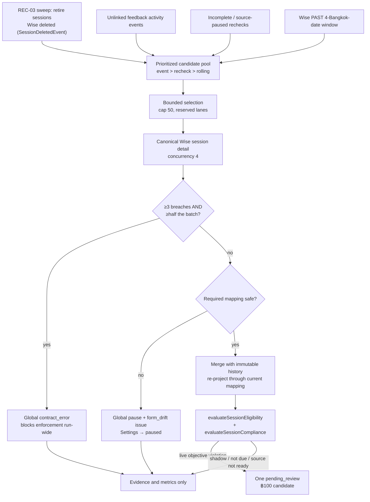

# Wise Post-Class Feedback Tracking

**Status: stable**

## Purpose

Post-Class Feedback Tracking replaces the spreadsheet-based comment queue with a durable, capability-gated admin workspace at `/post-class-feedback`. For every class Wise says ended, it reads the canonical Wise session detail, preserves every observed teacher-feedback version as immutable evidence, evaluates an objective deadline/content policy, and carries reviewed ฿100 deduction candidates through a feature-owned finance handoff and a Google-Sheets payout ledger.

Its users are four distinct roles, all allowlisted admins holding fresh Postgres capability grants (`src/lib/post-class-feedback/access.ts:11`-`16`): a **viewer** inspecting evidence, a **reviewer** deciding deductions, a **finance** user running the payout handoff, and an **access manager** owning mapping, mode, and role configuration.

It is one of the two largest subsystems in the codebase by table count — **32 `post_class_*` tables**, behind University Admissions' 36 `admissions_*` tables — because it holds four separable concerns behind one workspace: source collection, compliance assessment, human decision, and an external money path.

Three boundaries define what it is not:

- **Read-only toward Wise.** It never creates, edits, backdates, or submits feedback, and never mutates a Wise session. The original feedback Google Sheet is requirements reference only; there is no production fallback to it.
- **No Payroll write.** No deduction is written into the Payroll subsystem. The only outbound financial artefact is a payout run that appends to an app-owned tab in the finance payout workbook, and it is never automatic in the shipped configuration.
- **Prospective activation.** Enforcement starts in `shadow`. An access manager must clear the setup checklist and choose a current-or-future effective instant; sessions ending before that instant are assessed but can never produce a deduction (`src/lib/post-class-feedback/settings.ts:40`-`45`, `:191`).

## Conceptual data model

All 32 tables live in the `core` schema domain and are defined in `src/lib/db/schema.ts:3138`-`3949`. **Columns, types, indexes, constraints, triggers, and the ER diagram are in the reference and are not restated here:** [docs/reference/database/erd-core.md](../reference/database/erd-core.md) (post-class section) and the per-table inventory in [docs/reference/database/index.md](../reference/database/index.md).

Conceptually the tables group into six areas:

| Area | Tables | What it holds |
|---|---|---|
| Policy and access | `post_class_enforcement_windows`, `post_class_settings`, `post_class_field_mappings`, `post_class_access_grants`, `post_class_config_audit_log`, `post_class_digest_recipients` | The single settings row, the versioned Wise question→field mapping, prospective enforcement windows (an open window has a null end), per-email capability grants, digest recipients, and an append-only configuration audit trail. |
| Source collection | `post_class_sync_runs`, `post_class_sessions`, `post_class_session_participants`, `post_class_feedback_versions`, `post_class_feedback_event_links`, `post_class_assessments`, `post_class_source_issues` | One row per Wise session in scope with its source/content/timing/deduction state; every observed feedback submission as an append-only version; the activity-event associations that prove timing; one assessment per (session, policy version, mapping version); and fail-closed source defects keyed by fingerprint. |
| Notifications | `post_class_notification_runs`, `post_class_notification_deliveries`, `post_class_notification_items`, `post_class_notification_attempts` | Grouped, idempotent tutor reminders and admin digests with a durable per-attempt retry trail. Retained, but nothing creates a run on a schedule — see *Parked reminders* below. |
| AI | `post_class_ai_runs`, `post_class_ai_concerns`, `post_class_ai_reviews` | De-identified advisory runs keyed by a request hash, per-dimension concerns, and the human confirm/dismiss decisions recorded against them. |
| Finance | `post_class_finance_periods`, `post_class_deductions`, `post_class_deduction_actions`, `post_class_deduction_offsets` | Calendar-month open/closed gates; **at most one deduction per session, ever** (unique `session_id`); an append-only action ledger; and immutable compensating offsets. |
| Payout runs | `post_class_payout_runs`, `post_class_payout_tutor_names`, `post_class_payout_run_lines`, `post_class_payout_adjustments`, `post_class_payout_exceptions`, `post_class_payout_roll_runs`, `post_class_payout_roll_outcomes`, `post_class_tutor_payout_sheets` | One lifecycle per 26th→25th window; the exact ledger identity strings for each tutor (copied, never constructed); immutable negative lines; positive correction obligations; reviewed blockers; the resumable per-workbook date-roll audit; and the active tutor-workbook registry the maintenance scripts drive. |

Two notes that matter for reading the code:

- `post_class_tutor_payout_sheets` and `post_class_payout_tutor_names` are **not** two generations of one thing. `post_class_payout_tutor_names` holds the ledger identity strings the runtime money path matches on; `post_class_tutor_payout_sheets` is the **active registry of tutor workbooks** used by the offline maintenance path, and it is read and written today. `loadActivePayoutWorkbookRegistry` selects the active rows (`src/lib/post-class-feedback/payout-repository.ts:1932`-`1944`) for the date-roll script (`scripts/roll-payout-workbook-dates.ts:32`, `:387`) and the formula repointer (`scripts/repoint-payout-workbook-formulas.ts:66`-`68`); the inventory script rewrites it wholesale, deactivating every row then upserting the discovered fleet (`scripts/inventory-payout-workbooks.ts:295`-`299`, `:301`). Dropping the table would break all three. Its schema JSDoc still calls it superseded and unread — that comment is stale, and it is the origin of the same claim downstream in the database reference.
- The feature also adds an optional `primary_email` to the shared `tutor_contacts` table. Other features keep their previous onsite/online selection unless they explicitly opt in.

Migrations: `0055_post_class_feedback.sql` creates the 24-table base; `0057`–`0062` add the payout runs, the source-status restore, the payout master/durable-run model, the line source anchor, and deleted-session retirement (`src/lib/post-class-feedback/__tests__/migration.test.ts:5`-`29`).

## API surface

Thirteen admin endpoints under `/api/post-class-feedback/**`, each guarded by `requirePostClassCapability(...)` — an Auth.js session **plus** a capability re-read from Postgres on every request. **Methods, paths, request/response contracts, and status codes are in the reference and are not restated here:** the post-class-feedback rows of [docs/reference/api/index.md](../reference/api/index.md). (The per-group detail page `docs/reference/api/post-class-feedback.md` has not landed yet; until it does, the handlers under `src/app/api/post-class-feedback/` are the source of truth, as that index notes.)

What the thirteen let each capability do:

- **`viewer`** — read the whole workspace payload for a Bangkok date range (shaped per capability), and open one session's immutable feedback-version history with its exact answers.
- **`reviewer`** — approve / waive / reopen one deduction, and confirm or dismiss one AI concern with a required note.
- **`finance`** — move / process / reverse one approved deduction, open / close / reopen a calendar finance month, and drive the money path (`preview`, `publish`, `retry_csv`, `resolve_exception` on one multiplexed route).
- **`access_manager`** — trigger a manual rolling collection or a bounded date-range backfill; set enforcement mode, effective date, Wise field mapping, and digest recipients; confirm shadow-run evidence; grant or revoke one capability for one allowlisted admin; set a tutor's `primary_email`; and send one setup test email (part of the parked email subsystem).

Six internal routes are `CRON_SECRET`-guarded and wrapped in `withCronInvocationAudit`. **Job keys, cron expressions, budgets, and recovery behaviour are in the reference:** [docs/reference/crons.md](../reference/crons.md) and [docs/reference/api/internal-crons.md](../reference/api/internal-crons.md).

| Route | Purpose |
|---|---|
| `GET /api/internal/sync-post-class-feedback` | Rolling four-day collection, then AI review + notification retries via `Promise.allSettled`. Scheduled. |
| `GET /api/internal/post-class-feedback-backfill` | Drains history: works the oldest still-unreconciled window. Scheduled. |
| `GET /api/internal/post-class-feedback/reminder-day-after` | Day-after tutor reminder checkpoint. **Parked.** |
| `GET /api/internal/post-class-feedback/reminder-deadline` | Deadline-day tutor reminder checkpoint. **Parked.** |
| `GET /api/internal/post-class-feedback/admin-digest` | Admin digest email. **Parked.** |
| `GET /api/internal/post-class-feedback/payout-accrual` | Auto-approval sweep, then the accrual pass, then the finalize pass. **Parked.** |

Only the first two have a `vercel.json` entry. The four parked routes carry `schedule: null`, `manualOnly: true`, and `dangerous: true` in the cron registry, so Data Health never reports them late but still lets an admin run them deliberately behind a confirmation label (`src/lib/data-health/cron-registry.ts:185`-`247`).

The two Wise read contracts the collector uses (`PAST` session listing and canonical session detail) are documented in [docs/reference/wise-api.md](../reference/wise-api.md). Payout environment variables are in [docs/reference/env.md](../reference/env.md).

## UI

One page: `src/app/(app)/post-class-feedback/page.tsx`. It is a Server Component that requires a session and the `viewer` capability, redirecting to `/login` or `/` otherwise, and renders the client shell inside `<Suspense>`. Because the capability is read fresh from Postgres per request, `src/middleware.ts:36`-`39` deliberately exempts the page and its API namespace from the legacy JWT `allowedPages` prefix check — the coarse JWT list must not be able to override a live grant.

`src/components/post-class-feedback/post-class-feedback-workspace.tsx` holds the shell: a Bangkok date range, a mode badge, a setup banner, and up to six tabs. Restricted tabs are **omitted from the DOM**, not merely disabled (`:258`-`306`):

- **Operations** (`operations-tab.tsx`) — filterable session queue with objective evidence, source state, reminder state, AI concerns, exact feedback, immutable version history (`session-detail-dialog.tsx`), and individual reviewer actions. It has a **Submitted by** column and filter (`:153`, `:299`) so a session an admin rescued can never read as the tutor having done the work.
- **Analytics** (`analytics-tab.tsx`) — headline KPIs, tutor ranking, length statistics, concerns, and per-tutor **Tutor wrote / Admin rescued / Auto-filled** counts (`:123`-`125`).
- **Deductions** (`deductions-tab.tsx`) — shown only with `reviewer` or `finance`; individual actions only, no bulk decisions.
- **Payouts** (`payouts-tab.tsx`) — `finance` only. Read-only preview, exact-tutor canary, explicit publish confirmation, run/line outcomes, CSV-only retry, and post-close exception resolution. The write kill switch and the pinned Google account's Sheets/Drive readiness are visible before confirmation.
- **Audit** (`audit-tab.tsx`) — configuration, AI-review, deduction, finance, reminder, and source history.
- **Settings** (`settings-tab.tsx`) — `access_manager` only. Enforcement controls, rolling sync and bounded backfill, Wise field mapping and source health, the role matrix, shadow-review confirmation, and finance periods.

A persistent "Setup required" banner stays until four items complete: field mapping healthy, reviewer/finance/access-manager coverage present, shadow review confirmed, and enforcement live (`src/lib/post-class-feedback/dashboard.ts:728`-`733`). Email relay, digest recipients, and tutor-email coverage were removed from that list when outbound email was parked (`:725`-`727`), and the payout handoff is deliberately **not** an activation item (`:735`-`738`).

## Data flow

A scheduled collection run:

Layer by layer, a request or run moves: **Wise client** (`fetchWisePastSessionsByBangkokDate`, `fetchWiseSessionDetail`) → **parser** (`wise.ts` — mapping resolution, teacher-profile filtering, version hashing) → **pure policy** (`policy.ts` — eligibility, content, deadline, timing) → **repository** (`repository.ts`, `payout-repository.ts` — persistence, locks, restores) → **orchestrator** (`sync.ts`) → **routes** → **dashboard projection** (`dashboard.ts`, `detail.ts`) → **client tabs**.

Every candidate is fetched and parsed **before** any deduction candidate is persisted (`src/lib/post-class-feedback/sync.ts:695`-`746`), so form drift is a true run-wide circuit breaker even when detail requests complete out of order.

The money path is a separate flow: `preview` (read-only, returns a deterministic token bound to the anchor month, run version, exact coverage counts, candidate identities, and any tutor filter) → `publish` (recomputes the same fingerprint under the finance lock, claims a durable lease, appends one row at a time, persists each outcome immediately, finalizes) → CSV upload to Drive → `process` in the finance tab. Source sync and payout publication are bidirectionally fenced: neither can begin while the other owns its durable lane.

## Business rules & edge cases

### Non-negotiable boundaries

- One Wise session produces one obligation and at most one ฿100 deduction candidate, including group classes. The unique `session_id` index on `post_class_deductions` enforces it in the database; the amount is a `10_000`-minor-unit default (`src/lib/db/schema.ts:3571`, `src/lib/post-class-feedback/repository.ts:1775`).
- Source, content, timing, and deduction state are separate dimensions. A source problem can never become a content failure or a financial decision.
- Wise session detail is canonical. Persisted Wise activity events only prioritize sessions for re-fetch and supply provenance/timing evidence.
- The system never generates substitute comments, never fabricates activity, and never invents an author or source timestamp.
- AI is advisory. It cannot create, approve, waive, process, reverse, or otherwise transition a deduction.
- A payout run writes only ever-new rows to the dedicated app-owned deductions tab. Corrections are compensating rows, never edits or deletes.

### Eligibility and identity

`evaluateSessionEligibility` (`src/lib/post-class-feedback/policy.ts:378`-`436`) proves eligibility in a fixed order, and every branch is fail-closed:

1. Cancelled evidence anywhere — meeting status, attendance status, or a status attached to any feedback submission — is ineligible (`:397`-`399`).
2. Missed / no-show likewise (`:400`-`402`).
3. The meeting status must be exactly `ENDED` (`:403`-`405`).
4. Classroom `classType` outranks the session `type`, because `type` is frequently Wise's ONLINE/OFFLINE modality rather than a business classification (`:406`-`409`). `OTHER` is excluded; trial/complimentary is excluded.
5. Positive consumed credits, or a read-only payout-eligibility observation, prove billability (`:420`-`425`).
6. **Both** signals known and neither positive → `non_billable`. Either signal unknown → `ambiguous` / `billing_evidence_missing`, which becomes `source_status = 'unavailable'` and drops the row from the denominator rather than guessing (`:426`-`435`, `sync.ts:876`-`877`).

An ambiguous canonical tutor resolution sets `identity_review` instead (`sync.ts:874`-`875`). Group sessions remain one obligation; participant rows retain all students for display and reminder context.

### Wise evidence and immutable history

`parseWisePostClassSession` accepts only submissions whose `profile` is exactly `teacher` after case normalization (`src/lib/post-class-feedback/wise.ts:417`-`419`). For every version it retains the Wise submission id when present, a content hash, exact raw answers plus their mapped fields, the source timestamp, the observation time, actor id/name, and `manual | auto | unknown` provenance derived from the linked activity event (`:306`-`309`, `:311`-`348`).

Timestamp trust is deliberately narrow: a Wise submission can mutate in place, so only an explicit `updatedAt` is treated as trustworthy timing evidence; a bare `createdAt` is retained but marked untrustworthy (`wise.ts:341`-`343`).

Two merge rules keep history honest:

- **Mutable-edit demotion.** If a submission id already has a stored version with a different content hash, a newly observed version whose only timestamp is `created` is demoted to untrustworthy, so an edit cannot inherit an earlier date (`sync.ts:318`-`325`).
- **Deletion is real.** Historical versions stay as immutable audit evidence, but only versions present in the current canonical detail govern content (`sync.ts:332`-`338`, `:827`-`836`).

Historical answers are re-projected through the *currently configured* mapping on every run, so an access manager can repair a mapping and reassess old evidence without mutating preserved Wise source (`sync.ts:818`-`825`).

### Timing and authorship from Wise activity events

Session detail alone establishes neither *when* feedback was written nor *who* wrote it: Wise rarely returns `updatedAt`, and an admin submitting on a tutor's behalf still writes `profile: "teacher"`. The persisted `SessionFeedbackSubmittedEvent` stream is the only immutable source for both. Wise emits the auto-submission flag at `payload.session.autoSubmitted` and omits the actor object entirely for auto-submissions; no production row has ever carried a submission id, so **event-to-submission binding is not relied on for timing** — timing evidence is correlated to a session (`src/lib/post-class-feedback/events.ts:57`-`92`).

The parser does still attempt an event→submission match, but only to derive *provenance*, and only where the match is unambiguous: `eventForSubmission` filters to events carrying the exact submission id, keeps those within ±5 minutes of the submission's own timestamp, and returns one only if a single event wins outright — a tie is `null`. With no id-matched event it falls back to a lone event within ±5 minutes, and to nothing otherwise (`wise.ts:274`-`304`). That result feeds `provenanceFromEvent`, which yields `manual | auto | unknown` (`:306`-`309`, `:347`); an unmatched or ambiguous event simply leaves provenance `unknown`.

`deriveEventTimingEvidence` (`policy.ts:333`-`376`) applies four steps:

1. A qualifying event is `actorRole === "TEACHER"` and not auto-submitted; `autoSubmitted` wins over the role, since an auto event carries no actor (`policy.ts:311`-`316`).
2. The earliest qualifying event at or before the deadline proves `on_time`.
3. No qualifying event, with the deadline inside event coverage, proves `late`.
4. **Coverage floor (D-EVT-01)** — if the deadline predates the oldest persisted feedback event, absence proves nothing and timing stays `unknown` (`policy.ts:357`-`358`). Without this a historical backfill would manufacture universal non-compliance for every session predating the event store.

Event evidence outranks the mutable submission timestamps and, like any newly discovered pre-deadline proof, can clear a prior violation lock (**D-EVT-02**, `policy.ts:569`-`570`). Timing and content stay independent: proving the tutor submitted on time does not excuse content that fails the objective bar (`policy.ts:576`-`601`). The verdict's basis is persisted as `timingEvidenceSource` (`activity_event` / `source_timestamp` / `none`) plus the observed `submitterRoles`.

### Observation versus enforcement (D-EVT-03)

Assessment and enforcement are separate. A session ending before `policyEffectiveAt` is still assessed and scored, so historical timeliness is visible in Operations and Analytics — but `deductionCandidate` requires `enforcementMode === "live"` **and** `policyApplies` (`policy.ts:515`-`517`). A broken source or a `paused` feature suspends assessment outright (`policy.ts:535`-`548`), which is why `evaluateSessionCompliance` cannot produce a candidate for any session whose `sourceStatus !== "ready"` — every downstream money gate relies on that.

### Deadline and objective compliance

The deadline is **23:59:59.999 Asia/Bangkok on the second calendar day after the final scheduled-end date**, weekends and holidays included; Thailand is permanently UTC+07:00, so the implementation is a direct `Date.UTC(..., day + 2, 16, 59, 59, 999)` (`policy.ts:286`-`303`).

Required fields are **topics**, **performance** (how the student did), and **improvement** (needs more work on). Homework and due date are stored and displayed but do not affect compliance (`types.ts:1`-`10`). The three required fields must total at least **300 raw Unicode code points** (`policy.ts:18`), counted with spaces and line breaks intact; normalization, case-folding, and whitespace collapse are used only for placeholder detection and similarity.

`isPlaceholderFeedback` (`policy.ts:194`-`212`) rejects, in order: empty or punctuation-only text; the exact known placeholder set including Thai equivalents and a trailing-politeness variant; repeated known placeholders; low-diversity repeated text (unique-token ratio ≤ 0.25, or an exactly periodic compact unit — the Thai path, since Thai often has no word spaces); low-information gibberish (≤2 distinct letters, or one letter ≥85% of the text); and text containing no Latin or Thai characters at all. A "no improvement needed" statement is valid **only** if the same response also contains a positive next-step goal *and* a rationale (`policy.ts:206`-`208`).

Timing follows evidence, never inference (`policy.ts:480`-`735`):

- A compliant version with a trustworthy pre-deadline timestamp locks the session on-time; later deletion or weaker feedback cannot undo the lock. Locks are scoped to the exact policy version, mapping version, scheduled end, and deadline that produced them (`:500`-`512`).
- Compliant content without a trustworthy source timestamp is `unknown` — not backdated from its observation time. It earns adjusted compliance but not raw on-time compliance (`:702`-`720`).
- A submission whose `createdAt` is after the deadline proves lateness even when untrustworthy for content, because it could not have contained on-time content (`:470`-`478`).
- Past the deadline with no compliant provably-on-time version, the violation stands. A later compliant version is `remediatedLate` but still noncompliant unless a reviewer waives it.
- Not-yet-due sessions and any session whose source is not ready are outside the assessed denominator.

### Source safety and form drift

`SourceStatus` is one of `ready`, `unavailable` (Wise/auth/contract/billing evidence unusable), `form_drift` (a required Wise question missing or ambiguous), or `identity_review` (teacher not resolvable to one canonical tutor) (`types.ts:15`). The collector's precedence is form drift → global blocking issue → identity → billing ambiguity (`sync.ts:861`-`878`).

**Form drift is a run-wide circuit breaker.** The first drifted mapping records a blocking global issue and calls `pauseForFormDrift`, which closes the enforcement window, moves Settings to `paused`, and marks the mapping invalid (`sync.ts:774`-`800`). Recovery requires repairing the mapping, a healthy shadow reassessment, a fresh shadow-review confirmation, and an explicit resume; sessions ending inside the paused interval stay outside enforcement rather than being penalized retroactively.

**CONTRACT-01 escalates on prevalence, not on first occurrence.** A run treats malformed detail payloads as a Wise contract change only when at least 3 breaches occur *and* they are at least half the batch (`sync.ts:50`-`56`, `:754`-`769`). One permanently malformed session would otherwise re-suspend the feature every 30 minutes forever, because a session that cannot be parsed never leaves the recheck queue.

**REC-01 — run-wide demotion is reversible, per-session demotion is not.** When a blocking global issue forces a row to `unavailable`, the observation carries `globalSourceDemotion: true` and `saveObservation` stashes the prior status in `source_status_before` (keep-first), so `completeSync`'s bulk restore heals the row on the next healthy run. A per-session `unavailable` is a genuine first-hand observation and is never resurrected to a stale state (`types.ts:301`-`308`, `repository.ts:829`, `:1468`, `:2013`).

**REC-03 — sessions deleted in Wise.** Wise answers a detail fetch for a deleted session with HTTP 400 `Session not found!`, and such a session can never auto-resolve, because resolution requires a successful observation. Before this fix they re-entered the highest-priority candidate lane on every run indefinitely. Deletion is now proven by a `SessionDeletedEvent` in the `wise_activity_events` mirror: a sweep at the very top of each run resolves the session's open issues and marks the row deleted and ineligible (`sync.ts:599`-`606`, `repository.ts:252`, `:1274`). Two deliberate design choices:

- Deletion is a fact of its own, **not** a `source_status` value — every `source_status <> 'ready'` reader treats its subject as blocking, so a `deleted` status would park those sessions in the payout coverage denominator permanently.
- `deleted_in_wise` is deliberately absent from `KNOWN_INELIGIBLE_REASON_VALUES`, because that list feeds the one-terminal-row-per-run readmission lane and a deleted session has nothing to recover to (`types.ts:193`-`199`).

Retired sessions are not counted into `sourceIssueCount`: a deletion is a Wise lifecycle transition with proof, not a gap in our own evidence (`sync.ts:601`-`602`).

### Collection, caps, and reconciliation

`DEFAULT_DETAIL_CAP = 50`, `BACKFILL_DETAIL_CAP = 400`, `DETAIL_CONCURRENCY = 4`, `ROLLING_WINDOW_DAYS = 4` (`sync.ts:40`-`49`). The larger cap is honoured **only** for a manual trigger that supplies both `startDate` and `endDate` and is not a reminder checkpoint (`sync.ts:572`-`577`); everything else is clamped to 50 so a routine run can never monopolise the Wise API.

Candidate lanes merge in priority order `feedback_event` → `incomplete_recheck` → `rolling_window` (`sync.ts:204`-`208`). Selection reserves bounded capacity for both the recheck and rolling lanes — `min(10, floor(cap / 3))` each — so a persistent activity-event backlog can accelerate discovery without replacing canonical reconciliation, while at least thirty priority slots remain at cap 50 (`sync.ts:262`-`298`). The pool is filtered for already-reconciled rows *before* the hard cap, otherwise recent reconciled sessions occupy all 50 slots and starve older missing-feedback rows (`sync.ts:662`-`671`).

A run is `partial` only when a blocking global issue, form drift, or a widespread contract breach makes the whole run untrustworthy — not when one row had messy data (`sync.ts:952`-`962`). `sourceIssueCount` still records every per-session issue honestly. The run metadata carries the two health flags the activation gate keys on, plus recent-window readability counters (`sync.ts:988`-`1003`).

`windowCandidateCount` is measured on the filtered pool rather than on what the batch selected, because the question a backfill needs answered is "is any work left in this window", not "did this batch pick some of it up" (`sync.ts:681`-`686`).

The historical drain picks the oldest Bangkok date with an eligible, not-yet-`ready` session and walks forward four days, clamped to today; when nothing is unreconciled it returns `null` and the route reports `skipped: "nothing-unreconciled"` rather than failing (`backfill-window.ts:32`-`53`).

Concurrency is guarded by a database single-flight index; a second collector raises `PostClassFeedbackSyncAlreadyRunningError` → HTTP 409.

### Metrics and analytics

The assessed denominator includes only eligible, source-ready sessions that became compliant or reached their deadline (`metrics.ts:15`-`25`).

- **Raw on-time rate** = proven on-time / assessed.
- **Adjusted compliance** = proven on-time + compliant-but-timing-unknown + waived, over the same denominator.
- Late remediation stays noncompliant unless waived.

Tutor ranking is lowest adjusted compliance first, then most unresolved violations, then canonical name; tutors with zero assessed sessions are dropped rather than ranked (`metrics.ts:34`-`42`). A reminder failure counts as terminal only after retry exhaustion (≥4 attempts) or an explicit stop (`metrics.ts:69`-`74`).

### AI quality review

A model is invoked only when deterministic code marks a substantive version suspicious (`similarity.ts:108`-`158`): any required field under 50 raw characters; combined length 300–349; a required field matching a placeholder pattern; or ≥85% character-trigram cosine similarity to the same canonical tutor's prior 90 days (`ai.ts:229`).

Similarity input is Unicode-normalized, lowercased, whitespace-collapsed text with known names replaced. Before the request, student names become stable `[STUDENT_n]` placeholders and tutor names become `[TUTOR]`, matching full names, parenthetical-stripped names, and individual components, longest-first (`similarity.ts:32`-`72`). The OpenAI Responses request sets `store: false` (`ai.ts:70`), supports English/Thai/bilingual text, and asks only about vagueness, actionable detail, irrelevance, unprofessional tone, contradiction, and probable copying (`ai.ts:17`-`24`). The model defaults to `gpt-5.4-mini` and is overridable via `OPENAI_POST_CLASS_FEEDBACK_MODEL` (`ai.ts:297`).

A version the deterministic pass clears still gets a persisted `deterministic-only` run with `modelInvoked: false`, so the same healthy version cannot occupy the head of every bounded cron batch (`ai.ts:277`-`293`). Each concern is independently `pending`, `confirmed`, or `dismissed`; every confirm/dismiss requires a note, an expected version, and an idempotency key. A model failure is stored as an AI-run failure and never blocks objective compliance processing. Feedback text is never written into application logs or AI-run metadata, and `postClassFeedbackErrorResponse` refuses to serialize unknown error objects for exactly that reason (`api.ts:45`-`52`).

### Parked tutor reminders and admin digest

The delivery implementation is intact but **no new reminder or digest run is ever created on a schedule**: all three email routes have `schedule: null` and are `manualOnly` in the cron registry, and none has a `vercel.json` entry. The one scheduled survivor is the retry sweep — the rolling collector cron calls `processDuePostClassNotificationRetries()` alongside `processPostClassAiReviews()` under `Promise.allSettled` every 30 minutes (`src/app/api/internal/sync-post-class-feedback/route.ts:22`-`25`) — so the retry lane runs on time and finds nothing to retry, because nothing creates deliveries. Outbound email is also no longer an activation gate (`settings.ts:181`-`184`).

If restored, the design is two grouped tutor checkpoints — one the day after class, one on deadline day — plus an admin digest. Only the *dates* are in source: `reminderCheckpointBangkokDate` subtracts one Bangkok day for `day_after` and two for `deadline` (`sync.ts:147`-`153`). The times of day would come from the `vercel.json` entries, which do not exist, so no clock time is established by the code. Each reminder route first reconciles the exact Bangkok class date, unions Wise `PAST` discovery with every persisted eligible obligation for that date, and drains sequential 50-detail batches under an 8-batch / 9-minute budget; if the checkpoint cannot be drained, the route returns HTTP 503 and sends nothing (`reminder-job.ts:11`-`12`, `:42`-`48`, the route's `!result.ready` branch). Reminders are enabled only when the mode is `live`, the mapping is valid, and no blocking global issue is open (`notifications.ts:157`-`163`).

Delivery rechecks current content and requires an observation no older than 20 minutes — the `freshAfter` floor applied when a delivery's candidates are selected and again when its membership is re-classified (`notifications.ts:383`, `:575`), mirrored by the collector's own checkpoint freshness default (`sync.ts:647`-`651`). A separate 20-minute threshold, `SENDING_STALE_MS` (`notifications.ts:40`), governs something else entirely: recovering an attempt stuck in `sending` (`:169`-`175`). One delivery groups all qualifying sessions for a canonical tutor and lists students, session date, failed fields, current combined character count, deadline, and a Wise session link — never feedback excerpts, never deduction information. Recipient resolution prefers `tutor_contacts.primary_email`; Wise-derived onsite/online addresses are accepted only when they collapse to one unambiguous address, and conflicts are never guessed (`notifications.ts:190`+). Retries are one primary-relay attempt then up to three backup-relay attempts at 30 / 90 / 180 minutes (`notifications.ts:38`, `:165`-`167`); a stale member defers the whole grouped delivery rather than sending a fresh subset.

### Review and finance workflow

At the deadline, a source-ready objective violation inside a live enforcement window creates one `pending_review` ฿100 candidate. There are no bulk decision actions.

Reviewer actions are `approve`, `waive` (requires a note and one of six categories — `wise_system_outage`, `incorrect_session_tutor_data`, `pre_approved_exception`, `tutor_emergency`, `duplicate_system_error`, `other`, `actions.ts:25`-`32`), and `reopen` an approved, unwritten item.

Finance actions are `move`, `process`, and `reverse`, each protected by pure, independently tested invariants:

- A deduction can never move before its class month; a move must target a strictly later month than the class month and differ from the current assignment; `process` must target the month the deduction is already assigned to (`actions.ts:113`-`135`).
- Approval requires the governing finance period to be open, and an assigned period that cannot be verified is a hard error (`actions.ts:95`-`111`).
- **`process` is not permitted until the corresponding payout line is durably written and verified** (`actions.ts:143`-`152`). The required order is approve → preview/publish → verify composite + tutor total → process.
- Before any decision, `assertPostClassDeductionCandidateStillActionable` re-proves the whole chain: session eligible, source `ready`, mapping valid, no blocking global issue, an assessment that is source-ready, live, in-policy, still an objective violation, and not compliant by either measure (`actions.ts:154`-`184`).

A correction is one immutable positive offset in an open period with its own reason and reference — never an edit or deletion. Every mutation is capability-gated, audited, and protected by idempotency keys and/or expected-version checks; finance-period transitions, deduction decisions, payout publication, corrections, exceptions, and date rolls all serialize under one advisory transaction lock (`finance-lock.ts:14`-`18`).

### Payout runs

Tutor pay uses a **26th-to-25th** Bangkok window. A run anchored to `2026-07` covers 26 June through 25 July inclusive (`payout-window.ts:44`-`52`). This is separate from the calendar-month finance periods, so one run legitimately spans two finance months.

A routine run selects approved, unprocessed deductions whose session ended inside the window. Pending review is not a decision; waived items are excluded.

**Coverage gates** (`payout-plan.ts:84`-`131`) come in two kinds. An open blocking global source issue and any `unprovenApprovedDeductions > 0` are **absolute** — no acknowledgement escape. Pending reviews, and a non-ready ratio above 2% of the window's eligible sessions, are overridable only by echoing back the **exact** count the preview showed, plus a reason; a stale tab cannot wave through a number that has grown. The coverage denominator includes non-ready sessions even where billing evidence leaves eligibility unproven, so unknown payable exposure makes coverage worse and never disappears.

**Preview/publish contract** (`payout-run.ts`, `payout-plan.ts:133`-`222`): `preview` is read-only and returns a deterministic token fingerprinting the anchor month, run version, exact coverage counts, candidate identities, and the optional exact canonical tutor filter. The rule `publish` enforces is that a caller must **hand back the preview's own token and its exact counts, under the identical tutor filter, with an explicit confirmation and a written audit reason** — counts are never accepted as booleans, so a stale tab cannot wave through a set that has grown since it rendered. The exact field names, types, and bounds live in the route's Zod schema and belong to [docs/reference/api/index.md](../reference/api/index.md). The service claims a durable `publishing` lease under a 10-minute external-write budget (`payout-run.ts:70`), appends one line at a time, persists each outcome immediately, and rechecks the claimed source fingerprint after external writes. A canary uses `tutorFilter=<exact canonical key>`, may run only after the window ends, is recorded in the audit trail, and leaves the run `partial`.

A run advances draft → publishing (lease held) → partial (canary, time-bounded pass, in-window accrual pass, or mixed outcome) → published (every required line written, fingerprint still matching) → closed (finance closed it; later changes need an audited exception). Exact enum values and per-column detail belong to [docs/reference/database/enums.md](../reference/database/enums.md) and the [core ERD](../reference/database/erd-core.md).

One rule is worth stating here because it is load-bearing and easy to get backwards: **a persisted payout run line is always a deduction.** The database enforces it — a `CHECK ("line_kind" = 'deduction')` constraint alongside a `CHECK ("amount_minor" < 0)`, so every stored line is a negative deduction row and nothing else (`drizzle/0060_post_class_payout_durable_runs.sql:216`, `:255`-`260`; mirrored in the Drizzle model at `src/lib/db/schema.ts:3768`). A *correction* is never a run line: it is a row in `post_class_payout_adjustments`, and `correction` appears only as a synthetic line kind in the CSV projection, where adjustments are unioned with real lines for export (`payout-run.ts:618`-`623`, type at `payout-plan.ts:225`-`226`). The two therefore also track different state vocabularies — lines use the run-line write statuses, adjustments carry their own, which include an `exception` state that run lines have no equivalent for.

**The workbook is three tabs with three owners.** The externally refreshed source tab is read-only to the app; the app-owned deductions tab takes append-only A:H rows; a formula-backed composite `QUERY`-unions both, and tutor workbooks query only that composite. Tab names, workbook id, connected account, CSV folder, and the tutor-workbook inventory root are all required environment variables with **no** embedded production ids or account fallbacks (`payout-config.ts:73`-`143`). Three sheet facts are recorded in source as production observations rather than derived from anything checkable in the repository; they are taken on the authority of those comments:

- Column C is historically mislabeled "Course name" and actually holds the student name (`payout-master.ts:20`-`21`).
- Both payout surfaces record class times in **UTC**, not Bangkok — reading them as Bangkok would shift every match by seven hours (`payout-master.ts:13`-`15`, `payout-sheet.ts:9`-`11`).
- A live session records its *actual* start, which is why matching carries a tolerance at all: the comment cites a 10:26 row against a class scheduled for 10:30 (`payout-master.ts:321`-`322`).

Rows are read with `UNFORMATTED_VALUE`/`SERIAL_NUMBER`, so dates and times arrive as Google serials; an app row copies the anchor cells exactly and appends with `RAW`, because constructing date/time strings makes Sheets `QUERY` drop the row as a minority type.

Matching uses the exact mapped teacher identity, student, and UTC session time with a **±15-minute** default tolerance (`payout-master.ts:304`-`325`). Rows a previous publish appended are never anchors. Every adjustment carries a stable marker with **12** hexadecimal identity characters inside the Session name cell — 12 rather than 8 because a collision reads as "already written" and silently drops a real deduction (`payout-master.ts:40`-`53`). The publisher scans for that marker before appending, so a crash retry recovers a landed row instead of writing it twice.

Reviewed tutor identity overrides take precedence over nickname parsing and are usable only when the literal primary identity exists in the source ledger; the module never manufactures an online/onsite twin (`payout-tutor-mapping.ts:7`-`13`, `:50`-`66`). Four canonical keys are explicitly **blocked** until an exact ledger identity appears, and three ledger prefixes are explicitly **unassigned** (`:37`-`48`) — deliberate refusals to guess.

**Guardrails:**

- `POST_CLASS_PAYOUT_TARGET` must be `production` on a Vercel Production deployment and `scratch` on Preview; anything else throws (`payout-config.ts:118`-`124`).
- Missing target/account/folder/tab configuration fails closed with the exact missing variable names (`:104`-`108`).
- External writes require `POST_CLASS_PAYOUT_WRITES_ENABLED` to equal the exact string `true` (`payout-config.ts:49`-`51`). The finance UI shows this switch and the pinned account's Sheets/Drive grants before confirmation (`dashboard.ts:735`-`760`).
- The write switch gates runtime money rows, not workbook maintenance. Maintenance scripts require a full-fleet preflight/readback and an explicit `--commit`; a dry run is the default.
- A running source collector blocks payout acquisition and close; a live payout lease defers new collection.
- Publish does not process a deduction, and pausing the switch does not undo already-appended rows — rollback is a reviewed compensating correction.
- Read-heavy maintenance uses a 2.1-second shared-account cadence; the lease-bound date roll uses 1.5 seconds (`payout-writer.ts:50`-`51`).
- Drive uploads use the per-file `drive.file` scope rather than the restricted full `drive` scope, and translate Drive's 404-instead-of-403 behaviour into an explicit "share the folder as Editor" setup message (`drive.ts:6`-`10`, `:88`-`93`).

**Closing and repointing is CLI-only.** `closePayoutRun` is exported but has no API or UI caller — the only invoker is `scripts/roll-payout-workbook-dates.ts:463`, which requires `--anchor-month`, a freshly generated recursive Apps Script TSV via `--inventory`, and `--actor-email` + `--close-reason` under `--commit` (`scripts/roll-payout-workbook-dates.ts:348`-`374`). The inventory's exact spreadsheet-ID set must equal the active maintenance registry, so a newly added or removed workbook cannot be silently omitted.

**Continuous accrual and automated finalize (parked).** `/api/internal/post-class-feedback/payout-accrual` runs an auto-approval/reopen sweep, then the accrual pass, then the finalize pass. Reopen runs before approve so a deduction reopened this tick is not simultaneously treated as a stale approved row (`auto-approval.ts:147`-`164`). A `pending_review` deduction past a grace period (`POST_CLASS_AUTO_APPROVE_GRACE_HOURS`, default 24, `auto-approval.ts:30`-`32`) on a `live`-enforced, source-`ready` session auto-approves; an `approved`-but-unwritten deduction that loses proof auto-reopens — that half is what keeps `assertPayoutRunPublishable`'s hard `unprovenApprovedDeductions` gate at zero. Neither sweep writes approval logic of its own; both drive `applyPostClassReviewAction`.

The accrual pass publishes with `mode: "accrual"`, which skips the window-ended guard, skips the CSV/Drive leg entirely, and forces `partial` so it can never mint `published` while the window is open (`payout-run.ts:697`, `:713`, `:934`, `:939`). The finalize pass targets the **oldest** un-finalized ended run, so a window that fails to finalize keeps being retried however many months pass; only when none exists does it fall back to the window anchored to today's own calendar month, behind the window-ended guard — and that fallback is the only branch that can create a run row, which is what stops it minting an empty `published` run for a window the system never observed (`payout-accrual.ts:116`-`146`).

A window still un-finalized once its anchor month has passed — or with no run row at all — is surfaced by the cron watchdog as a synthetic `post_class_payout_window` entry (`payout-window-health.ts:49`-`86`). The check is gated on the accrual cron actually having a schedule, so while the route is parked it stays inert (`payout-window-health.ts:101`).

### Access model

Four database-backed capabilities, read fresh from Postgres on every request and deliberately **not** JWT claims (`access.ts:128`-`146`):

| Capability | Access |
|---|---|
| `viewer` | Operations, analytics, exact source feedback, immutable history, aggregate deduction/AI metrics, sanitized audit view. |
| `reviewer` | Viewer plus the deduction queue, AI-concern details, and individual decisions. |
| `finance` | Viewer plus the approved/processed queue, payout preview/publish/CSV/exception controls, and finance-period actions. |
| `access_manager` | Viewer plus manual sync/backfill, mapping, mode, access, tutor-email, digest-recipient, email-test, and shadow-review settings. |

Any action capability implies `viewer`, so nobody can hold a workflow action while being unable to inspect its evidence; an empty set is still allowed when a manager revokes access entirely (`access.ts:61`-`72`). An explicit non-admin JWT role (currently `teacher`) fails closed with 403 even if a grant exists; a legacy session with no role claim falls back to the fresh grant (`access.ts:166`-`173`).

Grants can be given only to existing `admin_users`. Two safeguards are pure and independently tested: a manager cannot remove their own `access_manager` capability (another manager must), and the last manager can never be removed (`access.ts:91`-`126`). The replacement transaction takes an advisory lock on the role matrix plus a key-share lock on the two `admin_users` rows, inserts new grants before deleting obsolete ones to avoid a transient last-manager gap, and checks the client's expected version **inside** that lock (`access.ts:240`-`377`).

Reviewer, finance, and access-management payloads are assembled separately; a plain viewer never receives individual AI concerns, the deduction queue, finance periods, the role matrix, tutor emails, form-mapping values, or digest-recipient addresses (`dashboard.ts:761`-`809`).

### The shadow-review activation gate

`classifyPostClassShadowReviewEvidence` (`shadow-review.ts:143`-`314`) judges the newest successful sync run that matches the current policy and mapping version *and* finished after the mapping was last edited — version and freshness decide *which* run to judge, not how good it is (`:109`-`118`). It reports every condition, passed or not, so the blocking reason is a durable checklist rather than one sentence.

**Absolute conditions:** a candidate run exists; `globalSourceHealthy` and `mappingObservedHealthy` on that run (the latter is what proves the *current* mapping parsed a real Wise payload); zero open blocking **global** source issues queried live at gate time; non-empty detail/session/assessment counts; and **a minimum sample of 20 recent eligible sessions** (`MIN_RECENT_SAMPLE`, `shadow-review.ts:34`, condition pushed at `:236`-`243`). Missing metadata fails closed — the remedy is one fresh shadow sync. There is no way to talk past a small sample: `recent_sample` is not in `ACKNOWLEDGEABLE_KEYS`, so it always lands in `absolute` and `blockedBy` retains it even when an acknowledgement is supplied (`:128`-`131`, `:291`-`293`, `:305`).

**Acknowledgeable conditions — exactly two:** readability and resolvability, both required at 80% (`MIN_READABLE_RATIO` / `MIN_RESOLVABLE_RATIO`, `shadow-review.ts:25`-`28`). Below either bar an access manager may proceed only by echoing the exact server-computed total with a reason, both recorded in `post_class_config_audit_log`. This mirrors `assertPayoutRunPublishable`, which gates the actual movement of money the same way.

Both rates are **scoped to the trailing 4-day collector window** (`src/app/api/post-class-feedback/shadow-review/route.ts:17`-`18`, `:54`-`56`), not to a run's whole candidate pool. The event and recheck lanes carry no lower date bound, so a run routinely observes months-old backlog. Both the implementation comment and the integration suite record the same production shape as the reason for scoping: a run legitimately seeing nineteen months-old sessions and one current one, over which an unscoped rate would characterise a historical backlog that can never be enforced rather than the period about to be (`shadow-review.ts:228`-`233`, `__tests__/recent-readiness.integration.test.ts:1`-`10`). The specific rates that run produced are not recorded in source. Resolvability is read from persisted state (`loadPostClassRecentSessionReadiness`), while readability stays a run measure over the rolling lane (`rollingSavedCount / rollingSelectedCount`), because a session whose detail fetch failed never gets a row and would be invisible to a state query. A zero denominator on either side **blocks**; it is not a pass (`shadow-review.ts:250`-`255`).

The gate previously required `metadata.outcome === "success"` — no source issue of any kind. That conflated pipeline health with per-row tidiness, uniquely so, since every other money-adjacent gate filters to `scope = 'global'`; one session with an ambiguous identity or one deleted in Wise blocked activation permanently, and bought nothing, because `evaluateSessionCompliance` already refuses to assess or deduct on a non-ready session.

### The activation gate

Moving to `live` requires, in `updatePostClassSettings` (`settings.ts:173`-`192`): all three required Wise fields mapped; reviewer, finance, and access-manager coverage present; a confirmed shadow review that was not invalidated by a mapping edit in the same request; and an effective instant that is not backdated by more than 60 seconds unless a prior live window already exists (`settings.ts:40`-`45`). Editing the mapping clears `shadowReviewedAt` (`settings.ts:244`). Once recorded, the live effective instant is immutable (`settings.ts:167`-`169`). A date equal to today resolves to `now` rather than Bangkok midnight, keeping activation prospective (`settings.ts:158`-`161`). Pausing later creates a new excluded interval; resuming reuses the immutable original boundary and cannot retroactively penalize sessions in the paused interval.

## Tests

Thirty-five unit/integration suites under `src/lib/post-class-feedback/__tests__/`, six component suites under `src/components/post-class-feedback/__tests__/`, three route suites (`payout-runs`, `shadow-review`, and the internal backfill), and one Wise-fetcher suite. Highlights:

- **Policy** — `policy.test.ts`: eligibility precedence, English/Thai content rules, Unicode counts, placeholder and gibberish detection, the exact deadline boundary, timing-unknown, late remediation, and the on-time lock.
- **Wise contract** — `wise.test.ts` and `src/lib/wise/__tests__/post-class-feedback-fetchers.test.ts`: required-field mapping, teacher-profile filtering, auto/manual provenance, mutable submission observations, exact answer retention, `PAST` pagination and the canonical detail request shape.
- **Collector** — `sync.test.ts`, `recheck-queue.integration.test.ts`, `backfill-job.test.ts`, `backfill-window.integration.test.ts`: four-date windowing, lane priority and reserved caps, inclusive dedupe, source issues, form drift, contract-breach escalation, and idempotent resync.
- **Recovery** — `source-status-restore.integration.test.ts` (REC-01 run-wide demotion and its one-statement recovery), `deleted-session-retirement.integration.test.ts` (REC-03), `recent-readiness.integration.test.ts`.
- **Evidence and AI** — `events.test.ts`, `similarity.test.ts`, `ai.test.ts`: event projection, name redaction, trigram cosine similarity, deterministic trigger boundaries, and idempotent concern review.
- **Access, settings, gates** — `access.test.ts`, `settings.test.ts`, `shadow-review.test.ts`, plus `src/app/api/post-class-feedback/shadow-review/__tests__/route.test.ts`.
- **Finance** — `actions.test.ts`, `auto-approval.integration.test.ts`, `metrics.test.ts`.
- **Payout** — `payout-config.test.ts`, `payout-window.test.ts`, `payout-window-health.test.ts`, `payout-tutor-mapping.test.ts`, `payout-sheet.test.ts`, `payout-master.test.ts`, `payout-plan.test.ts`, `payout-writer.test.ts`, `payout-workbook-operations.test.ts`, plus `payout-run.integration.test.ts`, `payout-repository.integration.test.ts`, and `payout-accrual.integration.test.ts` (preview token, closed-window and canary publication, durable single-flight, partial recovery, CSV-only retry, corrections, duplicate-write defense).
- **Migrations** — `migration.test.ts` asserts required tables, enums, indexes, append-only triggers, defaults, seeds, and each of `0055` and `0057`–`0062` in turn.
- **Routes and UI** — `src/app/api/post-class-feedback/payout-runs/__tests__/route.test.ts` and `payouts-tab.test.tsx` (action schemas, kill-switch exposure, explicit confirmation, canary scope, row references, CSV retry, exception resolution); `workspace-contract.test.ts`, `operations-filter.test.ts`, `deductions-tab.test.ts`, `session-detail-dialog.test.ts`, `feedback-ui.test.tsx`.
- **Cross-feature** — `src/lib/internal/__tests__/cron-watchdog.test.ts` covers the synthetic payout-window staleness entry; `src/app/api/data-health/jobs/[jobKey]/run/__tests__/route.test.ts` covers manual invocation of the parked jobs; `src/components/layout/__tests__/app-nav.test.tsx` and `src/lib/navigation/__tests__/tools.test.ts` cover the capability-driven nav entry.

## Open questions

1. **Is enforcement actually `live` in production, and what is the effective instant?** The code defaults to `shadow` and gates activation behind the setup checklist, but the current production mode lives in the `post_class_settings` row and cannot be read from source.
2. **Are payout writes ever enabled?** `POST_CLASS_PAYOUT_WRITES_ENABLED` must be the exact string `true`, and the accrual/finalize cron is parked with no `vercel.json` entry. Whether a production write window has ever been opened — and whether the tutor-workbook fleet has been cut over to the composite tab — is an operational fact, not a code fact.
3. **Will outbound reminders and the admin digest ever be un-parked?** The full notification subsystem (four tables, ~51 KB of `notifications.ts`, grouped idempotent retries) is maintained but unreachable by schedule. It is either deliberately dormant pending a decision, or a large body of code that should be retired.
4. **`post_class_tutor_payout_sheets` carries a stale "nothing reads or writes it" JSDoc.** The table is live — three maintenance callers read it and one rewrites it (see *Conceptual data model*) — but the comment on `postClassTutorPayoutSheets` in `src/lib/db/schema.ts` still declares it superseded and unread, and `docs/reference/database/index.md` plus `docs/OPEN-QUESTIONS.md` (DEAD-13) repeat that claim downstream. The comment and both reference entries need correcting; this document is not the right place to fix them.
5. **The `POST_CLASS_PAYOUT_*` variables are not in the Zod env schema.** They are read directly from `process.env` in `payout-config.ts` and validated at the operation boundary instead. Intentional (so the dashboard can report an incomplete setup without crashing boot), but worth confirming that is still the preferred trade-off.
6. **Blocked and unassigned payout tutor identities are hard-coded.** `PAYOUT_TUTOR_BLOCKED_KEYS` and `PAYOUT_TUTOR_UNASSIGNED_LEDGER_PREFIXES` name specific people in source. Should these move to the `post_class_payout_tutor_names` table so finance can maintain them without a deploy?
7. **`POST_CLASS_AUTO_APPROVE_GRACE_HOURS` is read with a bare `Number(... ?? 24)`** and is not validated; a malformed value yields `NaN`. Low risk while the accrual route is parked, but it should be confirmed before the route is scheduled.
8. **What clock times should the parked reminder checkpoints and admin digest run at?** Only the Bangkok *dates* exist in code (`reminderCheckpointBangkokDate`); the hours would be `vercel.json` entries that have never been written. If the routes are un-parked, the schedule is a fresh product decision, not a value to be recovered.

_Verified against HEAD + uncommitted WIP on 2026-05-31._
