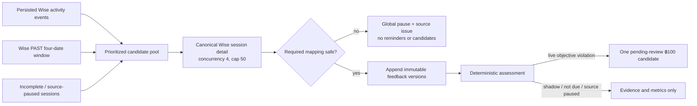

# Wise Post-Class Feedback Tracking

**Status: in progress (implemented; shadow mode by default, pending production setup and activation)**

## Purpose

Wise Post-Class Feedback Tracking replaces the spreadsheet-based comment queue with a durable, admin-only workspace at `/post-class-feedback`. It reads the canonical Wise session detail for each class, preserves every observed teacher-feedback version, evaluates an objective deadline/content policy, sends tutor reminders, and carries reviewed deduction candidates through a feature-owned finance handoff.

The Google Sheet is requirements reference only. The feature does not import its historical queue and never falls back to the sheet in production. It is also strictly read-only toward Wise: it does not create, edit, backdate, or submit feedback, and it does not mutate Wise sessions. No deduction is written into the Payroll subsystem, automatically or otherwise — the payout handoff writes to the tutor payout spreadsheets, which are a separate finance artefact, and only when a finance user explicitly publishes a run.

The rollout starts in `shadow` mode. An access manager must complete the setup checklist and choose a prospective effective date before live obligations can exist. Sessions ending before that effective instant stay out of enforcement permanently.

## Non-negotiable boundaries

- One Wise session produces one obligation and at most one ฿100 deduction candidate, including group classes.
- Source, content, timing, and deduction state are separate. A source problem cannot be converted into a content failure or financial decision.
- Wise session detail is canonical. Persisted Wise activity events only prioritize sessions for re-fetch and provide provenance/timing evidence when their link is unambiguous.
- The system never generates substitute comments, never fabricates activity, and never invents an author or source timestamp.
- Kevin Hsieh has the same tutor compliance policy as every other tutor. The initial all-capabilities grant for `kevhsh7@gmail.com` is administrative access, not a tutor exemption.
- AI is advisory. It cannot create, approve, waive, process, reverse, or otherwise transition a deduction.
- No deduction email, no Wise mutation, no Payroll write. Review and decision stay inside this workspace; the only outbound financial artefact is the payout run described below, and it is never automatic.
- A payout run writes only ever-new rows. It inserts a deduction row beneath a matched class row and never overwrites one, because overwriting a class row would destroy that class's earnings.

## Eligibility and identity

A session is eligible only when all of the following can be proved:

1. Wise reports the session as `ENDED`.
2. It is not missed/no-show, `OTHER`, complimentary, or trial.
3. It has positive consumed credits or a read-only matching payout-eligibility observation.
4. Its teacher resolves to one canonical tutor through the existing online/onsite identity grouping.

Zero-credit, non-payable sessions are excluded. Missing billing evidence or an ambiguous tutor identity fails closed: the session is source-paused, excluded from enforcement and metrics, and surfaced for admin review. Group sessions remain one obligation; participant rows retain all students for display and reminder context.

## Wise evidence and immutable history

The collector reads `feedbackSubmissions[]` from the canonical Wise session-detail endpoint and accepts only submissions whose `profile` is exactly `teacher` after case normalization. For every observed version it retains:

- Wise submission id when present;
- content hash and a stable version key;
- exact raw answers and their mapped fields;
- trustworthy Wise source timestamp when supplied;
- application observation timestamp;
- actor id/name and `manual | auto | unknown` provenance when the evidence proves them;
- raw Unicode character count, deterministic content result, and field failures.

Rows in `post_class_feedback_versions` are append-only. The unique session/version key prevents overlapping syncs from duplicating observations, while a changed content hash under the same Wise submission id creates a new immutable version. Auto-submissions are retained as evidence and still populate content, but they never prove that the tutor met the deadline. The display projection uses the latest substantive teacher-profile version.

## Timing and authorship from Wise activity events

Session detail alone cannot establish either *when* feedback was written or *who* wrote it. Wise rarely returns `submission.updatedAt`, and an admin submitting on a tutor's behalf still writes a submission with `profile: "teacher"`. The persisted `SessionFeedbackSubmittedEvent` stream is the only immutable source for both.

Each event carries `event.eventTimestamp`, an actor (`user.role` = `TEACHER` / `ADMIN` / `STUDENT` / `OWNER`), and `payload.session.autoSubmitted`. Auto-submissions arrive with **no actor object at all**. The event never carries a submission id and never carries scheduled times, so events are correlated to a session, not to an individual submission.

`deriveEventTimingEvidence` (`src/lib/post-class-feedback/policy.ts`) applies:

1. A **qualifying** event is `actorRole === "TEACHER"` and not auto-submitted. `ADMIN`, `STUDENT`, `OWNER`, and auto events never prove tutor compliance.
2. The earliest qualifying event at or before the deadline proves `on_time`.
3. No qualifying event, with the deadline inside event coverage, proves `late`.
4. **Coverage floor (D-EVT-01).** If the deadline predates the oldest persisted feedback event, absence proves nothing and timing stays `unknown`. Without this, a historical backfill would manufacture universal non-compliance for every session predating the event store.

Event evidence outranks the mutable submission timestamps and, like any newly discovered pre-deadline proof, can clear a prior violation lock (D-EVT-02). The verdict's basis is persisted on the append-only assessment as `timing_evidence` (`wise_activity_event_before_deadline` / `wise_activity_event_no_tutor_submission`) plus `details.timingEvidenceSource` and `details.submitterRoles`.

The collector still re-fetches canonical session detail for content and never treats the event payload alone as feedback.

## Observation versus enforcement

Assessment and enforcement are separate (D-EVT-03). A session ending before `policyEffectiveAt` is still assessed and scored, so historical timeliness is visible in Operations and Analytics — but `deductionCandidate` requires `enforcementMode === "live"` **and** `policyApplies`, so such a session can never produce a deduction. A broken source or a `paused` feature still suspends assessment outright.

## Deadline and objective compliance

The deadline is **23:59:59.999 Asia/Bangkok on the second calendar day after the final scheduled-end date**, including weekends and holidays.

The required fields are:

- Topics covered
- How the student did in class
- Need more work on

Homework and due date are stored and displayed but do not affect compliance.

Each required field must contain meaningful English or Thai text, and the three required fields must total at least 300 raw Unicode code points. Raw counting includes spaces, line breaks, and repeated whitespace. Unicode normalization, case-folding, and whitespace collapse are used only for empty/placeholder detection and similarity analysis.

The deterministic placeholder rules reject blank or punctuation-only text; plain variants such as `N/A`, `none`, `nothing`, and configured Thai equivalents; and text that contains no Latin or Thai characters. A “no improvement needed” statement is valid only if the same response also contains a positive next-step goal and rationale.

Timing follows evidence, not inference:

- A compliant version with a trustworthy Wise timestamp at or before the deadline locks the session as proven on-time. Later deletion or weaker feedback cannot undo that lock.
- Compliant content without a trustworthy source timestamp is `unknown`, not backdated from its observation time. It receives benefit of the doubt in adjusted compliance but not raw on-time compliance.
- If the deadline passed without a compliant, provably on-time version, the objective violation remains. A later compliant version is marked remediated late but remains noncompliant unless a reviewer waives the candidate.
- Not-yet-due sessions and any session whose source is not ready are not in the assessed denominator.

## Source safety and form drift

The source dimension is one of:

| State | Meaning |
|---|---|
| `ready` | Canonical detail, required mapping, identity, and billing evidence are usable. |
| `unavailable` | Wise/auth/contract/billing evidence is unavailable. |
| `form_drift` | A required Wise question is missing or maps ambiguously. |
| `identity_review` | The teacher cannot be resolved to one canonical tutor. |

The collector records safe source issues without feedback text. Authentication or collection failures are treated as systemic; session-detail failures are retained for retry. While source evidence is unavailable, the affected rows leave the denominator and produce neither reminders nor deduction candidates. Once the source recovers, they are reassessed from immutable evidence; a live-policy violation whose deadline crossed the outage may surface as a pending human-review candidate with the outage issue retained as context, including the `Wise/system outage` waiver path.

Any missing or ambiguous required-field mapping trips a run-wide circuit breaker, closes the current enforcement window, changes Settings to `paused`, marks the mapping invalid, and prevents reminders or candidates. An access manager must repair the mapping, run a healthy reassessment in shadow mode, reconfirm the shadow review, and explicitly resume live enforcement. Sessions ending inside the resulting paused interval remain outside enforcement rather than being penalized retroactively.

## Collection and reconciliation

The scheduled collector runs at `13,43 * * * *` (UTC cron expression, every 30 minutes). A normal run:

1. Enumerates an inclusive rolling four-Bangkok-date Wise `PAST` window.
2. Keeps only `ENDED` session candidates locally.
3. Merges three candidate sources in priority order: unlinked feedback activity events, incomplete/source-paused rechecks, then the rolling window.
4. Reserves bounded capacity for both old incomplete sessions and newly ended rolling-window sessions, so a persistent activity-event backlog can accelerate discovery without replacing canonical reconciliation.
5. Fetches canonical session detail with concurrency four and a hard cap of 50 detail calls.
6. Parses all bounded detail results before persisting any deduction candidate, so form drift can pause the entire batch first.
7. Merges newly observed evidence with immutable history, reassesses the session, and creates a candidate only when the objective live-mode policy says it should.

Manual recovery uses `POST /api/post-class-feedback/sync`. An access manager can supply an inclusive `startDate`/`endDate` Bangkok range and a detail cap up to 50. Sync runs have a database single-flight guard; transient failures are retried by the shared Wise transport and unfinished sessions remain eligible for later runs.

## Metrics and analytics

For the selected date range, the assessed denominator includes only source-ready eligible sessions that became compliant or reached their deadline. Not-yet-due and source-paused sessions are excluded.

- **Raw on-time rate** = proven on-time sessions / assessed sessions.
- **Adjusted compliance** = proven on-time + compliant timing-unknown + waived sessions / the same assessed denominator.
- Late remediation remains noncompliant unless waived.

Tutor ranking is lowest adjusted compliance first, then most unresolved violations, then canonical tutor name. The workspace shows eligible and assessed sessions, raw and adjusted rates, late/incomplete/waived counts, deduction states and totals, mean/median substantive length, reminder outcomes, confirmed AI concerns, and Bangkok week/month trend buckets.

## AI quality review

AI review runs only when deterministic code marks a substantive version as suspicious:

- any required field has fewer than 50 raw characters;
- combined required length is 300–349 characters;
- a required field matches a placeholder pattern; or
- the normalized required text has at least 85% character-trigram cosine similarity to the same canonical tutor's prior 90 days.

Similarity input is Unicode-normalized, lowercased, whitespace-collapsed text with known names replaced. Before the model request, known student names become stable `[STUDENT_n]` placeholders and the tutor name becomes `[TUTOR]`. The OpenAI Responses request uses `store: false`, supports English, Thai, and bilingual text, and asks only about vagueness, actionable detail, irrelevance, unprofessional tone, contradiction, and probable copying. Feedback text is not put into application logs or AI-run metadata.

Each returned concern is independently `pending`, `confirmed`, or `dismissed`. A reviewer must supply a note and an expected version for every confirm/dismiss action. Model failure is stored as an AI-run failure and never blocks objective compliance processing.

## Tutor reminders and admin digest

Two grouped tutor reminder checkpoints run in Bangkok time:

- 09:00 on the day after class (`0 2 * * *` UTC);
- 17:00 on deadline day (`0 10 * * *` UTC).

Each reminder route reconciles the exact Bangkok class date first. The checkpoint unions Wise `PAST` discovery with every persisted eligible obligation for that date, then drains sequential batches of at most 50 canonical detail calls. A missing-from-`PAST` persisted row is still detail-fetched and becomes unavailable on source failure. Dispatch occurs only after the checkpoint backlog is drained within the route budget; otherwise the route returns a recoverable Data Health failure and sends nothing. Blocking global issues suppress every send, while a session-scoped issue suppresses only that obligation.

Delivery rechecks current content and requires a source observation no older than 20 minutes. A tutor who completes the objective fields—even as a late remediation that remains historically noncompliant—is removed immediately. One delivery groups all qualifying sessions for the canonical tutor and includes students/class, session date, failed fields/reasons, current combined character count, deadline, and a Wise session link. It never includes feedback excerpts or tells a tutor about deductions.

Recipient resolution uses `tutor_contacts.primary_email` first. If that is blank, the onsite/online Wise-derived addresses are accepted only when they collapse to one unambiguous address; conflicts and missing addresses are not guessed. Delivery is durably idempotent. It makes one primary-relay attempt followed by up to three backup-relay retries at approximately 30, 90, and 180 minutes. Before a grouped retry, any otherwise-eligible stale member defers the whole delivery without consuming an email attempt; the service never sends a fresh subset and drops the stale remainder. A retry is cancelled when every member no longer needs a reminder.

The internal admin digest runs daily at 08:00 Bangkok (`0 1 * * *` UTC) and reports new violations since the prior successful digest's scheduled boundary (or the preceding 24 hours on first run), pending deduction and AI reviews, open source/form issues, and terminal reminder failures. Issue and failure totals are uncapped; the message includes only a bounded issue-detail sample. Recipients are selected in Settings from existing allowlisted admins.

## Review and finance workflow

At the deadline, a source-ready objective violation in a live enforcement window creates one `pending_review` ฿100 candidate. There are no bulk decision actions.

Reviewer actions:

- `approve` a pending candidate;
- `waive` a pending or approved/unprocessed candidate with a required note and one category: Wise/system outage, incorrect session/tutor data, pre-approved exception, tutor emergency, duplicate/system error, or other;
- `reopen` an approved, unprocessed item with a required reason.

Finance actions:

- assign the class's Bangkok month by default;
- move an approved item to the same or a later open period (a later month requires a reason);
- process an approved item only in an open period with a payroll/reference note;
- close a period only when no assigned or default-month approved/unprocessed items remain;
- reopen a closed period with a reason;
- correct a processed deduction by creating one immutable -฿100 reversal/offset in an open period with its own reason and reference.

The processed deduction row and the append-only action/offset ledgers are protected by database triggers. All mutations are individual, capability-gated, audited, and protected by idempotency keys and/or expected-version checks.

## Payout runs

**Status: built, never yet run in production.** It cannot be until enforcement is `live` — in `shadow` no deduction rows exist at all — the payout Google account has granted Drive access, and migrations `0057`/`0058` are applied.

Tutor pay runs on a **26th-to-25th** window, not a calendar month. A run anchored to `2026-07` covers 26 June through 25 July inclusive. Finance periods stay calendar months and continue to gate approval and month close; a payout run is a separate selection and export window layered on top, so one run legitimately spans two finance months.

A run selects **only `approved` deductions** whose session ended inside its window. `pending_review` has had no human decision. `waived` is a decision not to deduct. A reversed deduction is excluded by the presence of its offset row, not by its `status` column — the reverse action never updates that column, so it still reads `processed` afterwards.

Publishing does two things, in this order:

1. Inserts one `Feedback deduction` row directly beneath each matched class row in the tutor's payout spreadsheet, carrying `-฿100`, the student, the reason, the deadline, and whether a tutor submission was ever observed.
2. Uploads a summary CSV of every line — including the skipped and unmatched ones — to the payout Drive folder.

### Rules the run will not bend

- **Matching is in UTC.** Payout sheets record class times in UTC, not Bangkok; verified against production, where a session stored at `06:00Z` appears on the sheet as `06:00`. Treating them as Bangkok times would shift every match by seven hours.
- **Live sessions log their actual start**, not the scheduled one (`10:26` against a `10:30` class), so matching allows ±15 minutes and takes the nearest row. A tie is reported `ambiguous` and nothing is written.
- **No match, no write.** Unmatched, ambiguous, unmapped tutor, unresolved tutor, unrecognised sheet shape — each is recorded against its line with a reason and the sheet is left untouched.
- **The tutor → spreadsheet mapping is explicit and managed.** An unmapped tutor is an exception, never a guess.
- **A sheet that declares a different window is refused**, because the mapping has no month dimension and may have been re-pointed since.
- **Publishing does not mark deductions `processed`.** That stays a separate decision: `process` requires the deduction's assigned finance month to be open, a 26→25 run spans two months, and June cannot close until exactly these deductions are processed — coupling them would make a routine payout a circular blocker.

### Pressing Publish twice is safe

Each inserted row carries a `BGS-PAYOUT {month} {deduction prefix}` marker in its notes cell, and **that marker, not the database, is the record of what was written** — a line's stored state can be lost to a crash between the Sheets call and the database write. Before anything else, a pass re-reads the grid and looks for the marker; if it is there, the row already landed. If instead the row below the anchor is blank *and this line has been attempted before*, the previous insert landed but its fill did not, and that row is reused rather than a second one inserted.

This makes the notes cell on a deduction row **machine-owned**. Editing away a marker can cause a later publish to write that deduction a second time.

Writes go bottom-up within each tab: inserting shifts every row below it, and the grid is read once per tab, so descending order keeps both the row numbers and the read copy accurate for the rows still to be written.

### Guardrails before publishing

An open blocking global source issue refuses the run outright — it is the same condition `revalidateDeductionCandidate` will not act under. Pending reviews and a materially unreconciled window (>2% of eligible sessions without trustworthy Wise evidence) also refuse, but a finance user may override by acknowledging the **exact count they were shown**, which is recorded in the audit log. As of 2026-07-27 the July window fails this gate: 1,271 of 1,304 eligible sessions are `unavailable`.

If the sheets are written but the Drive upload then fails, the run stays `published` with the error recorded and the upload retried separately. The sheets are already money; a Drive failure must not make a run that moved money look like one that did not.

## Access model

This feature adds four database-backed capabilities, read fresh on every request:

| Capability | Access |
|---|---|
| `viewer` | Operations, analytics, exact source feedback, immutable history, aggregate deduction/AI metrics, and a sanitized audit view. |
| `reviewer` | Viewer access plus the reviewer deduction queue, AI-concern details, and individual decisions. |
| `finance` | Viewer access plus the approved/processed finance queue, handoff/reversal, and finance-period actions. |
| `access_manager` | Viewer access plus manual rolling sync/range backfill, mapping, mode, access, tutor-email, digest-recipient, email-test, and shadow-review settings. |

Any action capability implies `viewer`. Migration `0055_post_class_feedback.sql` seeds viewer access for full allowlisted admins and seeds all four capabilities plus the initial digest recipient for `kevhsh7@gmail.com`. Access managers can grant roles only to existing `admin_users`. The service prevents self-removal of `access_manager` and prevents removal of the last access manager.

Reviewer, finance, and access-management payloads are assembled separately. A plain viewer does not receive individual AI concerns, the deduction queue, finance periods, the role matrix, tutor emails, form-mapping values, or digest-recipient addresses. Restricted tabs are omitted rather than merely disabled.

## UI

The `/post-class-feedback` workspace has up to five views, with restricted views present only when the server grants the matching capability:

- **Operations** — filterable session queue, objective evidence, reminders, source state, AI concerns, exact feedback, immutable version history, and individual reviewer actions.
- **Analytics** — headline KPIs, tutor ranking, length statistics, concerns, and Bangkok period trends.
- **Deductions** — capability-specific reviewer/finance handoff with individual actions only.
- **Audit** — configuration, AI-review, deduction, finance, reminder, and source history.
- **Settings** — enforcement controls, rolling collection and bounded date-range backfill, Wise field mapping/source health, role matrix, shadow-review confirmation, and finance periods. The tutor-email and digest-recipient cards remain for the parked email subsystem but no longer gate anything.

Operations shows a **Submitted by** column and filter (`tutor` / `admin` / `auto` / `none`); Analytics adds **Tutor wrote**, **Admin rescued**, and **Auto-filled** counts per tutor, so a session rescued by an admin can never read as the tutor having done the work.

A persistent “Setup required” banner remains until the mapping, role coverage, shadow review, and activation are complete. Live activation is blocked server-side until those pass; the effective time must be current or future and becomes immutable once recorded. Email relay configuration, test-email delivery, digest recipients, and tutor-email coverage were removed as activation gates when outbound email was parked.

## Durable data model

The feature owns 24 snapshot-independent tables. Exact definitions and constraints are in `src/lib/db/schema.ts` and migration `drizzle/0055_post_class_feedback.sql`.

| Area | Tables | Purpose |
|---|---|---|
| Policy and access | `post_class_enforcement_windows`, `post_class_settings`, `post_class_field_mappings`, `post_class_access_grants`, `post_class_config_audit_log`, `post_class_digest_recipients` | Prospective windows, versioned operational configuration, fresh capability grants, recipients, and audit. |
| Source collection | `post_class_sync_runs`, `post_class_sessions`, `post_class_session_participants`, `post_class_feedback_versions`, `post_class_feedback_event_links`, `post_class_assessments`, `post_class_source_issues` | Canonical session projection, immutable evidence and assessments, event associations, sync cursors/counts, and fail-closed issues. |
| Notifications | `post_class_notification_runs`, `post_class_notification_deliveries`, `post_class_notification_items`, `post_class_notification_attempts` | Grouped idempotent tutor reminders/admin digests and their durable retry trail. Successful setup-test delivery is recorded in settings plus the configuration audit log. |
| AI | `post_class_ai_runs`, `post_class_ai_concerns`, `post_class_ai_reviews` | De-identified advisory runs, per-dimension findings, and required-note human decisions. |
| Finance | `post_class_finance_periods`, `post_class_deductions`, `post_class_deduction_actions`, `post_class_deduction_offsets` | Open/closed months, one candidate per session, append-only decisions, and immutable correction offsets. |
| Payout runs | `post_class_payout_runs`, `post_class_tutor_payout_sheets`, `post_class_payout_run_lines` | One run per 26th-to-25th window, the managed tutor → spreadsheet mapping, and one line per deduction per run recording its match and write outcome. |

The feature also adds optional `primary_email` to `tutor_contacts`. Existing features continue to use their previous onsite/online selection behavior unless they explicitly opt into this field.

## API and cron surface

The complete endpoint inventory is in [the API master index](../reference/api/index.md). Admin routes under `/api/post-class-feedback/*` call the fresh capability guard; internal routes use `CRON_SECRET` and cron-invocation audit. All four jobs and their manual recovery controls are surfaced in Data Health. Schedules and recovery behavior are documented in [the cron reference](../reference/crons.md). The two Wise read contracts used by the collector are documented in [the Wise API reference](../reference/wise-api.md).

## Tests

Focused coverage includes:

- `src/lib/post-class-feedback/__tests__/policy.test.ts` — eligibility, English/Thai content, Unicode counts, placeholders, exact deadline boundary, timing unknown, late remediation, and on-time lock.
- `src/lib/post-class-feedback/__tests__/wise.test.ts` — required-field mapping, teacher-profile filtering, auto/manual provenance, mutable submission observations, and exact answer retention.
- `src/lib/post-class-feedback/__tests__/sync.test.ts` — four-date windowing, priority/caps, inclusive dedupe, source issues, form drift, and idempotent resync.
- `src/lib/post-class-feedback/__tests__/similarity.test.ts` — name redaction, trigram cosine similarity, and deterministic AI-trigger boundaries.
- `src/lib/post-class-feedback/__tests__/access.test.ts` — fresh capability rules, implied viewer, last-manager, and self-lockout safeguards.
- `src/lib/post-class-feedback/__tests__/migration.test.ts` — required tables, enums, indexes, append-only triggers, defaults, and initial access/settings seeds, plus the payout-run and source-restore migrations.
- `src/lib/post-class-feedback/__tests__/payout-plan.test.ts` — the row-action decision table (already-written, blank-row reuse, unmatched, ambiguous), bottom-up ordering, the publish gate, and Bangkok-formatted CSV output.
- `src/lib/post-class-feedback/__tests__/payout-writer.test.ts` — writes against an in-memory grid that really splices on insert, including recovery from a pass interrupted between the insert and the fill.
- `src/lib/post-class-feedback/__tests__/payout-run.integration.test.ts` — publish end to end against real Postgres, including that a second publish issues zero Google writes.
- `src/lib/post-class-feedback/__tests__/source-status-restore.integration.test.ts` — the run-wide source demotion and its one-statement recovery.
- `src/lib/wise/__tests__/post-class-feedback-fetchers.test.ts` — Wise PAST pagination/date params and canonical session-detail request shape.
- `src/components/post-class-feedback/__tests__/*` — workspace tabs, capability-specific controls, responsive/filter contracts, setup controls, and absence of synthetic-comment generation.

## Production setup checklist

After deploying the code and applying `0055_post_class_feedback.sql`, Kevin should complete these steps in the website's Settings view:

1. Assign the real reviewer, finance, and access-manager staff; `kevhsh7@gmail.com` is only the initial all-capabilities bootstrap.
2. Verify the Wise form mapping and source health.
3. Backfill the `SessionFeedbackSubmittedEvent` history (`POST /api/wise-activity/sync` with `eventName`, `startPage`, `stopOnKnownEvents: false`) so the coverage floor reaches as far back as Wise retains events, then drain session detail from Settings → “Backfill range”.
4. Run a shadow sync, inspect the results, and explicitly confirm the shadow review.
5. Open the required finance period(s).
6. Activate live enforcement with a current-or-future Bangkok effective date.

### Additional steps before the first payout run

7. Apply `0057_post_class_payout_runs.sql` and `0058_post_class_source_status_restore.sql`.
8. Sign in as the payout Google account and use **Reconnect Google** in the workspace header to grant `drive.file`, then confirm with `npx tsx scripts/verify-drive-upload.ts` that it can create a file in the payout Drive folder. If that returns 404 the folder is not visible to the account — share it as an Editor.
9. Map each tutor to their payout spreadsheet and tab via `POST /api/post-class-feedback/payout-sheets`. An unmapped tutor is skipped, never guessed.
10. Let reconciliation converge over the target window — the publish gate refuses a window where more than 2% of eligible sessions have no trustworthy Wise evidence.
11. Run `scripts/verify-payout-sheet-write.ts`-style verification against a **scratch copy** of a real payout sheet before the first live publish, to confirm that `insertDimension` with `inheritFromBefore` does not disturb formulas beyond column H or a totals range.
12. Publish for a single tutor first, eyeball the sheet and the CSV, then widen.

Tutor emails, digest recipients, and the email test are no longer prerequisites — outbound email is parked.

Do not activate while the setup banner is incomplete. Pausing later creates a new excluded interval; resuming reuses the immutable original activation boundary and cannot retroactively penalize sessions in the paused interval.

_Verified against HEAD on 2026-07-26._
