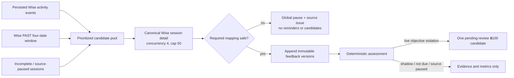

# Wise Post-Class Feedback Tracking

**Status: in progress (implemented; shadow mode by default, pending production setup and activation)**

## Purpose

Wise Post-Class Feedback Tracking replaces the spreadsheet-based comment queue with a durable, admin-only workspace at `/post-class-feedback`. It reads the canonical Wise session detail for each class, preserves every observed teacher-feedback version, evaluates an objective deadline/content policy, and carries reviewed deduction candidates through a feature-owned finance handoff. Reminder and digest code remains available for deliberate recovery testing, but automated outbound email is parked.

The original feedback Google Sheet is requirements reference only. The feature does not import its historical queue and never falls back to it in production. It is also strictly read-only toward Wise: it does not create, edit, backdate, or submit feedback, and it does not mutate Wise sessions. No deduction is written into the Payroll subsystem, automatically or otherwise. The payout handoff appends to an app-owned adjustment tab in the finance payout workbook only when a finance user explicitly publishes a reviewed preview.

The rollout starts in `shadow` mode. An access manager must complete the setup checklist and choose a prospective effective date before live obligations can exist. Sessions ending before that effective instant stay out of enforcement permanently.

## Non-negotiable boundaries

- One Wise session produces one obligation and at most one ฿100 deduction candidate, including group classes.
- Source, content, timing, and deduction state are separate. A source problem cannot be converted into a content failure or financial decision.
- Wise session detail is canonical. Persisted Wise activity events only prioritize sessions for re-fetch and provide provenance/timing evidence when their link is unambiguous.
- The system never generates substitute comments, never fabricates activity, and never invents an author or source timestamp.
- Kevin Hsieh has the same tutor compliance policy as every other tutor. The initial all-capabilities grant for `kevhsh7@gmail.com` is administrative access, not a tutor exemption.
- AI is advisory. It cannot create, approve, waive, process, reverse, or otherwise transition a deduction.
- No deduction email, no Wise mutation, no Payroll write. Review and decision stay inside this workspace; the only outbound financial artefact is the payout run described below, and it is never automatic.
- A payout run writes only ever-new adjustment rows to the dedicated `Feedback Deductions` tab. It never writes to the finance-refreshed source tab or a tutor workbook, and corrections are compensating rows rather than edits/deletes.

## Eligibility and identity

A session is eligible only when all of the following can be proved:

1. Wise reports the session as `ENDED`.
2. It is not missed/no-show, `OTHER`, complimentary, or trial.
3. It has positive consumed credits or a read-only matching payout-eligibility observation.
4. Its teacher resolves to one canonical tutor through the existing online/onsite identity grouping.

Zero-credit, non-payable sessions are excluded. Missing billing evidence or an ambiguous tutor identity fails closed: the session is source-paused, excluded from enforcement and metrics, and surfaced for admin review. Group sessions remain one obligation; participant rows retain all students for display and reminder context.

## Wise evidence and immutable history

The collector reads `feedbackSubmissions[]` from the canonical Wise session-detail endpoint and accepts only submissions whose `profile` is exactly `teacher` after case normalization. For every observed version it retains:

- Wise submission id when present;
- content hash and a stable version key;
- exact raw answers and their mapped fields;
- trustworthy Wise source timestamp when supplied;
- application observation timestamp;
- actor id/name and `manual | auto | unknown` provenance when the evidence proves them;
- raw Unicode character count, deterministic content result, and field failures.

Rows in `post_class_feedback_versions` are append-only. The unique session/version key prevents overlapping syncs from duplicating observations, while a changed content hash under the same Wise submission id creates a new immutable version. Auto-submissions are retained as evidence and still populate content, but they never prove that the tutor met the deadline. The display projection uses the latest substantive teacher-profile version.

## Timing and authorship from Wise activity events

Session detail alone cannot establish either *when* feedback was written or *who* wrote it. Wise rarely returns `submission.updatedAt`, and an admin submitting on a tutor's behalf still writes a submission with `profile: "teacher"`. The persisted `SessionFeedbackSubmittedEvent` stream is the only immutable source for both.

Each event carries `event.eventTimestamp`, an actor (`user.role` = `TEACHER` / `ADMIN` / `STUDENT` / `OWNER`), and `payload.session.autoSubmitted`. Auto-submissions arrive with **no actor object at all**. The event never carries a submission id and never carries scheduled times, so events are correlated to a session, not to an individual submission.

`deriveEventTimingEvidence` (`src/lib/post-class-feedback/policy.ts`) applies:

1. A **qualifying** event is `actorRole === "TEACHER"` and not auto-submitted. `ADMIN`, `STUDENT`, `OWNER`, and auto events never prove tutor compliance.
2. The earliest qualifying event at or before the deadline proves `on_time`.
3. No qualifying event, with the deadline inside event coverage, proves `late`.
4. **Coverage floor (D-EVT-01).** If the deadline predates the oldest persisted feedback event, absence proves nothing and timing stays `unknown`. Without this, a historical backfill would manufacture universal non-compliance for every session predating the event store.

Event evidence outranks the mutable submission timestamps and, like any newly discovered pre-deadline proof, can clear a prior violation lock (D-EVT-02). The verdict's basis is persisted on the append-only assessment as `timing_evidence` (`wise_activity_event_before_deadline` / `wise_activity_event_no_tutor_submission`) plus `details.timingEvidenceSource` and `details.submitterRoles`.

The collector still re-fetches canonical session detail for content and never treats the event payload alone as feedback.

## Observation versus enforcement

Assessment and enforcement are separate (D-EVT-03). A session ending before `policyEffectiveAt` is still assessed and scored, so historical timeliness is visible in Operations and Analytics — but `deductionCandidate` requires `enforcementMode === "live"` **and** `policyApplies`, so such a session can never produce a deduction. A broken source or a `paused` feature still suspends assessment outright.

## Deadline and objective compliance

The deadline is **23:59:59.999 Asia/Bangkok on the second calendar day after the final scheduled-end date**, including weekends and holidays.

The required fields are:

- Topics covered
- How the student did in class
- Need more work on

Homework and due date are stored and displayed but do not affect compliance.

Each required field must contain meaningful English or Thai text, and the three required fields must total at least 300 raw Unicode code points. Raw counting includes spaces, line breaks, and repeated whitespace. Unicode normalization, case-folding, and whitespace collapse are used only for empty/placeholder detection and similarity analysis.

The deterministic placeholder rules reject blank or punctuation-only text; plain variants such as `N/A`, `none`, `nothing`, and configured Thai equivalents; and text that contains no Latin or Thai characters. A “no improvement needed” statement is valid only if the same response also contains a positive next-step goal and rationale.

Timing follows evidence, not inference:

- A compliant version with a trustworthy Wise timestamp at or before the deadline locks the session as proven on-time. Later deletion or weaker feedback cannot undo that lock.
- Compliant content without a trustworthy source timestamp is `unknown`, not backdated from its observation time. It receives benefit of the doubt in adjusted compliance but not raw on-time compliance.
- If the deadline passed without a compliant, provably on-time version, the objective violation remains. A later compliant version is marked remediated late but remains noncompliant unless a reviewer waives the candidate.
- Not-yet-due sessions and any session whose source is not ready are not in the assessed denominator.

## Source safety and form drift

The source dimension is one of:

| State | Meaning |
|---|---|
| `ready` | Canonical detail, required mapping, identity, and billing evidence are usable. |
| `unavailable` | Wise/auth/contract/billing evidence is unavailable. |
| `form_drift` | A required Wise question is missing or maps ambiguously. |
| `identity_review` | The teacher cannot be resolved to one canonical tutor. |

The collector records safe source issues without feedback text. Authentication or collection failures are treated as systemic; session-detail failures are retained for retry. While source evidence is unavailable, the affected rows leave the denominator and produce neither reminders nor deduction candidates. Once the source recovers, they are reassessed from immutable evidence; a live-policy violation whose deadline crossed the outage may surface as a pending human-review candidate with the outage issue retained as context, including the `Wise/system outage` waiver path.

Any missing or ambiguous required-field mapping trips a run-wide circuit breaker, closes the current enforcement window, changes Settings to `paused`, marks the mapping invalid, and prevents reminders or candidates. An access manager must repair the mapping, run a healthy reassessment in shadow mode, reconfirm the shadow review, and explicitly resume live enforcement. Sessions ending inside the resulting paused interval remain outside enforcement rather than being penalized retroactively.

**Sessions deleted in Wise (REC-03).** Wise answers a detail fetch for a deleted session with HTTP 400 `Session not found!`. Such a session can never auto-resolve — resolution requires a successful observation, and its feedback event only stops being a candidate once a successful observation links it — so before this it re-entered the highest-priority candidate lane on every run indefinitely. Production accumulated 230 open issues from 121 deleted sessions, consuming roughly 30 of each run's 50 Wise calls.

The deletion is proven by a `SessionDeletedEvent` in the `wise_activity_events` mirror, which the collector now consults. Every candidate lane declines to propose a session with that evidence, and a sweep at the top of each run resolves its open session-scoped issues (`session_not_found` and the `detail_retry` rows raised beside them) and marks any session row it holds `wise_deleted_at` + `eligible = false` + `eligibility_reason = 'deleted_in_wise'`. Deletion is recorded as a fact of its own rather than a `source_status` value: every `source_status <> 'ready'` reader treats its subject as blocking, so a `deleted` status would park those sessions in the payout coverage denominator permanently. `deleted_in_wise` is deliberately **not** in `KNOWN_INELIGIBLE_REASON_VALUES`, since that list feeds the one-terminal-row-per-run readmission lane and a deleted session has nothing to recover to.

The event mirror only reaches back to 2026-05-27, so sessions that disappeared earlier have no evidence either way. They are not retired on a guess; the REC-02 grace window (7 days from first sighting) simply stops them being retried, and their issue rows stay `open` and visible in Data Health.

## Collection and reconciliation

The scheduled collector runs at `13,43 * * * *` (UTC cron expression, every 30 minutes). A normal run:

1. Enumerates an inclusive rolling four-Bangkok-date Wise `PAST` window.
2. Keeps only `ENDED` session candidates locally.
3. Merges three candidate sources in priority order: unlinked feedback activity events, incomplete/source-paused rechecks, then the rolling window.
4. Reserves bounded capacity for both old incomplete sessions and newly ended rolling-window sessions, so a persistent activity-event backlog can accelerate discovery without replacing canonical reconciliation.
5. Fetches canonical session detail with concurrency four and a hard cap of 50 detail calls.
6. Parses all bounded detail results before persisting any deduction candidate, so form drift can pause the entire batch first.
7. Merges newly observed evidence with immutable history, reassesses the session, and creates a candidate only when the objective live-mode policy says it should.

Manual recovery uses `POST /api/post-class-feedback/sync`. An access manager can supply an inclusive `startDate`/`endDate` Bangkok range and a detail cap up to 50. Sync runs have a database single-flight guard; transient failures are retried by the shared Wise transport and unfinished sessions remain eligible for later runs.

## Metrics and analytics

For the selected date range, the assessed denominator includes only source-ready eligible sessions that became compliant or reached their deadline. Not-yet-due and source-paused sessions are excluded.

- **Raw on-time rate** = proven on-time sessions / assessed sessions.
- **Adjusted compliance** = proven on-time + compliant timing-unknown + waived sessions / the same assessed denominator.
- Late remediation remains noncompliant unless waived.

Tutor ranking is lowest adjusted compliance first, then most unresolved violations, then canonical tutor name. The workspace shows eligible and assessed sessions, raw and adjusted rates, late/incomplete/waived counts, deduction states and totals, mean/median substantive length, reminder outcomes, confirmed AI concerns, and Bangkok week/month trend buckets.

## AI quality review

AI review runs only when deterministic code marks a substantive version as suspicious:

- any required field has fewer than 50 raw characters;
- combined required length is 300–349 characters;
- a required field matches a placeholder pattern; or
- the normalized required text has at least 85% character-trigram cosine similarity to the same canonical tutor's prior 90 days.

Similarity input is Unicode-normalized, lowercased, whitespace-collapsed text with known names replaced. Before the model request, known student names become stable `[STUDENT_n]` placeholders and the tutor name becomes `[TUTOR]`. The OpenAI Responses request uses `store: false`, supports English, Thai, and bilingual text, and asks only about vagueness, actionable detail, irrelevance, unprofessional tone, contradiction, and probable copying. Feedback text is not put into application logs or AI-run metadata.

Each returned concern is independently `pending`, `confirmed`, or `dismissed`. A reviewer must supply a note and an expected version for every confirm/dismiss action. Model failure is stored as an AI-run failure and never blocks objective compliance processing.

## Parked tutor reminders and admin digest

The delivery implementation is retained, but all three email routes are
unscheduled and `manualOnly` in Data Health. Nothing sends automatically. If
automation is deliberately restored later, the two grouped tutor checkpoints
would run in Bangkok time:

- 09:00 on the day after class (`0 2 * * *` UTC);
- 17:00 on deadline day (`0 10 * * *` UTC).

Each reminder route reconciles the exact Bangkok class date first. The checkpoint unions Wise `PAST` discovery with every persisted eligible obligation for that date, then drains sequential batches of at most 50 canonical detail calls. A missing-from-`PAST` persisted row is still detail-fetched and becomes unavailable on source failure. Dispatch occurs only after the checkpoint backlog is drained within the route budget; otherwise the route returns a recoverable Data Health failure and sends nothing. Blocking global issues suppress every send, while a session-scoped issue suppresses only that obligation.

Delivery rechecks current content and requires a source observation no older than 20 minutes. A tutor who completes the objective fields—even as a late remediation that remains historically noncompliant—is removed immediately. One delivery groups all qualifying sessions for the canonical tutor and includes students/class, session date, failed fields/reasons, current combined character count, deadline, and a Wise session link. It never includes feedback excerpts or tells a tutor about deductions.

Recipient resolution uses `tutor_contacts.primary_email` first. If that is blank, the onsite/online Wise-derived addresses are accepted only when they collapse to one unambiguous address; conflicts and missing addresses are not guessed. Delivery is durably idempotent. It makes one primary-relay attempt followed by up to three backup-relay retries at approximately 30, 90, and 180 minutes. Before a grouped retry, any otherwise-eligible stale member defers the whole delivery without consuming an email attempt; the service never sends a fresh subset and drops the stale remainder. A retry is cancelled when every member no longer needs a reminder.

The retained admin digest is designed for 08:00 Bangkok (`0 1 * * *` UTC) and
reports new violations since the prior successful digest's scheduled boundary
(or the preceding 24 hours on first run), pending deduction and AI reviews,
open source/form issues, and terminal reminder failures. It also remains parked.
Issue and failure totals are uncapped; the message includes only a bounded
issue-detail sample. Recipients are selected in Settings from existing
allowlisted admins.

## Review and finance workflow

At the deadline, a source-ready objective violation in a live enforcement window creates one `pending_review` ฿100 candidate. There are no bulk decision actions.

Reviewer actions:

- `approve` a pending candidate;
- `waive` a pending or approved/unprocessed candidate with a required note and one category: Wise/system outage, incorrect session/tutor data, pre-approved exception, tutor emergency, duplicate/system error, or other;
- `reopen` an approved, unprocessed item with a required reason.

Finance actions:

- assign the class's Bangkok month by default;
- move an approved item to the same or a later open period (a later month requires a reason);
- process an approved item only in an open period with a payroll/reference note;
- close a period only when no assigned or default-month approved/unprocessed items remain;
- reopen a closed period with a reason;
- correct a processed deduction by creating one immutable -฿100 reversal/offset in an open period with its own reason and reference.

The processed deduction row and the append-only action/offset ledgers are protected by database triggers. All mutations are individual, capability-gated, audited, and protected by idempotency keys and/or expected-version checks.

## Payout runs

**Status: implemented on the payout branch; never run against the production
money path.** Production rollout requires the current migrations, exact tutor
identity mappings, the three-tab workbook cutover, scratch evidence, and the
write switch described below. Shadow enforcement creates no deduction rows.

Tutor pay uses a **26th-to-25th** window. A run anchored to `2026-07` covers
26 June through 25 July inclusive. A payout run is separate from calendar-month
finance periods and can therefore span two finance months.

A routine run selects approved, unprocessed deductions whose session ended
inside the closed window. Pending review is not a decision; waived items are
excluded. A correction is a new positive adjustment row, never an edit or
deletion of a prior negative deduction. Processing is allowed only after the
corresponding payout line has been published and verified.

**Continuous accrual (parked, manual-only).** Deductions no longer have to
wait for the window to close before they land. A parked, cron-secret-guarded
route, `/api/internal/post-class-feedback/payout-accrual` (never scheduled --
see [crons.md](../reference/crons.md)), runs two passes: an auto-approval/
reopen sweep first -- a `pending_review` deduction
past a grace period (`POST_CLASS_AUTO_APPROVE_GRACE_HOURS`, default 24h) on a
`live`-enforced, source-`ready` session auto-approves with no reviewer click,
and an `approved`-but-unwritten deduction that loses proof (ineligible
session, or source no longer `ready`) auto-reopens back to `pending_review` --
then either an accrual pass or the automated finalize pass. The accrual pass
appends newly-approved, source-ready deductions to the same app-owned
`Feedback Deductions` tab as a manual publish, under `mode: "accrual"`: it can
never reach `published` while the window is still open, and it never uploads
or touches the CSV artifact, since discarding a fresh CSV on every tick would
still cost a Drive write for nothing. Once the window has ended, the
automated finalize pass runs the same auto-approval/reopen sweep and then
publishes in the ordinary (operator) mode, reaching `published` with CSV
upload enabled exactly like a manual publish once coverage is clean. The
existing manual publish path described below, and its `/post-class-feedback`
UI, are completely unchanged -- `mode` defaults to `"operator"` for every
caller that does not pass it.

**Which window finalize targets.** The finalize pass selects the *oldest*
payout run whose window has ended and whose status is not yet
`published`/`closed` (`findOldestUnfinalizedPayoutRun`), so a window that
fails to finalize keeps being retried however many months pass. Deriving the
anchor from the current calendar month instead stranded such a window on the
1st of the next month -- the anchor rolled forward to a window that had not
ended, the pass skipped, and the period silently reverted to needing a manual
operator publish, which also left the roll CLI's strict-close preflight
blocked on `not_published`. Only when no un-finalized run exists does the pass
fall back to the window anchored to today's own calendar month, still behind
the "window has ended" guard; that fallback is the only branch that can create
a run row, which is what keeps it from minting an empty `published` run for
some older window the system never observed. The selector excludes
`published`/`closed`, so the pass is idempotent and safe to run hourly.

**Alerting.** A window still un-finalized once its anchor month has passed is
surfaced by the cron watchdog as a synthetic `post_class_payout_window` entry
(`classifyPayoutWindowStaleness`), which rides the existing episode dedup,
digest email, and recovery notice. A window with no run row at all is flagged
the same way rather than auto-published. The check is gated on the accrual
cron actually having a schedule, so while the route is parked it stays inert.

### Dedicated three-tab workbook

The production workbook has three distinct responsibilities:

| Tab | Owner | Contract |
|---|---|---|
| `Begifted Payouts Detailed` | Finance refresh process | Read-only source. Finance may replace/re-paste it; the app never writes here. |
| `Feedback Deductions` | BGScheduler | Append-only A:H adjustment rows. Only the payout publisher writes here. |
| `Payouts With Deductions` | BGScheduler formula | Exact `QUERY` union of the source and adjustment A:H ranges. Tutor workbooks query this composite, never either input directly. |

Tab names are configuration, not hard-coded production targets. The names above
are the recommended defaults. The workbook id, connected account, CSV folder,
tutor-workbook inventory folder, and all three tab names must be explicit
environment variables.

The A:H contract remains:

| A | B | C | D | E | F | G | H |
|---|---|---|---|---|---|---|---|
| Teacher name | Session name | Course name/student | Date | Time | Duration | Credits deducted | Payout amount |

`Course name` is historically mislabeled and holds the student name. Read with
`UNFORMATTED_VALUE`/`SERIAL_NUMBER`, source `Date` and `Time` cells are numeric
Google date serials/day fractions and G:H are numeric. An app row copies the
anchor cells exactly and appends with `RAW`; constructing date/time strings can
make Sheets `QUERY` drop the row as a minority type. Matching uses the exact
mapped teacher identity, student, and UTC session time with a ±15-minute
tolerance for live start drift. A tie, clock disagreement, missing mapping,
unresolved tutor, or unrecognized source shape produces no write and leaves a
retryable partial run.

Every adjustment carries a stable marker containing 12 hexadecimal identity
characters inside the Session name cell. Before append, the publisher scans
the app-owned deductions tab for that marker. Retrying after a crash therefore
recovers a landed row without writing it twice. Finance refreshes cannot erase
app adjustments because the refreshed source and app-owned deductions are
separate tabs.

Tutor workbooks remain views. The rollout inventory recursively scans
`POST_CLASS_PAYOUT_WORKBOOKS_FOLDER_ID`, resolves each live `TUTOR` cell against
the active Wise identity catalog, proves each workbook's current formula, and
changes it to query `Payouts With Deductions`. Reviewed identity overrides take
precedence over nickname parsing, and a compound nickname such as `Win-Bordin`
cannot collapse to `Win`. The inventory pins the active Wise snapshot for the
whole fleet scan and rechecks it under the registry transaction before commit.
Runtime publishing never writes a tutor workbook. The composite formula and
tutor imports are rollout gates: if either is wrong, the adjustment may exist
but not affect tutor totals.

### Preview, publish, CSV, and exceptions

The Payouts tab is the only interactive money-path surface:

1. `preview` is read-only and returns a deterministic token bound to the anchor
   month, current run version, exact coverage counts, candidate identities, and
   optional exact canonical tutor filter.
2. `publish` requires that token, the same optional tutor filter, an explicit
   confirmation checkbox, a meaningful audit reason, and the exact pending-review
   and non-ready counts shown in the preview.
3. The service claims a durable `publishing` lease, appends one line at a time,
   persists each outcome immediately, and finalizes the pass. Source sync and
   payout publication are bidirectionally fenced: neither can begin while the
   other owns its durable lane, stale sync workers cannot persist, and the
   finalizer rechecks the claimed source fingerprint after external writes.
4. `retry_csv` uploads only the summary from persisted outcomes. It does not
   replay Google Sheet rows.
5. `resolve_exception` requires a note and external reference for reviewed
   late approvals, post-close waivers, post-close reversals, and manual
   corrections.

A canary uses `tutorFilter=<exact canonical key>`. It may run only after the
window ends, records the filter in the audit trail, and leaves the overall run
`partial` while other required lines remain. It is not a display-only filter.

Run states:

| State | Meaning |
|---|---|
| `draft` | Read-only preview exists; nothing is currently writing. |
| `publishing` | A durable single-flight lease owns the external write pass. |
| `partial` | A canary, time-bounded pass, an in-window accrual pass, or mixed outcome left required work. An accrual pass forces this status even when every obligation it saw is written, since it can never mint `published` while the window is open. |
| `published` | Every required line is written and the source fingerprint still matches the confirmed full/canary pass. Reached either by a manual operator publish once the window has ended, or by the automated finalize pass the first time it runs with clean coverage after the window ends. |
| `closed` | Finance closed the run; later changes require an audited exception/correction. |

Each line is `pending`, `written`, `failed`, or `skipped` and has kind
`deduction` or `correction`. A run never claims success merely because the
request ended; partial work remains visible and retryable.

Month/date repointing is a maintenance operation, not part of Publish. Its
strict-close preflight requires the prior run to be `published`, the CSV
uploaded, naturally passing coverage, no running collector, the current full
source fingerprint matching the published pass, no open exception or
incomplete line/correction, and successful formula readback across the full
tutor-workbook inventory. Every roll invocation
also requires a freshly generated recursive Apps Script TSV via `--inventory`;
its exact spreadsheet-ID set must equal the active maintenance registry, so a
newly added or removed workbook cannot be silently omitted. Before the first
close every workbook must still show the exact outgoing window; a mixed
outgoing/incoming fleet is accepted only when resuming an already-audited
partial roll. On explicit
`--commit`, the audited roll CLI closes that exact version before changing any
dates. There is deliberately no close/date-roll API or UI button: only that CLI
may close and repoint after the full-fleet workbook/composite checks.
Read-heavy maintenance commands use a conservative 2.1-second shared-account
cadence, preserving headroom beneath the Sheets per-user quota for concurrent
application health reads. The lease-bound date roll uses 1.5 seconds: its five
reads plus one write and readback per workbook remain quota-safe while the
68-workbook fleet still fits inside the durable 15-minute roll lease.

### Guardrails

- Production and Preview targets are distinct:
  `POST_CLASS_PAYOUT_TARGET=production` is required on Vercel Production and
  `scratch` on Preview.
- Missing target/account/folder/tab configuration fails closed. There are no
  embedded production ids or account fallbacks.
- External payout writes are disabled unless
  `POST_CLASS_PAYOUT_WRITES_ENABLED=true` exactly. Keep it false for deploy,
  migration, preview, and shadow verification; enable it only for an approved
  write window and turn it off again afterwards.
- That switch gates runtime money rows, not workbook maintenance. Setup,
  formula repoint, and restore tooling stays switch-independent but requires a
  full-fleet preflight/readback and an explicit `--commit`; a dry run is the
  default. Runtime publication must never be used as a maintenance shortcut.
- The pinned account needs Sheets write and `drive.file`; the UI exposes both
  grants and the write-switch state before finance can confirm.
- An open blocking global source issue is absolute. Pending reviews and every
  non-ready source state (`unavailable`, `form_drift`, `identity_review`) must
  either clear or be explicitly acknowledged with the exact preview counts and
  an audited reason. The coverage denominator includes non-ready sessions even
  when billing evidence leaves eligibility unproven; unknown payable exposure
  makes coverage worse and never disappears from the gate.
- A running source collector blocks payout acquisition and close. A live payout
  lease defers new collection, and every source write verifies its sync run is
  still `running`, preventing a recovered stale worker from changing the
  external append plan.
- Routine full publication is after window close. A tutor canary is the only
  deliberately partial rollout scope.
- Publish does not process a deduction. Required order is
  **approve → preview/publish → verify composite+tutor total → process**.
- Pausing the write switch prevents future writes but does not undo rows already
  appended. Rollback is a reviewed compensating correction; never delete or
  overwrite a historical adjustment.

Google scope was probed on 2026-07-28: `drive.file` can create a CSV inside the
configured folder without the broader restricted `drive` scope. A credential,
Cloud-project, workbook, or folder change requires a new scratch probe before
production writes resume.

## Access model

This feature adds four database-backed capabilities, read fresh on every request:

| Capability | Access |
|---|---|
| `viewer` | Operations, analytics, exact source feedback, immutable history, aggregate deduction/AI metrics, and a sanitized audit view. |
| `reviewer` | Viewer access plus the reviewer deduction queue, AI-concern details, and individual decisions. |
| `finance` | Viewer access plus the approved/processed finance queue, payout preview/publish/CSV/exception controls, handoff/reversal, and finance-period actions. |
| `access_manager` | Viewer access plus manual rolling sync/range backfill, mapping, mode, access, tutor-email, digest-recipient, email-test, and shadow-review settings. |

Any action capability implies `viewer`. Migration `0055_post_class_feedback.sql` seeds viewer access for full allowlisted admins and seeds all four capabilities plus the initial digest recipient for `kevhsh7@gmail.com`. Access managers can grant roles only to existing `admin_users`. The service prevents self-removal of `access_manager` and prevents removal of the last access manager.

Reviewer, finance, and access-management payloads are assembled separately. A plain viewer does not receive individual AI concerns, the deduction queue, finance periods, the role matrix, tutor emails, form-mapping values, or digest-recipient addresses. Restricted tabs are omitted rather than merely disabled.

## UI

The `/post-class-feedback` workspace has up to six views, with restricted views present only when the server grants the matching capability:

- **Operations** — filterable session queue, objective evidence, reminders, source state, AI concerns, exact feedback, immutable version history, and individual reviewer actions.
- **Analytics** — headline KPIs, tutor ranking, length statistics, concerns, and Bangkok period trends.
- **Deductions** — capability-specific reviewer/finance handoff with individual actions only.
- **Payouts** — finance-only read-only preview, exact tutor canary, explicit
  publish confirmation, run/line outcomes, CSV-only retry, and reviewed
  post-close exception resolution. The write kill switch and Google readiness
  are visible before confirmation.
- **Audit** — configuration, AI-review, deduction, finance, reminder, and source history.
- **Settings** — enforcement controls, rolling collection and bounded date-range backfill, Wise field mapping/source health, role matrix, shadow-review confirmation, and finance periods. The tutor-email and digest-recipient cards remain for the parked email subsystem but no longer gate anything.

Operations shows a **Submitted by** column and filter (`tutor` / `admin` / `auto` / `none`); Analytics adds **Tutor wrote**, **Admin rescued**, and **Auto-filled** counts per tutor, so a session rescued by an admin can never read as the tutor having done the work.

A persistent “Setup required” banner remains until the mapping, role coverage, shadow review, and activation are complete. Live activation is blocked server-side until those pass; the effective time must be current or future and becomes immutable once recorded. Email relay configuration, test-email delivery, digest recipients, and tutor-email coverage were removed as activation gates when outbound email was parked.

### What the shadow review actually checks

`classifyPostClassShadowReviewEvidence` judges the newest sync run matching the current policy and mapping version and finishing after the mapping was last edited. It reports every condition, passed or not, so the blocking reason is a durable checklist rather than one undifferentiated sentence.

**Absolute** — `globalSourceHealthy` and `mappingObservedHealthy` on the run (the latter is what actually proves the current mapping parsed a real Wise payload), zero open blocking **global** source issues queried live at gate time, and non-empty detail/session/assessment counts. Missing metadata fails closed; the remedy is one fresh shadow sync.

**Acknowledgeable** — readability (`detailFetchedCount / candidateCount`) and resolvability (`readySessionCount / sessionCount`), both required at 80%. Below that an access manager may proceed only by echoing the exact server-computed count with a reason, both recorded in `post_class_config_audit_log`. This mirrors `assertPayoutRunPublishable`, which gates the actual movement of money the same way.

The gate previously required `metadata.outcome === "success"`, i.e. that the run recorded no source issue of any kind. That conflated pipeline health with per-row data tidiness — uniquely, since every other money-adjacent gate filters to `scope = 'global'` — so a single session with an ambiguous tutor identity or one deleted in Wise blocked activation permanently. It also bought nothing: `evaluateSessionCompliance` already refuses to assess or produce a deduction candidate for any session whose `sourceStatus !== "ready"`. Correspondingly, a run is now `partial` only when a blocking global issue, form drift, or a widespread contract breach makes the whole run untrustworthy; `sourceIssueCount` still records every per-session issue honestly.

## Durable data model

Migration `0055_post_class_feedback.sql` creates the 24-table base model. Payout
migrations add eight tables for a current total of 32, covering the run, line,
exact tutor-name mapping, exception/correction state, and resumable workbook
date-roll audit required by the dedicated-tab handoff. Exact current
definitions and constraints are in `src/lib/db/schema.ts` and the database
reference.

| Area | Tables | Purpose |
|---|---|---|
| Policy and access | `post_class_enforcement_windows`, `post_class_settings`, `post_class_field_mappings`, `post_class_access_grants`, `post_class_config_audit_log`, `post_class_digest_recipients` | Prospective windows, versioned operational configuration, fresh capability grants, recipients, and audit. |
| Source collection | `post_class_sync_runs`, `post_class_sessions`, `post_class_session_participants`, `post_class_feedback_versions`, `post_class_feedback_event_links`, `post_class_assessments`, `post_class_source_issues` | Canonical session projection, immutable evidence and assessments, event associations, sync cursors/counts, and fail-closed issues. |
| Notifications | `post_class_notification_runs`, `post_class_notification_deliveries`, `post_class_notification_items`, `post_class_notification_attempts` | Grouped idempotent tutor reminders/admin digests and their durable retry trail. Successful setup-test delivery is recorded in settings plus the configuration audit log. |
| AI | `post_class_ai_runs`, `post_class_ai_concerns`, `post_class_ai_reviews` | De-identified advisory runs, per-dimension findings, and required-note human decisions. |
| Finance | `post_class_finance_periods`, `post_class_deductions`, `post_class_deduction_actions`, `post_class_deduction_offsets` | Open/closed months, one candidate per session, append-only decisions, and immutable correction offsets. |
| Payout runs | `post_class_payout_runs`, `post_class_payout_tutor_names`, `post_class_payout_run_lines`, `post_class_payout_adjustments`, `post_class_payout_exceptions`, `post_class_payout_roll_runs`, `post_class_payout_roll_outcomes` (plus the maintenance-only `post_class_tutor_payout_sheets` registry) | One lifecycle per 26th-to-25th window, exact tutor identities, immutable negative lines, positive correction obligations, reviewed blockers, and durable per-workbook date-roll outcomes. The per-tutor registry is refreshed from a recursive, TUTOR-cell-validated inventory and is used only for formula/date maintenance—not runtime payout targeting. |

The feature also adds optional `primary_email` to `tutor_contacts`. Existing features continue to use their previous onsite/online selection behavior unless they explicitly opt into this field.

## API and cron surface

The complete endpoint inventory is in [the API master index](../reference/api/index.md). Admin routes under `/api/post-class-feedback/*` call the fresh capability guard; internal routes use `CRON_SECRET` and cron-invocation audit. Five internal routes exist: rolling collection, bounded historical drain, and the three parked email handlers. Their schedules and recovery behavior are documented in [the cron reference](../reference/crons.md). The two Wise read contracts used by the collector are documented in [the Wise API reference](../reference/wise-api.md).

## Tests

Focused coverage includes:

- `src/lib/post-class-feedback/__tests__/policy.test.ts` — eligibility, English/Thai content, Unicode counts, placeholders, exact deadline boundary, timing unknown, late remediation, and on-time lock.
- `src/lib/post-class-feedback/__tests__/wise.test.ts` — required-field mapping, teacher-profile filtering, auto/manual provenance, mutable submission observations, and exact answer retention.
- `src/lib/post-class-feedback/__tests__/sync.test.ts` — four-date windowing, priority/caps, inclusive dedupe, source issues, form drift, and idempotent resync.
- `src/lib/post-class-feedback/__tests__/similarity.test.ts` — name redaction, trigram cosine similarity, and deterministic AI-trigger boundaries.
- `src/lib/post-class-feedback/__tests__/access.test.ts` — fresh capability rules, implied viewer, last-manager, and self-lockout safeguards.
- `src/lib/post-class-feedback/__tests__/migration.test.ts` — required tables, enums, indexes, append-only triggers, defaults, and initial access/settings seeds, plus the payout-run and source-restore migrations.
- `src/lib/post-class-feedback/__tests__/payout-master.test.ts` — source/deduction
  tab headers, UTC identity matching, stable markers, and typed adjustment rows.
- `src/lib/post-class-feedback/__tests__/payout-plan.test.ts` — all-source-state
  coverage gates, audited acknowledgements, lifecycle decisions, and
  Bangkok-formatted CSV output.
- `src/lib/post-class-feedback/__tests__/payout-writer.test.ts` — append-only
  dedicated-tab writes, rate pacing, persisted outcomes, and marker idempotency.
- `src/lib/post-class-feedback/__tests__/payout-run.integration.test.ts` —
  preview token, closed-window/canary publication, durable single-flight,
  partial recovery, CSV-only retry, corrections, and duplicate-write defense.
- `src/app/api/post-class-feedback/payout-runs/__tests__/route.test.ts` and
  `src/components/post-class-feedback/__tests__/payouts-tab.test.tsx` — action
  schemas, kill-switch exposure, explicit confirmation, canary scope, row
  references, CSV retry, and exception resolution.
- `src/lib/post-class-feedback/__tests__/source-status-restore.integration.test.ts` — the run-wide source demotion and its one-statement recovery.
- `src/lib/wise/__tests__/post-class-feedback-fetchers.test.ts` — Wise PAST pagination/date params and canonical session-detail request shape.
- `src/components/post-class-feedback/__tests__/*` — workspace tabs, capability-specific controls, responsive/filter contracts, setup controls, and absence of synthetic-comment generation.

## Production setup checklist

After deploying the code and applying the current Post-Class Feedback
migrations, the rollout owner should complete these steps:

1. Assign the real reviewer, finance, and access-manager staff; `kevhsh7@gmail.com` is only the initial all-capabilities bootstrap.
2. Verify the Wise form mapping and source health.
3. Backfill the `SessionFeedbackSubmittedEvent` history (`POST /api/wise-activity/sync` with `eventName`, `startPage`, `stopOnKnownEvents: false`) so the coverage floor reaches as far back as Wise retains events, then drain session detail from Settings → “Backfill range”.
4. Run a shadow sync, inspect the results, and explicitly confirm the shadow review.
5. Open the required finance period(s).
6. Activate live enforcement with a current-or-future Bangkok effective date.

### Additional steps before the first payout run

7. Apply `0057_post_class_payout_runs.sql`,
   `0058_post_class_source_status_restore.sql`,
   `0059_post_class_payout_master.sql`, and
   `0060_post_class_payout_durable_runs.sql` before deploying code that reads
   the new states.
8. Configure every payout environment variable with
   `POST_CLASS_PAYOUT_WRITES_ENABLED=false`. Preview uses a scratch workbook;
   production names its production workbook explicitly. The CSV destination and
   recursive tutor-workbook inventory root are separate required variables even
   when they currently point to the same folder.
9. Create/validate the source, `Feedback Deductions`, and
   `Payouts With Deductions` tabs in scratch. Prove the composite A:H union,
   recursively inventory every tutor workbook, and dry-run the formula cutover.
   Any unexpected formula, duplicate workbook identity, missing access, or
   out-of-folder workbook blocks rollout.
10. Derive exact source-ledger tutor-name mappings in dry-run, review them, then
    commit only approved mappings. The reviewed overrides are
    `Kevin (Kev) Y. Hsieh` → `Kevin`,
    `Prohrak (Paoju) Kruengthomya` → `Paojuu`, the online-only Samantha
    identity → `Samantha`, and the online-only Vasinee `(Prae)` identity →
    `Prae`. Leave Kemjira, Roger, and Tulya unassigned because no approved exact
    source-ledger identity exists. Keep `Fluke-Supha`, `Muk`, `Nacha (Poi)`, and
    `Win-Bordin` blocked until an exact source-ledger identity appears. Do not
    guess.
11. Let rolling collection plus the bounded :23/:53 drain converge. Require no
    blocking global issue and review every remaining non-ready/pending count in
    the exact preview.
12. Run full unit, lint, typecheck, build, disposable-Postgres integration,
    route-surface guard, scratch Google append/idempotency/CSV checks, and
    browser QA. The production PR/check state must be current, not inferred from
    the historical planning summary.
13. Cut tutor workbooks to the formula-backed composite and verify source-only totals
    are unchanged before enabling any deduction write.
14. After a payout window closes, load a scratch preview for one exact canonical
    tutor, set the scratch write switch to `true`, explicitly confirm with an
    audit reason, publish, and verify: one dedicated-tab row, marker, composite
    row, tutor view, total delta, and CSV. Turn the switch off immediately.
15. Repeat the canary in production during an approved window. Process that
    deduction only after the row and tutor total are verified. Observe a full
    collector/backfill cycle before publishing the remaining tutors.
16. Use the audited roll CLI—not the API/UI—to close and repoint only after all
    required lines, CSV evidence, composite readback, and tutor-workbook
    preflight are complete. Pass the fresh recursive Apps Script TSV with
    `--inventory`; any difference from the active registry aborts before close.
    Later approval/waiver/reversal changes use audited exceptions and
    compensating correction rows.

Tutor emails, digest recipients, and the email test are no longer prerequisites — outbound email is parked.

Do not activate enforcement while the setup banner is incomplete. Do not enable
payout writes merely because enforcement is live: policy activation and the
external money-path switch are separate approvals. Pausing later creates a new
excluded interval; resuming reuses the immutable original activation boundary
and cannot retroactively penalize sessions in the paused interval.

_Updated for the dedicated-tab payout design and rollout contract on 2026-07-29.
The historical per-tutor insert design is superseded._
