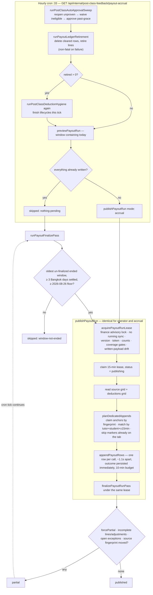

# Post-Class Payout Runs and Accrual

**Status: stable (writes flag-gated)**

What the badge rests on: fourteen `payout-*.ts` modules under `src/lib/post-class-feedback/`
totalling **6,475 lines** (`cat src/lib/post-class-feedback/payout-*.ts | wc -l`), plus
`auto-approval.ts` (282 lines), one in-app route, and one cron route. No `@deprecated`, `TODO`,
`FIXME`, or `HACK` marker exists in any of them, so the maturity word is a handbook designation, not
a code marker. The surface is cron-registered and armed — `33 * * * *` in
[`vercel.json:40`-`43`](../../vercel.json), mirrored in
[`cron-registry.ts:238`-`257`](../../src/lib/data-health/cron-registry.ts) with
`dangerous: true` and the confirmation string *"Appends real payout deductions to the master
ledger."* — dispatchable from the Data Health job runner
([`run-job.ts:141`-`149`](../../src/lib/data-health/run-job.ts)), watched by the cron watchdog
through a synthetic `post_class_payout_window` entry
([`cron-watchdog.ts:91`-`103`](../../src/lib/internal/cron-watchdog.ts)), and covered by 15 test
files (13 `payout-*`, of which four are `*.integration.test.ts`, plus the two `auto-approval`
suites). Every source file is committed: `git status --short src/` is empty, and the last commit
touching `src/lib/post-class-feedback/payout-*.ts` is `fed828d` (2026-08-31), which re-armed
unattended charging.

The parenthetical is the load-bearing half of the badge. **Every app-originated write to the money
ledger requires `POST_CLASS_PAYOUT_WRITES_ENABLED` to be the exact string `true`**, and the whole
unattended pipeline additionally requires `POST_CLASS_AUTO_APPROVE_ENABLED` to be the exact string
`true`. Both default off. Whether either is set in production is a runtime fact this repository
cannot attest.

> **This is the finance half of [Post-Class Feedback](./post-class-feedback.md).** That page owns
> everything upstream of a decided deduction: Wise evidence collection, immutable feedback versions,
> the objective deadline/content policy, eligibility, AI review, enforcement mode, the shadow-review
> activation gate, and the capability model. This page starts where a deduction has a decision and
> asks what happens to the money. Nothing about evidence or compliance is restated here.

## Purpose

Payout runs answer one question per pay period: **which reviewed ฿100 feedback deductions have
provably landed as negative rows in the finance team's master payout workbook, and which have
provably left it again?**

BeGifted pays tutors on a **26th-to-25th** window, not a calendar month
([`payout-window.ts:9`-`17`](../../src/lib/post-class-feedback/payout-window.ts)). Each tutor's own
payout workbook is not a document the app can write to — it is a `QUERY(IMPORTRANGE(...))` view, and
writing into an array formula's output breaks it to `#REF!`
([`payout-sheet.ts:1`-`7`](../../src/lib/post-class-feedback/payout-sheet.ts)). So the app writes
one row into an **app-owned tab of the shared master workbook**, and a formula-backed composite tab
unions the finance-owned source export with that tab; tutor workbooks read only the composite
([`payout-master.ts:5`-`11`](../../src/lib/post-class-feedback/payout-master.ts),
[`payout-workbook-operations.ts:115`-`128`](../../src/lib/post-class-feedback/payout-workbook-operations.ts)).

Two operating modes coexist, and which one is live is an environment decision:

1. **Operator publish.** A finance user previews a window in the Payouts tab, reads the coverage
   counts, echoes them back with a written reason, and publishes. This path is unconditional — it
   exists whether or not unattended charging is on.
2. **Unattended accrual.** An hourly cron approves violations whose grace period has elapsed,
   deletes ledger rows whose violation has since cleared, appends this hour's new obligations, and
   finalizes a window once it has ended and settled. Every one of those writes still goes through
   the same `publishPayoutRun` an operator uses, under the system actor
   `system:post-class-payout-accrual`
   ([`payout-accrual.ts:42`-`47`](../../src/lib/post-class-feedback/payout-accrual.ts)) — the pass
   decides *when* to publish and in which mode, and reimplements nothing (`:29`-`34`).

The users are the **finance** capability holders described in
[post-class-feedback.md § Access model](./post-class-feedback.md#access-model); the Payouts tab is
invisible without it, and the API route gates on it before parsing a body
([`payout-runs/route.ts:107`](../../src/app/api/post-class-feedback/payout-runs/route.ts)).

The design constraint that shapes everything below: **Google Sheets cannot be rolled back.** A
transaction that spans a Sheets append does not exist. So the system is built to make each external
write individually recoverable rather than collectively atomic — one row per call, a stable marker
in the row itself, an outcome persisted the instant it is known, and a re-read on the next pass that
lets the ledger say what actually happened.

## Conceptual data model

Eight tables in the "Post-Class Feedback payout runs" block of `src/lib/db/schema.ts` (section
header at `:3631`), plus the four finance/deduction tables that block reads — the twelve that the
reference groups as *Finance and payout*. Columns, indexes,
constraints, and the ER diagram are the reference's job:
[erd-post-class-feedback.md § Finance and deductions](../reference/database/erd-post-class-feedback.md#finance-and-deductions)
and [§ Payout ledger](../reference/database/erd-post-class-feedback.md#payout-ledger),
the inventory with `schema.ts` line ranges in
[database/index.md](../reference/database/index.md), and the three payout enums in
[enums.md](../reference/database/enums.md#post_class_payout_run_status). Migrations:
`drizzle/0057_post_class_payout_runs.sql`, `0059_post_class_payout_master.sql`,
`0060_post_class_payout_durable_runs.sql`, `0061_payout_line_source_anchor.sql`, and
`0068_payout_adjustment_superseded.sql`. What each table *means*:

- **`post_class_payout_runs`** — one row per 26→25 window, unique on `anchorMonth` and again on
  `(windowStart, windowEnd)` (`schema.ts:3700`-`3701`). It is simultaneously the run record, the
  **publish lease** (`leaseToken` / `leaseExpiresAt` / `publishingByEmail`), the CSV artifact
  pointer, and the date-roll state machine. `publishAcknowledgements` is not a log line: it is the
  typed, replayable record of exactly what the publisher was shown and agreed to — coverage counts,
  preview token, source fingerprint, policy version, tutor filter, actor, instant (`:3653`-`3678`).
  The close gate reads it back and refuses on a non-null `tutorFilter`.
- **`post_class_payout_run_lines`** — one obligation per deduction per run. **A persisted line is
  always negative**: the database enforces `amount_minor < 0` (`schema.ts:3820`) and `line_kind =
  'deduction'` (`:3819`). Three unique indexes make retries safe rather than duplicative —
  `idempotencyKey`, `sourceIdentity`, and `rowSignature` (`:3814`-`3816`). `writeStatus` is the
  re-press-Publish guard; `retiredAt` is the auto-un-charge marker; `sourceAnchorFingerprint` is the
  durable hash of the finance row this line was matched against.
- **`post_class_payout_adjustments`** — append-only *positive* compensations, created only when
  finance waives or reverses a deduction whose negative row has already landed. `amount_minor > 0`
  is enforced (`:3864`). Five statuses, of which **`superseded` is terminal**: the correction
  reached the ledger outside the system, or its source line was retired, so no pass may ever append
  it and it does not block close (`:3834`-`3838`).
- **`post_class_payout_exceptions`** — durable, finance-owned blockers raised while a run is
  prepared or written (`source_anchor_missing`, `post_close_adjustment`,
  `post_close_late_approval`). One open exception per source identity; resolving one requires an
  external correction reference and is only possible *after* the run is closed.
- **`post_class_payout_tutor_names`** — the tutor → **exact** master-ledger identity mapping. The
  schema comment states the rule: a tutor's workbook is a `QUERY` filtered on these strings, so an
  approximation produces a row that belongs to nobody (`:3714`-`3720`). Three unique indexes forbid
  two tutors sharing an identity.
- **`post_class_payout_roll_runs` / `post_class_payout_roll_outcomes`** — one audited, CAS-fenced
  attempt to roll every tutor workbook's date window forward, and its per-workbook outcome.
- **`post_class_tutor_payout_sheets`** — carries a schema comment saying nothing reads or writes it
  (`:3740`-`3744`). See *Open questions*.

Read but never written by this path: `post_class_deductions` (the decision), its
`post_class_deduction_actions` audit trail, `post_class_deduction_offsets` (a reversal offset
excludes a deduction from candidacy), and `post_class_finance_periods` (calendar-month approval
gating). **`payroll_payout_invoices` is read once**, as billing evidence for eligibility
([`repository.ts:2162`-`2179`](../../src/lib/post-class-feedback/repository.ts)) — a read of a
Payroll-owned table, never a write. See *Read-only toward Wise; never writes Payroll*.

## API surface

Two endpoints, plus two finance routes that mutate deductions under payout guards. Methods, bodies,
status codes and Zod shapes belong to the reference:
[post-class-feedback.md § Payout runs](../reference/api/post-class-feedback.md#payout-runs) for the in-app routes,
[internal-crons.md § GET /api/internal/post-class-feedback/payout-accrual](../reference/api/internal-crons.md#get-apiinternalpost-class-feedbackpayout-accrual)
and [crons.md § 10](../reference/crons.md#10-post-class-payout-accrual--apiinternalpost-class-feedbackpayout-accrual)
for the cron. Meaning-wise:

- **`POST /api/post-class-feedback/payout-runs`** (finance capability, `maxDuration = 800`) carries
  five discriminated actions
  ([`route.ts:30`-`69`](../../src/app/api/post-class-feedback/payout-runs/route.ts)):
  `preview` (read-only, creates nothing), `publish` (the money move), `retry_csv` (the artifact
  only — no sheet read, no append), `verify_sheet` (one read, zero writes), and
  `resolve_exception`. Every response carries a `writeCapability` projection — `{enabled, target,
  reason}` — so the UI can show *why* publishing is unavailable without the service having to fail
  first (`:71`-`103`). That projection is deliberately advisory: `publish` and `retry_csv` each
  re-resolve the target with `forWrite: true` independently (`:84`-`87` vs
  `payout-run.ts:158`-`161`).
- **`GET /api/internal/post-class-feedback/payout-accrual`** (`CRON_SECRET`, `maxDuration = 800`)
  runs the accrual pass unconditionally and then the finalize pass, returning both results in one
  body; any unhandled throw collapses to a generic 500 that leaks nothing
  ([`route.ts:29`-`38`](../../src/app/api/internal/post-class-feedback/payout-accrual/route.ts)).
- **`POST /api/post-class-feedback/finance`** and **`/finance-periods`** (finance capability) are
  where a deduction becomes `processed`, `reversed`, or moves month. They are not payout endpoints,
  but the payout ledger constrains all three — see *The ledger gates the finance workflow*.

## UI

One tab, plus a payout-shaped column in another, inside the `/post-class-feedback` workspace
([`post-class-feedback-workspace.tsx:339`-`343`](../../src/components/post-class-feedback/post-class-feedback-workspace.tsx)).
The workspace's **default date range is the current 26→25 payout window**, not the calendar month
(`:118`-`125`) — deduction review is organised around the pay period, and the calendar-month preset
is the alternative rather than the default. It background-refreshes every 60 seconds behind a
sequence guard and an `AbortController`, so a poll racing a manual refresh is harmless (`:185`-`193`).

**Payouts tab** (`payouts-tab.tsx`, 917 lines, finance capability only — the component returns an
"access required" panel otherwise, `:452`-`458`). It is a preview-first surface: nothing loads until
the operator asks for it, and the publish button is disabled until eight independent conditions hold
(`:468`-`475`) — a loaded view, writes enabled, both Google grants present, no live operation lease,
the run not closed, zero blocking global source issues, zero unproven approved deductions, and a
non-empty preview token. Two badges make the blast radius legible before the confirmation dialog:
the window's dates, and a **target badge coloured red for `production` and violet for `scratch`**
(`:537`-`547`). Choosing a "Canary tutor" narrows a publish to one exact canonical key (`:497`-`512`).
**Verify sheet** renders the read-only reconciliation as a per-tutor rollup — expected rows, rows
actually present, expected ฿, sheet ฿, and how many approved deductions are still awaiting a publish
(`:600`-`625`).

**Deductions tab** (`deductions-tab.tsx`) is the live decisions feed, and its payout column is a
three-state hint driven by `payoutLedgerState` — `written` renders "Ledger verified", anything else
on an approved row renders **"Publish required"**, and a waived row shows either "Row removed from
ledger" or "Netting pending" (`:283`-`294`). That state is derived server-side by partitioning
written lines on `retiredAt` ([`dashboard.ts:320`-`325`](../../src/lib/post-class-feedback/dashboard.ts),
projected at `:577`-`582`), so a **reinstated** deduction correctly reads "Publish required" until
its fresh generation row lands rather than inheriting its retired predecessor's green tick. The
**Process** button is disabled unless the row is approved *and* verified-written (`:87`, enforced
server-side at [`actions.ts:144`-`153`](../../src/lib/post-class-feedback/actions.ts)); **Move** and
**Reopen** are disabled once a row is written (`:315`-`316`).

## Data flow

An operator publish enters the same `publish` subgraph from the Payouts tab, in `operator` mode:
the window-ended guard applies, the CSV/Drive leg runs, and `published` is reachable.

## Business rules & edge cases

### The 26→25 window, and why it is not a finance month

A run anchored to `2026-07` covers **2026-06-26 through 2026-07-25 inclusive**
([`payout-window.ts:44`-`52`](../../src/lib/post-class-feedback/payout-window.ts)); the start is
derived by stepping one Bangkok day back from the anchor month's 1st, so month lengths and leap
years fall out of shared date arithmetic rather than being special-cased. Selection is by
`scheduledEndAt` against an inclusive-start / exclusive-end UTC range (`:102`-`106`).

Finance periods stay **calendar months** and keep gating approval and month close, so one payout run
legitimately spans two finance months (`:14`-`17`). The two clocks are deliberately independent:
`assertPayoutWindowOpenForSession` refuses a finance action that would create a new obligation in a
*closed payout run* ([`payout-repository.ts:1540`-`1559`](../../src/lib/post-class-feedback/payout-repository.ts)),
while `changePostClassFinancePeriod` separately refuses to close a *month* while any approved
deduction in it is neither moved nor processed ([`actions.ts:1005`-`1023`](../../src/lib/post-class-feedback/actions.ts)).

### The hourly cron: two passes, and every way each does nothing

The route is one `GET` that runs `runPayoutAccrualPass()` then `runPayoutFinalizePass()`, always in
that order, always both
([`payout-accrual/route.ts:30`-`31`](../../src/app/api/internal/post-class-feedback/payout-accrual/route.ts)).
Neither pass reimplements publish; both call it.

**The accrual pass** ([`payout-accrual.ts:95`-`154`](../../src/lib/post-class-feedback/payout-accrual.ts))
sweeps, retires, previews the window *containing today*, and publishes in `mode: "accrual"`. Its
exits:

- **`{ skipped: "nothing-pending" }`** when every line in the preview is persisted and written and
  every adjustment is `written` or `superseded` (`:61`-`65`, `:128`-`130`). This is the common case:
  most of the 24 ticks in a day have nothing to do, and — provided retirement also found no target
  (`payout-retirement.ts:190`) — such a tick makes no Google call at all.
- **`{ skipped: <conflict message> }`** for any `PostClassConflictError` out of publish — a lease
  already held, a source sync holding its lane, a stale preview token or run version (`:145`-`153`).
  These are expected, not errors; the next tick retries. Any other throw propagates to the route's
  500.
- **Retirement failure is swallowed** (`:120`-`122`): it is logged and the pass continues, because
  the deleted pair is cleaned up on a later tick and blocking accrual on it would be worse.

Two orderings inside it are load-bearing. Retirement runs **before** planning, so a cleared
obligation leaves the ledger before the publish that would otherwise net a `+฿100` correction
against it (`:101`-`105`). And when retirement actually removed rows, the hygiene sweep runs a
**second** time (`:114`-`119`) — freshly retired lines now read as unwritten, so the reopen and
ineligible-waive sweeps can finish those deductions' lifecycles in the same tick instead of the next
one.

**The finalize pass** (`:223`-`257`) exits immediately with **`{ skipped: "window-not-ended" }`**
when `resolveFinalizeWindow` returns null (`:229`-`231`), and otherwise skips on the same conflicts
(`:250`-`256`). It passes **no `mode`**, deliberately: finalize only ever runs after `windowEnd`, so
the unmodified operator-mode window guard never blocks it, and the CSV upload stays enabled exactly
as in a manual publish (`:216`-`221`).

Inside the tick, the retirement sub-pass has its own seven stand-down reasons, each returning a
typed `skippedReason` rather than throwing: `auto-charge disabled`, `publish lease live`, `payout
target unresolved`, `deductions tab ambiguous`, `deductions tab unparseable`, `duplicate markers on
the tab`, and `readback unparseable`
([`payout-retirement.ts:185`-`362`](../../src/lib/post-class-feedback/payout-retirement.ts)).

### Unattended charging at the feedback deadline

The whole unattended pipeline is one opt-in. `resolveAutoApproveEnabled` keys on
`raw?.trim() === "true"` ([`payout-config.ts:164`-`168`](../../src/lib/post-class-feedback/payout-config.ts)),
and three separate places consult it: the approve sweep
([`auto-approval.ts:73`](../../src/lib/post-class-feedback/auto-approval.ts)), the payout-candidate
carve-out that admits exactly one system actor as a decision-maker
(`payout-repository.ts:142`-`147`), and the ledger-retirement pass
(`payout-retirement.ts:185`-`187`). Flipping it off instantly restores human-only money movement.

**Scope is bounded twice.** `autoChargeLowerBoundUtc` takes the *later* of a hard-coded policy
floor — `PAYOUT_AUTO_CHARGE_FLOOR_BANGKOK = "2026-08-26"`, the start of the first fully automated
window (`payout-config.ts:199`-`205`) — and the start of the last-ended payout window
(`auto-approval.ts:51`-`57`). The floor keeps the pre-automation backlog and the settled prior
ledger a human decision forever; the last-ended-window bound keeps the sweep off ancient backlogs,
so a months-late flag stays a visible item in the review UI rather than silently becoming money.

**Approve sweep.** A `pending_review` deduction is auto-approved when its session is `live`-enforced,
source-`ready`, inside scope, and its deadline is at least `POST_CLASS_AUTO_APPROVE_GRACE_HOURS` in
the past (`auto-approval.ts:84`-`90`). The grace default is **24 hours**, and blank, non-numeric, or
negative values all fall back to 24 — an explicit `"0"` is the deliberate charge-at-deadline mode
(`payout-config.ts:170`-`190`). The JSDoc there records why: the naive `Number(raw ?? 24)` it
replaced turned `""` into `0` (no grace at all) and `"24h"` into `NaN`, which poisons the `Date`
handed to the query. The sweep writes no approval logic of its own — it calls the same
`applyPostClassReviewAction` a human reviewer's click does (`:96`-`102`), so the finance lock,
revalidation, period check, idempotency key, and audit row are byte-identical to a human approval;
only `actorEmail` differs. One bad candidate is logged and counted without aborting the sweep
(`:104`-`107`).

**Reopen sweep** (`:183`-`229`) is deliberately **not** behind the flag: reopening restores safety,
approving moves money (`payout-config.ts:158`-`162`). It reopens every approved, unwritten,
un-offset deduction whose session lost eligibility or source readiness — mirroring
`computePayoutRunCoverage`'s `unprovenApproved` predicate without its window filter — and that is
what keeps `assertPayoutRunPublishable`'s hard, unacknowledgeable `unprovenApprovedDeductions` gate
at zero every tick. **Ineligible waive** (`:132`-`170`) is likewise ungated, because waiving
releases a money claim; a Wise cancellation gets its own `class_cancelled` waiver category
(`:159`).

Order per tick is **reopen → waive → approve** (`:239`-`257`): a deduction reopened this tick must
not be treated as a stale `approved` row by the approve sweep in the same tick, and a reopened
ineligible deduction is waived immediately rather than lingering in the queue. The reopen+waive half
also runs on every *collection* tick as `runPostClassDeductionHygiene` (`:266`-`282`), so a class
cancelled in Wise clears its own review item within a sync cycle with no payout pass involved.

### The durable publish lease, not a running-row guard

Every other sync in this codebase enforces single-flight with a partial unique index over a
`status = 'running'` row. The payout path cannot: its critical section spans irreversible Google
writes that outlive any transaction, and an abandoned run must be recoverable without a human. So
the guard is a **durable, versioned, self-expiring lease on the run row itself**.

`acquirePayoutRunLease` ([`payout-repository.ts:784`-`1218`](../../src/lib/post-class-feedback/payout-repository.ts))
runs entirely inside `withPostClassTransaction` + `lockPostClassFinance`, and in order:

1. refuses while any `post_class_sync_runs` row is `running` (`:800`-`804`) — publishing against a
   source mid-rewrite would fingerprint a moving target;
2. **recomputes the preview from scratch** and rejects a mismatched run version (`:810`-`814`) or a
   stale preview token (`:815`-`819`);
3. rejects acknowledgement counts that differ from the freshly computed coverage (`:827`-`836`) —
   a stale browser tab cannot wave through a number that has grown since it rendered;
4. applies the coverage gates (`:838`);
5. rejects any **written** line whose immutable source payload has drifted (`:839`-`851`) — that row
   is already on the sheet and cannot be republished in place; the remedy is a reviewed compensation
   or an external exception;
6. refuses a closed run (`:855`-`857`) and a live lease held by someone else (`:858`-`866`);
7. **recovers an expired lease**: a run stuck in `publishing` with an elapsed expiry is CAS-flipped
   to `partial` and an `expire_publish_lease` row is written to `post_class_config_audit_log`
   (`:867`-`905`);
8. creates the run row if none exists, then claims the lease with `randomUUID()`, a 15-minute expiry
   (`PAYOUT_RUN_LEASE_MS`, `:59`), and a compare-and-set on `version` — a losing claimant gets
   "Another payout operation acquired this run first" (`:917`-`948`).

The lease is then carried through every subsequent write: `markPayoutLine`, `markPayoutAdjustment`,
and `finalizePayoutRunPass` all require `status = 'publishing'` **and** the matching `leaseToken`
**and** an unexpired `leaseExpiresAt` (`:1360`-`1371`, `:1427`-`1433`), so a publisher whose lease
expired mid-pass cannot finalize over its successor.

Inside the lease, external writes get a **10-minute budget**, and that budget is additionally capped
so writes stop 5 minutes before the lease expires: `payoutExternalWriteDeadline` takes
`min(now + 10 min, leaseExpiresAt − quiescence)` where quiescence is the 15-minute lease minus the
10-minute budget ([`payout-run.ts:71`-`88`](../../src/lib/post-class-feedback/payout-run.ts)). The
quiet interval lets an in-flight request settle before the next publisher re-reads markers. Hitting
the deadline sets `stoppedEarly`, which forces `partial` — the pass stops cleanly rather than
overrunning the platform timeout mid-append.

A concurrent `publish` is not the only thing the lease fences. Retirement stands down for a tick
rather than fight a live lease (`payout-retirement.ts:194`-`202`); a reviewer's approve/waive/reopen
is refused while a lease covering that deduction's window is live
(`assertNoActivePayoutOperationForDeduction`, [`actions.ts:220`-`260`](../../src/lib/post-class-feedback/actions.ts));
and the close gate treats a live lease as a blocker (`payout-repository.ts:1757`-`1762`).

### Rolling ledger writes to the master workbook

The workbook is three tabs with three owners
([`payout-master.ts:5`-`11`](../../src/lib/post-class-feedback/payout-master.ts)): a
finance-refreshed **source** tab the app only ever reads, an app-owned **deductions** tab that takes
append-only A:H rows, and a formula-only **composite** tab whose single A2 formula unions both from
row 2 so neither header row can appear as a payout row
([`payout-workbook-operations.ts:115`-`128`](../../src/lib/post-class-feedback/payout-workbook-operations.ts)).
Workbook id, connected account, all three tab names, the CSV folder, and the tutor-workbook
inventory root are **required environment variables with no fallbacks in source**
(`payout-config.ts:15`-`35`, `:72`-`143`) — publishing moves money, and a hard-coded production id
is how a preview deployment writes to the real ledger.

Appending, rather than inserting, is the whole safety argument: nothing shifts, no row number
changes underneath a concurrent reader, no formula is disturbed, and a failed call leaves nothing to
clean up ([`payout-writer.ts:14`-`16`](../../src/lib/post-class-feedback/payout-writer.ts)). Rows go
out **one per call, never batched**, because a partially failed batch cannot say which rows landed
(`:171`-`185`), paced at ~1.1 s against Google's 60-writes-per-minute per-user quota (`:27`-`32`;
read-heavy maintenance uses 2.1 s and the date roll 1.5 s, `:50`-`51`). There is no in-loop retry:
`sheets.ts` throws a bare `Error` with no status, so a 429, a 403, and a lost response are
indistinguishable — and a lost response may well mean the append *landed*. The recovery is to re-run
the pass and let the tab's markers say what happened.

Which finance row a deduction attaches to is decided by exact matching, never by a stored row
number. Candidates are narrowed to the tutor's **exact** mapped ledger identity strings, then to the
same UTC day, then to the same student, then to within a **±15-minute** default tolerance
(`payout-master.ts:337`-`391`). Rows a previous publish appended are never anchors (`:343`-`347`).
Three refusals sit in that function rather than a guess: a tie in distance is `ambiguous`, not
"nearest wins" (`:386`-`390`); a same-tutor, same-student row a whole number of hours away is
reported as **`clock_disagreement`** rather than matched, because that is this class with the ledger
keeping a different clock, and appending against a merely-nearest row would put the deduction on the
wrong class (`:358`-`368`, `:393`-`412`); and a tab whose A:H header row is unrecognisable returns
`null` rather than being appended to, because a column reorder would otherwise write deductions
under the wrong headings (`:207`-`214`).

Every app row carries a stable marker inside the Session name cell — `BGS-PAYOUT <YYYY-MM> <12 hex>`
— and **12 hex characters, not 8**, because a marker collision reads as "already written" and
silently drops a real deduction, which is a fail-*open* money error (`:43`-`47`). The publisher
scans the tab for that marker before appending, so a crash retry recovers a landed row instead of
writing it twice (`payout-run.ts:420`-`436`); a duplicated marker on the tab is a hard error, not a
recoverable one (`payout-master.ts:248`-`261`).

Two details exist purely because the destination is a spreadsheet. Rows are read with
`UNFORMATTED_VALUE`/`SERIAL_NUMBER`, so dates and times arrive as Google serials, and an app row
copies the anchor's Date and Time cells **verbatim** rather than formatting its own — a row whose
cells are strings where the column holds serials is treated by `QUERY` as a minority type and
dropped, making the deduction invisible in the tutor's view *and* in their total, with nothing
reporting an error (`payout-master.ts:420`-`444`). And because finance periodically re-pastes the
source export, row numbers drift; so each written line records a **durable SHA-256 fingerprint of
its anchor's exact A:H cells** (`:265`-`290`), giving the next pass an O(1) claim lookup that
survives a re-paste. When an anchor fingerprint is gone, the pass quarantines **only that tutor** as
an open exception and continues with everyone else (`payout-run.ts:359`-`418`) — a finance
re-paste should not fail a whole run.

The three facts the repository cannot verify are asserted only by source comments, each carrying the
phrase *"verified against production"*: column C is mislabeled "Course name" but holds student names
(`payout-master.ts:20`-`21`); both payout surfaces record class times in **UTC**, not Bangkok, so
reading them as Bangkok would shift every match by seven hours (`:13`-`15`, `payout-sheet.ts:9`-`11`);
and a live session records its *actual* start, which is why a tolerance exists at all — the comment
cites a 10:26 row against a class scheduled for 10:30 (`:334`-`335`).

### Auto-un-charge by row deletion, never by netting

Because charging is now instant, evidence that arrives later and clears a violation must be able to
take the written row back **off** the ledger. The rule is explicit and the reason is a product one:
the ledger lists only classes that *should* be deducted, so a cleared violation is removed, not
cancelled out with a `+฿100` correction
([`payout-retirement.ts:28`-`43`](../../src/lib/post-class-feedback/payout-retirement.ts)).

Each tick selects live written lines inside the unattended-charging scope whose deduction was waived
or reversed, whose session became ineligible, or whose **latest** assessment on a source-`ready`
session no longer finds an objective violation (`:95`-`164`). The `ready` guard on that third arm is
what stops a source-health blip from un-charging anything — only a trustworthy re-decision releases
a written row.

Deletion is proven, not assumed. Rows are located by marker (never by stored row number), deleted in
**descending 50-row chunks** so earlier requests cannot shift later indices (`:329`-`350`), and then
the tab is re-read: a line is retired only if its marker is provably absent, and one still present
is simply retried next tick (`:352`-`378`). Only then, in a single transaction under the finance
lock, are lines marked `retiredAt`, pending corrections marked `superseded`, written corrections'
row numbers cleared, and every affected run's `version` bumped so stale operator previews fail closed
(`:383`-`418`).

Two refusals protect evidence: a row whose sheet amount no longer equals the expected amount is
**left alone** for Verify sheet to flag as amount-changed, because deleting it would destroy the
evidence of the edit (`:285`-`290`); and a written correction whose own row is missing or whose
amount changed blocks its whole target rather than half-deleting a pair (`:296`-`316`).

Retiring **first** is what preserves the no-netting invariant: a waive that follows sees no live
written line, `findWrittenPayoutDeductionLine` returns null, and `createPayoutAdjustment` — which
throws unless a live written row exists (`payout-repository.ts:1474`-`1479`) — is never reached.

Retirement also makes **reinstatement** possible. A waived deduction may be re-charged only when
every previously written row is provably off the ledger (`actions.ts:611`-`632`); its fresh row then
plans under the next **generation**, whose `sourceIdentity`, idempotency key, and 12-hex marker are
all derived differently from generation 1 (`payout-plan.ts:21`-`39`, `payout-master.ts:150`-`161`),
so the unique indexes accept it and generation 1 stays byte-identical to history.

### The settlement lag before a window finalizes

Finalize does not run the moment a window ends. Both of its target branches see the clock shifted
back by **`PAYOUT_SETTLEMENT_LAG_BANGKOK_DAYS = 3`**
([`payout-accrual.ts:58`](../../src/lib/post-class-feedback/payout-accrual.ts), applied at `:186`).
The reason is arithmetic, not caution: the feedback deadline is 23:59:59 Bangkok two days after the
class date, so classes on the 24th and 25th can still produce brand-new *proven* violations through
the 27th, and those flags additionally need the activity mirror's next sync to prove themselves.
Finalizing on the 26th would strand them as approved-but-unwritten on a `published` run (`:49`-`57`).

`resolveFinalizeWindow` (`:178`-`197`) then picks a target in two branches:

1. **The oldest persisted run whose window ended and that is neither `published` nor `closed`**
   (`findOldestUnfinalizedPayoutRun`, `payout-repository.ts:423`-`447`), ordered by `anchorMonth` so
   a backlog drains oldest-first and the roll CLI's strict-close preflight unblocks in period order.
   This is the durable half: a window that fails to finalize stays selected however many months
   pass. A run another actor is mid-publish on is deliberately still selected — the lease guard
   rejects the collision, which becomes a skip.
2. Otherwise **the window anchored to today's own Bangkok calendar month**, and deliberately *not*
   `payoutRunWindowForBangkokDate`: that helper resolves "the window containing now", which by
   construction always satisfies `now <= windowEnd`, making the comparison a tautology this branch
   could never pass (`:163`-`169`). This is the only branch that can target a window with no run row
   at all, which is what stops the pass from minting an empty `published` run for some older window
   the system never observed.

Combining the calendar anchor with the 3-day lag, the clock-derived branch first fires on the
**29th** of a month (`settledCutoff > windowEnd` requires `today − 3 > the 25th`). The source comment
naming the 26th describes the anchoring choice before the lag was layered on top.

Both branches are additionally floored at `PAYOUT_AUTO_CHARGE_FLOOR_BANGKOK`, so the automation never
adopts a pre-automation window (`:189`, `:193`).

### Coverage gates: two absolute, two acknowledgeable

`assertPayoutRunPublishable` ([`payout-plan.ts:93`-`140`](../../src/lib/post-class-feedback/payout-plan.ts))
is pure — no database, no network, no `server-only` — because publishing moves money and the part
that decides whether it may should be testable without faking anything (`:7`-`12`).

**Absolute, with no acknowledgement escape:** an open blocking *global* source issue (the same
condition `revalidateDeductionCandidate` refuses to act under — moving money while source health is
globally unproven is indefensible), and any `unprovenApprovedDeductions > 0`.

**Overridable only by echoing the exact server-computed count, plus a written reason of at least 10
characters:** pending reviews, and a non-ready ratio above **2%** of the window's eligible sessions
(`UNRECONCILED_BLOCK_RATIO`, `:81`). Echoing the exact number is the point — a stale tab cannot
acknowledge a set that has grown since it rendered, and the route's Zod schema refuses booleans for
those fields for exactly that reason (`payout-runs/route.ts:45`-`48`).

The coverage denominator is deliberately pessimistic: it counts every *proven eligible* session
**plus** every non-ready session whose eligibility is unproven, so missing billing evidence makes
coverage worse rather than disappearing from the gate
(`payout-repository.ts:262`-`265`). The one exclusion is a session Wise deleted — it can never
become ready, so counting it would permanently inflate the ratio and block payouts over sessions
that no longer exist (`:255`-`259`).

The unattended passes are not exempt from any of this. They construct their acknowledgements from
the freshly computed preview and a fixed reason string — `"Scheduled payout accrual pass."` /
`"Scheduled payout finalize pass."` (`payout-accrual.ts:131`-`136`, `:237`-`242`) — so the gates
apply identically; the cron simply always agrees with what it just read, and the reopen sweep is
what keeps the one gate it *cannot* acknowledge past at zero.

### Which deductions are candidates

`selectPayoutRunCandidates` (`payout-repository.ts:99`-`241`) admits an approved, in-window
deduction on an eligible, source-`ready`, not-Wise-deleted session with no reversal offset — and a
**human** decision-maker. `decisionByEmail` must be non-null and must not match `system:%`
(`:141`-`147`). The single carve-out is the auto-approve actor
(`PAYOUT_AUTO_APPROVE_ACTOR_EMAIL = "system:post-class-auto-approve"`, `payout-config.ts:197`) and
only while unattended charging is on; every other `system:*` actor stays excluded in both states.
Pending review is not a decision, and a waived deduction is not a candidate.

`isNull(wiseDeletedAt)` is belt-and-braces behind `eligible`, stated as such in the comment
(`:150`-`153`): a session Wise deleted must never reach a payout line, and that guarantee should not
rest on a single column.

Amounts are forced negative at selection (`amountMinor: -Math.abs(...)`, `:233`), matching the
database check constraint. The `generation` counter is `1 +` the number of this deduction's written
lines already retired (`:197`-`212`, `:240`).

### The ledger gates the finance workflow

The payout ledger is not a downstream consumer of deduction state — it constrains it, in five
places, all in [`actions.ts`](../../src/lib/post-class-feedback/actions.ts):

- **Process requires a verified written row.** `assertPostClassProcessWriteInvariant` (`:144`-`153`)
  refuses with *"Publish and verify this deduction in the payout ledger before processing it."*
  Finance cannot mark money paid that never reached the sheet.
- **Reopen is refused once written** (`:639`-`643`) — the remedy is a waive, which appends a positive
  correction. **Move month** is likewise refused (`:778`-`782`), because the row already carries its
  month.
- **An uncertain append blocks everything.** `assertNoUncertainPayoutWriteForDeduction` (`:262`-`281`)
  refuses waive/reopen/reinstate/move while any non-retired line for that deduction is `pending` or
  `failed`: the marker has not been reconciled, so nobody knows whether the row landed.
- **A live publish lease blocks every decision** in its window (`:220`-`260`).
- **Waive and reverse create the correction obligation** themselves (`:691`-`698`, `:849`-`855`) —
  but only when a live written row exists, so the no-netting invariant holds.

### Exceptions, corrections, and the terminal `superseded` status

A correction is never a run line. It is a row in `post_class_payout_adjustments` with a positive
amount, and `correction` appears only as a synthetic line kind in the CSV projection
(`payout-run.ts:621`-`651`). Its appended row copies the identity/date cells from the **landed
negative row**, not from a later source refresh, and its Session name records both markers so the
relationship stays auditable (`payout-master.ts:458`-`479`).

A correction recorded after its run closed is inserted as `exception` rather than `pending`, and
raises a `post_close_adjustment` exception carrying the message that an external correction reference
is required (`payout-repository.ts:1489`-`1512`). An approval that lands after its window closed
raises `post_close_late_approval`; if the run is merely `published`, it is CAS-flipped back to
`partial` instead, so the next pass picks the obligation up (`:1581`-`1631`). Exceptions can only be
resolved **after** the run is closed, and only with an external reference (`:1658`-`1711`).

**`superseded`** is the fifth adjustment status and the only terminal one besides `written`: the
correction reached the ledger outside the system, or its source line was retired, so no pass may
ever append it (`payout-run.ts:745`-`749`) and it does not block close
(`payout-repository.ts:1853`-`1857`).

### Verify sheet: the read-only reconciliation

`verifyPayoutSheet` ([`payout-sheet-verify.ts:97`-`267`](../../src/lib/post-class-feedback/payout-sheet-verify.ts))
does one Sheets read and a pure DB-vs-sheet comparison. **`POST_CLASS_PAYOUT_WRITES_ENABLED`
deliberately does not gate it** (`:20`-`25`) — the flag gates money rows, not reads — which is what
makes it the right first move when the ledger and the database disagree. It classifies every line
and adjustment as `present` / `absent` / `amount-changed` / `netted-removed`, where
`netted-removed` means *expected*-absent (a retired line, or a superseded correction), lists
human-approved deductions with no ledger row yet, and rolls the whole thing up per tutor.
`scripts/report-payout-sheet-reconciliation.ts` (`npm run payout:reconcile-sheet`) is a thin CLI over
the same engine.

### The two flags, and where they are read

Both live in `process.env` and **neither is declared in the Zod schema at `src/lib/env.ts`** — they
are validated at the operation boundary instead, so an incomplete payout setup makes the dashboard
report a missing configuration rather than crashing boot
(`payout-config.ts:65`-`71`). The full inventory of all eleven `POST_CLASS_*` payout variables is
[env.md § 2.4](../reference/env.md#24-post-class-feedback-payouts-and-unattended-charging-11).

| Flag | Predicate | Default | What it gates |
|---|---|---|---|
| `POST_CLASS_PAYOUT_WRITES_ENABLED` | `env.POST_CLASS_PAYOUT_WRITES_ENABLED === "true"` — exact string, no trim (`payout-config.ts:49`-`51`) | **off** | Every app-originated ledger write, enforced in `requirePayoutGoogleTarget({ forWrite: true })` (`:126`-`130`). Does **not** gate Verify sheet, workbook maintenance, or the retirement pass (`payout-retirement.ts:206`-`209`). |
| `POST_CLASS_AUTO_APPROVE_ENABLED` | `raw?.trim() === "true"` (`payout-config.ts:164`-`168`) | **off** | The approve sweep, the payout-candidate carve-out for the auto-approve actor, and the whole retirement pass. Not the reopen or ineligible-waive sweeps. |

Three further guardrails fail closed at the same boundary: missing target/account/folder/tab
configuration throws with the **exact missing variable names** (`:103`-`108`);
`POST_CLASS_PAYOUT_TARGET` must be `production` on a Vercel Production deployment and `scratch` on
Preview, and anything else throws (`:110`-`123`); and both Google grants on the single pinned
account are checked before the first write, with distinct messages for "never connected", "cannot
write Sheets", and "has not granted Drive" (`payout-run.ts:163`-`186`). Drive uses the per-file
`drive.file` scope rather than the restricted full `drive` scope
([`drive.ts:7`-`10`](../../src/lib/post-class-feedback/drive.ts)).

Switching writes off does not undo already-appended rows. Rollback is a reviewed compensating
correction or, inside the automation scope, a proven retirement.

### Read-only toward Wise; never writes Payroll

No payout module imports anything from `@/lib/wise`
(`grep -rn 'from "@/lib/wise' src/lib/post-class-feedback/payout-*.ts` → no matches). The payout
path never calls Wise at all: it reads persisted evidence the collector already gathered, and the
parent feature is itself read-only toward Wise. The three external systems it does touch are Google
Sheets (the master workbook), Google Drive (the summary CSV), and Postgres.

Toward **Payroll**, the relationship is one-directional and read-only. The eligibility resolver
queries `payroll_payout_invoices` for a payable invoice on a Wise session
([`repository.ts:2162`-`2179`](../../src/lib/post-class-feedback/repository.ts)); no payout module
writes any `payroll_*` table, and Payroll is a separate reconciliation with its own tables, own
month grain (calendar), and own page — see [payroll.md](./payroll.md). The two features can disagree
about a tutor's month without either being wrong: Payroll reconciles what Wise says was paid against
what Wise says was taught; payout runs reconcile decided deductions against the finance workbook.

### Closing a run, the date roll, and the maintenance CLIs

`inspectPayoutRunCloseReadiness` (`payout-repository.ts:1738`-`1873`) is a read-only dry run of
**twelve** typed blockers — `missing_run`, `not_published`, `active_operation`, `active_sync`,
`csv_missing`, `coverage`, `source_changed`, `written_payload_changed`, `approved_unpublished`,
`incomplete_lines`, `incomplete_adjustments`, `open_exceptions` (`:1713`-`1729`). `source_changed`
refuses on a non-null `tutorFilter`, so a canary publish can never be the thing that closes a
window.

**Closing is CLI-only.** `closePayoutRun` is exported (`payout-run.ts:1023`-`1036`) but has no API or
UI caller; the only path is `scripts/roll-payout-workbook-dates.ts` (`npm run payout:roll-workbooks`),
which strictly closes one run against every gate above and then rolls each validated tutor workbook's
`B4:B5` date window forward exactly once under a resumable, CAS-fenced roll lease. Dry run is the
default; commit requires an accountable actor and a close reason. The date-roll preflight is
deliberately stricter than comparing displayed dates — formulas, mixed outgoing/incoming pairs, error
cells, and third values all abort before the first remote write
(`payout-workbook-operations.ts:357`-`402`) — and `assertPayoutRollFitsLease` refuses a fleet whose
worst-case paced traffic would not fit inside the lease with a 2-minute safety margin
(`payout-writer.ts:63`-`90`).

Nine `payout:*` npm scripts (`package.json:27`-`35`) cover the rest of the fleet lifecycle:
`inventory` (validate the Apps Script workbook inventory), `setup-master-tabs` (create/validate the
app-owned tabs), `repoint-workbooks` / `restore-workbooks` (move tutor formulas onto the composite
tab, and back, from a backup artifact), `derive-tutor-names` (read exact ledger identities out of the
ledger itself), `roll-workbooks`, `backfill-submitted`, `remove-netted` (the INC-260829 pair
cleanup), and `reconcile-sheet`. **Every one of them is dry-run by default and requires `--commit`.**

### Tutor identity is never manufactured

Matching depends on the tutor's *exact* ledger identity strings, so the module refuses rather than
approximates. Finance-reviewed overrides take precedence over nickname parsing but are usable only
when the literal primary identity actually exists in the source ledger, and an optional alternate is
included only when it exists too — the module never manufactures an online/onsite twin
([`payout-tutor-mapping.ts:7`-`13`](../../src/lib/post-class-feedback/payout-tutor-mapping.ts),
`:50`-`66`). Four canonical keys are **blocked** until an exact ledger identity appears, and three
ledger-name prefixes are marked **unassigned** (`:37`-`48`); both lists are hard-coded refusals to
guess. A candidate with no mapping fails its own line as `unmapped_tutor` and appends nothing
(`payout-run.ts:441`-`452`).

### Staleness detection

A permanently retrying finalize pass is still invisible, so `classifyPayoutWindowStaleness`
([`payout-window-health.ts:50`-`87`](../../src/lib/post-class-feedback/payout-window-health.ts))
turns it into a signal. A window is stale once the calendar month it is anchored to has itself
ended — anchor month M covers M−1-26 through M-25, so finalize gets the 26th through the last day of
M on its own, and only M+1 means something is actually wrong (`:20`-`23`). Two shapes qualify: a run
row that never reached `published`/`closed`, or **no run row at all** for the most recently ended
window, which means the clock-derived branch never got far enough to create one and, being
clock-derived, has now stopped trying.

The check is gated on the accrual cron actually having a schedule (`:102`) — load-bearing, not
defensive: while the route is parked nothing is finalizing windows by design, so alerting would be
pure noise, and the check arms itself the moment the registry entry gains a schedule. It ignores
pre-floor windows, because those are Payouts-tab work rather than a cron-health alert (`:105`-`111`).
The verdict rides the cron watchdog's sweep as a synthetic `post_class_payout_window` job
(`cron-watchdog.ts:91`-`103`), inheriting episode dedup, the digest email, and the recovery notice.
See [data-health.md](./data-health.md).

## Tests

Fifteen suites bear directly on this surface — thirteen `payout-*` files under
`src/lib/post-class-feedback/__tests__/` (four of them `*.integration.test.ts` against ephemeral
Postgres via `testcontainers`) plus `auto-approval.test.ts` and `auto-approval.integration.test.ts` —
alongside one route suite, two component suites, and three cross-feature suites.

- **Pure gates and identity** — `payout-plan.test.ts` (the publish gate, preview/source
  fingerprints, idempotency keys, CSV shape), `payout-window.test.ts` (26→25 arithmetic across month
  lengths), `payout-config.test.ts` (the exact-string flags, grace-hour fallbacks, target
  validation), `payout-tutor-mapping.test.ts` (reviewed overrides, blocked keys, unassigned
  prefixes), `payout-sheet.test.ts` (serial→UTC conversion).
- **Sheet mechanics** — `payout-master.test.ts` (header detection, marker extraction, anchor
  fingerprints, the ±15-minute tolerance, `clock_disagreement`, verbatim cell copying),
  `payout-writer.test.ts` (one-call-per-row ordering, deadline stop, duplicate-signature refusal,
  lease-fit arithmetic), `payout-workbook-operations.test.ts` (inventory parsing, composite formula,
  single-range repoint, `B4:B5` state inspection).
- **Lifecycle, against real Postgres** — `payout-run.integration.test.ts` (publish lifecycle,
  source-anchor quarantine), `payout-repository.integration.test.ts` (candidate selection, the
  lease, cross-window reparenting, compensation, strict close fencing, CSV retry, audited date
  rolls), `payout-retirement.integration.test.ts` (marker-located deletion, readback proof,
  supersession), and `payout-accrual.integration.test.ts`, whose cases pin the behaviours this page
  turns on: it never plans a line for a system-approved deduction, it *does* for the auto-approve
  actor while the flag is on, it still refuses every other system actor in that state, it never
  touches `csvStatus`/`csvFileId`/`csvAttemptedAt` across repeated in-window passes, it skips
  cleanly on an active sync or a held lease, it **waits out the settlement lag because the last
  classes' deadlines are still live on the 26th**, and it still finalizes a run whose window ended
  two months ago.
- **Unattended charging** — `auto-approval.test.ts` (flag, grace, scope floor) and
  `auto-approval.integration.test.ts` (approve, ineligible-waive, reopen, and sweep ordering).
- **Staleness** — `payout-window-health.test.ts` covers both stale shapes and the parked-cron gate.
- **Route and UI** — `payout-runs/__tests__/route.test.ts` (canary preview, refusal without an
  explicit confirmation and meaningful reason, exact preview/counts/scope pass-through, read-only
  verify with no acknowledgements, CSV-only retry, exception resolution, and a disabled write
  capability that still permits a read-only preview); `payouts-tab.test.tsx` (audited canary request
  construction, refusal without a fresh token, CSV-only recovery, reclaiming an expired durable
  publish, and omitting the money path without finance capability); `deductions-tab.test.ts`
  (Process enabled only for an approved, verified-written row).
- **Cross-feature** — `migration.test.ts` asserts the payout tables, enums, indexes, and constraints
  introduced by `0055` and `0057`–`0062` (it names no other migration, and never mentions
  `superseded` — see *Open questions*); `src/__tests__/vercel-crons.test.ts:188`-`192` pins the `33 * * * *` schedule as
  "armed for unattended charging"; `src/lib/internal/__tests__/cron-watchdog.test.ts` covers the
  synthetic payout-window entry.

## Open questions

1. **Are the two flags set in production, and is the target complete?** Both default off in code and
   both are read from `process.env` rather than the validated `env` object, so an operator typo
   surfaces as a failed publish rather than a failed deploy. Whether `POST_CLASS_PAYOUT_WRITES_ENABLED`
   and `POST_CLASS_AUTO_APPROVE_ENABLED` are the exact string `true` in production, what
   `POST_CLASS_AUTO_APPROVE_GRACE_HOURS` is set to, and whether the tutor-workbook fleet has been
   cut over to the composite tab are all runtime facts. The same caveat is carried by
   [post-class-feedback.md](./post-class-feedback.md#open-questions) and
   [env.md § 5](../reference/env.md#5-drift-flags-and-open-questions).
2. **When does `PAYOUT_AUTO_CHARGE_FLOOR_BANGKOK` retire?** The hard-coded `2026-08-26` permanently
   excludes every earlier window from automation, from retirement, and from the watchdog's staleness
   check, and it is load-bearing in three modules (`payout-config.ts`, `auto-approval.ts`,
   `payout-window-health.ts`). Once the pre-automation ledger is settled by hand the constant is
   inert but still consulted. Leave it, or remove the floor?
3. **`verify_sheet`'s unwritten-candidate query excludes the auto-approve actor unconditionally.**
   `verifyPayoutSheet` filters `notLike(decisionByEmail, "system:%")` with no flag branch
   (`payout-sheet-verify.ts:196`), while `selectPayoutRunCandidates` admits
   `system:post-class-auto-approve` while unattended charging is on
   (`payout-repository.ts:142`-`147`). With the flag on, Verify sheet therefore under-reports
   "approved awaiting publish" by exactly the auto-approved set. Deliberate (verify should only ever
   count *human* decisions as owed) or drift between the two predicates?
4. **The `resolveFinalizeWindow` comment names the 26th; the code fires on the 29th.** The comment at
   `payout-accrual.ts:168`-`169` explains the calendar-month anchoring — "the 26th is the first day
   this can fire" — which was true before the 3-day settlement lag was applied to both branches at
   `:186`. The behaviour is correct; the comment is one revision stale. Worth a code comment fix,
   not a doc caveat.
5. **`closePayoutRun` has no API or UI caller.** Closing is reachable only through
   `scripts/roll-payout-workbook-dates.ts`. Is close meant to stay a CLI-only, human-paced operation,
   or should the Payouts tab eventually expose it behind the same strict readiness gates it already
   evaluates?
6. **`post_class_tutor_payout_sheets` carries a stale schema comment.** `schema.ts:3739`-`3743` says
   nothing reads or writes it, but `loadActivePayoutWorkbookRegistry`
   (`payout-repository.ts:2028`-`2039`) reads it and the maintenance scripts maintain it. Two
   workbook registries now exist — that table and the Apps Script TSV inventory the roll CLI
   consumes. Which is canonical, and should they merge?
   ([`docs/OPEN-QUESTIONS.md`](../OPEN-QUESTIONS.md) already records the correction as DEAD-13.)
7. **`PAYOUT_TUTOR_BLOCKED_KEYS` and `PAYOUT_TUTOR_UNASSIGNED_LEDGER_PREFIXES` name specific people
   in source** (`payout-tutor-mapping.ts:37`-`48`). `post_class_payout_tutor_names` already exists as
   the database-backed mapping table with an admin surface. Should these two lists move there so
   finance can maintain them without a deploy?
8. **`migration.test.ts` does not assert `0068_payout_adjustment_superseded.sql`.** The `superseded`
   status is load-bearing for retirement, close readiness, and the accrual planner, yet the migration
   that introduces it is the one payout migration with no coverage. Oversight or deliberate?
9. **This page's own existence is not yet reflected upstream.**
   [`docs/README.md`](../README.md) still lists `post-class-payout.md` under *Feature areas with no
   dedicated page yet* and states `ls docs/features/` returns 22 files, and
   [`OPEN-QUESTIONS.md`](../OPEN-QUESTIONS.md) carries the same gap twice, as GOV-5 and C-1. Those
   entries and the headline feature count need updating on the next regeneration; this document
   deliberately edited neither.

_Verified against main@0cd1e81 (clean tree) on 2026-09-02._
