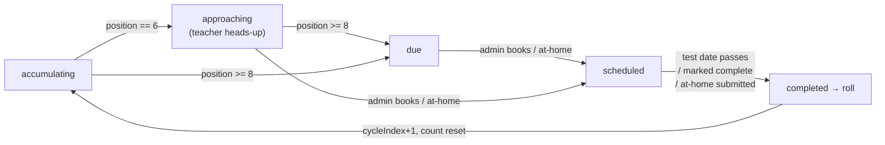

# Progress Tests

**Status: stable**

## Purpose

Progress Tests tracks how many classes each student has attended toward a recurring
progress test and drives the work around it: heads-up to the most-frequent teacher,
one-click parent outreach, the booking lifecycle, and a daily admin digest.

BeGifted's policy is one progress test every **8 attended-with-credit classes** — a
"block of 8". The system counts attendance per enrollment (a student in one class),
notifies the teacher when a student is approaching the mark, gives admins a prepared
bilingual LINE message and schedule-aware slot recommendations to book the test, and
rolls the counter once the test is done so the next block starts fresh.

It runs off existing data the app already syncs — attended-with-credit sessions come
from the active **Credit Control** snapshot, and teacher identity is resolved through the
active **Wise** snapshot's identity groups (the same recipe payroll uses). No new Wise
read pipeline; the only Wise *write* is an optional, flag-gated session-create when an
admin books a test (off by default → record locally and book manually).

The page is available at `/progress-tests`. Admins see every enrollment plus the
parent-outreach tooling; **teachers** get a read-only view scoped to their own students
(see [Access model](#access-model)). Exact endpoint contracts are in
[docs/reference/api/progress-tests.md](../reference/api/progress-tests.md); exact table
columns are in the Core ERD's [Progress Tests section](../reference/database/erd-core.md#progress-tests);
the two enums are in [enums.md](../reference/database/enums.md#progressteststatusenum--progress_test_status).

## Key Numbers

All defined in `src/lib/progress-tests/config.ts`:

| Constant | Value | Meaning |
|---|---|---|
| `PROGRESS_TEST_THRESHOLD` | `8` | Classes per block; a student is "due" at position 8. |
| `PROGRESS_TEST_APPROACHING_AT` | `6` | Position that flips a student to "approaching" and notifies the teacher. |
| `PROGRESS_TEST_COUNTING_START` | `2026-03-01` Asia/Bangkok | Inclusive start of the attendance window; earlier Wise data is unreliable and excluded. |
| `PROGRESS_TEST_DEFAULT_DURATION_MINUTES` | `60` | The dashboard collects a start time; the service derives the end. |

The **enrollment key** is `${wiseClassId}|${wiseStudentId}` (`buildEnrollmentKey`) — the
cycle-state primary key and the ledger grouping key.

## What "Attended-With-Credit" Means

A ledger/session row counts toward a block only when **all** hold
(`isAttendedWithCredit`, `engine.ts`):

- `meetingStatus` is `ENDED` (case-insensitive), and
- a positive credit was applied (`creditApplied > 0`), and
- it is a past session.

Rows flagged as the booked progress test itself (`isProgressTest`) are excluded from
counting, as is the booked test's own Wise session.

## The Cycle State Machine

Each enrollment has one durable `progress_test_cycle_state` row carrying its `cycleIndex`
(blocks already accounted for) and `currentCount` (**position within the current block of
8**, not the lifetime total). The pure engine (`computeEnrollmentCycle`, `engine.ts`)
recomputes status on every sync from `position = count − cycleIndex × 8`:

| Status | Condition |
|---|---|
| `accumulating` | Position is below the approaching mark and no test is scheduled. |
| `approaching` | Position is exactly **6** (and not first-observed) → also flags the teacher heads-up. |
| `due` | Position is **≥ 8** with no test scheduled. |
| `scheduled` | A future booked test exists, or an at-home test was selected but not yet submitted. |
| `completed` | A booked test's date has passed (the sync then rolls the cycle). |

### Fresh-start baseline (`D-09`-style cutover rule)

On an enrollment's **first observation** (no prior cycle state — true for every row on the
one-time re-baseline), the engine assumes the student is up-to-date:
`cycleIndex = floor(count / 8)`. So a long-standing student with 86 attended classes shows
`6/8`, *not* immediately "due" — a test becomes due only once they finish their **next**
block of 8 from now on. To avoid blasting the whole roster, a brand-new enrollment already
at/after the approaching mark (position ≥ 6) is treated as **already notified** for the
current block; heads-up resumes for future blocks.

## The Booking Lifecycle

A human admin confirms each booking; the write path (`booking.ts`) is **audited first,
fail-closed, and flag-gated**:

1. **Record the intent** — every attempt inserts a `progress_test_bookings` row (status
   `recorded`, `dryRun` true) carrying the intended Wise body + endpoint, *before* any
   network call.
2. **Resolve targets** — the Wise class id (from cycle state) and the most-frequent
   tutor's Wise user id. If either can't be resolved → finalize `manual_required`, advance
   cycle state to `scheduled` (manual mode), and stop. No Wise call.
3. **Availability pre-check** — `checkTeacherAvailabilityForSessions`; any reported
   conflict **aborts** (status `failed`). Never book over a conflict.
4. **Verified-flag gate** — `WISE_SESSION_CREATE_VERIFIED` is **off by default**: finalize
   `manual_required`, record locally, and an admin books it directly in Wise. When on,
   `scheduleWiseSession` performs the real create and finalizes `wise_created`.
5. **Advance** — set cycle state to `scheduled` (storing `bookedTestDate` /
   `bookedTestWiseSessionId` / mode), mark the matching ledger row `isProgressTest` (so it
   stops counting), and revalidate the cache tag.

The locally-stored booked test date drives the **automatic cycle reset** regardless of
whether Wise was actually written — so a dry-run/manual booking still rolls the cycle once
its date passes (handled in the nightly sync, `cycleResetTriggered`). This mirrors the LINE
dry-run gate in `src/lib/wise/operations.ts`.

### Scheduling methods and the at-home variant

`scheduleMethod` records how a test is being run: `after_class` (admin clicked a
recommended slot), `parent_pick` (custom time), or `at_home`.

The **at-home** path needs no Wise booking. `select-at-home` logs the choice and sets the
enrollment to `scheduled` (`atHomeSelectedAt = now`) — the student is no longer "due" while
the at-home test is outstanding. `mark-at-home-submitted` then rolls the cycle exactly like
a completed test. `mark-complete` is the admin's manual roll override (the primary reset is
automatic when a booked date passes).

## Notifications

### Teacher heads-up (at position 6)

When the sync sees an enrollment newly transition to `approaching`, it generates an **AI
summary** of the teacher's recent per-class feedback (`ai-summary.ts`, OpenAI Responses API,
fail-closed: sparse/disabled/error → no summary, never fabricated) and emails the
**most-frequent tutor** a single heads-up carrying that summary (`teacher-heads-up.ts`).
Recipient resolution prefers the tutor's onsite email, then online email. Tracking is
**idempotent per cycle** via `progress_test_email_runs` + `progress_test_notifications`
keyed on `progress-test:teacher:{enrollmentKey}:{cycleIndex}`, so a failed send retries to
success and a successful send stamps `teacherNotifiedAt`/`teacherNotifiedForCycle` so the
engine never re-notifies for that block. Admins can re-fire one heads-up via
`resend-email`.

### Parent LINE outreach (admin only)

For `approaching`/`due` rows that have a **verified** parent LINE link
(`line_contact_student_links` status `verified`, resolved exactly like Leave Requests), the
dashboard payload is enriched with the parent's chat URL, **schedule-aware recommended
slots**, and a prebuilt **bilingual (Thai-first) message** for one-click copy
(`recommend.ts`, `parent-message.ts`, `line.ts`). Recommended slots are drawn from the
student's upcoming classes over the next few class-days — a slot right after the day's last
class, plus any ≥ 1 hour gap between same-day classes — and every proposed slot is
**room-verified** (a physical room must be free), which matters on full weekends. Teacher
views skip this enrichment entirely.

### Daily admin digest

A once-daily email to **every `admin_users` recipient** (`admin-digest.ts`) lists students
newly approaching, students **due but not yet booked**, and an "Action needed" list of
teacher heads-up emails that could not be resolved (so an admin can fix the tutor contact
or notify manually). It is once-per-day idempotent on
`progress_test_admin_digest_runs.digest_date` (Bangkok); a terminal run row for the date
short-circuits a re-run, and "nothing to report" records a terminal `skipped` row without
sending.

## Sync (nightly tracker)

The orchestrator (`runProgressTestSync`, `sync.ts`) runs on the `25,55 * * * *` cron and is
**fail-isolated**:

1. Load attended-with-credit sessions from the **active Credit Control snapshot**.
2. Resolve each session's teacher via the **active Wise snapshot** identity groups (pulling
   raw Wise PAST sessions + teachers — the credit-control snapshot stores attendance but not
   teacher identity).
3. Upsert the durable **attendance ledger** (idempotent on `wiseSessionId + wiseStudentId`),
   flagging a row `isProgressTest` only when it is the enrollment's booked test.
4. Recompute cycle state per enrollment through the pure engine, compute the most-frequent
   tutor (ties break toward the most recent class), and upsert `progress_test_cycle_state`
   (handling resets).
5. For newly-approaching enrollments, generate the AI summary + send teacher heads-up
   emails — wrapped in its own try/catch so an AI/notification error **never fails the run**.
6. Record `approaching`/`due`/`notification` counts on the run row and sweep the cache tag.

The ledger and cycle-state tables are **cross-snapshot** (no `snapshot_id` FK) so counts
accumulate durably across credit-control snapshot rotations — the same deviation as
`room_utilization_sessions` and `past_session_blocks`. A single-flight guard over
`progress_test_sync_runs` (a partial unique index on `status = 'running'` plus a 20-minute
stale-recovery sweep) prevents overlapping runs; a skipped run returns `202`.

## Access model

Two roles are resolved at sign-in by `resolveUserAccess` (`src/lib/auth-access.ts`) and
persisted on the Auth.js token:

- **admin** — present in `admin_users`. `allowedPages = null` (full access) unless the row
  restricts it. Sees every enrollment plus parent-outreach tooling, and can perform all
  actions.
- **teacher** — not an admin, but the email matches an **active tutor contact**
  (`tutor_contacts`). `allowedPages = ["/progress-tests"]`, so middleware confines them to
  this one page (and its API namespace); everything else 403s/redirects. Anyone matching
  neither is denied sign-in (fail-closed).

Enforcement is layered:

- **Middleware** (`src/middleware.ts`) gates the route + `/api/progress-tests/*` namespace
  by `allowedPages`.
- **Page/handler guards** (`src/lib/progress-tests/api.ts`): `requireProgressTestsSession`
  throws `Unauthorized` (→ 401) without a session and `Forbidden` (→ 403) without page
  access; `requireProgressTestsAdminSession` additionally throws `Forbidden` for a teacher,
  so **every mutating route is admin-only** before any write.
- **Data scoping**: the GET handler resolves the teacher's canonical-key set fresh
  (`resolveTeacherCanonicalKeys`, covering split online/onsite identities) and filters rows
  to `mostFrequentTutorCanonicalKey ∈ that set`; an empty set yields zero rows
  (fail-closed). Admins (`null`) get all rows.

## Key Rules & Edge Cases

- **Fresh-start, not retroactive** — re-baselining never marks existing students "due" or
  re-blasts heads-up for blocks already in progress (see [the baseline rule](#fresh-start-baseline-d-09-style-cutover-rule)).
- **Fail-closed teacher resolution** — an enrollment whose counted classes have no
  resolvable teacher is still counted but surfaced as an `unresolved-teacher` issue (routes
  to "Needs Review" downstream rather than being silently dropped); it also can't be
  auto-booked (→ `manual_required`).
- **Never book over a conflict** — the availability pre-check aborts the booking.
- **Wise write is off by default** — `WISE_SESSION_CREATE_VERIFIED` gates the real
  session-create; until verified, bookings record locally and require a manual Wise booking.
- **Verified LINE links only** — parent outreach never surfaces an unconfirmed account.
- **Idempotent notifications** — per-cycle keys keep re-runs from re-sending; the digest is
  once-per-Bangkok-day.
- **Reads are uncached** — `getProgressTestsPayload` deliberately skips `"use cache"` so the
  table reflects book/mark-complete/resend actions immediately; the cache tag
  (`PROGRESS_TESTS_CACHE_TAG = "progress-tests"`) is still swept on sync/booking for any
  cached consumers.
- **All times Asia/Bangkok**; the dashboard renders D/M dates and HH:MM 24-hour times.

## UI

The workspace (`src/components/progress-tests/progress-tests-dashboard.tsx`) shows summary
cards (counts by status), a status-tab + subject + free-text filter bar, and a table of
enrollments sorted by current block position (highest first, so due/approaching surface at
the top). Status pills use the sky-blue palette. Admin row actions: **Book** (recommended
slot or custom time, with an online/offline modality choice since the location heuristic is
unreliable), **At home** / **Submitted**, **Mark complete**, **Resend email**, and **copy
parent message / open LINE chat** where a verified link exists. Teachers see the same table,
read-only and scoped to their students, with no booking or outreach controls.

## Tests

Coverage under `src/lib/progress-tests/__tests__/` and the route/component test dirs spans:
the pure counting engine (attended-with-credit rule, fresh-start baseline, block position,
reset precedence, approaching-suppression, unresolved-teacher issues); the booking lifecycle
(audit-first, availability abort, verified-flag gate, manual fallback, cycle roll, at-home
select/submit); teacher resolution and the heads-up email (idempotency, onsite→online email
fallback, unresolved rows); the AI summary (sparse/skipped/failed fail-closed paths); the
schedule-aware recommender (gap/after-class slots, room verification); the bilingual parent
message; the admin digest (once-per-day idempotency, skip-when-empty); the sync orchestrator
(ledger fold, teacher map, most-frequent tutor); teacher access scoping; the dashboard
filter/format helpers; and the six public routes + two internal cron routes.
