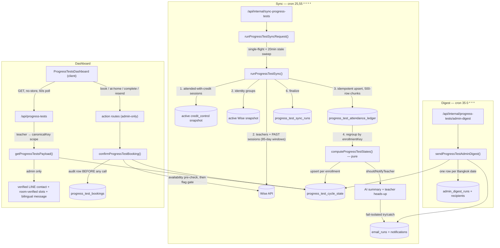

# Progress Tests

**Status: no maturity label is asserted here** — the maturity map supplied for this documentation pass was empty, and no `@deprecated` or status marker exists anywhere under `src/lib/progress-tests/`, so a badge is not derivable from code. What the tree proves: the feature is committed (`git log -1 -- src/lib/progress-tests/` → `3fc3502`, 2026-07-09), cron-scheduled twice ([`vercel.json:19`-`26`](../../vercel.json) — `25,55 * * * *` sync plus a `35 0 * * *` digest), nav-registered ([`src/lib/navigation/tools.ts:161`-`168`](../../src/lib/navigation/tools.ts)), and covered by thirteen test files. Its one Wise write capability is off by default ([`config.ts:49`-`51`](../../src/lib/progress-tests/config.ts)).

## Purpose

Progress Tests answers one operational question for every student-subject pair: *have they had eight classes since their last progress test, and what are we doing about it?*

BeGifted's teaching contract is that a student sits a progress test every eight attended classes. Before this feature that cadence lived in people's heads. Progress Tests turns it into a tracked lifecycle — `accumulating → approaching → due → scheduled → completed` — driven off a durable attendance ledger, and it drives three outbound nudges automatically:

1. At **class 6 of 8**, the student's most-frequent teacher gets a heads-up email carrying an AI summary of their own recent per-class feedback, so they can warn the student and prepare.
2. Every morning, all admins get a digest of who is approaching, who is due-and-unbooked, and which teacher heads-ups could not be delivered.
3. On the dashboard, an admin gets one-click parent outreach: a prebuilt bilingual (Thai-first) LINE message pre-loaded with room-verified after-class slots.

Two audiences use it:

- **Admin staff** (`/progress-tests`) — the full worklist plus every action: book a test into Wise, log an at-home test, mark complete, resend the teacher email, and open the parent's LINE chat with the message on the clipboard.
- **Teachers** — the same page, but read-only and scoped to their own students. Teachers are a first-class sign-in role in this app precisely because of this page; `/progress-tests` is the only route in a teacher's `allowedPages` JWT claim ([`src/lib/auth-access.ts:75`-`78`](../../src/lib/auth-access.ts)). It is *not* the only page a teacher can reach: Learning Plans deliberately bypasses `allowedPages` — middleware coarse-passes the `/learning-plans` page namespace for restricted users ([`src/middleware.ts:44`-`47`](../../src/middleware.ts)) and the fresh per-request DB check explicitly admits `role === "teacher"` ([`access-policy.ts:22`-`24`](../../src/lib/learning-plans/access-policy.ts), resolved at [`access.ts:89`-`110`](../../src/lib/learning-plans/access.ts) and gated in [`learning-plans/page.tsx:8`](../../src/app/%28app%29/learning-plans/page.tsx)). So a teacher additionally reaches `/learning-plans` when they hold a `learning_plan_access_grants` row *and* an active tutor contact. Those grants do not widen Progress Tests — a dedicated route-test block asserts exactly that ([`route.test.ts:295`](../../src/app/api/progress-tests/__tests__/route.test.ts)).

The defining design constraint is **durability across snapshot rotation**. Wise attendance is served through the Credit Control snapshot lineage, which is replaced wholesale every 30 minutes — each run inserts a fresh snapshot with `active: false`, writes its rows, then flips `active` to that id alone in one `UPDATE` ([`credit-control/sync.ts:661`-`702`](../../src/lib/credit-control/sync.ts); cadence `20,50 * * * *`, [`vercel.json:15`-`18`](../../vercel.json)). A class count that lived inside a snapshot would reset with it. Progress Tests therefore keeps its own cross-snapshot ledger, folding each newly-observed attended class in idempotently and never depending on a snapshot surviving.

## Conceptual data model

Eight tables, all prefixed `progress_test_`. Full column/index detail lives in [docs/reference/database/erd-core.md §5](../reference/database/erd-core.md#5-progress-tests) — this section covers only what each one *means*.

**The durable spine (cross-snapshot — no `snapshot_id`):**

- **`progress_test_attendance_ledger`** — one row per *(Wise session × student)* that was attended with credit on or after the counting-start date. This is the feature's system of record. It is deliberately snapshot-independent, following the `room_utilization_sessions` / `past_session_blocks` precedent noted in the schema ([`src/lib/db/schema.ts:2797`-`2810`](../../src/lib/db/schema.ts)). Each row also denormalizes the resolved teacher (Wise user id, teacher id, tutor canonical key, display name) so bookings and most-frequent-tutor maths never need to re-resolve identity. Two mutable flags decide whether a row counts: `is_progress_test` (this class *was* the test) and `counts_toward_cycle`.
- **`progress_test_cycle_state`** — one row per **enrollment key**, the feature's grain: `` `${wiseClassId}|${wiseStudentId}` `` ([`config.ts:35`-`37`](../../src/lib/progress-tests/config.ts)). It is a derived read-model — position within the current block of 8, `cycle_index` (how many blocks are already accounted for), lifecycle status, the booked/at-home test fields, the notification markers, the most-frequent tutor, and the last stored AI summary. Every *lifecycle* field the dashboard renders comes from this table; the ledger is never queried on the read path. (The remaining payload fields come from elsewhere: `lastSyncedAt` from `progress_test_sync_runs` ([`service.ts:183`-`195`](../../src/lib/progress-tests/service.ts)), and the admin-only parent-outreach fields from the LINE tables, the Credit Control snapshot, `future_session_blocks`, and the room catalog — see [Parent outreach enrichment](#parent-outreach-enrichment-admin-only).)

**Audit and side-effect tracking:**

- **`progress_test_bookings`** — one immutable-key row per booking attempt, including dry-runs and at-home selections, carrying the intended Wise endpoint + body as `request_payload`. The row is inserted **before** any network call ([`booking.ts:215`-`228`](../../src/lib/progress-tests/booking.ts)) and then finalized *in place* — a single `UPDATE` stamps its terminal status plus `dryRun`/`wiseSessionId`/`errorMessage`/`responsePayload` ([`booking.ts:558`-`579`](../../src/lib/progress-tests/booking.ts)). So the attempt itself is never erased or duplicated, but the row is not append-only in the literal sense.
- **`progress_test_email_runs`** + **`progress_test_notifications`** — the teacher heads-up trail, both keyed by a per-cycle idempotency key so a failed send retries to success rather than duplicating.
- **`progress_test_admin_digest_runs`** + **`progress_test_admin_digest_recipients`** — the daily admin digest, one run row per Bangkok date (the unique `digest_date` is the single-flight guard) plus per-recipient outcomes.
- **`progress_test_sync_runs`** — one row per sync attempt, with a partial unique index on `status = 'running'` acting as the single-flight lock.

**Tables read but never written:** the active Credit Control snapshot's sessions (attendance + teacher feedback + future class schedule), the active Wise snapshot's identity groups (teacher resolution) and `future_session_blocks` (room occupancy), `tutor_contacts` (teacher emails and teacher→canonical-key mapping), `line_contact_student_links` + `line_contacts` (verified parent LINE contact), the classroom catalog, and `admin_users` (digest recipients).

## API surface

Six session-authed endpoints under `/api/progress-tests` plus two cron routes. Full request/response contracts: [docs/reference/api/misc.md § Progress tests](../reference/api/misc.md#progress-tests) and [docs/reference/api/internal-crons.md](../reference/api/internal-crons.md).

| Endpoint | Purpose |
|---|---|
| `GET /api/progress-tests` | The whole dashboard payload — rows, lifecycle summary counts, subject facet, last-sync time. The only endpoint a teacher session may call. |
| `POST /api/progress-tests/book` | Admin-confirmed booking of a test at a given Bangkok instant (recommended slot or custom time). |
| `POST /api/progress-tests/select-at-home` | Log that the test will be taken at home — no Wise booking, but the student stops being "due". |
| `POST /api/progress-tests/mark-at-home-submitted` | Record that the at-home test came back, which rolls the cycle. |
| `POST /api/progress-tests/mark-complete` | Manual cycle roll for a scheduled test (the admin override of the automatic reset). |
| `POST /api/progress-tests/resend-email` | Re-send the teacher heads-up for one enrollment, reusing the stored AI summary. |
| `GET`/`POST /api/internal/sync-progress-tests` | The 30-minute sync (`25,55 * * * *`); `POST` also accepts **any signed-in session** for a manual rerun — there is no role or capability check, and `admin` is only the audit label ([`route.ts:19`-`31`, `45`-`47`](../../src/app/api/internal/sync-progress-tests/route.ts)). See [open question 7](#open-questions). |
| `GET /api/internal/progress-tests/admin-digest` | The daily admin digest (`35 0 * * *` = 07:35 Bangkok). |

All six app routes share the guards in [`src/lib/progress-tests/api.ts`](../../src/lib/progress-tests/api.ts): `requireProgressTestsSession()` for the read, `requireProgressTestsAdminSession()` for **every** mutation, and `progressTestsErrorResponse()` mapping `Unauthorized → 401`, `Forbidden → 403`, anything else → 500.

## UI

**Page:** [`src/app/(app)/progress-tests/page.tsx`](../../src/app/%28app%29/progress-tests/page.tsx) — a thin async Server Component that resolves the session guard (redirecting to `/login` on `Unauthorized`), renders the client shell inside `<Suspense>` with a skeleton, and passes only the minimal `{ email, name, role }` user down.

**Component:** [`src/components/progress-tests/progress-tests-dashboard.tsx`](../../src/components/progress-tests/progress-tests-dashboard.tsx) — one client component holding the whole workspace:

- Four summary cards (Approaching / Due / Scheduled / Completed), a status tab bar, a subject select, and a free-text search over student, parent, and teacher (`filterRows`, `dashboard.tsx:90`-`112`).
- A table row per enrollment: a `count/8` label next to one continuous fill bar (a single track whose width is `count/threshold` clamped to `[0, 100]%` — not segmented, `dashboard.tsx:154`-`166`), the most-frequent teacher, the parent LINE button, the notified marker, the status pill with a method sub-label ("At home", "After class · Tesla", "Parent's time"), the last class date, and an expandable one-line AI-summary preview.
- **Book dialog** (`dashboard.tsx:211`-`355`): room-verified recommended slots as one-click buttons, an "at home" button, and a custom Bangkok `datetime-local` + modality + location fallback. The custom path is fail-closed — confirm stays disabled until a date is set and, for offline, a location is entered (`dashboard.tsx:230`-`231`).
- **Parent outreach** (`dashboard.tsx:584`-`597`): copies the prebuilt bilingual message and opens the LINE chat in the same click handler, so the clipboard write keeps its user gesture.

Data loading mirrors Credit Control: an initial fetch plus a 60-second poll that is skipped when the document does not have focus (`dashboard.tsx:401`-`448`). Each action patches the returned row into local state immediately, then triggers a background refetch (`dashboard.tsx:499`-`525`).

**Teacher view:** a single `isTeacher` flag hides the Parent (LINE) and Actions columns entirely (`dashboard.tsx:378`, `740`, `745`) — cosmetic only; the server-side admin guard is the real wall.

**Elsewhere:** the feature is registered as a nav tool with badge key `progressTests` ([`src/lib/navigation/tools.ts:161`-`168`](../../src/lib/navigation/tools.ts)), and the home hub surfaces `due + approaching` as an action count ([`src/lib/home/summary.ts:109`-`122`](../../src/lib/home/summary.ts)).

## Data flow

The sync is a consumer of two other syncs' outputs — Credit Control for attendance, the Wise snapshot for teacher identity — which is why its cron slot (`:25/:55`) sits after both.

```mermaid
flowchart TD
  subgraph Sync["Sync — cron 25,55 * * * *"]
    Cron["/api/internal/sync-progress-tests"] --> RSR["runProgressTestSyncRequest()"]
    RSR -->|"single-flight + 20min stale sweep"| RPS["runProgressTestSync()"]
    RPS -->|"1. attended-with-credit sessions"| CC[("active credit_control snapshot")]
    RPS -->|"2. teachers + PAST sessions (85-day windows)"| WISE[("Wise API")]
    RPS -->|"2. identity groups"| WSNAP[("active Wise snapshot")]
    RPS -->|"3. idempotent upsert, 500-row chunks"| LEDGER[("progress_test_attendance_ledger")]
    LEDGER -->|"4. regroup by enrollmentKey"| ENGINE["computeProgressTestStates() — pure"]
    ENGINE -->|"upsert per enrollment"| STATE[("progress_test_cycle_state")]
    ENGINE -->|"shouldNotifyTeacher"| NOTIFY["AI summary + teacher heads-up"]
    NOTIFY -->|"fail-isolated try/catch"| EMAIL[("email_runs + notifications")]
    RPS -->|"6. finalize"| RUN[("progress_test_sync_runs")]
  end

  subgraph Digest["Digest — cron 35 0 * * *"]
    DCron["/api/internal/progress-tests/admin-digest"] --> DIG["sendProgressTestAdminDigest()"]
    DIG --> STATE
    DIG --> EMAIL
    DIG -->|"one row per Bangkok date"| DRUNS[("admin_digest_runs + recipients")]
  end

  subgraph Read["Dashboard"]
    UI["ProgressTestsDashboard (client)"] -->|"GET, no-store, 60s poll"| API["/api/progress-tests"]
    API -->|"teacher → canonicalKey scope"| SVC["getProgressTestsPayload()"]
    SVC --> STATE
    SVC -->|"admin only"| ENRICH["verified LINE contact + room-verified slots + bilingual message"]
    UI -->|"book / at-home / complete / resend"| ACT["action routes (admin-only)"]
    ACT --> BOOK["confirmProgressTestBooking()"]
    BOOK -->|"audit row BEFORE any call"| BOOKS[("progress_test_bookings")]
    BOOK -->|"availability pre-check, then flag gate"| WISE
    BOOK --> STATE
  end
```

The pure counting engine ([`engine.ts`](../../src/lib/progress-tests/engine.ts)) has no DB or Next imports — the orchestrator hands it pre-fetched ledger rows plus prior cycle state and gets back `{ result, issues }`, the standard pipeline shape used across this codebase.

## Business rules & edge cases

### What counts as a class

A ledger row counts only when the session is `meetingStatus = ENDED`, `creditApplied > 0`, and a *past* session ([`engine.ts:93`-`101`](../../src/lib/progress-tests/engine.ts)). The same three predicates are pushed into the source query ([`db.ts:89`-`95`](../../src/lib/progress-tests/db.ts)), so a cancelled or zero-credit class never reaches the ledger at all. Counting starts at **2026-03-01 Bangkok** — the post-migration boundary shared with room utilization; earlier Wise data is unreliable and is excluded ([`config.ts:5`-`8`](../../src/lib/progress-tests/config.ts)). The window is re-checked defensively inside the engine even though the ledger should never hold an earlier row ([`engine.ts:280`](../../src/lib/progress-tests/engine.ts)).

The threshold is **8**, the teacher heads-up fires at **6** ([`config.ts:11`-`14`](../../src/lib/progress-tests/config.ts)).

### The fresh-start baseline (the subtlest rule in the feature)

The engine tracks a *lifetime* attended count and a `cycleIndex` (blocks already accounted for). Position in the current block is `count − cycleIndex × 8`. On **first observation** of an enrollment, `cycleIndex` is seeded to `floor(count / 8)` ([`engine.ts:186`-`188`](../../src/lib/progress-tests/engine.ts)), which assumes the student is up to date. A student with 86 lifetime classes therefore shows 6/8 and is *not* instantly "due"; they become due only after completing their next block of 8 from that moment on.

Paired with this is **cutover suppression**: a brand-new enrollment already at or past the approaching mark is treated as already-notified for that block, so re-baselining the whole roster never blasts teachers with heads-up emails ([`engine.ts:209`-`210`](../../src/lib/progress-tests/engine.ts), and the persisted `teacherNotifiedForCycle` marker at [`sync.ts:362`-`392`](../../src/lib/progress-tests/sync.ts)).

### Status precedence

Evaluated in this order ([`engine.ts:172`-`213`](../../src/lib/progress-tests/engine.ts)):

1. **Booked test date has passed** → account the block (`cycleIndex + 1`), status `completed`, `cycleResetTriggered`. This is the automatic reset; it wins over everything.
2. **At-home selected but not submitted** → `scheduled` (an at-home test in flight suppresses "due" and suppresses re-notification).
3. **Booked test in the future** → `scheduled`.
4. **Position ≥ 8** → `due`.
5. **Position exactly 6** → `approaching`, and notify unless already notified for this `cycleIndex`.
6. Otherwise `accumulating`.

Note that `approaching` is an *equality* test on 6, not a range — a student who jumps from 5 to 7 between syncs never enters `approaching` and never triggers the heads-up email; they land in `accumulating` at 7 and then `due` at 8.

Displayed position is clamped to `[0, 8]`, so an overdue student reads 8/8 rather than 11/8 ([`engine.ts:123`-`127`](../../src/lib/progress-tests/engine.ts)).

### Fail-closed behaviour

- **Unresolved teacher.** An enrollment with counted classes but no resolvable tutor canonical key emits an `unresolved-teacher` issue rather than being silently dropped; the count is still tracked, and the issue is surfaced as `unresolvedTeacherCount` on the run row ([`engine.ts:246`-`258`](../../src/lib/progress-tests/engine.ts)). The teacher heads-up for such a row records an `unresolved` notification with **no send and no notified stamp** ([`teacher-heads-up.ts:290`-`317`](../../src/lib/progress-tests/teacher-heads-up.ts)), which then surfaces in the daily admin digest's "Action needed" section ([`admin-digest.ts:130`-`137`](../../src/lib/progress-tests/admin-digest.ts)).
- **Wise availability conflict.** Before any create, the booking path calls the Wise availability check and aborts with status `failed` if *any* returned session carries `conflict` or `hasConflict` — the system never books over a reported conflict ([`booking.ts:115`-`119`, `262`-`286`](../../src/lib/progress-tests/booking.ts)).
- **Malformed stored AI summary.** The summary is persisted as untyped `jsonb`; the read path returns `null` unless all four fields carry the right primitive shapes, so a bad blob shows no summary rather than breaking the row ([`service.ts:103`-`123`](../../src/lib/progress-tests/service.ts)).
- **Teacher scoping.** A teacher whose email resolves to zero canonical keys sees **zero rows**, not all rows — an empty allow-set filters everything out ([`service.ts:279`-`284`](../../src/lib/progress-tests/service.ts), [`teacher-access.ts:64`](../../src/lib/progress-tests/teacher-access.ts)).

### The Wise write gate

Progress Tests is the only feature that creates Wise sessions, and it is gated the same way LINE's write path is. `WISE_SESSION_CREATE_VERIFIED` defaults off ([`config.ts:49`-`51`](../../src/lib/progress-tests/config.ts)); with the flag off, `confirmProgressTestBooking` records the intent, runs the availability check, then finalizes as `manual_required` with **no Wise call**, telling the admin to book it manually ([`booking.ts:289`-`307`](../../src/lib/progress-tests/booking.ts)).

Critically, **the local cycle advances either way**: the stored `bookedTestDate` drives the automatic reset regardless of whether Wise was actually written, so a dry-run or manual booking still rolls the cycle once the date passes ([`booking.ts:6`-`8`](../../src/lib/progress-tests/booking.ts)). Booking also short-circuits to `manual_required` when the Wise class id or the teacher's Wise user id cannot be resolved ([`booking.ts:232`-`260`](../../src/lib/progress-tests/booking.ts)).

The audit row is always inserted **before** any network call, carrying the intended endpoint and body ([`booking.ts:214`-`228`](../../src/lib/progress-tests/booking.ts)).

### AI summary — fail-closed on content

`generateProgressTestSummary` never fabricates. With fewer than 2 non-empty notes or under 80 characters of combined feedback it returns `sparse` **before making any API call**; with no key or `ENABLE_AI_SCHEDULER=false` it returns `skipped`; any HTTP/parse/schema failure returns `failed` ([`ai-summary.ts:161`-`254`](../../src/lib/progress-tests/ai-summary.ts)). Only `ok` produces a stored summary; every other outcome falls back to a graceful "not enough recent feedback" line in the email ([`teacher-heads-up.ts:120`-`126`](../../src/lib/progress-tests/teacher-heads-up.ts)). At most the last 8 notes are sent, each truncated to 1500 characters ([`ai-summary.ts:23`-`29`](../../src/lib/progress-tests/ai-summary.ts)). The module's contract is that feedback text is never logged — only the error message and a note count.

Model selection: `OPENAI_PROGRESS_TEST_MODEL`, falling back to the AI scheduler's default ([`ai-summary.ts:87`-`89`](../../src/lib/progress-tests/ai-summary.ts)).

### Idempotency and isolation

- **Ledger upsert** conflicts on `(wiseSessionId, wiseStudentId)` and refreshes only the mutable attendance fields, preserving first-observation provenance (`firstObservedSnapshotId` / `capturedAt`) so the ledger stays a durable record of *when* each class was first seen ([`db.ts:242`-`266`](../../src/lib/progress-tests/db.ts)).
- **Chunking at 500 rows** keeps every insert at ~8,000 bound parameters. The comment is explicit that an un-chunked full-snapshot append exceeds Postgres's 65,535 parameter limit at runtime — a failure mode unit tests with a handful of rows would miss ([`db.ts:223`-`227`](../../src/lib/progress-tests/db.ts)).
- **Wise PAST-session fetch is windowed at 85 days.** The constant and the stitching loop are in code ([`sync.ts:71`](../../src/lib/progress-tests/sync.ts) and the windowed fetch at [`sync.ts:124`-`157`](../../src/lib/progress-tests/sync.ts), covered by [`sync.test.ts:497`](../../src/lib/progress-tests/__tests__/sync.test.ts)); boundary duplicates are harmless because consumers key by session id. The *reason* for the 85 is a code comment, not something this repo can prove: it records that Wise rejects ranges of roughly 100+ days with "Invalid start or end date!", observed in production on 2026-06-10 once the counting window crossed 100 days ([`sync.ts:67`-`70`](../../src/lib/progress-tests/sync.ts)). Neither the Wise-side error nor that date is derivable from the tree.
- **Notification idempotency** is `progress-test:teacher:{enrollmentKey}:{cycleIndex}`, shared by the email run, the notification row, and the Apps Script send, upserted so a failed send retries to success on a later run ([`teacher-heads-up.ts:82`-`84`](../../src/lib/progress-tests/teacher-heads-up.ts)).
- **The notification step is fail-isolated.** An AI or email error is caught and logged and never fails the sync run ([`sync.ts:571`-`577`](../../src/lib/progress-tests/sync.ts)). Within it, each enrollment is individually try/caught so one bad recipient never aborts the rest ([`teacher-heads-up.ts:414`-`430`](../../src/lib/progress-tests/teacher-heads-up.ts)).
- **A top-level sync failure fails only the run row.** Per-row upserts are idempotent, so the next pass self-heals ([`sync.ts:610`-`632`](../../src/lib/progress-tests/sync.ts)).
- **Single flight**: a `running` row older than 20 minutes is swept to `failed`; a live `running` row returns HTTP **202** with a "already running" payload rather than starting a second pass ([`config.ts:27`](../../src/lib/progress-tests/config.ts), [`run-sync-request.ts:48`-`135`](../../src/lib/progress-tests/run-sync-request.ts)).
- **Digest**: any existing run row for today's Bangkok date — including `skipped` — is terminal and short-circuits a re-run; nothing to report writes a terminal `skipped` row instead of sending ([`admin-digest.ts:229`-`236`, `333`-`358`](../../src/lib/progress-tests/admin-digest.ts)).

### Teacher identity resolution

Two mechanisms, both worth knowing:

- **Session → tutor** uses the payroll recipe: index identity-group members by Wise user id *and* by Wise teacher id, then resolve a session's teacher reference through both, falling back to the Wise teacher's own display name. A session's teacher reference may be either form, so both indexes are consulted; unresolved sessions still get a map entry with null identity ([`sync.ts:171`-`213`](../../src/lib/progress-tests/sync.ts)). Payroll builds the same three indexes and chains the same lookups ([`payroll/sync.ts:283`-`319`](../../src/lib/payroll/sync.ts)); Progress Tests adds one extra tolerance — a direct `identityByTeacherId` hit on the raw reference — for sessions whose teacher field already holds a teacher id ([`sync.ts:203`](../../src/lib/progress-tests/sync.ts)).
- **Login email → tutor** bridges split online/onsite identities. A tutor often has two Wise accounts; when they share an extracted nickname the identity resolver merges them into one canonical key, but when they don't (no nickname, inconsistent "… Online" naming) they split. `resolveTeacherCanonicalKeys` seeds from matched `tutor_contacts` rows, then adds any active identity group whose display name or member name matches the contact's `displayName`/`sourceNames`, so the onsite email surfaces the online account's students too ([`teacher-access.ts:41`-`114`](../../src/lib/progress-tests/teacher-access.ts)).

**Most-frequent tutor** is tallied over counted rows in the current cycle only, with ties broken toward the tutor of the most recent class ([`sync.ts:285`-`324`](../../src/lib/progress-tests/sync.ts)).

### Reads are deliberately uncached

`getProgressTestsPayload()` intentionally does **not** use Next's `"use cache"`: the book/complete/resend actions mutate cycle state in place, and a cached read would serve stale rows immediately after an action ([`service.ts:1`-`14`](../../src/lib/progress-tests/service.ts)).

### Parent outreach enrichment (admin only)

Only rows that are `approaching` or `due` **and** have a **verified** `line_contact_student_links` row get slots and a message ([`service.ts:218`-`241`](../../src/lib/progress-tests/service.ts), [`line.ts:26`-`62`](../../src/lib/progress-tests/line.ts)). Unverified LINE links are never surfaced for outreach. The cost is bounded: one LINE query ([`line.ts:33`-`50`](../../src/lib/progress-tests/line.ts)) plus **five** batched queries shared across every eligible student, not per row — the active credit-control snapshot lookup, that snapshot's FUTURE sessions for all eligible students, the active Wise snapshot lookup, `future_session_blocks`, and the room catalog ([`db.ts:463`-`538`](../../src/lib/progress-tests/db.ts)). (The source comment's "~2-3" undercounts the snapshot-lookup round trips.)

Recommended slots draw from the next 3 class-days within a 14-day window, proposing a slot right after the day's last class plus any ≥60-minute same-day gap, capped at 6 slots. **Every slot is room-verified** — a candidate with no free physical room is dropped entirely, which matters on weekends when rooms are full ([`recommend.ts:117`-`179`](../../src/lib/progress-tests/recommend.ts)). Room matching normalizes case and a trailing `(TV)` suffix ([`recommend.ts:49`-`51`](../../src/lib/progress-tests/recommend.ts)), and online-only rooms are excluded from the catalog ([`db.ts:532`-`536`](../../src/lib/progress-tests/db.ts)).

The parent message is **Thai first, then English**, because the recipients are Thai-speaking parents; it offers exactly three options — after class (with the verified slots inline), at home, or a parent-chosen time ([`parent-message.ts:32`-`75`](../../src/lib/progress-tests/parent-message.ts)).

### Digest content rules

Only *actionable* due rows are listed: a `due` row that already has a booked Wise session id is excluded as already handled ([`admin-digest.ts:125`-`127`](../../src/lib/progress-tests/admin-digest.ts)). Recipients are every `admin_users` row; zero recipients finalizes the run as `failed` with an explicit message rather than silently succeeding ([`admin-digest.ts:389`-`403`](../../src/lib/progress-tests/admin-digest.ts)).

## Tests

Thirteen test files, all under sibling `__tests__/` directories.

**Domain — [`src/lib/progress-tests/__tests__/`](../../src/lib/progress-tests/__tests__/):**

| File | Covers |
|---|---|
| `engine.test.ts` | The counting rules end to end: the 2026-03-01 window, exclusion of progress-test rows and the booked session, the fresh-start baseline (86 → 6/8; 88 → 0/8, not due), approaching + notify-once, due/scheduled/at-home precedence, the position clamp at 8, the reset when a booked date passes, and unresolved-teacher issues. |
| `sync.test.ts` | The orchestrator: idempotent ledger upsert, booked-test flagging from prior state, teacher resolution via the active Wise snapshot, unresolved-teacher counting, cycle rollover, due/approaching counts, the heads-up step firing with its AI summary, no re-notification within a cycle, fail-isolation of a throwing heads-up step, run-row failure on a thrown step, plus `fetchWisePastSessions` 85-day windowing and `computeMostFrequentTutor` tie-breaking. |
| `booking.test.ts` | Flag-off records with **no** Wise call; fail-closed abort on an availability conflict; flag-on creates and stores the session id; the booked ledger row is flagged; `manual_required` when the teacher user id cannot be resolved; the at-home select/submit lifecycle. |
| `teacher-heads-up.test.ts` | One send + notified stamp, onsite→online email fallback, `unresolved` rows with no send and no stamp, failed-send without a stamp, fire-and-forget isolation across enrollments, stable per-cycle idempotency key, and both the AI-summary and fallback email bodies. |
| `ai-summary.test.ts` | `skipped` with no fetch when unconfigured, `sparse` with no fetch below the note/character floors, `failed` on bad JSON / schema mismatch / non-OK HTTP, `ok` on valid structured output, and the 8-note cap. |
| `admin-digest.test.ts` | Skip-and-record when there is nothing to report, same-date short-circuit, one send per admin, exclusion of already-booked due rows, the unresolved "Action needed" section, partial runs, the no-recipients failure, and unique-conflict handling. |
| `recommend.test.ts` | After-class and ≥1h gap slots, sub-hour gaps rejected, busy-room skipping, slots dropped when every room is busy, `(TV)`/case-insensitive room matching, past-class exclusion, and the 3-day / max-slot caps. |
| `teacher-access.test.ts` | Merged-nickname single key, the split-identity bridge, case-insensitive online-email match, `[]` for unknown/empty emails, and graceful behaviour with no active snapshot. |
| `db.test.ts` | Insert chunking, including a 5,537-row real-world snapshot, and the empty-input no-op. |
| `api.test.ts` | `hasPageAccess` prefix semantics (including that a substring is not a prefix) and the session/admin guards. |
| `run-sync-request.test.ts` | Run acquisition, the 202 single-flight skip, stale-run reporting, and the 500 on sync failure. |

**Routes** — [`src/app/api/progress-tests/__tests__/route.test.ts`](../../src/app/api/progress-tests/__tests__/route.test.ts): the payload read, teacher scoping vs. admin `null`, 401/403/500 mapping, 400 on invalid bodies, 404 on unknown enrollments, and a dedicated block asserting that Learning Plans teacher grants do not expand Progress Tests access — those teachers stay student-scoped and every mutation returns 403.

**Component** — [`src/components/progress-tests/__tests__/progress-tests-dashboard.test.tsx`](../../src/components/progress-tests/__tests__/progress-tests-dashboard.test.tsx): the exported pure helpers (`filterRows`, `statusTone`, `aiSummaryPreview`) and the presentational pieces (`ProgressBar` clamping, `StatusBadge`, `SummaryCards`).

## Open questions

1. **Is `markProgressTestBookedManually` dead code?** It is exported from [`booking.ts:364`](../../src/lib/progress-tests/booking.ts) with a full implementation (records a `manual_confirmed` booking, sets cycle state, flags the ledger row) but has **no caller and no test** anywhere in the repo. It looks like the intended companion to the `manual_required` gate — "I booked it in Wise myself, here's the session id" — that never got an endpoint. Should it get one, or be removed?

2. **The `book` route accepts `modality` and discards it.** `BookProgressTestSchema` parses `modality: "online" | "offline"` ([`book/route.ts:10`](../../src/app/api/progress-tests/book/route.ts)) and the dialog sends it, but the handler never forwards it to `bookTest` ([`book/route.ts:31`-`37`](../../src/app/api/progress-tests/book/route.ts)) and nothing persists it. In practice modality is inferred only from whether a location was supplied. Intentional (modality is meaningful only as "did you give me a room?") or a dropped field?

3. **The `progress-tests` cache tag has no consumer.** Nine call sites revalidate `PROGRESS_TESTS_CACHE_TAG`, but no module declares `cacheTag("progress-tests")` — consistent with the deliberate no-`"use cache"` decision in `service.ts`. Are the `revalidateTag` calls vestigial, or reserved for a planned cached read path?

4. **`isAttendedWithCredit` is exported and tested but never called in the pipeline.** The predicate lives at [`engine.ts:93`](../../src/lib/progress-tests/engine.ts) and is duplicated as SQL in [`db.ts:89`-`95`](../../src/lib/progress-tests/db.ts); the engine itself filters on the persisted `countsTowardCycle` flag instead. Is it documentation-by-code for the locked rule, or should one of the two be the single source of truth?

5. **`dry_run` is declared in `progress_test_booking_status` but never written.** The booking path only writes `recorded`, `manual_required`, `failed`, `wise_created`, and `manual_confirmed`. Is `dry_run` reserved for a future state, or a leftover from mirroring the LINE write-path enum?

6. **`approaching` is an exact equality on position 6.** A student who gains 2+ counted classes between two syncs skips 6 entirely and never triggers the teacher heads-up for that cycle. Given that the sync runs every 30 minutes this should be rare, but is a `>=`-with-notified-marker rule the intended semantics, or is the strict equality deliberate?

7. **`POST /api/internal/sync-progress-tests` accepts any signed-in session** — `allowSessionAuth: true` with no role or capability check beyond "is signed in" ([`sync-progress-tests/route.ts:19`-`31`](../../src/app/api/internal/sync-progress-tests/route.ts)). Since teachers are now real sessions in this app, a teacher can trigger a full sync. Is that the intended blast radius?

8. **The `progress_tests` and `progress_tests_digest` cron keys are registered but have no Data Health run branch** — neither key appears in [`run-job.ts`](../../src/lib/data-health/run-job.ts), so a Data Health run request falls through to its `404 Unknown job` (`run-job.ts:195`). The bearer-curl path — plus, for the sync only, the signed-in session `POST` covered in open question 7 — is therefore the manual trigger; the digest is `GET`-only behind `rejectInvalidCronSecret` ([`admin-digest/route.ts:8`-`10`](../../src/app/api/internal/progress-tests/admin-digest/route.ts)), so for it the bearer curl really is the only path (noted in [docs/reference/crons.md](../reference/crons.md)). Worth wiring up, or intentionally left cron-only?

_Verified against HEAD + uncommitted WIP on 2026-05-31._
