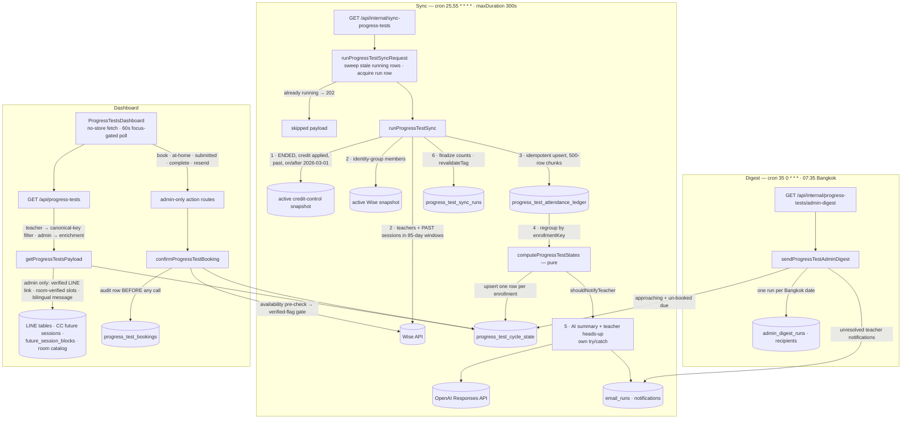

# Progress Tests

**Status: stable**

What the badge rests on: the feature has been committed and functionally unchanged since its
2026-06 build-out. `git log -- src/lib/progress-tests` lists exactly seven commits — `7a13490`
tracker + teacher heads-up, `53276e6` chunked ledger insert, `029217c` fresh-start baseline,
`1574bb1` parent LINE outreach, `a530d10` teacher logins, `cd1625e` 85-day Wise windows, and
`3fc3502`, which reached into this directory only to widen `api.ts` (+11/−2) as part of the
admissions phase-1 foundation. One later commit outside that directory, `4975a2d`, added the
learning-plans access block to `src/app/api/progress-tests/__tests__/route.test.ts` (+50 lines)
and changed no source file. It is cron-scheduled twice
([`vercel.json:20`-`27`](../../vercel.json)), nav-registered with a live count badge
([`src/lib/navigation/tools.ts:162`-`169`](../../src/lib/navigation/tools.ts)), surfaced on the home
hub ([`src/lib/home/summary.ts:109`-`122`](../../src/lib/home/summary.ts)), tracked by Data Health
([`src/lib/data-health/cron-registry.ts:129`-`158`](../../src/lib/data-health/cron-registry.ts)),
and covered by 13 test files. Its one Wise **write** capability is opt-in and off by default behind
`WISE_SESSION_CREATE_VERIFIED` ([`config.ts:49`-`51`](../../src/lib/progress-tests/config.ts));
everything else it does toward Wise is read-only.

## Purpose

BeGifted's teaching contract is that a student sits a **progress test every eight attended
classes**. Progress Tests turns that cadence into a per-enrollment lifecycle —
`accumulating → approaching → due → scheduled → completed`
([`types.ts:8`-`13`](../../src/lib/progress-tests/types.ts)) — computed from attendance the
school already records in Wise, and drives the three nudges around it:

1. **Teacher heads-up at class 6 of 8.** The student's most-frequent tutor is emailed once per
   cycle, with an AI summary of the recent per-class feedback recorded on that *enrollment* —
   whichever tutors taught it, since the note query filters by enrollment key and never by tutor
   ([`db.ts:134`-`156`](../../src/lib/progress-tests/db.ts)) — so they can warn the student and
   prepare the test ([`teacher-heads-up.ts:1`-`19`](../../src/lib/progress-tests/teacher-heads-up.ts)).
2. **Daily admin digest at 07:35 Bangkok.** Every `admin_users` address receives who is
   approaching, who is due but not yet booked, and which teacher heads-ups could not be delivered
   ([`admin-digest.ts:1`-`16`](../../src/lib/progress-tests/admin-digest.ts)).
3. **One-click parent outreach.** For approaching/due students with a verified parent LINE link,
   the dashboard prebuilds a Thai-first bilingual message that embeds room-verified after-class test
   slots, copies it to the clipboard and opens the parent's LINE chat
   ([`service.ts:197`-`242`](../../src/lib/progress-tests/service.ts),
   [`parent-message.ts:24`-`75`](../../src/lib/progress-tests/parent-message.ts)).

**Who uses it.** Two roles reach `/progress-tests`:

- **Admins** see every enrollment and own every action: book a test (into Wise when the write flag
  is verified, otherwise recorded locally), log an at-home test and its submission, force a cycle
  roll, resend the teacher email, and open the parent chat.
- **Teachers** are a sign-in role that exists *because of this page*. An email that is not in
  `admin_users`, is not an active `admissions_counselors` row — that branch is evaluated first and
  wins outright — and matches an active `tutor_contacts` row is admitted as `role: "teacher"` with
  `allowedPages: ["/progress-tests"]` ([`src/lib/auth-access.ts:70`-`73`, `75`-`78`](../../src/lib/auth-access.ts)).
  They get the same table, read-only, filtered to enrollments whose *most-frequent* tutor is one of
  their canonical keys ([`route.ts:11`-`13`](../../src/app/api/progress-tests/route.ts),
  [`service.ts:279`-`284`](../../src/lib/progress-tests/service.ts)). Every mutation route rejects
  a teacher with 403 before any write ([`api.ts:66`-`72`](../../src/lib/progress-tests/api.ts)).

**The defining constraint is durability across snapshot rotation.** Attendance arrives through
the Credit Control snapshot lineage, which is rewritten wholesale on every credit-control sync — a
fresh snapshot is inserted and a single `UPDATE` flips `active` to that id alone
([`credit-control/sync.ts:715`](../../src/lib/credit-control/sync.ts)) — and that lineage keeps
only a bounded past window (`PAST_WINDOW_DAYS = 120`,
[`credit-control/sync.ts:61`](../../src/lib/credit-control/sync.ts)). A class count that lived
inside a snapshot would therefore both reset on rotation and forget classes older than four months.
Progress Tests instead keeps its own **cross-snapshot attendance ledger** and **cycle-state**
tables — no `snapshot_id` FK, idempotent upserts keyed by stable Wise identifiers — folding each
newly observed attended class in and never depending on any snapshot surviving. The schema records
this as a deliberate deviation from the project's snapshot-scoped convention, with
`past_session_blocks` and `room_utilization_sessions` as precedent
([`schema.ts:2800`-`2813`](../../src/lib/db/schema.ts)).

## Conceptual data model

Eight `progress_test_*` tables and two enums. Columns, indexes and FKs live in
[`erd-progress-tests.md`](../reference/database/erd-progress-tests.md#tables), the table
inventory in [`database/index.md`](../reference/database/index.md), and the enum values in
[`enums.md` § Progress tests](../reference/database/enums.md#progress-tests). Migrations:
`drizzle/0038_cynical_karma.sql` (all eight tables plus both enums) and
`drizzle/0039_overrated_krista_starr.sql` (the `schedule_method`, `booked_test_location` and
at-home columns on cycle state). This section says what each table *means*.

**The durable spine — cross-snapshot, no `snapshot_id`:**

- **`progress_test_attendance_ledger`** — the system of record. One row per *(Wise session ×
  student)* attended with credit on or after the counting start, keyed by the stable
  `(wiseSessionId, wiseStudentId)` pair and only ever upserted
  ([`db.ts:242`-`266`](../../src/lib/progress-tests/db.ts)); nothing in the feature deletes from
  it. Each row denormalizes the resolved teacher (Wise user id, Wise teacher id, tutor canonical key,
  display name) so the booking path and the most-frequent-tutor tally never re-resolve identity. Two
  booleans decide counting: `isProgressTest` (this session *was* the test) and `countsTowardCycle`.
- **`progress_test_cycle_state`** — one row per **enrollment**, the feature's grain:
  `` `${wiseClassId}|${wiseStudentId}` `` ([`config.ts:29`-`37`](../../src/lib/progress-tests/config.ts)).
  A derived read model rewritten by every sync. Three of its fields carry the rules the rest of
  this doc turns on — `currentCount` + `cycleIndex` (position inside the current block of 8, and
  the blocks already accounted for), `status`, and `teacherNotifiedForCycle` (the notify-once
  marker). The booked / at-home, most-frequent-tutor, last-class-date and cached-AI-summary
  columns are inventoried in
  [`erd-progress-tests.md`](../reference/database/erd-progress-tests.md#tables). Of the feature's
  own tables, the dashboard reads only this one plus the latest `progress_test_sync_runs`
  timestamp — the ledger is never touched on the read path
  ([`service.ts:262`-`300`](../../src/lib/progress-tests/service.ts)). The **admin** read path
  additionally reads the cross-feature tables listed under *Read but never written* below, via
  `enrichRowsWithParentOutreach`
  ([`service.ts:209`-`241`, `286`](../../src/lib/progress-tests/service.ts)).

**Audit and side-effect trails:**

- **`progress_test_bookings`** — one row per booking *attempt*: Wise create, flag-off dry run,
  at-home selection, at-home submission. For the **Wise / dry-run booking attempts only**, the row
  is inserted before any network call carrying the intended Wise endpoint and body, then finalized
  in place with its terminal status — every `finalizeBooking` call site sits inside
  `confirmProgressTestBooking`
  ([`booking.ts:214`-`228`, `236`, `279`, `292`, `320`, `558`-`579`](../../src/lib/progress-tests/booking.ts)).
  At-home select and submit rows are instead inserted straight at their terminal status (`recorded`
  / `manual_confirmed`) with a `{ mode: … }` payload, and are never finalized
  ([`booking.ts:473`-`484`, `520`-`531`](../../src/lib/progress-tests/booking.ts)).
- **`progress_test_email_runs`** + **`progress_test_notifications`** — the teacher heads-up
  trail, both keyed by the per-cycle idempotency key
  `progress-test:teacher:{enrollmentKey}:{cycleIndex}` so a failed send retries to success instead
  of duplicating ([`teacher-heads-up.ts:81`-`84`](../../src/lib/progress-tests/teacher-heads-up.ts)).
- **`progress_test_admin_digest_runs`** + **`progress_test_admin_digest_recipients`** — one
  digest run per Bangkok date (the unique `digest_date` is the single-flight guard) plus
  per-recipient outcomes.
- **`progress_test_sync_runs`** — one row per sync attempt; the partial unique index on
  `status = 'running'` is the single-flight lock.

**Read but never written** (owned by other features): the active credit-control snapshot's
`credit_control_sessions` (attendance, per-class teacher feedback, and the student's *future*
classes for slot recommendation), the active Wise snapshot's `tutor_identity_groups` /
`tutor_identity_group_members` (teacher resolution) and `future_session_blocks` (room occupancy),
`tutor_contacts` (teacher emails and login-email → canonical-key mapping),
`line_contact_student_links` + `line_contacts` (verified parent LINE contact), the classroom room
catalog, and `admin_users` (digest recipients).

## API surface

Six session-authenticated endpoints under `/api/progress-tests` plus two internal cron routes.
Request/response contracts are in [`progress-tests.md`](../reference/api/progress-tests.md)
and [`internal-crons.md` § Progress tests](../reference/api/internal-crons.md#progress-tests);
schedules and health thresholds in [`crons.md`](../reference/crons.md) (entries 5 and 6).

| Endpoint | Purpose |
|---|---|
| `GET /api/progress-tests` | The whole dashboard payload — rows, per-status summary, subject facet, last-sync time. The only route a teacher may call; their canonical-key set is re-resolved on every request so a new snapshot is reflected at once. |
| `POST /api/progress-tests/book` | Admin-confirmed booking at a Bangkok instant (a recommended slot or a custom time): audited, availability-checked, and written to Wise only behind the verified flag. |
| `POST /api/progress-tests/select-at-home` | Log that the test will be taken at home — no Wise booking; the student stops being "due". |
| `POST /api/progress-tests/mark-at-home-submitted` | Record that the at-home test came back; rolls the cycle. |
| `POST /api/progress-tests/mark-complete` | Manual cycle roll — the admin override of the automatic reset that fires when a booked date passes. |
| `POST /api/progress-tests/resend-email` | Re-send the teacher heads-up for one enrollment, reusing the stored AI summary. |
| `GET` / `POST /api/internal/sync-progress-tests` | The half-hourly sync (`25,55 * * * *`). `GET` is cron-secret only; `POST` additionally accepts **any signed-in session** as a manual rerun recorded with `triggerType: "admin"` ([`route.ts:19`-`32`](../../src/app/api/internal/sync-progress-tests/route.ts)). |
| `GET /api/internal/progress-tests/admin-digest` | The daily digest (`35 0 * * *` = 07:35 Bangkok), cron-secret only. |

All six app routes share the guards in [`src/lib/progress-tests/api.ts`](../../src/lib/progress-tests/api.ts):
`requireProgressTestsSession()` for the read, `requireProgressTestsAdminSession()` for every
mutation, and `progressTestsErrorResponse()` mapping `Unauthorized → 401`, `Forbidden → 403`,
anything else → 500 ([`api.ts:74`-`97`](../../src/lib/progress-tests/api.ts)). The role mapping is
fail-closed: a JWT `role` of `teacher` passes through, `admin` or an absent role is admin, and any
other role (admissions counselor, student, parent) is `Forbidden` — never guessed upward
([`api.ts:48`-`55`](../../src/lib/progress-tests/api.ts)). `hasPageAccess` is exported from the
same file and reused by University Admissions as its page-prefix check
([`src/lib/admissions/access.ts:19`](../../src/lib/admissions/access.ts)).

## UI

**Page** — [`src/app/(app)/progress-tests/page.tsx`](../../src/app/%28app%29/progress-tests/page.tsx):
a thin async Server Component that runs the session guard (redirecting to `/login` on
`Unauthorized`, rethrowing `Forbidden`), then renders the client dashboard inside `<Suspense>` with
the exported `ProgressTestsSkeleton`, passing only `{ email, name, role }` down
([`page.tsx:6`-`18`, `20`-`40`](../../src/app/%28app%29/progress-tests/page.tsx)).

**Component** — [`src/components/progress-tests/progress-tests-dashboard.tsx`](../../src/components/progress-tests/progress-tests-dashboard.tsx),
one client component:

- **Summary strip** of four cards — Approaching / Due / Scheduled / Completed
  (`dashboard.tsx:187`-`196`) — then a filter bar: status tabs
  `all | approaching | due | scheduled | completed` (`:47`), a subject select, and a search over
  student, parent and teacher names (`filterRows`, `:90`-`112`).
- **Table**, one row per enrollment: `count/8` with a fill bar clamped to `[0, 100]%`
  (`:154`-`166`), most-frequent teacher, parent LINE button, notified marker, status pill with a
  method sub-label ("At home · selected …", "After class · Tesla", "Parent's time · …";
  `methodLabel`, `:120`-`131`), last class date, and an expandable one-line AI-summary preview
  (`:139`-`147`).
- **Book dialog** (`:211`-`355`): room-verified recommended slots as one-click buttons (each posts
  `scheduleMethod: "after_class"`, offline, with the slot's room, `:270`-`272`), a "Take the test at
  home" button, and a custom fallback — a Bangkok `datetime-local`, a modality select, and (for
  offline) a location. The custom confirm stays disabled until a date is set and, for offline, a
  location is entered (`:230`-`231`); the wall-clock value is anchored to `+07:00` before posting
  (`:236`-`237`).
- **Per-row actions**: Schedule; either *Mark submitted* (when an at-home test is selected but not
  yet submitted, `:842`-`852`) or *Mark complete* (enabled only while `status === "scheduled"`,
  `:858`); Resend email.
- **Parent outreach** (`copyAndOpenLine`, `:584`-`597`): the clipboard write and `window.open`
  both run synchronously in the click handler so the clipboard call keeps its user gesture.

Data loading mirrors Credit Control: an initial `fetch("/api/progress-tests", { cache: "no-store" })`,
then a 60-second poll that is skipped while the document lacks focus (`:401`-`448`). Each action
disables its row, patches the returned row into local state, recomputes the summary immediately,
then refetches in the background (`:465`-`525`). The header carries its own **Sign out** button
(`:653`-`663`) — a teacher's only allowed page is this one, so the nav filter yields a single tool
([`tools.test.ts:41`-`46`](../../src/lib/navigation/__tests__/tools.test.ts)).

**Teacher view.** A single `isTeacher` flag hides the *Parent (LINE)* and *Actions* columns
(`:378`, `:740`, `:745`, `:767`, `:829`). That is cosmetic; the server-side admin guard and the
canonical-key filter are the real walls.

**Elsewhere.** Nav tool `progress-tests` in *Student Lifecycle* with badge key `progressTests`
([`tools.ts:162`-`169`](../../src/lib/navigation/tools.ts)); the home hub counts `due + approaching`
cycle-state rows as the action badge ([`summary.ts:109`-`122`, `210`-`216`](../../src/lib/home/summary.ts));
Data Health shows run evidence for both cron keys and treats a `skipped` digest as proof the job
fired ([`data-health/dashboard.ts:216`-`232`](../../src/lib/data-health/dashboard.ts)).

## Data flow

The sync is a *consumer* of two other syncs — Credit Control for attendance and the Wise snapshot
for teacher identity — which is why its `:25/:55` slot follows both in the half-hour stagger
([`crons.md`](../reference/crons.md)).

```mermaid
flowchart TD
  subgraph SYNC["Sync — cron 25,55 * * * * · maxDuration 300s"]
    CRON["GET /api/internal/sync-progress-tests"] --> GUARD["runProgressTestSyncRequest<br/>sweep stale running rows · acquire run row"]
    GUARD -->|"already running → 202"| SKIP["skipped payload"]
    GUARD --> RUN["runProgressTestSync"]
    RUN -->|"1 · ENDED, credit applied, past, on/after 2026-03-01"| CC[("active credit-control snapshot")]
    RUN -->|"2 · teachers + PAST sessions in 85-day windows"| WISE[("Wise API")]
    RUN -->|"2 · identity-group members"| WSNAP[("active Wise snapshot")]
    RUN -->|"3 · idempotent upsert, 500-row chunks"| LEDGER[("progress_test_attendance_ledger")]
    LEDGER -->|"4 · regroup by enrollmentKey"| ENGINE["computeProgressTestStates — pure"]
    ENGINE -->|"upsert one row per enrollment"| STATE[("progress_test_cycle_state")]
    ENGINE -->|"shouldNotifyTeacher"| NOTIFY["5 · AI summary + teacher heads-up<br/>own try/catch"]
    NOTIFY --> OPENAI[("OpenAI Responses API")]
    NOTIFY --> MAIL[("email_runs · notifications")]
    RUN -->|"6 · finalize counts · revalidateTag"| RUNS[("progress_test_sync_runs")]
  end

  subgraph DIGEST["Digest — cron 35 0 * * * · 07:35 Bangkok"]
    DCRON["GET /api/internal/progress-tests/admin-digest"] --> DIG["sendProgressTestAdminDigest"]
    DIG -->|"approaching + un-booked due"| STATE
    DIG -->|"unresolved teacher notifications"| MAIL
    DIG -->|"one run per Bangkok date"| DRUNS[("admin_digest_runs · recipients")]
  end

  subgraph READ["Dashboard"]
    UI["ProgressTestsDashboard<br/>no-store fetch · 60s focus-gated poll"] --> API["GET /api/progress-tests"]
    API -->|"teacher → canonical-key filter · admin → enrichment"| SVC["getProgressTestsPayload"]
    SVC --> STATE
    SVC -->|"admin only: verified LINE link · room-verified slots · bilingual message"| ENRICH[("LINE tables · CC future sessions ·<br/>future_session_blocks · room catalog")]
    UI -->|"book · at-home · submitted · complete · resend"| ACT["admin-only action routes"]
    ACT --> BOOK["confirmProgressTestBooking"]
    BOOK -->|"audit row BEFORE any call"| BOOKS[("progress_test_bookings")]
    BOOK -->|"availability pre-check → verified-flag gate"| WISE
    BOOK --> STATE
  end
```

**Sync, step by step** ([`sync.ts:494`-`633`](../../src/lib/progress-tests/sync.ts)):

1. Load attended-with-credit sessions from the active credit-control snapshot
   ([`db.ts:64`-`98`](../../src/lib/progress-tests/db.ts)).
2. In parallel, fetch all Wise teachers, the active Wise snapshot's identity-group members, and
   the raw Wise PAST sessions for the whole counting window — the credit-control snapshot stores
   attendance but not teacher identity, so the raw sessions supply the teacher reference
   ([`sync.ts:111`-`157`](../../src/lib/progress-tests/sync.ts)). `buildSessionTeacherMap`
   resolves each session to a canonical key by Wise user id first, then Wise teacher id
   (`:159`-`213`).
3. Upsert one ledger row per attended session; a row is flagged `isProgressTest` only when its
   session id equals the enrollment's stored `bookedTestWiseSessionId` (`:215`-`256`).
4. Reload the *entire* ledger grouped by enrollment and run the pure engine against prior cycle
   state; upsert a cycle-state row per enrollment, computing the most-frequent tutor and the last
   class date (`:516`-`565`).
5. For enrollments the engine marked `shouldNotifyTeacher`, load the enrollment's feedback notes
   — the query carries no limit ([`db.ts:134`-`149`](../../src/lib/progress-tests/db.ts)); the
   model sees at most the last 8, capped downstream inside `generateProgressTestSummary`
   ([`ai-summary.ts:23`, `105`-`116`](../../src/lib/progress-tests/ai-summary.ts)) — generate the
   AI summary, store it, and send the heads-up, inside its own try/catch so a failure never fails
   the run (`:569`-`577`).
6. Finalize the run row with the `ProgressTestSyncResult` counts — the field list is owned by
   [`internal-crons.md` § Progress tests](../reference/api/internal-crons.md#progress-tests) — and
   revalidate the `progress-tests` cache tag (`:579`-`599`).

The engine ([`engine.ts`](../../src/lib/progress-tests/engine.ts)) has no DB or Next imports: the
orchestrator hands it pre-fetched ledger rows plus prior state and receives the codebase-standard
`{ result, issues }` shape ([`engine.ts:236`-`262`](../../src/lib/progress-tests/engine.ts)).

**Booking write path** ([`booking.ts:159`-`352`](../../src/lib/progress-tests/booking.ts)):
resolve the class id and the teacher's Wise user id → insert the audit row → short-circuit
`manual_required` if either id is missing → Wise availability pre-check
(`POST /institutes/{id}/checkSessionsAvailability`,
[`wise/fetchers.ts:394`-`400`](../../src/lib/wise/fetchers.ts)) → if
`WISE_SESSION_CREATE_VERIFIED !== "true"`, finalize `manual_required` with **no Wise *create*
call** — the availability pre-check above has already gone out over the wire
([`booking.ts:262`-`275`, `289`](../../src/lib/progress-tests/booking.ts)); else
`POST /teacher/classes/{classId}/sessions` ([`fetchers.ts:460`-`465`](../../src/lib/wise/fetchers.ts))
and finalize `wise_created` → write the `scheduled` cycle state, flag the booked ledger row,
revalidate.

**Email delivery** for both the teacher heads-up and the admin digest goes through the shared Apps
Script sender, `createAppsScriptScheduleEmailSender()` from the classroom-assignment feature
([`teacher-heads-up.ts:411`](../../src/lib/progress-tests/teacher-heads-up.ts),
[`admin-digest.ts:383`](../../src/lib/progress-tests/admin-digest.ts)); the dashboard link in both
emails is built from the leave-requests `APP_BASE_URL`
([`teacher-heads-up.ts:24`, `86`-`89`](../../src/lib/progress-tests/teacher-heads-up.ts)).

## Business rules & edge cases

### What counts as a class

A session counts when `sessionKind = 'past'`, `meetingStatus = 'ENDED'` (an exact, **case-sensitive**
SQL match), `creditApplied > 0`, and its start is on or after the counting floor. That rule lives
in the `loadActiveCreditControlSnapshotSessions` query, which is the live filter — cancelled or
zero-credit classes never reach the ledger ([`db.ts:89`-`95`](../../src/lib/progress-tests/db.ts))
— and the engine simply trusts the `countsTowardCycle` flag that query produces. The exported
`isAttendedWithCredit` encodes the same rule case-*insensitively*
([`engine.ts:93`-`101`](../../src/lib/progress-tests/engine.ts)) but is never invoked in the
pipeline; it is tested, not wired (open question 10). Counting starts at
**2026-03-01 00:00 Bangkok** — the post-migration boundary shared with room utilization; earlier
Wise data is treated as unreliable ([`config.ts:1`-`8`](../../src/lib/progress-tests/config.ts)) —
and the engine re-checks that floor defensively ([`engine.ts:276`-`280`](../../src/lib/progress-tests/engine.ts)).
Threshold **8**, heads-up at **6** ([`config.ts:10`-`14`](../../src/lib/progress-tests/config.ts)).

### Block arithmetic and the fresh-start baseline

The engine does **not** count "classes since the last test". It counts *lifetime* attended classes
in the window (excluding `isProgressTest` rows and the currently booked test session,
[`engine.ts:264`-`284`](../../src/lib/progress-tests/engine.ts)) and keeps `cycleIndex` = blocks of
8 already accounted for; the displayed position is `count − cycleIndex × 8`
([`engine.ts:190`-`191`](../../src/lib/progress-tests/engine.ts)).

On **first observation** (no prior cycle state), `cycleIndex` is seeded to `floor(count / 8)`
([`engine.ts:185`-`188`](../../src/lib/progress-tests/engine.ts)), i.e. the student is assumed up
to date: 86 lifetime classes shows 6/8, 88 shows 0/8, and nobody is instantly "due" — a test
becomes due only once the *next* full block completes. Paired **cutover suppression**: a
first-observed enrollment already at or past position 6 is written with
`teacherNotifiedForCycle = cycleIndex`, so re-baselining the whole roster never blasts teachers
([`engine.ts:206`-`210`](../../src/lib/progress-tests/engine.ts),
[`sync.ts:359`-`364`, `388`-`392`](../../src/lib/progress-tests/sync.ts)).

Consequences worth knowing:

- **Every completed test accounts exactly one block of 8, whenever it happens.** The automatic
  reset fires `cycleIndex + 1` when a booked test date passes regardless of position
  ([`engine.ts:171`-`183`](../../src/lib/progress-tests/engine.ts)); `markProgressTestComplete`
  and `markAtHomeSubmitted` also do `cycleIndex + 1`
  ([`booking.ts:431`, `537`](../../src/lib/progress-tests/booking.ts)). A test taken at position 6
  leaves the student at −2, clamped to 0 — ten more classes until the next "due", not eight (see
  open question 6).
- **`currentCycleStart` does not affect counting.** It only floors the most-frequent-tutor tally
  and the last-class date ([`sync.ts:367`, `397`](../../src/lib/progress-tests/sync.ts)); until a
  test completes it is the 2026-03-01 window start
  ([`engine.ts:103`-`115`, `219`](../../src/lib/progress-tests/engine.ts)).
- The displayed position is clamped to `[0, 8]`, so an overdue student reads 8/8
  ([`engine.ts:122`-`127`](../../src/lib/progress-tests/engine.ts)).

### Status precedence

Evaluated in this order per enrollment ([`engine.ts:171`-`213`](../../src/lib/progress-tests/engine.ts)):

1. **Booked test date has passed** → `cycleIndex + 1`, status `completed`, `cycleResetTriggered`.
   The sync then clears every booked / at-home / notified field
   ([`sync.ts:380`-`392`](../../src/lib/progress-tests/sync.ts)).
2. **At-home selected, not yet submitted** → `scheduled` (not due, no re-notification).
3. **Booked test in the future** → `scheduled`.
4. **Position ≥ 8** → `due`.
5. **Position exactly 6** → `approaching`; notify unless `teacherNotifiedForCycle === cycleIndex`
   or this is the first observation.
6. Otherwise `accumulating`.

Two non-obvious effects. **`completed` is transient**: it is written only by the automatic reset,
and the very next sync — now seeing no booked date — re-derives a state-machine status, so the
*Completed* card and tab are populated for roughly one sync interval; the manual roll paths write
`accumulating` directly and never `completed`
([`booking.ts:427`-`443`, `533`-`549`](../../src/lib/progress-tests/booking.ts)).
**`approaching` is an equality test on 6**, not `>= 6`: a student who gains two counted classes
between syncs skips the state and never triggers the heads-up for that block
([`engine.ts:205`](../../src/lib/progress-tests/engine.ts)).

### Fail-closed behaviour

- **Unresolved teacher.** An enrollment with counted classes but no resolvable tutor canonical key
  is still counted but emits an `unresolved-teacher` issue, surfaced as `unresolvedTeacherCount`
  on the run ([`engine.ts:246`-`258`](../../src/lib/progress-tests/engine.ts),
  [`sync.ts:567`, `593`](../../src/lib/progress-tests/sync.ts)). Its heads-up records an
  `unresolved` notification with **no send and no notified stamp**
  ([`teacher-heads-up.ts:290`-`317`](../../src/lib/progress-tests/teacher-heads-up.ts)); the
  digest lists those under "Action needed"
  ([`admin-digest.ts:130`-`137`](../../src/lib/progress-tests/admin-digest.ts)) and the digest
  line reads "tutor needs review" (`admin-digest.ts:152`).
- **Never book over a Wise conflict.** If any session in the availability response carries
  `conflict` or `hasConflict`, the booking finalizes `failed` and stops
  ([`booking.ts:105`-`119`, `277`-`286`](../../src/lib/progress-tests/booking.ts)).
- **Verified LINE links only** for parent outreach; unverified accounts are never surfaced
  ([`line.ts:1`-`7`, `47`](../../src/lib/progress-tests/line.ts)), and the chat URL is validated
  against the contact's `lineUserId` before it is offered ([`line.ts:58`](../../src/lib/progress-tests/line.ts)).
- **Malformed stored AI summary** → `null` (no card) rather than a broken row
  ([`service.ts:94`-`123`](../../src/lib/progress-tests/service.ts)).
- **Teacher scoping is an allow-set.** An email resolving to zero canonical keys sees zero rows,
  not all rows ([`service.ts:279`-`284`](../../src/lib/progress-tests/service.ts),
  [`teacher-access.ts:64`](../../src/lib/progress-tests/teacher-access.ts)). Note that the filter
  is on the *most-frequent* tutor only: a teacher who taught some of a student's classes but is not
  the plurality tutor does not see that enrollment. Learning Plans teacher grants do not widen the
  view — a dedicated route-test block asserts the scoped read plus a 403 on the `book`,
  `mark-complete` and `resend-email` routes
  ([`route.test.ts:295`-`342`](../../src/app/api/progress-tests/__tests__/route.test.ts)).
  `select-at-home` and `mark-at-home-submitted` are not imported or exercised anywhere in that
  file; server-side all five mutations reject a teacher through the same
  `requireProgressTestsAdminSession` guard.

### The Wise write gate

`WISE_SESSION_CREATE_VERIFIED` is opt-in and off by default
([`config.ts:39`-`51`](../../src/lib/progress-tests/config.ts)). With it off,
`confirmProgressTestBooking` records the intent, runs the availability check, then finalizes
`manual_required` and tells the admin to book in Wise themselves
([`booking.ts:288`-`307`](../../src/lib/progress-tests/booking.ts)). The same `manual_required`
outcome applies when the class id or the teacher's Wise user id cannot be resolved from the ledger
([`booking.ts:230`-`260`](../../src/lib/progress-tests/booking.ts),
[`db.ts:393`-`417`](../../src/lib/progress-tests/db.ts)).

**The local cycle advances either way**: `bookedTestDate` is stored on the cycle state for every
non-failed outcome, so a dry-run or manual booking still triggers the automatic reset once the date
passes ([`booking.ts:1`-`13`](../../src/lib/progress-tests/booking.ts)). A booking on an
enrollment with no cycle state seeds a minimal `scheduled` row keyed by the enrollment
([`booking.ts:604`-`632`](../../src/lib/progress-tests/booking.ts)). Every booking is a 60-minute
session titled "Progress Test" — the dashboard collects only a start time
([`config.ts:16`-`21`](../../src/lib/progress-tests/config.ts),
[`service.ts:334`](../../src/lib/progress-tests/service.ts),
[`booking.ts:41`](../../src/lib/progress-tests/booking.ts)). *Mark complete* has no status check
server-side — the UI restricts it to `scheduled` rows, the API rolls any enrollment that has cycle
state ([`booking.ts:418`-`447`](../../src/lib/progress-tests/booking.ts)).

### At-home lifecycle

`select-at-home` writes a `recorded` audit row, sets `scheduleMethod = "at_home"`,
`atHomeSelectedAt = now`, status `scheduled`, and clears any prior booked fields
([`booking.ts:456`-`501`](../../src/lib/progress-tests/booking.ts)). `mark-at-home-submitted`
writes a `manual_confirmed` audit row whose `createdAt` *is* the submission time, then rolls the
cycle exactly like *Mark complete* — including resetting `atHomeSubmittedAt` to `null`, so the
"submitted" instant survives only in the bookings audit
([`booking.ts:503`-`553`](../../src/lib/progress-tests/booking.ts)). A subsequent Wise or
parent-pick booking clears at-home state ([`booking.ts:642`-`644`](../../src/lib/progress-tests/booking.ts)).

### AI summary — fail-closed on content (PT-AI-01)

`generateProgressTestSummary` never fabricates ([`ai-summary.ts:146`-`254`](../../src/lib/progress-tests/ai-summary.ts)).
Unconfigured (`OPENAI_API_KEY` missing or `ENABLE_AI_SCHEDULER=false`) → `skipped`; fewer than 2
non-empty notes or under 80 combined characters → `sparse` **before any API call**; any
HTTP / JSON / schema failure → `failed`. Only `ok` is stored on the cycle state
([`sync.ts:448`-`457`](../../src/lib/progress-tests/sync.ts)); every other outcome makes the email
fall back to a "not enough recent feedback" line
([`teacher-heads-up.ts:119`-`126`](../../src/lib/progress-tests/teacher-heads-up.ts)). At most the
last 8 notes go to the model, each truncated to 1,500 characters, most-recent first, with strict
`json_schema` output and `reasoning.effort: "low"`
([`ai-summary.ts:22`-`29`, `105`-`116`, `184`-`218`](../../src/lib/progress-tests/ai-summary.ts)).
Model: `OPENAI_PROGRESS_TEST_MODEL`, else the AI-scheduler default
([`ai-summary.ts:82`-`89`](../../src/lib/progress-tests/ai-summary.ts)). Feedback text is never
logged — only the error and a note count ([`ai-summary.ts:251`](../../src/lib/progress-tests/ai-summary.ts)).
Env detail: [`env.md`](../reference/env.md).

### Idempotency and isolation

- **Ledger upsert** conflicts on `(wiseSessionId, wiseStudentId)` and refreshes only
  `meetingStatus` / `creditApplied` / `isProgressTest` / `countsTowardCycle`, preserving
  first-observation provenance ([`db.ts:229`-`266`](../../src/lib/progress-tests/db.ts)). Inserts
  are chunked at **500 rows** (16 params each → 8,000 per statement) because an un-chunked
  full-snapshot append exceeds Postgres's 65,535 bound-parameter limit — a runtime failure that
  small unit fixtures miss ([`db.ts:223`-`227`](../../src/lib/progress-tests/db.ts); commit `53276e6`).
- **Wise PAST fetch is windowed at 85 days.** The code comment records that Wise rejected the
  ~100-day range with "Invalid start or end date!" in production on 2026-06-10; consumers key by
  session id, so a duplicate on a window boundary is harmless
  ([`sync.ts:66`-`71`, `124`-`157`](../../src/lib/progress-tests/sync.ts); commit `cd1625e`).
- **Heads-up idempotency.** Email-run and notification rows are upserted on the per-cycle key;
  success stamps `teacherNotifiedAt` + `teacherNotifiedForCycle` so the engine never re-notifies
  that block ([`teacher-heads-up.ts:336`-`380`](../../src/lib/progress-tests/teacher-heads-up.ts)).
  The manual *Resend email* reuses the same machinery with `syncRunId = manual-resend:{enrollmentKey}`
  and the stored summary ([`service.ts:422`-`449`](../../src/lib/progress-tests/service.ts)).
  Recipient resolution prefers `tutor_contacts.onsiteEmail`, falls back to `onlineEmail`, and
  ignores inactive contacts ([`teacher-heads-up.ts:91`-`117`](../../src/lib/progress-tests/teacher-heads-up.ts)).
- **The notification step is fail-isolated at two levels**: the whole step inside the sync
  ([`sync.ts:569`-`577`](../../src/lib/progress-tests/sync.ts)) and each enrollment inside the
  step ([`teacher-heads-up.ts:414`-`430`](../../src/lib/progress-tests/teacher-heads-up.ts)).
- **A thrown sync fails only its run row**; the next pass self-heals through the idempotent
  upserts ([`sync.ts:610`-`632`](../../src/lib/progress-tests/sync.ts)).
- **Single flight**: `running` rows older than 20 minutes are swept to `failed`; a live one
  returns **202** with an "already running" payload
  ([`config.ts:26`-`27`](../../src/lib/progress-tests/config.ts),
  [`run-sync-request.ts:48`-`66`, `103`-`147`](../../src/lib/progress-tests/run-sync-request.ts)).
- **Digest**: any existing run row for today's Bangkok date — `sent`, `partial`, `failed` *or*
  `skipped` — is terminal and short-circuits; nothing to report writes a terminal `skipped` row
  without sending; a concurrent insert losing the unique race is treated as already-created; zero
  `admin_users` recipients finalizes `failed` with an explicit message
  ([`admin-digest.ts:219`-`236`, `238`-`271`, `316`-`358`, `389`-`403`](../../src/lib/progress-tests/admin-digest.ts)).
  Only *un-booked* due rows are listed ([`admin-digest.ts:123`-`127`](../../src/lib/progress-tests/admin-digest.ts)).

### Teacher identity — two resolutions

- **Session → tutor** reuses the payroll recipe: index the active Wise snapshot's identity-group
  members by Wise user id and by Wise teacher id, resolve a session's teacher reference through
  both (the reference may be either form), fall back to the Wise teacher's own display name, and
  give unresolved sessions a null-identity entry rather than dropping them
  ([`sync.ts:159`-`213`](../../src/lib/progress-tests/sync.ts),
  [`db.ts:192`-`221`](../../src/lib/progress-tests/db.ts)).
- **Login email → tutor** bridges split online/onsite identities: seed from active
  `tutor_contacts` rows whose onsite *or* online email matches, then add any active identity group
  whose display name or member name matches the contact's `displayName` / `sourceNames`, so the
  onsite login also sees the "… Online" account's students
  ([`teacher-access.ts:1`-`12`, `41`-`114`](../../src/lib/progress-tests/teacher-access.ts)). The
  same function decides teacher eligibility at sign-in ([`auth-access.ts:75`-`78`](../../src/lib/auth-access.ts)).

**Most-frequent tutor** is tallied over counted rows since `currentCycleStart`, ties broken toward
the tutor of the most recent class ([`sync.ts:275`-`324`](../../src/lib/progress-tests/sync.ts)).
The booking path then recovers that tutor's Wise user id from the most recent ledger row carrying
one ([`db.ts:393`-`417`](../../src/lib/progress-tests/db.ts)).

### Reads are deliberately uncached

`getProgressTestsPayload()` does **not** use `"use cache"`: the actions mutate cycle state in
place and a cached read would serve stale rows right after an action
([`service.ts:1`-`14`](../../src/lib/progress-tests/service.ts)). Rows are sorted by position
descending, then student name, so due/approaching students float to the top
([`service.ts:272`-`277`](../../src/lib/progress-tests/service.ts)). The parent name is recovered
from the credit-control `studentKey` (`<student>::<parent>`,
[`credit-control/helpers.ts:17`-`21`](../../src/lib/credit-control/helpers.ts)) because cycle
state stores only the key ([`service.ts:80`-`92`](../../src/lib/progress-tests/service.ts)).

### Parent outreach enrichment (admin only)

Slots and a message are built only for rows that are `approaching` or `due` **and** have a
verified LINE link ([`service.ts:218`-`241`](../../src/lib/progress-tests/service.ts));
teacher-scoped payloads skip enrichment entirely. Cost is bounded to one LINE query plus one shared
`loadRecommendationData` call for all eligible students — the active credit-control snapshot's
FUTURE sessions for those students in a 14-day window, the active Wise snapshot's blocking
`future_session_blocks`, and the room catalog minus online-only rooms
([`db.ts:453`-`538`](../../src/lib/progress-tests/db.ts)).

`buildRecommendedSlots` ([`recommend.ts:103`-`180`](../../src/lib/progress-tests/recommend.ts))
takes the next **3** class-days, proposes a 60-minute slot right after each day's last class plus
one in any **≥ 60-minute** same-day gap, sorts soonest-first, and keeps at most **6**. **Every slot
is room-verified** — a candidate with no free physical room is dropped rather than shown; the
module's own comments give crowded weekends as the motivating case
([`recommend.ts:5`-`7`, `112`](../../src/lib/progress-tests/recommend.ts)), which is rationale
rather than an observable behaviour. Room matching is case-insensitive and ignores a trailing `(TV)`
([`recommend.ts:48`-`51`](../../src/lib/progress-tests/recommend.ts)).

The message is **Thai first, then English**, offers exactly three options (after class with the
verified slots inline, at home, or a parent-chosen time), and degrades gracefully when no slot is
free ([`parent-message.ts:32`-`75`](../../src/lib/progress-tests/parent-message.ts)).

## Tests

Thirteen files, all in the `unit` Vitest project — there is no `.integration.test.ts` for this
feature; DB and Wise calls are mocked module by module.

**Domain — [`src/lib/progress-tests/__tests__/`](../../src/lib/progress-tests/__tests__/)**

| File | Covers |
|---|---|
| `engine.test.ts` | The counting rules: the 2026-03-01 window, exclusion of progress-test and booked-session rows, fresh-start baseline (86 → 6/8; 88 → 0/8; never due on first observation), approaching + notify-once, due / scheduled / at-home precedence, the 8 clamp, the reset when a booked date passes, unresolved-teacher issues. |
| `sync.test.ts` | Idempotent ledger upsert, booked-test flagging from prior state, teacher resolution via the active snapshot, unresolved-teacher counting, cycle rollover, due/approaching counts, heads-up firing with its AI summary, no re-notification within a cycle, fail-isolation of a throwing heads-up step, run-row failure on a thrown step; `fetchWisePastSessions` 85-day windowing and paging; `computeMostFrequentTutor` tie-breaking; `buildSessionTeacherMap` user-id-then-teacher-id resolution. |
| `booking.test.ts` | Flag-off records with **no Wise *create* call** (`booking.test.ts:106`, `124` — the availability pre-check still fires and is not asserted against); fail-closed abort on an availability conflict; flag-on create + stored session id; booked ledger row flagged; `manual_required` on an unresolvable teacher; at-home select/submit lifecycle. |
| `teacher-heads-up.test.ts` | Send + notified stamp; onsite → online email fallback; `unresolved` rows with no send / no stamp; failed send without a stamp; per-enrollment isolation; stable idempotency key across run, notification and send; AI-summary and fallback bodies; empty input. |
| `ai-summary.test.ts` | `skipped` with no fetch when unconfigured; `sparse` with no fetch under the note/char floors; `failed` on bad JSON / schema / non-OK HTTP; `ok` on valid output; 8-note cap; config and model helpers. |
| `admin-digest.test.ts` | Skip-and-record with nothing to report; same-date short-circuit; one send per admin; exclusion of booked due rows; the "Action needed" section; partial runs; no-recipients failure; unique-conflict treated as already-created. |
| `recommend.test.ts` | After-class and ≥ 1h gap slots; sub-hour gaps rejected; busy-room skipping; drop when every room is busy; `(TV)` / case-insensitive matching; started classes excluded; 3-day and slot caps. |
| `teacher-access.test.ts` | Merged-nickname single key; split-identity bridge; case-insensitive online email; `[]` for unknown / empty email; contact key still returned with no active snapshot. |
| `db.test.ts` | Insert chunking under the bind-parameter limit, including a 5,537-row real-world snapshot; empty no-op. |
| `api.test.ts` | `hasPageAccess` prefix semantics (a substring is not a prefix; an empty list denies all) and both session guards. |
| `run-sync-request.test.ts` | Run acquisition, 202 single-flight skip, stale-run reporting, 500 on sync failure. |

**Routes** — [`src/app/api/progress-tests/__tests__/route.test.ts`](../../src/app/api/progress-tests/__tests__/route.test.ts):
payload read; teacher scoping vs admin `null`; 401 / 403 / 500 mapping; 400 on invalid bodies;
404 on unknown enrollments; and the "Learning Plans teacher grants do not expand Progress Tests"
block.

**Component** — [`src/components/progress-tests/__tests__/progress-tests-dashboard.test.tsx`](../../src/components/progress-tests/__tests__/progress-tests-dashboard.test.tsx):
the exported pure helpers (`filterRows`, `statusTone`, `aiSummaryPreview`) and presentational
pieces (`ProgressBar` clamping, `StatusBadge`, `SummaryCards`).

**Cross-feature pins**: the cron schedule and stagger
([`src/__tests__/vercel-crons.test.ts:22`-`23`](../../src/__tests__/vercel-crons.test.ts)),
teacher admission at sign-in
([`src/lib/auth/__tests__/signin-callback.test.ts:40`-`41`](../../src/lib/auth/__tests__/signin-callback.test.ts)),
the nav-filter and home-hub tests that use `["/progress-tests"]` as the restricted-user fixture,
and the Learning Plans access-policy tests that use the same fixture.

## Open questions

1. **A feature doc already existed.** The brief for this pass stated that no doc existed, but
   `docs/features/progress-tests.md` was committed in `241deb5` (footer "2026-05-31", status "no
   maturity label is asserted") and is what `HEAD` still carries. This rewrite replaces it and
   applies the supplied `stable` badge; the inventory feeding these passes should be corrected.
   Whether separate working-tree edits predated this pass can no longer be reconstructed — the
   only diff against `HEAD` now is this rewrite.

2. **Is `markProgressTestBookedManually` dead code?** Fully implemented and exported
   ([`booking.ts:354`-`405`](../../src/lib/progress-tests/booking.ts)) — it records a
   `manual_confirmed` booking carrying a Wise session id an admin booked by hand and flags the
   ledger row — but it has no caller and no test. It reads as the intended follow-up to the
   `manual_required` outcome that is the production default while the write flag is off. Missing
   endpoint, or remove it?

3. **The `book` route accepts `modality` and discards it.** The Zod schema parses
   `modality: "online" | "offline"` and the dialog sends it
   ([`book/route.ts:10`](../../src/app/api/progress-tests/book/route.ts),
   [`dashboard.tsx:541`-`547`](../../src/components/progress-tests/progress-tests-dashboard.tsx), `modality` at `:544`), but
   the handler never forwards it ([`book/route.ts:31`-`37`](../../src/app/api/progress-tests/book/route.ts));
   modality is only implied by whether a location was supplied. Intentional, or a dropped field?

4. **Code comments call this a "nightly" sync; it runs every 30 minutes.** `sync.ts:1`,
   `db.ts:112`-`113` and `booking.ts:410`-`411` say nightly, while `vercel.json:20`-`23` and the
   registry ([`cron-registry.ts:129`-`142`](../../src/lib/data-health/cron-registry.ts)) schedule
   `25,55 * * * *`. Which is the intent? The half-hourly cadence is also what makes the exact-6
   `approaching` test (question 7) mostly safe.

5. **Ledger rows are never retired.** The sync only upserts rows present in the current source
   query ([`db.ts:242`-`266`](../../src/lib/progress-tests/db.ts)); a session that later stops
   matching (credit refunded, status moved away from `ENDED`) keeps its old
   `countsTowardCycle = true` row and stays counted forever — there is no delete or
   "not seen this pass" demotion anywhere in the feature. Acceptable, or should absent rows be
   flagged?

6. **Early tests over-credit the block.** Because every completed test does `cycleIndex + 1`
   regardless of position ([`engine.ts:171`-`183`](../../src/lib/progress-tests/engine.ts),
   [`booking.ts:431`, `537`](../../src/lib/progress-tests/booking.ts)), a test taken at 6/8 resets
   the student to 0/8 with ten classes to go, not eight. Is "one test per block of 8" the intended
   semantics, or should the next due point be eight classes after the test?

7. **`approaching` is an exact equality on 6** ([`engine.ts:205`](../../src/lib/progress-tests/engine.ts)).
   A student gaining two counted classes between syncs — e.g. after a day of failed runs or a
   lagging credit-control snapshot — skips the state and the heads-up. Deliberate, or should it be
   `>= 6` guarded by the notified marker?

8. **`firstObservedSnapshotId` is never populated.** The schema comment and the
   `appendLedgerRows` docstring describe it as first-observation provenance
   ([`schema.ts:2806`-`2813`](../../src/lib/db/schema.ts),
   [`db.ts:233`-`236`](../../src/lib/progress-tests/db.ts)), but no writer sets it — every ledger
   row has it `null`. Fill it from the active credit-control snapshot id, or drop the column?

9. **The `progress-tests` cache tag has no consumer.** Nine `revalidateTag(PROGRESS_TESTS_CACHE_TAG)`
   call sites exist (`sync.ts:599` plus eight in `booking.ts`), but there is no
   `cacheTag("progress-tests")` anywhere — consistent with the deliberate no-`"use cache"` read
   path. Vestigial, or reserved for a planned cached read?

10. **Two rule encodings are unused.** `isAttendedWithCredit` is exported and tested but never
    called in the pipeline (the SQL in `db.ts:89`-`95` is the live filter and the engine trusts
    `countsTowardCycle`), and the `dry_run` member of `progress_test_booking_status` is never
    written (the code writes `recorded`, `manual_required`, `failed`, `wise_created`,
    `manual_confirmed`). Keep as documentation-by-code, or consolidate?

11. **Unresolved teacher notifications never age out of the digest.** The digest's
    "Action needed" query selects every `progress_test_notifications` row with
    `status = 'unresolved'` with no date or cycle filter
    ([`admin-digest.ts:130`-`137`](../../src/lib/progress-tests/admin-digest.ts)). A row is only
    ever overwritten by a later attempt on the *same* idempotency key (same enrollment, same
    cycle), so once a cycle rolls its unresolved row stays in every future digest. The listed
    "emails" are also the pseudo-addresses `unresolved:<canonicalKey>` / `unresolved`
    ([`teacher-heads-up.ts:301`](../../src/lib/progress-tests/teacher-heads-up.ts)), not
    mailboxes. Is that the intended nag, or should resolved/rolled cycles drop out?

12. **Does "Resend email" actually resend?** The manual path passes the sender the same
    `idempotencyKey` as the original send ([`teacher-heads-up.ts:285`, `323`-`329`](../../src/lib/progress-tests/teacher-heads-up.ts)).
    If the Apps Script sender de-duplicates on that key, a resend for an already-sent cycle is a
    silent no-op at the provider while the UI reports "Teacher email resent." Confirm the sender's
    contract.

13. **`POST /api/internal/sync-progress-tests` accepts any signed-in session** — no role or
    `allowedPages` check ([`route.ts:19`-`32`](../../src/app/api/internal/sync-progress-tests/route.ts)),
    and `/api/internal/*` bypasses middleware page scoping
    ([`middleware.ts:24`](../../src/middleware.ts)). Since teachers are real sessions now, a
    teacher can trigger a full sync. Intended blast radius?

14. **Neither cron key can be run from Data Health.** `progress_tests` and `progress_tests_digest`
    are registered and show run evidence ([`dashboard.ts:216`-`232`](../../src/lib/data-health/dashboard.ts))
    but have no branch in [`run-job.ts`](../../src/lib/data-health/run-job.ts), so the job runner
    returns `404 Unknown job`; the digest is additionally `GET`-only behind the cron secret, so a
    bearer `curl` is its only manual path. Wire them up, or leave cron-only?

15. **The PAST-session fetch requests `page_size: 1000`** ([`sync.ts:66`, `148`](../../src/lib/progress-tests/sync.ts)).
    Whether Wise honours that or silently caps the page is a runtime fact the repo cannot attest;
    the paging loop terminates on `page_count` either way, so correctness does not depend on it,
    but the request count does.

16. **Single-role-wins at sign-in drops other access.** `resolveUserAccess` returns `teacher`
    with only `/progress-tests` before checking admissions student/parent membership
    ([`auth-access.ts:75`-`82`](../../src/lib/auth-access.ts)), so a tutor whose own child is in
    the admissions programme loses `/admissions`. Cross-feature; tracked as SEC-17 in
    [`docs/OPEN-QUESTIONS.md`](../OPEN-QUESTIONS.md).

_Verified against main@0cd1e81 (clean tree) on 2026-09-02._
