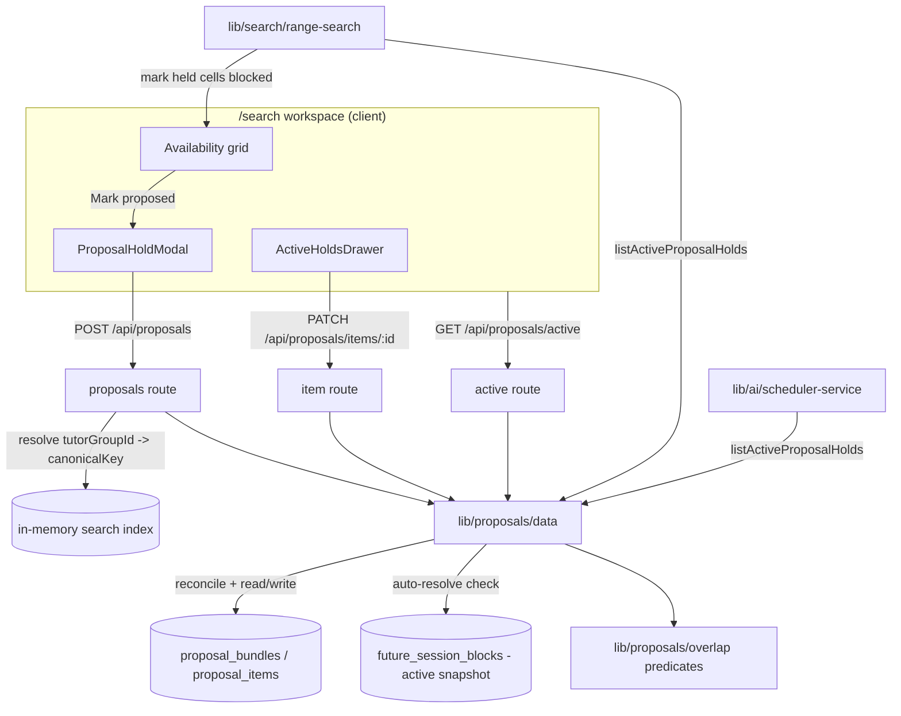

# Proposals (Admin Holds)

**Status: experimental** — local-only tutor "holds" with same-tutor overlap detection, surfaced inside tutor search. Never written back to Wise.

## Purpose

Proposals let admin staff temporarily "hold" one or more tutor slots while a deal with a parent is still being negotiated. When a recommended slot looks good but isn't booked in Wise yet, an admin marks it as *proposed*: the system records who holds it, for which student, and on what day/time, then surfaces that hold inside the availability search so a second admin doesn't accidentally offer the same tutor slot to a different parent.

Holds are deliberately **local to BGScheduler** — advisory overlays on top of Wise data, not bookings. Wise stays the single source of truth for actual sessions; a hold only bridges the gap between "we proposed this to a parent" and "Wise shows a confirmed session." There is no Wise writeback anywhere in the feature.

The primary users are the same non-technical admin staff who use tutor search/compare. The feature is reached from the `/search` workspace (and consumed by the AI scheduler), not from a standalone page or nav entry.

## Conceptual data model

Two tables, both defined in the shared Drizzle schema (`src/lib/db/schema.ts`). For the exact columns, enum value sets, check constraints, and indexes, see the database reference and ERD: [docs/reference/database/erd-ai-and-proposals.md](../reference/database/erd-ai-and-proposals.md).

- **Proposal bundle** — one negotiation for one student/parent. Carries the human label (`studentLabel`), free-text notes, and who created it. A bundle groups the individual slot holds so that confirming one slot can release the alternatives offered alongside it.
- **Proposal item** — one held slot inside a bundle, and the unit an admin confirms or releases. It pins a single tutor to a single time range (minute-of-day, Asia/Bangkok) and carries a lifecycle status. Crucially it **denormalizes the tutor's stable identity** onto the row, and records an audit trail for each lifecycle transition.

The canonical tutor key (`tutorCanonicalKey`) — copied from the active snapshot's identity group at create time (`src/app/api/proposals/route.ts:81-87`) — is the join key the whole feature pivots on. It is what makes a hold **survive snapshot rebuilds**: although `tutorGroupId` references a per-snapshot identity group (and is stored as an *unconstrained* uuid with no FK), all overlap and auto-resolve logic matches on the stable canonical key rather than on the volatile group id.

Two enums back the item's behaviour:

- **Scope** (`recurring` | `one_time`) distinguishes a recurring weekly hold from a one-time dated hold — this is what drives the asymmetric blocking rules below.
- **Status** (`pending` | `confirmed` | `released` | `expired` | `auto_resolved`) is the lifecycle: a hold starts `pending` (advisory, time-boxed), becomes `confirmed` once the parent commits, and then reaches one of three terminal states — `released` (cancelled or superseded by a sibling in the bundle), `expired` (the pending window lapsed), or `auto_resolved` (a real Wise session caught up to it). Only `pending` and `confirmed` are "active" (`src/lib/proposals/overlap.ts:9`).

The proposals tables carry **no foreign key to any core table**. Most reads are item-⨝-bundle joins (`src/lib/proposals/data.ts:130-169`); auto-resolution additionally reads `future_session_blocks` ⨝ `tutor_identity_groups` for the **active snapshot only** (`src/lib/proposals/data.ts:198-224`).

## API surface

All three endpoints require an authenticated session — there is no `CRON_SECRET` path; this is interactive admin UI, and `/api/proposals/**` is gated by the auth middleware (not on the public-route allowlist). The actor's email/name is stamped onto rows when present. Full method/path/auth/request/response contracts live in [docs/reference/api/proposals.md](../reference/api/proposals.md).

- `POST /api/proposals` — create a proposal bundle and its slot holds; resolves each tutor against the active search index, returns the created active holds (`201`), or `409` with conflict details when a slot is already held. (`src/app/api/proposals/route.ts`)
- `GET /api/proposals/active` — list every currently active hold (pending-and-unexpired, or confirmed), newest first, reconciling stale state first. (`src/app/api/proposals/active/route.ts`)
- `PATCH /api/proposals/items/[itemId]` — transition a single hold via one of three actions — `confirm`, `release`, `extend` — and return the refreshed active-hold list. (`src/app/api/proposals/items/[itemId]/route.ts`)

## UI

There is **no dedicated page and no nav entry**. The feature is mounted inside the tutor-search workspace at `/search` (`src/app/(app)/search/page.tsx` → `src/components/search/search-workspace.tsx`).

Key components:

- **`ProposalHoldModal`** (`src/components/search/proposal-hold-modal.tsx`) — the "Mark proposed" dialog. Takes a draft (a source label + a list of slots, pushed from recommended-slots or the availability grid), de-dupes identical slots client-side (`proposal-hold-modal.tsx:61-77`), collects student label + notes, and POSTs to `/api/proposals`. On `409` it renders a friendly conflict message naming the holding student and time (`proposal-hold-modal.tsx:116-119`).
- **`ActiveHoldsDrawer`** (`src/components/search/active-holds-drawer.tsx`) — right-side drawer listing active holds with status badges and expiry copy, plus per-hold Confirm / Extend 48h / Release buttons that call the PATCH endpoint.
- **`SearchWorkspace`** (`src/components/search/search-workspace.tsx`) — owns the proposal state (`proposalDraft`, `activeHolds`), fetches `/api/proposals/active` on mount, and overlays holds onto the live availability grid via `applyProposalHoldsToResponse` (`search-workspace.tsx:194-235`). Held cells render as **blocked** rather than available. Two consumption shapes coexist but describe the same hold, so it looks consistent everywhere: `recommended-slots`/`search-results` read holds *indirectly* as `proposal_hold` blocking-info entries already baked into `response.grid[].availability` (by the server at `src/lib/search/range-search.ts:166-168`, or by the client overlay at `search-workspace.tsx:228`); only the compare panel receives the holds as an explicit `proposalHolds` array prop (passed down to `compare-panel.tsx`/`week-overview.tsx`/`calendar-grid.tsx`).

Holds are also a first-class input to the **AI scheduler** (a separate feature): `runSchedulerExecution` accepts/loads `activeProposalHolds` and lets a hold block a candidate slot via the same predicate (`src/lib/ai/scheduler-service.ts:54-63`, `src/lib/ai/scheduler-conversation.ts:1518-1534`).

## Data flow

A held slot affects search results through two paths: the **server** path (range search reads holds from the DB on every search) and the **client overlay** path (the workspace re-applies the latest holds to whatever grid is already on screen without re-searching). Both call the same `proposalHoldBlocksSearchSlot` predicate, so the verdict is identical.

Create path in detail: the route validates the body with Zod, then resolves each `tutorGroupId` against the warm in-memory index to attach the stable `tutorCanonicalKey` and display name (`src/app/api/proposals/route.ts:64-88`). For `one_time` items the weekday is **derived from the ISO date** rather than trusted from the client (`route.ts:73-77`). The data layer (`createProposalBundle`) then reconciles stale state, checks the request against active holds in app code, inserts the bundle + items as `pending` with a 48h expiry, and lets the DB exclusion constraints act as the final race-condition guard (`src/lib/proposals/data.ts:300-384`).

## Business rules & edge cases

- **Same-tutor-only overlap.** Two slots conflict only when they share a `tutorCanonicalKey` and their minute ranges overlap; recurring-vs-recurring also requires the same weekday, one-time-vs-one-time the same date, and a mixed pair falls back to weekday match (`src/lib/proposals/overlap.ts:69-82`). Different tutors never conflict.
- **Recurring blocks one-time, but not vice-versa.** A recurring hold blocks a one-time search on the matching weekday, but a one-time hold blocks only a one-time search on the exact same date — a one-time hold must *not* block recurring searches forever (`src/lib/proposals/overlap.ts:98-106`; asserted at `src/lib/proposals/__tests__/overlap.test.ts:48-65`).
- **48-hour pending window.** New holds expire 48h after creation (`PENDING_HOLD_MS`, `src/lib/proposals/data.ts:21`). `extend` pushes a fresh 48h window from now, and only `pending` items can be extended (`data.ts:455-465`).
- **Active = pending-and-unexpired, or confirmed.** A confirmed hold is always active and has no expiry; a pending hold is active only until `expiresAt`. At runtime this is enforced in two steps inside the listing path: `expireStaleProposalItems` first flips any pending row past its `expiresAt` to `expired` (`data.ts:171-188`), then `listActiveProposalHolds` returns only rows whose status is in `ACTIVE_PROPOSAL_STATUSES` = pending/confirmed (`data.ts:267`). Confirming clears `expiresAt` to null (`data.ts:419-427`). The standalone helper `isProposalActiveAt` (`overlap.ts:57-67`) expresses the same rule but is exercised only by its unit test, not by the live listing path.
- **Confirm releases the rest of the bundle.** Confirming one item flips the other still-`pending` items in the same bundle to `released` — the model being that you offered several alternatives and the parent picked one (`data.ts:429-442`).
- **Lazy reconciliation, no cron.** There is no scheduled job. `reconcileProposalState` runs at the top of every list/create/patch call (`data.ts:253-256`), doing two things: expire pending items past `expiresAt` → `expired` (`data.ts:171-188`), and auto-resolve confirmed items that a real Wise session now covers → `auto_resolved` (`data.ts:190-251`). So a `GET`, `POST`, or `PATCH` can change item statuses as a side effect.
- **Auto-resolve = "Wise caught up."** A confirmed hold is auto-resolved when the active snapshot has a *blocking* `future_session_block` for the same canonical key whose range overlaps, matching on weekday (recurring) or exact date (one-time) (`overlap.ts:116-138`). This is how holds quietly retire once the booking lands in Wise. If there is no active snapshot, auto-resolve is a no-op (`data.ts:204`).
- **Defense in depth against double-holds (three layers).** (1) The create input is checked against itself so a single request can't hold two overlapping slots (`data.ts:291-297`); (2) the request is checked against currently active holds in app code via `findConflictingProposal` (`data.ts:310-315`); (3) two Postgres GiST `EXCLUDE` constraints (`proposal_items_no_recurring_overlap`, `proposal_items_no_one_time_overlap`, scoped to `status IN ('pending','confirmed')`) enforce non-overlap at the DB level (`drizzle/0006_admin_proposal_holds.sql:48-57`), depending on the `btree_gist` extension created at the top of the same migration (`0006_admin_proposal_holds.sql:1`). On a constraint violation (SQLSTATE `23P01`) the data layer deletes the orphan bundle, re-reads active holds, and re-raises as a `ProposalConflictError` so the API returns a clean `409` with the conflicting hold (`data.ts:68-83`, `360-377`).
- **Held cells render blocked, never available (fail-closed overlay).** In range search, an otherwise-available slot that matches an active hold is replaced with a `proposal_hold` blocking entry instead of `true` (`src/lib/search/range-search.ts:144-168`). The client overlay applies the same rule but is careful never to overwrite a cell that already has real Wise blocking detail — **Wise evidence wins over a hold** (`search-workspace.tsx:202-205`).
- **Tutor must exist in the active snapshot.** Creating a hold for a `tutorGroupId` absent from the current index throws a validation error (`400`) rather than holding a phantom tutor (`route.ts:68-71`).
- **Status guards on transitions.** `confirm`/`release` require the item to currently be `pending` or `confirmed`; otherwise a `ProposalValidationError` (`400`) is raised (`data.ts:415-417`, `444-446`). `released`/`expired`/`auto_resolved` are terminal.
- **DB check constraints.** Beyond the exclusion constraints, the table enforces `end_minute > start_minute`, `weekday` in 0–6, and "pending rows must have an expiry" at the database level (`drizzle/0006_admin_proposal_holds.sql:41-43`).

## Tests

- **Overlap predicates** — `src/lib/proposals/__tests__/overlap.test.ts`: pending expiry window, same-tutor recurring overlap, one-time same-date-only overlap, the recurring-blocks-one-time / one-time-does-not-block-recurring asymmetry, and auto-resolve when a Wise session overlaps a confirmed hold.
- **API routes** — `src/app/api/proposals/__tests__/route.test.ts` (mocks auth, db, index, and the data layer): auth gating on the active list, listing holds, create with tutor identity resolved from the active index, `409` conflict-detail passthrough, and a `confirm` PATCH transition.
- **Search integration** — `src/app/api/search/range/__tests__/route.test.ts:170-196` asserts that an active hold returned by `listActiveProposalHolds` turns the matching grid cell into a `proposalHold` blocking entry.

No test exercises the data layer (`src/lib/proposals/data.ts`) against a real database, so the DB exclusion-constraint path, the bundle rollback-on-overlap, the expiry sweep, and the auto-resolve query are covered only at the pure-helper level — see open questions.

## Open questions

- **Maturity = experimental** is taken from the task brief, not from any in-code marker (no `@deprecated`/`@experimental` annotation exists), and the API reference at [docs/reference/api/proposals.md](../reference/api/proposals.md) labels the same endpoints **stable** — a discrepancy worth resolving. There is no flag gating the UI or routes, so today the feature is live for every authenticated admin. Confirm whether "experimental" means beta-for-some-admins, newest-and-least-settled, or something to flag-gate.
- **No DB-backed tests** for `src/lib/proposals/data.ts`: the exclusion-constraint conflict path, orphan-bundle rollback, expiry sweep, and auto-resolve join are unverified by automated tests. Accepted gap for an experimental feature, or a coverage hole to close?
- **`autoResolveConfirmedProposalItems` runs on every read** (via `listActiveProposalHolds` → `reconcileProposalState`), each time issuing a snapshot lookup + a `future_session_blocks` join — and `executeRangeSearch` calls `listActiveProposalHolds` on every search (`src/lib/search/range-search.ts:116`). Is the per-request cost acceptable at scale, or should reconciliation move to the sync pipeline / a cron?
- The 48-hour hold window is a hard-coded constant (`PENDING_HOLD_MS`). Should it be configurable per bundle or per admin policy?
- Holds are explicitly never written back to Wise. Is one-way (BGScheduler→Wise) publishing of confirmed holds a planned follow-up, or intentionally out of scope?

_Verified against HEAD `d4fe6d3` on 2026-06-05._
