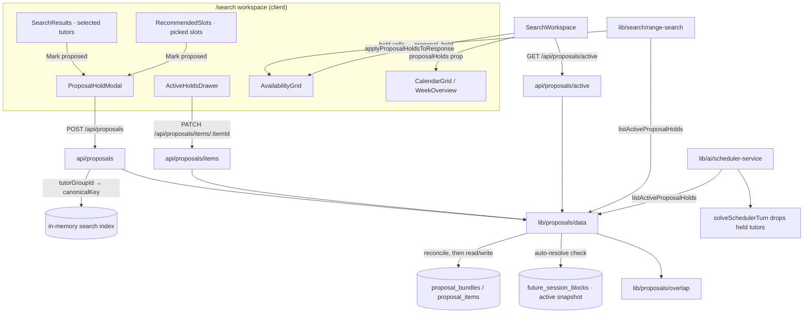

# Proposals (Admin Holds)

**Status: experimental** — a label from this documentation set, not an in-code marker. Nothing in the source annotates the feature as experimental, and nothing gates it behind a flag; what the code does establish is that the feature has no page of its own, no nav entry, no cron, and no environment variable (see [Open questions](#open-questions)). Tutor proposal bundles plus same-tutor overlap detection. Local-only; never written back to Wise.

## Purpose

Proposals let admin staff temporarily "hold" one or more tutor slots while a deal with a parent is still being negotiated. When a search or a recommended slot looks right but nothing is booked in Wise yet, an admin marks the slot as *proposed*: the system records who holds it, for which student, and on what day and time, then surfaces that hold inside the availability search so a second admin does not offer the same tutor slot to a different parent.

Holds are deliberately **local to BGScheduler** — advisory overlays on top of Wise data, not bookings. The schema comment states the intent directly: these rows intentionally do not write to Wise, which remains the source of truth for actual bookings (`src/lib/db/schema.ts:2299-2302`). A hold bridges the gap between "we proposed this to a parent" and "Wise shows a confirmed session", and it retires itself once Wise catches up.

The audience the code establishes is narrow. Every route requires an authenticated session, and the only UI is mounted inside the tutor-search page (`src/app/(app)/search/page.tsx:14-21` renders `SearchWorkspace`) — there is no standalone page and no entry in `src/lib/navigation/tools.ts`. Holds are therefore created and acted on by whoever already uses `/search`. A second, non-human consumer exists: the AI scheduler loads the same holds and drops any tutor whose slot is held before drafting a parent reply (see [Data flow](#data-flow)).

## Conceptual data model

Two tables, both in the shared Drizzle schema: `proposal_bundles` (`src/lib/db/schema.ts:2303-2313`) and `proposal_items` (`src/lib/db/schema.ts:2315-2343`). Column inventory, indexes, constraints, and enum definitions live in the database reference — [docs/reference/database/erd-ai-and-proposals.md](../reference/database/erd-ai-and-proposals.md) — and are not repeated here; the scope and status values are named in the next paragraph only to attach lifecycle meaning to them.

- **Proposal bundle** — one negotiation with one student or parent. It groups the alternative slots offered together so that confirming one can release the rest. The student is a free-text label, not a reference to any student record, and the bundle records who opened it.
- **Proposal item** — one held slot inside a bundle: a single tutor pinned to a single time range with a lifecycle status and a per-transition audit trail (who acted, when). The tutor is **denormalized** onto the row: the item carries the tutor's stable `tutorCanonicalKey` and display name, plus a `tutorGroupId` that is a bare `uuid` with no foreign key (`src/lib/db/schema.ts:2318`). The canonical key — copied from the active snapshot's identity group at create time (`src/app/api/proposals/route.ts:85`) — is the only join key the feature uses, which is what lets a hold survive the snapshot rebuilds — every 30 minutes (`/api/internal/sync-wise`, `vercel.json:5-6`) — that replace every identity-group id, because `tutor_identity_groups` rows are scoped to a single snapshot (`src/lib/db/schema.ts:1521`).

Two enums back the item, declared at `src/lib/db/schema.ts:85-96` and mirrored in TypeScript at `src/lib/proposals/types.ts:1-8`. **Scope** distinguishes a recurring weekly hold from a one-time dated hold and drives the asymmetric blocking rules below. **Status** is the lifecycle: a hold starts *pending* (advisory, time-boxed to 48 hours), becomes *confirmed* when the parent agrees (the time-box is cleared and sibling pending holds in the bundle are released), and ends in one of three terminal states that record *why* it stopped mattering — *released* by an admin, *expired* because the window lapsed, or *auto_resolved* because a real Wise session now covers it. Only `pending` and `confirmed` count as active (`ACTIVE_PROPOSAL_STATUSES`, `src/lib/proposals/overlap.ts:9`). Terminal is terminal; nothing reopens a hold.

Every hold-summary read is the item ⨝ bundle join (`selectJoinedProposalItems`, `src/lib/proposals/data.ts:130-169`; join at 158-162), newest first (`data.ts:168`); the patch path's status pre-read is the one items-only select — id, bundle, and status from `proposal_items` alone, unordered (`data.ts:395-403`). During auto-resolution the data layer also reads `future_session_blocks` ⨝ `tutor_identity_groups` for the **active** snapshot only (`data.ts:198-224`) — the one place this domain touches core snapshot tables.

Two facts about the database that the Drizzle schema does not show, because they exist only in the migration (`drizzle/0006_admin_proposal_holds.sql`): three `CHECK` constraints (time ordering, weekday domain, pending-implies-expiry; lines 41-43) and two GiST `EXCLUDE` constraints that make overlapping *active* holds for the same tutor impossible at write time, one per scope (lines 48-52 for recurring, 53-57 for one-time). Their names and predicates are DDL and live in the ERD; their behavioural consequences are covered under [Business rules](#business-rules--edge-cases).

## API surface

Three endpoints, all requiring an authenticated session; there is no cron path and no public path. Request and response contracts, status-code tables, and the hold-summary shape live in [docs/reference/api/proposals.md](../reference/api/proposals.md).

- `POST /api/proposals` — create a bundle of one or more holds. Resolves each `tutorGroupId` against the warm search index, rejects conflicts with active holds, returns the created holds (`201`) or a `409` naming the winning hold (`src/app/api/proposals/route.ts:40-121`).
- `GET /api/proposals/active` — list every currently active hold, reconciling stale state first (`src/app/api/proposals/active/route.ts:6-19`).
- `PATCH /api/proposals/items/[itemId]` — the single lifecycle endpoint: `confirm`, `release`, or `extend` one hold, and get back the full refreshed active-holds list so the client never has to re-list (`src/app/api/proposals/items/[itemId]/route.ts:15-62`).

There is no `DELETE` (retiring a hold is the `release` action) and no endpoint for terminal holds — only active ones are ever returned.

**Who can reach these routes.** `/api/proposals/**` is not in the middleware public allowlist (`src/middleware.ts:10-26`), so unauthenticated requests are redirected to `/login` before the handler's own `auth()` backstop runs (`src/middleware.ts:89-93`). For a *restricted* user — one whose `admin_users.allowed_pages` is non-null (`src/lib/db/schema.ts:581`, carried onto the session at `src/lib/auth.ts:63,69` and `src/lib/auth-edge.ts:28`) — `isPathAllowed` matches the path against each granted page prefix and that prefix's `/api{page}` namespace (`src/middleware.ts:59-66`), after a handful of hard-coded exceptions none of which name proposals (`src/middleware.ts:38-58`). Because the UI lives under `/search` but the API lives under `/api/proposals`, a user granted `["/search"]` can see the search page yet receives `403 {"error":"Forbidden"}` from middleware on all three proposal endpoints (`src/middleware.ts:97-100`). In practice, proposals work only for full-access admins (`allowedPages === null`, `src/middleware.ts:37`). That is a property of the current page inventory, not an enforced rule — `allowed_pages` is free-form `jsonb`, so a row containing the literal `"/proposals"` would unlock the namespace even though no such page exists.

## UI

There is **no dedicated page**. Everything is mounted inside the tutor-search workspace at `/search`.

- **`SearchWorkspace`** (`src/components/search/search-workspace.tsx`) owns the proposal state — the pending draft, the active-holds array, drawer visibility, and per-action loading (`search-workspace.tsx:92-96`). It fetches `/api/proposals/active` (`search-workspace.tsx:237-249`), overlays the result onto whatever grid is on screen via `applyProposalHoldsToResponse` (`search-workspace.tsx:194-235`), and PATCHes lifecycle actions (`search-workspace.tsx:266-282`). Both fetches ignore a non-OK response silently (`search-workspace.tsx:241,274`). The fetch effect depends on `refreshProposalHolds`, which is memoized on `applyProposalHoldsToResponse`, which is memoized on `searchContext` (`search-workspace.tsx:235,249,251-253`) — so holds are re-fetched whenever the search changes, not only on mount. A toolbar button shows the live count ("N active proposal holds" / "No active proposal holds") and opens the drawer (`search-workspace.tsx:319-328`).
- **Draft producers.** Two places build the `ProposalDraft` handed to the modal. `SearchResults` builds one from the checkbox-selected tutors × every cell that is currently `true` (available) — held or Wise-blocked cells are skipped automatically (`src/components/search/search-results.tsx:66-95`, the `cell !== true` guard at line 73), behind a "Mark proposed" button that appears once at least one tutor is selected (`search-results.tsx:134-147`). `RecommendedSlots` builds one from a single recommended slot or the picked set, capping at the top three tutors per slot (`src/components/search/recommended-slots.tsx:105-129`, `slice(0, 3)` at line 109; call sites at lines 249-250 and 284-285).
- **`ProposalHoldModal`** (`src/components/search/proposal-hold-modal.tsx`) — the "Mark proposed" dialog. It de-duplicates identical draft items client-side on a `tutorGroupId|scope|weekday|date|start|end` key (`proposal-hold-modal.tsx:61-77`), collects the student label and optional notes, tells the user that holds block overlapping searches for 48 hours unless confirmed or released (`proposal-hold-modal.tsx:146`), and POSTs to `/api/proposals` (`proposal-hold-modal.tsx:94-112`). On a `409` that carries a `conflict`, it rewrites the error into a sentence naming the tutor, the student already holding it, and the times (`proposal-hold-modal.tsx:116-120`); any other failure shows the server's `error` string.
- **`ActiveHoldsDrawer`** (`src/components/search/active-holds-drawer.tsx`) — a right-side drawer listing active holds with a status badge, the day/time ("Every Mon, 15:00-16:30" for recurring; the date for one-time — `active-holds-drawer.tsx:22-27`), expiry copy for pending holds versus "Blocks until Wise sync or release" for confirmed ones (`active-holds-drawer.tsx:121-124`), the holder, and notes. **Confirm** and **Extend 48h** render only for `pending` holds; **Release** is always offered (`active-holds-drawer.tsx:132-162`).
- **Renderers.** `AvailabilityGrid` draws a held cell with a lock icon and a `bg-blocked/10` tint instead of the generic blocked marker (`src/components/search/availability-grid.tsx:180,197,208-209`), and its popover names the student, tutor, times, status, expiry, and holder (`availability-grid.tsx:38-62`). On the compare side, `ComparePanel` passes the holds array down (`src/components/compare/compare-panel.tsx:57,69,438,451`) and both `CalendarGrid` and `WeekOverview` draw each hold as a blocked overlay block with its own popover (`src/components/compare/calendar-grid.tsx:247-305`, `src/components/compare/week-overview.tsx:475-525`).

Two consumption shapes coexist and describe the same hold. The availability grid learns about a hold indirectly — as a `proposal_hold` entry already baked into `response.grid[].availability`, either by the server (`src/lib/search/range-search.ts:166-168`) or by the client overlay (`search-workspace.tsx:228`); the `kind` discriminator and `proposalHold` payload are declared on `BlockingSessionInfo` at `src/lib/search/types.ts:68,77`. The compare calendars instead take the raw `ProposalHoldSummary[]` as a prop and match holds themselves. Overlaying holds onto compare data is why `CompareTutor` carries `tutorCanonicalKey` and why the client compare cache was bumped to `v3` (`src/lib/search/cache-version.ts:17-18,24`).

## Data flow

A hold affects results through three paths that all end at the same predicate, `proposalHoldBlocksSearchSlot` (`src/lib/proposals/overlap.ts:84-107`): the **server search** path, the **client overlay** path, and the **AI scheduler** path.

```mermaid
flowchart TD
    subgraph UI["/search workspace (client)"]
        Results[SearchResults · selected tutors] -->|Mark proposed| Modal[ProposalHoldModal]
        Reco[RecommendedSlots · picked slots] -->|Mark proposed| Modal
        Drawer[ActiveHoldsDrawer]
        Grid[AvailabilityGrid]
        Compare[CalendarGrid / WeekOverview]
    end

    Modal -->|POST /api/proposals| CreateRoute[api/proposals]
    Drawer -->|PATCH /api/proposals/items/:itemId| PatchRoute[api/proposals/items]
    Workspace[SearchWorkspace] -->|GET /api/proposals/active| ActiveRoute[api/proposals/active]

    CreateRoute -->|tutorGroupId → canonicalKey| Index[(in-memory search index)]
    CreateRoute --> Data[lib/proposals/data]
    PatchRoute --> Data
    ActiveRoute --> Data

    Data -->|reconcile, then read/write| DB[(proposal_bundles / proposal_items)]
    Data -->|auto-resolve check| Snap[(future_session_blocks · active snapshot)]
    Data --> Overlap[lib/proposals/overlap]

    RangeSearch[lib/search/range-search] -->|listActiveProposalHolds| Data
    RangeSearch -->|held cells → proposal_hold| Grid
    Workspace -->|applyProposalHoldsToResponse| Grid
    Workspace -->|proposalHolds prop| Compare
    AI[lib/ai/scheduler-service] -->|listActiveProposalHolds| Data
    AI --> Solver[solveSchedulerTurn drops held tutors]
```

**Create.** The route validates the body with Zod (`src/app/api/proposals/route.ts:16-32,53-59`), awaits the warm index, and resolves each `tutorGroupId` to its identity group so the stable canonical key and display name can be stamped onto the item (`route.ts:64-88`). For `one_time` items the weekday is derived server-side from the ISO date rather than trusted from the client (`route.ts:73-75`). The data layer then validates, reconciles stale state, checks each requested item against the active holds in application code, inserts the bundle, inserts the items, and lets the database exclusion constraints act as the final race guard (`src/lib/proposals/data.ts:300-384`).

**Search.** `executeRangeSearch` loads active holds once per search (`src/lib/search/range-search.ts:116`) — which also runs the reconcile pass — and consults them **only for tutors the engine already returned as available** (`range-search.ts:137-169`). A held available cell becomes a single `proposal_hold` blocking entry instead of `true` (`range-search.ts:166-168`). Tutors already blocked by Wise, and the `needsReview` bucket (`range-search.ts:171-175`), are untouched by holds.

**Client overlay.** When holds change without a new search — after a create, a lifecycle action, or a refresh — `applyProposalHoldsToResponse` re-applies the latest holds to the grid already on screen. It never overwrites a cell that carries real Wise blocking detail (`search-workspace.tsx:202-203`), and it is reversible: a cell that was only held reverts to `true` when its hold disappears (`search-workspace.tsx:204-205,228`).

**AI scheduler.** `executeSchedulerTurn` kicks off `listActiveProposalHolds` before the OpenAI extraction call and awaits it just before solving (`src/lib/ai/scheduler-service.ts:61-63,82-93`); a caller may also inject holds directly (`scheduler-service.ts:54`). The solver drops any candidate tutor whose slot is held, in both the weekly and the date-range solvers (`src/lib/ai/scheduler-conversation.ts:1517-1537,1715-1717,1937-1939`), emits a warning that names holds when nothing survives (`scheduler-conversation.ts:1801,2014`), and records `activeProposalHoldCount` in the run's search provenance so the drafted reply can cite it (`scheduler-conversation.ts:2031,2166`).

The three paths share the predicate but do **not** necessarily agree, for two reasons. Each derives the `weekday` argument independently — the two server paths through `weekdayForIsoDate` (`range-search.ts:143`, `scheduler-conversation.ts:1526`), the client overlay through an inline `new Date(...).getDay()` in the browser (`search-workspace.tsx:208-212`) — see the timezone bullet below. And each gates the predicate differently: range search tests only cells the engine returned as available, the overlay skips cells with Wise detail, and the AI solver applies the test after its own business-requirement and data-issue filters (`scheduler-conversation.ts:1710-1717`).

## Business rules & edge cases

- **Same-tutor-only overlap.** Two slots conflict only when they share a `tutorCanonicalKey` and their minute ranges overlap; recurring-vs-recurring additionally requires the same weekday, one-time-vs-one-time the same date, and a mixed pair falls back to weekday match (`src/lib/proposals/overlap.ts:69-82`). Different tutors never conflict, regardless of student.
- **Recurring blocks one-time, but not vice versa.** In `proposalHoldBlocksSearchSlot`, a recurring search is blocked only by a recurring hold on the same weekday (`overlap.ts:98-100`); a one-time search is blocked by a recurring hold on the matching weekday (`overlap.ts:102-104`) or by a one-time hold on the exact same date (`overlap.ts:106`). A one-time hold must not block recurring searches forever — asserted at `src/lib/proposals/__tests__/overlap.test.ts:48-65`.
- **The compare calendars re-implement that rule rather than call it.** Both filter holds inline — recurring by weekday, one-time by exact date (`src/components/compare/calendar-grid.tsx:252-256`, `src/components/compare/week-overview.tsx:481-485`). That is the one-time-search arm of the predicate with two parts dropped that a date-scoped calendar does not need: the `rangesOverlap` test (the grid positions the block by minute instead) and the recurring-search branch (the calendar is always date-scoped — `calendar-grid.tsx:126-130`, `week-overview.tsx:480`). It does not tighten or loosen the rule.
- **48-hour pending window.** New holds expire 48 hours after creation (`PENDING_HOLD_MS`, `src/lib/proposals/data.ts:21`, applied at `data.ts:317,349`). `extend` pushes a fresh 48 hours from *now*, not from the old expiry, and only `pending` items can be extended (`data.ts:455-466`).
- **Active = pending-and-unexpired, or confirmed.** Enforced in two steps: `expireStaleProposalItems` first flips pending rows past `expiresAt` to `expired` (`data.ts:171-188`), then the listing returns only `pending`/`confirmed` rows (`data.ts:267`). Confirming clears `expiresAt` (`data.ts:419-427`), so a confirmed hold never lapses on its own — it blocks until released or auto-resolved, which is exactly what the drawer copy says. The standalone helper `isProposalActiveAt` (`overlap.ts:57-67`) expresses the same rule but has no production caller; only its unit test exercises it.
- **Confirm releases the rest of the bundle.** Confirming one item flips every other still-`pending` item in the same bundle to `released` (`data.ts:429-442`) — the parent picked one of the alternatives offered. Sibling items already `confirmed` are left alone. The data layer also accepts `confirm` on an already-confirmed item (`data.ts:415`), though the drawer never offers it.
- **Lazy reconciliation; no cron.** There is no scheduled job for proposals (`vercel.json` and `src/lib/data-health/cron-registry.ts` contain no proposal entry). `reconcileProposalState` runs at the top of every list, create, and patch (`data.ts:253-256`, called at `data.ts:264,307,393`), so a read-only `GET` — and every range search, and every AI-scheduler turn — can mutate rows as a side effect.
- **Auto-resolve = "Wise caught up."** A confirmed hold is auto-resolved when the active snapshot contains a **blocking** `future_session_block` (`data.ts:222`) for the same canonical key whose minute range overlaps, matching on weekday for recurring holds or on the session's Bangkok date for one-time holds (`overlap.ts:116-138`, query at `data.ts:206-224`, date formatting via `formatBangkokDate` at `data.ts:233`). This is how holds quietly retire once the booking lands in Wise. If there is no active snapshot the pass is a no-op (`data.ts:204`) — fail-closed: holds keep blocking rather than being retired on missing data. The expensive session scan is skipped entirely when there are no confirmed holds (`data.ts:196`).
- **Defence in depth against double-holds, in three layers.** (1) The request is checked against itself so one call cannot hold two overlapping slots (`data.ts:291-297`). (2) The request is checked against currently active holds in application code (`data.ts:309-315`). (3) The two Postgres exclusion constraints reject an overlapping active insert at write time (`drizzle/0006_admin_proposal_holds.sql:48-57`), closing the read-then-insert race the app check cannot. When layer (3) fires, the data layer deletes the just-created orphan bundle, re-reads active holds to identify the winner, and re-raises `ProposalConflictError` (`data.ts:360-374`); the route answers `409` with the conflicting hold (`route.ts:103-108`).
- **Two `409` shapes.** The re-raise in layer (3) is *conditional* — it fires only when the fresh re-read actually finds a conflicting hold; otherwise the raw driver error is rethrown (`data.ts:376`). The route catches that with its own, narrower `isDatabaseOverlapError` — message text only (`route.ts:34-38`), whereas the data layer also inspects SQLSTATE `23P01` and the constraint name (`data.ts:68-83`) — and answers `409` **without** a `conflict` field (`route.ts:112-117`). A driver error that exposes the code but does not name the constraint in `message` falls through to the generic `500` (`route.ts:118-119`). Because the modal gates its human-readable sentence on `data.conflict` (`proposal-hold-modal.tsx:116`), those paths show a generic error rather than naming the tutor and student.
- **The database guard is scope-partitioned; the app guard is not.** Each exclusion constraint has a `WHERE ... scope = '...'` predicate (`0006_admin_proposal_holds.sql:52,57`), so Postgres can only catch recurring-vs-recurring and one-time-vs-one-time collisions. The mixed recurring-vs-one-time case that `proposalSlotsOverlap` treats as a conflict (`overlap.ts:81`) has **no** database backstop — under a concurrent race, two admins could each create one side of a mixed pair with only the app-code check between them.
- **Create is not transactional.** Bundle and items are inserted in two statements, with a best-effort compensating delete of the bundle if the item insert fails (`data.ts:318-328,332-357,361-364`) — the delete swallows its own errors (`.catch(() => undefined)`). Commit `0ef2dac` ("Fix proposal holds on Neon HTTP", 2026-05-15) replaced two earlier `db.transaction(async (tx) => ...)` blocks with this shape. The commit carries no body and the code no comment, so the reason is inferred: the subject names the Neon HTTP driver, which is what `getDb()` uses (`src/lib/db/index.ts:2` imports `drizzle-orm/neon-http`), and that driver does not support transactions. A failure between the two statements, or a failed compensating delete, leaves an empty bundle row that is invisible to reads (which inner-join from items) but is never cleaned up.
- **Held cells render blocked, never available.** In range search an otherwise-available slot that matches an active hold becomes a `proposal_hold` blocking entry (`range-search.ts:166-168`). The client overlay applies the same rule but Wise evidence always wins over a hold (`search-workspace.tsx:202-203`).
- **Tutor must exist in the active snapshot.** A `tutorGroupId` absent from the current index is a validation error (`400`), not a phantom hold (`route.ts:68-71`). Because the id is per-snapshot, a client holding a stale id after a sync will hit this.
- **Status guards on transitions.** `confirm` and `release` require the item to be `pending` or `confirmed`; `extend` requires `pending`; anything else is a `ProposalValidationError` → `400` (`data.ts:414-417,443-446,455-458`). `released`, `expired`, and `auto_resolved` are terminal.
- **Application validation mirrors most, not all, database invariants.** `validateCreateInput` rejects an empty student label, an empty item list, a non-positive or out-of-day time range, a weekday outside 0-6, and a `one_time` item without a date (`data.ts:271-298`). The time-order, weekday, and pending-implies-expiry rules are also `CHECK`ed in Postgres (`0006_admin_proposal_holds.sql:41-43`), so the app messages are friendlier errors on top of real invariants. "One-time implies a date" is **app-only** — `proposal_date` is nullable with no matching check.
- **`weekdayForIsoDate` is not timezone-safe.** It builds `new Date("YYYY-MM-DDT00:00:00+07:00")` and calls `.getDay()`, which reads the *process* timezone, not Asia/Bangkok (`overlap.ts:45-47`). Running it under two timezones shows the drift: for `2026-05-18`, `TZ=Asia/Bangkok` yields `1` (Monday) and `TZ=UTC` yields `0` (Sunday). Whether production is affected **cannot be determined from this repository**: the only `TZ` pin is in `vitest.config.ts:4` (tests only); nothing in `vercel.json`, `next.config.ts`, or `src/lib/env.ts` sets it, and no file under `src/` reads `process.env.TZ`. The Bangkok-correct helper `getLocalWeekday` exists a few imports away (`src/lib/normalization/timezone.ts:16-18`), and this module's own `formatBangkokDate` converts correctly (`overlap.ts:36-43`).
- **Where that weekday lands.** `weekdayForIsoDate` has eleven production call sites outside its own module. Three feed hold matching: the weekday stamped onto one-time holds at create time (`route.ts:74`), the weekday range search matches holds on (`range-search.ts:143`), and the AI scheduler's `slotBlockedByProposalHold` (`scheduler-conversation.ts:1526`). One is not about holds at all — `range-search.ts:192` feeds `getBlockingSessions` (`range-search.ts:194-201`), the Wise blocking-session lookup for cells the engine did *not* return as available — so on a one-time search the same defect can attach Wise evidence to the wrong weekday. The remaining seven are AI-scheduler slot generation and sorting (`scheduler-conversation.ts:1431,1471,1508,1509,1627,1832,1966`). One-time-vs-one-time hold matching is unaffected (it keys on `date`), but recurring-vs-one-time comparisons can land on the wrong day — a fail-**open** outcome for the search overlay. The client overlay computes its weekday in the browser (`search-workspace.tsx:211`), so a Bangkok-based admin's screen and a non-Bangkok server can disagree.

## Tests

- **Overlap predicates** — `src/lib/proposals/__tests__/overlap.test.ts`: pending-expiry window via `isProposalActiveAt` (lines 31-35), same-tutor recurring overlap (37-40), one-time same-date-only overlap (42-46), the recurring-blocks-one-time / one-time-does-not-block-recurring asymmetry (48-65), and auto-resolve when a Wise session overlaps a confirmed hold (67-79).
- **API routes** — `src/app/api/proposals/__tests__/route.test.ts`, mocking auth, db, the index, and the data layer (lines 4-34): `401` on the active list (95-101), `200 { holds }` (103-109), create with tutor identity resolved from the index (111-136), `409` conflict-detail passthrough (138-157), and the `confirm` PATCH wiring (159-175).
- **Search integration** — `src/app/api/search/range/__tests__/route.test.ts:169-200` asserts that an active hold returned by `listActiveProposalHolds` turns the matching grid cell into a `proposal_hold` entry while the neighbouring cell stays `true`.
- **AI scheduler integration** — `src/lib/ai/__tests__/scheduler-conversation.test.ts:221-236` asserts that a tutor whose slot is held is suppressed and that the warning mentions proposal holds; a one-time hold is also fed into the date-range solver scenario at lines 1114-1127.

No test exercises `src/lib/proposals/data.ts` against a real database. The exclusion-constraint conflict path, the orphan-bundle rollback, the expiry sweep, and the auto-resolve join are covered only at the pure-helper or mocked level. Nothing under `src/components/search/` or `src/components/compare/` tests the hold rendering.

## Open questions

- **What does "experimental" mean here?** The label comes from this documentation set; no annotation, flag, or gating constant in the code corroborates it. The feature has been in the tree since 2026-05-15 (commit `6d076c9`, whose subject — "Add room capacity dashboard" — does not mention it). Is it beta-for-some-admins, simply the newest scheduling tool, or something the team plans to retire?
- **`weekdayForIsoDate` timezone drift.** Is the off-by-one on non-Bangkok runtimes known and accepted, or should the helper delegate to `getLocalWeekday`? Two decisions ride along: the production runtime timezone is not pinned anywhere in the repo, so current behaviour is unknown from code alone; and a fix changes the semantics of the `weekday` already written onto existing one-time rows, so a backfill decision is needed.
- **No database backstop for mixed recurring-vs-one-time conflicts.** The two exclusion constraints are scope-partitioned. Deliberate (mixed pairs judged low-risk) or an oversight?
- **Restricted users are locked out by namespace, not by intent.** A page-restricted admin granted `/search` sees the search page but gets a middleware `403` on every proposal endpoint. Should `/api/proposals` be reachable under the `/search` grant, or is holds-for-full-admins-only the intent?
- **Non-transactional create.** Commit `0ef2dac` split the bundle/items insert into two statements with a best-effort rollback, by all appearances because the Neon HTTP driver cannot run a transaction (inferred from the subject line; nothing in code or commit body states it). Is an occasional orphan bundle acceptable, or should the create path move to the `node-postgres` driver the way other transaction-requiring paths already do (`src/lib/payroll/sync.ts`, `src/lib/post-class-feedback/transaction.ts`)?
- **Reconcile-on-read cost.** Every range search and every AI-scheduler turn runs the expiry `UPDATE` and, whenever at least one confirmed hold exists, a scan of the active snapshot's blocking sessions. Acceptable as confirmed holds accumulate, or should reconciliation move into the Wise sync pipeline or a cron?
- **No database-backed tests for the data layer.** Accepted gap for an experimental feature, or a coverage hole to close?
- **The 48-hour window is a hard-coded constant.** Should it be configurable per bundle or per admin policy?
- **Terminal holds are never surfaced or purged.** There is no history view and no retention policy for `released` / `expired` / `auto_resolved` rows. Intentional?
- **One-way publish to Wise.** Holds are explicitly never written back. Is publishing a confirmed hold into Wise a planned follow-up, or intentionally out of scope?
- **`isProposalActiveAt` has no production caller.** Dead helper, or intended for a future client-side check?
- **Reference pages cite stale schema line ranges.** [docs/reference/api/proposals.md](../reference/api/proposals.md) (line 121) and [docs/reference/database/erd-ai-and-proposals.md](../reference/database/erd-ai-and-proposals.md) (line 3) cite the schema comment at `2296-2299`; those two pages and the database index ([docs/reference/database/index.md](../reference/database/index.md), lines 242-243) all cite the tables at `2300-2310` / `2312-2340`. At this revision the comment sits at `2299-2302` and the tables at `2303-2313` / `2315-2343`. The reference set needs a regeneration pass.

_Verified against main@0cd1e81 (clean tree) on 2026-09-02._
