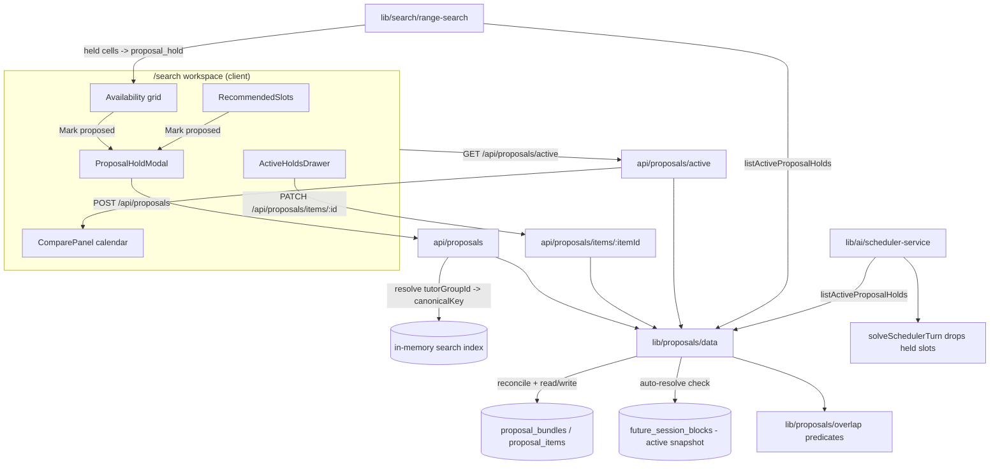

# Proposals (Admin Holds)

**Status: experimental** (a label from this documentation set, not an in-code marker — see [Open questions](#open-questions)) — tutor proposal bundles plus same-tutor overlap detection. Local-only; never written back to Wise.

## Purpose

Proposals let admin staff temporarily "hold" one or more tutor slots while a deal with a parent is still being negotiated. When a recommended slot looks good but isn't booked in Wise yet, an admin marks it as *proposed*: the system records who holds it, for which student, and on what day/time, then surfaces that hold inside the availability search so a second admin doesn't accidentally offer the same tutor slot to a different parent.

Holds are deliberately **local to BGScheduler** — they are advisory overlays on top of Wise data, not bookings. The schema comment states the intent directly: these rows do not write to Wise, which remains the source of truth for actual bookings (`src/lib/db/schema.ts:2296-2299`). A hold's job is to bridge the gap between "we proposed this to a parent" and "Wise shows a confirmed session."

What the code establishes about the audience is narrow: every route requires an authenticated session, and the only UI is mounted inside the tutor-search page (`src/app/(app)/search/page.tsx:16-19`) — there is no standalone page and no nav entry. So in practice holds are created and read by whoever already uses search. A second, non-human consumer exists: the AI scheduler applies the same holds when it drafts a parent reply (see [Data flow](#data-flow)).

## Conceptual data model

Two tables, both defined in the shared Drizzle schema (`src/lib/db/schema.ts:2300` and `src/lib/db/schema.ts:2312`). For exact columns, enums, constraints, and indexes see the database reference and ERD: [docs/reference/database/erd-ai-and-proposals.md](../reference/database/erd-ai-and-proposals.md).

- **Proposal bundle** — one negotiation for one student/parent. A bundle groups the individual slot holds so that confirming one slot can release the alternatives offered alongside it. It identifies the negotiation only by a free-text label — there is no reference to any student record — and records who opened it; the column inventory lives in the ERD linked above.
- **Proposal item** — one held slot inside a bundle. It pins a single tutor to a single time range and carries a lifecycle status. Crucially it denormalizes the tutor's stable identity onto the row (so the hold survives snapshot rebuilds — see below) and records an audit trail for each lifecycle transition. The exact column inventory (denormalized identity fields, scope/weekday/date/time fields, audit timestamps, and last-action actor fields) lives in the ERD linked above.

The canonical tutor key (`tutorCanonicalKey`) — copied from the active snapshot's identity group at create time (`src/app/api/proposals/route.ts:85`) — is the join key the whole feature pivots on. It is what makes a hold survive snapshot rebuilds: `tutorGroupId` points at a per-snapshot identity group and carries no FK constraint, whereas the canonical key is stable, so every overlap and auto-resolve comparison matches on the canonical key rather than on the volatile group id.

Two enums back the item's behaviour, both reference-owned — value sets in the ERD linked above, declared at `src/lib/db/schema.ts:85-96` and mirrored in TypeScript at `src/lib/proposals/types.ts:1-10`. **Scope** distinguishes a recurring weekly hold from a one-time dated hold; this is what drives the asymmetric blocking rules below. **Status** is the lifecycle, and it runs advisory → committed → terminal. A hold starts advisory and time-boxed: it blocks other admins but lapses on its own if nobody acts. It becomes committed once the parent agrees, at which point the time-box is cleared and the sibling holds offered as alternatives in the same bundle are retired — that cascade is the whole reason a bundle exists. Three distinct terminal states then record *why* a hold stopped mattering: an admin retired it, its window lapsed, or a real Wise session caught up to it. Terminal is terminal — nothing reopens a hold.

Reads are cross-table joins (item ⨝ bundle, `src/lib/proposals/data.ts:158-162`) plus, during auto-resolution, a read of `future_session_blocks` ⨝ `tutor_identity_groups` for the **active** snapshot only (`src/lib/proposals/data.ts:198-224`).

## API surface

Three endpoints, all requiring an authenticated session (there is no cron path; this is interactive admin UI). Full request/response contracts live in [docs/reference/api/proposals.md](../reference/api/proposals.md).

- `POST /api/proposals` — create a proposal bundle and its slot holds; resolves each tutor against the active search index and returns the created active holds (`201`), or a `409` when a slot is already held — in two different body shapes, one of which omits the conflict detail (see [Business rules](#business-rules--edge-cases)). (`src/app/api/proposals/route.ts:40`)
- `GET /api/proposals/active` — list every currently active hold (pending-and-unexpired or confirmed), reconciling stale state first. (`src/app/api/proposals/active/route.ts:6`)
- `PATCH /api/proposals/items/[itemId]` — the single lifecycle endpoint: a hold is committed, retired, or prolonged through it, and the caller gets back the state of every still-active hold so the UI never has to re-list. Actions, state guards, and status codes are in the reference. (`src/app/api/proposals/items/[itemId]/route.ts:15`)

There is no `DELETE`; retiring a hold is an action on that same PATCH endpoint. There is no list endpoint for terminal holds either — only active ones are ever returned to the client.

Access is gated twice in middleware. `/api/proposals/**` is not in the public-route allowlist (`src/middleware.ts:4-20`), so the edge auth gate runs before the handler's own `auth()` backstop. Beyond that, per-user page grants apply. `isPathAllowed` is not a pure prefix match: it short-circuits on four hard-coded exceptions before reaching its prefix loop — an unconditional allow for `/api/home/summary` (`src/middleware.ts:32`), an unconditional allow for the `/post-class-feedback` page *and* API namespaces (`src/middleware.ts:35-40`), an allow for the `/learning-plans` page namespace paired with an explicit *deny* for `/api/learning-plans` (`src/middleware.ts:44-47`, `src/middleware.ts:48-51`), and an allow for `/` when more than one page is granted (`src/middleware.ts:52`) — and only then matches the pathname against each allowed page prefix and that prefix's `/api{page}` namespace (`src/middleware.ts:53-60`). None of the exceptions names proposals, and `/proposals` is not one of the application pages. So for any admin whose `admin_users.allowed_pages` is non-null (`src/lib/db/schema.ts:581`, carried onto the session at `src/lib/auth-edge.ts:28`) none of the three routes match — even for a user explicitly granted `/search` — and middleware returns `403 {"error":"Forbidden"}` before the handler runs (`src/middleware.ts:79-82`).

In practice, then, proposals work only for full-access admins (`allowedPages === null`). That conclusion rests on the current page inventory, not on anything the code enforces: `allowed_pages` is free-form `jsonb` populated in the database (`src/lib/db/schema.ts:581`), so a row carrying `/proposals` would unlock the `/api/proposals` namespace even though no such page exists.

## UI

There is **no dedicated page**. The feature is mounted inside the tutor-search workspace at `/search` (`src/app/(app)/search/page.tsx` → `src/components/search/search-workspace.tsx`).

Key components:

- **`ProposalHoldModal`** (`src/components/search/proposal-hold-modal.tsx`) — the "Mark proposed" dialog. Takes a draft (a source label + a list of slots), de-dupes identical slots client-side on a `tutorGroupId|scope|weekday|date|start|end` key (`src/components/search/proposal-hold-modal.tsx:61-77`), collects student label + notes, and POSTs to `/api/proposals`. On `409` it rewrites the server error into a human sentence naming the tutor, the student already holding it, and the times (`src/components/search/proposal-hold-modal.tsx:116-120`).
- **`ActiveHoldsDrawer`** (`src/components/search/active-holds-drawer.tsx`) — right-side drawer listing active holds with status badges, expiry copy for pending holds versus "Blocks until Wise sync or release" for confirmed ones (`src/components/search/active-holds-drawer.tsx:121-124`), and per-hold Confirm / Extend 48h / Release buttons. Confirm and Extend render only for `pending` holds; Release is always available (`src/components/search/active-holds-drawer.tsx:132-162`).
- **`SearchWorkspace`** (`src/components/search/search-workspace.tsx`) — owns the proposal state (`proposalDraft`, `activeHolds`) and overlays holds onto the live availability grid via `applyProposalHoldsToResponse` (`src/components/search/search-workspace.tsx:194-235`). It re-fetches `/api/proposals/active` on every search, not once on mount: the effect depends on `refreshProposalHolds`, which is memoized on `applyProposalHoldsToResponse`, which is memoized on `searchContext` (`src/components/search/search-workspace.tsx:235`, `src/components/search/search-workspace.tsx:249`, `src/components/search/search-workspace.tsx:253`), so changing the search re-runs the fetch.
- **Draft producers** — two places build the draft handed to the modal. `SearchResults` builds one from the checkbox-selected tutors × every still-available cell (`src/components/search/search-results.tsx:66-95`). `RecommendedSlots` builds one from the picked recommended slots, capping at the top 3 tutors per slot (`src/components/search/recommended-slots.tsx:105-129`).
- **Renderers** — `AvailabilityGrid` draws a held cell with a lock icon and a `bg-blocked/10` tint instead of the generic "blocked" dot, plus a popover naming the student, status, expiry and holder (`src/components/search/availability-grid.tsx:38-60`, `src/components/search/availability-grid.tsx:180-210`). The compare calendar and week overview each receive holds as an explicit `proposalHolds` array prop and draw them as blocked overlay blocks with their own popovers (`src/components/compare/calendar-grid.tsx:247-302`, `src/components/compare/week-overview.tsx:475-522`), wired from `ComparePanel` (`src/components/compare/compare-panel.tsx:438`, `src/components/compare/compare-panel.tsx:451`) which in turn is fed from the workspace (`src/components/search/search-workspace.tsx:352`).

Two consumption shapes coexist, but they describe the same hold so it looks consistent everywhere. The raw `ProposalHoldSummary[]` circulates on the search side too — `ActiveHoldsDrawer` takes it as a prop (`src/components/search/search-workspace.tsx:366-374`, typed at `src/components/search/active-holds-drawer.tsx:10-18`), and `ProposalHoldModal` hands freshly created summaries straight back through `onCreated` (`src/components/search/search-workspace.tsx:255`). What is actually compare-specific is how the *calendar renderers* learn about a hold: the availability grid reads it indirectly, as a `proposal_hold` entry already baked into `response.grid[].availability` (by the server at `src/lib/search/range-search.ts:166-168` or by the client overlay at `src/components/search/search-workspace.tsx:228`), whereas the compare calendar and week overview take the holds array as an explicit prop and overlay it themselves (`src/components/search/search-workspace.tsx:352`). Overlaying holds onto compare data is the reason the client compare cache carries `tutorCanonicalKey` and was bumped to `v3` (`src/lib/search/cache-version.ts:17-24`).

## Data flow

A held slot affects results through three paths: the **server** path (range search reads holds from the DB on every search), the **client overlay** path (the workspace re-applies the latest holds to whatever grid is already on screen without re-searching), and the **AI scheduler** path (the LLM turn solver drops any tutor whose slot is held).

All three end at the same `proposalHoldBlocksSearchSlot` predicate (`src/lib/search/range-search.ts:93`, `src/components/search/search-workspace.tsx:219`, `src/lib/ai/scheduler-conversation.ts:1530`) — but that does **not** make their verdicts identical, for two reasons. First, each derives the predicate's `weekday` argument independently: the two server paths call `weekdayForIsoDate` and so read the server process timezone (`src/lib/search/range-search.ts:143`, `src/lib/ai/scheduler-conversation.ts:1526`), while the client overlay inlines `new Date(...).getDay()` and so reads the browser timezone (`src/components/search/search-workspace.tsx:211`) — see the timezone bullet under [Business rules](#business-rules--edge-cases). Second, each gates the predicate differently: range search only tests cells the engine already returned as available (`src/lib/search/range-search.ts:137-168`), and the client overlay skips any cell already carrying non-proposal Wise detail (`src/components/search/search-workspace.tsx:202-205`).

```mermaid
flowchart TD
    subgraph UI["/search workspace (client)"]
        Grid[Availability grid] -->|Mark proposed| Modal[ProposalHoldModal]
        Reco[RecommendedSlots] -->|Mark proposed| Modal
        Drawer[ActiveHoldsDrawer]
        Compare[ComparePanel calendar]
    end

    Modal -->|POST /api/proposals| CreateRoute[api/proposals]
    Drawer -->|PATCH /api/proposals/items/:id| PatchRoute[api/proposals/items/:itemId]
    UI -->|GET /api/proposals/active| ActiveRoute[api/proposals/active]

    CreateRoute -->|resolve tutorGroupId -> canonicalKey| Index[(in-memory search index)]
    CreateRoute --> Data[lib/proposals/data]
    PatchRoute --> Data
    ActiveRoute --> Data

    Data -->|reconcile + read/write| DB[(proposal_bundles / proposal_items)]
    Data -->|auto-resolve check| Wise[(future_session_blocks - active snapshot)]
    Data --> Overlap[lib/proposals/overlap predicates]

    RangeSearch[lib/search/range-search] -->|listActiveProposalHolds| Data
    RangeSearch -->|held cells -> proposal_hold| Grid
    AI[lib/ai/scheduler-service] -->|listActiveProposalHolds| Data
    AI --> Solver[solveSchedulerTurn drops held slots]
    ActiveRoute --> Compare
```

**Create path in detail.** The route validates the body with Zod, then resolves each `tutorGroupId` against the warm in-memory index to attach the stable `tutorCanonicalKey` and display name (`src/app/api/proposals/route.ts:64-88`). For `one_time` items the weekday is derived server-side from the ISO date rather than trusted from the client (`src/app/api/proposals/route.ts:73-75`). The data layer then reconciles stale state, checks the request against active holds in app code, inserts the bundle + items, and lets the DB exclusion constraints act as the final race-condition guard (`src/lib/proposals/data.ts:300-384`).

**Search path in detail.** `executeRangeSearch` loads active holds once per search (`src/lib/search/range-search.ts:116`) and consults them **only for tutors the engine already returned as available** (`src/lib/search/range-search.ts:137-168`). A held available cell becomes a single `proposal_hold` blocking entry instead of `true`. Tutors already blocked by Wise, and the `needsReview` bucket, are untouched by holds.

**AI scheduler path in detail.** `executeSchedulerTurn` kicks off `listActiveProposalHolds` in parallel with the OpenAI extraction call and awaits it before solving (`src/lib/ai/scheduler-service.ts:61-63`, `src/lib/ai/scheduler-service.ts:82-92`). The solver drops any candidate tutor whose slot is held (`src/lib/ai/scheduler-conversation.ts:1715-1717`, `src/lib/ai/scheduler-conversation.ts:1937`), emits a warning that mentions holds when nothing survives (`src/lib/ai/scheduler-conversation.ts:1801`), and records `activeProposalHoldCount` in the run's search provenance so the drafted reply can cite it (`src/lib/ai/scheduler-conversation.ts:2031`, `src/lib/ai/scheduler-conversation.ts:2166`).

## Business rules & edge cases

- **Same-tutor-only overlap.** Two slots conflict only when they share a `tutorCanonicalKey` and their minute ranges overlap; recurring-vs-recurring also requires the same weekday, one-time-vs-one-time the same date, and a mixed pair falls back to weekday match (`src/lib/proposals/overlap.ts:69-82`). Different tutors never conflict.
- **Recurring blocks one-time, but not vice-versa.** A recurring hold blocks a one-time search on the matching weekday, but a one-time hold only blocks a one-time search on the exact same date — a one-time hold must *not* block recurring searches forever (`src/lib/proposals/overlap.ts:98-106`; asserted at `src/lib/proposals/__tests__/overlap.test.ts:48-65`).
- **The compare calendar re-implements that rule, it does not tighten it.** The calendar tests holds inline instead of calling the predicate (`src/components/compare/calendar-grid.tsx:252-256`, `src/components/compare/week-overview.tsx:481-485`): recurring holds match by weekday, one-time holds by exact date. That is exactly `proposalHoldBlocksSearchSlot`'s one-time branch (`src/lib/proposals/overlap.ts:102-106`) — mixed recurring↔one-time fallback included, since the recurring-hold arm *is* that fallback — minus two things the calendar does not need. It drops the `rangesOverlap` test (`src/lib/proposals/overlap.ts:94-96`), because the grid positions the hold block by minute rather than testing it against a query window; and it drops the recurring-search branch (`src/lib/proposals/overlap.ts:98-100`), because the compare calendar is always date-scoped (`src/components/compare/calendar-grid.tsx:126`, `src/components/compare/week-overview.tsx:480`).
- **48-hour pending window.** New holds expire 48h after creation (`PENDING_HOLD_MS`, `src/lib/proposals/data.ts:21`). "Extend" pushes a new 48h window from *now*, not from the old expiry; only `pending` items can be extended (`src/lib/proposals/data.ts:455-465`).
- **Active = pending-and-unexpired, or confirmed.** Enforced in two steps inside the listing path: `expireStaleProposalItems` first flips any pending row past its `expiresAt` to `expired` (`src/lib/proposals/data.ts:171-188`), then `listActiveProposalHolds` returns only rows whose status is in `ACTIVE_PROPOSAL_STATUSES` = pending/confirmed (`src/lib/proposals/data.ts:267`). Confirming clears `expiresAt` to null (`src/lib/proposals/data.ts:419-427`), so a confirmed hold never expires on its own. The standalone helper `isProposalActiveAt` (`src/lib/proposals/overlap.ts:57-67`) expresses the same rule but is exercised only by its unit test, not by the live listing path.
- **Confirm releases the rest of the bundle.** Confirming one item flips the other still-`pending` items in the same bundle to `released` — you offered several alternatives and the parent picked one (`src/lib/proposals/data.ts:429-442`). Sibling items that are already `confirmed` are left alone.
- **Lazy reconciliation, no cron.** There is no scheduled job for proposals. `reconcileProposalState` runs at the top of every list/create/patch call (`src/lib/proposals/data.ts:253-256`), doing two things: expire pending items past `expiresAt`, and auto-resolve confirmed items that a real Wise session now covers. A read-only `GET` can therefore mutate rows as a side effect.
- **Auto-resolve = "Wise caught up."** A confirmed hold is auto-resolved when the active snapshot has a *blocking* `future_session_block` for the same canonical key whose range overlaps, matching on weekday (recurring) or exact date (one-time) (`src/lib/proposals/overlap.ts:116-138`, query at `src/lib/proposals/data.ts:206-224`). This is how holds quietly retire once the booking lands in Wise. If there is no active snapshot, auto-resolve is a no-op (`src/lib/proposals/data.ts:204`) — fail-closed: holds keep blocking rather than being silently retired on missing data.
- **Defense in depth against double-holds.** Conflict checking exists at three layers: (1) the create input is checked against itself so a single request can't hold two overlapping slots (`src/lib/proposals/data.ts:291-297`); (2) the request is checked against currently active holds in app code (`src/lib/proposals/data.ts:310-315`); (3) Postgres exclusion constraints reject overlapping active holds at write time, which is what closes the read-then-insert race the app check cannot — their names, indexed columns and predicates are DDL and live in the ERD ([docs/reference/database/erd-ai-and-proposals.md](../reference/database/erd-ai-and-proposals.md)). The behaviour that matters here is what happens when layer (3) fires: the data layer deletes the just-created orphan bundle, re-reads active holds to identify the winning hold, and re-raises a `ProposalConflictError` (`src/lib/proposals/data.ts:68-83`, `src/lib/proposals/data.ts:360-374`).
- **There are two different `409` shapes.** The re-raise as `ProposalConflictError` is *conditional* — it fires only when that fresh re-read actually turns up a conflicting hold; otherwise the raw driver error is rethrown (`src/lib/proposals/data.ts:376`). The route then catches it with a second, independent `isDatabaseOverlapError` check and answers `409`, but with no `conflict` field (`src/app/api/proposals/route.ts:34-38`, `src/app/api/proposals/route.ts:112-117`) — and that second net is narrower than the data layer's. The route's copy inspects `error.message` alone, whereas the data layer's version also tests SQLSTATE `23P01` and `error.constraint` / `error.cause.constraint` (`src/lib/proposals/data.ts:68-83`). A driver error that exposes the code or constraint fields but does not name the constraint in `message` therefore falls through to the generic `500` branch (`src/app/api/proposals/route.ts:118-119`), not to `409`. Because `ProposalHoldModal` gates its human sentence on `res.status === 409 && data.conflict` (`src/components/search/proposal-hold-modal.tsx:116`), that second branch shows the generic error string instead of naming the tutor, the holding student, and the times.
- **The DB guard is scope-partitioned; the app guard is not.** The exclusion constraints are partitioned by scope (predicates in the [ERD](../reference/database/erd-ai-and-proposals.md)), so the database can only catch recurring-vs-recurring and one-time-vs-one-time collisions. The mixed recurring-vs-one-time case that `proposalSlotsOverlap` treats as a conflict (`src/lib/proposals/overlap.ts:81`) therefore has **no** database backstop — under a concurrent race two admins could each create one side of a mixed pair, and only the app-code check stands between them.
- **Held cells render blocked, never available.** In range search, an otherwise-available slot that matches an active hold is replaced with a `proposal_hold` blocking entry instead of `true` (`src/lib/search/range-search.ts:144-168`). The client overlay applies the same rule but never overwrites a cell that already carries real Wise blocking detail — Wise evidence wins over a hold (`src/components/search/search-workspace.tsx:202-205`). The overlay is also reversible: when a hold disappears, a cell that was only held reverts to `true` (`src/components/search/search-workspace.tsx:228`).
- **Tutor must exist in the active snapshot.** Creating a hold for a `tutorGroupId` absent from the current index throws a validation error (`400`) rather than holding a phantom tutor (`src/app/api/proposals/route.ts:68-71`).
- **Status guards on transitions.** Confirm/release require the item to currently be `pending` or `confirmed`; otherwise a `ProposalValidationError` (`400`) is raised (`src/lib/proposals/data.ts:415-417`, `src/lib/proposals/data.ts:444-446`). `released`/`expired`/`auto_resolved` are terminal — nothing reopens them.
- **App-level input validation.** `validateCreateInput` rejects an empty student label, an empty item list, a non-positive or out-of-day time range, a weekday outside 0–6, and a `one_time` item with no date (`src/lib/proposals/data.ts:271-298`). The "one-time implies a date" rule is app-only — the `proposal_date` column is nullable with no matching DB check.
- **Some invariants are enforced in Postgres, not just in app code.** Migration-only `CHECK` constraints — not modelled in `schema.ts`, so invisible to `drizzle-kit` — back the time ordering, the weekday domain, and the pending-implies-expiry rule; names and predicates are DDL and live in the [ERD](../reference/database/erd-ai-and-proposals.md). What that means for this feature is that most of `validateCreateInput` is a friendlier error message on top of a real database invariant rather than the only guard. The exception is "one-time implies a date" (previous bullet), which is app-only.
- **`weekdayForIsoDate` is not timezone-safe.** It builds `new Date("YYYY-MM-DDT00:00:00+07:00")` and calls `.getDay()`, which reads the *process* timezone, not Asia/Bangkok (`src/lib/proposals/overlap.ts:45-47`). Running it under two timezones shows the drift directly: `2026-05-18` yields weekday `1` under `TZ=Asia/Bangkok` and `0` under `TZ=UTC`. Which value production actually gets depends on the deployment runtime's timezone, and that **cannot be determined from this repository**: nothing here pins it — no `TZ` is set in `vercel.json`, `next.config.ts`, or `src/lib/env.ts`, and no file under `src/` reads `process.env.TZ`. So the drift is proven but the production outcome is not; treat neither result as established without checking the runtime. Everywhere else in the codebase the Bangkok-correct helper `getLocalWeekday` is used (`src/lib/normalization/timezone.ts:14-18`), and this module's own `formatBangkokDate` does convert properly (`src/lib/proposals/overlap.ts:36-43`).
- **Where that weekday actually lands.** There are 11 `weekdayForIsoDate` call sites in `src/`. Three feed hold matching — the weekday stamped onto one-time holds at create time (`src/app/api/proposals/route.ts:74`), the weekday range search matches holds on (`src/lib/search/range-search.ts:143`), and the AI scheduler's `slotBlockedByProposalHold` (`src/lib/ai/scheduler-conversation.ts:1526`). A fourth is not about holds at all: the weekday at `src/lib/search/range-search.ts:192` is passed to `getBlockingSessions` (`src/lib/search/range-search.ts:194-201`), the Wise blocking-session lookup for cells the engine did *not* return as available — so on a one-time search the same defect can attach **Wise evidence** to the wrong weekday, not just a hold. The remaining seven are AI-scheduler slot generation and sorting (`src/lib/ai/scheduler-conversation.ts:1431`, `:1471`, `:1508`, `:1509`, `:1627`, `:1832`, `:1966`). One-time↔one-time hold matching is unaffected (it keys on `date`), but recurring↔one-time comparisons can land on the wrong day — a fail-*open* outcome for the search overlay. The client overlay computes the same value in the browser (`src/components/search/search-workspace.tsx:211`), so a Bangkok-based admin's screen and the server can disagree.

## Tests

- **Overlap predicates** — `src/lib/proposals/__tests__/overlap.test.ts`: pending expiry window, same-tutor recurring overlap, one-time same-date-only overlap, the recurring-blocks-one-time / one-time-does-not-block-recurring asymmetry, and auto-resolve when a Wise session overlaps a confirmed hold.
- **API routes** — `src/app/api/proposals/__tests__/route.test.ts` (mocks auth, db, index, and the data layer): auth gating on the active list, listing holds, create with tutor identity resolved from the active index, `409` conflict-detail passthrough, and a `confirm` PATCH transition.
- **Search integration** — `src/app/api/search/range/__tests__/route.test.ts:169-196` asserts that an active hold returned by `listActiveProposalHolds` turns the matching grid cell into a `proposal_hold` blocking entry.
- **AI scheduler integration** — `src/lib/ai/__tests__/scheduler-conversation.test.ts:221-235` asserts a tutor whose slot is held is suppressed from suggestions and that the warning text mentions proposal holds.

No test exercises the data layer (`src/lib/proposals/data.ts`) against a real database, so the DB exclusion-constraint path, the orphan-bundle rollback, the expiry sweep, and the auto-resolve join are covered only at the pure-helper level — see open questions.

## Open questions

- **Maturity = experimental** is a label from this documentation set, not an in-code marker — no `@deprecated`/`@experimental` annotation exists anywhere in the source, and there is no feature flag, no cron, and no gating constant for proposals, so nothing in the codebase corroborates or refutes the label. What the code *does* gate is who can reach the feature: with no `/proposals` page in the current inventory, any admin with a non-null `allowed_pages` is blocked by middleware (see [API surface](#api-surface)), so in practice proposals are live for full-access admins only — though that is a property of the seeded grants, not an enforced rule. Confirm what "experimental" is meant to mean here — beta-for-some-admins, or simply newest.
- **`weekdayForIsoDate` timezone bug** (see the two timezone bullets in Business rules): is the off-by-one on non-Bangkok runtimes known/accepted, or should it switch to `getLocalWeekday`? Two extra decisions ride along — the deployment runtime's actual timezone is not pinned anywhere in this repo, so the current production behaviour is unknown from code alone; and fixing the helper would change the semantics of the `weekday` value already written onto existing one-time rows, so a backfill decision is needed too.
- **No DB backstop for mixed recurring↔one-time conflicts.** The two exclusion constraints are scope-partitioned. Was that deliberate (mixed pairs judged low-risk) or an oversight?
- **No DB-backed tests** for `src/lib/proposals/data.ts`: exclusion-constraint conflict path, orphan-bundle rollback, expiry sweep, and auto-resolve join are unverified by automated tests. Accepted gap for an experimental feature, or a coverage hole to close?
- **`autoResolveConfirmedProposalItems` runs on every read** (via `listActiveProposalHolds` → `reconcileProposalState`) — including on the AI-scheduler hot path. What runs unconditionally per read is the expiry `UPDATE ... RETURNING` (`src/lib/proposals/data.ts:171-188`) plus one `confirmed`-filtered item ⨝ bundle `SELECT` (`src/lib/proposals/data.ts:194`). The expensive part short-circuits: `if (confirmedHolds.length === 0) return 0;` (`src/lib/proposals/data.ts:196`) returns ahead of both the active-snapshot lookup (`src/lib/proposals/data.ts:198-202`) and the `future_session_blocks` ⨝ `tutor_identity_groups` scan (`src/lib/proposals/data.ts:206-224`), so the join only runs when at least one confirmed hold exists. Is that shape acceptable as confirmed holds accumulate, or should reconciliation move to the sync pipeline / a cron?
- **Bundle rollback is best-effort.** When item insertion fails, the orphan bundle delete is `.catch(() => undefined)` (`src/lib/proposals/data.ts:361-364`), so a failed delete silently leaves an empty bundle row. Is orphan-bundle cleanup needed?
- The 48-hour hold window is a hard-coded constant (`PENDING_HOLD_MS`). Should it be configurable per bundle or per admin policy?
- Terminal holds are never surfaced or purged — there is no history view and no retention policy for `released`/`expired`/`auto_resolved` rows. Intentional?
- Holds are explicitly never written back to Wise. Is one-way (BGScheduler→Wise) publishing of confirmed holds a planned follow-up, or intentionally out of scope?

_Verified against HEAD + uncommitted WIP on 2026-05-31._
