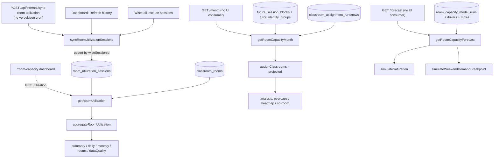

# Room Capacity

**Status: partial** — the live utilization path is fully wired (sync → API → dashboard); the month and forecast engines are complete and tested but have no frontend consumer yet (see Open questions). (No authoritative maturity-badge mapping exists to validate a more specific label.)

## Purpose

Room Capacity answers two operational questions for the BeGifted center's physical rooms: "how hard are our rooms actually being used today/this month?" (utilization) and "when will demand outgrow the rooms (and qualified tutors) we have?" (forecast). It has three logical surfaces backed by one Drizzle table group:

1. **Room utilization** — a backfilled history of every Wise session (past, present, future) mapped to a normalized room, aggregated into per-day, per-month, and per-room occupancy against a fixed 07:00–21:00 open window. This is the only surface wired into the live UI.
2. **Month capacity pressure** — for a date range, the *current* Wise room assignments and a *projected* assignment (re-run through the deterministic classroom engine) are scanned for over-capacity intervals, unmatched/unknown-room allocations, projected "no room" sessions, and a 30-minute heatmap.
3. **Capacity forecast** — a saturation/breakpoint model that expands an imported monthly student-growth forecast into synthetic demand and simulates when each weekday's rooms (and, separately, rooms + qualified tutors) saturate, plus a weekend-demand revenue-breakpoint analysis.

Primary users are non-technical admin staff on the `/room-capacity` page (which today renders the utilization dashboard only). The month and forecast computations exist as authenticated API endpoints with full engines and tests, but have no current frontend consumer (see Open questions).

## Conceptual data model

All tables live in the shared Drizzle schema (`src/lib/db/schema.ts`). For exact columns, enums, and indexes see the database reference and ERD: [docs/reference/database/erd-room-capacity.md](../reference/database/erd-room-capacity.md).

**Owned by this feature**
- `room_utilization_sessions` — the utilization history store. One row per Wise session id (unique index), holding the Bangkok-normalized timing fields, Wise status/type, the raw and normalized room label, and an occupancy count (full column list in the ERD reference). Deliberately stores **no student name or PII** — the only headcount field is `studentCount` (`src/lib/db/schema.ts:831`; regression-guarded by `utilization.test.ts:145`). Upserted by the sync (`src/lib/room-capacity/utilization.ts:441`).
- `room_capacity_model_runs` — one imported forecast model run (source label/fingerprint, forecast start/end). The forecast endpoint reads the **latest** run by `createdAt` (`data.ts:293`).
- `room_capacity_forecast_drivers` — per-scenario, per-month growth drivers (new paid students, forecast vs scheduled hours, projected revenue, capacity-utilization flags) belonging to a model run.
- `room_capacity_demand_mix` — per-model-run weekday/time/duration/mode demand buckets with observed share (the imported demand distribution).
- `room_capacity_package_mix` — per-model-run package-hour buckets with average revenue and share (used by the weekend-demand revenue model).

**Read from other features (not owned here)**
- `classroom_rooms` — the room catalog (capacity, TV, category, active, sort order). Read via `listClassroomRooms`, which seeds/repairs defaults on read. Capacity and active-room set drive every denominator and over-capacity check.
- `snapshots` — the active Wise snapshot row; the month and forecast computations scope sessions to `snapshots.active = true` (`data.ts:37`).
- `future_session_blocks` joined to `tutor_identity_groups` — the *current* session source for the month/forecast surfaces (blocking, snapshot-scoped sessions + tutor display name) (`data.ts:78`).
- `classroom_assignment_runs` / `classroom_assignment_rows` — the latest per-date admin override rooms, replayed into the projected assignment (`data.ts:127`).

Their shapes live in the same ERD reference and in [docs/reference/database/erd-classrooms.md](../reference/database/erd-classrooms.md).

## API surface

All four GET endpoints require an authenticated session. The internal POST is CRON_SECRET-protected, falling back to an authenticated admin session. Full request/response contracts are in [docs/reference/api/room-capacity.md](../reference/api/room-capacity.md).

- `GET /api/room-capacity/utilization?startDate&endDate&weekdays` — aggregated room utilization (summary + daily + monthly + per-room + data-quality) for a Bangkok date range, optionally filtered to specific weekdays. The only endpoint the UI calls.
- `GET /api/room-capacity/month?startDate&endDate` — current-vs-projected over-capacity intervals, unmatched allocations, projected no-room rows, 30-minute heatmap cells, and per-day summaries for a date range. Defaults to today → end of Bangkok month.
- `GET /api/room-capacity/forecast?scenario` — weekday saturation results, the weekend-demand breakpoint, capture-readiness diagnostics, and the scenario's monthly drivers. Returns a `status: "missing"` shape when no model run exists or the aggregate tables are absent.
- `POST /api/internal/sync-room-utilization` — refresh the utilization history from Wise (fetch all institute sessions → upsert rows). `maxDuration = 800`. **Not currently registered as a Vercel cron** (see Open questions).

## UI

- **Page**: `src/app/(app)/room-capacity/page.tsx` — a thin wrapper rendering `RoomCapacityDashboard`. Reached via the "Room Capacity" entry in `SCHEDULING_ITEMS` (`src/components/layout/app-nav.tsx:24`), which is **not** a persistent top-bar link — it is only rendered inside the "Scheduling Tools" Popover dropdown (`PopoverContent` at `app-nav.tsx:94`), so a user must open that dropdown to reach it. The persistent top-bar element is the "Scheduling Tools" trigger, not a "Room Capacity" link.
- **Dashboard**: `src/components/room-capacity/room-capacity-dashboard.tsx` — titled **"Room Utilization"**. It fetches only `/api/room-capacity/utilization`, renders five KPI StatCards (overall utilization, occupied room-hours, available room-hours, missing/unknown, overlap minutes), a weekday filter, a manual **Refresh** (re-query) and **Refresh history** (POST the internal sync, then re-query) action, and four sections: three are components exported from the same file — `DailyTrend` (last-90-day bar chart, `room-capacity-dashboard.tsx:141`), `MonthlySummary` (`:175`), and `RoomTable` (`:219`) — plus a Data quality panel that is **inline** JSX inside `RoomCapacityDashboard` (`:499`–`533`), not a separately exported section. An `EmptyState` prompts running the sync when no counted sessions exist.
- There is **no UI** for the month or forecast endpoints; nothing in `src` fetches `/api/room-capacity/month` or `/api/room-capacity/forecast`.

## Data flow

**Utilization (the live path):**
1. `POST /api/internal/sync-room-utilization` → `syncRoomUtilizationSessions` fetches **all** institute sessions (`fetchAllInstituteSessions`, no status filter → past + present + future) and maps each to a row via `wiseSessionToUtilizationRow`, keeping only rows on/after `2026-03-01`, then chunk-upserts on `wiseSessionId` (`utilization.ts:427`).
2. `GET /api/room-capacity/utilization` → `getRoomUtilization` loads rows in range, the room catalog, and `max(syncedAt)`, then `aggregateRoomUtilization` (a pure function) buckets occupied minutes into daily/monthly/per-room metrics, clipping each session to the open window and tallying data-quality counters (`utilization.ts:227`).
3. The dashboard renders the response and can trigger the sync inline.

**Month / forecast (engines without a UI):**
- `getRoomCapacityMonth` loads the active snapshot's blocking sessions, replays the latest per-date overrides through `assignClassrooms` to build *projected* rows, then runs the pure analysis helpers (`buildOvercapIntervals`, `findUnmatchedCurrentAllocations`, `findProjectedNoRoomRows`, `buildHeatmapCells`, `buildDaySummaries`) for both the `current` and `projected` sources (`data.ts:229`).
- `getRoomCapacityForecast` loads the latest model run + drivers + imported demand/package mix, the active snapshot's seed sessions, and the warm search index, then runs `simulateSaturation` and `simulateWeekendDemandBreakpoint` (`data.ts:385`).

## Business rules & edge cases

**Utilization denominator is fixed and room-count driven.** Available minutes = `activeRoomCount × (21:00 − 07:00) = activeRoomCount × 840` per counted day; per-month and per-room denominators scale by the matching day count (`utilization.ts:21`, `247`, `296`). The window is hardcoded, not configurable.

**Counted vs excluded status (fail-closed toward exclusion).** Only `ENDED`, `IN_PROGRESS`, `UPCOMING` are counted; `CANCELLED`/`CANCELED`/`MISSED`/`NO_SHOW` **and any unrecognized status** are excluded from occupied minutes and tallied as `excludedStatusCount` (`utilization.ts:55`, `135`). This is the inverse of the snapshot pipeline's "unknown = blocking" default — here unknown status is dropped, not counted.

**Sessions are clipped to the open window.** Each session's `[startMinute, endMinute]` is clamped to `[420, 1260]`; zero-length-after-clip intervals contribute nothing (`utilization.ts:172`, `333`). A session crossing midnight has its end forced to `1440` at sync time, so utilization counts only the portion inside the open window of its start date (`utilization.ts:416`).

**Missing-location and unknown-room rows are surfaced, never counted.** A counted-status row with no raw location / no normalized label → `missingLocationCount`; a normalized label that doesn't match any active room → `unknownRoomCount`. Neither adds occupied minutes (`utilization.ts:318`, `325`). Room matching is by normalized, lower-cased label.

**Overlap is reported, and can push utilization > 100%.** Within a `date|room`, `overlapExcessMinutes` sums `(activeCount − 1) × duration` across the overlap sweep; this excess is added to occupied minutes for daily/monthly/room/summary metrics, so two concurrent sessions in one room double-count by design and the UI tones >100% as a danger (`utilization.ts:215`, `355`; dashboard `barColor`/`utilizationTone` at lines 82, 89). This is intended as a room-pressure signal, not corrected away.

**Room-label normalization.** Strips a TV emoji, `:television:`, `(Lab)`, and a trailing ` (TV)` suffix, then collapses whitespace (`analysis.ts:18`). Both the utilization sync and the month/forecast analysis use the same normalizer so a Wise `"Joy (TV)"` location maps to the `"Joy"` room.

**Session load defaults to 1.** `sessionLoad` treats a missing/non-positive `studentCount` as 1 student, so over-capacity math never silently under-counts (`analysis.ts:32`).

**Month "current" vs "projected" resolve rooms differently.** For `current`, a session occupies the room named by its live Wise `location`; for `projected`, it occupies the engine's `assignedRoom`, with remote sessions and `NO_ROOM_AVAILABLE` excluded from room load (`analysis.ts:51`). Over-capacity intervals are built per `date|room` by an exact-overlap sweep where summed student load exceeds room capacity (`analysis.ts:124`).

**Forecast is import-gated and fails closed to "missing".** With no `room_capacity_model_runs` row, `getRoomCapacityForecast` returns the `missing` shape (`data.ts:391`); the route additionally catches "table does not exist" errors for any of the four aggregate tables and returns the same shape so a pre-migration database degrades gracefully (`forecast/route.ts:6`, `55`).

**Weekend-demand model has an explicit readiness gate.** `simulateWeekendDemandBreakpoint` returns `null` unless `buildWeekendDemandCaptureReadiness` reports ready; readiness requires package mix, scenario drivers, active physical rooms, seed sessions, an observed weekend onsite schedule, and a non-zero weekend preference distribution — each failure emits a typed reason code (`forecast.ts:345`, `753`). Demand is allocated to package and preferred-slot buckets via `largestRemainderCounts` for deterministic integer counts (`forecast.ts:221`), and a lead is "lost" only when its **exact** preferred weekend slot is full even if other slots are open (`forecast.ts:555`; tested at `forecast.test.ts:248`). Past the imported horizon the model extrapolates monthly drivers at a clamped trailing growth rate (−20%…+50%) for up to 36 months, marking such breakpoints `reached_extrapolated` (`forecast.ts:724`, `763`).

**Saturation simulation runs two independent occupancies.** `simulateSaturation` tracks room-only saturation (first month a demand can't fit any room slot) and room+tutor saturation (also requires a strictly-qualified, available, non-issue tutor from the search index) per weekday; tutor candidates exclude any group with data issues — the exclusion is the `.filter((group) => group.dataIssues.length === 0)` in `placeTutor()` (`forecast.ts:456`). All date math is Asia/Bangkok via the local `dates.ts` helpers.

**Internal sync auth.** `POST /api/internal/sync-room-utilization` accepts a constant-time-compared `Bearer ${CRON_SECRET}`; if the secret is unset it returns 500 (misconfigured), otherwise it falls back to an authenticated session and 401s if neither is present (`sync-room-utilization/route.ts:11`, `25`).

## Tests

Under `src/lib/room-capacity/__tests__/`, `src/app/api/room-capacity/__tests__/`, and `src/components/room-capacity/__tests__/`:

- **`utilization.test.ts`** — active-room-count × fixed-open-hours denominator; exclusion of cancelled/missed (and unknown) statuses; missing/unknown rooms reported without counting; clipping to 07:00–21:00; overlap double-counting and pressure reporting; weekday filtering of both denominator and sessions; weekday-token parsing; and the Wise→row mapping deriving Bangkok date/room label **without keeping PII**.
- **`analysis.test.ts`** — label normalization (TV/Lab suffixes); exact overlapping over-capacity + heatmap load; missing/unknown current-allocation detection; projected no-room summarization; and deterministic onsite-only demand-mix bucketing.
- **`forecast.test.ts`** — monthly-hours → weekday/time demand expansion; room-slot saturation; room+tutor saturation (no qualified tutor); student-hour-weighted weekend preference distribution; readiness ready/missing-package/missing-drivers/no-physical-room/no-weekend-schedule cases; deterministic package + preferred-slot expansion; exact-preferred-slot lost-lead accounting; and extrapolated-breakpoint marking past the imported horizon.
- **`package-mix.test.ts`** — paid-sales aggregation into per-student package-hour and revenue buckets (exercises `buildPackageMixFromSales`).
- **`dates.test.ts`** — `defaultRoomCapacityRange` today→end-of-Bangkok-month inclusivity.
- **Route tests** (`src/app/api/room-capacity/__tests__/route.test.ts`) — auth on month, utilization, and forecast; month defaults without persisting runs; explicit month/utilization date-range and weekday params; forecast Base default; the missing-forecast response before aggregate tables exist; and 400s for invalid utilization ranges/weekdays.
- **Component tests** (`src/components/room-capacity/__tests__/room-capacity-dashboard.test.tsx`) — daily macro-utilization rendering (explicitly *not* a weekly heatmap), monthly summary with occupied/available room-hours, per-room sorted table + overlap minutes, and weekday filter controls.

## Open questions

- **No Vercel cron for the utilization sync.** `POST /api/internal/sync-room-utilization` exists with `maxDuration = 800` and is wired into the dashboard's "Refresh history" button, but `vercel.json` has **no** `/api/internal/sync-room-utilization` cron entry. So the utilization history is refreshed only by one of three manual triggers: a dashboard "Refresh history" click, an external POST to the route, or the CLI script `scripts/sync-room-utilization.ts` (npm `room-utilization:sync`, `package.json:22`), which calls `syncRoomUtilizationSessions` directly and accepts a `--start-date` flag (`scripts/sync-room-utilization.ts:24`). None of these is scheduled. Confirm whether an automated cron was intended (and at what stagger), or whether manual/CLI refresh is the deliberate design.
- **Month and forecast endpoints have no UI consumer.** Nothing in `src` fetches `/api/room-capacity/month` or `/api/room-capacity/forecast`, and the `/room-capacity` page renders only the utilization dashboard. The full month/forecast engines and their tests are live but unreachable from the app. Confirm whether a dashboard is planned, these are API-only/exploratory, or they are dormant.
- *(Resolved — kept for context.)* **A manual importer writes the forecast model tables.** `scripts/import-room-capacity-model.ts` (git-tracked; npm `room-capacity:import-model`, `package.json:21`) inserts into all four aggregate tables: `room_capacity_package_mix` (`:188`), `room_capacity_model_runs` (`:293`), `room_capacity_forecast_drivers` (`:326`), and `room_capacity_demand_mix` (`:333`). It is run out-of-band as a `tsx` CLI — `npx tsx scripts/import-room-capacity-model.ts <projection.json>` — reading a projection JSON plus the dataset's `salesrecord/*.xlsx` files (`:266`, `:184`). So `GET /api/room-capacity/forecast` returns `status: "missing"` only until this importer is run; it is the answer to "how a model run is imported." There is **no** automated/scheduled importer — loading a run is a deliberate manual step.
- *(Resolved — kept for context.)* **The "builders" are the importer's building blocks, not dead code.** `buildPackageMixFromSales` (`package-mix.ts:29`) and `buildDemandMixFromSessions` (`analysis.ts:249`) DO have a production caller: the importer imports them (`import-room-capacity-model.ts:10`, `:8`) and invokes them to populate the aggregate tables — `buildPackageMixFromSales` inside `ensurePackageMixForRun` (`:185`) and `buildDemandMixFromSessions` over the active snapshot's seed sessions (`:331`). The forecast endpoint then reads the resulting `room_capacity_package_mix` / `room_capacity_demand_mix` rows. These are the importer's pure transform steps, exercised directly by `package-mix.test.ts` and `analysis.test.ts`.
- **Two different "unknown" conventions.** Utilization treats unknown Wise status as *excluded* (fail-open: drop it), whereas the snapshot/search pipeline treats unknown session status as *blocking* (fail-closed). Confirm the divergence is intentional for a utilization-reporting (vs availability-proving) context.
- **The specific linked reference docs do not exist yet.** A `docs/reference/` tree *does* exist at HEAD (it contains `crons.md` and `env.md`), but the three files this doc links — `docs/reference/database/erd-room-capacity.md`, `docs/reference/database/erd-classrooms.md`, and `docs/reference/api/room-capacity.md` — are not present: there are no `database/` or `api/` subdirectories under `docs/reference/`. The links assume the planned canonical paths; confirm final filenames when the reference set is generated.

_Verified against HEAD + uncommitted WIP on 2026-05-31._
