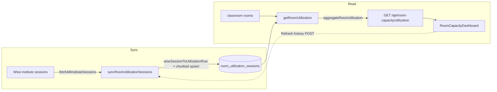

# Room Capacity

**Status: partial** — the room-utilization side (sync → API → dashboard) is fully wired and shipped; the month-view and saturation/weekend-demand forecast engines are complete and tested but have **no frontend consumer**, and the forecast model tables they read have no in-repo writer.

## Purpose

Room Capacity answers two operational questions for admin staff at the physical campus:

1. **"How hard are we using the rooms we have?"** — a backward-looking **utilization** dashboard that measures occupied room-hours against a fixed daily open window (07:00–21:00) across the active room catalog, broken down by day, month, and individual room, with explicit data-quality accounting (missing room, unknown room, excluded statuses, double-booked overlap).
2. **"When do we run out of room/tutor capacity, and what weekend demand are we leaving on the table?"** — a forward-looking **forecast** that replays a sales-driven growth model against the current Wise schedule to find the date each weekday saturates (room-slot vs. room+tutor), plus a weekend-demand "breakpoint" that estimates captured vs. lost revenue once preferred onsite slots fill.

Only the first is surfaced in the UI today. The `/room-capacity` page renders the utilization dashboard exclusively. The month-capacity and forecast services are reachable through authenticated API routes but have no page wired to them in `app-nav.tsx` (which lists only `/room-capacity`, [`src/components/layout/app-nav.tsx:24`](../../src/components/layout/app-nav.tsx)).

The audience is non-technical admin/operations staff (the same Auth.js `admin_users` allowlist as the rest of the app). All three read endpoints require an admin session; none are public.

## Conceptual data model

Room Capacity is a **read-mostly** feature. It computes its analytics from data owned by other subsystems and persists only one table of its own.

**Reads (owned elsewhere):**
- **Active Wise snapshot + future session blocks + identity groups** — `getRoomCapacityMonth`/`getRoomCapacityForecast` load *blocking* `future_session_blocks` for the active snapshot, joined to `tutor_identity_groups` for the tutor display name ([`src/lib/room-capacity/data.ts:70`](../../src/lib/room-capacity/data.ts)). The search index (`ensureIndex`) is also consulted to model tutor availability during saturation simulation ([`data.ts:409`](../../src/lib/room-capacity/data.ts)).
- **Classroom rooms + latest assignment overrides** — the room catalog comes from `listClassroomRooms` (Classrooms feature), and the "projected" view re-runs the classroom **assignment engine** (`assignClassrooms`) using the latest per-day `classroom_assignment_runs` / `classroom_assignment_rows` override room ([`data.ts:127`](../../src/lib/room-capacity/data.ts)).
- **Forecast model tables** — `room_capacity_model_runs`, `room_capacity_forecast_drivers`, `room_capacity_demand_mix`, `room_capacity_package_mix` are read by the forecast service to obtain scenario drivers, demand mix, and package mix ([`data.ts:293`–`356`](../../src/lib/room-capacity/data.ts)). **No code in this repo writes these tables** — see [Open questions](#open-questions).

**Writes (owned by this feature):**
- **`room_utilization_sessions`** — one row per Wise session (deduped on `wise_session_id`), carrying the normalized room label, Bangkok date/weekday, clipped minutes, status, and student count. It is **snapshot-independent** (survives snapshot rotation) and is grouped under the *core* domain in the schema even though this feature owns it. Written by `syncRoomUtilizationSessions` via chunked `INSERT … ON CONFLICT DO UPDATE` ([`src/lib/room-capacity/utilization.ts:427`](../../src/lib/room-capacity/utilization.ts)).

Conceptual table grains, columns, and indexes live in the reference (do not restate them here):
- Forecast model tables → [docs/reference/database/erd-room-capacity.md](../reference/database/erd-room-capacity.md)
- `room_utilization_sessions` (grouped under core) → [docs/reference/database/erd-core.md](../reference/database/erd-core.md) and the [database index](../reference/database/index.md)

## API surface

Three authenticated read endpoints plus one sync endpoint. Full request/response contracts live in [docs/reference/api/room-capacity.md](../reference/api/room-capacity.md) — do not restate schemas here.

| Method | Path | Purpose |
|---|---|---|
| `GET` | `/api/room-capacity/utilization` | Backward-looking utilization (summary + daily + monthly + per-room + data quality) over a date/weekday range. **The only endpoint the UI calls.** ([route](../../src/app/api/room-capacity/utilization/route.ts)) |
| `GET` | `/api/room-capacity/month` | Current-vs-projected room-capacity view for a Bangkok-month range: overcap intervals, unmatched allocations, projected no-room rows, heatmap cells, day summaries. **No frontend consumer.** ([route](../../src/app/api/room-capacity/month/route.ts)) |
| `GET` | `/api/room-capacity/forecast` | Weekday saturation dates + weekend-demand breakpoint + readiness + monthly drivers for a scenario (`?scenario=`, defaults `Base`). Returns a typed `model.status: "missing"` payload when no model run exists. **No frontend consumer.** ([route](../../src/app/api/room-capacity/forecast/route.ts)) |
| `POST` | `/api/internal/sync-room-utilization` | Backfills/refreshes `room_utilization_sessions` from all Wise institute sessions. Cron-or-admin dual auth; triggered manually from the dashboard "Refresh history" button. ([route](../../src/app/api/internal/sync-room-utilization/route.ts)) |

The full internal-cron auth model is documented in [docs/reference/api/internal-crons.md](../reference/api/internal-crons.md).

## UI

- **Page**: [`src/app/(app)/room-capacity/page.tsx`](../../src/app/(app)/room-capacity/page.tsx) — a thin server component that renders the dashboard client component. Nav label "Room Capacity" ([`app-nav.tsx:24`](../../src/components/layout/app-nav.tsx)).
- **Component**: [`src/components/room-capacity/room-capacity-dashboard.tsx`](../../src/components/room-capacity/room-capacity-dashboard.tsx) — a `"use client"` dashboard titled **"Room Utilization"**. It owns its own data fetching (`useEffect` → `/api/room-capacity/utilization`), a weekday filter, a "Refresh" (reload) and a "Refresh history" (POST sync then reload) button, and an empty/error/skeleton state. Sub-views (all in the same file): five summary `StatCard`s, `DailyTrend` (last-90-day bar chart), `MonthlySummary` (table), `RoomTable` (per-room, sorted by utilization), a data-quality panel, and `WeekdayFilter`. The `EmptyState` instructs the operator to run the Wise room-utilization sync to backfill from March 2026 ([`room-capacity-dashboard.tsx:267`](../../src/components/room-capacity/room-capacity-dashboard.tsx)).

There is **no UI** that consumes `/api/room-capacity/month` or `/api/room-capacity/forecast`. The dashboard is utilization-only.

## Data flow

The feature splits into two largely independent pipelines that share only the room catalog and the Bangkok date helpers.

**Utilization (live in the UI):**

1. **Sync** — `POST /api/internal/sync-room-utilization` calls `syncRoomUtilizationSessions`, which fetches all institute sessions from Wise, maps each to a row (Bangkok date/weekday, minute-of-day, normalized room label, status, student count) and upserts in 500-row chunks deduped on `wise_session_id` ([`utilization.ts:427`](../../src/lib/room-capacity/utilization.ts)). This route is **not** registered in `vercel.json` (see Open questions); in practice it runs on demand from the dashboard.
2. **Aggregate** — `getRoomUtilization` loads stored rows in range, the room catalog, and the latest `synced_at`, then `aggregateRoomUtilization` builds daily/monthly/per-room metrics + data quality against a fixed denominator (active rooms × 07:00–21:00) ([`utilization.ts:227`,`474`](../../src/lib/room-capacity/utilization.ts)).
3. **Render** — the dashboard fetches the JSON and renders the cards/tables; the weekday filter narrows both the denominator and the counted sessions server-side.

**Month + forecast (engines only, no UI):**

1. `getRoomCapacityMonth` loads blocking future sessions for the active snapshot, builds a **projected** copy by re-running the classroom assignment engine with latest overrides, then computes overcap intervals, unmatched current allocations, projected no-room rows, heatmap cells, and day summaries for both the *current* (Wise `location`) and *projected* (assignment-engine room) sources ([`data.ts:229`](../../src/lib/room-capacity/data.ts)).
2. `getRoomCapacityForecast` loads the latest model run + its drivers/demand-mix/package-mix, seeds onsite demand from the schedule, consults the search index for tutor availability, and runs `simulateSaturation` + `simulateWeekendDemandBreakpoint` ([`data.ts:385`](../../src/lib/room-capacity/data.ts), [`forecast.ts:473`,`753`](../../src/lib/room-capacity/forecast.ts)).

## Business rules & edge cases

- **Fixed open window, clip don't extend.** Utilization uses a constant 07:00–21:00 day (`ROOM_UTILIZATION_OPEN_START_MINUTE`/`_END_MINUTE`, [`utilization.ts:21`](../../src/lib/room-capacity/utilization.ts)). Each session is clipped to that window before counting (`clippedInterval`, [`utilization.ts:172`](../../src/lib/room-capacity/utilization.ts)); a session ending on a later Bangkok day is truncated at 24:00 of the start day (`endMinute === utilizationDate ? … : 24*60`, [`utilization.ts:416`](../../src/lib/room-capacity/utilization.ts)).
- **Status gating is fail-closed-by-exclusion.** Only `ENDED`/`IN_PROGRESS`/`UPCOMING` are counted; `CANCELLED`/`CANCELED`/`MISSED`/`NO_SHOW` **and any unrecognized status** are excluded and bucketed as `excludedStatus` ([`utilization.ts:55`,`135`](../../src/lib/room-capacity/utilization.ts)). `isExcludedUtilizationStatus` excludes anything not in the counted set, so an unknown status is dropped from occupancy rather than counted — consistent with the project's "don't overstate usage" stance.
- **Missing vs. unknown room are distinct.** A session with no raw/normalized location is `missingLocation`; one whose normalized label doesn't match an active room is `unknownRoom`. Both are excluded from occupied minutes but tracked (count + minutes) in `dataQuality` and per day/month ([`utilization.ts:318`–`331`](../../src/lib/room-capacity/utilization.ts)).
- **Overlap can push utilization over 100%.** Concurrent sessions in the same room/day add excess minutes via `overlapExcessMinutes` (sweep-line, `(activeCount-1) * span`), surfaced as `overlapMinutes` data-quality, not subtracted ([`utilization.ts:215`,`355`](../../src/lib/room-capacity/utilization.ts)). The dashboard flags it as "double-counted room pressure" that "can push utilization over 100%".
- **Room-label normalization strips TV/lab decoration.** `normalizeRoomLabel` removes the 📺 / `:television:` emoji, `(Lab)`, and a trailing `(TV)` and collapses whitespace ([`analysis.ts:18`](../../src/lib/room-capacity/analysis.ts)); the same function backs utilization label matching ([`utilization.ts:105`](../../src/lib/room-capacity/utilization.ts)).
- **Session load defaults to 1.** Overcap/heatmap "load" uses `studentCount` when finite and positive, else 1 (`sessionLoad`, [`analysis.ts:32`](../../src/lib/room-capacity/analysis.ts)). Overcap intervals are only emitted where load strictly exceeds room capacity ([`analysis.ts:138`](../../src/lib/room-capacity/analysis.ts)).
- **Current vs. projected room resolution differ.** For `source: "current"` a session resolves to a room via its Wise `location`; for `"projected"` it resolves via the assignment-engine `assignedRoom`, skipping remote sessions (`REMOTE_NO_ROOM_NEEDED`) and the `NO_ROOM_AVAILABLE` sentinel ([`analysis.ts:51`](../../src/lib/room-capacity/analysis.ts)).
- **Month view consumes only blocking sessions.** `loadSessionsForRange` filters `isBlocking = true` ([`data.ts:105`](../../src/lib/room-capacity/data.ts)), so cancelled/non-blocking sessions never enter the capacity math — consistent with the global fail-closed rule.
- **Forecast degrades gracefully when the model is absent.** With no `room_capacity_model_runs` row, `getRoomCapacityForecast` returns a `status: "missing"` skeleton ([`data.ts:358`,`391`](../../src/lib/room-capacity/data.ts)); the route additionally treats `relation does not exist`-style errors for any of the four forecast tables as a 200 "missing" body rather than a 500 (`isMissingForecastTableError`, [`forecast/route.ts:6`](../../src/app/api/room-capacity/forecast/route.ts)).
- **Demand-mix fallback.** If the imported `room_capacity_demand_mix` is empty, the forecast derives demand from the current schedule (`seededDemandMixFromSchedule`) instead ([`data.ts:408`](../../src/lib/room-capacity/data.ts), [`forecast.ts:832`](../../src/lib/room-capacity/forecast.ts)).
- **Scenario fallback.** An unknown/empty scenario falls back to the first available scenario's drivers, and the response echoes the scenario actually used ([`data.ts:395`](../../src/lib/room-capacity/data.ts)).
- **Saturation is two-track and deterministic.** `simulateSaturation` walks scenario drivers month-by-month, placing each incremental demand into the smallest-capacity eligible room; it records `roomSlotFullDate` (room-only) and `roomTutorFullDate` (room **and** a strictly-qualified, available, non-data-issue tutor from the search index) per weekday ([`forecast.ts:473`](../../src/lib/room-capacity/forecast.ts)). Tutor eligibility is itself fail-closed: groups with any `dataIssues` are skipped ([`forecast.ts:457`](../../src/lib/room-capacity/forecast.ts)).
- **Weekend-demand breakpoint has an explicit readiness gate.** `buildWeekendDemandCaptureReadiness` returns reason codes (missing package mix, missing scenario drivers, no active physical rooms, missing seed sessions, no weekend onsite schedule, zero weekend preference distribution); `simulateWeekendDemandBreakpoint` returns `null` unless `ready` ([`forecast.ts:345`,`753`](../../src/lib/room-capacity/forecast.ts)). It models only `preferred_slot_only` placement against `current_wise_schedule` preferences, and will **extrapolate** beyond the imported horizon (trailing-growth-rate clamped to [-0.2, 0.5], up to 36 months) to find a breakpoint, marking it `reached_extrapolated` ([`forecast.ts:724`,`739`,`763`](../../src/lib/room-capacity/forecast.ts)).
- **Sync auth is dual-mode.** `POST /api/internal/sync-room-utilization` accepts a constant-time `CRON_SECRET` bearer (`timingSafeEqual` + length pre-check) **or** an Auth.js admin session, and wraps the run in `withCronInvocationAudit` under job key `room_utilization`. A missing `CRON_SECRET` with no session returns 500 ("Server misconfigured"), not 401 ([`sync-room-utilization/route.ts:12`,`26`](../../src/app/api/internal/sync-room-utilization/route.ts)).
- **No PII persisted in utilization rows.** `wiseSessionToUtilizationRow` keeps timing, status, location label, and a numeric student count only — no student names — and the test "derives Bangkok date and room label … without keeping PII fields" guards this ([`utilization.ts:400`](../../src/lib/room-capacity/utilization.ts)).

## Tests

All tests live under `src/lib/room-capacity/__tests__/`, `src/app/api/room-capacity/__tests__/`, and `src/components/room-capacity/__tests__/` and run via `npm test`.

- **`utilization.test.ts`** — denominator from active rooms × fixed open hours; exclusion of cancelled/missed statuses; missing/unknown room handling without counting them as used; 07:00–21:00 clipping; overlap double-counting; weekday filtering of denominator and sessions; weekday-token parsing; and the no-PII row-derivation guard.
- **`analysis.test.ts`** — label normalization (TV/lab suffixes); exact overcap-interval + heatmap-load detection; missing/unknown current allocations; projected no-room summarization; deterministic onsite-only demand-mix bucketing.
- **`forecast.test.ts`** — monthly-hours → weekday/time demand expansion; room-slot vs. room+tutor saturation marking; student-hour-weighted weekend preference distribution; the readiness matrix (ready, missing package mix, missing scenario drivers, no active physical rooms, missing weekend onsite schedule); deterministic package/preferred-slot expansion; lost-vs-open-slot accounting; and the extrapolated-breakpoint path.
- **`package-mix.test.ts`** — aggregation of paid sales into per-student package-hour/revenue buckets (exercises `buildPackageMixFromSales`, which has no non-test caller — see Open questions).
- **`dates.test.ts`** — `defaultRoomCapacityRange` covering today through the inclusive last day of the Bangkok month.
- **API `route.test.ts`** — auth gating on month/utilization; service defaults vs. explicit ranges (and that month reads do **not** persist runs); forecast scenario default `Base`; the "missing forecast response before aggregate tables exist" path; and 400s for invalid utilization ranges/weekdays.
- **Component `room-capacity-dashboard.test.tsx`** — renders daily macro utilization (not a weekly heatmap), the monthly summary with occupied/available room-hours, the per-room sorted table with overlap minutes, and the weekday filter controls.

## Open questions

- **`/api/internal/sync-room-utilization` has no `vercel.json` cron entry.** The handler carries `maxDuration = 800` and dual cron/admin auth as if it were a scheduled job, but `vercel.json` registers no path for it ([`vercel.json`](../../vercel.json) lists `sync-wise`, `sync-sales-dashboard`, `sync-credit-control`, `sync-progress-tests`, `progress-tests/admin-digest`, `sync-wise-activity`, `sync-leave-requests`, two class-assignment jobs, and a student-promotion job — but **not** room utilization). Consequently `room_utilization_sessions` only refreshes when an admin clicks "Refresh history" in the dashboard. Intentional manual-only, or a missing cron registration? (Separately, the live `vercel.json` has 10 cron entries, not the 7 some prose docs claim.)
- **The four forecast model tables have no in-repo writer.** `room_capacity_model_runs`, `room_capacity_forecast_drivers`, `room_capacity_demand_mix`, and `room_capacity_package_mix` are only ever read ([`data.ts:293`–`356`](../../src/lib/room-capacity/data.ts)); a codebase-wide search finds no `insert(...)` into them outside tests. The forecast feature therefore returns `model.status: "missing"` until those rows are populated by some external/out-of-band process. Where is the model-run importer meant to live, and is it expected in this repo?
- **`buildPackageMixFromSales` appears to be unused production code.** It is exercised by `package-mix.test.ts` but has no non-test caller; the forecast reads package mix straight from `room_capacity_package_mix`. Is this a staged helper for the (missing) model-run importer, or dead code?
- **Month and forecast engines are shipped but unreachable from the UI.** Both `getRoomCapacityMonth` and `getRoomCapacityForecast` are fully implemented, tested, and exposed via authenticated routes, yet no page consumes them and `/room-capacity` renders utilization only. Is a capacity/forecast page planned, or are these endpoints intended for API-only/ad-hoc use?

_Verified against HEAD `d4fe6d3` on 2026-06-05._
