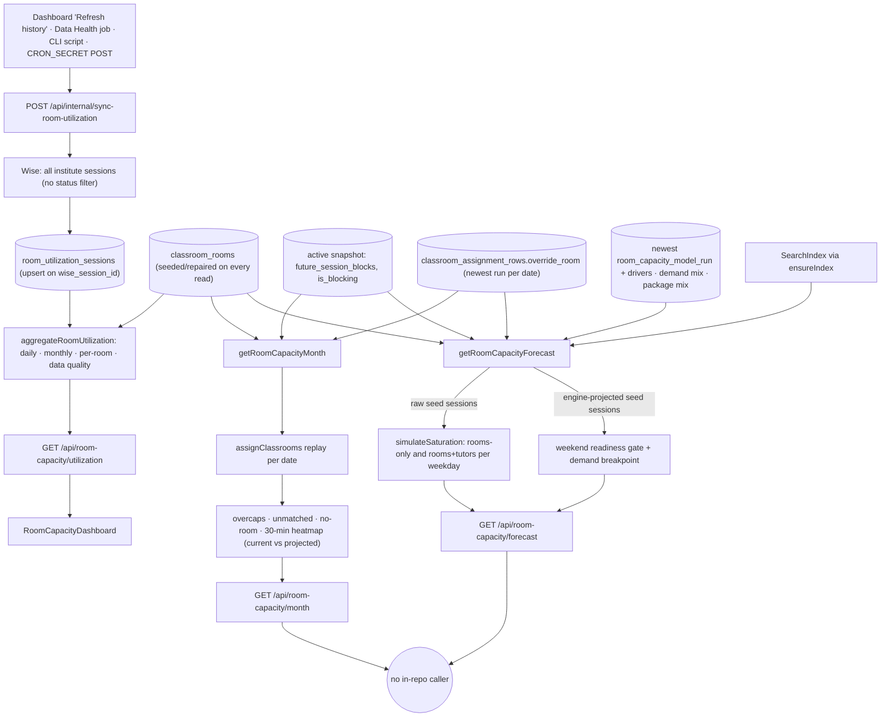

# Room Capacity

**Status: stable (utilization); forecast/month engines have no UI caller; sync is manualOnly** — a handbook designation, not a code marker. No `@deprecated`, `TODO`, or `FIXME` exists under `src/lib/room-capacity/`, `src/app/api/room-capacity/`, `src/app/api/internal/sync-room-utilization/`, `src/app/(app)/room-capacity/`, or `src/components/room-capacity/`, so maturity is read off the wiring instead: the **utilization** path is complete end to end (Wise sync → `room_utilization_sessions` → `GET /api/room-capacity/utilization` → the `/room-capacity` dashboard); the **month** and **forecast** engines are implemented, unit-tested, and exposed as authenticated endpoints, but the only fetch of either in `src/` is their own route test — the dashboard calls exactly two URLs, the utilization read (`src/components/room-capacity/room-capacity-dashboard.tsx:354`) and the internal sync `POST` (`:375`); and the sync is registered `schedule: null`, `cadenceLabel: "Manual only"`, `manualOnly: true` (`src/lib/data-health/cron-registry.ts:370-383`) with **no entry in `vercel.json`** (the file's 17 `crons` paths contain no `room` path at all). See [Open questions](#open-questions).

## Purpose

Room Capacity answers two questions about the BeGifted centre's physical rooms.

1. **"How hard are the rooms actually being used?"** — the live surface. A sync pulls every institute session from Wise, normalizes each to a Bangkok date, weekday, start/end minute, and a cleaned room label, and upserts it into a snapshot-independent store. The dashboard then aggregates that store into daily, monthly, and per-room occupancy against a fixed 07:00–21:00 open window, with a data-quality strip that shows how many sessions were *not* counted and why.
2. **"When do we run out of rooms (and tutors)?"** — two on-demand analytical surfaces with no UI. The **month pressure** view compares the room load implied by Wise's own `location` values against what the shared classroom assignment engine would produce (over-capacity intervals, unmatched allocations, projected "no room" sessions, 30-minute heatmaps). The **forecast** view takes an imported growth model (per-scenario monthly drivers, a demand mix, a package mix) and simulates when each weekday's rooms — and then rooms *plus qualified tutors* — saturate, and when weekend demand starts losing more revenue than it captures.

Code records no user persona; the closest statement of audience is the nav entry, registered as **Room Capacity** in the *Scheduling & Tutors* section with the description "Track room utilization and capacity pressure." (`src/lib/navigation/tools.ts:142-147`, description at `:145`). It has no count badge. There is **no role model**: all three read routes gate on `auth()` returning any session (`src/app/api/room-capacity/utilization/route.ts:7-10`, `month/route.ts:7-10`, `forecast/route.ts:44-47`). `/api/room-capacity/**` is not on the middleware public allowlist, so a restricted user reaches it only when an `allowedPages` entry prefix-matches `/room-capacity`; `/api/internal/*` *is* allowlisted (`src/middleware.ts:10-25`, the internal prefix at `:24`), so the sync route's own secret-or-session check is its only gate.

**Read-only toward Wise; not write-free locally.** Nothing here updates a room, a `location`, or a session in Wise — the feature's sole Wise call is the session fetch in the sync (`src/lib/room-capacity/utilization.ts:436`). Locally it writes in three places: the sync upserts `room_utilization_sessions`; every authorized sync invocation records a `cron_invocations` audit row (`src/app/api/internal/sync-room-utilization/route.ts:42-53`); and **all three read paths write as a side effect**, because `getRoomUtilization`, `getRoomCapacityMonth`, and `getRoomCapacityForecast` each call `listClassroomRooms` (`utilization.ts:493`; `src/lib/room-capacity/data.ts:237`, `:402`), which first runs `ensureDefaultClassroomRooms` — inserting any missing default room, `UPDATE`-ing drifted attributes back to the defaults, and deactivating superseded physical TV rooms (`src/lib/classrooms/data.ts:431-488`, called at `:491`).

Two things live under this feature's directory but are not really its own:

- **`src/lib/room-capacity/dates.ts` is the app's de-facto Bangkok date utility.** `todayBangkok`, `addBangkokDays`, `bangkokDateKey`, `bangkokDateStartUtc`, `datesBetweenBangkok`, `endOfBangkokMonth`, and `minuteToTimeLabel` are imported by 47 tracked files under `src/` outside the three feature directories (46 source files plus one test — `grep -rl 'room-capacity/dates' src` minus `src/lib/room-capacity/`, `src/components/room-capacity/`, and `src/app/api/room-capacity/`) — payroll, LINE bots, post-class feedback, admissions, student schedule, student report, sales dashboard, Wise activity, classrooms, leave requests, progress tests, and the home summary all depend on it. Moving or deleting this feature would not remove that module.
- **`ROOM_UTILIZATION_HISTORY_START = "2026-03-01"`** (`utilization.ts:20`) is cited by Progress Tests as *the* post-migration boundary before which Wise data is unreliable (`src/lib/progress-tests/config.ts:3-5`), and the schema comment for the progress-test ledger names `room_utilization_sessions` as the precedent for a cross-snapshot table with that history start (`src/lib/db/schema.ts:2809`).

## Conceptual data model

Column-level detail lives in the database reference. This section covers what each table *means* here.

- **[docs/reference/database/erd-room-capacity.md](../reference/database/erd-room-capacity.md)** — the four forecast-model tables.
- **[docs/reference/database/erd-core.md](../reference/database/erd-core.md)** — `room_utilization_sessions` (stored on the core spine, owned here), plus `snapshots`, `future_session_blocks`, and `tutor_identity_groups`.
- **[docs/reference/database/erd-classrooms.md](../reference/database/erd-classrooms.md)** — `classroom_rooms`, `classroom_assignment_runs`, `classroom_assignment_rows`.

**Owned by this feature — five tables**

- **`room_utilization_sessions`** (`schema.ts:1739-1759`, migration `drizzle/0011_room_utilization_sessions.sql`) — the utilization store: one row per Wise session, unique on `wise_session_id` (`:1756`), refreshed by upsert rather than rewritten per snapshot. It is **snapshot-independent**, which is why the dashboard can report on months that no longer exist in any active snapshot's forward-looking `future_session_blocks`. It keeps the Wise status, session type, the raw `location` and its normalized label, and the student *count* — but no student names or titles; a test pins that the converter drops `title` and `studentName` (`src/lib/room-capacity/__tests__/utilization.test.ts:145-170`).
- **`room_capacity_model_runs`** (`schema.ts:2729`) — one imported forecast run: source label, a SHA-256 fingerprint of the source file that is unique so a byte-identical re-import cannot create a second run, and the forecast horizon. The forecast surface always reads the **newest** run by `created_at` (`data.ts:293-300`); there is no active/promotion flag.
- **`room_capacity_forecast_drivers`** (`schema.ts:2743`) — per-run, per-scenario, per-month growth drivers: new paid students, forecast-consumed vs already-scheduled hours, projected revenue, and the capacity flags. The scenario list the API offers is derived from these rows, not from a fixed enum (`data.ts:394`).
- **`room_capacity_demand_mix`** (`schema.ts:2766`) — the shape of *incremental* demand for a run: what a typical new session looks like and what share of demand it represents, so forecast hours can be expanded into concrete slots rather than treated as a scalar (columns and producer behaviour: [erd-room-capacity.md](../reference/database/erd-room-capacity.md#roomcapacitydemandmix--room_capacity_demand_mix)). Optional: an empty mix makes the reader derive one from the live schedule instead (`data.ts:408`).
- **`room_capacity_package_mix`** (`schema.ts:2784`, added later in `drizzle/0008_reflective_shadowcat.sql` versus `0007_purple_daredevil.sql` for the other three) — per-run package-hour buckets with per-student average revenue and student-weighted share. Consumed only by the weekend-demand revenue model.

The schema comment above the four forecast tables states the boundary explicitly: they "store only aggregate forecast/model inputs" and the Vercel runtime "must not read local workbook paths" (`schema.ts:2724-2728`). The only writer to all four is the offline CLI `scripts/import-room-capacity-model.ts` (`npm run room-capacity:import-model`, `package.json:21`); a repo-wide search for the four Drizzle exports outside `schema.ts` returns only that script and the reader in `data.ts:293-356`.

**Read, not owned**

- **`classroom_rooms`** — the room catalogue owned by Classroom Assignments ([erd-classrooms.md](../reference/database/erd-classrooms.md#classroomrooms--classroom_rooms)). Active rooms and their capacities drive every denominator, every over-capacity test, and every placement decision; the `online_only` category matters here because such rooms can never host onsite demand (see [Forecast](#forecast)). Read through `listClassroomRooms`, which seeds and repairs defaults on read (see [Purpose](#purpose)).
- **`snapshots` + `future_session_blocks` ⨝ `tutor_identity_groups`** — the *current* forward schedule used by the month and forecast surfaces, scoped to the single `active = true` snapshot and to `is_blocking = true` rows only (`data.ts:37-45`, `:102-108`).
- **`classroom_assignment_runs` / `classroom_assignment_rows`** — only the newest run per `assignment_date` in range contributes, and only rows with a non-null `override_room`; those admin overrides are replayed into the projected assignment (`data.ts:127-167`).
- **The in-memory `SearchIndex`** — the forecast calls `ensureIndex(db)` (`data.ts:409`; `src/lib/search/index.ts:354`) to test tutor availability, qualifications, leaves, and session blocks during placement. When no index is cached, `ensureIndex` falls through to `buildIndex`, which loads the active snapshot's identity groups, members, qualifications, availability windows, leaves, session blocks, data issues, and business profiles (`index.ts:142-174`, `:388`) — so on a cold process the forecast read pays for a full snapshot load.

## API surface

Three read endpoints under `src/app/api/room-capacity/` plus one internal write endpoint. Request/response contracts, query-parameter tables, status codes, and side effects are in the reference: **[docs/reference/api/room-capacity.md](../reference/api/room-capacity.md)**; scheduling context in **[docs/reference/crons.md](../reference/crons.md)**.

- **`GET /api/room-capacity/utilization`** — daily / monthly / per-room occupancy plus data-quality counts for a Bangkok date range and optional weekday filter; the only *read* the UI calls. `src/app/api/room-capacity/utilization/route.ts`
- **`GET /api/room-capacity/month`** — current-vs-projected room pressure for a date range: over-capacity intervals, unmatched Wise allocations, projected no-room sessions, and 30-minute heatmaps. No in-repo caller. `src/app/api/room-capacity/month/route.ts`
- **`GET /api/room-capacity/forecast`** — weekday saturation dates and the weekend-demand revenue breakpoint for `?scenario=` (default `Base`), from the newest imported model run. No in-repo caller. `src/app/api/room-capacity/forecast/route.ts`
- **`POST /api/internal/sync-room-utilization`** — refetches all institute sessions from Wise and upserts `room_utilization_sessions`; accepts a constant-time `CRON_SECRET` bearer **or** an admin session. The dashboard's *Refresh history* button posts here. `POST` is the only exported method (`route.ts:26`). `src/app/api/internal/sync-room-utilization/route.ts`

Conventions worth knowing: none of the four handlers uses Zod (the reads hand raw `searchParams` strings to the service layer; the `POST` reads no body), none declares `"use cache"` or `cacheTag`, and the reads return the service object bare while the sync spreads its result into `{ ok: true, ... }` (`sync-room-utilization/route.ts:47`).

**Two further entry points reach `syncRoomUtilizationSessions` without that route.** The Data Health manual job runner, `POST /api/data-health/jobs/room_utilization/run`, resolves the registry key and calls the same function in-process under the same audit wrapper (`src/app/api/data-health/jobs/[jobKey]/run/route.ts:13-43` → `src/lib/data-health/run-job.ts:34-40`, `:197-205`; documented in [docs/reference/api/data-health.md](../reference/api/data-health.md#post-apidata-healthjobsjobkeyrun)). The Data Health dashboard lists every registry job as a manual-control button, `room_utilization` included (`src/lib/data-health/dashboard.ts:989-994`; `src/components/data-health/data-health-dashboard.tsx:151-183`), and the job is not flagged `dangerous`, so no confirmation is required (`cron-registry.ts:380`; `run/route.ts:32-41`). The other path is the CLI `scripts/sync-room-utilization.ts` (`npm run room-utilization:sync`, `package.json:22`) — the **only** caller that can pass a custom `--start-date` (`scripts/sync-room-utilization.ts:23-24`); no HTTP path exposes that parameter.

## UI

- **Page** — `src/app/(app)/room-capacity/page.tsx`: a five-line Server Component that renders `<RoomCapacityDashboard />` with no props (`:1-5`). No `auth()` re-check and no `<Suspense>`; the middleware gate is the only one.
- **Component** — `src/components/room-capacity/room-capacity-dashboard.tsx` (`RoomCapacityDashboard`, `"use client"`). It fetches on mount and whenever the weekday filter changes (`:347-358`, `:386-388`), sending `weekdays=` only when fewer than seven days are selected (`:350-352`). It renders:
  - a header with the resolved range, open window, day filter, and *Last synced* time (`:423-429`), the **WeekdayFilter** (`:286-338`), a **Refresh** button that re-reads the API (`:360-369`, `:437-440`), and a **Refresh history** button that `POST`s the internal sync and then re-reads (`:371-384`, `:441-444`);
  - five KPI cards — overall utilization (amber at ≥75%, red at ≥100%), occupied room-hours, available room-hours with active-room count, missing/unknown-room count with excluded hours, and overlap minutes captioned "Double-counted room pressure" (`:454-488`);
  - an **EmptyState** when the summary has zero sessions, telling the operator to "Run the Wise room-utilization sync to backfill sessions from March 2026" (`:267-276`, `:490`);
  - **DailyTrend** — a bar chart of the last 90 *returned rows* (`rows.slice(-90)`, `:142`), badge "N days" (`:150`), tooltips with percentage and hours;
  - **MonthlySummary** and **RoomTable** — tables sharing one colour ramp (green below 45%, primary to 75%, amber to 100%, conflict above; `:82-95`), the room table sorted by utilization and showing category, occupied hours, sessions, and overlap (`:219-265`);
  - a **Data quality** strip with four cards — missing room, unknown room, excluded statuses, overlap — captioned "Excluded from utilization unless they map to an active room and counted status" (`:499-533`).

Because the API returns only dates matching the weekday filter (`utilization.ts:244`), a single-weekday selection stretches the 90-bar daily chart over roughly 90 weeks of calendar time while the badge still reads "90 days".

**There is no UI for the month or forecast endpoints.** The git history shows there once was: `6d076c9` (2026-05-15, "Add room capacity dashboard") introduced a 540-line dashboard, and `3cc56f1` (2026-05-18, "Add room utilization dashboard") rewrote the same file (+257/−537, 540 → 260 lines), rewrote its test (+68/−243), and added the utilization route; the surviving component test asserts the daily trend renders "instead of a weekly load heatmap" and that neither "Weekly heatmap" nor "Peak room load" appears (`src/components/room-capacity/__tests__/room-capacity-dashboard.test.tsx:55-68`).

## Data flow

**Utilization (live path).** The sync fetches *every* institute session from Wise with no `status` filter (`utilization.ts:436` → `fetchAllInstituteSessions`, `src/lib/wise/fetchers.ts:117-147`, paginating at `PAGE_LIMIT = 1000`, `:24`), converts each to a Bangkok-normalized row — skipping sessions missing an id or a parseable start/end (`utilization.ts:400-404`) — keeps rows on or after the history start (`:437-439`), and upserts them in 500-row chunks keyed on `wiseSessionId` with every mutable field refreshed (`:54`, `:441-464`). Reads then load the rows in range, the room catalogue, and the table-wide `max(synced_at)` in parallel (`:485-497`) and hand them to the pure aggregator (`:499-506`). Wise is never on the read path.

**Month pressure (on demand, nothing persisted).** Load blocking sessions for the active snapshot in range, the room catalogue, and the newest per-date overrides; replay `assignClassrooms` day by day to get a *projected* room per session (`data.ts:193-227`, engine call at `:203-207`); then run the same analyses twice — once resolving rooms from Wise's `location` (*current*), once from the engine's `assignedRoom` (*projected*) — and return both alongside KPIs (`data.ts:229-291`).

**Forecast (on demand, heaviest read).** Load the newest model run and its drivers, pick the scenario (falling back to the first available when the requested one has no rows, `data.ts:394-397`), and set the seed window from `forecastStart` to the end of the last driver month (`:398-399`). Load the snapshot sessions for that window, replay the engine to get projected seed sessions (`:403-405`), load the demand and package mixes (falling back to a schedule-derived demand mix when the run has none, `:406-408`), and build the search index (`:409`). Then run two simulations: `simulateSaturation` over the **raw** seed sessions (`:411-417`) and the weekend readiness gate + breakpoint over the **engine-projected** seed sessions (`:418-425`).

```mermaid
flowchart TD
    Trigger["Dashboard 'Refresh history' · Data Health job · CLI script · CRON_SECRET POST"] --> SyncRoute["POST /api/internal/sync-room-utilization"]
    SyncRoute --> Wise["Wise: all institute sessions (no status filter)"]
    Wise --> RUS[("room_utilization_sessions (upsert on wise_session_id)")]
    RUS --> Agg["aggregateRoomUtilization: daily · monthly · per-room · data quality"]
    Rooms[("classroom_rooms (seeded/repaired on every read)")] --> Agg
    Agg --> UtilAPI["GET /api/room-capacity/utilization"]
    UtilAPI --> Dash["RoomCapacityDashboard"]

    Snap[("active snapshot: future_session_blocks, is_blocking")] --> Month["getRoomCapacityMonth"]
    Rooms --> Month
    Overrides[("classroom_assignment_rows.override_room (newest run per date)")] --> Month
    Month --> Replay["assignClassrooms replay per date"]
    Replay --> Analysis["overcaps · unmatched · no-room · 30-min heatmap (current vs projected)"]
    Analysis --> MonthAPI["GET /api/room-capacity/month"]

    Model[("newest room_capacity_model_run + drivers · demand mix · package mix")] --> Forecast["getRoomCapacityForecast"]
    Snap --> Forecast
    Rooms --> Forecast
    Overrides --> Forecast
    Index["SearchIndex via ensureIndex"] --> Forecast
    Forecast -->|raw seed sessions| Sat["simulateSaturation: rooms-only and rooms+tutors per weekday"]
    Forecast -->|engine-projected seed sessions| Weekend["weekend readiness gate + demand breakpoint"]
    Sat --> ForecastAPI["GET /api/room-capacity/forecast"]
    Weekend --> ForecastAPI

    MonthAPI --> NoUI(("no in-repo caller"))
    ForecastAPI --> NoUI
```

## Business rules & edge cases

### Utilization

- **Counted statuses are an allowlist; everything else is excluded, including unknowns.** Only `ENDED`, `IN_PROGRESS`, and `UPCOMING` contribute occupancy; `CANCELLED`/`CANCELED`/`MISSED`/`NO_SHOW` *and any status not on the allowlist* fall into the excluded-status bucket (`utilization.ts:55-56`, `:131-138`, `:311-316`). A session Wise returns with no `meetingStatus` is stored as `"UNKNOWN"` (`:417`) and therefore excluded. This is the fail-closed choice — an unrecognised status never inflates utilization.
- **A session must resolve to an active room to count.** Rows with no location, or whose normalized label matches no *active* room, are counted as `missing` / `unknown` quality issues and excluded from occupied minutes (`:318-331`); the lookup is built from active rooms only (`:178-196`). They remain visible in the quality strip rather than vanishing.
- **Fixed open window, fixed denominator.** Each session is clipped to 07:00–21:00 (`:21-24`, `:172-176`); a zero-length clipped interval is skipped (`:333`). Availability is `activeRoomCount × 840 min × selected days` (`:245-248`, `:296`, `:368-371`) — every calendar day in range counts, with no holiday or closure calendar. `utilizationPct` is rounded to one decimal (`:140-143`).
- **Overlaps are double-counted on purpose.** Two sessions booked into the same room at the same time both contribute minutes, and the *excess* concurrency is reported separately as `overlapMinutes` per date, month, and room (`:215-225`, `:355-366`). Utilization can therefore legitimately exceed 100%, which is why the dashboard captions overlap "Double-counted room pressure" and "Can push utilization over 100%" (`room-capacity-dashboard.tsx:485`, `:529`).
- **Sessions crossing midnight are truncated at the day boundary.** When the Bangkok end date differs from the start date the end minute becomes 24:00; the remainder is not attributed to the next day (`utilization.ts:406-407`, `:416`).
- **History starts 2026-03-01 and the default range runs to today in Bangkok** (`:20`, `:101-103`). The sync always fetches the full institute list and filters in memory, so a later `startDate` shrinks what is stored, not what is fetched (`:436-439`).
- **The sync is idempotent but never deletes.** Upsert on `wiseSessionId` refreshes every mutable field (`:446-463`), so re-running after a Wise edit corrects the row. A session Wise no longer returns is never removed, and there is no `*_sync_runs` row or single-flight guard — two concurrent invocations both run in full.
- **`lastSyncedAt` is table-wide**, the `max(synced_at)` over all rows regardless of the requested range (`:494-496`, `:389`).
- **Weekday-filter validation is strict and fail-closed**: an unknown token, or a filter that resolves to no weekday, throws rather than being ignored (`:112-129`); the route surfaces those `Invalid …` errors as client errors (status mapping in [api/room-capacity.md](../reference/api/room-capacity.md)). Weekday names and abbreviations (`sun`, `tues`, `thurs`, …) are accepted alongside `0`–`6` (`utilization.ts:28-53`).
- **Deselecting the last weekday in the UI snaps back to all seven** rather than sending an empty filter (`room-capacity-dashboard.tsx:298-305`).

### Month pressure

- **Only blocking sessions from the active snapshot are considered** (`data.ts:102-108`); a missing active snapshot throws `No active Wise snapshot found`, which the route returns as 500 (`data.ts:43`; `month/route.ts:18-21`). The default range is today through the end of the Bangkok month (`src/lib/room-capacity/dates.ts:69-75`).
- **No date validation on this route.** Unlike utilization, neither the handler nor `getRoomCapacityMonth` checks the format; a malformed value flows into `bangkokDateStartUtc` and the SQL filter and surfaces as a 500, never a 400 (`data.ts:233-235`, `:76-77`).
- **"Current" and "projected" resolve rooms differently.** Current reads Wise's `location`; projected reads the engine's `assignedRoom`, ignoring remote sessions and `NO_ROOM_AVAILABLE` placeholders (`src/lib/room-capacity/analysis.ts:47-64`; constants at `src/lib/classrooms/assignment-engine.ts:18`, `src/lib/classrooms/rooms.ts:12`). Room matching strips the TV emoji, `:television:`, `(Lab)`, and a trailing `(TV)` and lower-cases (`analysis.ts:18-26`), against active rooms only (`:37-45`).
- **Missing headcount degrades to 1 student, never 0** — an unknown-size class still occupies a seat (`analysis.ts:32-35`).
- **Over-capacity is evaluated on exact interval boundaries, not bins.** Session start/end minutes form the breakpoints, and any sub-interval whose summed load exceeds room capacity is reported with its tutors and classes (`analysis.ts:124-162`). The heatmap is a separate 30-minute-bin view from 07:00 to 21:00 with `empty` / `occupied` / `full` / `over_capacity` cells (`:16`, `:164-215`); the type also declares a `review` status that nothing in `analysis.ts` assigns (`src/lib/room-capacity/types.ts:51`).
- **Unmatched allocations distinguish cause**: `missing_location` when Wise has no location, `unknown_room` when it has one that matches no active room (`analysis.ts:66-84`).
- **Admin overrides win over ordinary placement only after passing three gates.** Only the newest run per date contributes, and only non-null `overrideRoom` values (`data.ts:127-167`). Inside the replayed engine an override is rejected with `invalid_override_room` when its room is not in the active catalogue or fails capacity/TV/type constraints, and with `override_room_unavailable` when it overlaps another claim; a rejected override falls through to normal placement (`assignment-engine.ts:521-534`). An override that clears the checks gets a *protected* first claim ahead of preferred-room and general placement (`:421-427`).

### Forecast

- **No model run → a structured "missing" response, not an error.** `getRoomCapacityForecast` returns a fully shaped payload with `model.status: "missing"` and seven all-null weekday rows (`data.ts:358-383`, `:390-391`). The route goes further: any error whose message *contains* one of the four table names is converted to the same 200 payload (`forecast/route.ts:6-14`, `:16-41`, `:55-57`) — a substring test on the table names alone. The optional-table helpers elsewhere in the codebase additionally require a `does not exist` / `42P01` signal before treating an error as a missing relation (`src/lib/tutor-business-profiles.ts:194-206`, `src/lib/internal/cron-watchdog.ts:288-295`); this route does not, so any failure that happens to name a table is masked. The two payload builders are duplicated, not shared.
- **Scenario fallback is silent.** An unknown `?scenario=` falls back to the first available scenario and the response's `scenario` field is the *effective* one (`data.ts:394-397`, `:436`).
- **Only incremental demand is simulated**: `forecastConsumedHours − scheduledHours`, floored at zero, so already-scheduled hours are never double-counted (`src/lib/room-capacity/forecast.ts:247-248`). Each demand-mix bucket's share of those hours is turned into whole sessions spread round-robin across the month's matching weekdays (`:253-274`).
- **Demand mix falls back to the observed schedule** when the run has no stored rows — `seededDemandMixFromSchedule` buckets sessions by weekday/start/duration/headcount/subject/class type, weighting shares by minutes (`data.ts:408`; `forecast.ts:832-866`).
- **"Onsite" demand buckets are broader than their name.** Both `seededDemandMixFromSchedule` (`forecast.ts:833-836`, `:843`) and the importer's `buildDemandMixFromSessions` (`analysis.ts:250-253`, `:266`, `:275`; used at `scripts/import-room-capacity-model.ts:331`) admit a session when `classifySessionMode` says `onsite` **or** its location label is non-empty, then stamp every admitted row `mode: "onsite"`. `classifySessionMode` returns `online` only when the evidence string contains `"online"` or `"live session"`, else `either` (`analysis.ts:292-300`), so a session whose `location` is a bare meeting URL is admitted as onsite demand.
- **Two saturation tracks run on independent occupancy maps** — rooms-only and rooms+tutors — so the result can say whether rooms or qualified tutors bind first, per weekday, with the first unplaceable demand's date and a reason (`forecast.ts:473-514`).
- **Room placement prefers the smallest room that fits**; a room must be active, have capacity ≥ headcount, and `online_only` rooms can never host onsite demand (`forecast.ts:100-105`, `:135-138`).
- **Tutor placement is fail-closed on everything except subject.** Candidates must have zero data issues, at least one supported mode compatible with the demand, an availability window fully covering the slot with compatible modality, and no overlapping leave, blocking session block, or already-simulated placement (`forecast.ts:418-425`, `:432-446`, `:455-461`). The soft gate is `matchesSubject`: with a `subject` it demands a subject-for-subject match, but with `subject: null` it accepts any tutor holding at least one qualification (`:427-430`). Demand rows can legitimately carry a null subject in both the imported mix and the fallback.
- **The weekend breakpoint has an explicit readiness gate.** `buildWeekendDemandCaptureReadiness` returns typed reason codes — `missing_package_mix`, `missing_scenario_drivers`, `no_active_physical_rooms`, `missing_seed_sessions`, `no_weekend_onsite_schedule`, `zero_weekend_preference_distribution` — and the simulation returns `null` unless every gate passes (`forecast.ts:345-375`, `:754-755`). The response always carries the readiness object, so a null breakpoint is explainable.
- **The weekend model is seeded from the engine-projected schedule but still prefers Wise's location.** `resolvedPhysicalRoom` tries `currentWiseLocation` first and falls back to `assignedRoom` only when the Wise label is empty or resolves to no active physical room (`forecast.ts:162-173`); the same preference drives `onsiteStudentMinutes`, the student-hour-weighted weekend preference distribution, and the readiness counts (`:175-181`, `:283-338`). Weekend means Saturday and Sunday (`WEEKEND_WEEKDAYS = [6, 0]`, `:94`).
- **The weekend policy is `preferred_slot_only`.** New paid students × weekend share are expanded into per-student records using largest-remainder allocation over the package mix and the preference mix (`:221-241`, `:381-416`); each student's entire package must fit their exact preferred weekday/time across every weekly occurrence, or the whole lead counts as lost — even when other weekend slots are open (`:521-578`, `:816-818`). The result also lists the top lost preferred slots and the top open-but-uncaptured slots so the loss is auditable (`:693-718`).
- **Breakpoint definition**: the first month in which lost revenue is non-zero and exceeds captured revenue (`:720-722`), evaluated for combined weekend, Saturday alone, and Sunday alone (`:767-771`).
- **Beyond the imported horizon the model extrapolates** up to 36 months, growing the last driver by the trailing three-month average growth clamped to [−20%, +50%]; those hits are flagged `reached_extrapolated` (`:724-751`, `:763`, `:803`).
- **Package mix normalizes to per-student economics** — a multi-student sale is divided by headcount before bucketing, buckets round to the nearest half hour with a 0.5h floor, and shares are student-weighted (`src/lib/room-capacity/package-mix.ts:24-27`, `:40-43`, `:69`).

### Triggering, scheduling, and auth

- **The sync is manual-only by registration, and structurally un-schedulable as written.** The cron registry declares `schedule: null`, `manualOnly: true`, `routeMethod: "POST"` (`cron-registry.ts:370-383`); `SCHEDULED_CRON_JOBS` excludes it (`:401`); a test asserts its path is absent from the scheduled set (`src/lib/data-health/__tests__/cron-registry.test.ts:45-48`); and `vercel.json` has no such entry. The handler also exports only `POST` (`sync-room-utilization/route.ts:26`), the one registry entry not declaring `GET`, so adding a `vercel.json` line alone would not make it fire. Data Health forces `manual-only` status for it (`src/lib/data-health/status.ts:199-202`), the watchdog skips it when hunting for late jobs (`src/lib/internal/cron-watchdog.ts:167`), and nothing alerts when utilization data goes stale. Data Health derives the job's run evidence from the newest `room_utilization_sessions` row itself (`src/lib/data-health/dashboard.ts:317-339`, `:787`), and the code comment there states that only `room_utilization` uses this fallback.
- **Dual auth on the internal route.** A valid constant-time `CRON_SECRET` bearer marks the run `triggerSource: "cron"`; otherwise an authenticated session marks it `"admin"` with the actor's email (`sync-room-utilization/route.ts:12-24`, `:27-40`). With neither, the request is rejected — and a *missing* secret is reported distinctly from a wrong one, so a misconfigured deployment cannot be mistaken for an unauthorized caller (`:33-37`; exact codes in [api/room-capacity.md](../reference/api/room-capacity.md)). The route inlines its own secret comparison rather than importing `src/lib/internal/cron-auth.ts`.
- **Only authorized invocations are audited.** The rejections return before `withCronInvocationAudit` is entered (`:30-40` vs `:42-53`), so the `cron_invocations` trail records runs, not attempts. An audit-insert failure is logged and the sync proceeds unaudited (`src/lib/data-health/cron-audit.ts:131-157`, `:191-206`).
- **`maxDuration = 800`** on the sync route (`sync-room-utilization/route.ts:8`) and on the Data Health job runner (`run/route.ts:11`); the registry mirrors 800s (`cron-registry.ts:378`).

## Tests

All unit-project Vitest files; none touches a database. The API tests mock the service layer, so `getRoomCapacityMonth` and `getRoomCapacityForecast` are never exercised end to end.

| Location | Covers |
|---|---|
| `src/lib/room-capacity/__tests__/utilization.test.ts` | Denominator from active rooms × fixed open hours; exclusion of cancelled/missed statuses; missing vs unknown room accounting; 07:00–21:00 clipping; overlap double-counting; weekday filtering of numerator and denominator; weekday token parsing; Wise→row conversion that keeps no PII fields. |
| `src/lib/room-capacity/__tests__/analysis.test.ts` | Room-label normalization (TV/lab suffixes); exact-boundary overcap intervals and heatmap load; missing/unknown Wise location reporting; projected no-room rows; demand-mix bucketing from "onsite sessions only" — the excluded case is an online session with **no** location (`:117-121`); a location-carrying online session is not tested. |
| `src/lib/room-capacity/__tests__/forecast.test.ts` | Monthly hours → weekday/time demand buckets; room-slot saturation; room+tutor saturation when no qualified tutor exists; student-hour-weighted weekend preference distribution; readiness when all inputs are present; four of the six reason codes (`missing_package_mix`, `missing_scenario_drivers`, `no_active_physical_rooms`, `no_weekend_onsite_schedule` — `:195`, `:207`, `:219`, `:231`; `missing_seed_sessions` and `zero_weekend_preference_distribution` are asserted nowhere); deterministic package/preferred-slot expansion; lost-lead accounting when the preferred slot is full while others are open; extrapolated breakpoints past the imported horizon. |
| `src/lib/room-capacity/__tests__/package-mix.test.ts` | Per-student package-hour and revenue bucketing from raw sales. |
| `src/lib/room-capacity/__tests__/dates.test.ts` | The today → last-day-of-Bangkok-month default range. |
| `src/app/api/room-capacity/__tests__/route.test.ts` | 401s on the month and utilization routes; service defaults with no query params; explicit date-range and weekday pass-through; `Base` scenario default; the missing-forecast 200 when the service throws a `relation … does not exist` error (`:175-190`); 400s for inverted ranges and bad weekday tokens. |
| `src/components/room-capacity/__tests__/room-capacity-dashboard.test.tsx` | Daily trend renders (and the old weekly heatmap does not); monthly summary hours; per-room table content — names, the `online only` category label, percent, overlap hours (`:81-95`; row order is not asserted, and `RoomTable` renders rows as given — the sort lives in `aggregateRoomUtilization`, `utilization.ts:393-395`); weekday filter controls. |
| `src/lib/data-health/__tests__/cron-registry.test.ts:45-48` | Pins the sync as manual-only (absent from `SCHEDULED_CRON_JOBS`). |

No test covers the sync route's auth branching or audit wrapping, `syncRoomUtilizationSessions`'s chunked upsert, or the Data Health `room_utilization` job branch.

## Open questions

- **Is `sync-room-utilization` intentionally manual-only?** The registry, its test, and the missing `vercel.json` entry all say manual (`cron-registry.ts:370-383`, `cron-registry.test.ts:45-48`), yet the dashboard's value depends on freshness, every sibling sync is scheduled, and nothing alerts when the store goes stale. Was an automated cadence intended and never wired, or is operator-triggered refresh the design? Scheduling it would need a `GET` export, a stagger slot, and — since there is no single-flight guard — a decision about concurrent runs.
- **Are `/api/room-capacity/month` and `/api/room-capacity/forecast` pending UI, an API-only analyst surface, or superseded?** Both are complete, tested, and authenticated, but their only caller is their own test. History leans toward superseded: the original month-pressure dashboard (`6d076c9`) was rewritten into the utilization dashboard three days later (`3cc56f1`) and the test now asserts the heatmap is gone. Nothing in code records the intent.
- **How is the forecast model meant to be refreshed?** Model runs arrive only through the local CLI importer reading an on-disk projection JSON plus sales workbooks; there is no HTTP import route and no scheduled refresh, so the forecast reflects whichever run was last imported by hand. Who owns re-importing, and how often?
- **Is the forecast's raw-vs-projected split intentional?** Weekday saturation and the demand-mix fallback consume the raw seed sessions while the weekend readiness gate and breakpoint consume the engine-projected ones (`data.ts:405`, `:411-425`). The divergence is bounded because the weekend path still prefers `currentWiseLocation` (`forecast.ts:162-173`), but the two halves start from different session sets.
- **Should demand mixes bucket every location-carrying session as onsite?** Both producers admit any session with a non-empty location and stamp it `onsite` (`forecast.ts:833-843`; `analysis.ts:250-275`), so online classes whose `location` is a meeting URL inflate onsite demand — in the fallback and in the persisted `room_capacity_demand_mix`.
- **Should a null-subject demand row accept any qualified tutor?** `matchesSubject` degrades to "holds at least one qualification" when the demand has no subject (`forecast.ts:427-430`) — the one non-fail-closed step in an otherwise strict placement filter.
- **Is `preferred_slot_only` the intended business policy?** Counting a lead as fully lost when its exact preferred weekend slot is taken while other rooms sit empty is deliberately pessimistic (`forecast.ts:555-578`, `:816-818`). Does it model real parent behaviour or is it a modelling simplification?
- **Does the unfiltered institute-sessions call actually return past sessions?** The sync omits `status` (`utilization.ts:436`; `fetchers.ts:117-147`) and everything downstream assumes finished sessions come back — the `ENDED`/`MISSED`/`NO_SHOW` handling, the 2026-03-01 floor, and the "backfill sessions from March 2026" empty state. The tutor-compare feature relies on the `status: "FUTURE"` variant *not* returning past sessions — its PAST-01 hook captures sessions that "have dropped out of Wise's FUTURE response" before promotion ([tutor-compare.md](tutor-compare.md), data-model item 3) — but nothing in the repo proves the unfiltered call's behaviour. If it is forward-only, the store accumulates history one sync at a time and the "backfill" copy is misleading.
- **Should the sync delete or retire sessions Wise no longer returns?** Rows are only ever upserted (`utilization.ts:441-464`); a session deleted in Wise stays in the store with its last-seen status. Is that accepted, or should reads treat rows not refreshed by the latest sync as suspect?
- **Should the availability denominator account for closure days?** Every calendar day contributes `activeRooms × 14h`, including public holidays and any day the centre is shut, structurally depressing reported utilization.
- **Month route: is the missing 400 path deliberate?** A malformed `startDate`/`endDate` surfaces as a 500 (`data.ts:233-235`, `:76-77`) where the sibling utilization route returns 400.
- **Forecast route: should missing-table detection use the narrower `relation … does not exist` check?** The substring match on table names (`forecast/route.ts:6-14`) masks any failure that happens to name one of them as `status: "missing"` with a 200.
- **Code comment vs reference doc on the health-evidence fallback.** The comment at `src/lib/data-health/dashboard.ts:317-319` states that only `room_utilization` reaches the `room_utilization_sessions` fallback; the code disagrees. `pickJobRuns` has dedicated branches for 16 of the registry's 22 keys (`dashboard.ts:161-316` against `cron-registry.ts:49-385`), so six fall through to the utilization fallback — `post_class_feedback_backfill`, `post_class_feedback_payout_accrual`, `admissions_notifications`, `line_credit_digest`, `line_backlog_recovery`, and `room_utilization` itself — and the regenerated `docs/reference/crons.md` (its `sync-room-utilization` section and open question 4) records the same six. Whether the comment or the branch list is the intended behaviour decides if a stale utilization row can stand in as another job's health proof.

_Verified against main@0cd1e81 (clean tree) on 2026-09-02._
