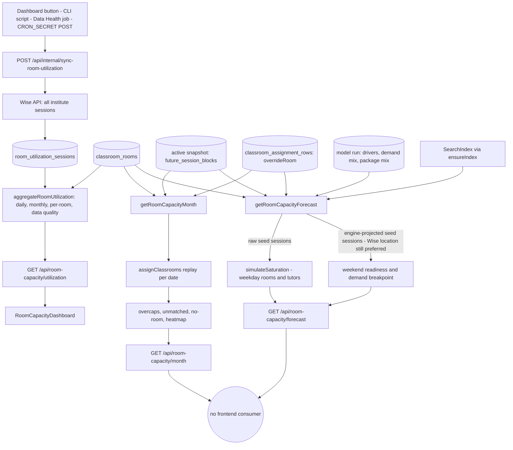

# Room Capacity

**Status:** no single badge fits, and no `@deprecated` or status marker exists in code — so the reach is stated from code instead. The utilization path is wired end-to-end (sync → API → dashboard); the month and forecast endpoints are implemented, tested, and authenticated but have no caller outside their own tests; and the sync is registered `manualOnly: true` with no `vercel.json` entry (`src/lib/data-health/cron-registry.ts:343-357`). See [Open questions](#open-questions).

## Purpose

Room Capacity answers two questions about the BeGifted centre's physical rooms:

1. **"How hard are the rooms actually being used?"** — a locally persisted store of Wise sessions mapped onto the classroom catalogue and aggregated into daily / monthly / per-room occupancy against a fixed 07:00–21:00 Bangkok open window. This is what the `/room-capacity` page shows. (The sync fetches the institute session list with **no** `status` filter — `src/lib/room-capacity/utilization.ts:436`; `src/lib/wise/fetchers.ts:117-147` — and the code plainly expects already-finished sessions back, since `ENDED`/`MISSED`/`NO_SHOW` have explicit handling, `utilization.ts:55-56`. Whether Wise actually returns past sessions on that unfiltered call is external API behaviour no file in this repo proves; see [Open questions](#open-questions).)
2. **"When do we run out of rooms (and tutors)?"** — two on-demand analytical surfaces: a **month pressure** view (over-capacity intervals, unmatched Wise room allocations, projected "no room" sessions, 30-minute heatmap) and a **forecast** view (weekday saturation dates plus a weekend-demand revenue breakpoint), both computed on demand. Their inputs differ: the month view reads only the active Wise snapshot, the room catalogue, and the latest per-date admin overrides (`src/lib/room-capacity/data.ts:229-291`), while the forecast view additionally loads the imported growth model — run, drivers, demand mix, package mix (`data.ts:390-408`).

The intended audience is admin/ops staff planning room usage and centre expansion; note that this is a statement of intent, not something the code enforces — all three read routes sit behind a plain authenticated-session gate with no role check (`src/app/api/room-capacity/utilization/route.ts:6-9`, `month/route.ts:7-10`, `forecast/route.ts:44-47`).

**No Wise writeback.** Nothing here updates a room, a `location`, or a session in Wise. It is *not* write-free locally, though: the sync upserts `room_utilization_sessions`, the internal sync route records a `cron_invocations` audit row on every *authorized* invocation (`src/app/api/internal/sync-room-utilization/route.ts:42-53`; `src/lib/data-health/cron-audit.ts:89-107`, `:124-138`), and **all three read paths write as a side effect** — `getRoomUtilization`, `getRoomCapacityMonth`, and `getRoomCapacityForecast` each call `listClassroomRooms` (`src/lib/room-capacity/utilization.ts:493`; `data.ts:237`, `:402`), which runs `ensureDefaultClassroomRooms` first, inserting missing default rooms, correcting drifted attributes, and `UPDATE`-ing superseded TV rooms to inactive (`src/lib/classrooms/data.ts:431-488`, called from `:491`).

Note the split in reach: the utilization path is fully wired (sync → API → dashboard), while the month and forecast engines are complete, tested, and exposed as authenticated endpoints but currently have **no frontend consumer** — the dashboard's only *read* call is `/api/room-capacity/utilization` (`src/components/room-capacity/room-capacity-dashboard.tsx:354`); its other call is the internal sync `POST` (`:375`). See [Open questions](#open-questions).

## Conceptual data model

Column-level detail (types, defaults, indexes) lives in the database reference — this section only covers what each table *means* here.

- **[docs/reference/database/erd-room-capacity.md](../reference/database/erd-room-capacity.md)** — the four forecast-model tables.
- **[docs/reference/database/erd-core.md](../reference/database/erd-core.md)** — `room_utilization_sessions`, `snapshots`, `future_session_blocks`, `tutor_identity_groups`.
- **[docs/reference/database/erd-classrooms.md](../reference/database/erd-classrooms.md)** — `classroom_rooms`, `classroom_assignment_runs`, `classroom_assignment_rows`.

**Owned by this feature**

- `room_utilization_sessions` — the utilization store: one row per Wise session, refreshed by upsert rather than rewritten per snapshot. It is **snapshot-independent**, so it survives Wise snapshot rotation and is the only occupancy input that outlives the active snapshot — the reason the dashboard can report on dates outside the snapshot's forward-looking `future_session_blocks` window. It keeps no student names or other PII, and a test pins that (`src/lib/room-capacity/__tests__/utilization.test.ts:144-158`). No decision ID or comment in the schema marks the snapshot-independence as deliberate (`src/lib/db/schema.ts:1734` is a bare section header) — though a decision record could live outside that file. Columns, index names, and types: [erd-core.md](../reference/database/erd-core.md).
- `room_capacity_model_runs` — one imported forecast run (source label, content fingerprint, forecast start/end). The forecast surface always reads the **latest** run by `createdAt` (`src/lib/room-capacity/data.ts:293-300`).
- `room_capacity_forecast_drivers` — per-scenario, per-month growth drivers (new paid students, forecast vs already-scheduled hours, projected revenue) belonging to a run.
- `room_capacity_demand_mix` — the shape of incremental demand for a run: what a *typical* new session looks like, so forecast growth can be expanded into concrete slots rather than raw hours. Bucket fields and their read-time narrowing: [erd-room-capacity.md](../reference/database/erd-room-capacity.md).
- `room_capacity_package_mix` — per-run package-hour buckets with average per-student revenue and share; used only by the weekend-demand revenue model.

**Read, not owned**

- `classroom_rooms` — the room catalogue (capacity, category, active flag, sort order), read through `listClassroomRooms`, which seeds and repairs defaults on read (`src/lib/classrooms/data.ts:490-496` → `ensureDefaultClassroomRooms`, `:431-488`). Read, but not read-*only*: every Room Capacity read path mutates this table as a side effect (see [Purpose](#purpose)). Active rooms and their capacities drive every denominator, every over-capacity test, and every placement decision.
- `snapshots` + `future_session_blocks` ⨝ `tutor_identity_groups` — the *current* forward schedule used by the month and forecast surfaces; scoped to the active snapshot and to blocking sessions only (`src/lib/room-capacity/data.ts:102-109`).
- `classroom_assignment_runs` / `classroom_assignment_rows` — the latest per-date admin room overrides, replayed into the projected assignment (`src/lib/room-capacity/data.ts:127-167`).

## API surface

Full request/response contracts, status codes, and query-parameter tables: **[docs/reference/api/room-capacity.md](../reference/api/room-capacity.md)**. Trigger/cron context: **[docs/reference/crons.md](../reference/crons.md)**.

| Endpoint | Purpose |
|---|---|
| `GET /api/room-capacity/utilization` | Daily / monthly / per-room occupancy plus data-quality counts for a date range and weekday filter — the only *read* endpoint the UI calls. |
| `GET /api/room-capacity/month` | Current-vs-projected room pressure for a date range — where the schedule already exceeds a room's capacity, and where the assignment engine could not place a session. Payload sections: [reference](../reference/api/room-capacity.md). |
| `GET /api/room-capacity/forecast` | Weekday saturation dates and the weekend-demand revenue breakpoint for a scenario, from the latest imported model run. |
| `POST /api/internal/sync-room-utilization` | Refetches all institute sessions from Wise and upserts `room_utilization_sessions`; accepts a `CRON_SECRET` bearer **or** an admin session. The dashboard's *Refresh history* action posts here (`room-capacity-dashboard.tsx:375`), so the UI does reach two endpoints in this table. |

Two further entry points reach `syncRoomUtilizationSessions` **without** going through `/api/internal/sync-room-utilization`. One is non-HTTP: the CLI script `scripts/sync-room-utilization.ts` (`npm run room-utilization:sync`), the only caller that can pass a custom `--start-date` (`scripts/sync-room-utilization.ts:23-24`). The other is a second HTTP route — the Data Health manual job runner, `POST /api/data-health/jobs/[jobKey]/run`, which resolves the `room_utilization` job key and calls the same function (`src/app/api/data-health/jobs/[jobKey]/run/route.ts:13-43` → `src/lib/data-health/run-job.ts:34-40`, `:185-193`; documented in [docs/reference/api/misc.md](../reference/api/misc.md)). Both audited paths wrap the run in `withCronInvocationAudit`, so a Data Health-triggered sync is recorded as `triggerSource: "admin"` just like the dashboard button. The forecast model itself is loaded out-of-band by `scripts/import-room-capacity-model.ts` (`npm run room-capacity:import-model`) — there is no HTTP import route.

## UI

- **Page**: `src/app/(app)/room-capacity/page.tsx` — a five-line server component that renders the client dashboard. Reached from the "Room Capacity" nav entry in the `scheduling-tutors` section (`src/lib/navigation/tools.ts:140-146`).
- **Component**: `src/components/room-capacity/room-capacity-dashboard.tsx`. It fetches on mount and on filter change, receives no server-rendered props, and exposes:
  - `WeekdayFilter` — day toggles; deselecting the last remaining day snaps back to all seven rather than producing an empty selection (`room-capacity-dashboard.tsx:298-305`).
  - `DailyTrend` — bar chart of the **last 90 returned rows**, not the last 90 days (`rows.slice(-90)`, `:142`). Because the API only returns dates matching the weekday filter (`src/lib/room-capacity/utilization.ts:244`) and the filter is sent whenever fewer than seven days are selected (`:350-354`), a filtered view stretches those 90 bars over far more than 90 calendar days — roughly 90 weeks with a single weekday selected. The chart's own badge says "N days".
  - `MonthlySummary` and `RoomTable` — utilization tables sharing one colour ramp (green below 45%, primary to 75%, amber to 100%, conflict above, `:82-95`).
  - Two actions: *Refresh* (re-reads the API, `:360-369`) and *Refresh history* (`POST`s the internal sync, then re-reads, `:371-384`); both buttons at `:437-444`.
  - A data-quality strip — four cards for missing-room, unknown-room, excluded-status, and overlap minutes (`:499-533`), plus a condensed missing/unknown and overlap pair in the top KPI row (`:474-487`) — and an empty state telling the operator to run the sync to backfill from March 2026 (`:267-276`).

There is no UI for the month or forecast endpoints.

## Data flow

**Utilization (live path).** The sync pulls *all* institute sessions from Wise, converts each into a Bangkok-normalized row (date key, weekday, start/end minute, normalized room label), filters to rows on or after the history start, and upserts them in 500-row chunks keyed on `wiseSessionId` (`src/lib/room-capacity/utilization.ts:427-472`). Reads then aggregate persisted rows against the active room catalogue — Wise is never on the read path.

**Month / forecast (on-demand).** Both recompute from the active snapshot on every request; no result is persisted (the room-catalogue seeding described under [Purpose](#purpose) is the one write). The month view builds a *projected* assignment by replaying the shared classroom assignment engine day by day with the latest admin overrides, then diffs it against the *current* Wise `location` values (`src/lib/room-capacity/data.ts:193-291`). The forecast view additionally loads the latest imported model run, expands its monthly drivers into synthetic demand, and simulates placement against rooms and the in-memory search index (`data.ts:390-425`).

**The forecast replays the assignment engine too — but asymmetrically.** `getRoomCapacityForecast` computes `projectedSeedSessions = buildProjectedSessions(seedSessions, rooms, overridesByDate)` (`data.ts:405`) and feeds *those* to the weekend-demand readiness gate and breakpoint (`:418-425`), while `simulateSaturation` and the demand-mix fallback consume the **raw** `seedSessions` (`:408`, `:411-417`).

The practical divergence is narrower than the split suggests, because the weekend path still prefers Wise's own `location`. `buildProjectedSessions` copies `currentWiseLocation` onto every projected row (`data.ts:215`), and `resolvedPhysicalRoom` tries `currentWiseLocation` **first**, falling back to `assignedRoom` only when the Wise label is empty or resolves to no active non-`online_only` room (`src/lib/room-capacity/forecast.ts:162-173`). The same preference governs `onsiteStudentMinutes`, which classifies mode and weights student-minutes off `currentWiseLocation ?? assignedRoom` (`forecast.ts:175-181`) and therefore drives the weekend preference distribution and the readiness gate as well. So the engine's placement changes the weekend occupancy picture (`buildWeekendSeedOccupancy`, `forecast.ts:183-204`) only for the subset of sessions Wise has not usefully located — plus whatever rows the engine adds, drops, or re-times. Real, but a subset difference rather than two wholly different pictures. Nothing in the code marks the split as intentional; see [Open questions](#open-questions).

```mermaid
flowchart TD
    Trigger[Dashboard button - CLI script - Data Health job - CRON_SECRET POST] --> SyncRoute[POST /api/internal/sync-room-utilization]
    SyncRoute --> Wise[Wise API: all institute sessions]
    Wise --> RUS[(room_utilization_sessions)]
    RUS --> Agg[aggregateRoomUtilization: daily, monthly, per-room, data quality]
    Rooms[(classroom_rooms)] --> Agg
    Agg --> UtilAPI[GET /api/room-capacity/utilization]
    UtilAPI --> Dash[RoomCapacityDashboard]

    Snap[(active snapshot: future_session_blocks)] --> Month[getRoomCapacityMonth]
    Rooms --> Month
    Overrides[(classroom_assignment_rows: overrideRoom)] --> Month
    Month --> Replay[assignClassrooms replay per date]
    Replay --> Analysis[overcaps, unmatched, no-room, heatmap]
    Analysis --> MonthAPI[GET /api/room-capacity/month]

    Model[(model run: drivers, demand mix, package mix)] --> Forecast[getRoomCapacityForecast]
    Snap --> Forecast
    Rooms --> Forecast
    Overrides --> Forecast
    Index[SearchIndex via ensureIndex] --> Forecast
    Forecast -->|raw seed sessions| Sat[simulateSaturation - weekday rooms and tutors]
    Forecast -->|engine-projected seed sessions - Wise location still preferred| Weekend[weekend readiness and demand breakpoint]
    Sat --> ForecastAPI[GET /api/room-capacity/forecast]
    Weekend --> ForecastAPI

    MonthAPI --> NoUI((no frontend consumer))
    ForecastAPI --> NoUI
```

## Business rules & edge cases

### Utilization

- **Counted statuses are an allowlist, and unknown statuses are excluded.** Only `ENDED`, `IN_PROGRESS`, `UPCOMING` contribute occupancy; `CANCELLED`/`CANCELED`/`MISSED`/`NO_SHOW` *and anything not on the allowlist* fall into the excluded-status quality bucket (`src/lib/room-capacity/utilization.ts:55-56`, `:131-138`). That is the fail-closed choice: an unrecognised Wise status never inflates utilization.
- **A session must resolve to an active room to count.** Rows with no location, or with a normalized label matching no active room, are counted as `missing`/`unknown` data-quality issues and excluded from occupied minutes (`utilization.ts:318-331`). They still surface in the dashboard's quality strip, so the gap is visible rather than silent.
- **Fixed open window, fixed denominator.** Occupancy is clipped to 07:00–21:00 (`utilization.ts:21-24`, `:172-176`), and availability is `activeRoomCount × 840 minutes × selected days` (`utilization.ts:247`, `:368-371`). Every day in range counts, with no holiday or closure calendar.
- **Overlaps are double-counted on purpose.** Two sessions booked into the same room at the same time both contribute minutes, and the excess is reported separately as `overlapMinutes` (`utilization.ts:215-225`, `:355-366`). Consequence: utilization can legitimately exceed 100%, which is why the dashboard labels overlap "Double-counted room pressure" (`room-capacity-dashboard.tsx:481-487`).
- **Sessions crossing midnight are truncated at the day boundary** — the end minute becomes 24:00 when the Bangkok end date differs from the start date (`utilization.ts:416`); the remainder is not attributed to the next day.
- **History starts 2026-03-01** (`utilization.ts:20`) and the default range runs to today in Bangkok (`utilization.ts:101-103`). The sync always fetches the full institute session list and filters in memory, so a later `startDate` shrinks what is stored, not what is fetched (`utilization.ts:436-439`).
- **The sync is idempotent.** Upsert on `wiseSessionId` refreshes every mutable field, so re-running after a Wise edit corrects the row rather than duplicating it (`utilization.ts:443-463`).
- **Weekday-filter validation is strict**: unknown tokens throw, and the route maps validation messages to HTTP 400 rather than 500 (`utilization.ts:112-129`; `src/app/api/room-capacity/utilization/route.ts:20-27`).

### Month pressure

- **Only blocking sessions from the active snapshot are considered** (`src/lib/room-capacity/data.ts:102-109`); a missing active snapshot throws and surfaces as a 500 (`data.ts:37-45`). Default range is today through the end of the Bangkok month (`src/lib/room-capacity/dates.ts:69-75`).
- **"Current" and "projected" resolve rooms differently.** Current reads the Wise `location`; projected reads the assignment engine's output, ignoring remote sessions and `NO_ROOM_AVAILABLE` placeholders (`src/lib/room-capacity/analysis.ts:51-64`). That is what makes the two heatmaps comparable rather than duplicative.
- **Missing headcount degrades to 1 student, never 0** — an unknown-size class still occupies a seat (`analysis.ts:32-35`).
- **Over-capacity is evaluated on exact interval boundaries**, not bins: session start/end minutes form the breakpoints, and any sub-interval whose summed load exceeds room capacity becomes a reported interval carrying its tutors and classes (`analysis.ts:124-162`). The heatmap is a separate 30-minute-bin view for readability (`analysis.ts:16`, `:181-182`).
- **Unmatched allocations distinguish cause**: `missing_location` when Wise has no location at all, `unknown_room` when it has one that does not match the catalogue (`analysis.ts:66-84`). Each is actionable in a different way.
- **Admin overrides win over ordinary placement — but only after passing three gates.** Only the most recent run per date contributes overrides, and only rows with a non-null `overrideRoom` (`data.ts:127-167`). The replayed engine then rejects an override whose room is not in the active catalogue or fails capacity/TV/type constraints (warning `invalid_override_room`) and one that overlaps an already-protected claim (warning `override_room_unavailable`); a rejected override falls through to normal placement (`src/lib/classrooms/assignment-engine.ts:424-437`). An override that clears all three gates does get a *protected* first claim on its room ahead of preferred-room and general placement (`assignment-engine.ts:332-342`) — the same pre-pass silently drops overrides failing those checks.

### Forecast

- **No model run → a structured "missing" response, not an error.** `getRoomCapacityForecast` returns a fully-shaped payload with `model.status: "missing"` and seven null weekday rows (`data.ts:358-383`, `:391`). The route goes further, converting *missing-table* errors into the same 200 response so the feature degrades gracefully before migrations land (`src/app/api/room-capacity/forecast/route.ts:6-14`, `:55-57`).
- **Scenario fallback**: an unknown scenario silently falls back to the first available scenario, and the response echoes which one was actually used (`data.ts:396-397`, `:436`).
- **Demand mix falls back to the observed schedule** when the imported run has no demand rows — `seededDemandMixFromSchedule` buckets sessions by weekday/start/duration and weights shares by minutes over total admitted minutes (`data.ts:408`; `src/lib/room-capacity/forecast.ts:832-866`, `:864`).
- **"Onsite" demand buckets are broader than their name, in both implementations.** The admission filter is `mode === "onsite" || normalizeRoomLabel(location).length > 0` (`forecast.ts:833-836`), and `classifySessionMode` only returns `online` when the sessionType/location evidence string contains `"online"` or `"live session"`; anything else falls through to `either` (`src/lib/room-capacity/analysis.ts:292-300`). So a session whose `location` holds a bare meeting URL is classified `either`, not `online` — and it is admitted on the *second* disjunct, because the URL is a non-empty label. Both `either`- and `online`-classified rows clear that disjunct, so the admitted set is really "anything carrying a location string, whatever its mode", and every admitted row is then hard-coded to `mode: "onsite"` (`forecast.ts:843`). The identical filter and hard-coded bucket also live in `buildDemandMixFromSessions` (`analysis.ts:249-290`, filter at `:250-253`, `"onsite"` stamped at `:266` and `:275`), which is what the CLI importer uses to build the **persisted** `room_capacity_demand_mix` rows (`scripts/import-room-capacity-model.ts:8`, `:331`). So the inflation is not confined to the no-imported-rows fallback: imported mixes carry it too.
- **Only incremental demand is simulated**: `forecastConsumedHours − scheduledHours`, floored at zero, so already-scheduled hours are never double-counted (`forecast.ts:247-248`).
- **Two saturation tracks run in parallel on independent occupancy maps** — rooms-only and rooms+tutors — so the report can say whether rooms or qualified tutors bind first (`forecast.ts:473-514`).
- **Tutor placement is fail-closed on everything except subject.** Candidates must have zero data issues, a declared supported mode compatible with the demand, and an availability window fully covering the slot; leaves and blocking session blocks disqualify (`forecast.ts:432-471`). A tutor whose normalization is unresolved is never treated as available. The qualification gate is the soft one: `matchesSubject` demands a subject-for-subject match only when the demand row *has* a subject — with `subject: null` it accepts any tutor holding at least one qualification (`forecast.ts:427-430`, called at `:460`). Demand rows can legitimately carry a null subject, in both the imported mix and the schedule-derived fallback (`data.ts:330-336`; `forecast.ts:852`), so for those rows the requirement degrades to "is qualified in *something*".
- **Room placement prefers the smallest room that fits**, and `online_only` rooms can never host onsite demand (`forecast.ts:100-105`, `:135-137`).
- **The weekend breakpoint has an explicit readiness gate.** `buildWeekendDemandCaptureReadiness` returns typed reason codes (missing package mix, missing scenario drivers, no active physical rooms, missing seed sessions, no weekend onsite schedule, zero preference distribution), and the simulation returns `null` unless every gate passes (`forecast.ts:345-375`, `:753-755`). The response always carries the readiness object, so a blank breakpoint is explainable rather than mysterious.
- **The weekend policy is deliberately unforgiving**: `preferred_slot_only`. A simulated student's whole package must fit in their exact preferred weekday/time across every weekly occurrence, or the entire lead counts as lost — even when other weekend slots sit open (`forecast.ts:521-578`, `:816-818`). The result therefore also reports the open-but-not-captured slots so the loss is auditable.
- **Breakpoint definition**: the first month where lost revenue exceeds captured revenue and is non-zero (`forecast.ts:720-722`).
- **Beyond the imported horizon the model extrapolates**, up to 36 months, using trailing average growth clamped to [−20%, +50%]; those results are flagged `reached_extrapolated` rather than `reached` (`forecast.ts:724-737`, `:763`, `:803`).
- **Package mix normalizes to per-student economics** — multi-student sales are divided down before bucketing, and buckets round to the nearest half hour with a 0.5h floor (`src/lib/room-capacity/package-mix.ts:24-27`, `:40-43`).

### Scheduling and auth

- **The sync is registered as manual-only.** The cron registry declares `schedule: null`, `manualOnly: true` for the `room_utilization` job (`src/lib/data-health/cron-registry.ts:343-357`), and `vercel.json` has no `sync-room-utilization` entry. The handler also exports only `POST` (`src/app/api/internal/sync-room-utilization/route.ts:26`) — the only registry entry with `routeMethod: "POST"`; every scheduled job declares `"GET"`. So wiring the path into `vercel.json` would at minimum need a `GET` export. ([`docs/reference/crons.md`](../reference/crons.md) states the stronger form — that Vercel Cron invokes via `GET`, making the path unreachable as written — but that is a platform contract, not something any file in this repo proves.) Consistent with manual-only status, the cron watchdog skips such jobs when hunting for late runs (`src/lib/internal/cron-watchdog.ts:160`) — nobody is alerted when utilization data goes stale.
- **Dual auth on the internal route**: a valid constant-time `CRON_SECRET` bearer marks the run as `cron`; otherwise an authenticated session marks it as `admin`, and a missing server-side secret with no session returns 500 rather than 401 (`src/app/api/internal/sync-room-utilization/route.ts:12-40`). **Only authorized invocations are audited**: the auth branch returns before `withCronInvocationAudit` is reached (`:26-41` vs `:42-53`), so a rejected 401/500 leaves no `cron_invocations` row — the audit trail records runs, not attempts. A run can also go unaudited when the audit insert itself fails: `startInvocation` logs and returns `null` (`src/lib/data-health/cron-audit.ts:108-111`), and `finishInvocation` then no-ops (`:118`), while the sync proceeds normally.
- The three read endpoints are session-gated only — ordinary authed admin reads with no role restriction.

## Tests

| Location | Covers |
|---|---|
| `src/lib/room-capacity/__tests__/utilization.test.ts` | Denominator from active rooms × fixed open hours; exclusion of cancelled/missed statuses; missing vs unknown room accounting; 07:00–21:00 clipping; overlap double-counting; weekday filtering of both numerator and denominator; weekday token parsing; Wise→row conversion keeping no PII. |
| `src/lib/room-capacity/__tests__/analysis.test.ts` | Room-label normalization (TV/lab suffixes); exact-boundary overcap intervals and heatmap load; missing/unknown Wise location reporting; projected no-room rows; demand-mix bucketing, whose "onsite sessions only" case excludes an online session that also has **no** location (`analysis.test.ts:117-121`) — the location-carrying online case that the permissive filter actually admits is untested. |
| `src/lib/room-capacity/__tests__/forecast.test.ts` | Monthly hours → weekday/time demand buckets; room-slot saturation; room+tutor saturation when no qualified tutor exists; student-hour-weighted weekend preference distribution; four of the six readiness reason codes (`missing_package_mix`, `missing_scenario_drivers`, `no_active_physical_rooms`, `no_weekend_onsite_schedule` — `forecast.test.ts:186`, `:198`, `:210`, `:222`; `missing_seed_sessions` and `zero_weekend_preference_distribution` are asserted nowhere); deterministic package and preferred-slot expansion; lost-lead accounting when the preferred slot is full while others are open; extrapolated breakpoints past the imported horizon. |
| `src/lib/room-capacity/__tests__/package-mix.test.ts` | Per-student package-hour and revenue bucketing from raw sales. |
| `src/lib/room-capacity/__tests__/dates.test.ts` | Bangkok date helpers and the today→month-end default range. |
| `src/app/api/room-capacity/__tests__/route.test.ts` | 401s on the month and utilization routes; service defaults with no query params; explicit date-range and weekday pass-through; `Base` scenario default; the missing-forecast response before aggregate tables exist; 400s for inverted ranges and bad weekday tokens. |
| `src/components/room-capacity/__tests__/room-capacity-dashboard.test.tsx` | Daily macro trend (explicitly *not* a weekly heatmap), monthly summary hours, per-room sorting and overlap minutes, weekday filter controls. |

No test exercises `getRoomCapacityMonth`/`getRoomCapacityForecast` end-to-end against a database — the API tests mock the service layer, and the engines are covered as pure functions.

## Open questions

- **Is `sync-room-utilization` intentionally manual-only?** The registry says yes (`manualOnly: true`, `schedule: null`), the watchdog exempts it, and there is no `vercel.json` entry — yet the dashboard's value depends on freshness and every sibling sync is scheduled. Was an automated cadence intended and never wired, or is on-demand refresh the deliberate design? Wiring a cron would also require adding a `GET` export and a stagger slot.
- **Are `/api/room-capacity/month` and `/api/room-capacity/forecast` pending UI or abandoned?** Both are fully implemented, tested, and authenticated, but the only callers in the repo are their own tests. Is a month/forecast page still planned, or should these be treated as an API-only analyst surface?
- **How is the forecast model meant to be refreshed?** Model runs arrive only through the local CLI importer reading an on-disk projection JSON plus sibling sales workbooks; there is no HTTP import route and no scheduled refresh, so the forecast reflects whichever run was last imported by hand. Who owns re-importing, and at what cadence?
- **Is the forecast's raw-vs-projected split intentional?** Inside one `getRoomCapacityForecast` call, weekday saturation and the demand-mix fallback consume the raw seed sessions while the weekend readiness gate and breakpoint consume the engine-projected ones (`src/lib/room-capacity/data.ts:405-425`). The divergence is bounded — the weekend path still prefers `currentWiseLocation` and only falls back to `assignedRoom` (`forecast.ts:162-181`) — but the two halves do start from different session sets, and nothing in the code marks that as deliberate. Should both use the projected placement, or both the raw Wise `location` values?
- **Should demand mixes really bucket every location-carrying session as onsite?** Both `seededDemandMixFromSchedule` (`forecast.ts:833-843`) and `buildDemandMixFromSessions` (`analysis.ts:250-275`) admit any session with a non-empty location label and stamp every admitted row `mode: "onsite"`. Since a bare meeting URL is a non-empty label, online and `either`-mode classes inflate onsite demand — in the schedule-derived fallback *and* in the mix the CLI importer persists (`scripts/import-room-capacity-model.ts:331`).
- **Should a null-subject demand row really accept any qualified tutor?** `matchesSubject` short-circuits to "has at least one qualification" when the demand row carries no subject (`forecast.ts:427-430`), which is the one non-fail-closed step in an otherwise strict placement filter. Is that intended tolerance for sparse demand-mix data, or an unnoticed hole that overstates tutor supply?
- **Is `preferred_slot_only` the intended business policy?** Counting a lead as fully lost when its exact preferred weekend slot is taken — while other weekend rooms sit empty — yields a deliberately pessimistic breakpoint. Confirm this models real parent behaviour rather than being a modelling simplification.
- **Does the unfiltered institute-sessions call actually return past sessions?** The sync omits the `status` param (`utilization.ts:436`; `src/lib/wise/fetchers.ts:117-147`), and everything downstream assumes finished sessions come back — the `ENDED`/`MISSED`/`NO_SHOW` handling, the 2026-03-01 history floor, and the dashboard's "backfill sessions from March 2026" empty state. But no file in this repo proves Wise's default behaviour, and the compare feature documents the opposite for the `status: "FUTURE"` call. If the endpoint is forward-only, `room_utilization_sessions` accumulates history one sync at a time rather than backfilling, and the "backfill" copy is misleading. Worth confirming against a live response.
- **Should the availability denominator account for closure days?** Every day in range contributes `activeRooms × 14h`, including public holidays and any day the centre does not open, which structurally depresses reported utilization.
- **Should overlap-inflated utilization be capped or flagged more loudly?** Double-counting is intentional, but the headline percentage can exceed 100% purely from Wise double-bookings, and the dashboard explains that only in a small caption.

_Verified against HEAD + uncommitted WIP on 2026-05-31._
