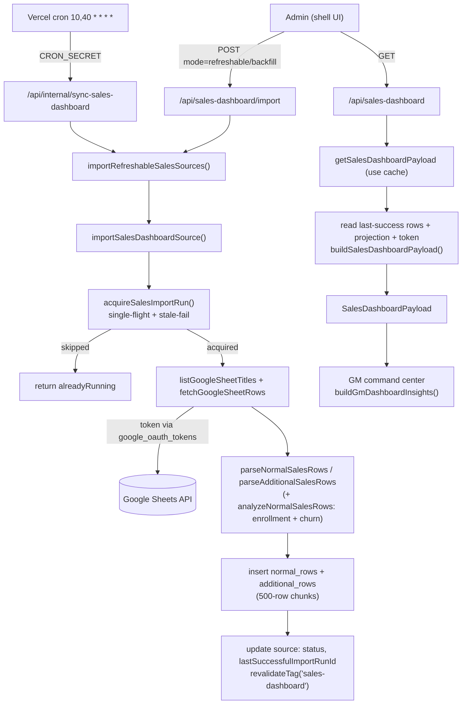

# Sales Dashboard

**Status: stable**

## Purpose

The Sales Dashboard is the GM command center for BeGifted's tutoring sales. It imports the team's monthly Google Sheets sales records — one spreadsheet per month, with a normal-package sheet and an additional-sales sheet — plus a single multi-scenario revenue-projection workbook, and persists the parsed rows to Postgres. The dashboard then renders revenue pace, pipeline (trial conversion / retention), sales-rep performance, program/package mix, and actual-vs-projection charts on top of that snapshot, refreshed automatically by cron.

The audience is non-technical admin/GM staff. They connect their own Google account (OAuth, Sheets read scope), seed the historical source list, run a backfill, and from then on the cron keeps the live months fresh. All money is THB; all dates are normalized to `Asia/Bangkok`.

This feature is also notable operationally: it is the one area scoped to a guest collaborator. A Claude hook (`.claude/hooks/sales-dashboard-guard.mjs`) and a CI workflow (`.github/workflows/sales-dashboard-scope.yml`) together fence edits, sensitive-file reads, and risky shell/git commands to the Sales Dashboard paths only. See [Business rules & edge cases](#business-rules--edge-cases).

## Conceptual data model

The domain is self-contained — none of its tables reference the core scheduling tables (`snapshots`, `tutors`, identity groups). It splits into two parallel sub-graphs that never join, plus one shared auth-token table.

**Monthly sales lineage**
- **Sources** (`sales_dashboard_sources`) — one row per calendar month, keyed by `sourceMonth` (a `YYYY-MM-01` date). Holds the spreadsheet id/URL, the resolved/overridden sheet names, the connected Google email, a lifecycle `status` (`active` / `refreshing` / `finalized` / `reopened` / `archived`), and a soft pointer to the last successful import run. A partial-unique constraint allows at most one non-archived source per month.
- **Import runs** (`sales_dashboard_import_runs`) — one row per import attempt against a source, with `status`, `triggerType` (`manual` / `backfill` / `cron`), timing, row counts, and a metadata blob recording which sheet names were resolved. A partial unique index on `(source_id) WHERE status = 'running'` is the single-flight lock.
- **Parsed rows** (`sales_dashboard_normal_rows`, `sales_dashboard_additional_rows`) — the per-transaction rows from each sheet, tagged with both `source_id` and `import_run_id` so the dashboard reads only rows from each source's *last successful* run.

**Projection lineage** (a separate triple, mirroring the above)
- **Projection source** (`sales_dashboard_projection_sources`) — the single active projection workbook (Summary / What_If / Calc_Multi sheet names), with its own last-success pointer and target-monthly-revenue cache.
- **Projection import runs** (`sales_dashboard_projection_import_runs`) — one per projection import, with its own `(source_id) WHERE status = 'running'` partial-unique single-flight lock.
- **Projection months** (`sales_dashboard_projection_months`) — one row per `(scenario, projectionMonth)` across Bear/Base/Bull, holding revenue / student / hours / room-capacity projections.

**Shared auth token** — `google_oauth_tokens` (a snapshot-independent core table) stores the AES-256-GCM-encrypted Google access/refresh tokens, scope, and expiry, keyed by lowercased email. The Sales Dashboard owns the read/write/refresh logic for it (`google-oauth.ts`) and is the primary consumer of the `spreadsheets.readonly` scope.

For column-level detail (types, defaults, nullability, indexes) and the ER diagram, see **[docs/reference/database/erd-sales-dashboard.md](../reference/database/erd-sales-dashboard.md)** (the seven domain tables) and [docs/reference/database/erd-core.md](../reference/database/erd-core.md) for `google_oauth_tokens`.

## API surface

All routes are admin-session-gated (`auth()` → 401 when no `session.user.email`) except the cron route, which is `CRON_SECRET`-gated in-handler. A `MissingGoogleSheetsTokenError` maps to HTTP **409** on the import paths. For full request/response contracts and per-route line citations, see **[docs/reference/api/sales-dashboard.md](../reference/api/sales-dashboard.md)**.

| Method · Path | Purpose |
|---|---|
| `GET /api/sales-dashboard` | Return the cached, fully-aggregated dashboard payload for the signed-in admin. |
| `GET /api/sales-dashboard/sources` | List configured monthly sources (non-archived). |
| `POST /api/sales-dashboard/sources` | Create or update a monthly source (upsert keyed by month). |
| `PATCH /api/sales-dashboard/sources/[sourceId]` | Change a source's lifecycle status (active / finalized / reopened; restores if archived). |
| `DELETE /api/sales-dashboard/sources/[sourceId]` | Archive a source (soft delete; preserves prior status). |
| `POST /api/sales-dashboard/sources/seed` | Seed the built-in historical source list (`DEFAULT_SALES_SOURCES`). |
| `POST /api/sales-dashboard/import` | Run an import — one source, all-sources backfill, or refreshable-months-only. `maxDuration = 800`. |
| `GET /api/sales-dashboard/import-runs` | List the 20 most recent monthly-sales import runs. |
| `POST /api/sales-dashboard/projection-source` | Save the active projection workbook config, or seed the default. |
| `POST /api/sales-dashboard/projection-import` | Re-import the active projection workbook. `maxDuration = 800`. |
| `GET · POST /api/internal/sync-sales-dashboard` | Cron entry: refresh live months + re-import projection. `CRON_SECRET`; POST also accepts admin session. `maxDuration = 800`. |

## UI

One page: **`/sales-dashboard`** (`src/app/(app)/sales-dashboard/page.tsx`). It is an async Server Component that only checks auth (redirects to `/login`) and renders the client shell inside `<Suspense>`; all data is fetched client-side.

Key components (`src/components/sales-dashboard/`):
- **`sales-dashboard-shell.tsx`** — the client orchestrator. Owns the period filter (`All` / `2025` / `2026` / `Q1 2026` / `This Month` presets plus a free date range), fetches `/api/sales-dashboard` (`cache: "no-store"`), drives the Connect-Google-Sheets `signIn` flow (requesting the `spreadsheets.readonly` scope with `prompt: "consent"`, `access_type: "offline"`), and renders one of two states: a **setup card** (`SalesDashboardSetupState`) when there are no sources or no imported rows, or the command center otherwise. A "Data Sources & Imports" dialog hosts the `SourceManager`.
- **`gm-command-center.tsx`** — the analytics surface (`SalesDashboardCommandCenter`). Builds insights via `buildGmDashboardInsights` and renders a revenue-pace hero, a GM-exceptions rail, a Chart.js revenue-trend **stacked bar** chart (`RevenueTrendPanel`, four `stack: "sales"` datasets — new/renewal/trial/additional — `gm-command-center.tsx:218-227`), an actual-vs-projection chart (where the Chart.js *line* datasets actually live — `gm-command-center.tsx:284`, `:294`, `:305`), the sales-team table with previous-period deltas, and a tabbed program-mix / package-mix / payment-concentration panel.
- **`source-manager.tsx`** — the source/projection admin UI inside the dialog: add monthly source, seed historical, backfill all, per-source status / archive / restore controls, and the projection-workbook config + import.

## Data flow

A read (`GET /api/sales-dashboard`) is served entirely from Postgres + the Next `"use cache"` layer — Google Sheets is never touched on the request path. A write (import) is the only thing that calls Google.

The read path (`getSalesDashboardPayloadUncached`, `data.ts:847`) gathers each non-archived source's `lastSuccessfulImportRunId`, fetches only rows belonging to those run ids (`inArray`), re-hydrates them into the parser's row shape, and hands everything to `buildSalesDashboardPayload` (`analytics.ts:201`), which produces per-day aggregates, cohorts, completion curves, and rep totals. The client then layers range filtering and GM insights on top via `buildGmDashboardInsights` (`gm-insights.ts:122`).

## Business rules & edge cases

**Collaborator scope guard (the notable non-obvious bit).** A guest collaborator (`aoengnatchasmith-spec`) is fenced to this feature by two enforcement points:
- **Local Claude hook** `.claude/hooks/sales-dashboard-guard.mjs` — on `PreToolUse`, `Edit`/`Write`/`MultiEdit` are denied unless the target path starts with one of the allowed prefixes (`src/app/(app)/sales-dashboard/`, `src/app/api/sales-dashboard/`, `src/app/api/internal/sync-sales-dashboard/`, `src/components/sales-dashboard/`, `src/lib/sales-dashboard/`) (`sales-dashboard-guard.mjs:9-15`, `:126-138`). `Read` is denied for sensitive files (`.env*`, `.vercel`, `*.pem/.key/.p12`, `*.xlsx/.xls`) (`:17-27`, `:140-146`). Risky `Bash` is denied: prod `vercel --prod`, force-push, push to main/master, `git reset --hard`, broad `rm -rf`, hitting prod `/api/internal/sync-*`, and commands reading `.env`/`.vercel` (`:29-66`, `:148-160`).
- **CI gate** `.github/workflows/sales-dashboard-scope.yml` runs `scripts/check-sales-dashboard-scope.mjs` against the PR diff, passing the PR author login, so out-of-scope file changes by the scoped collaborator fail the `sales-dashboard-scope` check on PRs into `main`.

**Single-flight imports, fail-isolated.** Each source import acquires a run via `acquireSalesImportRun` (`import-guard.ts:168`), which (1) fails any run still `running` past 20 minutes and restores the source's prior status (`STALE_RUNNING_SALES_IMPORT_MS`, `import-guard.ts:6`, `:97-125`), then (2) refuses to start if a fresh `running` run exists, returning a skipped result. The DB partial-unique index on `(source_id) WHERE status = 'running'` is the backstop: a unique-violation (`23505`) is caught and converted to the same skipped result (`import-guard.ts:199-215`). The projection lineage has the identical lock (`drizzle/0029_sales_dashboard_projection.sql:74`). On any import failure the run is marked `failed` and the source's status is rolled back to `previousStatus` with `lastImportError` set, never throwing away the prior successful snapshot (`data.ts:545-556`).

**Month lifecycle (auto-finalize).** `sourceShouldRefresh` only refreshes the current month, and the previous month through Bangkok day 7 (`lifecycle.ts:8-19`). On Bangkok day ≥ 8, the previous month auto-finalizes (`shouldAutoFinalizePreviousMonth`, `lifecycle.ts:35-42`) and is skipped by the refreshable run (`data.ts:567-571`). `finalized` sources are not refreshed unless `allowFinalized` (backfill sets it) or a manual confirm reopens them; importing a finalized source without that flag throws and marks the run failed (`data.ts:418-447`). `reopened` sources stay `reopened` after a successful import (`statusAfterSuccessfulImport`, `lifecycle.ts:21-33`).

**Sheet-format tolerance.** The normal-sales parser auto-detects new English vs. legacy Thai headers off `HEADER_ROW = 3` (`parser.ts:6`, `:83`): the new format keys off `Payment Date` and filters out rows that are not `Already Paid?` (`parser.ts:97-102`), while the legacy format reads Thai column names (`วันที่ชำระเงิน`, `ผู้ขาย`, `ยอดชำระสุทธิ`) (`parser.ts:103-108`). Sheet-name resolution falls back across `(1)PackageSales` → `SalesRecord` for normal and `(2)AdditionalSales` for additional (`data.ts:457-464`); a missing normal sheet throws "No normal sales sheet found". Money parsing strips `฿`, commas, and parentheses (`parser.ts:25-33`); Google serial-date cells are converted via the 1899-12-30 epoch (`dates.ts:46-50`).

**Derived enrollment + churn.** When a row lacks an explicit `Enrollment Type`, `analyzeNormalSalesRows` (`parser.ts:165`) groups by lowercased nickname, sorted by payment date, and labels each: a `trial`-package row → `Trial`; the first paid row immediately after a trial → `New Student`; all other paid rows → `Renewal` (`parser.ts:178-192`). Churn status is computed off the latest paid row's `Valid Until` plus a **14-day grace** window: within grace → `Active`; a later payment after the deadline → `Retained`; otherwise → `Churned`. Two cases short-circuit to `N/A`: an all-trial student (`parser.ts:204-208`) and a student whose latest paid row has no `Valid Until` (`parser.ts:210-214`); the grace logic then runs for everyone else (`parser.ts:216-223`). The retention cohort uses the same 14-day decision-date logic (`analytics.ts:185`).

**Revenue target precedence & projection fallback.** The GM pace target prefers the imported projection's `targetMonthlyRevenue`, falling back to the hardcoded `MONTHLY_NORMAL_SALES_TARGET = 4,000,000` THB when no projection is loaded (`gm-insights.ts:15`, `:166`); `targetSource` reports which was used. Month-end revenue is projected from historical completion curves (cumulative-revenue-by-day-of-month, averaged over prior complete months), clamped to `[0.01, 1]`, with a day-fraction fallback when there are no samples (`gm-insights.ts:172-175`, `analytics.ts:84-139`).

**Deterministic GM exceptions.** `buildExceptions` (`gm-insights.ts:322`) emits a fixed set keyed by thresholds: any failed active source → critical; no import timestamp → warning; stale > 90 min → warning (`STALE_SOURCE_MINUTES`, `gm-insights.ts:16`); behind pace (critical if projected gap > 15% of target); trial conversion < 35%; retention < 50%; churn-replacement ratio < 1×.

**Token handling.** Google tokens are AES-256-GCM encrypted with a key derived from `AUTH_SECRET` (`google-oauth.ts:37-54`); a `v1:`-prefixed format is required on decrypt. Access tokens auto-refresh within a 2-minute skew (`REFRESH_SKEW_MS`, `google-oauth.ts:10`, `:191`); a refresh failure persists `lastError` and throws `MissingGoogleSheetsTokenError`. Read imports require the readonly *or* write scope; the cell-writeback helper (`updateGoogleSheetCell`, `sheets.ts:92`) requires the full write scope — note that scope is not requested by this feature's UI sign-in flow (the shell requests only `spreadsheets.readonly`).

**Caching.** The payload is wrapped in `"use cache"` with `cacheTag("sales-dashboard")` and `cacheLife({ stale: 60, revalidate: 60, expire: 300 })` (`data.ts:885-889`). Every mutating helper calls `revalidateSalesDashboardCache()`, which swallows the "static generation store missing" error so the functions remain callable outside a request context (`data.ts:89-96`).

## Tests

Unit tests in `src/lib/sales-dashboard/__tests__/`:
- **`parser.test.ts`** — spreadsheet-id extraction; legacy-Thai and new-English parsing; unpaid-row filtering; derived enrollment/churn analytics; additional-row parsing.
- **`analytics.test.ts`** — first-trial cohort conversion dates; retention cohorts off 14-day grace deadlines.
- **`gm-insights.test.ts`** — completion-curve month-end projection; the deterministic exception set; previous-equivalent-period sales-team deltas; imported-target actual-vs-projection rows.
- **`projection.test.ts`** — target / scenario-summary / monthly-scenario parsing by label; clear failure on missing labels.
- **`import-guard.test.ts`** — acquire when idle; skip when running; unique-index race loser; stale-running fail + status restore.
- **`lifecycle.test.ts`** — refresh current + previous-through-day-7; stop + auto-finalize on day 8; finalize historical while keeping reopened.
- **`dates.test.ts`** — Bangkok month boundaries.

Route/UI tests:
- **`src/app/api/sales-dashboard/__tests__/route.test.ts`** — auth gating, Postgres-backed payload, projection save/import, backfill/refresh, the 409 missing-token case, and the no-sources no-op.
- **`src/components/sales-dashboard/__tests__/empty-state-source.test.ts`** — zero-source setup guidance, refresh not claiming false success, and source/projection controls living behind the dialog.
- **`src/app/api/internal/sync-sales-dashboard/__tests__/route.test.ts`** — the cron entry point: the `CRON_SECRET` gate (401 on a wrong secret, GET — `route.test.ts:41`), a valid-secret cron run dispatching both refreshable + projection imports with the `cron@begifted.local` actor (`:49`), the admin-session POST fallback running without the cron secret and tagging the admin's email as actor (`:68`), and the 409 `MissingGoogleSheetsTokenError` path (`:84`).

## Open questions

- **Write scope is unused *within* this feature, but consumed by Leave Requests.** `updateGoogleSheetCell` / `getGoogleSheetsWriteAccessToken` (`sheets.ts:92`, `google-oauth.ts:200`) require the full `spreadsheets` write scope, and no Sales Dashboard code calls them — the shell's Connect flow requests only `spreadsheets.readonly`. The write helper is not dead code, though: Leave Requests imports `updateGoogleSheetCell` from `@/lib/sales-dashboard/sheets` (`src/lib/leave-requests/data.ts:5`) and calls it for sheet-status writeback (`src/lib/leave-requests/data.ts:551`). Sales Dashboard owns the shared Google-Sheets access layer; Leave Requests is the writeback consumer. The only open part is whether the Sales Dashboard UI should ever request the write scope itself, or remain read-only and let Leave Requests carry the write OAuth.
- **`upsertSalesDashboardSource` status ternary is a no-op.** `data.ts:190` reads `sourceMonth === currentBangkokMonthStart(now) ? "active" : "active"` — both branches yield `"active"`. Intentional placeholder, or a leftover from a removed "finalized-on-create" branch?
- **Default source ids are environment-specific.** `DEFAULT_SALES_SOURCES` (`default-sources.ts`) hardcodes 14 production spreadsheet ids (2025-04 … 2026-05). Confirm these are the canonical production sheets and whether the list is meant to be extended monthly by hand or superseded by manual source entry.

_Verified against HEAD `d4fe6d3` on 2026-06-05._
