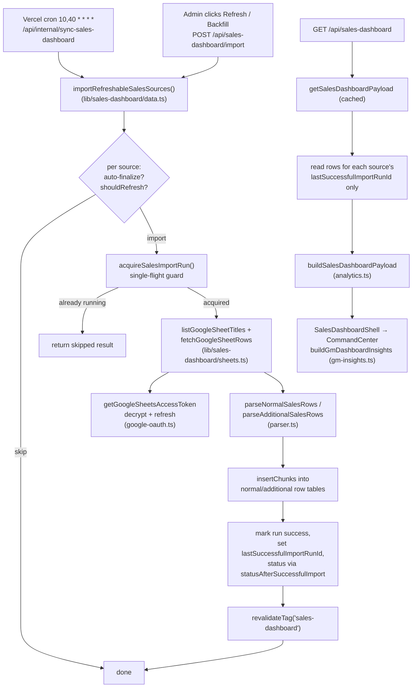

# Sales Dashboard

**Status: stable**

## Purpose

The Sales Dashboard imports monthly sales records from Google Sheets, normalizes them into Postgres, and renders a GM-facing "command center" that tracks revenue pace against a monthly target, scores the trial→new→renewal pipeline, and compares actual revenue against an imported scenario projection (Bear/Base/Bull).

It serves BeGifted general-management and sales-ops staff who maintain the per-month sales spreadsheets and want a single read-only readout of where the month stands — without the dashboard ever mutating the source sheets. The page lives behind the standard admin auth gate (`src/app/(app)/sales-dashboard/page.tsx:7-12`) and is reachable from the top nav (`src/components/layout/app-nav.tsx:28`).

This feature owns the repo's Google-Sheets access layer (`src/lib/sales-dashboard/sheets.ts` + `google-oauth.ts`), and the leave-requests feature reuses it: `src/lib/leave-requests/sync.ts:4` imports `fetchGoogleSheetRows` from `@/lib/sales-dashboard/sheets` (called at `sync.ts:310`) and `src/lib/leave-requests/data.ts:5` imports `updateGoogleSheetCell` from the same module (called at `data.ts:386`). So the Sheets read/write primitives are shared, even though the Sales-Dashboard page itself only ever reads. The feature carries a dedicated scope guard (see [Business rules & edge cases](#business-rules--edge-cases)) restricting one collaborator to Sales-Dashboard paths.

## Conceptual data model

The feature owns seven tables plus a shared OAuth-token table. Conceptually they fall into four groups:

- **Monthly sources & their imports** — one row per calendar month (`salesDashboardSources`) pointing at a Google Sheet, with an append-only import-run log (`salesDashboardImportRuns`) and two row tables holding the parsed sheet contents: package/"normal" sales (`salesDashboardNormalRows`) and ad-hoc "additional" sales (`salesDashboardAdditionalRows`). Each row table references the import run that produced it, so the dashboard reads only rows belonging to each source's *last successful* run.
- **Projection workbook & its imports** — a single active projection source (`salesDashboardProjectionSources`), an import-run log (`salesDashboardProjectionImportRuns`), and the parsed per-scenario, per-month projection rows (`salesDashboardProjectionMonths`).
- **OAuth credentials** — `googleOAuthTokens` stores per-admin encrypted Google access/refresh tokens and granted scopes; it is shared infrastructure, not Sales-Dashboard-exclusive (defined outside the feature's schema section, `src/lib/db/schema.ts:256-266`).
- **Source-status enum** — `sales_dashboard_source_status` (`active | refreshing | finalized | reopened | archived`), `src/lib/db/schema.ts:134-140`.

Full column definitions, indexes, and the partial unique indexes that enforce "one active source per month" and "single running import per source" live in the database reference. See **[docs/reference/database/erd-sales-dashboard.md](../reference/database/erd-sales-dashboard.md)** for the entity-relationship detail.

> Note: at the time of writing, the `docs/reference/database/` and `docs/reference/api/` subdirectories do not yet exist in the repo, so the `erd-*.md` and `api/*.md` targets are not yet present (see [Open questions](#open-questions)). `docs/reference/` itself does exist (it holds `crons.md` and `env.md`). The links above and below use the canonical reference home where that mechanical detail belongs.

## API surface

All HTTP routes require an authenticated admin session (`auth()` returning a `user.email`), except the cron endpoint which additionally accepts a `CRON_SECRET` bearer token. One-line purposes follow; for full request/response contracts see **[docs/reference/api/sales-dashboard.md](../reference/api/sales-dashboard.md)**.

- `GET /api/sales-dashboard` — return the fully-aggregated dashboard payload for the signed-in admin (`src/app/api/sales-dashboard/route.ts`).
- `GET /api/sales-dashboard/dimensions` — return month-grain rep/program/package/student dimensions for workspace tabs and drill filters (`src/app/api/sales-dashboard/dimensions/route.ts`).
- `GET /api/sales-dashboard/transactions` — return filtered, paginated transaction-ledger rows for tab drill-downs (`src/app/api/sales-dashboard/transactions/route.ts`).
- `GET /api/sales-dashboard/transactions/export` — return all filtered transaction-ledger rows as admin-only CSV, using the same filters as the JSON drill route (`src/app/api/sales-dashboard/transactions/export/route.ts`).
- `POST /api/sales-dashboard/import` — run an import: a single source by `sourceId`, all sources (`mode: "backfill"`), or just the live months (`mode: "refreshable"`) (`src/app/api/sales-dashboard/import/route.ts`).
- `GET /api/sales-dashboard/import-runs` — list the 20 most recent import runs (`src/app/api/sales-dashboard/import-runs/route.ts`).
- `GET /api/sales-dashboard/sources` — list non-archived monthly sources; `POST` upserts a source by month (`src/app/api/sales-dashboard/sources/route.ts`).
- `PATCH /api/sales-dashboard/sources/[sourceId]` — change a source's status (active/finalized/reopened, with archive-restore semantics); `DELETE` archives it (soft-delete) (`src/app/api/sales-dashboard/sources/[sourceId]/route.ts`).
- `POST /api/sales-dashboard/sources/seed` — seed the 14 hard-coded historical month sources (`src/app/api/sales-dashboard/sources/seed/route.ts`).
- `POST /api/sales-dashboard/projection-source` — upsert (or seed default) the active projection workbook source (`src/app/api/sales-dashboard/projection-source/route.ts`).
- `POST /api/sales-dashboard/projection-import` — import the active projection workbook (`src/app/api/sales-dashboard/projection-import/route.ts`).
- `GET|POST /api/internal/sync-sales-dashboard` — cron-triggered (or session-triggered POST) refresh of live-month sources plus the projection workbook (`src/app/api/internal/sync-sales-dashboard/route.ts`). Registered as a Vercel cron at `10,40 * * * *` in `vercel.json`.

## UI

- **Page**: `src/app/(app)/sales-dashboard/page.tsx` — a thin server component that gates on auth and renders the client shell inside a `Suspense` boundary.
- **`SalesDashboardShell`** (`src/components/sales-dashboard/sales-dashboard-shell.tsx`) — the top-level client component. Owns all data fetching (`GET /api/sales-dashboard` with `cache: "no-store"`), the period/date-range filter state, the Google-Sheets connect button (triggers `signIn("google", …)` with the readonly Sheets scope), the import action buttons, the header-level transaction CSV export for the selected date range, the failed-source banner, an empty/setup state, and a "Data Sources & Imports" dialog. Period presets are `All / 2025 / 2026 / Q1 2026 / This Month`, defaulting to **This Month** (`sales-dashboard-shell.tsx:46-93`).
- **`SalesDashboardCommandCenter`** (`src/components/sales-dashboard/gm-command-center.tsx`) — the analytics surface, rendered only when sources exist and rows have been imported. It calls `buildGmDashboardInsights(data, {from, to})` in a `useMemo` and lays out: a Revenue-Pace surface with pipeline stats, an Exceptions rail, an Actual-vs-Projection panel, a monthly revenue-trend chart (Chart.js), a sales-team table with previous-period deltas, and program/package/payment-day mix panels.
- **`SourceManager`** (`src/components/sales-dashboard/source-manager.tsx`) — the contents of the dialog: monthly-source table (status badges, row counts, per-source import/reopen/archive actions), an archived-sources expander with restore, the add-source form, and the projection-workbook configure/import controls.

## Data flow

A refresh (manual or cron) moves through the layers like this:

Key points:

- **Import path** (`importSalesDashboardSource`, `src/lib/sales-dashboard/data.ts:406-557`): resolves the sheet tab name from a preference + fallback list, fetches normal and additional tabs in parallel, parses, and bulk-inserts in 500-row chunks (`insertChunks`, `data.ts:145-154`). On success it stamps `lastSuccessfulImportRunId` and recomputes the source status; on error it rolls the source status back to its previous value and records `lastImportError`.
- **Read path** (`getSalesDashboardPayloadUncached`, `data.ts:847-883`): loads only the rows whose `importRunId` equals each non-archived source's `lastSuccessfulImportRunId`, so superseded import runs are silently ignored without deletion. Aggregation happens in `buildSalesDashboardPayload`; the result is wrapped in a Next.js `"use cache"` function tagged `sales-dashboard` with a 60s stale / 60s revalidate / 300s expire profile (`data.ts:885-890`).
- **Insight layer** is computed **client-side** from the payload (`buildGmDashboardInsights`, `src/lib/sales-dashboard/gm-insights.ts:122-152`), so changing the date-range filter does not re-hit the server.

## Business rules & edge cases

**Month lifecycle (auto-refresh windows).** `src/lib/sales-dashboard/lifecycle.ts` governs which sources refresh and when they freeze:
- A source refreshes only if it is the current Bangkok month, or the previous month through Bangkok day 7 (`sourceShouldRefresh`, `lifecycle.ts:8-19`).
- After a successful import, status becomes `active` for the current month (or previous month ≤ day 7) and `finalized` otherwise; `reopened`/`archived` are preserved (`statusAfterSuccessfulImport`, `lifecycle.ts:21-33`).
- On Bangkok day 8+, the previous month auto-finalizes during a refreshable run and is then skipped (`shouldAutoFinalizePreviousMonth`, `lifecycle.ts:35-42`; consumed at `data.ts:567-572`).
- Finalized sources are protected: importing one throws unless `allowFinalized` is passed (`data.ts:418-420, 437-447`). The UI confirms via `window.confirm` before sending `allowFinalized` (`source-manager.tsx:196-198`).

**Single-flight import guard (fail-safe concurrency).** `src/lib/sales-dashboard/import-guard.ts`:
- Before starting, any `running` import older than 20 minutes is force-failed and the source status restored from the run's stored `previousStatus` metadata (`STALE_RUNNING_SALES_IMPORT_MS = 20*60*1000`, `import-guard.ts:6`, `failStaleSalesDashboardImports` `:97-125`).
- A fresh concurrent run is detected and skipped rather than duplicated; the database partial unique index (`sdir_source_single_running_idx`) is the backstop — a `23505` unique violation is caught and converted to a "skipped/already running" result (`import-guard.ts:185-215`).

**Google token handling (fail-closed on scope).** `src/lib/sales-dashboard/google-oauth.ts`:
- Access/refresh tokens are AES-256-GCM encrypted with a key derived from `AUTH_SECRET` (`encryptToken`/`decryptToken`, `google-oauth.ts:37-68`); a missing `AUTH_SECRET` throws.
- Reads require the readonly *or* write scope; writes require the write scope. Missing scope throws `MissingGoogleSheetsTokenError` (`google-oauth.ts:184-186, 211-213`), which routes map to HTTP **409** rather than 500 (`import/route.ts:24-28`, `sync-sales-dashboard/route.ts:53-56`). Tokens are refreshed when within a 2-minute skew of expiry (`REFRESH_SKEW_MS`, `google-oauth.ts:10`).
- Note: the sheet *read* path only ever calls `getGoogleSheetsAccessToken` (readonly), consistent with the source-of-truth rule that the dashboard never mutates the sheets. The write functions `updateGoogleSheetCell` (`sheets.ts:92-111`, which internally calls `getGoogleSheetsWriteAccessToken` at `sheets.ts:99`) and `getGoogleSheetsWriteAccessToken` (`google-oauth.ts:200-225`) have no caller *within* the Sales-Dashboard feature, but they are not dead code: the leave-requests feature calls `updateGoogleSheetCell` at `src/lib/leave-requests/data.ts:386` (imported at `data.ts:5`) to write status back to its own sheet.

**Cron auth.** The cron endpoint compares the bearer token with `timingSafeEqual` and distinguishes `valid | invalid | missing-secret`; a missing server secret returns 500, an invalid one 401. `GET` requires the secret; `POST` additionally allows a signed-in admin to trigger manually (`sync-sales-dashboard/route.ts:14-66`).

**Sheet parsing heuristics.** `src/lib/sales-dashboard/parser.ts`:
- Header row is fixed at row 3 (`HEADER_ROW = 3`, `parser.ts:6`); data starts at row 4.
- Two formats are auto-detected by column presence: the new English layout (keyed off a `Payment Date` column, requires `Already Paid?` truthy) vs. the legacy Thai layout (`วันที่ชำระเงิน`, `ผู้ขาย`, `ยอดชำระสุทธิ`) (`parser.ts:83-108`). `paidValue` treats `true/1/yes/paid/ชำระ` as paid (`parser.ts:35-39`).
- Rows without a student nickname or without a parseable payment date are dropped (`parser.ts:88-110, 146-149`).
- **Enrollment classification** when not pre-filled: per student (case-insensitive nickname), trial rows are `Trial`; the first paid row preceded by a trial is `New Student`, all later paid rows are `Renewal` (`analyzeNormalSalesRows`, `parser.ts:165-192`).
- **Churn status**: computed from the latest paid row's `validUntil` plus a **14-day grace** (`addDaysIso(validUntil, 14)`). Within grace → `Active`; past grace with a later payment → `Retained`; otherwise → `Churned`. All-trial students → `N/A` (`parser.ts:200-224`). The same 14-day grace drives the retention cohort in `analytics.ts:172-199`.
- `programWiseName` is mapped through `PROGRAM_MAP` (`program-map.ts`), falling back to the raw program name when unmapped (`parser.ts:195`).

**Date handling.** Google serial date numbers are converted via the 1899-12-30 epoch (`isoDateFromGoogleSerial`, `dates.ts:46-50`); string dates accept ISO and D/M/Y forms; all month/day boundary math is anchored to Asia/Bangkok (`dates.ts`).

**Projection parsing (fail-loud).** `src/lib/sales-dashboard/projection.ts` requires the Summary sheet to carry Bear/Base/Bull headers and named rows, the What_If sheet to carry an "effective monthly revenue target" (or fallback label), and the Calc_Multi sheet to contain `--- Bear ---`/`--- Base ---`/`--- Bull ---` scenario blocks with all required metric rows; a non-numeric value or any missing label **throws** with a specific message (`projection.ts:57-63, 91-100, 116-123, 138-156, 168-183`). The active projection source is enforced unique by a partial index (`sdps_single_active_idx`).

**Target source.** Revenue pace uses the imported What_If target when present, otherwise the hard-coded fallback `MONTHLY_NORMAL_SALES_TARGET = 4_000_000` (`gm-insights.ts:15, 166`); the payload reports `targetSource: "projection" | "fallback"` (`data.ts:838-839`).

**GM exceptions (deterministic thresholds).** `buildExceptions` (`gm-insights.ts:322-400`) emits a fixed set: any failed active source (`critical`), no import timestamp or staleness > 90 min (`STALE_SOURCE_MINUTES`, `gm-insights.ts:16`), behind monthly pace (critical when the projected gap exceeds 15% of target), trial conversion < 35%, retention < 50%, and churn-replacement ratio < 1.0.

**Soft-delete / restore.** Archiving sets `status = archived` and stashes `statusBeforeArchive`, keeping all rows and history (`archiveSalesDashboardSource`, `data.ts:319-346`). Restore is blocked if another active source already occupies that month (`data.ts:357-368`). A refreshing source cannot be archived (`data.ts:327-329`).

**Repository scope guard (operational, not runtime).** Because a non-owner collaborator (`aoengnatchasmith-spec`) contributes only to this feature, two guards enforce the boundary:
- A **CI check** — `.github/workflows/sales-dashboard-scope.yml` pipes the PR's changed files into `scripts/check-sales-dashboard-scope.mjs`, which fails the build if that specific actor touches anything outside five allowed prefixes (`src/app/(app)/sales-dashboard/`, `src/app/api/sales-dashboard/`, `src/app/api/internal/sync-sales-dashboard/`, `src/components/sales-dashboard/`, `src/lib/sales-dashboard/`). For any other actor the check is skipped.
- A **local Claude hook** — `.claude/hooks/sales-dashboard-guard.mjs` enforces the same allow-list on `Edit`/`Write` at `PreToolUse`, blocks `Read` of secret/`.xlsx`/`.vercel` paths, and blocks destructive or production commands (force-push, push to main, `vercel --prod`, hitting prod `sync-*` endpoints, reading `.env`).

## Tests

Tests use Vitest and live in `__tests__` directories beside the code:

- **`src/lib/sales-dashboard/__tests__/parser.test.ts`** — spreadsheet-ID extraction; old Thai vs. new English format parsing; unpaid-row filtering; preservation of pre-filled enrollment type; additional-row parsing and skipping rows without payment dates.
- **`src/lib/sales-dashboard/__tests__/analytics.test.ts`** — first-trial cohort conversion-date logic; retention cohort built off the valid-until **grace deadline** rather than valid-until itself.
- **`src/lib/sales-dashboard/__tests__/gm-insights.test.ts`** — month-end revenue projection from historical completion curves; deterministic exception generation (stale/failed/pace/conversion/retention/replacement); previous-equivalent-period sales-team deltas; imported-projection target and actual-vs-projection rows.
- **`src/lib/sales-dashboard/__tests__/lifecycle.test.ts`** — current + previous-month refresh through day 7; stop + auto-finalize on day 8; finalize historical months while preserving `reopened`.
- **`src/lib/sales-dashboard/__tests__/import-guard.test.ts`** — acquires a run when idle; skips a fresh in-flight run; resolves the unique-index race; marks stale runs failed and restores prior source status.
- **`src/lib/sales-dashboard/__tests__/projection.test.ts`** — parses target, scenario summaries, and monthly scenario rows; fails clearly on missing labels.
- **`src/lib/sales-dashboard/__tests__/csv.test.ts`** — stable CSV serialization, Excel-friendly BOM, escaping, Unicode/Thai text, arrays, nulls, CRLF rows, and filename sanitizing.
- **`src/lib/sales-dashboard/__tests__/dates.test.ts`** — Bangkok-anchored current-month helpers; no premature month rollover before Bangkok midnight.
- **`src/app/api/sales-dashboard/__tests__/route.test.ts`** — auth gating; Postgres-backed payload; backfill / selected-source / finalized-protection imports; 409 when Sheets unconnected; explicit no-op when no sources; row-count summaries; archive (soft-delete) and restore; surfaced action errors; projection save + import.
- **`src/app/api/sales-dashboard/__tests__/transactions-route.test.ts`** — transaction drill and transaction CSV export auth, date validation, filters, no raw-source serialization, and no export pagination cap.
- **`src/app/api/internal/sync-sales-dashboard/__tests__/route.test.ts`** — cron-secret requirement for GET; cron-actor refreshable import; manual admin POST without secret; 409 when cron lacks Sheets access.
- **`src/components/sales-dashboard/__tests__/empty-state-source.test.ts`** — zero-source setup guidance renders above the command center; live-month refresh cannot claim success before sources exist; source management is tucked behind the dialog; projection controls live in the dialog.

## Open questions

- **Reference docs are missing.** The section contract asks feature docs to link to `docs/reference/database/erd-*.md` and `docs/reference/api/*.md`, but neither subdirectory exists yet in the repo. (`docs/reference/` itself exists and holds `crons.md` and `env.md`; `docs/` also contains `features/`, `handbook/`, and `operations/`.) The links here point at the canonical reference home (`erd-sales-dashboard.md`, `api/sales-dashboard.md`); a human should confirm those reference files will be generated under those exact names.
- **No-op month status branch.** In `upsertSalesDashboardSource`, the status is set via `sourceMonth === currentBangkokMonthStart(now) ? "active" : "active"` (`data.ts:190`) — both branches yield `"active"`. This looks like a leftover from an intended current-vs-historical distinction; intent unclear.
- **`isHistoricalMonth` appears unused.** Exported from `lifecycle.ts:44-48` but not referenced by the import/read paths reviewed; possibly intended for a UI affordance that was not wired up.
- **Backfill ignores the auto-finalize/refresh windows.** `importAllSalesSources` (`data.ts:579-593`) imports every source with `allowFinalized: true`, bypassing lifecycle gating. This is presumably intentional for one-shot historical loads, but the contrast with the cron path is worth a human confirming as designed.

_Verified against HEAD + uncommitted WIP on 2026-05-31._
