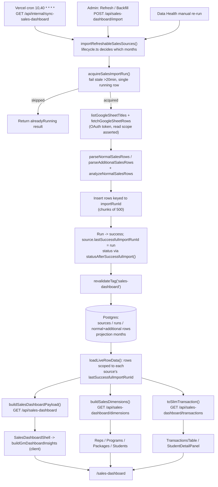

# Sales Dashboard

**Status: stable**

## Purpose

The Sales Dashboard turns the sales team's monthly Google Sheets into a governed Postgres dataset and renders a GM-facing readout on top of it: revenue pace against a target, the trial → new-student → renewal pipeline, actual revenue against an imported Bear/Base/Bull scenario projection, and four drill-down tabs (Reps, Programs, Packages, Students) with per-row transaction drills and CSV exports.

It presents two kinds of surface: **operations controls** (seed sources, backfill, refresh, archive/restore, projection workbook — all inside the Data Sources dialog) and a **readout** (the Overview command center plus the breakdown tabs). The code does not separate those by role — there is one admin gate for the whole feature, and the Data Sources dialog is reachable by any signed-in admin from the page header (`src/components/sales-dashboard/sales-dashboard-shell.tsx:280-283`). Who owns which surface is an organizational convention, not something the repo enforces. Everything is **read-only against Google** on the Sales-Dashboard path — the feature imports sheets and never writes back to them (write helpers exist in the shared Sheets layer but are used by other features; see below).

The page sits behind the normal admin auth gate (`src/app/(app)/sales-dashboard/page.tsx:8-13`) and is registered in the tool navigation under the `finance-revenue` section (`src/lib/navigation/tools.ts:197-203`).

**This feature owns the repo's Google integration layer.** `src/lib/sales-dashboard/sheets.ts` (Sheets REST helpers) and `src/lib/sales-dashboard/google-oauth.ts` (encrypted per-admin token store, scope assertions, refresh) live here but are consumed across the codebase:

| Consumer | Imports |
|---|---|
| Leave Requests | `fetchGoogleSheetRows`, `hasSheetsReadScope`/`hasSheetsWriteScope` (`src/lib/leave-requests/sync.ts:4-5`), `updateGoogleSheetCell`, `MissingGoogleSheetsTokenError` (`src/lib/leave-requests/data.ts:5-6`) |
| Post-Class Feedback / payouts | `getGoogleDriveAccessToken` (`src/lib/post-class-feedback/drive.ts:3`), `appendGoogleSheetRows` + `fetchGoogleSheetRows` (`src/lib/post-class-feedback/payout-writer.ts:3-6`), token accessors (`dashboard.ts:18`, `payout-run.ts:10`), `serializeCsv` (`payout-plan.ts:4`) |
| Auth | `storeGoogleOAuthTokenForUser` on sign-in (`src/lib/auth.ts:53`) |
| Home summary / Leave Requests API | `getGoogleTokenStatus` (`src/lib/home/summary.ts:11`, `src/app/api/leave-requests/route.ts:4`) |
| US Universities | `serializeCsv` (`src/lib/us-universities/csv.ts:4`) |
| Operational scripts (payout path) | Sheets helpers in `scripts/restore-payout-workbook-formulas.ts:25`, `scripts/derive-payout-tutor-names.ts:42`, `scripts/setup-payout-master-tabs.ts:25`, `scripts/inventory-payout-workbooks.ts:36`, `scripts/repoint-payout-workbook-formulas.ts:31`, `scripts/roll-payout-workbook-dates.ts:61`; `getGoogleTokenStatus`/`hasDriveFileScope` in `scripts/verify-drive-upload.ts:35` |

The batch write helpers (`batchUpdateGoogleSheetValues`, `batchUpdateGoogleSpreadsheet`, `sheets.ts:288`, `:317`) have no **non-test** consumer inside `src/` — the module's own unit suite exercises both (`src/lib/sales-dashboard/__tests__/sheets.test.ts:14-15`, `:107`, `:196`), and every real caller is a payout script (`scripts/setup-payout-master-tabs.ts:19`, `scripts/restore-payout-workbook-formulas.ts:20`, `scripts/repoint-payout-workbook-formulas.ts:26`, `scripts/roll-payout-workbook-dates.ts:55`).

The feature also carries a dedicated **collaborator scope guard** (see [Business rules & edge cases](#business-rules--edge-cases)) that pins one GitHub collaborator to Sales-Dashboard paths only, enforced both locally (Claude Code hook) and in CI.

## Conceptual data model

Seven owned tables plus one shared credential table, in four conceptual groups.

- **Monthly sources.** One row per calendar month (`sales_dashboard_sources`) pointing at a Google spreadsheet and, optionally, explicit tab names. Each source carries one lifecycle state from `sales_dashboard_source_status` (canonical value list in [enums.md](../reference/database/enums.md)) plus the id of its **last successful import run**, row counts, and the last import error. The state is load-bearing for the [Month lifecycle](#month-lifecycle--which-sources-refresh) rules below, which turn on `finalized` and `archived` (never refresh), `reopened` (sticky across imports), and `refreshing` (blocks archival). A partial unique index enforces one non-archived source per month (`src/lib/db/schema.ts:643-645`).
- **Import runs and parsed rows.** `sales_dashboard_import_runs` is the append-only run log, with a partial unique index that allows only one `running` row per source — the database-level half of the single-flight guard (`src/lib/db/schema.ts:666-668`). Each run writes two row tables: package sales (`sales_dashboard_normal_rows`) and ad-hoc extras (`sales_dashboard_additional_rows`). Rows are keyed to the run that produced them, and reads only ever select rows belonging to each source's `lastSuccessfulImportRunId`, so a half-finished or failed run can never leak into the dashboard. Rows carry the untouched sheet row as a `raw` jsonb blob, which is never serialized to a client (see rules).
- **Projection workbook.** A single active source (`sales_dashboard_projection_sources`, partial unique index on `status = 'active'`, `src/lib/db/schema.ts:737-739`), its own run log (`sales_dashboard_projection_import_runs`), and per-scenario/per-month forecast rows (`sales_dashboard_projection_months`) covering revenue, student counts, hours, and room utilization for Bear/Base/Bull. The scenario *summary* block is not a table — it is persisted inside the run's `metadata` jsonb and rehydrated on read (`src/lib/sales-dashboard/data.ts:801-809`, `:848`).
- **Shared credentials.** `google_oauth_tokens` holds per-admin AES-256-GCM-encrypted Google access/refresh tokens plus granted scopes. It is snapshot-independent shared infrastructure, not Sales-Dashboard-exclusive.

Column-level detail, indexes, and the ER diagram live in the canonical reference: **[docs/reference/database/erd-sales-dashboard.md](../reference/database/erd-sales-dashboard.md)** (enum values in [enums.md](../reference/database/enums.md), full column index in [index.md](../reference/database/index.md)).

## API surface

Every route requires an admin session (`auth()` with a `user.email`), except the internal cron route which accepts a `CRON_SECRET` bearer token and falls back to an admin session on `POST`. Full request/response contracts, status codes, and side effects: **[docs/reference/api/sales-dashboard.md](../reference/api/sales-dashboard.md)** (cron specifics also in [internal-crons.md](../reference/api/internal-crons.md)).

| Method + path | Purpose |
|---|---|
| `GET /api/sales-dashboard` | Full aggregated dashboard payload (days, cohorts, reps, sources, projection, Google-token status). |
| `GET /api/sales-dashboard/dimensions` | Month-grain rep/program/package/student aggregates for the four workspace tabs. |
| `GET /api/sales-dashboard/transactions` | Paged, filtered slim transaction rows for drill-downs. |
| `GET /api/sales-dashboard/transactions/export` | Same filter set over the full unpaginated result, returned as a UTF-8-BOM CSV attachment. |
| `POST /api/sales-dashboard/import` | Import one source, all refreshable sources, or backfill every source. |
| `GET /api/sales-dashboard/import-runs` | Twenty most recent import runs. **No client consumer** — see below. |
| `GET, POST /api/sales-dashboard/sources` | List monthly sources / upsert one by month. |
| `PATCH, DELETE /api/sales-dashboard/sources/{sourceId}` | Change lifecycle status / archive (soft delete) a source. |
| `POST /api/sales-dashboard/sources/seed` | Seed the 14 known historical monthly sheets. |
| `POST /api/sales-dashboard/projection-source` | Upsert (or seed the default) projection workbook config. |
| `POST /api/sales-dashboard/projection-import` | Re-import the active projection workbook. |
| `GET, POST /api/internal/sync-sales-dashboard` | Cron entry point: refreshable sources + projection, wrapped in the cron audit. |

Two notes on that table. The CSV export is **not streamed**: `serializeCsv` materializes the whole file as one string over the full filtered set and the route returns it in a single `new Response(csv, …)` (`src/lib/sales-dashboard/csv.ts:22-33`, `src/app/api/sales-dashboard/transactions/export/route.ts:51-60`) — a very large filter set is one big in-memory buffer, not a stream. And `GET /api/sales-dashboard/import-runs` is currently **dead API surface**: nothing in `src/` fetches that path, because `SourceManager` renders per-source import status straight from the `sources[]` summary fields already on the landing payload (`src/components/sales-dashboard/source-manager.tsx:185-193`). The handler and its query (`listRecentSalesDashboardImportRuns`, `data.ts:967-973`) work; they just have no caller.

The cron runs at `10,40 * * * *` (`vercel.json`), registered in the data-health cron registry as job `sales_dashboard` with a 45-minute late threshold and an 800 s max duration (`src/lib/data-health/cron-registry.ts:77-91`). The same job is manually re-runnable from Data Health, which calls the library functions directly rather than the HTTP route (`src/lib/data-health/run-job.ts:64-79`). Sales import and projection runs both feed the Data Health run history under that one job key (`src/lib/data-health/dashboard.ts:179-187`, `:669-690`). See [docs/reference/crons.md](../reference/crons.md).

## UI

One page: `src/app/(app)/sales-dashboard/page.tsx`. The default export is a **synchronous** Server Component whose whole body is `<Suspense fallback={<SalesDashboardSkeleton />}>` (`:16-22`); the auth check lives in the inner async `SalesDashboardBody`, which `redirect("/login")`s without a session email and otherwise renders the client shell (`:7-14`). All data is fetched client-side.

- **`SalesDashboardShell`** (`src/components/sales-dashboard/sales-dashboard-shell.tsx`) — owns the payload fetch, the period state, the busy/error/message banners, the "Connect Google Sheets" consent flow (`signIn("google", …)` with `prompt: consent`, `access_type: offline`, and the read-only Sheets scope, `:266-276`), the failed-source banner, and the Data Sources dialog. It renders a first-run setup state when no sources or no imported rows exist (`:395-446`).
- **`PeriodToolbar`** — five presets (All / 2025 / 2026 / Q1 2026 / This Month) plus free-form from/to date inputs. Preset ranges are hardcoded calendar spans; editing a date input drops the selection to "All".
- **`WorkspaceTabs`** — tab container syncing `?tab=` to the URL. Overview stays mounted; the four breakdown panels are lazy-mounted on first activation and kept mounted afterwards. It owns the single `useSalesDimensions()` instance and consumes GM cross-link "explore seeds" (clicking a rep/program/package row in Overview switches tab and pre-filters the panel).
- **`SalesDashboardCommandCenter`** (Overview) — revenue-pace gauge, GM exception list, pipeline stats, sales-team table, monthly revenue, actual-vs-projection, and mix charts, all derived client-side by `buildGmDashboardInsights`. Exports an "overview export" CSV row set (`buildOverviewExportRows`).
- **Tabs** — `RepsTab`, `ProgramsTab`, `PackagesTab`, `StudentsTab` share a locked prop contract (`SalesTabProps` in `src/lib/sales-dashboard/types.ts:391-403`) and each embeds `TransactionsTable` for the drill and `CsvExportButton` for export.
- **`TransactionsTable`** — paged fetch over `/api/sales-dashboard/transactions` with an AbortController, a per-filter-key cache, skeleton rows, and an explicit "+N more / load all" footer; it never silently truncates, and bounds load-all restarts when the server list shifts mid-load (`src/components/sales-dashboard/transactions-table.tsx:59-62`).
- **`StudentDetailPanel`** — dialog below `xl`, side panel at `xl+`. Renders purchase history, a coverage-window renewal timeline from `buildCoverageWindows`, the trial-conversion marker, and the churn rule spelled out verbatim (`CHURN_RULE_TEXT`, `src/components/sales-dashboard/student-detail-panel.tsx:45-46`). One transactions fetch serves both the table and the timeline.
- **`SourceManager`** — inside the Data Sources dialog: seed, backfill, projection workbook config + import, and per-source import status rendered from the payload's `sources[]` summary fields (`:185-193`). Per-source actions are **Import/refresh** (`:196-200`), **Reopen** — rendered only when the source is already `finalized` (`:201-207`) — and **Archive** (`:208-213`); **Restore** lives in the collapsed archived-sources table (`:249-254`). There is **no Finalize control**: the only `patchJson` payloads in the file are `"reopened"` and `"active"`. The PATCH route's schema does accept `"finalized"` (`src/app/api/sales-dashboard/sources/[sourceId]/route.ts:10`), but no UI sends it — in practice finalization happens only automatically, via `statusAfterSuccessfulImport` / `shouldAutoFinalizePreviousMonth`.
- **`ChartCanvas`** — the shared Chart.js wrapper. Colors are read from the OKLCH theme tokens at runtime (`chartColors()`); the hardcoded hexes are SSR-only fallbacks (`src/components/sales-dashboard/chart-canvas.tsx:27-31`). Because Chart.js cannot size itself inside a hidden tab, the canvas resizes whenever its panel is re-activated (`:80-82`).

## Data flow

An import moves sheet → parser → Postgres → cache invalidation; a read moves Postgres → pure aggregator → cached payload → client.

```mermaid
flowchart TD
    Cron["Vercel cron 10,40 * * * *<br/>GET /api/internal/sync-sales-dashboard"] --> Refreshable
    Admin["Admin: Refresh / Backfill<br/>POST /api/sales-dashboard/import"] --> Refreshable
    DataHealth["Data Health manual re-run"] --> Refreshable

    Refreshable["importRefreshableSalesSources()<br/>lifecycle.ts decides which months"] --> Guard
    Guard["acquireSalesImportRun()<br/>fail stale >20min, single running row"] -->|skipped| Skip["Return alreadyRunning result"]
    Guard -->|acquired| Fetch

    Fetch["listGoogleSheetTitles + fetchGoogleSheetRows<br/>(OAuth token, read scope asserted)"] --> Parse
    Parse["parseNormalSalesRows / parseAdditionalSalesRows<br/>+ analyzeNormalSalesRows"] --> Insert
    Insert["Insert rows keyed to importRunId<br/>(chunks of 500)"] --> Promote
    Promote["Run -> success; source.lastSuccessfulImportRunId = run<br/>status via statusAfterSuccessfulImport()"] --> Invalidate
    Invalidate["revalidateTag('sales-dashboard')"] --> Cache

    Cache[("Postgres:<br/>sources / runs / normal+additional rows<br/>projection months")] --> Load
    Load["loadLiveRowData(): rows scoped to each<br/>source's lastSuccessfulImportRunId"] --> Payload
    Load --> Dims
    Load --> Slim

    Payload["buildSalesDashboardPayload()<br/>GET /api/sales-dashboard"] --> Shell
    Dims["buildSalesDimensions()<br/>GET /api/sales-dashboard/dimensions"] --> Tabs
    Slim["toSlimTransaction()<br/>GET /api/sales-dashboard/transactions"] --> Drill

    Shell["SalesDashboardShell -> buildGmDashboardInsights (client)"] --> UI
    Tabs["Reps / Programs / Packages / Students"] --> UI
    Drill["TransactionsTable / StudentDetailPanel"] --> UI
    UI["/sales-dashboard"]
```

Three cached read helpers sit on the same `loadLiveRowData()` pass, all tagged `sales-dashboard` with `cacheLife({ stale: 60, revalidate: 60, expire: 300 })`: `getSalesDashboardPayload` (`src/lib/sales-dashboard/data.ts:919-924`), `getLiveSlimRows` (`:932-941`), and `getSalesDimensionsPayload` (`:948-965`). Almost every mutation path calls `revalidateSalesDashboardCache()` (`data.ts:216`, `:278`, `:323`, `:352`, `:394`, `:545`, `:706`, `:723`), and the client mirrors that with `invalidateSalesDimensions()` after any import or source edit (`src/components/sales-dashboard/sales-dashboard-shell.tsx:150-152`).

**One branch does not.** The failure path of `importSalesDashboardSource` marks the run `failed`, rolls the source back to `previousStatus` with `lastImportError` set, and rethrows — without revalidating (`data.ts:553-563`). The projection-import failure branch *does* revalidate (`data.ts:723`), so the two are inconsistent. What the repo establishes is the mechanism, not the magnitude: `getSalesDashboardPayload` is `"use cache"` with `cacheLife({ stale: 60, revalidate: 60, expire: 300 })` (`data.ts:919-924`), the shell fetches it with `cache: "no-store"` (which governs the browser fetch, not the server-side cache entry — `sales-dashboard-shell.tsx:92`), and the failure branch leaves the `sales-dashboard` tag unswept. How long the shell's failed-source banner actually lags therefore depends on Next 16 `"use cache"` revalidation behaviour, which no test in this repo exercises (every route suite `vi.mock`s `data.ts` wholesale) — treat "the banner can lag until the next revalidation" as the safe statement.

## Business rules & edge cases

### Month lifecycle — which sources refresh

`src/lib/sales-dashboard/lifecycle.ts` is the whole policy, expressed in Bangkok time:

- A source refreshes only if it is the **current month**, or the **previous month within the first 7 days** of the new month; `finalized` and `archived` sources never refresh (`lifecycle.ts:8-19`).
- After a successful import the status is recomputed: current month → `active`; previous month on day ≤ 7 → `active`; anything older → `finalized`. `reopened` and `archived` are sticky and survive the import (`lifecycle.ts:21-33`).
- From day 8 of the new month, a previous-month source that is still `active` is auto-finalized **instead of** being imported (`lifecycle.ts:35-42`, applied in `data.ts:576-579`).

This is the closing-the-books rule: once a month is finalized, a routine refresh cannot silently rewrite historical revenue. A manual import of a finalized source is refused unless the caller passes `allowFinalized` (`data.ts:426-428`). Two paths pass it, and the import route takes the flag straight off the request body (`src/app/api/sales-dashboard/import/route.ts:17`, `:59`):

1. **Backfill all** sets it unconditionally for every source (`data.ts:587-601`).
2. The **per-source refresh button** in the Source Manager sets it only when the source is finalized *and* the operator clears a browser `confirm` — `allowFinalized: source.status === "finalized" && window.confirm("Refresh finalized source?")` (`source-manager.tsx:197`).

So the closing-the-books rule is a speed bump for a deliberate human action, not a hard lock.

### Single-flight import guard

Two layers. In the database, a partial unique index permits one `running` run per source. In code, `acquireSalesImportRun()` first fails any run still `running` after 20 minutes — restoring the source's pre-import status from the run's `metadata.previousStatus` — then checks for a live running run and returns a `skipped: true, alreadyRunning: true` outcome rather than throwing (`src/lib/sales-dashboard/import-guard.ts:6`, `:97-125`, `:168-216`). A unique-violation race falls back to the same skipped result (`:199-215`). Callers count only non-skipped results toward "imported sources" (`src/app/api/sales-dashboard/import/route.ts:20-22`).

On failure the run is marked `failed` with the error summary and the source is rolled back to `previousStatus` with `lastImportError` set — the previous successful run's rows stay live (`data.ts:553-564`). Because reads are scoped to `lastSuccessfulImportRunId`, **a failed import degrades to stale-but-correct data, never partial data** (`data.ts:869-901`). This branch is also the one mutation path that skips cache revalidation — see [Data flow](#data-flow).

### Sheet parsing — fail-soft on rows, strict on structure

- Data starts after a fixed header at row 3; the normal tab is `(1)PackageSales` with a legacy fallback of `SalesRecord`, and the extras tab is `(2)AdditionalSales` (`src/lib/sales-dashboard/parser.ts:6-9`). An explicit per-source tab name is only **preferred**, not authoritative: `chooseSheetName` uses it when the workbook actually contains a tab with that title and otherwise falls straight through to the defaults (`if (preferred && titles.includes(preferred)) return preferred; return fallbacks.find(…) ?? null`, `data.ts:148-151`, applied at `:465-472`). A typo'd override is therefore silently ignored rather than raised. A missing normal tab aborts the import (`data.ts:471`); a missing additional tab is tolerated and yields zero extra rows (`data.ts:472-479`).
- Two sheet generations coexist. Presence of a `Payment Date` column selects the newer English layout; otherwise the Thai column names are used (`parser.ts:83`, `:97-108`).
- A row is dropped if it has no student nickname, no parseable payment date, or — in the new format — is not marked paid (`parser.ts:88-110`). "Paid" accepts `true`/`1`/`yes`/`paid` and any value containing `ชำระ` (`parser.ts:35-39`).
- Values are read `UNFORMATTED_VALUE` with `SERIAL_NUMBER` dates (`sheets.ts:128-145`), so `parseSalesDate` handles `Date` instances, Google serials, ISO, and D/M/Y strings, each with its own early return (`dates.ts:86-105`). The year-2000 floor applies **only** to the loose `new Date(raw)` fallback at the end (`dates.ts:107-108`) — every earlier branch bypasses it, so `"1999-05-01"` parses through unchanged and serial `1` yields `1899-12-31` (the only serial guard is `value <= 0`, `dates.ts:81`). Treat the floor as a last-resort sanity check on free-text dates, not a global validity rule.
- Enrollment type is **derived**, not trusted: rows with an explicit Trial/New Student/Renewal value are left alone; otherwise, per student in payment-date order, `trial`-package rows become Trial, the first paid row immediately following a trial becomes New Student, and every other paid row becomes Renewal (`parser.ts:178-192`).
- Program names are mapped through a 58-entry lookup to the Wise-facing name, falling back to the raw name when unmapped (`parser.ts:195`, `program-map.ts`).

### Churn: stored vs live

The import freezes a `churnStatus` on the student's latest row using a **14-day grace window** after the latest paid package's `validUntil`: still within grace → `Active`; a payment after the deadline → `Retained`; otherwise `Churned`; all-trial or missing `validUntil` → `N/A` (`parser.ts:200-224`). That value is a point-in-time snapshot and goes stale the moment the clock moves.

In practice **nothing a user sees reads that frozen value.**

- The **Students tab and student detail panel** recompute live: `computeLiveStatus()` applies the same validUntil + 14 d rule against today, adding `Pending` (paid but no `validUntil`) and `Trial-only` (no paid rows) (`src/lib/sales-dashboard/cohorts.ts:67-90`, rule at `:34-36`, used by `dimensions.ts:353-355`). These two surfaces are also the only ones that spell the 14-day rule out in the UI (`tabs/students-tab.tsx:402`, `:452`; `CHURN_RULE_TEXT` rendered at `student-detail-panel.tsx:182`). The Overview contains no 14-day or grace-window copy at all.
- The **Overview's cohort/pipeline panels also do not read `churn_status`.** `buildPipeline` consumes `data.trialCohort` / `data.retentionCohort` (`gm-insights.ts:247-251`), and neither builder in `analytics.ts` touches the frozen column. They differ in *how* they recompute: `buildRetentionCohort` walks each student's paid rows and derives the decision date from `validUntil` through `decisionDateFor` (+14 d), tagging each window `Retained`/`Churned` (`analytics.ts:173-200`, the rule at `:186`); `buildTrialCohort` never reads `validUntil` at all — it takes each student's first `enrollmentType === "Trial"` row and pairs it with `findConversion()`, the first `"New Student"` row strictly after that trial date (`analytics.ts:150-171`, `:161-163`; `cohorts.ts:44-49`). The rendered pipeline stats are trial conversion, retention, replacement, and pipeline mix (`gm-command-center.tsx:239-242`), all derived from those live cohorts.
- The stored value's only **analytical** consumer is `churnList`, plus the `churnedStudents` / `eligibleStudents` counts derived from it (`analytics.ts:295-302`, `:323-324`; the reads themselves are the filter at `:296` and the cast at `:300`). Two further `row.churnStatus` reads exist, both on the persistence path and neither interpreting the value: `data.ts:501` copies it into the insert payload, and `data.ts:756` copies it back out in `normalRowFromDb`. Grepping `churnList|churnedStudents|eligibleStudents` across `src/` returns hits only in `analytics.ts`, the `types.ts` declarations (`:76-81`), and a `gm-insights` test fixture. They are payload fields with **no consumer anywhere in the app** — dead weight on every dashboard response.

The Students directory is deliberately **whole-history** — the shell's period selector does not filter it (`src/components/sales-dashboard/tabs/students-tab.tsx:26-29`), and "Expiring soon" means the renewal decision date falls within the next 30 days (`tabs/students-tab.tsx:43`, `:90-96`).

### Identity is nickname-based

Students and reps are grouped by a normalized key — trim, lowercase, collapse internal whitespace (`cohorts.ts:21-32`). There is no Wise identity resolution here, so two students sharing a nickname collapse into one directory entry, and one student spelled two ways collapses correctly. The dimensions builder tracks every display variant and picks the most frequent as canonical (`dimensions.ts:60-84`), and the detail panel surfaces the variants rather than hiding the caveat. The same normalizers are applied in `filterSlimTransactions`, so a drill key always matches its aggregate (`dimensions.ts:450-462`).

### Packages fail soft, projections fail loud

Package hours parse from English, abbreviated, or Thai hour tokens (or a bare number) into bands `Trial | 1-10h | 20h | 30h | 40h+ | Other`. Anything unparseable lands in `Other`, is counted in `unparsedPackageCount`, and **keeps its revenue** — the number is never dropped to keep a chart tidy (`src/lib/sales-dashboard/package-hours.ts:21-57`, `dimensions.ts:179`).

The projection workbook is the opposite: it is a structured financial model, so the parser throws on any structural or numeric surprise rather than guessing. Missing Bear/Base/Bull headers, a missing summary row, missing month headers, a missing scenario block, or a missing metric row all abort the import (`src/lib/sales-dashboard/projection.ts:57-63`, `:92-99`, `:135`, `:146-148`, `:176-181`). Only per-cell month values are tolerant (`optionalNumeric` → 0). All three tabs must exist **by the names configured on the projection-source row** — `requireProjectionSheet(titles, source.summarySheetName, "Summary")` and its two siblings throw when the title is absent (`data.ts:603-612`). Those names merely *default* to `Summary` / `What_If` / `Calc_Multi` (`projection.ts:10-12`, applied only when the input is blank at `data.ts:252-254`) and are operator-editable in the Source Manager's three tab inputs (`source-manager.tsx:136-150`). So a renamed workbook imports fine when the config matches, and a workbook with the default tab names fails if the config was edited away from them.

### Revenue target provenance

The monthly target comes from the projection workbook's *Effective monthly revenue target* when a projection has been imported; `targetSource` records which (`data.ts:846-847`). The Overview falls back to a hardcoded ฿4,000,000 when there is no projection (`gm-insights.ts:15`, `:166`). The dimensions payload does **not** fall back — it returns `null` unless the target genuinely came from a projection (`dimensions.ts:382-384`), so the Reps tab's pace-vs-target simply disappears rather than scoring reps against a placeholder (`src/components/sales-dashboard/tabs/reps-tab.tsx:167-192`).

Revenue pace also projects month-end from a completion curve learned from *complete prior months only* (the current and future months are excluded from the sample), falling back to a linear day-of-month ratio when no samples exist (`analytics.ts:85-140`, `gm-insights.ts:171-177`). GM exceptions flag failed sources, a missing import timestamp, data older than 90 minutes, being behind pace, trial conversion under 35 %, retention under 50 %, and churn replacement below 1× (`gm-insights.ts:16`, `:322-400`).

### PII and secrets

- The `raw` sheet blob is stored but **never serialized to a client**. `toSlimTransaction` / `toSlimAdditionalTransaction` build an explicit field list, guarded by a unit test (`src/lib/sales-dashboard/dimensions.ts:390-433`).
- Google tokens are AES-256-GCM encrypted with a key derived from `AUTH_SECRET` and stored as `v1:iv:tag:ciphertext` (`google-oauth.ts:41-72`). Accessors assert the specific scope they need — read, write, or Drive — and raise an actionable `MissingGoogleSheetsTokenError` instead of letting Google return a bare 403 (`google-oauth.ts:192-194`, `:219-221`, `:251-253`). That error maps to HTTP **409** in the import, projection-import, and cron routes, distinguishing "reconnect Google" from a real 500.
- Tokens refresh two minutes before expiry; a refresh failure records `lastError` on the token row and surfaces in the payload's `token` block (`google-oauth.ts:14`, `:141-179`, `:267-284`).
- The cron route compares the bearer token with `timingSafeEqual` after a length pre-check, and allows an admin session only on `POST` — `GET` is cron-only (`src/app/api/internal/sync-sales-dashboard/route.ts:15-22`, `:24-42`, `:71-77`). Note the ordering on `POST`: the session lookup runs **before** the missing-secret branch (`:29-33`), so a signed-in admin proceeds normally even when `CRON_SECRET` is unset. The 500 "Server misconfigured" fires on `GET` whenever the secret is missing, but on `POST` only when there is also no admin session.

### Archival is soft and guarded

Sources are archived, never deleted. Archiving is refused while an import is `refreshing` (`data.ts:335-337`), restore is refused when another non-archived source already claims the month (`data.ts:365-376`), and restore returns the source to its pre-archive status unless that was `archived`/`refreshing` (`data.ts:379-381`). Archived sources are excluded from imports (`data.ts:410`), from the live row load (`data.ts:871`), and from GM failure counting (`gm-insights.ts:131-132`), but still appear in the source manager so the archive is visible. Imported rows are **never deleted** — there is no delete statement anywhere in `src/lib/sales-dashboard/`, so every historical run's rows accumulate.

### Sales-dashboard scope guard

The feature is fenced off for a named external collaborator (`aoengnatchasmith-spec`). The repo states *what* is fenced, not *why*: `.claude/README.md:13` describes the template as blocking edits outside Sales Dashboard paths, protecting local secrets, and preventing production deploy/sync commands, and the guard's deny messages likewise only name the blocked operation. Any rationale beyond that is undocumented here. Two independent enforcement points share the same five allowed path prefixes (`src/app/(app)/sales-dashboard/`, `src/app/api/sales-dashboard/`, `src/app/api/internal/sync-sales-dashboard/`, `src/components/sales-dashboard/`, `src/lib/sales-dashboard/`):

1. **Local Claude Code hook** — `.claude/hooks/sales-dashboard-guard.mjs` runs on `UserPromptSubmit` and `PreToolUse`. It denies `Edit`/`Write`/`MultiEdit` outside those prefixes (`:126-138`), denies `Read` of `.env*`, `.vercel`, key material, and any `.xlsx`/`.xls` (`:17-27`, `:140-146`), and blocks a command list covering `vercel --prod`, force pushes, pushes to `main`/`master`, `git reset --hard`, destructive checkout/clean, broad `rm -rf`, curling production `/api/internal/sync-*` endpoints, and reading secrets via `cat`/`grep`/`sed`/etc. (`:29-66`). It is opt-in per machine by copying `.claude/collaborator-settings.local.template.json` to the git-ignored `.claude/settings.local.json` (`.claude/README.md`).
2. **CI gate** — `.github/workflows/sales-dashboard-scope.yml` pipes the PR's changed files into `scripts/check-sales-dashboard-scope.mjs`, which no-ops for any other actor and fails the job listing every out-of-scope file when the actor is the collaborator. `.github/CODEOWNERS` assigns the whole repo to `@kasheesh711`, and the PR template carries matching checkboxes.

The local hook is advisory: it only takes effect if the collaborator copies the template to the git-ignored `.claude/settings.local.json`, so skipping that step skips the hook (`.claude/README.md:5-11`). The CI gate is the stronger of the two — it runs on every `pull_request` targeting `main` and exits non-zero for that actor (`.github/workflows/sales-dashboard-scope.yml:3-23`, `scripts/check-sales-dashboard-scope.mjs:104`). Whether that job is a *required* status check (and therefore actually blocks the merge button) is GitHub branch-protection configuration and is not visible in the repo.

## Tests

24 test files, all under `__tests__/` directories beside the code they cover.

**Library** (`src/lib/sales-dashboard/__tests__/`):

| File | Covers |
|---|---|
| `parser.test.ts` | Header/format detection, paid-gate and date filtering, derived enrollment types, churn statuses. |
| `analytics.test.ts` | Trial and retention cohort construction. |
| `cohorts.test.ts` | Key normalization, decision dates, conversion lookup, all five live-status branches. |
| `dimensions.test.ts` | Month-grain aggregation, rep funnels, the slim serializers (including the `raw`-never-serialized guard), filtering, sort order. |
| `gm-insights.test.ts` | Revenue pace, pipeline, exceptions, actual-vs-projection. |
| `lifecycle.test.ts` | Refresh eligibility, post-import status, auto-finalize on day 8. |
| `import-guard.test.ts` | Stale-run failure, status restoration, skipped-when-running, unique-violation race. |
| `package-hours.test.ts` | Band boundaries and the fail-soft `Other` path. |
| `projection.test.ts` | Workbook parsing and the strict structural failures. |
| `dates.test.ts` | Bangkok month/day helpers, Google serial dates, pure month-key arithmetic. |
| `csv.test.ts` | Quoting/escaping, BOM, filename sanitization. |
| `sheets.test.ts` | Google Sheets HTTP helpers (URL/params/error mapping). |
| `student-journey.test.ts` | Coverage windows, gaps, open window. |

**Routes**: `src/app/api/sales-dashboard/__tests__/` holds three files. `route.test.ts` imports handlers from exactly five routes — `GET` payload (`../route`), `../import/route`, `../projection-import/route`, `../projection-source/route`, and `PATCH`/`DELETE` on `../sources/[sourceId]/route` (`:31-35`) — covering payload auth, backfill, per-source refresh and finalized protection, the 409 missing-token mapping, the no-op-before-configuration response, row-count summaries, archive/restore, and error surfacing. The other two cover the dimensions route and both transactions routes (auth, query validation, pagination, CSV headers).

Three endpoints have **no route test at all**: `POST /api/sales-dashboard/sources/seed`, `GET, POST /api/sales-dashboard/sources`, and `GET /api/sales-dashboard/import-runs`. `seedDefaultSalesDashboardProjectionSource` appears in `route.test.ts` only as an unused `vi.mock` stub (`:13`), which is easy to mistake for seed coverage.

`src/app/api/internal/sync-sales-dashboard/__tests__/route.test.ts` covers cron-secret enforcement on `GET`, the cron happy path, admin-session `POST`, and the 409 missing-token mapping.

**Components**: `src/components/sales-dashboard/__tests__/` covers the empty/setup state and the Overview CSV export rows, plus `student-detail-panel.test.tsx` (status badges, conversion marker, timeline segments, rendering). `src/components/sales-dashboard/tabs/__tests__/` has a suite per tab covering that tab's pure helpers — month-range filtering, band summaries and mix shift, program tables and share segments, rep rails and pace-vs-target, student filtering/sorting — plus rendering smoke tests and export-column contracts.

Run with `npm test`. No integration (testcontainers) suite exists for this feature, and **`data.ts` is not exercised at all**: all four route suites call `vi.mock("@/lib/sales-dashboard/data", …)`, which replaces the module wholesale, so none of its real code — import orchestration, lifecycle transitions, row scoping, archival guards — runs in any test (`src/app/api/sales-dashboard/__tests__/route.test.ts:5`, `dimensions-route.test.ts:6`, `transactions-route.test.ts:5`, `src/app/api/internal/sync-sales-dashboard/__tests__/route.test.ts:5`). The one non-mocked reference reads the file as *text* and string-matches the cache directives (`dimensions-route.test.ts:76-87`) — it asserts the source contains `"use cache"`, not that caching behaves.

## Open questions

- **`upsertSalesDashboardSource` has a dead ternary.** `data.ts:198` reads `status: sourceMonth === currentBangkokMonthStart(now) ? "active" : "active"` — both branches are identical. Was a non-current month meant to be created as `finalized`, or is the current behavior (everything starts `active`, then `statusAfterSuccessfulImport` finalizes on first import) intentional and the ternary just vestigial?
- **Row retention is unbounded.** Nothing in `src/lib/sales-dashboard/` prunes `sales_dashboard_normal_rows` / `sales_dashboard_additional_rows` from superseded import runs — there is no delete statement anywhere in the directory — and the current month always satisfies `sourceShouldRefresh` (`lifecycle.ts:16`), so each of the 48 daily cron passes (`10,40 * * * *`, `vercel.json`) writes another full copy of that month's rows. Whether anything *outside* this directory prunes them (a manual DB job, a Neon-side policy) cannot be established from the repo. Is indefinite retention a deliberate audit decision, or does this need a retention job?
- **Three dead payload fields, and the column behind them.** `churnList`, `churnedStudents`, and `eligibleStudents` are computed on every dashboard read from the frozen `churn_status` (`analytics.ts:295-302`, `:323-324`) and consumed by nothing (see [Churn: stored vs live](#churn-stored-vs-live)). Every user-facing surface now recomputes status live. Should those three fields — and the persisted `churn_status` column that feeds them — be removed, or is the frozen value being kept as an intentional "as of last import" audit trail for a future consumer?
- **Period presets are hardcoded calendar spans** (`2025-04-01`, `2026-01-01`, "Q1 2026" — `sales-dashboard-shell.tsx:127-138`). The `PeriodToolbar` comment says computed presets are "a flagged follow-up pending owner sign-off". Is that still wanted, and who signs off?
- **Fallback target of ฿4,000,000.** `MONTHLY_NORMAL_SALES_TARGET = 4_000_000` (`gm-insights.ts:15`) is used whenever no projection is imported, via `data.projection.targetMonthlyRevenue ?? MONTHLY_NORMAL_SALES_TARGET` (`gm-insights.ts:166`). Whether that figure is still the business's current target is not something the repo can answer — it needs an owner. Should the Overview instead hide pace (as the Reps tab does) rather than score against a possibly stale constant?
- **Collaborator guard longevity.** The scope guard hardcodes `aoengnatchasmith-spec` in exactly three files outside this doc — `.claude/hooks/sales-dashboard-guard.mjs:6`, `scripts/check-sales-dashboard-scope.mjs:3`, `.claude/README.md:3` (the workflow YAML does not hardcode it; it passes `github.event.pull_request.user.login` through). Whether that collaborator is still active is GitHub org state, not repo state. Should the guard become configurable or be retired?
- **`updateGoogleSheetCell`, the batch writers, and the write/Drive scopes live in this feature's module** but are used only by Leave Requests, Post-Class Feedback, and the seven payout scripts (see the consumer table above) — never by the Sales Dashboard itself, which is read-only against Google. Should the Google layer be promoted out of `src/lib/sales-dashboard/` into a shared `src/lib/google/` module, or does the ownership boundary (and the scope guard that depends on that exact path prefix) make that undesirable?

_Verified against HEAD + uncommitted WIP on 2026-05-31._
