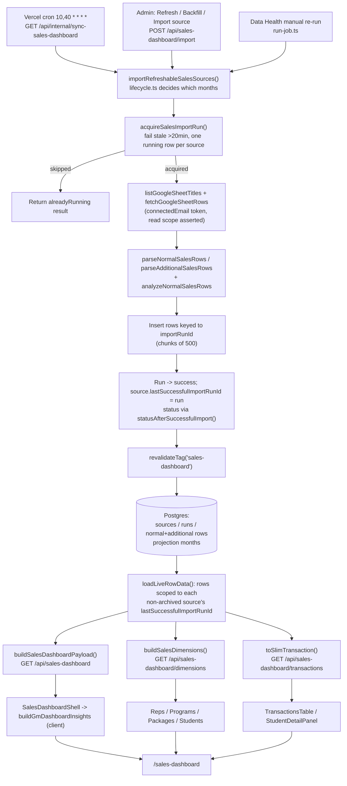

# Sales Dashboard

**Status: stable**

## Purpose

The Sales Dashboard turns the sales team's monthly Google Sheets into a governed Postgres dataset and renders a GM-facing readout on top of it: revenue pace against a monthly target, the trial → new-student → renewal pipeline, actual revenue against an imported Bear/Base/Bull scenario projection, and four drill-down tabs (Reps, Programs, Packages, Students) with per-row transaction drills and CSV exports.

It presents two kinds of surface. **Operations controls** are split between the page header and the "Data Sources & Imports" dialog. The header carries **Connect Google Sheets** (repeated on the first-run setup card) and **Refresh live months** (`src/components/sales-dashboard/sales-dashboard-shell.tsx:266-277`, `:293-301`, `:429-433`); the dialog wraps only `SourceManager` (`:363-390`), which holds seed / backfill, the projection-workbook config + import, the add-source form, per-source Import / Reopen / Archive, and Restore (`source-manager.tsx:84-91`, `:119-126`, `:154-163`, `:196-213`, `:249-254`). The **readout** is the Overview command center plus the breakdown tabs. The code does not separate those by role: there is one session gate for the whole feature, and the dialog is reachable by any signed-in user from the page header (`src/components/sales-dashboard/sales-dashboard-shell.tsx:280-283`). Who owns which surface is an organizational convention, not something the repo enforces.

The feature is **read-only against Google** on its own path — it imports sheets and never writes back to them. Write helpers exist in the shared Sheets layer this feature owns, but every caller of those is another feature (see the consumer table below). It is also read-only toward Wise: nothing here touches the Wise API.

The page is registered in the tool navigation under the `finance-revenue` section (`src/lib/navigation/tools.ts:205-211`) and gated by the normal session check (`src/app/(app)/sales-dashboard/page.tsx:8-13`). Restricted users reach it only if `/sales-dashboard` is in their `allowedPages`; the middleware matches both the page prefix and its `/api/sales-dashboard` namespace (`src/middleware.ts:34-62`).

**This feature owns the repo's Google integration layer.** `src/lib/sales-dashboard/sheets.ts` (Sheets REST helpers) and `src/lib/sales-dashboard/google-oauth.ts` (encrypted per-account token store, scope assertions, refresh) live here but are consumed across the codebase, along with the CSV utilities:

| Consumer | Imports |
|---|---|
| Auth (sign-in) | `storeGoogleOAuthTokenForUser` (`src/lib/auth.ts:53-54`), invoked on every successful Google sign-in |
| Leave Requests | `fetchGoogleSheetRows`, `hasSheetsReadScope`/`hasSheetsWriteScope` (`src/lib/leave-requests/sync.ts:4-5`); `updateGoogleSheetCell`, `MissingGoogleSheetsTokenError` (`src/lib/leave-requests/data.ts:5-6`); `getGoogleTokenStatus` (`src/app/api/leave-requests/route.ts:4`) |
| Post-Class Feedback / payouts | `getGoogleDriveAccessToken` (`src/lib/post-class-feedback/drive.ts:3`); `appendGoogleSheetRows` + `fetchGoogleSheetRows` (`payout-writer.ts:3-6`); `batchUpdateGoogleSpreadsheet`, `fetchGoogleSheetRows`, `listGoogleSheetProperties` (`payout-retirement.ts:7-11`); `hasDriveFileScope`/`hasSheetsWriteScope` (`dashboard.ts:15-18`, `payout-run.ts:7-10`); `serializeCsv` (`payout-plan.ts:4`); the `CsvExportButton` component (`src/components/post-class-feedback/deductions-tab.tsx:18`) |
| Home summary | `getGoogleTokenStatus` (`src/lib/home/summary.ts:11`) |
| Wise Activity Audit | reads `sales_dashboard_normal_rows` scoped to a source's `lastSuccessfulImportRunId` for package-sales reconciliation (`src/lib/wise-activity/reconciliation.ts:847-852`, `:939-944`) |
| Data Health | merges sales + projection run tables into the `sales_dashboard` job's health and history (`src/lib/data-health/dashboard.ts:179-180`, `:669-690`, `:771-772`); re-runs the job via the library functions (`src/lib/data-health/run-job.ts:65-75`) |
| US Universities, Student Report | `serializeCsv` / `sanitizeCsvFilename` / `downloadCsv` (`src/lib/us-universities/csv.ts:4`, `src/lib/student-report/csv.ts:1-6`, `src/components/student-report/student-report-workspace.tsx:39`) |
| Operational payout scripts (9) | Sheets helpers in `scripts/backfill-ledger-removed-retirement.ts:24`, `derive-payout-tutor-names.ts:42`, `inventory-payout-workbooks.ts:36`, `remove-netted-payout-rows.ts:43`, `repoint-payout-workbook-formulas.ts:31`, `restore-payout-workbook-formulas.ts:25`, `roll-payout-workbook-dates.ts:61`, `setup-payout-master-tabs.ts:25`; `getGoogleTokenStatus`/`hasDriveFileScope` in `verify-drive-upload.ts:35` |

Within `sheets.ts` itself, the bounded-range readers and most structural writers (`fetchGoogleSheetRange`, `inspectGoogleSheetRange`, `updateGoogleSheetRangeValues`, `batchUpdateGoogleSheetValues`) have callers only in the payout scripts and the module's own unit suite; `insertGoogleSheetRow` and `updateGoogleSheetRowValues` (`sheets.ts:373-399`, `:402-422`) have **no caller anywhere** in `src/` or `scripts/`. The feature also carries a dedicated **collaborator scope guard** (see [Business rules & edge cases](#business-rules--edge-cases)) that pins one GitHub collaborator to Sales Dashboard paths, enforced locally by a Claude Code hook and in CI.

## Conceptual data model

Seven owned tables plus one shared credential table, in four conceptual groups. Column-level detail, indexes, FK edges, and the ER diagram live in the canonical reference: **[docs/reference/database/erd-sales-dashboard.md](../reference/database/erd-sales-dashboard.md)** (enum values in [enums.md](../reference/database/enums.md), full column index in [index.md](../reference/database/index.md)). Migrations: `drizzle/0020_sales_dashboard.sql` (core tables + `google_oauth_tokens`), `0024_dashboard_sync_single_flight.sql` (single-running index), `0026_sales_dashboard_archival.sql` (soft archive), `0029_sales_dashboard_projection.sql` (projection tables).

- **Monthly sources.** One row per calendar month (`sales_dashboard_sources`) pointing at a Google spreadsheet and, optionally, explicit tab names. Each source carries one lifecycle state from `sales_dashboard_source_status` (`active | refreshing | finalized | reopened | archived`, `src/lib/db/schema.ts:152-158`) plus the id of its **last successful import run**, row counts, the last import error, and the Google account (`connectedEmail`) whose stored token reads the workbook. The state is load-bearing for the [month lifecycle](#month-lifecycle--which-sources-refresh): `finalized`/`archived` never refresh, `reopened` is sticky across imports, `refreshing` blocks archival. A partial unique index enforces one non-archived source per month (`schema.ts:643-645`).
- **Import runs and parsed rows.** `sales_dashboard_import_runs` is the append-only run log. A partial unique index allows only one `running` row per source — the database half of the single-flight guard (`schema.ts:666-668`). Each run writes two row tables: package sales (`sales_dashboard_normal_rows`) and ad-hoc extras (`sales_dashboard_additional_rows`). Rows are keyed to the run that produced them, and every read selects only rows belonging to each source's `lastSuccessfulImportRunId` (`src/lib/sales-dashboard/data.ts:869-901`), so a half-finished or failed run can never leak into the dashboard. Rows carry the untouched sheet row as a `raw` jsonb blob, which is never serialized to a client (see [PII and secrets](#pii-and-secrets)). That "current" pointer is a bare uuid with no FK.
- **Projection workbook.** A single active source (`sales_dashboard_projection_sources`, partial unique index on `status = 'active'`, `schema.ts:737-739`), its own run log (`sales_dashboard_projection_import_runs`, with its own single-running partial index at `schema.ts:758-760`), and per-scenario/per-month forecast rows (`sales_dashboard_projection_months`) covering revenue, student counts, hours, and room utilization for Bear/Base/Bull. The scenario *summary* block is not a table — it is persisted inside the run's `metadata` jsonb and rehydrated on read (`data.ts:801-809`, `:848`).
- **Shared credentials.** `google_oauth_tokens` (`schema.ts:587-597`) holds one row per Google account, keyed by email, with the tokens stored only as ciphertext (how they are encrypted is under [PII and secrets](#pii-and-secrets)). It is shared infrastructure written at sign-in for every allowed user, not Sales Dashboard-exclusive state; the sales ERD shows it as a stub node and its columns are expanded under `google_oauth_tokens` in [erd-core.md](../reference/database/erd-core.md).

Nothing in this domain is ever deleted: there is no `.delete()` under `src/lib/sales-dashboard/`, sources are archived rather than removed, and superseded runs keep their rows.

## API surface

Thirteen in-app endpoints plus one internal cron route. Every in-app handler opens with `auth()` and returns `401` without a session email; the cron route accepts a `CRON_SECRET` bearer and, on `POST` only, falls back to a session. Full request/response contracts, status codes, and side effects: **[docs/reference/api/sales-dashboard.md](../reference/api/sales-dashboard.md)**; the cron entry is also catalogued in [docs/reference/crons.md](../reference/crons.md).

| Method + path | Purpose |
|---|---|
| `GET /api/sales-dashboard` | Full aggregated landing payload: day aggregates, cohorts, reps, sources (including archived), projection, and the *viewer's* Google-token status. |
| `GET /api/sales-dashboard/dimensions` | Month-grain rep/program/package/student aggregates for the four workspace tabs; fetched lazily on first non-Overview tab. |
| `GET /api/sales-dashboard/transactions` | Paged, filtered slim transaction rows for drill-downs; page-size default and clamp are in the [API reference](../reference/api/sales-dashboard.md#get-apisales-dashboardtransactions). |
| `GET /api/sales-dashboard/transactions/export` | Same filter set over the full unpaginated result, returned as a UTF-8-BOM CSV attachment. |
| `POST /api/sales-dashboard/import` | The one manual-import endpoint: one source, the refreshable set (default), or a backfill of every source, selected by the request body — fields in the [API reference](../reference/api/sales-dashboard.md#post-apisales-dashboardimport). |
| `GET /api/sales-dashboard/import-runs` | Twenty most recent import runs. **No client consumer** — see below. |
| `GET, POST /api/sales-dashboard/sources` | List non-archived monthly sources / upsert one keyed by month. |
| `PATCH, DELETE /api/sales-dashboard/sources/{sourceId}` | Change lifecycle status (setting `active` on an archived source restores it; accepted values in the [API reference](../reference/api/sales-dashboard.md#patch-apisales-dashboardsourcessourceid)) / archive (soft delete). |
| `POST /api/sales-dashboard/sources/seed` | Seed the 14 built-in historical monthly sheets (Apr 2025 – May 2026). |
| `POST /api/sales-dashboard/projection-source` | Upsert the projection workbook config, or seed the default workbook when no URL is supplied. |
| `POST /api/sales-dashboard/projection-import` | Re-import the active projection workbook. |
| `GET, POST /api/internal/sync-sales-dashboard` | Cron entry point: refreshable sources, then the projection, wrapped in the `sales_dashboard` cron-invocation audit. |

Three notes. The CSV export is **not streamed**: `serializeCsv` materializes the whole file as one string and the route returns it in a single `new Response(csv, …)` (`src/lib/sales-dashboard/csv.ts:22-33`, `src/app/api/sales-dashboard/transactions/export/route.ts:51-60`). `GET /api/sales-dashboard/import-runs` is **dead API surface**: nothing under `src/components` or `src/app/(app)` fetches that path, because `SourceManager` renders per-source import status straight from the `sources[]` summary fields on the landing payload (`src/components/sales-dashboard/source-manager.tsx:185-193`); the handler and its query (`listRecentSalesDashboardImportRuns`, `data.ts:967-973`) work but have no caller. And four routes call Zod `.parse()` inside their `try` rather than the repo-standard `.safeParse()` → `400` with `.error.flatten()`: `sources` POST (`sources/route.ts:40`), `projection-source` (`projection-source/route.ts:23`), and `sources/[sourceId]` PATCH (`[sourceId]/route.ts:23`) surface a malformed body as a `400` with only the error message, while the `import` route's catch maps a Zod failure to **`500`** (`import/route.ts:37`, `:24-28`). The two transactions routes follow the convention (`transactions/route.ts:17-22`, `export/route.ts:43-48`).

The cron runs at `10,40 * * * *` (`vercel.json`), registered in the Data Health cron registry as job `sales_dashboard` with a 45-minute late threshold and `maxDurationSeconds: 800`, matching the route's `maxDuration = 800` (`src/lib/data-health/cron-registry.ts:78-92`, `src/app/api/internal/sync-sales-dashboard/route.ts:11`). The route inlines its own constant-time `CRON_SECRET` comparison rather than importing the shared `src/lib/internal/cron-auth.ts` helper (`route.ts:15-22`). The cron actor is the literal `cron@begifted.local` (`route.ts:26`); the import itself reads Google with each source's `connectedEmail` token, not a cron identity (`data.ts:465`, `:475-478`), so a revoked admin token surfaces as a `409` on the cron. Data Health's "run job" button bypasses the HTTP route and calls the same two library functions directly, recording the signed-in admin as the actor: `runDataHealthJob(jobKey, actorEmail)` falls back to `data-health@begifted.local` only when `actorEmail` is null (`run-job.ts:29`, `:67-73`), and its sole caller always passes `session.user.email` after a 401 gate (`src/app/api/data-health/jobs/[jobKey]/run/route.ts:14-17`, `:43`), so that literal is an unreachable fallback.

## UI

One page: `src/app/(app)/sales-dashboard/page.tsx`. The default export is a synchronous Server Component whose whole body is `<Suspense fallback={<SalesDashboardSkeleton />}>` (`:16-22`); the auth check lives in the inner async `SalesDashboardBody`, which `redirect("/login")`s without a session email and otherwise renders the client shell (`:7-14`). All data is fetched client-side.

- **`SalesDashboardShell`** (`src/components/sales-dashboard/sales-dashboard-shell.tsx`) owns the payload fetch (`/api/sales-dashboard`, `cache: "no-store"`, `:92`), the period state, the busy/error/message banners, the failed-source banner (`:316-325`), the Data Sources dialog, and the "Connect Google Sheets" button — a `signIn("google", …)` with `prompt: "consent"`, `access_type: "offline"`, and the **read-only** Sheets scope (`:50`, `:266-276`). It renders a first-run setup card when no sources or no imported rows exist (`:395-446`). Every mutation goes through `runAction`, which awaits the action, reloads the payload, and calls `invalidateSalesDimensions()` inside a single `try` (`:145-158`) — so only a *successful* mutation refreshes the client. When the action throws (a `409`/`500` from `/import`, say), the `catch` (`:153-154`) sets the error banner and neither reloads the payload nor invalidates the dimensions cache.
- **`PeriodToolbar`** — five presets (All / 2025 / 2026 / Q1 2026 / This Month) plus free-form from/to date inputs (`period-toolbar.tsx:12-18`). Two presets are hardcoded spans — `2025` is 2025-04-01..2025-12-31 and `Q1 2026` is 2026-01-01..2026-03-31 — while the other three are computed: `All` spans the min/max payment dates in the loaded payload (falling back to 2025-04-01..today), `2026` runs from 2026-01-01 to today, and `This Month` is the current Bangkok month (`sales-dashboard-shell.tsx:122-143`). Editing a date input drops the selection to "All" (`:309-310`).
- **`WorkspaceTabs`** — tab container syncing `?tab=` to the URL. Overview stays mounted; the four breakdown panels are lazy-mounted on first activation and kept mounted afterwards (`workspace-tabs.tsx:147-166`). It owns the single `useSalesDimensions()` instance (`:80`) and consumes GM cross-link "explore seeds": clicking a rep/program/package row in Overview switches tab, seeds the panel filter, and composes `?tab=`/`?rep=` in one `router.replace` (`:101-119`).
- **`SalesDashboardCommandCenter`** (Overview, `gm-command-center.tsx`) — revenue-pace surface with target/projected/needed-per-day, a GM exceptions rail, pipeline stats, actual-vs-projection chart, monthly revenue trend, sales-team table, and program/package/payment-day mix panels, all derived client-side by `buildGmDashboardInsights` (`:153`). Exports an "Overview CSV" (`buildOverviewExportRows`, `:74`). The target tile labels its provenance "Sheet target" or "Fallback" (`:206`).
- **Tabs** — `RepsTab`, `ProgramsTab`, `PackagesTab`, `StudentsTab` share a locked prop contract (`SalesTabProps`, `src/lib/sales-dashboard/types.ts:391-403`) and each embeds `TransactionsTable` for the drill and `CsvExportButton` for export. Reps honours a `?rep=` deep link and any display-name variant of a rep (`tabs/reps-tab.tsx:208-230`); Programs has an include-trials toggle and folds programs beyond the top 6 into "Other" (`tabs/programs-tab.tsx:33`, `:218`); Packages groups by hour band with a count/revenue histogram toggle; Students caps the visible list at 50 with an explicit "+N more" footer (`tabs/students-tab.tsx:45`, `:262`).
- **`TransactionsTable`** — paged fetch over `/api/sales-dashboard/transactions` with an AbortController, a per-filter-key cache, skeleton rows, and an explicit "+N more / Load all" footer; it never silently truncates. Load-all restarts from offset 0 (bounded to 3 restarts) when `total` shifts mid-loop because an import landed (`transactions-table.tsx:59-62`, `:175-197`). It subscribes to the dimensions invalidation counter and drops its cache when an import lands (`:118-132`).
- **`StudentDetailPanel`** — dialog below `xl`, right-hand side panel at `xl+` (`student-detail-panel.tsx:376-377`). Renders lifetime KPIs, the live status with the churn rule spelled out verbatim (`CHURN_RULE_TEXT`, `:45-46`, rendered at `:182`), a coverage-window renewal timeline from `buildCoverageWindows`, and the trial-conversion marker. One `TransactionsTable` fetch (page size 1000) serves both the purchase table and the timeline (`:338-343`).
- **`SourceManager`** — inside the Data Sources dialog: seed / backfill buttons, projection workbook config + import, an add-source form, and per-source rows with status badge, row counts, last import time, and the connected account (`source-manager.tsx:179-217`). Per-source actions are **Import** (`:196-200`), **Reopen** — rendered only when the source is `finalized` (`:201-207`) — and **Archive**, disabled while `refreshing` (`:208-213`); **Restore** lives in the collapsed archived-sources table (`:249-254`). There is **no Finalize control**: the only `patchJson` payloads in the file are `"reopened"` and `"active"`. The PATCH route accepts `"finalized"` (`[sourceId]/route.ts:10`), but no UI sends it — in practice finalization happens only automatically.
- **`ChartCanvas`** — the shared Chart.js wrapper. Colors are read from the OKLCH theme tokens at runtime (`chartColors()`); the hardcoded hexes are SSR-only fallbacks (`chart-canvas.tsx:27-31`). Because Chart.js cannot size itself inside a hidden tab, the canvas resizes whenever its panel is re-activated (`:80-82`).
- **`useSalesDimensions`** (`src/hooks/use-sales-dimensions.ts`) — a module-scope client cache for the dimensions payload, fetched once on first non-Overview activation and invalidated by the shell (`:18-34`, `:53-112`). It is deliberately module-scope rather than `globalThis`-anchored because it is client-only state (`:18-20`).

## Data flow

An import moves sheet → parser → Postgres → cache invalidation; a read moves Postgres → pure aggregator → cached payload → client.

```mermaid
flowchart TD
    Cron["Vercel cron 10,40 * * * *<br/>GET /api/internal/sync-sales-dashboard"] --> Refreshable
    Admin["Admin: Refresh / Backfill / Import source<br/>POST /api/sales-dashboard/import"] --> Refreshable
    DataHealth["Data Health manual re-run<br/>run-job.ts"] --> Refreshable

    Refreshable["importRefreshableSalesSources()<br/>lifecycle.ts decides which months"] --> Guard
    Guard["acquireSalesImportRun()<br/>fail stale >20min, one running row per source"] -->|skipped| Skip["Return alreadyRunning result"]
    Guard -->|acquired| Fetch

    Fetch["listGoogleSheetTitles + fetchGoogleSheetRows<br/>(connectedEmail token, read scope asserted)"] --> Parse
    Parse["parseNormalSalesRows / parseAdditionalSalesRows<br/>+ analyzeNormalSalesRows"] --> Insert
    Insert["Insert rows keyed to importRunId<br/>(chunks of 500)"] --> Promote
    Promote["Run -> success; source.lastSuccessfulImportRunId = run<br/>status via statusAfterSuccessfulImport()"] --> Invalidate
    Invalidate["revalidateTag('sales-dashboard')"] --> Store

    Store[("Postgres:<br/>sources / runs / normal+additional rows<br/>projection months")] --> Load
    Load["loadLiveRowData(): rows scoped to each<br/>non-archived source's lastSuccessfulImportRunId"] --> Payload
    Load --> Dims
    Load --> Slim

    Payload["buildSalesDashboardPayload()<br/>GET /api/sales-dashboard"] --> Shell
    Dims["buildSalesDimensions()<br/>GET /api/sales-dashboard/dimensions"] --> Tabs
    Slim["toSlimTransaction()<br/>GET /api/sales-dashboard/transactions"] --> Drill

    Shell["SalesDashboardShell -> buildGmDashboardInsights (client)"] --> UI
    Tabs["Reps / Programs / Packages / Students"] --> UI
    Drill["TransactionsTable / StudentDetailPanel"] --> UI
    UI["/sales-dashboard"]
```

Three cached read helpers sit on the same `loadLiveRowData()` pass, all tagged `sales-dashboard` with `cacheLife({ stale: 60, revalidate: 60, expire: 300 })`: `getSalesDashboardPayload` (`data.ts:919-924`), `getLiveSlimRows` (`:932-941`), and `getSalesDimensionsPayload` (`:948-965`). The landing payload additionally folds in the viewer's Google-token status and the projection payload (`:903-916`). Almost every mutation path calls `revalidateSalesDashboardCache()` (`data.ts:216`, `:278`, `:323`, `:352`, `:394`, `:545`, `:706`, `:723`), and the client mirrors that with `invalidateSalesDimensions()` after any import or source edit.

**One branch does not.** The failure path of `importSalesDashboardSource` marks the run `failed`, rolls the source back to `previousStatus` with `lastImportError` set, and rethrows — **without** revalidating (`data.ts:553-564`). The projection-import failure branch *does* revalidate (`data.ts:723`), so the two are inconsistent. Two things then delay the failed-source banner. First and most directly, the shell's `runAction` reloads the payload only when the action resolves (`sales-dashboard-shell.tsx:145-158`): a failed `/import` throws, the `catch` shows the error banner, and no reload happens until the next successful action or a page load. Second, when a reload does happen, the shell's `cache: "no-store"` governs only the browser fetch, not the server-side `"use cache"` entry, which is configured `cacheLife({ stale: 60, revalidate: 60, expire: 300 })` (`data.ts:922`); with no tag sweep on the failure path, the stale payload can be served until the 60-second revalidate window passes or some other mutation sweeps the tag. The exact lag is Next.js `cacheComponents` stale-while-revalidate behaviour, and no test exercises it (every route suite mocks `data.ts` wholesale — see [Tests](#tests)).

Sheet values are fetched `UNFORMATTED_VALUE` with `SERIAL_NUMBER` dates (`sheets.ts:128-145`), which is why the date parser has to understand Google serials (`dates.ts:80-84`). All month/day boundaries are computed in Bangkok time via helpers borrowed from Room Capacity (`dates.ts:1`).

## Business rules & edge cases

### Month lifecycle — which sources refresh

`src/lib/sales-dashboard/lifecycle.ts` is the whole policy, expressed in Bangkok time:

- A source refreshes only if it is the **current month**, or the **previous month within the first 7 days** of the new month; `finalized` and `archived` sources never refresh (`lifecycle.ts:8-19`).
- After a successful import the status is recomputed: current month → `active`; previous month on day ≤ 7 → `active`; **anything else** → `finalized`. There is no bound on the month in either direction, so a future-dated source created through the Save form is finalized on its first successful import exactly like a historical one. `reopened` and `archived` are sticky and survive the import (`lifecycle.ts:26-32`).
- From day 8 of the new month, a previous-month source that is neither `finalized`, `reopened`, nor `archived` — i.e. still `active`, or left in `refreshing` — is auto-finalized **instead of** being imported (`lifecycle.ts:39-41`, applied in `data.ts:576-579`).

This is the closing-the-books rule: once a month is finalized, a routine refresh cannot silently rewrite historical revenue. A manual import of a finalized source is refused unless the caller passes `allowFinalized` (`data.ts:426-428`; a second check after the guard also fails the freshly acquired run, `:445-455`). Two paths pass it, and the import route takes the flag straight off the request body (`import/route.ts:17`, `:59`):

1. **Backfill all** sets it unconditionally for every non-archived source (`data.ts:587-601`).
2. The **per-source Import button** sets it only when the source is finalized *and* the operator clears a browser `confirm` — `allowFinalized: source.status === "finalized" && window.confirm("Refresh finalized source?")` (`source-manager.tsx:197`).

So the closing-the-books rule is a speed bump for a deliberate human action, not a hard lock. New sources always start `active` — the ternary at `data.ts:198` has identical branches — and become `finalized` on their first successful import unless the month is the current one, or the previous one on day ≤ 7.

### Single-flight import guard (monthly sources only)

Two layers. In the database, a partial unique index permits one `running` run per source (`schema.ts:666-668`). In code, `acquireSalesImportRun()` first fails any run still `running` after 20 minutes — restoring the source's pre-import status from the run's `metadata.previousStatus` — then checks for a live running run and returns a `skipped: true, alreadyRunning: true` outcome rather than throwing (`import-guard.ts:6`, `:97-125`, `:168-216`). A unique-violation race (`23505`) falls back to the same skipped result (`:199-215`). Callers count only non-skipped results toward "imported sources" (`import/route.ts:20-22`).

On failure the run is marked `failed` with the error summary and the source is rolled back to `previousStatus` with `lastImportError` set — the previous successful run's rows stay live (`data.ts:553-564`). Because reads are scoped to `lastSuccessfulImportRunId`, **a failed import degrades to stale-but-correct data, never partial data** (`data.ts:869-901`).

**The projection import has only the database half.** `importSalesDashboardProjectionSource` inserts a `running` run directly (`data.ts:641-650`) with no stale-run sweep and no skip path. The partial unique index (`schema.ts:758-760`) still prevents two concurrent runs, but a run left `running` by a crash or function timeout is never cleared automatically, and every later projection import — including the cron's — hits the index. The insert throws, and both the projection-import route and the cron route map any non-`MissingGoogleSheetsTokenError` error to `500` carrying the driver's message (`projection-import/route.ts:23-27`, `sync-sales-dashboard/route.ts:62-66`), so the operator sees a unique-violation error until someone repairs the row. No test exercises this path, and the exact message text depends on how the neon-http driver surfaces the `23505` error. The monthly-source half of the cron completes first (`route.ts:53-56`), so sales rows keep refreshing while the projection is stuck.

### Sheet parsing — fail-soft on rows, strict on structure

- Data starts after a fixed header at row 3; the normal tab is `(1)PackageSales` with a legacy fallback of `SalesRecord`, and the extras tab is `(2)AdditionalSales` (`parser.ts:6-9`). An explicit per-source tab name is only **preferred**, not authoritative: `chooseSheetName` uses it when the workbook actually contains that title and otherwise falls through to the defaults (`data.ts:148-151`, applied at `:465-472`). A typo'd override is silently ignored rather than raised. A missing normal tab aborts the import (`data.ts:471`); a missing additional tab is tolerated and yields zero extra rows (`:472-479`).
- Two sheet generations coexist for the normal tab. Presence of a `Payment Date` column selects the English layout (which also requires an `Already Paid?` gate); otherwise the Thai column names are used (`parser.ts:83`, `:97-108`). The **additional** tab has no English branch — it reads `วันที่ชำระเงิน` / `ยอดชำระสุทธิ` only (`parser.ts:148`, `:157`), so an additional tab migrated to English headers would drop every row silently (no parseable payment date → skipped, `:149`).
- A normal row is dropped if it has no student nickname, no parseable payment date, or — in the new format — is not marked paid (`parser.ts:88-110`). "Paid" accepts `true`/`1`/`yes`/`paid` and any value containing `ชำระ` (`:35-39`).
- `parseSalesDate` handles `Date` instances, Google serials, ISO, and D/M/Y strings, each with its own early return (`dates.ts:86-105`). The year-2000 floor applies **only** to the loose `new Date(raw)` fallback (`:107-108`); the only serial guard is `value <= 0` (`:81`).
- Enrollment type is **derived**, not trusted: rows with an explicit Trial/New Student/Renewal value are left alone; otherwise, per student in payment-date order, `trial`-package rows become Trial, the first paid row immediately following a trial becomes New Student, and every other paid row becomes Renewal (`parser.ts:178-192`).
- Program names are mapped through a 58-entry lookup to the Wise-facing name, falling back to the raw name when unmapped (`parser.ts:195`, `program-map.ts:2-59`).
- Inserts go in chunks of 500 (`data.ts:153-162`).

### Churn: stored vs live

The import freezes a `churnStatus` on each student's latest row using a **14-day grace window** after the latest paid package's `validUntil`: within grace → `Active`; a payment after the deadline → `Retained`; otherwise `Churned`; all-trial or missing `validUntil` → `N/A` (`parser.ts:200-224`). That value is a point-in-time snapshot and goes stale the moment the clock moves.

In practice **nothing a user sees reads the frozen value.**

- The **Students tab and detail panel** recompute live: `computeLiveStatus()` applies the same validUntil + 14 d rule against today, adding `Pending` (paid but no `validUntil`) and `Trial-only` (no paid rows) (`cohorts.ts:57-90`, rule at `:34-36`, used by `dimensions.ts:353-355`). Both surfaces spell the rule out in the UI (`tabs/students-tab.tsx:402`, `:450-453`; `student-detail-panel.tsx:182`).
- The **Overview's pipeline panels** consume `data.trialCohort` / `data.retentionCohort` (`gm-insights.ts:247-251`), neither of which touches the frozen column: `buildRetentionCohort` derives each decision date from `validUntil` through `decisionDateFor` (`analytics.ts:173-200`), and `buildTrialCohort` pairs each student's first Trial row with `findConversion()` — the first New Student row strictly after that date (`analytics.ts:150-171`, `cohorts.ts:44-49`).
- The stored value's only consumer is `churnList`, plus the `churnedStudents` / `eligibleStudents` counts derived from it (`analytics.ts:295-302`, `:323-324`). A grep for `churnList|churnedStudents|eligibleStudents` across `src/` (excluding tests) hits only `analytics.ts` and the `types.ts` declarations — they are payload fields with **no consumer anywhere in the app**.

The Students directory is deliberately **whole-history** — the shell's period selector does not filter it (`tabs/students-tab.tsx:27-29`), and "Expiring soon" means the renewal decision date falls within the next 30 days (`:43`, `:90-96`).

### Identity is nickname-based

Students and reps are grouped by a normalized key — trim, lowercase, collapse internal whitespace (`cohorts.ts:21-32`). There is no Wise identity resolution here, so two students sharing a nickname collapse into one directory entry, and one student spelled two ways collapses correctly. The dimensions builder tracks every display variant and picks the most frequent as canonical (`dimensions.ts:60-84`), and the Students tab and detail panel surface the caveat rather than hiding it (`students-tab.tsx:450-453`). The same normalizers are applied in `filterSlimTransactions`, so a drill key always matches its aggregate (`dimensions.ts:450-462`). Additional-revenue rows feed only the additional mix and the student directory — never rep/program/package groupings — and a student with only additional rows is `Pending`, never guessed into a cohort (`dimensions.ts:100-109`, `:353-355`).

### Packages fail soft, projections fail loud

Package hours parse from English, abbreviated, or Thai hour tokens (or a bare number) into bands `Trial | 1-10h | 20h | 30h | 40h+ | Other` (`package-hours.ts:7`, `:21-27`). Anything unparseable lands in `Other`, is counted in `unparsedPackageCount`, and **keeps its revenue** (`:36-57`, `dimensions.ts:179`).

The projection workbook is the opposite: it is a structured financial model, so the parser throws on any structural or numeric surprise rather than guessing. Missing Bear/Base/Bull headers, a missing summary row, a non-numeric summary cell, missing month headers, a missing scenario block, or a missing metric row all abort the import (`projection.ts:57-63`, `:92-99`, `:135`, `:146-148`, `:176-181`). Only per-cell month values are tolerant (`optionalNumeric` → 0, `:65-70`). All three tabs must exist **by the names configured on the projection-source row** (`data.ts:603-612`); those names default to `Summary` / `What_If` / `Calc_Multi` only when the input is blank (`projection.ts:10-12`, `data.ts:252-254`) and are operator-editable (`source-manager.tsx:136-150`).

### Revenue target provenance and GM exceptions

The monthly target comes from the projection workbook's *Effective monthly revenue target* when a projection has been imported; `targetSource` records which (`data.ts:846-847`). The Overview falls back to a hardcoded ฿4,000,000 when there is no projection (`gm-insights.ts:15`, `:166`) and labels the tile "Fallback" (`gm-command-center.tsx:206`). The dimensions payload does **not** fall back — it returns `null` unless the target came from a projection (`dimensions.ts:382-384`), so the Reps tab's indicative pace-vs-target simply disappears rather than scoring reps against a placeholder (`tabs/reps-tab.tsx:162-192`).

Revenue pace projects month-end from a completion curve learned from *complete prior months only*, falling back to a linear day-of-month ratio when no samples exist (`analytics.ts:85-140`, `gm-insights.ts:171-177`). GM exceptions flag failed sources (critical), a missing import timestamp, data older than 90 minutes, being behind pace (critical when the projected gap exceeds 15 % of target), trial conversion under 35 %, retention under 50 %, and churn replacement below 1× (`gm-insights.ts:16`, `:322-400`, `:362`). Mix panels show the top 8 programs/packages by count (`:447`).

### PII and secrets

- The `raw` sheet blob is stored but **never serialized to a client**. `toSlimTransaction` / `toSlimAdditionalTransaction` build an explicit field list, guarded by unit tests (`dimensions.ts:390-433`).
- Google tokens are AES-256-GCM encrypted with a key derived from `AUTH_SECRET` and stored as `v1:iv:tag:ciphertext` (`google-oauth.ts:41-72`). Because the key is a SHA-256 of `AUTH_SECRET` (`:41-45`) and GCM checks the auth tag on decrypt (`:66-71`), rotating `AUTH_SECRET` should make every stored token undecryptable — that follows from the construction, but no test in the repo exercises rotation. Accessors assert the specific scope they need — read, write, or Drive — and raise an actionable `MissingGoogleSheetsTokenError` instead of letting Google return a bare 403 (`:200-203`, `:227-230`, `:259-262`). That error maps to HTTP **409** in the import, projection-import, and cron routes, distinguishing "reconnect Google" from a real 500.
- Tokens refresh two minutes before expiry; a refresh failure records `lastError` on the token row and surfaces in the payload's `token` block (`google-oauth.ts:14`, `:141-188`, `:276-293`). Outside a Next request context the post-refresh `revalidateTag` is swallowed so long-running scripts are not aborted (`:177-187`).
- Scope asymmetry worth knowing: the Auth.js provider requests the full `spreadsheets` scope plus `drive.file` at every sign-in (`src/lib/auth.ts:39`), but the shell's "Connect Google Sheets" button re-consents with `spreadsheets.readonly` only (`sales-dashboard-shell.tsx:50`). `storeGoogleOAuthTokenForUser` overwrites the stored `scope` with whatever the latest authorization returned (`google-oauth.ts:119`, `:132`).
- The cron route compares the bearer with `timingSafeEqual` after a length pre-check and allows a session only on `POST` — `GET` is cron-only (`route.ts:15-22`, `:24-42`, `:71-77`). On `POST` the session lookup runs before the missing-secret branch (`:29-33`), so a signed-in admin proceeds even when `CRON_SECRET` is unset; the `500 Server misconfigured` fires on `GET` whenever the secret is missing, but on `POST` only when there is also no session.

### Archival is soft and guarded

Sources are archived, never deleted. Archiving is refused while an import is `refreshing` (`data.ts:335-337`); restore is refused when another non-archived source already claims the month (`:365-376`) and returns the source to its pre-archive status unless that was `archived`/`refreshing` (`:379-381`). Archived sources are excluded from imports (`:410`), from the live row load (`:871`), and from GM failure counting (`gm-insights.ts:131-132`), but still appear in the source manager so the archive is visible. Re-saving a month re-points the existing non-archived source in place via `onConflictDoUpdate` on `(sourceMonth) WHERE archived_at IS NULL` (`data.ts:201-214`); the old runs' rows stay attached to the same source id.

### Collaborator scope guard

The feature is fenced off for a named external collaborator (`aoengnatchasmith-spec`). The repo states *what* is fenced, not *why*: `.claude/README.md:13` describes the template as blocking edits outside Sales Dashboard paths, protecting local secrets, and preventing production deploy/sync commands. Two independent enforcement points share the same five allowed path prefixes — `src/app/(app)/sales-dashboard/`, `src/app/api/sales-dashboard/`, `src/app/api/internal/sync-sales-dashboard/`, `src/components/sales-dashboard/`, `src/lib/sales-dashboard/`:

1. **Local Claude Code hook** — `.claude/hooks/sales-dashboard-guard.mjs` runs on `UserPromptSubmit` (reminder) and `PreToolUse`. It denies `Edit`/`Write`/`MultiEdit` outside those prefixes (`:126-138`), denies `Read` of `.env*`, `.vercel`, key material, and any `.xlsx`/`.xls` (`:17-27`, `:140-146`), and blocks a command list covering `vercel --prod`, force pushes, pushes to `main`/`master`, `git reset --hard`, destructive checkout/clean, broad `rm -rf`, curling production `/api/internal/sync-*` endpoints, and reading secrets via `cat`/`grep`/`sed` (`:29-66`). It is opt-in per machine: copy `.claude/collaborator-settings.local.template.json` to the git-ignored `.claude/settings.local.json` (`.claude/README.md:5-11`). Skipping that step skips the hook.
2. **CI gate** — `.github/workflows/sales-dashboard-scope.yml` pipes the PR's changed files into `scripts/check-sales-dashboard-scope.mjs` on every `pull_request` targeting `main`; the script no-ops for any other actor and exits non-zero listing every out-of-scope file when the actor is the collaborator (`check-sales-dashboard-scope.mjs:3-11`, `:79-104`). `.github/CODEOWNERS` assigns the whole repo to `@kasheesh711`, and the PR template carries a matching checkbox (`.github/pull_request_template.md:8`). The same script is exposed as `npm run guard:sales-dashboard-scope` (`package.json:36`).

The CI gate is the stronger of the two. Whether that job is a *required* status check — and therefore actually blocks the merge button — is GitHub branch-protection configuration, not visible in the repo.

## Tests

24 test files, all under `__tests__/` directories beside the code they cover; all run in the `unit` Vitest project (`npm test`) with `TZ` pinned to `Asia/Bangkok` (`vitest.config.ts:4`). There is no integration (testcontainers) suite for this feature.

**Library** (`src/lib/sales-dashboard/__tests__/`, 13 files):

| File | Covers |
|---|---|
| `parser.test.ts` | Spreadsheet-id extraction, both sheet generations, the paid gate, derived enrollment types and churn statuses, additional-row date filtering. |
| `analytics.test.ts` | Trial and retention cohort construction (grace deadline, not `validUntil`). |
| `cohorts.test.ts` | Key normalization, 14-day decision dates, conversion lookup, all five live-status branches, divergence from the stored `churn_status`. |
| `dimensions.test.ts` | Month-grain aggregation, rep funnels and top-5 + Other, package fail-soft, the slim serializers (including the `raw`-never-serialized guard), filtering, sort order, projection-target passthrough. |
| `gm-insights.test.ts` | Completion-curve projection, deterministic exceptions, previous-period deltas, actual-vs-projection rows. |
| `lifecycle.test.ts` | Refresh eligibility through day 7, auto-finalize on day 8, sticky `reopened`. |
| `import-guard.test.ts` | Acquire, skip-when-running, unique-violation race, stale-run failure with status restoration. |
| `package-hours.test.ts` | English/abbreviated/Thai hour formats, Trial band, fail-soft `Other`. |
| `projection.test.ts` | Label-driven workbook parsing and the strict structural failures. |
| `dates.test.ts` | Bangkok month boundaries, pure month-key arithmetic, short labels. |
| `csv.test.ts` | Quoting/escaping, CRLF, BOM, filename sanitization. |
| `sheets.test.ts` | Bounded-range reads, exact write payloads, atomic batch, RAW append without insert, structural requests, error propagation, no network for empty batches. |
| `student-journey.test.ts` | Coverage windows, gaps, open window, trial rows ignored, unsorted input. |

**Routes** (`src/app/api/sales-dashboard/__tests__/`, 3 files, plus `src/app/api/internal/sync-sales-dashboard/__tests__/route.test.ts`): `route.test.ts` imports handlers from exactly five routes — `GET` payload, `import`, `projection-import`, `projection-source`, and `PATCH`/`DELETE` on `sources/[sourceId]` (`:31-35`) — covering payload auth, backfill, per-source refresh and finalized protection, the 409 missing-token mapping, the no-op-before-configuration response, row-count summaries, archive/restore, and error surfacing. `dimensions-route.test.ts` covers auth, payload shape, error mapping, and a **text-level** check that `getSalesDimensionsPayload` contains the `"use cache"` / `cacheTag` / `cacheLife` directives (`:76-87`). `transactions-route.test.ts` covers auth, `400` on malformed dates, pagination, the 1000-row clamp, key-normalized filtering, and the `raw`-never-serialized guard for both the JSON and CSV routes. The cron suite covers cron-secret enforcement on `GET`, the cron happy path, admin-session `POST`, and the 409 mapping.

Three endpoints have **no route test**: `POST /api/sales-dashboard/sources/seed`, `GET, POST /api/sales-dashboard/sources`, and `GET /api/sales-dashboard/import-runs`. `seedDefaultSalesDashboardProjectionSource` appears in `route.test.ts` only as an unused `vi.mock` stub (`:13`).

**Components** (`src/components/sales-dashboard/__tests__/` and `tabs/__tests__/`, 7 files): the empty/setup state and the dialog placement of source controls, the Overview CSV export rows, the student detail panel (badge variants, conversion marker, timeline segments, rendering states), and one suite per tab covering that tab's pure helpers — month-range filtering, band summaries and mix shift, program tables/share segments/MoM movement, rep rails and pace-vs-target, student filtering/sorting — plus rendering smoke tests, seed consumption, and export-column contracts.

**`data.ts` is not exercised at all.** All four route suites `vi.mock("@/lib/sales-dashboard/data", …)` wholesale (`route.test.ts:5`, `dimensions-route.test.ts:6`, `transactions-route.test.ts:5`, `sync-sales-dashboard/__tests__/route.test.ts:5`), so none of its real code — import orchestration, lifecycle transitions, run-id row scoping, archival guards, the projection import — runs in any test.

## Open questions

- **`upsertSalesDashboardSource` has a dead ternary.** `data.ts:198` reads `status: sourceMonth === currentBangkokMonthStart(now) ? "active" : "active"`. Was a non-current month meant to be created `finalized`, or is "everything starts `active` and finalizes on first import" intentional with the ternary vestigial?
- **The seeded source list ends at May 2026.** `DEFAULT_SALES_SOURCES` covers Apr 2025 – May 2026 (`default-sources.ts:4-17`), so every month since has had to be added by hand through the Save form. Should the seed list be extended, or should a new month's source be created automatically (e.g. by the cron) from a naming convention?
- **Projection imports have no stale-run recovery.** Unlike monthly sources, a projection run left `running` by a timeout blocks every subsequent projection import via `sdpir_source_single_running_idx` until the row is repaired by hand (see [Single-flight import guard](#single-flight-import-guard-monthly-sources-only)). Should `acquireSalesImportRun`-style sweeping be extended to `sales_dashboard_projection_import_runs`?
- **Scope downgrade on reconnect.** Sign-in requests full `spreadsheets` + `drive.file` (`auth.ts:39`), but the shell's "Connect Google Sheets" re-consents with `spreadsheets.readonly` and the token store overwrites `scope` with the latest grant (`google-oauth.ts:119`, `:132`). Can an admin whose token Leave Requests or the payout writer depends on for write/Drive scope lose that scope by clicking the Sales Dashboard connect button? The repo cannot tell whether Google merges previously granted scopes here.
- **Row retention is unbounded.** Nothing prunes `sales_dashboard_normal_rows` / `sales_dashboard_additional_rows` from superseded runs, and the current month always satisfies `sourceShouldRefresh` (`lifecycle.ts:16`), so every cron pass that actually imports writes another full copy of that month's rows keyed to a fresh run id (`data.ts:485-515`) — up to 48 copies a day on the `10,40 * * * *` schedule; a pass that hits the single-flight skip or fails writes none. Is indefinite retention a deliberate audit decision, or does this need a retention job?
- **Three dead payload fields and the column behind them.** `churnList`, `churnedStudents`, and `eligibleStudents` are computed on every dashboard read from the frozen `churn_status` and consumed by nothing (see [Churn: stored vs live](#churn-stored-vs-live)). Remove them and the column, or keep the frozen value as an "as of last import" audit trail?
- **Additional-sales tab has no English-header branch** (`parser.ts:139-163`). Is the `(2)AdditionalSales` tab guaranteed to stay on Thai headers, or should it get the same format detection as the normal tab?
- **Two period presets are hardcoded spans.** `2025` and `Q1 2026` are literal date ranges while `All`, `2026`, and `This Month` are computed (`sales-dashboard-shell.tsx:122-143`), and the `PeriodToolbar` comment says fully computed presets are "a flagged follow-up pending owner sign-off" (`period-toolbar.tsx:7-9`). Is that still wanted, and who signs off?
- **Fallback target of ฿4,000,000** (`gm-insights.ts:15`) is used whenever no projection is imported. Whether that figure is still the business's target needs an owner. Should the Overview hide pace (as the Reps tab does) rather than score against a possibly stale constant?
- **Dead API and dead helpers.** `GET /api/sales-dashboard/import-runs` has no client; `insertGoogleSheetRow` and `updateGoogleSheetRowValues` in `sheets.ts` have no caller anywhere. Intended future use, or removable?
- **Collaborator guard longevity.** The guard hardcodes `aoengnatchasmith-spec` in `.claude/hooks/sales-dashboard-guard.mjs:6`, `scripts/check-sales-dashboard-scope.mjs:3`, and `.claude/README.md:3`. Whether that collaborator is still active is GitHub org state. Should the guard become configurable or be retired?
- **Should the Google layer move out of `src/lib/sales-dashboard/`?** The Sheets/OAuth/CSV modules are used by at least six other features and nine scripts but never written to by the Sales Dashboard itself. Promoting them to a shared `src/lib/google/` would also change the path prefix the scope guard depends on.

_Verified against main@0cd1e81 (clean tree) on 2026-09-02._
